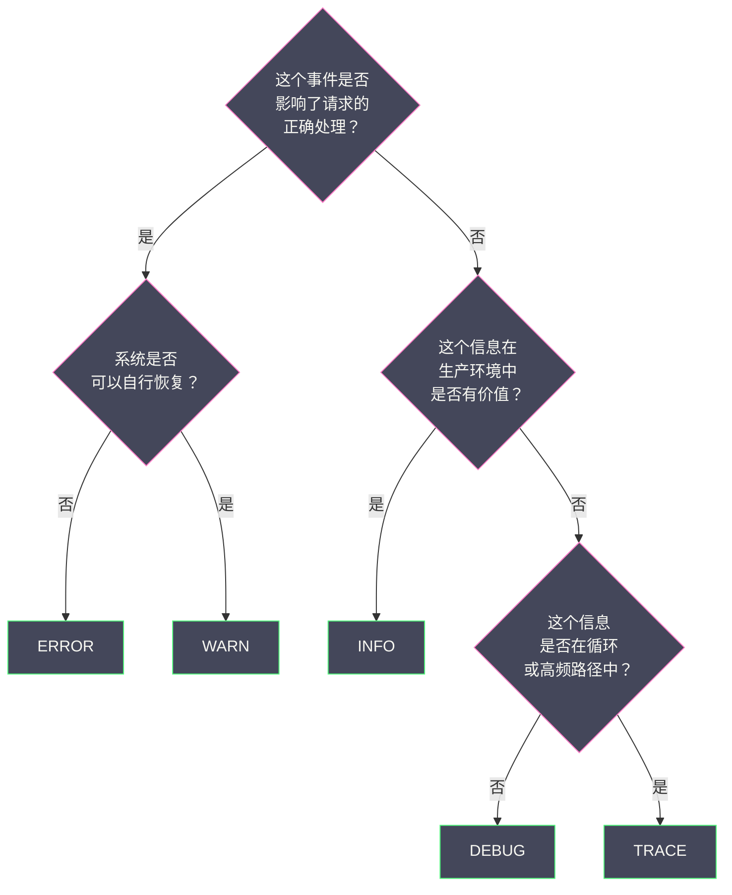
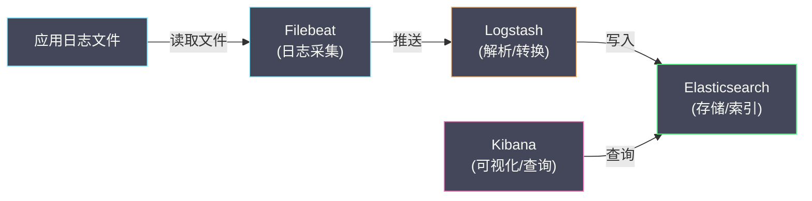

# 01 日志的本质与演进

**摘要：**

日志是软件系统中最古老的可观测性手段——早在"可观测性"这个概念出现之前，工程师就已经在用 `printf` 排查问题了。但正因为太过"日常"，日志的工程实践反而是最容易被忽视的：日志级别滥用、非结构化文本导致无法检索、日志量失控导致磁盘打满、多实例环境下日志分散在数十台机器上无法关联。本文从日志的本质定义出发，梳理从 Unix syslog 到现代结构化日志的演进脉络，深入讨论日志级别的精确语义、结构化日志的设计原则，以及从"单机日志文件"到"集中式日志平台"的架构演进动因。

---

## 第 1 章 日志的本质：离散事件的文本记录

### 1.1 日志的定义

**日志（Log）** 是系统在运行过程中产生的**带时间戳的离散事件记录**。每一条日志描述了"在某个时间点，系统发生了什么事"。

这个定义有三个关键词：

**带时间戳**：每条日志都有精确的时间信息（通常精确到毫秒或微秒），这使得日志可以按时间排序，还原事件的先后顺序。没有时间戳的文本输出不是日志——它只是 debug 打印。

**离散事件**：日志记录的是一个个独立的事件（"用户登录成功"、"数据库查询耗时 150ms"、"连接超时"），而不是连续的状态变化。这是日志与指标的根本区别——指标记录的是连续的数值变化（CPU 使用率从 30% 变为 80%），日志记录的是不可预测的独立事件。

**文本记录**：日志的载体是文本（人类可读或机器可解析的字符串）。这是日志的优势（灵活、易读），也是日志的劣势（非结构化文本难以高效检索和聚合）。

### 1.2 日志与其他可观测性信号的区别

| 维度 | 日志 (Logs) | 指标 (Metrics) | 链路追踪 (Traces) |
| :--- | :--- | :--- | :--- |
| **数据形态** | 离散事件文本 | 连续数值时间序列 | 请求级调用树 |
| **信息密度** | 高（可包含任意上下文）| 低（只有数值）| 中（结构化但有限字段）|
| **数据量** | 极大（每个事件一条）| 小（聚合后的数值）| 大（每个请求一棵树）|
| **查询模式** | 全文搜索 + 过滤 | 范围聚合（avg/sum/percentile）| 按 Trace ID 点查 |
| **典型问题** | "为什么这个请求失败了？" | "过去 1 小时的错误率是多少？" | "这个请求经过了哪些服务？" |
| **存储成本** | 最高 | 最低 | 高 |

日志的核心价值在于**信息密度高、灵活性强**——工程师可以在日志中记录任何认为有用的信息（请求参数、响应内容、异常堆栈、业务状态）。这种灵活性是指标和链路追踪无法替代的。但灵活性也意味着**缺乏结构**——如果每个工程师随意定义日志格式，大规模集中检索就变成了噩梦。

### 1.3 日志的分类

从来源和用途的角度，日志可以分为以下几类：

**应用日志（Application Log）**：应用代码中通过日志框架（如 [[Log4j]]、[[Logback]]、Zap）输出的日志。内容由开发者决定，通常包含业务逻辑信息、错误堆栈、调试信息。这是本专栏的主要关注对象。

**访问日志（Access Log）**：Web 服务器（如 Nginx、Tomcat）自动记录的每个 HTTP 请求的信息，通常包含客户端 IP、请求方法、URL、响应状态码、响应时间。格式相对固定（如 Nginx 的 Combined Log Format）。

**系统日志（System Log）**：操作系统内核和系统服务（如 systemd、cron）产生的日志，通过 [[syslog]] 协议管理。内容包括系统启动、服务状态变更、硬件错误等。

**审计日志（Audit Log）**：记录"谁在什么时间做了什么操作"，用于安全审计和合规。通常需要不可篡改、长期保留。

**数据库日志（Database Log）**：数据库系统的内部日志，如 MySQL 的 Slow Query Log、binlog、Error Log，PostgreSQL 的 WAL（Write-Ahead Log）。

---

## 第 2 章 日志技术的演进

### 2.1 史前时代：printf 与 stderr

最早的"日志"就是直接向标准输出（stdout）或标准错误（stderr）打印信息：

```c
// C 语言的 "日志"
fprintf(stderr, "ERROR: failed to connect to database, errno=%d\n", errno);
```

这种方式的问题显而易见：
- **没有日志级别**：无法区分"致命错误"和"调试信息"
- **没有结构化**：所有信息混在一个字符串中，无法按字段过滤
- **没有持久化**：进程退出后日志丢失（除非手动重定向到文件）
- **没有轮转**：日志文件会无限增长直到磁盘打满

### 2.2 Unix syslog：第一个日志标准

1980 年代，Eric Allman 在开发 Sendmail 邮件服务器时创建了 **syslog**——Unix/Linux 世界中第一个标准化的日志系统。syslog 引入了两个至今仍在使用的核心概念：

**Facility（设施）**：日志的来源类别（kern=内核、mail=邮件、auth=认证、local0~local7=自定义）。

**Severity（严重级别）**：日志的严重程度，定义了 8 个级别：

| 级别 | 数值 | 名称 | 含义 |
| :--- | :--- | :--- | :--- |
| 0 | Emergency | emerg | 系统不可用 |
| 1 | Alert | alert | 必须立即采取行动 |
| 2 | Critical | crit | 严重错误 |
| 3 | Error | err | 错误 |
| 4 | Warning | warning | 警告 |
| 5 | Notice | notice | 正常但值得注意 |
| 6 | Informational | info | 信息性消息 |
| 7 | Debug | debug | 调试信息 |

syslog 的设计理念是**将日志的产生和日志的处理分离**——应用通过 syslog API 发送日志，syslog daemon（如 rsyslog、syslog-ng）负责将日志写入文件、转发到远程服务器、或按规则过滤丢弃。这种分离式设计是现代日志架构的雏形。

### 2.3 Java 日志框架的混乱与统一

Java 生态的日志框架经历了一段特别混乱的历史，理解这段历史有助于理解当前 Java 日志体系的设计。

**第一阶段：JDK Logging（java.util.logging，简称 JUL）**

Java 1.4（2002 年）在标准库中引入了 `java.util.logging`。但它的 API 设计不够灵活（如日志级别名称不直观——用 `SEVERE`、`FINE` 而非 `ERROR`、`DEBUG`），且默认配置不方便，很快被社区弃用。

**第二阶段：Log4j 1.x 的统治**

Apache Log4j（2001 年发布）凭借更好的 API 设计、更灵活的配置（通过 XML 或 properties 文件配置 Appender、Layout、Filter）、更丰富的输出目标（文件、控制台、远程 syslog、SMTP），迅速成为 Java 日志的事实标准。

**第三阶段：SLF4J 的抽象层**

到了 2005 年，Java 生态面临一个尴尬的局面：JUL、Log4j 1.x、commons-logging 三个日志框架并存，不同的第三方库使用不同的日志框架，在同一个应用中需要同时配置多个日志系统。

Ceki Gülcü（Log4j 的原作者）创建了 **[[SLF4J]]（Simple Logging Facade for Java）**——一个纯粹的日志门面（Facade），只定义 API，不提供实现。应用代码只依赖 SLF4J API，具体的日志实现通过运行时绑定注入：

```java
// 应用代码：只依赖 slf4j-api
import org.slf4j.Logger;
import org.slf4j.LoggerFactory;

public class OrderService {
    private static final Logger logger = LoggerFactory.getLogger(OrderService.class);
    
    public void createOrder(Order order) {
        logger.info("创建订单: orderId={}, userId={}", order.getId(), order.getUserId());
        try {
            // 业务逻辑...
        } catch (Exception e) {
            logger.error("订单创建失败: orderId={}", order.getId(), e);
        }
    }
}
```

SLF4J 的设计与 [[OpenTelemetry]] 的 API/SDK 分离设计异曲同工——库的开发者只依赖 SLF4J API（轻量级、无传递依赖），应用的开发者选择具体的实现（Logback 或 Log4j2）。

**第四阶段：Logback 与 Log4j2 的双雄时代**

- **[[Logback]]**（2006 年）：Ceki Gülcü 创建的 SLF4J 原生实现，Spring Boot 的默认日志框架
- **[[Log4j]] 2.x**（2014 年）：Apache 社区重写的 Log4j，性能优秀（基于 Disruptor 的异步日志）

目前 Java 生态的日志标准架构是：**SLF4J（门面）+ Logback 或 Log4j2（实现）**。

### 2.4 结构化日志的崛起

传统日志是**非结构化的文本行**：

```
2024-01-01 10:00:00.150 INFO  [http-nio-8080-exec-1] c.e.OrderService - 创建订单: orderId=789, userId=456, amount=99.5
```

这行日志对人类可读性很好，但对机器检索非常不友好。如果想搜索"所有 userId=456 的订单创建日志"，需要对这行文本进行正则匹配——正则匹配在 TB 级日志中的性能是灾难性的。

**结构化日志（Structured Logging）** 是将日志的每个信息字段以明确的 key-value 格式记录，最常见的格式是 JSON：

```json
{
    "timestamp": "2024-01-01T10:00:00.150Z",
    "level": "INFO",
    "thread": "http-nio-8080-exec-1",
    "logger": "com.example.OrderService",
    "message": "创建订单",
    "orderId": "789",
    "userId": "456",
    "amount": 99.5,
    "traceId": "abc123def456"
}
```

结构化日志的优势：
- **高效检索**：日志平台可以对 `orderId`、`userId` 等字段建立索引，查询速度从秒级提升到毫秒级
- **精确过滤**：`userId = "456" AND level = "ERROR"` 这样的结构化查询比正则匹配精确且高效得多
- **机器可解析**：日志采集器（如 [[Filebeat]]、[[Fluentd]]）可以直接解析 JSON 格式，不需要复杂的 Grok 正则
- **与链路追踪联动**：`traceId` 作为独立字段，可以直接建索引，支持从日志跳转到链路追踪

结构化日志的代价：
- **体积增大**：JSON 格式比纯文本占用更多空间（字段名的重复开销），通常增加 30%~50%
- **人类可读性降低**：一行 JSON 不如格式化的文本直观（但可以通过 `jq` 等工具格式化查看）
- **需要全团队统一**：如果只有部分服务使用结构化日志，日志平台需要同时处理两种格式

> [!note] 结构化日志的工程建议
> 在新项目中，**强烈建议从第一天就使用结构化日志**（JSON 格式）。对于已有项目的迁移，可以分两步走：第一步，统一使用 SLF4J + Logback/Log4j2 作为日志框架；第二步，将 Logback/Log4j2 的 Layout 切换为 JSON Layout（如 Logback 的 `LogstashEncoder`，Log4j2 的 `JsonLayout`）。

---

## 第 3 章 日志级别的精确语义

### 3.1 为什么日志级别如此重要

日志级别不是"装饰品"——它是日志系统最重要的元数据之一。正确的日志级别使得：

- **生产环境可以通过级别过滤**：只输出 WARN 及以上级别的日志，减少日志量
- **日志平台可以按级别告警**：出现 ERROR 级别日志时自动触发告警
- **排查问题时可以临时开启 DEBUG**：不修改代码，通过配置中心动态调整日志级别

如果日志级别被滥用（如把所有日志都标为 INFO，或把正常业务流程标为 ERROR），上述所有能力都失效了。

### 3.2 各级别的精确定义

以 SLF4J 的五个级别为准（从低到高：TRACE、DEBUG、INFO、WARN、ERROR），给出每个级别的精确语义和使用场景：

**TRACE：最细粒度的追踪信息**

TRACE 用于记录代码执行的极细粒度轨迹，通常只在本地开发或临时排查特定问题时开启。

```java
// 适合 TRACE 的场景：
logger.trace("进入方法: calculateDiscount, params: userId={}, cartItems={}", userId, cartItems);
logger.trace("循环第 {} 轮, 当前累计折扣: {}", i, totalDiscount);
logger.trace("退出方法: calculateDiscount, result: {}", discount);
```

生产环境**永远不应该**开启 TRACE 级别——它产生的日志量会比 DEBUG 多一个数量级。

**DEBUG：开发调试信息**

DEBUG 用于记录对开发者有用的调试信息，如方法的输入输出、中间状态、条件分支的走向。

```java
// 适合 DEBUG 的场景：
logger.debug("查询用户信息: userId={}", userId);
logger.debug("缓存命中: key={}", cacheKey);
logger.debug("命中折扣规则: ruleId={}, discount={}%", rule.getId(), rule.getDiscount());
```

生产环境默认关闭 DEBUG，排查问题时可以通过动态配置临时开启特定 Logger 的 DEBUG 级别。

**INFO：关键业务事件**

INFO 是生产环境的默认级别，用于记录**关键的业务事件**——系统正常运行时，通过 INFO 日志就能了解系统的"心跳"。

```java
// 适合 INFO 的场景：
logger.info("订单创建成功: orderId={}, amount={}", orderId, amount);
logger.info("用户登录: userId={}, ip={}", userId, clientIp);
logger.info("定时任务完成: taskName={}, processedCount={}, duration={}ms", taskName, count, duration);
logger.info("服务启动完成: port={}, env={}", port, environment);
```

> [!warning] INFO 级别的常见滥用
> - **滥用一**：在循环体内打 INFO 日志。如果循环执行 10,000 次，就产生 10,000 条 INFO 日志。应该用 DEBUG 或在循环结束后用一条 INFO 汇总。
> - **滥用二**：把"请求到达"和"请求完成"都打 INFO。对于 QPS = 10,000 的服务，这意味着每秒 20,000 条 INFO 日志。应该只在请求完成时打一条（包含耗时信息），或使用访问日志（Access Log）。

**WARN：可恢复的异常状态**

WARN 表示系统遇到了非预期的情况，但**可以自行恢复**，不影响当前请求的正确处理。

```java
// 适合 WARN 的场景：
logger.warn("缓存不可用，降级为数据库查询: cacheHost={}", cacheHost);
logger.warn("重试第 {} 次: url={}, error={}", retryCount, url, e.getMessage());
logger.warn("请求参数缺失 'locale'，使用默认值 'zh-CN'");
logger.warn("配置项 'timeout' 未设置，使用默认值 3000ms");
```

WARN 日志不需要立即处理，但应该定期审查——如果某个 WARN 大量出现，可能意味着系统正在恶化。

**ERROR：不可恢复的错误**

ERROR 表示系统遇到了**无法自行恢复的错误**，当前请求或操作失败了。

```java
// 适合 ERROR 的场景：
logger.error("数据库连接失败: host={}, port={}", dbHost, dbPort, exception);
logger.error("支付回调验签失败: orderId={}, signature={}", orderId, signature);
logger.error("消息消费失败，已进入死信队列: messageId={}", messageId, exception);
```

ERROR 日志通常需要配合告警——当 ERROR 日志的出现频率超过阈值时，应该触发告警通知工程师处理。

### 3.3 日志级别的判定决策树



---

## 第 4 章 从单机到集中式：日志架构的演进

### 4.1 阶段一：本地文件 + SSH + grep

最原始的日志处理方式：应用将日志写入本地文件（如 `/var/log/myapp/app.log`），工程师通过 SSH 登录服务器，使用 `grep`、`tail`、`awk` 等命令查看和搜索日志。

```bash
# 查看最新的 100 行日志
tail -100 /var/log/myapp/app.log

# 搜索包含 "ERROR" 的行
grep "ERROR" /var/log/myapp/app.log

# 搜索特定用户的日志
grep "userId=456" /var/log/myapp/app.log | grep "ERROR"
```

这种方式在单机部署时勉强可用，但在微服务 + 多实例部署下完全崩溃：
- 50 个服务 × 4 个实例 = 200 台服务器，工程师需要 SSH 到每台服务器上搜索
- 不同服务器上的日志时间可能不同步（NTP 漂移）
- 服务器重启或扩缩容后，旧的日志可能丢失

### 4.2 阶段二：rsyslog + 集中存储

Unix syslog 协议支持**远程日志传输**——应用将日志发送到 rsyslog daemon，rsyslog 将日志转发到中央日志服务器。

```
应用 → rsyslog（本地）→ rsyslog（远程中央服务器）→ 日志文件
```

这解决了"日志分散在多台服务器"的问题，但中央服务器上仍然是纯文本文件，搜索效率低下。

### 4.3 阶段三：ELK 栈——日志平台的标配

2012 年前后，[[Elasticsearch]] + Logstash + Kibana（ELK 栈）的组合成为业界日志平台的事实标准，彻底改变了日志的使用方式。



ELK 栈的每个组件解决一个具体问题：

- **[[Filebeat]]**：轻量级日志采集器，部署在每个应用服务器上，监控日志文件的变化，将新增的日志行发送到 Logstash 或 Elasticsearch
- **Logstash**：日志处理管道，负责解析日志格式（如通过 Grok 正则从非结构化文本中提取字段）、转换字段（如将字符串时间戳转为 Date 类型）、过滤和路由
- **[[Elasticsearch]]**：分布式搜索引擎，将日志数据建立倒排索引，支持毫秒级的全文搜索和结构化查询
- **Kibana**：Web UI，提供日志搜索、可视化仪表盘、告警配置

ELK 栈的出现使得日志从"运维工具"升级为"可观测性平台的核心组件"——工程师不再需要 SSH 到服务器上用 grep 搜索，而是在浏览器中通过 Kibana 搜索所有服务的所有实例的日志，几秒钟内得到结果。

### 4.4 阶段四：Loki——重新定义日志存储的经济学

ELK 栈虽然强大，但有一个无法回避的问题：**成本**。Elasticsearch 需要对日志的每个字段建立倒排索引，这意味着大量的 CPU（分词和索引构建）和存储（索引数据通常与原始数据等大）开销。对于日志量大但搜索频率低的场景，这种"全索引"的策略存在巨大的浪费。

2018 年，[[Grafana]] 团队发布了 **[[Grafana Loki]]**，提出了一种完全不同的日志存储哲学：**只索引元数据标签（labels），不索引日志正文（content）**。

```
Elasticsearch 的策略：
  索引一切 → 任何字段都能毫秒级搜索 → 存储和计算成本高

Loki 的策略：
  只索引标签（如 service=order-service, level=ERROR）
  日志正文只存储不索引
  搜索时先按标签过滤出候选日志流，再在候选范围内做全文搜索
  → 标签查询毫秒级，正文搜索秒级 → 存储和计算成本低一个数量级
```

Loki 的设计理念是"**日志大部分时间不被查询，不值得为所有日志建立完整索引**"——只在需要查询时才做计算，用查询时间换存储成本。这与 [[Prometheus]] 的"高效存储时间序列"哲学一脉相承（Loki 团队和 Prometheus 团队有大量人员重叠）。

Loki 将在第 04 篇中详细剖析。

---

## 第 5 章 日志工程的常见反模式

### 5.1 反模式一：日志中记录敏感信息

```java
// ❌ 错误：记录了用户密码
logger.info("用户注册: username={}, password={}", username, password);

// ❌ 错误：记录了完整的信用卡号
logger.info("支付请求: cardNumber={}", cardNumber);

// ✅ 正确：脱敏后记录
logger.info("用户注册: username={}", username);
logger.info("支付请求: cardNumber=****{}", cardNumber.substring(cardNumber.length() - 4));
```

日志数据通常保留数天到数月，存储在 Elasticsearch 或对象存储中，访问控制可能不如数据库严格。将密码、身份证号、银行卡号等敏感信息写入日志，是严重的安全风险。

### 5.2 反模式二：catch 块中只记录 message，不记录堆栈

```java
// ❌ 错误：丢失了异常堆栈
try {
    processOrder(order);
} catch (Exception e) {
    logger.error("处理订单失败: " + e.getMessage());
}

// ✅ 正确：将异常对象作为最后一个参数传给 logger
try {
    processOrder(order);
} catch (Exception e) {
    logger.error("处理订单失败: orderId={}", order.getId(), e);
}
```

`e.getMessage()` 只返回异常的简短描述（如 "Connection refused"），丢失了**堆栈信息**——在哪一行代码、通过什么调用链触发的异常。SLF4J 约定：当最后一个参数是 `Throwable` 类型时，自动输出完整堆栈。

### 5.3 反模式三：字符串拼接而非参数化

```java
// ❌ 错误：字符串拼接（即使日志级别被关闭，拼接仍然执行）
logger.debug("查询结果: result=" + expensiveToString(result));

// ✅ 正确：参数化占位符（日志级别被关闭时，占位符不会被求值）
logger.debug("查询结果: result={}", result);
```

SLF4J 的参数化日志使用 `{}` 占位符，只有在日志级别允许输出时才调用参数的 `toString()` 方法。字符串拼接（`+`）无论日志级别如何都会执行，在高频路径中可能带来不可忽视的性能开销。

### 5.4 反模式四：日志量失控

```java
// ❌ 错误：在循环中打 INFO 日志
for (Item item : items) {  // items 可能有 10,000 个
    logger.info("处理商品: itemId={}", item.getId());
    process(item);
}

// ✅ 正确：循环内使用 DEBUG，循环后用 INFO 汇总
for (Item item : items) {
    logger.debug("处理商品: itemId={}", item.getId());
    process(item);
}
logger.info("批量处理完成: totalItems={}, duration={}ms", items.size(), duration);
```

日志量失控是生产环境最常见的问题之一。一个 QPS = 1000 的服务，如果每个请求打 10 条 INFO 日志，每秒就产生 10,000 条日志。按每条 200 字节计算，每秒 2 MB，每天 172 GB——单个服务就能填满一个中等规模的 Elasticsearch 集群。

---

## 参考资料

1. Lonning, R. (2009). *The Art of Logging*. USENIX ;login:.
2. SLF4J Manual：https://www.slf4j.org/manual.html
3. Logback Configuration：https://logback.qos.ch/manual/configuration.html
4. Log4j2 Architecture：https://logging.apache.org/log4j/2.x/manual/architecture.html
5. RFC 5424 - The Syslog Protocol：https://tools.ietf.org/html/rfc5424
6. Elastic Stack Documentation：https://www.elastic.co/guide/index.html
7. Grafana Loki Documentation：https://grafana.com/docs/loki/latest/
