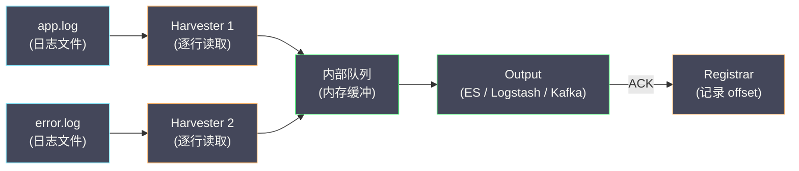
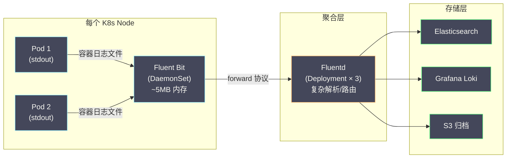

# 02 日志采集架构对比

**摘要：**

日志从应用进程产生，到最终可在日志平台中被检索，中间需要经过**采集 → 解析 → 路由 → 传输**四个环节。负责这些环节的组件统称为**日志采集器（Log Collector / Log Shipper）**。当前主流的日志采集器包括 [[Filebeat]]、[[Fluentd]]、Fluent Bit、[[OpenTelemetry]] Collector 和 Vector，它们在架构设计、资源消耗、生态兼容性上各有取舍。本文从日志采集的核心需求出发，逐一剖析每种采集器的设计哲学和内部机制，最终给出不同场景下的选型建议。

---

## 第 1 章 日志采集的核心需求

### 1.1 采集器要解决的五个问题

一个合格的日志采集器必须解决以下五个问题：

**问题一：如何发现和读取日志？**

应用的日志可能以多种形式存在：
- **文件**：最常见的形式，应用通过日志框架将日志写入本地文件（如 `/var/log/myapp/app.log`）
- **标准输出（stdout/stderr）**：容器化部署中的推荐方式——应用将日志输出到 stdout，容器运行时（Docker/containerd）将 stdout 重定向到宿主机的日志文件
- **网络（TCP/UDP/HTTP）**：应用直接通过网络发送日志（如 syslog 协议、HTTP POST）
- **系统日志**：通过 journald（systemd 的日志管理器）或 Windows Event Log 获取

采集器需要支持这些不同的日志源，并且能够可靠地追踪读取位置（offset），确保**不丢失、不重复**。

**问题二：如何解析非结构化日志？**

并非所有应用都输出结构化日志（JSON）。大量遗留系统输出的是非结构化文本（如 Nginx access log、Java 异常堆栈）。采集器需要将非结构化文本解析为结构化字段，常用的解析方式：

- **正则表达式（Grok）**：通过预定义的正则模式提取字段
- **JSON 解析**：直接解析 JSON 格式的日志
- **分隔符解析**：按空格、逗号等分隔符拆分字段
- **多行合并（Multiline）**：将 Java 异常堆栈等跨越多行的日志合并为一条

**问题三：如何路由和过滤？**

不同来源的日志可能需要发送到不同的目标：
- 应用日志 → Elasticsearch / Loki
- 安全审计日志 → 专用的审计存储
- 调试日志 → 直接丢弃（不占用存储）

采集器需要支持基于日志内容或元数据的**路由规则**和**过滤条件**。

**问题四：如何保证可靠传输？**

网络不可靠——采集器到后端之间的连接可能中断。采集器需要：
- **本地持久化缓冲**：在网络中断时将数据暂存到本地磁盘
- **重试机制**：连接恢复后自动重新发送
- **At-least-once 语义**：确保日志不丢失（可能有少量重复）
- **背压处理**：当后端过载时，采集器不能无限堆积数据导致自身 OOM

**问题五：如何最小化资源消耗？**

采集器部署在每个应用节点上（作为 DaemonSet 或 Sidecar），它的资源消耗直接影响业务应用的可用资源。理想的采集器应该：
- CPU 占用极低（通常 < 5% 单核）
- 内存占用极低（通常 < 50 MB）
- 磁盘 I/O 最小化（避免频繁的文件系统操作）

---

## 第 2 章 Filebeat：Elastic 生态的轻量级采集器

### 2.1 设计定位

[[Filebeat]] 是 Elastic 公司开发的轻量级日志采集器，属于 Beats 家族（还有 Metricbeat、Packetbeat 等）。Filebeat 的设计哲学是**极致轻量**——只负责"读取文件 → 发送到目标"，不做复杂的解析和转换（复杂处理交给 Logstash 或 Elasticsearch 的 Ingest Pipeline）。

### 2.2 核心机制：Harvester + Registrar

Filebeat 的内部由两个核心组件协作：

**Harvester（收割器）**：每个被监控的日志文件对应一个 Harvester 线程。Harvester 逐行读取文件内容，将每一行封装为一个 Event，发送到内部队列。

**Registrar（注册器）**：维护每个文件的读取状态（文件路径、inode、当前 offset），持久化到本地的 `data/registry` 文件中。当 Filebeat 重启时，从 Registry 中恢复上次的读取位置，避免重复读取。



**关键设计：ACK 后才更新 offset**

Filebeat 采用**At-least-once**语义：Harvester 将 Event 发送到 Output 后，只有收到后端的 ACK（确认收到）后，Registrar 才更新该文件的 offset。如果 Filebeat 在发送后、收到 ACK 前崩溃，重启后会从上次确认的 offset 重新读取——可能导致少量重复，但不会丢失。

### 2.3 Filebeat 的 Modules 系统

Filebeat 提供了丰富的 **Modules**，为常见的日志源（Nginx、MySQL、Kafka、System 等）预配置了：
- 日志文件路径
- 多行合并规则（如 Java 堆栈）
- Ingest Pipeline（Elasticsearch 端的解析规则）
- Kibana 仪表盘模板

```yaml
# filebeat.yml 中启用 Nginx Module
filebeat.modules:
  - module: nginx
    access:
      enabled: true
      var.paths: ["/var/log/nginx/access.log"]
    error:
      enabled: true
      var.paths: ["/var/log/nginx/error.log"]

output.elasticsearch:
  hosts: ["elasticsearch:9200"]
```

### 2.4 Filebeat 的局限性

**局限一：解析能力弱**。Filebeat 本身只支持简单的处理（添加字段、删除字段、正则匹配过滤），复杂的日志解析（如 Grok 正则提取）需要依赖 Logstash 或 Elasticsearch 的 Ingest Pipeline。

**局限二：输出目标有限**。Filebeat 原生支持的 Output 主要是 Elastic 生态（Elasticsearch、Logstash、Kafka）。虽然也支持 Redis 和文件输出，但不支持直接发送到 Loki、ClickHouse 等非 Elastic 后端。

**局限三：Elastic 生态绑定**。Filebeat 的 Modules、Dashboard、Ingest Pipeline 都深度绑定 Elastic Stack。如果后端不是 Elasticsearch，这些功能都无法使用。

---

## 第 3 章 Fluentd：CNCF 的日志收集标准

### 3.1 设计定位

[[Fluentd]] 是由 Treasure Data 创建、后捐赠给 CNCF 的开源日志收集器。Fluentd 的设计哲学是**统一日志层（Unified Logging Layer）**——作为所有日志源和所有日志目标之间的"万能适配器"。

与 Filebeat 的"轻量但功能有限"不同，Fluentd 的定位是"功能全面的日志处理管道"——它同时承担了 Filebeat（采集）+ Logstash（解析/路由）的双重职责。

### 3.2 核心架构：Input → Buffer → Output

Fluentd 的数据处理流程：

```
Input Plugin → Parser → Filter → Buffer → Output Plugin
              （解析）    （过滤/修改）（缓冲）  （发送到目标）
```

**Input Plugin（输入插件）**：定义日志的来源。常用的 Input Plugin：
- `in_tail`：监控文件尾部（类似 `tail -f`）
- `in_forward`：接收其他 Fluentd/Fluent Bit 通过 forward 协议发送的数据
- `in_http`：接收 HTTP POST 请求
- `in_syslog`：接收 syslog 协议数据

**Filter Plugin（过滤插件）**：对事件进行修改或过滤。常用的 Filter Plugin：
- `filter_record_transformer`：添加/修改/删除字段
- `filter_grep`：按正则表达式过滤事件
- `filter_parser`：对事件中的某个字段进行二次解析（如将 JSON 字符串展开为字段）

**Buffer Plugin（缓冲插件）**：在 Output 之前缓冲数据，提供可靠性保证。支持两种缓冲模式：
- **memory**：纯内存缓冲，性能最优但 Fluentd 崩溃时数据丢失
- **file**：文件缓冲，Fluentd 崩溃后可恢复

**Output Plugin（输出插件）**：定义日志的目标。Fluentd 的最大优势在于其庞大的插件生态——官方和社区提供了 **700+** 个 Output Plugin，覆盖几乎所有主流的日志存储和消息系统：

| Output Plugin | 目标 |
| :--- | :--- |
| `out_elasticsearch` | Elasticsearch |
| `out_loki` | Grafana Loki |
| `out_kafka` | Apache Kafka |
| `out_s3` | AWS S3 / MinIO |
| `out_clickhouse` | ClickHouse |
| `out_forward` | 其他 Fluentd 实例（级联部署）|

### 3.3 Fluentd 的标签路由机制

Fluentd 使用 **Tag（标签）** 来路由事件。每个事件都有一个 Tag（如 `nginx.access`、`myapp.error`），Fluentd 的配置通过 `<match>` 和 `<filter>` 块的 Tag 模式匹配来决定事件的处理流程：

```xml
<!-- Fluentd 配置示例 -->

<!-- 输入：监控应用日志文件 -->
<source>
  @type tail
  path /var/log/myapp/app.log
  tag myapp.log
  <parse>
    @type json
  </parse>
</source>

<!-- 过滤：为所有 myapp.* 标签的事件添加 hostname 字段 -->
<filter myapp.**>
  @type record_transformer
  <record>
    hostname "#{Socket.gethostname}"
  </record>
</filter>

<!-- 输出：ERROR 级别发送到 Elasticsearch -->
<match myapp.**>
  @type elasticsearch
  host elasticsearch
  port 9200
  logstash_format true
  <buffer>
    @type file
    path /var/log/fluentd/buffer
    flush_interval 5s
  </buffer>
</match>
```

### 3.4 Fluentd 的局限性

**局限一：资源消耗较高**。Fluentd 使用 Ruby 编写，运行在 CRuby 解释器上，单进程内存占用通常在 **50~200 MB**，CPU 效率不如 Go 或 Rust 编写的采集器。对于资源敏感的边缘节点或 IoT 设备，Fluentd 可能过于"重量级"。

**局限二：Ruby 的 GIL 限制**。CRuby 的全局解释器锁（GIL）限制了 Fluentd 的多核并行能力。虽然 Fluentd 使用多线程处理不同的 Input/Output，但 CPU 密集型操作（如复杂的正则解析）无法充分利用多核。

这些局限直接催生了 Fluent Bit 的诞生。

---

## 第 4 章 Fluent Bit：为容器和边缘设计的超轻量采集器

### 4.1 设计定位

**Fluent Bit** 是 Fluentd 的"精简版"，由同一个社区（Fluent 项目，CNCF 毕业项目）开发。Fluent Bit 使用 **C 语言**编写，设计目标是：

- **极致轻量**：内存占用通常 < 10 MB（是 Fluentd 的 1/10 ~ 1/20）
- **高性能**：C 语言的执行效率远高于 Ruby
- **嵌入式友好**：可以运行在 IoT 设备、边缘节点等资源受限的环境

### 4.2 Fluent Bit vs Fluentd

| 维度 | Fluent Bit | Fluentd |
| :--- | :--- | :--- |
| **语言** | C | Ruby + C（核心部分）|
| **内存占用** | ~5-10 MB | ~50-200 MB |
| **插件数量** | ~100 | ~700+ |
| **插件开发** | C 或 Go（外部插件）| Ruby |
| **解析能力** | 中等（内置 JSON、正则、Multiline）| 强（Ruby 表达力强）|
| **适用场景** | 边缘采集、DaemonSet | 聚合层、复杂处理 |
| **Kubernetes 集成** | 原生支持 K8s 元数据注入 | 需要插件 |

### 4.3 经典的 Fluent Bit + Fluentd 级联架构

在 [[Kubernetes]] 环境中，一种经典的日志采集架构是 **Fluent Bit（DaemonSet）→ Fluentd（Aggregator）→ 后端存储**：



这种架构的优势：
- **节点资源最小化**：Fluent Bit 只消耗 5~10 MB 内存，对业务 Pod 影响最小
- **复杂逻辑集中处理**：Fluentd 作为聚合层承担解析、路由、过滤等 CPU 密集操作，可以独立扩缩容
- **后端灵活性**：聚合层可以同时向多个后端发送数据

### 4.4 Kubernetes 日志采集的特殊性

在 Kubernetes 环境中，日志采集有一些特殊要求：

**容器日志的存储路径**：当应用将日志输出到 stdout/stderr 时，容器运行时（如 containerd）会将日志写入宿主机的特定路径：

```
# containerd 的日志路径
/var/log/pods/<namespace>_<pod-name>_<pod-uid>/<container-name>/<restart-count>.log

# Docker 的日志路径
/var/lib/docker/containers/<container-id>/<container-id>-json.log
```

Fluent Bit 的 `tail` Input 可以配置监控这些路径，自动采集所有容器的日志。

**Kubernetes 元数据注入**：裸的容器日志只包含日志文本，不包含 Pod 名称、Namespace、Node 名称、Labels 等 Kubernetes 元数据。Fluent Bit 提供了 **kubernetes filter**，通过查询 Kubernetes API Server，自动为每条日志注入以下元数据：

```json
{
    "log": "2024-01-01 10:00:00 INFO OrderService - 创建订单",
    "kubernetes": {
        "pod_name": "order-service-7b9f5d6c4-xk2m9",
        "namespace_name": "production",
        "container_name": "order-service",
        "labels": {
            "app": "order-service",
            "version": "v2.1.0"
        },
        "node_name": "worker-node-03"
    }
}
```

这些元数据对日志的过滤和路由至关重要——例如，按 namespace 将不同环境（dev/staging/production）的日志路由到不同的存储后端。

---

## 第 5 章 OpenTelemetry Collector：统一采集的新趋势

### 5.1 OTel Collector 的日志采集能力

[[OpenTelemetry Collector]] 在链路追踪和指标采集方面已经非常成熟（参见 [[03 OpenTelemetry 统一标准]]），其日志采集能力也在快速完善。OTel Collector 通过 **Filelog Receiver** 支持文件日志采集：

```yaml
# OTel Collector 配置：采集日志文件
receivers:
  filelog:
    include:
      - /var/log/myapp/*.log
    start_at: beginning
    operators:
      - type: json_parser      # 解析 JSON 格式的日志
      - type: timestamp         # 提取时间戳
        parse_from: attributes.timestamp
        layout: "%Y-%m-%d %H:%M:%S"
      - type: severity_parser   # 提取日志级别
        parse_from: attributes.level

exporters:
  loki:
    endpoint: http://loki:3100/loki/api/v1/push
    labels:
      attributes:
        service.name: ""
        level: ""

service:
  pipelines:
    logs:
      receivers: [filelog]
      exporters: [loki]
```

### 5.2 OTel Collector 的独特优势

**优势一：三种信号统一采集**

一个 OTel Collector 实例可以同时采集 Traces、Metrics、Logs 三种信号，不需要为每种信号部署独立的采集器。这减少了节点上的 Agent 数量和运维复杂度。

**优势二：原生 OTLP 支持**

应用通过 OTel SDK 产生的日志可以直接通过 OTLP 协议发送到 Collector，不需要经过文件中转。这种方式的日志天然包含 Trace ID、Span ID 等关联信息，不需要额外的解析步骤。

**优势三：标准化的数据模型**

OTel 为日志定义了标准的数据模型（Log Record），包含 Timestamp、Severity、Body、Attributes、Resource、Trace ID、Span ID 等字段。这种标准化使得日志数据在不同后端之间的迁移更加容易。

### 5.3 OTel Collector 的局限性

**局限一：Filelog Receiver 的成熟度**。相比 Filebeat 和 Fluent Bit 经过多年生产验证的文件监控机制，OTel Collector 的 Filelog Receiver 相对年轻，在极端场景（文件轮转、符号链接、高吞吐量）下可能存在稳定性风险。

**局限二：日志处理能力有限**。OTel Collector 的 Processor 主要面向 Traces 和 Metrics 设计，对日志的处理能力（如复杂的 Grok 解析、条件路由）不如 Fluentd 和 Logstash 丰富。

---

## 第 6 章 Vector：Rust 编写的新生代

### 6.1 设计定位

**Vector** 是由 Datadog 开发的开源日志/指标收集器，使用 **Rust** 编写。Vector 的设计哲学是"**一个工具替代 Filebeat + Logstash + Telegraf**"——同时支持日志和指标的采集、转换、路由。

### 6.2 Vector 的核心优势

**性能**：Rust 的零成本抽象和无 GC 特性使 Vector 在吞吐量和延迟上都优于 Go（Fluent Bit）和 Ruby（Fluentd）编写的采集器。Vector 官方的 benchmark 显示，在相同的硬件上，Vector 的吞吐量是 Fluentd 的 10 倍以上。

**VRL（Vector Remap Language）**：Vector 提供了一种专用的数据转换语言 VRL，替代 Logstash 的 Ruby DSL 和 Fluentd 的 Filter Plugin。VRL 的优势是**编译时检查**——语法错误在配置加载时就会报告，而不是在运行时才发现。

```toml
# Vector 配置示例
[sources.myapp]
type = "file"
include = ["/var/log/myapp/*.log"]

[transforms.parse]
type = "remap"
inputs = ["myapp"]
source = '''
  . = parse_json!(.message)
  .hostname = get_hostname!()
  del(.password)  # 脱敏：删除密码字段
'''

[sinks.loki]
type = "loki"
inputs = ["parse"]
endpoint = "http://loki:3100"
labels.service = "{{ service_name }}"
labels.level = "{{ level }}"
```

**端到端确认（End-to-End Acknowledgement）**：Vector 提供了从 Source 到 Sink 的端到端确认机制——只有 Sink 确认数据已成功写入后端后，Source 才更新读取位置。这比 Filebeat 的"发送后等待 ACK"更加可靠。

### 6.3 Vector 的局限性

**社区生态**：Vector 相比 Fluentd（CNCF 毕业项目）和 Filebeat（Elastic 官方支持），社区规模和生态成熟度仍有差距。

**Datadog 商业风险**：Vector 由 Datadog（商业 APM 公司）主导开发，社区对其长期开源策略存在一定的不确定性。

---

## 第 7 章 选型决策

### 7.1 综合对比

| 维度 | Filebeat | Fluentd | Fluent Bit | OTel Collector | Vector |
| :--- | :--- | :--- | :--- | :--- | :--- |
| **语言** | Go | Ruby + C | C | Go | Rust |
| **内存占用** | ~30 MB | ~100 MB | ~5 MB | ~50 MB | ~20 MB |
| **吞吐量** | 中 | 低 | 高 | 中 | 最高 |
| **插件生态** | Elastic 生态 | 最丰富（700+）| 中等（100+）| 快速增长 | 中等 |
| **日志解析** | 弱 | 强 | 中 | 中 | 强（VRL）|
| **Traces/Metrics** | 否 | 否 | 部分 | 是 | 部分 |
| **K8s 集成** | 良好 | 良好 | 优秀 | 良好 | 良好 |
| **社区/商业支持** | Elastic | CNCF | CNCF | CNCF | Datadog |

### 7.2 场景化推荐

**场景一：已有 ELK 栈，Java/Spring Boot 为主**
→ **Filebeat** + Elasticsearch Ingest Pipeline。成熟稳定，Elastic 生态内的最佳组合。

**场景二：Kubernetes 环境，多后端（ES + Loki + S3）**
→ **Fluent Bit（DaemonSet）+ Fluentd（Aggregator）**。CNCF 标准方案，Fluent Bit 轻量采集，Fluentd 负责复杂路由。

**场景三：追求统一可观测性（Traces + Metrics + Logs）**
→ **OTel Collector**。一个 Agent 采集三种信号，减少运维复杂度。适合正在建设可观测性体系的新项目。

**场景四：资源极度敏感（边缘设备/IoT）**
→ **Fluent Bit** 单独部署。5 MB 内存占用，C 语言性能优秀。

**场景五：高吞吐 + 复杂转换逻辑**
→ **Vector**。Rust 性能最优，VRL 转换语言表达力强且类型安全。

> [!note] 选型的根本原则
> 日志采集器的选型不应该孤立进行——它需要与日志存储后端（ES vs Loki）、可观测性栈的其他组件（Prometheus、SkyWalking）、以及团队的运维能力一起考虑。**最好的采集器是与你的存储后端和运维流程最契合的那个**，而不是 benchmark 数字最好看的那个。

---

## 参考资料

1. Filebeat Documentation：https://www.elastic.co/guide/en/beats/filebeat/current/index.html
2. Fluentd Documentation：https://docs.fluentd.org/
3. Fluent Bit Documentation：https://docs.fluentbit.io/
4. OpenTelemetry Collector - Filelog Receiver：https://github.com/open-telemetry/opentelemetry-collector-contrib/tree/main/receiver/filelogreceiver
5. Vector Documentation：https://vector.dev/docs/
6. CNCF Logging Landscape：https://landscape.cncf.io/card-mode?category=logging
