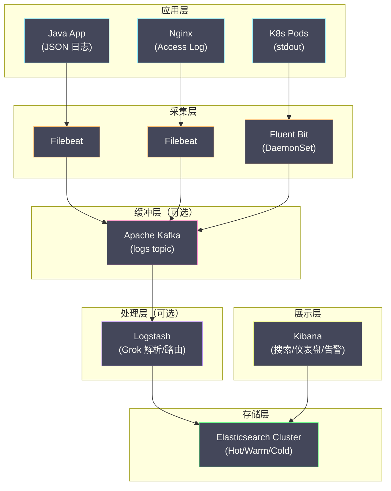

# 03 Elasticsearch 日志存储与检索原理

**摘要：**

[[Elasticsearch]]（ES）之所以能成为日志存储的事实标准长达十年，核心在于它的**倒排索引（Inverted Index）**——一种为全文搜索而生的数据结构。当工程师在 Kibana 中输入 `message: "timeout" AND service: "order-service"` 并在毫秒内得到结果时，背后是倒排索引将"搜索"转化为了高效的集合交集运算。本文从倒排索引的数据结构出发，解释 ES 如何将一条 JSON 日志文档转化为可检索的索引结构，然后深入分析 ES 在日志场景下的分片策略、Index Lifecycle Management（ILM）、以及 ELK 栈的完整数据流，最后讨论 ES 作为日志存储的成本问题——这也是 [[Grafana Loki]] 诞生的直接动因。

---

## 第 1 章 倒排索引：ES 的核心数据结构

### 1.1 从"正排"到"倒排"

理解倒排索引之前，先理解什么是"正排索引"——也就是最直觉的存储方式。

**正排索引（Forward Index）**：按文档 ID 存储文档内容。

```
文档 1 → "订单创建成功 orderId=789 userId=456"
文档 2 → "支付超时 orderId=789 timeout=3000ms"
文档 3 → "订单创建成功 orderId=790 userId=457"
```

用正排索引搜索"包含'超时'的文档"需要**全表扫描**——逐一读取每个文档，检查是否包含"超时"。当文档数量达到 TB 级时，全表扫描的耗时是无法接受的。

**倒排索引（Inverted Index）**：按词（Term）存储包含该词的文档列表。

```
"订单"     → [文档1, 文档3]
"创建"     → [文档1, 文档3]
"成功"     → [文档1, 文档3]
"支付"     → [文档2]
"超时"     → [文档2]
"orderId"  → [文档1, 文档2, 文档3]
"789"      → [文档1, 文档2]
"790"      → [文档3]
"userId"   → [文档1, 文档3]
"456"      → [文档1]
"457"      → [文档3]
"timeout"  → [文档2]
"3000ms"   → [文档2]
```

用倒排索引搜索"包含'超时'的文档"只需一次查找——直接从倒排索引中找到"超时"对应的文档列表 `[文档2]`，时间复杂度 O(1)。

搜索"包含'订单'且包含'789'的文档"只需两次查找 + 一次集合交集：
- "订单" → `[文档1, 文档3]`
- "789" → `[文档1, 文档2]`
- 交集 → `[文档1]`

### 1.2 倒排索引的内部结构

ES 的倒排索引基于 [[Apache Lucene]]，其内部结构由三部分组成：

**Term Dictionary（词典）**：存储所有不重复的 Term，按字典序排列。支持二分查找或前缀树（Trie）查找。

**Posting List（倒排列表）**：每个 Term 对应一个 Posting List，记录包含该 Term 的所有文档 ID。Posting List 使用压缩编码（如 Frame of Reference、Roaring Bitmap）存储，压缩比通常在 5:1 ~ 10:1。

**Term Index（词典索引）**：Term Dictionary 可能非常大（百万级 Term），无法全部加载到内存中。Term Index 是 Term Dictionary 的前缀树索引，常驻内存，用于快速定位 Term 在 Dictionary 中的位置。

```
查找过程：
  搜索词 "timeout"
    ↓
  Term Index（内存中，前缀树）
    → 定位到 Term Dictionary 的磁盘块 #47
    ↓
  Term Dictionary（磁盘块 #47，二分查找）
    → 找到 "timeout" 的 Posting List 偏移量
    ↓
  Posting List（磁盘读取 + 解压缩）
    → [文档2, 文档15, 文档89, ...]
```

### 1.3 分词器（Analyzer）：从文本到 Term

倒排索引的构建前提是**将文本拆分为 Term（词）**——这个过程称为**分词（Tokenization）**，由**分词器（Analyzer）**完成。

ES 的 Analyzer 由三个组件串联组成：

```
原始文本 → Character Filter → Tokenizer → Token Filter → Terms
```

**Character Filter（字符过滤器）**：对原始文本进行预处理（如去除 HTML 标签、替换特殊字符）。

**Tokenizer（分词器）**：将文本切分为 Token（词元）。不同的 Tokenizer 有不同的切分策略：
- **Standard Tokenizer**：按 Unicode 文本分割规则切分（适合英文），按空格和标点切分
- **Whitespace Tokenizer**：纯按空格切分
- **IK Analyzer**：中文分词器（非 ES 内置，需要安装插件）

**Token Filter（词元过滤器）**：对 Token 进行后处理：
- **Lowercase**：转为小写（`ORDER` → `order`）
- **Stop Words**：去除停用词（`the`、`is`、`a`）
- **Stemming**：词干提取（`running` → `run`）

**日志场景的分词策略**：

日志文本通常包含大量的专有名词、ID、路径、URL 等，不适合使用 Standard Analyzer（它会将 `order-service` 拆分为 `order` 和 `service` 两个 Term）。日志场景推荐的分词策略：

| 字段类型 | 推荐映射 | 说明 |
| :--- | :--- | :--- |
| **message（日志正文）** | `text` + Standard Analyzer | 支持全文搜索 |
| **service_name** | `keyword` | 精确匹配，不分词 |
| **trace_id** | `keyword` | 精确匹配 |
| **level** | `keyword` | 精确匹配 |
| **timestamp** | `date` | 时间范围查询 |
| **response_time** | `long` / `float` | 数值范围查询 |

`keyword` 类型不经过分词器——整个字段值作为一个 Term 存入倒排索引。这对于 service_name、trace_id 等需要精确匹配的字段是正确的选择。

---

## 第 2 章 ES 的文档存储与分片

### 2.1 文档的写入过程

当一条日志文档通过 Bulk API 写入 ES 时，经历以下过程：

```
1. 客户端将文档发送到协调节点（Coordinating Node）
2. 协调节点根据文档的 _id（或自动生成）计算 hash：
   shard = hash(_id) % number_of_primary_shards
   → 确定文档应该写入哪个主分片
3. 协调节点将文档路由到主分片所在的数据节点
4. 主分片执行写入：
   a. 将文档写入内存中的 Index Buffer
   b. 同时写入 Translog（事务日志，用于崩溃恢复）
   c. 对文档的每个字段进行分词，构建倒排索引（在内存中）
5. Index Buffer 满了或达到 refresh_interval（默认 1 秒）：
   a. 将内存中的倒排索引写入磁盘，生成一个新的 Segment（Lucene 段）
   b. 新 Segment 变为可搜索（这就是"近实时搜索"——写入后最多 1 秒可搜索）
6. 主分片将文档复制到副本分片
7. 所有副本确认后，向协调节点返回成功
8. 协调节点向客户端返回成功
```

### 2.2 Segment 与合并

ES（准确说是 Lucene）的磁盘存储单元是 **Segment**——每次 refresh 都生成一个新的 Segment。Segment 一旦写入就是**不可变的（immutable）**——不能修改、只能合并或删除。

**为什么 Segment 要设计为不可变？**

不可变性带来三个关键好处：
- **无锁并发读**：搜索请求不需要获取任何锁就能安全读取 Segment
- **文件系统缓存友好**：不可变的 Segment 可以被操作系统的 [[Page Cache]] 长期缓存
- **压缩友好**：不可变数据可以使用更激进的压缩算法

**Segment 合并（Merge）**：随着 refresh 的持续进行，Segment 数量不断增加。过多的 Segment 会降低搜索性能（每次搜索需要遍历所有 Segment 并合并结果）。ES 后台的 **Merge Policy** 会定期将多个小 Segment 合并为一个大 Segment，同时物理删除标记为"已删除"的文档。

### 2.3 日志场景的分片策略

分片（Shard）是 ES 数据分布和并行查询的基本单位。日志场景的分片策略需要考虑：

**分片大小**：官方建议每个分片 10~50 GB。分片太小（< 1 GB）会导致集群元数据膨胀和合并开销增加；分片太大（> 100 GB）会导致恢复时间过长。

**按时间分索引**：日志天然按时间排列，通常使用**按天或按周分索引**的策略：

```
日志索引命名：
  logs-2024.01.01
  logs-2024.01.02
  logs-2024.01.03
  ...

每个索引 1~5 个主分片（根据日志量调整）
```

按时间分索引的好处：
- **查询效率**：搜索"过去 1 小时的日志"只需查询当天的索引，不需要扫描历史数据
- **生命周期管理**：过期数据只需删除整个索引（O(1) 操作），而不需要逐条删除文档
- **冷热分离**：新索引放在 SSD 节点（Hot），旧索引迁移到 HDD 节点（Warm/Cold）

---

## 第 3 章 Index Lifecycle Management（ILM）

### 3.1 日志数据的生命周期

日志数据有明显的"价值衰减"特性：
- **最近几小时的日志**：最有价值，需要最快的查询速度
- **最近几天的日志**：偶尔查询，可以接受稍慢的速度
- **几周前的日志**：很少查询，主要用于审计或回溯
- **几个月前的日志**：几乎不查询，可以归档到廉价存储

ES 的 **ILM（Index Lifecycle Management）** 功能允许定义索引在不同阶段的行为：


### 3.2 ILM 策略配置

```json
PUT _ilm/policy/logs-policy
{
  "policy": {
    "phases": {
      "hot": {
        "min_age": "0ms",
        "actions": {
          "rollover": {
            "max_primary_shard_size": "50gb",
            "max_age": "1d"
          },
          "set_priority": { "priority": 100 }
        }
      },
      "warm": {
        "min_age": "1d",
        "actions": {
          "shrink": { "number_of_shards": 1 },
          "forcemerge": { "max_num_segments": 1 },
          "set_priority": { "priority": 50 },
          "allocate": {
            "require": { "data": "warm" }
          }
        }
      },
      "cold": {
        "min_age": "7d",
        "actions": {
          "allocate": {
            "require": { "data": "cold" }
          },
          "set_priority": { "priority": 0 }
        }
      },
      "delete": {
        "min_age": "30d",
        "actions": {
          "delete": {}
        }
      }
    }
  }
}
```

**Hot → Warm 的关键操作**：

- **Shrink**：将多个主分片合并为 1 个（减少分片数量，降低集群元数据开销）
- **Force Merge**：将分片内的多个 Segment 合并为 1 个（减少 Segment 数量，提高查询效率，释放被删除文档占用的空间）
- **Allocate**：将索引迁移到 Warm 节点（HDD 存储，成本更低）

### 3.3 Searchable Snapshots：冷数据的极致降本

ES 7.x 引入了 **Searchable Snapshots** 功能——将冷数据以快照形式存储在对象存储（如 AWS S3、MinIO）中，查询时按需加载到本地缓存。

```
传统冷数据存储：
  Cold 节点（HDD）→ 数据完整存储在本地磁盘 → 成本 = HDD 存储价格

Searchable Snapshots：
  S3（对象存储）→ 数据存储在 S3 → 查询时按需下载到本地 SSD 缓存
  成本 = S3 存储价格（是 HDD 的 1/5 ~ 1/10）+ 少量本地 SSD 缓存
```

对于日志场景（冷数据查询频率极低），Searchable Snapshots 可以将冷数据的存储成本降低 80% 以上。

---

## 第 4 章 ELK 栈的完整数据流

### 4.1 现代 ELK 栈架构

经典的 ELK 栈（Elasticsearch + Logstash + Kibana）在现代部署中通常演进为：



**Kafka 缓冲层的作用**：

在大规模部署中，Filebeat 直连 ES 可能导致以下问题：
- ES 集群维护（重启/升级）期间，Filebeat 的本地磁盘缓冲可能不足以暂存所有积压数据
- 突发日志量（如大量 ERROR 日志）可能导致 ES 写入过载

引入 Kafka 作为中间缓冲可以解耦采集端和存储端——Filebeat 只需将数据写入 Kafka（Kafka 的写入吞吐量远高于 ES），Logstash 或 ES 按自身能力从 Kafka 消费。

### 4.2 Kibana 的日志搜索能力

[[Kibana]] 的 Discover 功能提供了强大的日志搜索界面：

**KQL（Kibana Query Language）**：Kibana 的查询语法，比 Lucene Query String 更直观：

```
# 搜索包含 "timeout" 的 ERROR 日志
level: "ERROR" and message: "timeout"

# 搜索特定服务的日志
service_name: "order-service" and level: "ERROR"

# 搜索特定 Trace ID 的日志
trace_id: "abc123def456"

# 搜索响应时间大于 1000ms 的日志
response_time > 1000
```

**时间范围过滤**：Kibana 的时间选择器是日志查询最重要的过滤维度——绝大多数日志搜索都是"过去 15 分钟"或"过去 1 小时"的范围查询。ES 的按天分索引策略确保了时间范围查询只扫描必要的索引。

---

## 第 5 章 ES 日志存储的成本分析

### 5.1 成本的三个维度

ES 集群的成本来自三个维度：

**计算成本（CPU）**：
- 写入时：分词、构建倒排索引、Segment 合并
- 查询时：遍历倒排索引、解压 Posting List、合并结果

**内存成本**：
- JVM Heap：ES 的核心运行时内存，建议不超过 32 GB（超过 32 GB 后 JVM 的压缩指针失效，反而降低效率）
- OS Page Cache：操作系统用于缓存 Segment 文件的内存，对查询性能至关重要
- 经验法则：**节点总内存的 50% 给 JVM Heap，50% 给 Page Cache**

**存储成本**：
- 原始日志数据
- 倒排索引数据（通常与原始数据等大或更大）
- Translog
- 副本数据

### 5.2 一个真实场景的成本估算

假设：
- 日均日志量：500 GB（压缩前）
- 保留时间：Hot 1 天 + Warm 7 天 + Cold 30 天
- 副本数：Hot 阶段 1 副本，Warm/Cold 阶段 0 副本

```
存储估算：
  原始数据 + 倒排索引 ≈ 原始数据 × 1.5（索引膨胀系数）
  
  Hot：500 GB × 1.5 × 2（1副本）× 1天 = 1.5 TB
  Warm：500 GB × 1.5 × 1 × 7天 = 5.25 TB
  Cold：500 GB × 1.5 × 1 × 30天 = 22.5 TB
  
  总存储：≈ 29 TB

节点估算：
  Hot 节点：3 × (8C32G + 2TB SSD)
  Warm 节点：3 × (4C16G + 8TB HDD)
  Cold 节点：2 × (2C8G + 16TB HDD)
  Master 节点：3 × (2C8G)
  Kibana：1 × (2C4G)
```

这样一个集群的月成本（以云服务价格估算）通常在 **$3,000 ~ $8,000**，对于大型企业来说是一笔不小的开支。而且随着日志量增长，成本几乎线性增长——因为 ES 对每一条日志都建立完整的倒排索引，不存在"随规模增长而边际成本递减"的效应。

### 5.3 ES 的成本困境：为什么催生了 Loki

ES 的成本困境可以用一句话概括：**ES 为日志的每一个字段都建立了倒排索引，但大部分索引在大部分时间里不被使用**。

在实际的日志查询中，80% 的查询模式是：
1. 按时间范围 + 服务名过滤
2. 按日志级别过滤（ERROR / WARN）
3. 按 Trace ID 精确查找
4. 在上述过滤结果中做正文关键词搜索

这意味着真正高频使用的索引字段只有 `timestamp`、`service_name`、`level`、`trace_id` 这几个。`message` 字段的全文索引虽然能力强大，但使用频率远低于上述结构化字段的过滤。

[[Grafana Loki]] 正是抓住了这个洞察——**只索引少数几个标签字段（相当于 ES 的 keyword 字段），不索引日志正文**，将存储成本降低一个数量级。Loki 的详细原理将在下一篇文章中深入剖析。

> [!note] ES 仍然不可替代的场景
> 尽管 Loki 在成本上有巨大优势，ES 在以下场景中仍然不可替代：
> - **需要对日志正文进行复杂全文搜索**（如搜索包含特定 SQL 片段的日志）
> - **需要对日志字段进行聚合分析**（如统计每个 URL 的 ERROR 日志数量 Top10）
> - **需要与其他 ES 数据（如 APM 数据、安全事件）在同一个平台中关联查询**
> - **已有成熟的 ELK 运维体系和 Kibana 仪表盘**

---

## 参考资料

1. Elasticsearch: The Definitive Guide：https://www.elastic.co/guide/en/elasticsearch/guide/current/index.html
2. Lucene Inverted Index：https://lucene.apache.org/core/
3. Elasticsearch Index Lifecycle Management：https://www.elastic.co/guide/en/elasticsearch/reference/current/index-lifecycle-management.html
4. Elasticsearch Searchable Snapshots：https://www.elastic.co/guide/en/elasticsearch/reference/current/searchable-snapshots.html
5. Kibana Discover：https://www.elastic.co/guide/en/kibana/current/discover.html
6. Clinton Gormley, Zachary Tong (2015). *Elasticsearch: The Definitive Guide*. O'Reilly Media.
