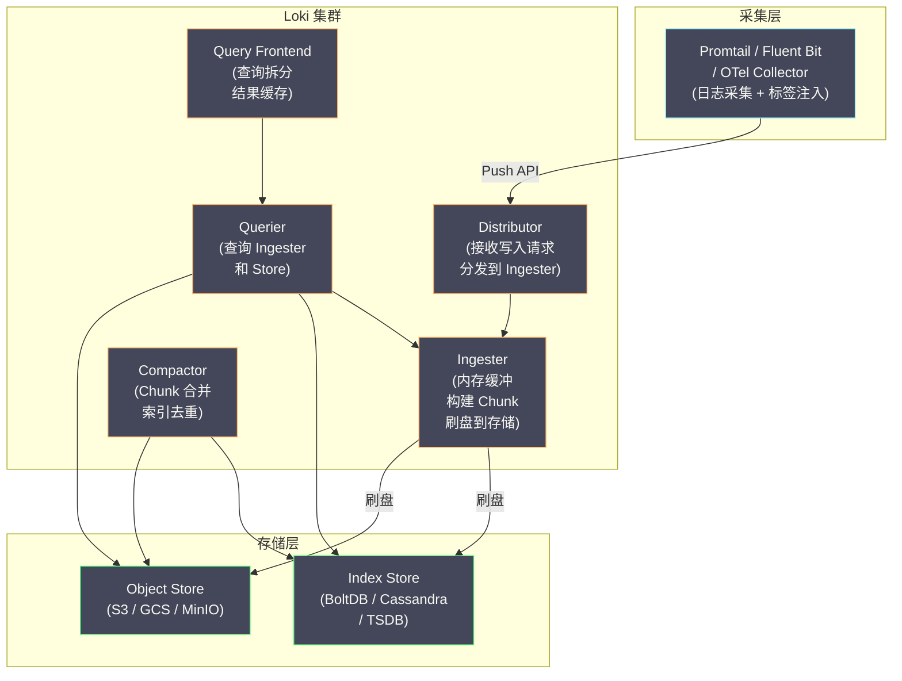
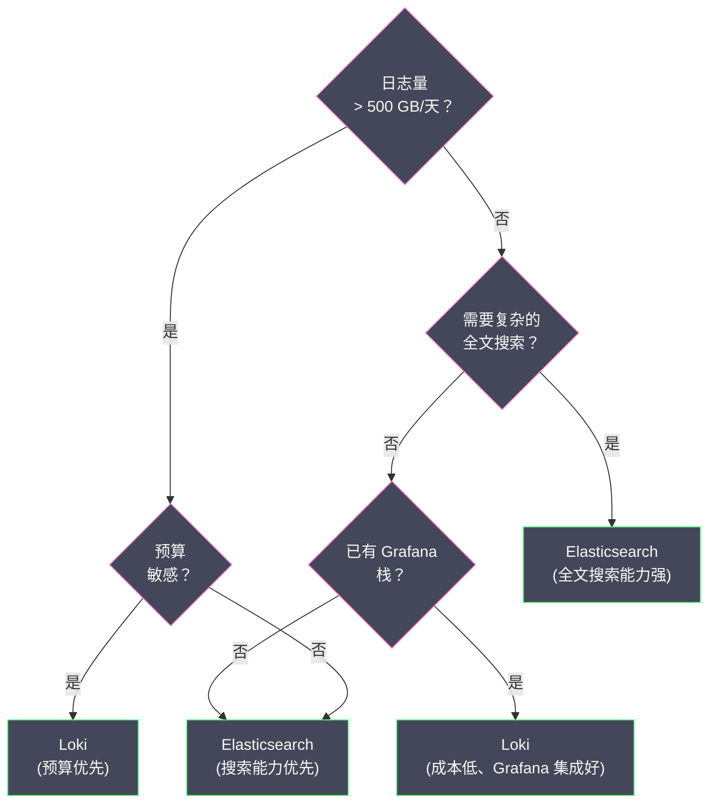

# 04 Loki 日志系统深度解析

**摘要：**

[[Grafana Loki]] 是 Grafana Labs 在 2018 年推出的日志聚合系统，它的设计哲学可以用一句话概括：**"Like Prometheus, but for logs"**。Loki 不像 [[Elasticsearch]] 那样对日志的每个字段都建立倒排索引，而是**只索引一组标签（labels）**，日志正文以压缩的原始文本形式存储在廉价的对象存储（如 S3、GCS、MinIO）中。这种"轻索引 + 重存储"的策略使得 Loki 的运行成本比 ES 低一个数量级，同时通过 LogQL 查询语言在查询时对日志正文进行实时过滤和聚合。本文深入剖析 Loki 的核心设计决策、内部存储模型、Chunk 的生命周期、LogQL 的查询机制，以及 Loki 与 ES 在不同场景下的选型对比。

---

## 第 1 章 Loki 的设计哲学

### 1.1 从 Prometheus 借鉴的标签模型

理解 Loki 的最快方式是先理解 [[Prometheus]]。Prometheus 用**标签（labels）**来标识一条时间序列：

```
http_requests_total{service="order-service", method="POST", status="200"}
```

标签的组合唯一确定一条时间序列。Prometheus 对标签建立索引（可以快速找到"所有 service=order-service 的时间序列"），而时间序列的数据点（时间戳 + 数值）则用高效的压缩编码存储。

Loki 将同样的思路应用到日志上：用**标签**标识一条**日志流（Log Stream）**：

```
{service="order-service", namespace="production", level="ERROR"}
```

标签的组合唯一确定一条日志流。Loki 对标签建立索引（可以快速找到"所有 service=order-service 且 level=ERROR 的日志流"），而日志流中的每一条日志（时间戳 + 日志文本）则以压缩的文本块存储，**不建立倒排索引**。

### 1.2 "不索引正文"的经济学

这个设计决策的核心逻辑是**成本与查询频率的权衡**：

| | Elasticsearch | Loki |
| :--- | :--- | :--- |
| **索引范围** | 所有字段（标签 + 正文）| 只有标签 |
| **索引存储开销** | 与原始数据等大（甚至更大）| 极小（只有标签的倒排索引）|
| **正文存储方式** | JSON 文档 + 倒排索引 | 压缩文本块（gzip/snappy）|
| **正文搜索方式** | 倒排索引查找（毫秒级）| 流式扫描（秒级）|
| **写入 CPU 开销** | 高（分词 + 构建倒排索引）| 低（只需压缩）|
| **存储成本** | 高（SSD/HDD 本地磁盘）| 低（S3 对象存储）|

Loki 的存储成本优势来自两个方面：

**第一，省去了正文索引的存储开销**。ES 中倒排索引的大小通常等于甚至超过原始数据——也就是说，存储 1 TB 的日志需要 2~3 TB 的磁盘空间（原始数据 + 索引）。Loki 只需要存储压缩后的原始数据（压缩比通常 5:1 ~ 10:1），1 TB 的日志只需要 100~200 GB 的存储。

**第二，使用对象存储替代本地磁盘**。ES 的数据必须存储在本地磁盘（SSD 或 HDD），因为倒排索引的随机读取模式需要低延迟的本地 I/O。Loki 的日志数据是顺序读取的压缩块，可以存储在 S3、GCS、MinIO 等对象存储中——对象存储的每 GB 成本大约是 SSD 的 1/20、HDD 的 1/5。

### 1.3 代价：查询时间换存储成本

Loki 不索引正文的代价是**正文搜索速度慢**。当工程师搜索"包含 timeout 的日志"时：

- **ES**：在倒排索引中查找 "timeout"，直接得到文档 ID 列表 → **毫秒级**
- **Loki**：先按标签过滤出候选日志流，然后逐一解压每个 Chunk，在解压后的文本中做字符串匹配 → **秒级**

但这个代价在实际使用中是可接受的，原因有二：

**原因一：标签过滤大幅缩小扫描范围**。如果查询条件是 `{service="order-service", level="ERROR"} |= "timeout"`，Loki 先通过标签索引找到 order-service 的 ERROR 日志流（可能只占总数据量的 0.1%），然后只在这个子集中做正文搜索。实际扫描的数据量远小于全量数据。

**原因二：日志查询的 SLA 要求不高**。大多数日志查询场景（排查故障、查看上下文）对响应时间的期望是"几秒内返回"，而不是"毫秒级返回"。几秒的查询延迟对于日志排查来说完全够用。

> [!note] Loki 的设计哲学总结
> Loki 的核心赌注是：**日志的大部分价值在于"能查到"，而不是"能毫秒级查到"**。为了将"毫秒级"降为"秒级"，换来的是 10 倍以上的成本降低——对于绝大多数团队来说，这是一个非常划算的交易。

---

## 第 2 章 Loki 的架构

### 2.1 核心组件

Loki 的架构由以下核心组件组成：



**Distributor（分发器）**：接收来自采集器的写入请求（HTTP Push），对日志条目进行验证（时间戳是否合理、标签是否合规、速率限制），然后根据标签组合的 hash 值将日志路由到对应的 Ingester 实例。这个路由使用一致性 hash ring，确保同一个标签组合的日志始终发送到同一个 Ingester。

**Ingester（摄入器）**：Loki 最核心的组件。Ingester 在内存中为每条日志流维护一个**活跃 Chunk**，新到达的日志追加到对应的 Chunk 中。当 Chunk 满了（达到大小阈值或时间阈值），Ingester 将 Chunk 压缩后刷写（flush）到对象存储，同时将 Chunk 的索引信息写入 Index Store。

**Querier（查询器）**：负责执行 LogQL 查询。查询时，Querier 同时从两个来源获取数据：
- **Ingester**：获取尚未刷盘的最新数据（内存中的活跃 Chunk）
- **Object Store**：获取已刷盘的历史数据（通过 Index Store 定位 Chunk 位置）

**Query Frontend（查询前端）**：可选组件，负责查询优化：
- **查询拆分**：将大时间范围的查询拆分为多个小时间范围的子查询，并行执行
- **结果缓存**：缓存子查询的结果，相同的查询不需要重新扫描

**Compactor（压实器）**：后台进程，负责合并小的索引文件、去除重复数据、清理过期数据。

### 2.2 单体模式 vs 微服务模式

Loki 支持两种部署模式：

**单体模式（Monolithic）**：所有组件运行在一个进程中。适合小规模部署（日志量 < 100 GB/天），配置简单，一个二进制文件即可运行。

**微服务模式（Microservices）**：每个组件独立部署和扩缩容。适合大规模部署（日志量 > 100 GB/天），可以独立扩展写入（Ingester）和查询（Querier）的能力。

Loki 3.0 引入了 **SSD（Simple Scalable Deployment）** 模式——介于单体和微服务之间，将组件分为三组（Write、Read、Backend），每组可以独立扩缩容，比微服务模式运维更简单。

---

## 第 3 章 Chunk：Loki 的存储基本单元

### 3.1 什么是 Chunk

**Chunk（块）** 是 Loki 存储日志数据的基本单元。每个 Chunk 对应**一条日志流在一段时间内的所有日志条目**。

```
Chunk 的内容：
  标签集：{service="order-service", level="ERROR"}
  时间范围：2024-01-01 10:00:00 ~ 2024-01-01 10:30:00
  日志条目：
    [2024-01-01 10:00:01] 数据库连接失败: host=db1.internal
    [2024-01-01 10:00:05] 重试第 1 次: host=db1.internal
    [2024-01-01 10:00:15] 重试第 2 次: host=db1.internal
    [2024-01-01 10:05:30] 支付回调超时: orderId=789
    ...（更多日志条目）
```

### 3.2 Chunk 的生命周期

一个 Chunk 从创建到最终存储，经历以下阶段：

```
1. 创建（Create）
   → 当某个标签组合的第一条日志到达 Ingester 时
   → 在内存中创建一个新的 Chunk 对象

2. 追加（Append）
   → 后续相同标签组合的日志持续追加到这个 Chunk
   → Chunk 在内存中以未压缩的形式存在

3. 切分（Cut）
   → 当 Chunk 达到以下任一条件时切分（关闭当前 Chunk，创建新 Chunk）：
     a. 大小达到阈值（默认 1.5 MB 未压缩）
     b. 时间跨度达到阈值（默认 1 小时）
     c. 空闲时间达到阈值（默认 30 分钟无新日志）

4. 压缩（Compress）
   → 切分后的 Chunk 进行压缩（默认 gzip，也支持 snappy、lz4、zstd）
   → 压缩比通常 5:1 ~ 10:1

5. 刷盘（Flush）
   → 压缩后的 Chunk 上传到对象存储（S3/GCS/MinIO）
   → 同时将 Chunk 的索引信息（标签集 + 时间范围 + 对象存储路径）写入 Index Store

6. 查询（Query）
   → 查询时根据标签和时间范围从 Index Store 定位 Chunk
   → 从对象存储下载 Chunk → 解压 → 在文本中做过滤
```

### 3.3 Chunk 的内部编码

Chunk 内部不是简单的文本堆叠。Loki 对 Chunk 内的日志条目进行了精心的编码优化：

**时间戳编码**：日志条目的时间戳使用 **delta-of-delta 编码**——同一个 Chunk 内的日志时间戳通常递增且间隔相近，存储连续时间戳之间的差值的差值可以用极少的字节表示。

**日志文本编码**：日志文本先进行 **gzip/snappy/zstd 压缩**。由于同一条日志流的日志内容通常有大量重复模式（如相同的日志格式前缀、相同的服务名），压缩效果非常好。

**结构化元数据（Structured Metadata）**：Loki 3.0 引入了 Structured Metadata 功能——允许在不增加标签基数的情况下，为日志条目附加键值对元数据（如 trace_id、user_id）。这些元数据存储在 Chunk 内部，可以在查询时高效过滤，但不参与标签索引。

### 3.4 标签基数（Cardinality）：Loki 最重要的约束

标签基数是指**标签值的不同组合数量**。例如：

```
{service="order-service", level="INFO"}
{service="order-service", level="ERROR"}
{service="payment-service", level="INFO"}
{service="payment-service", level="ERROR"}
→ 标签基数 = 2（service）× 2（level）= 4
```

每个唯一的标签组合对应一条日志流，每条日志流对应至少一个活跃 Chunk。标签基数直接决定了 Ingester 需要维护的活跃 Chunk 数量。

**高基数标签是 Loki 的头号杀手**。如果将 `user_id`（可能有百万级不同值）作为标签：

```
{service="order-service", user_id="user_001"}
{service="order-service", user_id="user_002"}
...
{service="order-service", user_id="user_999999"}
→ 标签基数 = 999,999 条日志流
→ Ingester 需要同时维护 999,999 个活跃 Chunk
→ 内存爆炸
```

> [!warning] 标签设计的黄金法则
> **只有低基数的维度才能作为标签**。低基数意味着该维度的不同值数量有限（通常 < 100）。
> - ✅ 适合做标签：`service`（~50 个值）、`namespace`（~5 个值）、`level`（~5 个值）、`env`（~3 个值）
> - ❌ 不适合做标签：`user_id`、`order_id`、`trace_id`、`ip_address`、`request_path`
> 
> 高基数的维度应该放在日志正文中，通过 LogQL 的 `|=` 或 `| json | user_id="xxx"` 在查询时过滤。或者使用 Loki 3.0 的 Structured Metadata 功能。

---

## 第 4 章 LogQL：Loki 的查询语言

### 4.1 LogQL 的设计

**LogQL** 是 Loki 的查询语言，其语法深受 [[PromQL]] 启发。LogQL 的查询分为两类：

**日志查询（Log Query）**：返回日志行（类似 `grep`）

```
{service="order-service"} |= "timeout"
```

**指标查询（Metric Query）**：从日志中提取数值指标（类似 PromQL 的聚合函数）

```
rate({service="order-service"} |= "ERROR" [5m])
```

### 4.2 日志查询语法

LogQL 的日志查询由**日志流选择器（Log Stream Selector）**和**管道（Pipeline）**组成：

```
{标签选择器} | 管道操作1 | 管道操作2 | ...
```

**日志流选择器**：按标签过滤日志流

```
{service="order-service"}                          # 精确匹配
{service=~"order-.*"}                               # 正则匹配
{service="order-service", level!="DEBUG"}           # 不等于
{namespace="production", service=~"order|payment"}  # 多值正则
```

**行过滤（Line Filter）**：对日志正文进行过滤

```
|= "timeout"       # 包含 "timeout"（大小写敏感）
!= "health"        # 不包含 "health"
|~ "error|fail"    # 正则匹配
!~ "debug|trace"   # 正则不匹配
```

**解析器（Parser）**：将非结构化日志解析为结构化字段

```
# JSON 解析器：将 JSON 日志的字段提取出来
| json

# Logfmt 解析器：解析 key=value 格式的日志
| logfmt

# 正则解析器：用正则提取字段
| regexp `(?P<ip>\d+\.\d+\.\d+\.\d+) - (?P<method>\w+) (?P<path>\S+)`

# Pattern 解析器：用模式匹配提取字段
| pattern `<ip> - <method> <path> <status>`
```

**标签过滤（Label Filter）**：对解析后的字段进行过滤

```
# 完整的查询示例：
# 1. 选择 order-service 的日志流
# 2. 包含 "order" 关键词
# 3. 解析 JSON 格式
# 4. 过滤 status >= 500 的日志
{service="order-service"} |= "order" | json | status >= 500
```

### 4.3 指标查询语法

LogQL 可以从日志中提取数值指标，实现"日志即指标"：

**日志计数**：

```
# 过去 5 分钟内，每秒的 ERROR 日志数量
rate({service="order-service", level="ERROR"} [5m])

# 过去 1 小时内，ERROR 日志的总数
count_over_time({service="order-service", level="ERROR"} [1h])

# 按服务分组的 ERROR 日志速率
sum by (service) (rate({level="ERROR"} [5m]))
```

**数值提取**：

```
# 从日志中提取响应时间，计算 P99
{service="order-service"} | json | unwrap response_time_ms | quantile_over_time(0.99, [5m])

# 从日志中提取响应时间，计算平均值
{service="order-service"} | json | unwrap response_time_ms | avg_over_time([5m])
```

`unwrap` 操作将解析出的字段从字符串转为数值，然后可以使用 `quantile_over_time`、`avg_over_time`、`max_over_time` 等聚合函数。

### 4.4 LogQL 的查询执行过程

理解 LogQL 的执行过程有助于写出高效的查询：

```
查询：{service="order-service", level="ERROR"} |= "timeout" | json | status >= 500

执行步骤：
1. 标签过滤（Index Lookup）
   → 从 Index Store 中查找匹配 {service="order-service", level="ERROR"} 的 Chunk 列表
   → 这一步是毫秒级的（只查索引）
   
2. Chunk 下载
   → 从对象存储中下载匹配时间范围的 Chunk
   → 这一步取决于 Chunk 数量和网络带宽
   
3. Chunk 解压
   → 对下载的 Chunk 进行解压（gzip/snappy/zstd）
   
4. 行过滤（|= "timeout"）
   → 在解压后的文本中逐行检查是否包含 "timeout"
   → 不匹配的行直接丢弃，不进入后续管道
   
5. JSON 解析（| json）
   → 对通过行过滤的日志行进行 JSON 解析
   → 提取 status 字段
   
6. 标签过滤（status >= 500）
   → 过滤 status >= 500 的日志行
   
7. 返回结果
```

> [!info] 查询优化的关键
> **行过滤（`|=`）应该尽早出现在管道中**。行过滤是纯字符串匹配，比 JSON 解析快得多。如果先做 JSON 解析再做行过滤，所有日志行都需要经过 JSON 解析——而大部分日志行在行过滤阶段就会被淘汰。将行过滤放在 JSON 解析之前，可以大幅减少 JSON 解析的次数。

---

## 第 5 章 Loki vs Elasticsearch：选型决策

### 5.1 核心差异总结

| 维度 | Elasticsearch | Grafana Loki |
| :--- | :--- | :--- |
| **索引策略** | 全文倒排索引 | 只索引标签 |
| **正文搜索速度** | 毫秒级 | 秒级 |
| **存储后端** | 本地磁盘（SSD/HDD）| 对象存储（S3/GCS）|
| **存储成本** | 高 | 低（ES 的 1/5 ~ 1/10）|
| **写入开销** | 高（分词+索引构建）| 低（仅压缩）|
| **查询能力** | 强（全文搜索+聚合）| 中（标签过滤+流式扫描）|
| **运维复杂度** | 高（JVM 调优、分片管理）| 中（Ingester 内存管理）|
| **生态集成** | Kibana、Elastic APM | Grafana、Prometheus、Tempo |
| **适合的日志量** | 中（< 1 TB/天最佳）| 大（TB 级日志量优势明显）|

### 5.2 选型决策树



### 5.3 混合架构：Loki + ES 共存

在一些团队中，Loki 和 ES 并非互斥——它们可以共存，各自处理不同类型的日志：

| 日志类型 | 存储后端 | 理由 |
| :--- | :--- | :--- |
| **应用日志** | Loki | 量大、查询以标签过滤为主 |
| **安全/审计日志** | Elasticsearch | 需要复杂的全文搜索和聚合分析 |
| **Nginx 访问日志** | Loki | 量大、格式固定、主要按 status code 过滤 |
| **业务分析日志** | Elasticsearch | 需要对字段做聚合（如 Top10 URL） |

这种混合架构通过日志采集层（如 [[Fluent Bit]]）的路由规则实现：不同 tag 的日志发送到不同的后端。

---

## 第 6 章 Loki 的生产部署要点

### 6.1 Promtail vs 其他采集器

**Promtail** 是 Loki 官方的日志采集器，专门为 Loki 设计。它的核心功能是：
- 监控日志文件（类似 Filebeat 的 tail 模式）
- 自动发现 Kubernetes Pod 并注入标签（Pod name、namespace、labels）
- 将日志通过 HTTP Push 发送到 Loki

但 Promtail 并非唯一选择。以下采集器都支持 Loki 作为输出目标：

| 采集器 | Loki 支持方式 | 推荐程度 |
| :--- | :--- | :--- |
| **Promtail** | 原生支持 | K8s 环境首选 |
| **Fluent Bit** | `loki` output plugin | 已有 Fluent Bit 部署时推荐 |
| **Fluentd** | `fluent-plugin-grafana-loki` | 已有 Fluentd 部署时可用 |
| **OTel Collector** | `loki` exporter | 追求统一采集时推荐 |
| **Vector** | `loki` sink | 追求高性能时推荐 |

### 6.2 关键配置项

```yaml
# Loki 配置示例（单体模式）
auth_enabled: false

server:
  http_listen_port: 3100

ingester:
  lifecycler:
    ring:
      kvstore:
        store: inmemory
      replication_factor: 1
  chunk_idle_period: 30m      # Chunk 空闲 30 分钟后切分
  max_chunk_age: 1h           # Chunk 最大存活 1 小时
  chunk_target_size: 1572864  # Chunk 目标大小 1.5 MB
  chunk_retain_period: 30s    # Chunk 刷盘后在内存中保留 30 秒
  max_transfer_retries: 0

schema_config:
  configs:
    - from: 2024-01-01
      store: tsdb              # 推荐使用 TSDB 索引（Loki 3.0+）
      object_store: s3
      schema: v13
      index:
        prefix: loki_index_
        period: 24h

storage_config:
  tsdb_shipper:
    active_index_directory: /loki/tsdb-index
    cache_location: /loki/tsdb-cache
  aws:
    s3: s3://access_key:secret_key@region/bucket_name
    s3forcepathstyle: true

limits_config:
  max_entries_limit_per_query: 5000  # 单次查询最多返回 5000 条
  reject_old_samples: true
  reject_old_samples_max_age: 168h   # 拒绝 7 天前的日志
  ingestion_rate_mb: 10              # 每租户每秒最大写入 10 MB
  ingestion_burst_size_mb: 20        # 突发最大 20 MB

compactor:
  working_directory: /loki/compactor
  compaction_interval: 10m
  retention_enabled: true
  retention_delete_delay: 2h
  retention_delete_worker_count: 150
```

### 6.3 容量规划经验值

| 日志量 | 部署模式 | Ingester 资源 | 对象存储 |
| :--- | :--- | :--- | :--- |
| **< 50 GB/天** | 单体模式 | 2C4G × 1 | ~5 GB/天（压缩后）|
| **50~500 GB/天** | SSD 模式 | 4C8G × 3（Write） | ~50 GB/天 |
| **> 500 GB/天** | 微服务模式 | 8C16G × N（Ingester）| ~50+ GB/天 |

Ingester 的内存主要被活跃 Chunk 占用。估算公式：

```
Ingester 内存 ≈ 活跃日志流数量 × Chunk 目标大小 × 2（写入缓冲）
             = 10,000 流 × 1.5 MB × 2
             = 30 GB
```

如果活跃日志流数量超过预期（标签基数过高），Ingester 的内存会迅速耗尽——这再次印证了**控制标签基数**是 Loki 运维的第一优先级。

---

## 参考资料

1. Grafana Loki Documentation：https://grafana.com/docs/loki/latest/
2. LogQL Reference：https://grafana.com/docs/loki/latest/query/
3. Loki Architecture：https://grafana.com/docs/loki/latest/get-started/architecture/
4. Loki Storage：https://grafana.com/docs/loki/latest/storage/
5. Loki Best Practices（Label Design）：https://grafana.com/docs/loki/latest/best-practices/
6. Cyril Tovena (2019). *Grafana Loki: Like Prometheus, but for Logs*. GrafanaCon LA.
7. Tom Wilkie (2020). *Loki Design Document*. Grafana Labs Blog.
