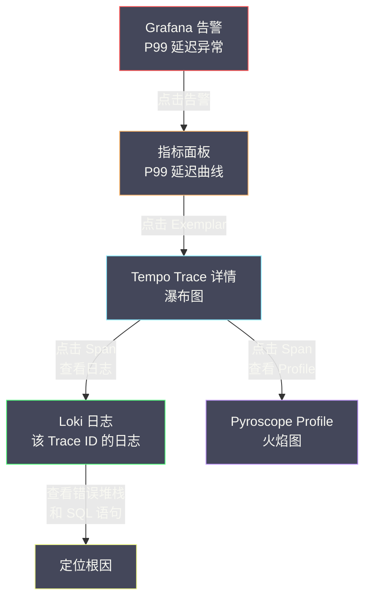
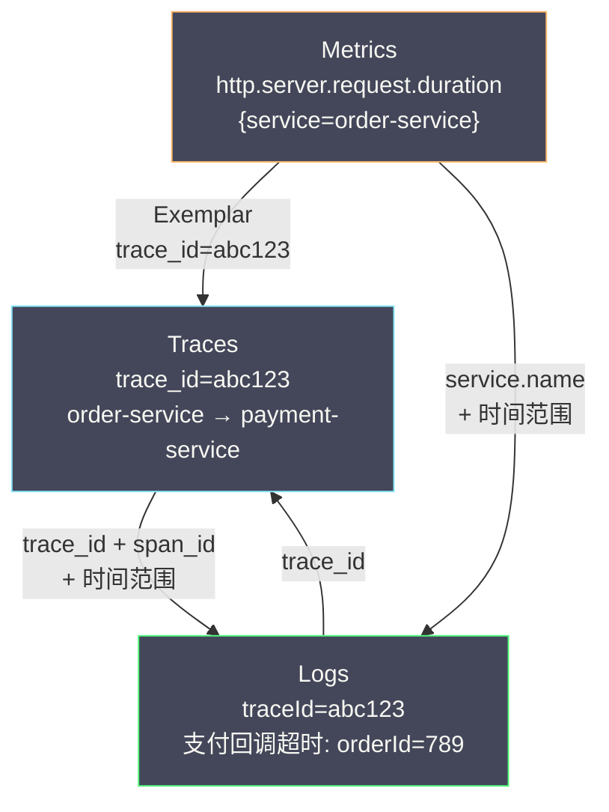
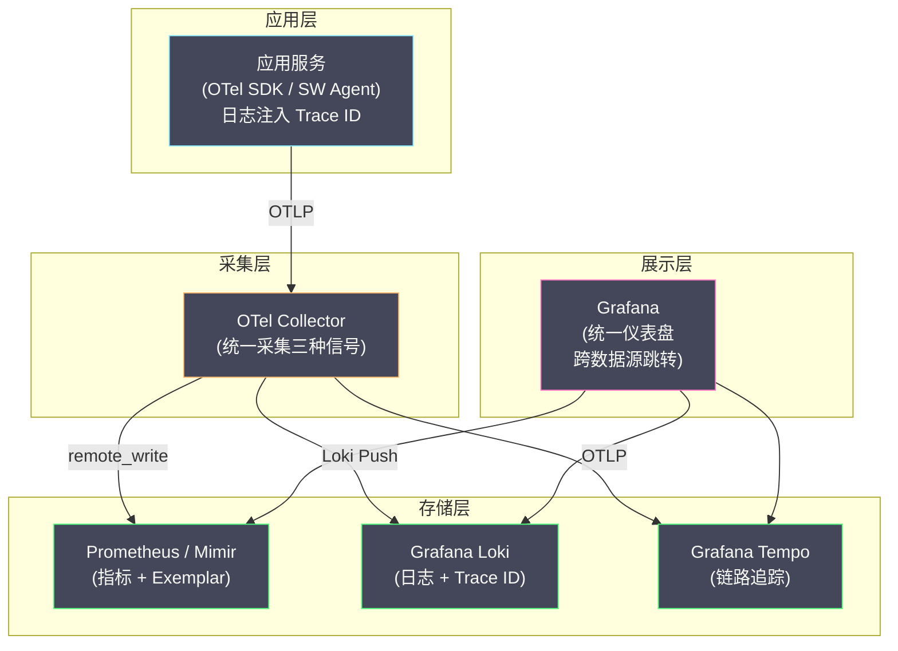

# 05 日志与链路追踪的联动

**摘要：**

可观测性的四大支柱（指标、日志、链路追踪、Profiling）各有擅长，但它们的真正威力在于**联动**——从指标告警发现异常，跳转到链路追踪定位慢服务，再跳转到日志查看具体的错误上下文。如果这些信号彼此孤立，工程师需要在多个工具之间手动切换、手动关联，排查效率大打折扣。本文聚焦于日志与链路追踪之间的联动机制：如何在日志中注入 Trace ID 实现双向关联，[[Grafana]] 如何通过 Exemplar 和数据源跳转打通指标→链路→日志的完整排查链路，以及 [[OpenTelemetry]] 如何在协议层面统一三种信号的关联标识。

---

## 第 1 章 为什么需要联动

### 1.1 孤立信号的排查困境

假设一个真实的线上故障排查场景：

```
14:00  Grafana 告警：order-service 的 P99 延迟从 200ms 飙升到 5000ms
14:02  工程师打开 Grafana 仪表盘，确认 P99 延迟异常
14:03  工程师想知道"哪些请求慢了"——但 Prometheus 指标只有聚合值，没有单个请求的信息
14:05  工程师打开 SkyWalking UI，搜索 order-service 过去 10 分钟的慢请求 Trace
14:07  找到一条 5 秒的 Trace，发现瓶颈在 payment-service 的数据库查询
14:08  工程师想知道"这个数据库查询具体执行了什么 SQL"——但 Trace 的 Span 只记录了"MySQL Query"和耗时
14:10  工程师需要去日志系统中查找对应的日志——但如何找到"这条 Trace 对应的日志"？
14:12  如果日志中没有 Trace ID，工程师只能按时间范围 + 服务名粗略搜索，结果可能有数千条
14:15  在数千条日志中肉眼搜索，终于找到对应的 SQL 日志
```

整个排查过程花了 15 分钟，其中大部分时间浪费在**跨系统的手动关联**上。

### 1.2 联动后的理想排查流程

如果日志、链路追踪、指标三者已经通过 Trace ID 联动：

```
14:00  Grafana 告警：order-service 的 P99 延迟异常
14:01  工程师点击告警中的 Exemplar 链接 → 直接跳转到一条慢请求的 Trace 详情
14:02  在 Trace 瀑布图中看到 payment-service 的数据库查询耗时 4.8 秒
14:02  点击该 Span 旁边的"查看日志"按钮 → 直接跳转到该 Trace ID 在该时间段的日志
14:03  在日志中看到完整的 SQL 语句：SELECT * FROM orders WHERE user_id = 'xxx' 全表扫描
14:03  定位根因：缺少索引
```

**3 分钟完成排查**，全程在 Grafana 一个界面中完成，不需要切换工具、不需要手动关联。这就是可观测性联动的威力。

---

## 第 2 章 Trace ID 注入：联动的基础

### 2.1 注入原理

日志与链路追踪联动的基础是**在每条日志中嵌入当前请求的 Trace ID**。当请求经过链路追踪系统时，Trace ID 存储在线程的 Context 中（如 [[ThreadLocal]]）。日志框架在输出日志时，从 Context 中提取 Trace ID，作为日志的一个字段输出。

```
请求到达 → Agent 创建 Trace Context → ThreadLocal 存储 Trace ID
                                             ↓
                                    日志框架输出日志时
                                    从 ThreadLocal 读取 Trace ID
                                    写入日志行
                                             ↓
                                    日志：{"traceId": "abc123", "message": "处理订单"}
```

### 2.2 SkyWalking Toolkit 集成

[[Apache SkyWalking]] 提供了 Toolkit 库，支持将 Trace ID 注入到主流 Java 日志框架。具体的集成方式在 [[08 链路追踪工程实践落地经验]] 的第 4 章中已有详细介绍，这里做一个简要回顾：

**Logback 集成**：

```xml
<!-- pom.xml 添加依赖 -->
<dependency>
    <groupId>org.apache.skywalking</groupId>
    <artifactId>apm-toolkit-logback-1.x</artifactId>
    <version>${skywalking.version}</version>
</dependency>
```

```xml
<!-- logback.xml 使用 TraceIdPatternLogbackLayout -->
<layout class="org.apache.skywalking.apm.toolkit.log.logback.v1.x.TraceIdPatternLogbackLayout">
    <pattern>%d [%tid] [%thread] %-5level %logger{36} - %msg%n</pattern>
</layout>
```

`%tid` 占位符会被替换为当前请求的 Trace ID。如果当前线程没有 Trace Context（如应用启动阶段），输出 `TID: N/A`。

**Log4j2 集成**：

```xml
<dependency>
    <groupId>org.apache.skywalking</groupId>
    <artifactId>apm-toolkit-log4j-2.x</artifactId>
    <version>${skywalking.version}</version>
</dependency>
```

```xml
<!-- log4j2.xml 使用 %traceId 占位符 -->
<PatternLayout pattern="%d [%traceId] [%thread] %-5level %logger{36} - %msg%n"/>
```

### 2.3 OpenTelemetry 的自动注入

[[OpenTelemetry]] Java Agent 支持**自动将 Trace ID 和 Span ID 注入到日志的 MDC（Mapped Diagnostic Context）**中，不需要修改日志配置文件。

OTel Agent 启动时自动向 SLF4J 的 MDC 中注入以下字段：

| MDC Key | 值 | 说明 |
| :--- | :--- | :--- |
| `trace_id` | 32 位十六进制字符串 | W3C Trace Context 的 Trace ID |
| `span_id` | 16 位十六进制字符串 | 当前 Span ID |
| `trace_flags` | `01` 或 `00` | 是否被采样 |

在 Logback 配置中使用 `%X{trace_id}` 即可输出：

```xml
<pattern>%d [%X{trace_id}] [%X{span_id}] [%thread] %-5level %logger{36} - %msg%n</pattern>
```

> [!info] MDC 的工作原理
> MDC（Mapped Diagnostic Context）是 SLF4J/Logback/Log4j2 提供的线程级键值对存储——本质上就是一个 `ThreadLocal<Map<String, String>>`。日志框架在输出日志时，可以从 MDC 中读取指定 key 的值。OTel Agent 通过字节码增强，在 Span 创建时向 MDC 中写入 trace_id 和 span_id，在 Span 结束时清除。

### 2.4 结构化日志中的 Trace ID

如果应用使用结构化日志（JSON 格式），Trace ID 会作为 JSON 的一个独立字段输出：

```json
{
    "timestamp": "2024-01-01T10:00:00.150Z",
    "level": "ERROR",
    "logger": "com.example.PaymentService",
    "message": "支付回调超时",
    "orderId": "789",
    "traceId": "abc123def456789012345678",
    "spanId": "1234567890abcdef",
    "service": "payment-service"
}
```

结构化日志中的 `traceId` 字段可以被日志存储系统（[[Elasticsearch]] 或 [[Grafana Loki]]）直接索引，支持按 Trace ID 精确查询——这是联动的关键。

---

## 第 3 章 Grafana 的跨数据源联动

### 3.1 Grafana 的数据源架构

[[Grafana]] 的核心设计理念是**统一可视化层**——它本身不存储数据，而是通过**数据源插件（Data Source Plugin）**连接到各种后端系统：

| 数据源 | 信号类型 | 典型后端 |
| :--- | :--- | :--- |
| **Prometheus** | 指标 | Prometheus、Thanos、Mimir |
| **Loki** | 日志 | Grafana Loki |
| **Tempo** | 链路追踪 | Grafana Tempo |
| **Elasticsearch** | 日志 / 指标 | Elasticsearch |
| **Jaeger** | 链路追踪 | Jaeger |

Grafana 的联动能力建立在"所有信号都在同一个平台中可查询"这个基础上——当所有数据源都配置在 Grafana 中时，Grafana 可以在不同数据源之间建立跳转链接。

### 3.2 Exemplar：从指标到链路的桥梁

**Exemplar（示例）** 是 [[Prometheus]] 和 [[OpenTelemetry]] 引入的一个概念——在指标数据点上附加一个**具体请求的 Trace ID**，使得工程师可以从聚合指标直接跳转到一个具体的 Trace。

**Exemplar 的工作原理**：

当应用通过 Prometheus 客户端库记录 Histogram 指标时，可以同时附加当前请求的 Trace ID 作为 Exemplar：

```java
// Prometheus Java 客户端 + OTel 集成
Histogram requestDuration = Histogram.build()
    .name("http_request_duration_seconds")
    .help("HTTP request duration")
    .labelNames("method", "path", "status")
    .register();

// 记录指标时，自动从当前 Span Context 中提取 Trace ID 作为 Exemplar
requestDuration
    .labels("POST", "/api/orders", "200")
    .observeWithExemplar(duration, "trace_id", Span.current().getSpanContext().getTraceId());
```

Prometheus 在 scrape 时采集 Exemplar 数据，存储在 TSDB 中。Grafana 查询 Prometheus 指标时，可以显示 Exemplar 点——每个点代表一个具体的请求，点击后跳转到对应的 Trace。

```
Grafana 指标面板：

P99 延迟曲线
  │
  │     ○ ← Exemplar 点（trace_id=abc123）
  │   ●───●───●───●
  │ ●                ●───●
  └─────────────────────── 时间

点击 ○ → 跳转到 Tempo/Jaeger 中查看 trace_id=abc123 的完整链路
```

### 3.3 Derived Fields：从日志到链路的桥梁

Grafana 的 Loki 数据源支持 **Derived Fields（派生字段）**——从日志行中提取特定字段（如 Trace ID），并生成跳转到链路追踪系统的链接。

配置方式（在 Grafana 的 Loki 数据源设置中）：

```
Derived Fields:
  Name: TraceID
  Regex: "traceId":"([a-f0-9]+)"
  Internal Link:
    Data Source: Tempo
    URL: ${__value.raw}
```

配置后，Grafana 在显示 Loki 日志时，自动将匹配正则的 Trace ID 转为**可点击的链接**——点击后跳转到 Tempo 中查看该 Trace 的完整调用链。

同样的配置也适用于 Elasticsearch 数据源——从 ES 日志中提取 Trace ID，生成跳转到 Tempo、Jaeger 或 SkyWalking 的链接。

### 3.4 完整的排查工作流

将上述所有联动机制组合起来，就形成了 Grafana 中的**统一排查工作流**：



这个工作流中每一步跳转都是**一键完成**的——前提是：
1. 应用日志中注入了 Trace ID
2. Prometheus 指标中携带了 Exemplar
3. Grafana 中配置了所有相关数据源的 Derived Fields 和 Internal Links

---

## 第 4 章 OpenTelemetry 的统一关联模型

### 4.1 Resource：信号关联的锚点

[[OpenTelemetry]] 在协议层面定义了 **Resource** 概念——描述产生遥测数据的实体（通常是一个服务实例）。所有信号（Traces、Metrics、Logs）共享相同的 Resource 属性：

```
Resource:
  service.name: "order-service"
  service.version: "2.1.0"
  service.instance.id: "order-service-pod-abc123"
  host.name: "worker-node-03"
  deployment.environment: "production"
```

当三种信号携带相同的 Resource 时，即使它们存储在不同的后端（Metrics 在 Prometheus、Logs 在 Loki、Traces 在 Tempo），也可以通过 `service.name` 和 `service.instance.id` 关联。

### 4.2 Trace Context：日志与 Trace 的精确关联

OTel 的 Log Data Model 中包含 `trace_id` 和 `span_id` 字段：

```
LogRecord:
  timestamp: 2024-01-01T10:00:00.150Z
  severity_number: 17 (ERROR)
  body: "支付回调超时: orderId=789"
  attributes:
    orderId: "789"
  resource:
    service.name: "payment-service"
  trace_id: "abc123def456789012345678"   ← 关联到 Trace
  span_id: "1234567890abcdef"             ← 关联到具体的 Span
```

这种关联是**双向的**：
- 从日志到 Trace：日志中的 `trace_id` 可以直接查询对应的 Trace
- 从 Trace 到日志：查看某个 Span 时，可以按 `trace_id + span_id + 时间范围` 查询该 Span 执行期间产生的所有日志

### 4.3 Exemplar：指标与 Trace 的精确关联

OTel 的 Metrics Data Model 中的 Histogram 数据点可以携带 Exemplar：

```
Metric:
  name: "http.server.request.duration"
  type: HISTOGRAM
  data_points:
    - attributes: {method: "POST", path: "/api/orders", status: 200}
      sum: 1.5
      count: 10
      bucket_counts: [2, 3, 3, 1, 1]
      exemplars:
        - value: 4.8                                    ← 一个具体的请求耗时
          trace_id: "abc123def456789012345678"           ← 该请求的 Trace ID
          span_id: "1234567890abcdef"
          timestamp: 2024-01-01T10:00:00.150Z
```

### 4.4 三种信号的关联关系图



---

## 第 5 章 实施联动的工程清单

### 5.1 最小可行方案（MVP）

如果团队刚开始建设可观测性联动，推荐以下最小可行方案：

**Step 1：日志中注入 Trace ID**

这是成本最低、收益最高的一步。只需在日志框架的配置中添加 Trace ID 占位符，不需要修改任何业务代码。

```
工作量：每个服务 ~30 分钟（修改日志配置 + 验证）
收益：可以手动复制 Trace ID 在日志系统和链路追踪系统之间关联
```

**Step 2：在日志存储中对 Trace ID 建索引**

- **Elasticsearch**：确保 `traceId` 字段映射为 `keyword` 类型
- **Loki**：将 `traceId` 作为 Structured Metadata（Loki 3.0+）或在 LogQL 中用 `| json | traceId="xxx"` 查询

```
工作量：配置调整 ~1 小时
收益：可以按 Trace ID 精确搜索日志（秒级）
```

**Step 3：在 Grafana 中配置 Derived Fields**

配置日志数据源的 Derived Fields，将 Trace ID 转为链路追踪系统的跳转链接。

```
工作量：Grafana 配置 ~30 分钟
收益：从日志一键跳转到 Trace 详情
```

### 5.2 进阶方案

**Step 4：配置 Exemplar**

在 Prometheus 指标中携带 Exemplar，实现从指标图表到 Trace 的跳转。需要：
- 应用端使用 OTel SDK 或支持 Exemplar 的 Prometheus 客户端库
- Prometheus 启用 Exemplar 存储（`--enable-feature=exemplar-storage`）
- Grafana 面板启用 Exemplar 显示

**Step 5：统一使用 OTel Collector**

将所有信号（Traces、Metrics、Logs）通过 OTel Collector 统一采集和路由，确保 Resource 属性一致。

**Step 6：自定义 Grafana 仪表盘**

构建包含指标面板、日志面板、Trace 列表的**统一排查仪表盘**，在同一个页面中显示某个服务的所有信号。

### 5.3 联动效果的验证

实施联动后，用以下场景验证效果：

| 验证场景 | 操作步骤 | 预期结果 |
| :--- | :--- | :--- |
| **日志→Trace** | 在 Loki/ES 中搜索一条 ERROR 日志，点击 Trace ID 链接 | 跳转到 Trace 瀑布图 |
| **Trace→日志** | 在 Trace 详情中点击某个 Span 的"查看日志" | 显示该 Span 时间段内的日志 |
| **指标→Trace** | 在 P99 延迟图表上点击 Exemplar 点 | 跳转到一条具体的慢请求 Trace |
| **端到端** | 从告警出发，经指标→Trace→日志，定位根因 | 全程在 Grafana 中完成，< 3 分钟 |

---

## 第 6 章 联动架构的全景视图

### 6.1 基于 Grafana 栈的推荐架构

对于新建可观测性体系的团队，以下是一个经过验证的联动架构：



这个架构的关键特征：
- **OTel Collector 作为统一入口**：所有信号通过 OTLP 协议发送到 OTel Collector，由 Collector 路由到不同的后端
- **Grafana 栈存储**：Prometheus/Mimir（指标）、Loki（日志）、Tempo（链路）三者天然集成，联动配置最简单
- **Trace ID 贯穿所有信号**：指标中的 Exemplar、日志中的 traceId 字段、Trace 本身共享同一个 Trace ID

### 6.2 基于 SkyWalking + ELK 的联动

如果团队已有 [[Apache SkyWalking]] 和 ELK 栈，联动方式稍有不同：

- **SkyWalking Agent** 在日志中注入 Trace ID（通过 Toolkit）
- **Filebeat** 采集日志发送到 Elasticsearch
- **Kibana** 中配置 URL 跳转到 SkyWalking UI（按 Trace ID）
- **SkyWalking UI** 中可以查看与 Trace 关联的日志（如果通过 receiver-log 接入）

这种方案的联动不如 Grafana 栈紧密（需要在 Kibana 和 SkyWalking UI 之间手动跳转），但对于已有基础设施的团队来说，改造成本最低。

---

## 参考资料

1. OpenTelemetry Log Data Model：https://opentelemetry.io/docs/specs/otel/logs/data-model/
2. Grafana Derived Fields：https://grafana.com/docs/grafana/latest/datasources/loki/configure-loki-data-source/#derived-fields
3. Prometheus Exemplars：https://prometheus.io/docs/prometheus/latest/feature_flags/#exemplars-storage
4. Grafana Tempo + Loki Correlation：https://grafana.com/docs/tempo/latest/getting-started/tempo-in-grafana/
5. SkyWalking Log Integration：https://skywalking.apache.org/docs/skywalking-java/latest/en/setup/service-agent/java-agent/application-toolkit-log/
6. OpenTelemetry Context Propagation：https://opentelemetry.io/docs/concepts/context-propagation/
