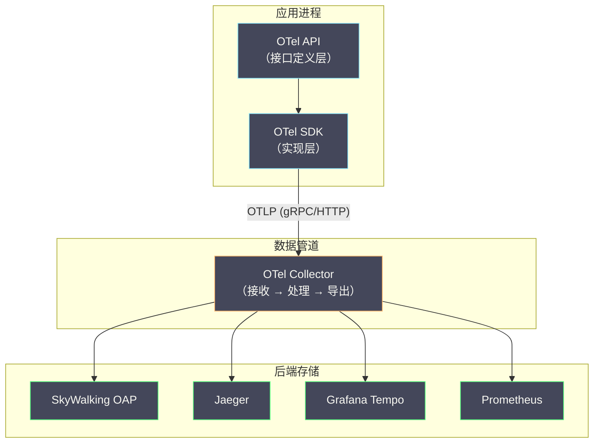
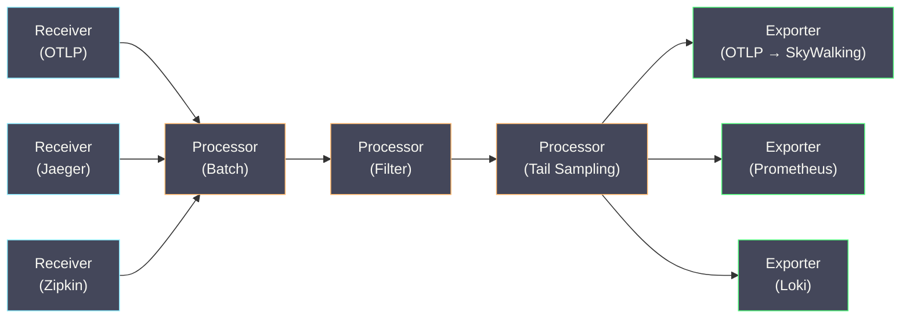

# 03 OpenTelemetry 统一标准

**摘要：**

在 OpenTelemetry 出现之前，链路追踪领域正处于"战国时代"——OpenTracing 只定义 API 不提供实现，OpenCensus 由 Google 主导却与前者互不兼容，Zipkin、Jaeger、SkyWalking 各自定义传播格式和数据模型，应用一旦选定了某个追踪系统，便被深度绑定。2019 年，OpenTracing 与 OpenCensus 宣布合并，OpenTelemetry（OTel）由此诞生，并逐步成为 CNCF 的官方可观测性标准项目，它的目标是**让应用的埋点代码与后端存储完全解耦**。本文沿着"标准为什么分裂、又为什么走向统一"这条主线，解析 OTel 的三层架构（API / SDK / Collector）、统一传输协议 OTLP 的设计动机与报文结构、Auto-Instrumentation 的实现原理，以及 OTel 与 SkyWalking 的协作方式，最终回答两个问题：OTel 凭什么成为统一标准，以及在已有系统中应当如何引入它。

---

## 第 1 章 标准分裂：OTel 之前的混乱局面

### 1.1 OpenTracing：有 API 无实现的尴尬

要理解 OpenTelemetry 为什么会长成今天这个样子，得先回到它诞生之前的那个"战国时代"。

2016 年，CNCF 接纳了 **OpenTracing** 项目，试图定义一套**厂商无关的链路追踪 API 标准**——应用代码只依赖 OpenTracing API，具体的实现（Zipkin、Jaeger、SkyWalking）通过运行时绑定注入。这个理念本身是正确的：**埋点代码不应该绑定具体的追踪后端**。面向接口编程的思想统治了 Java 世界二十年，追踪系统没有理由成为例外。

但 OpenTracing 有两个致命缺陷。

**缺陷一：只有 API 规范，没有官方 SDK 实现。**

OpenTracing 定义了 `Tracer`、`Span`、`SpanContext` 等接口，却不提供任何实现，每个追踪系统都得自己动手实现这些接口——Jaeger 提供 `jaeger-client`，Zipkin 提供 `brave`，SkyWalking 干脆自带 Agent。这就好比只颁布了度量衡的标准，却没有人去铸造符合标准的钱币：API 层面看似统一了，SDK 层面依然碎片化，切换后端仍然要更换 SDK 依赖、修改初始化代码。

**缺陷二：只覆盖链路追踪，不覆盖指标和日志。**

OpenTracing 只关注 Traces，对 Metrics 和 Logs 完全不涉足。而在实际生产中，三种信号必须深度协作——从 Trace 自动生成 RED 指标、在日志中自动注入 Trace ID，都是日常操作。一个只覆盖 Traces 的标准，从一开始就注定承担不起"统一可观测性"的使命。

### 1.2 OpenCensus：Google 的"全家桶"策略

2018 年，Google 发起了 **OpenCensus** 项目。与 OpenTracing"只定义 API"的做派不同，OpenCensus 提供了覆盖多种语言的**完整 SDK 实现**，同时支持 Traces 和 Metrics 的采集，开箱即用，不需要额外的实现代码。

听起来很美好，但问题恰恰出在"另一个标准"的诞生本身：

- **社区割裂**：两个标准并存，库的开发者不知道应该适配哪个，用户不知道应该选择哪个
- **Google 主导色彩浓厚**：设计决策主要由 Google 和 Microsoft 驱动，其他厂商的参与度较低
- **与 OpenTracing 不兼容**：数据模型和 API 均有差异，无法互操作

于是，一场本想终结碎片化的标准化努力，反而把水搅得更浑了。

### 1.3 社区的痛点：到底选哪个？

到 2018~2019 年，可观测性社区面临一个尴尬的局面：

```
应用开发者：我应该用 OpenTracing 还是 OpenCensus？
库开发者：我应该适配哪个标准？两个都适配成本太高
运维工程师：我们的 Java 服务用了 OpenTracing + Jaeger，
           Go 服务用了 OpenCensus + Stackdriver，数据无法互通

→ 两个标准的存在反而加剧了碎片化
```

请注意这个颇具讽刺意味的事实：**标准化本身成了碎片化的新来源**。这样的剧目在软件史上不止一次上演——CORBA 如此，Web Service 如此，可观测性领域也没能免俗。要走出困局，靠的不是再打一场标准战争，而是把对立的双方变成同一家。

---

## 第 2 章 OpenTelemetry 的诞生与定位

### 2.1 合并：OpenTracing + OpenCensus = OpenTelemetry

2019 年 5 月，正当所有人以为这场标准之争还要再打十年的时候，OpenTracing 和 OpenCensus 忽然宣布握手言和，合并为 **OpenTelemetry**（简称 OTel），先进入 CNCF Sandbox，后晋升为 Incubating 项目。

合并的核心承诺有四条：

- 继承 OpenTracing 的 API 设计理念（厂商无关）
- 继承 OpenCensus 的 SDK 实现能力（开箱即用）
- 同时覆盖 **Traces、Metrics、Logs** 三种信号（OpenTracing 只覆盖 Traces）
- 定义统一的传输协议 **OTLP**（解决各家协议不兼容的问题）

### 2.2 OTel 不是什么

理解 OTel"不是什么"，与理解它"是什么"同样重要。

**OTel 不是后端存储系统**：OTel 不存储数据、不提供查询 UI，只负责**数据的采集、处理和转发**，最终数据要发送到具体的后端（如 SkyWalking OAP、Jaeger、Grafana Tempo、Prometheus 等）。

**OTel 不是 APM 产品**：OTel 不提供告警、拓扑发现、根因分析等 APM 功能，这些能力由后端产品（如 SkyWalking、Datadog、New Relic）提供。

**OTel 不强制替换现有系统**：OTel 被设计为**增量引入**——你可以在已有的 SkyWalking Agent 基础上，逐步把部分服务切换到 OTel SDK，两者完全可以共存（SkyWalking OAP 支持接收 OTel 格式的数据）。

> [!note] OTel 的准确定位
> OpenTelemetry = **标准数据模型** + **多语言 SDK** + **统一传输协议（OTLP）** + **数据收集中间件（Collector）**
> 
> 它解决的是"数据怎么采、怎么传"的问题，不解决"数据怎么存、怎么查、怎么分析"的问题。

---

## 第 3 章 OTel 的三层架构

### 3.1 架构总览

OTel 的架构分为三个清晰的层次：



### 3.2 第一层：OTel API（接口定义层）

OTel API 是一组**纯接口定义**，不包含任何实现逻辑，核心接口有四个：

**TracerProvider**：创建和管理 Tracer 实例的工厂，一个应用通常只有一个全局的 TracerProvider。

**Tracer**：创建 Span 的接口，每个库或模块通过 `TracerProvider.getTracer("library-name", "version")` 获取自己的 Tracer 实例。

**Span**：代表一个追踪操作，提供 `setAttribute()`、`addEvent()`、`setStatus()`、`end()` 等方法。

**Context / Propagator**：管理 SpanContext 的进程内传播和跨进程传播。

**为什么要单独定义 API 层？**

这是 OTel 设计中最精妙的部分，答案藏在库开发者的两难处境里：**库的开发者只依赖 OTel API（零依赖、零开销），而不依赖 OTel SDK**。

不妨设想一个场景：你维护着一个开源的 HTTP 客户端库（譬如 `okhttp`），想为它添加链路追踪支持。如果你依赖了 OTel SDK，所有使用你的库的应用都会被迫引入 OTel SDK 及其传递依赖——即使用户根本不需要链路追踪。这在工程上是不可接受的。

OTel API 的解法是 **No-op 实现**：当应用没有配置 OTel SDK 时，所有 API 调用（`tracer.spanBuilder().startSpan()`）都返回一个**空操作（No-op）Span**，不记录任何数据、不产生任何性能开销；只有当应用显式注册了 OTel SDK，API 调用才会被路由到真正的实现。接口与实现分离、运行时才绑定——这门在 Java 世界被验证了二十年的老手艺，放到可观测性领域，依然是化解"库作者的两难"的最优解。

```java
// 库代码：只依赖 otel-api（轻量级，无传递依赖）
import io.opentelemetry.api.trace.Tracer;
import io.opentelemetry.api.trace.Span;

public class MyHttpClient {
    // 从全局 TracerProvider 获取 Tracer
    private static final Tracer tracer = 
        GlobalOpenTelemetry.getTracer("my-http-client", "1.0.0");
    
    public Response send(Request request) {
        // 如果应用没有配置 SDK → 返回 No-op Span，零开销
        // 如果应用配置了 SDK → 返回真实 Span，开始记录
        Span span = tracer.spanBuilder("HTTP " + request.method())
            .setSpanKind(SpanKind.CLIENT)
            .startSpan();
        try (Scope scope = span.makeCurrent()) {
            span.setAttribute("http.method", request.method());
            span.setAttribute("http.url", request.url());
            Response response = doSend(request);
            span.setAttribute("http.status_code", response.code());
            return response;
        } catch (Exception e) {
            span.setStatus(StatusCode.ERROR);
            span.recordException(e);
            throw e;
        } finally {
            span.end();
        }
    }
}
```

### 3.3 第二层：OTel SDK（实现层）

OTel SDK 是 API 的具体实现，运行在应用进程中，职责有三。

**Span 的创建与管理**：实现 TracerProvider 和 Tracer 接口，创建真实的 Span 对象，管理 Span 的生命周期。

**Span 的处理流水线**：SDK 定义了一条 **SpanProcessor** 流水线，Span 创建和结束时都要经过它：

- **SimpleSpanProcessor**：Span 结束时立即同步导出（适合开发调试，生产不推荐）
- **BatchSpanProcessor**：Span 结束时先进入内存队列，达到批量大小或超时后批量导出（生产推荐）

**Span 的导出**：SDK 通过 **SpanExporter** 把处理后的 Span 数据发送到后端：

- **OtlpGrpcSpanExporter**：通过 gRPC 发送 OTLP 格式数据到 OTel Collector
- **OtlpHttpSpanExporter**：通过 HTTP 发送 OTLP 格式数据
- **JaegerExporter**：发送 Jaeger 格式数据到 Jaeger Collector
- **ZipkinExporter**：发送 Zipkin 格式数据到 Zipkin Server
- **LoggingSpanExporter**：将 Span 输出到控制台日志（调试用）

**资源（Resource）**：SDK 通过 Resource 描述"谁在产生这些数据"——包括服务名（`service.name`）、服务版本（`service.version`）、部署环境（`deployment.environment`）、主机名、容器 ID 等信息。这些信息会附加到所有导出的 Span 上，是后端系统识别数据来源的关键。

### 3.4 第三层：OTel Collector（数据管道）

**OTel Collector** 是一个独立部署的二进制服务，作为应用与后端之间的**数据管道**。如果把应用比作发货的商家、后端比作收货的买家，Collector 扮演的就是物流分拨中心的角色——商家只管把包裹交给最近的分拨中心，不必关心最后由哪家承运商、走哪条路线送到门口；哪天换了收货地址，改的也只是分拨中心的调度单，商家对此一无所知，也无需知道。

它的核心价值由此而来：

**解耦应用与后端**：应用只需把数据发给 Collector（通过 OTLP 协议），Collector 负责转发到具体的后端。更换后端时，只需修改 Collector 配置，不需要修改应用代码，更不需要重新部署应用。

**数据处理能力**：Collector 可以在转发之前对数据做处理（过滤、聚合、采样、属性修改等），替后端减轻压力。

Collector 的架构由三个组件组成：



**Receivers（接收器）**：接收来自应用的数据，支持多种格式：OTLP（gRPC/HTTP）、Jaeger（Thrift/gRPC）、Zipkin（JSON/Thrift）、Prometheus（Pull/Push）等。

**Processors（处理器）**：对接收到的数据进行处理，常用的 Processor：

- **batch**：将数据批量化，减少后端写入次数
- **filter**：根据条件过滤掉不需要的数据（如过滤掉健康检查的 Trace）
- **tail_sampling**：尾部采样，只保留错误或慢请求的 Trace
- **attributes**：修改或删除 Span 的属性（如脱敏）
- **resource**：修改 Resource 信息

**Exporters（导出器）**：将处理后的数据发送到后端，支持多种后端：OTLP（通用）、Jaeger、Zipkin、Prometheus Remote Write、Elasticsearch、Kafka 等。

**一个典型的 Collector 配置**：

```yaml
# otel-collector-config.yaml
receivers:
  otlp:
    protocols:
      grpc:
        endpoint: 0.0.0.0:4317
      http:
        endpoint: 0.0.0.0:4318

processors:
  batch:
    timeout: 5s
    send_batch_size: 1024
  filter:
    traces:
      span:
        - 'attributes["http.target"] == "/health"'  # 过滤健康检查

exporters:
  otlp/skywalking:
    endpoint: skywalking-oap:11800
    tls:
      insecure: true
  prometheus:
    endpoint: 0.0.0.0:8889

service:
  pipelines:
    traces:
      receivers: [otlp]
      processors: [filter, batch]
      exporters: [otlp/skywalking]
    metrics:
      receivers: [otlp]
      processors: [batch]
      exporters: [prometheus]
```

---

## 第 4 章 OTLP：统一传输协议

### 4.1 为什么需要统一协议

在 OTel 之前，每个追踪系统都使用自己的传输协议：Zipkin 走 JSON over HTTP，Jaeger 走 Thrift over UDP 或 gRPC，SkyWalking 走自定义 Protobuf schema 的 gRPC。这意味着应用的 SDK 必须先知道后端是什么系统，才能用正确的协议发送数据——更换后端等于更换 SDK 加修改代码，这与 OpenTracing 想解决的问题如出一辙。

**OTLP（OpenTelemetry Protocol）** 是 OTel 定义的统一传输协议，所有 OTel 兼容的后端都必须支持 OTLP 接收。应用只需通过 OTLP 发送数据，不需要关心后端是什么系统。如果说 Collector 是物流分拨中心，OTLP 就是全行业统一的面单格式——包裹上印着同样的字段，任何分拨中心都认得。

### 4.2 OTLP 的协议设计

OTLP 支持两种传输方式：

**OTLP/gRPC**：基于 gRPC + Protocol Buffers，性能最优，是生产环境的推荐方式，默认端口 4317。

**OTLP/HTTP**：基于 HTTP + Protocol Buffers（或 JSON），兼容性更好（不依赖 gRPC 支持），适合浏览器和受限网络环境，默认端口 4318。

OTLP 的 Protobuf 数据结构（简化版）：

```protobuf
// 一次导出请求包含多个 ResourceSpans
message ExportTraceServiceRequest {
  repeated ResourceSpans resource_spans = 1;
}

// 每个 ResourceSpans 代表一个服务实例的所有 Span
message ResourceSpans {
  Resource resource = 1;           // 服务信息（service.name, host.name 等）
  repeated ScopeSpans scope_spans = 2;
}

// 每个 ScopeSpans 代表一个 Instrumentation Scope（如一个库）的所有 Span
message ScopeSpans {
  InstrumentationScope scope = 1;  // 库名和版本（如 "my-http-client" v1.0）
  repeated Span spans = 2;
}

// 单个 Span 的完整数据
message Span {
  bytes trace_id = 1;              // 16 字节
  bytes span_id = 2;               // 8 字节
  bytes parent_span_id = 4;        // 8 字节（可空）
  string name = 5;                 // 操作名
  SpanKind kind = 6;               // CLIENT/SERVER/PRODUCER/CONSUMER/INTERNAL
  fixed64 start_time_unix_nano = 7;
  fixed64 end_time_unix_nano = 8;
  repeated KeyValue attributes = 9;
  repeated Event events = 11;
  repeated Link links = 12;
  Status status = 15;
}
```

### 4.3 OTLP 的批量与压缩

OTLP 在设计上处处为网络传输效率打算：

**批量发送**：一次 `ExportTraceServiceRequest` 可以携带成百上千个 Span，大幅减少 HTTP/gRPC 请求数。SDK 的 `BatchSpanProcessor` 负责在内存中积攒 Span，达到阈值后一次性发出。

**Resource 去重**：同一个服务实例的所有 Span 共享同一个 `Resource` 对象（只发送一次），而不是每个 Span 都携带完整的 Resource 信息。对每秒产生数千个 Span的高吞吐服务来说，这一点点节省累积起来相当可观。

**gRPC 压缩**：OTLP/gRPC 支持 gzip 压缩，典型压缩比 3:1 ~ 5:1。

---

## 第 5 章 Auto-Instrumentation：零代码修改的埋点

### 5.1 手动埋点 vs 自动埋点

**手动埋点（Manual Instrumentation）**：开发者在代码中显式调用 OTel API 创建 Span、设置属性。优点是完全可控，缺点是侵入性大，而且要求开发者理解链路追踪的概念。

**自动埋点（Auto-Instrumentation）**：通过框架级的拦截机制（如 Java Agent、Python monkey-patching、Node.js require hooks），自动在 HTTP 请求处理、数据库查询、RPC 调用等关键路径上创建 Span，**不需要修改任何应用代码**。

OTel 为主流语言都提供了自动埋点能力：

| 语言 | 自动埋点机制 | 覆盖的框架 |
| :--- | :--- | :--- |
| **Java** | Java Agent（`-javaagent:` JVM 参数）| Spring Boot、gRPC、JDBC、Kafka、Redis、OkHttp 等 |
| **Python** | `opentelemetry-instrument` CLI 工具（monkey-patching）| Flask、Django、requests、SQLAlchemy、Celery 等 |
| **Node.js** | `@opentelemetry/auto-instrumentations-node`（require hooks）| Express、Koa、pg、mysql、Redis、gRPC 等 |
| **Go** | 无官方自动埋点（Go 缺乏运行时拦截机制）| 需手动埋点或使用 eBPF 方案 |
| **.NET** | `OpenTelemetry.AutoInstrumentation`（CLR Profiler API）| ASP.NET Core、HttpClient、EF Core、gRPC 等 |

### 5.2 Java Auto-Instrumentation 的工作原理

OTel Java Agent 的自动埋点机制与 SkyWalking Java Agent 同出一门，都基于 **Java Instrumentation API + 字节码增强**：

```
JVM 启动参数：
  java -javaagent:opentelemetry-javaagent.jar -jar myapp.jar

执行流程：
  1. JVM 加载 otel-javaagent.jar 中的 premain() 方法
  2. Agent 注册一个 ClassFileTransformer
  3. 每当 JVM 加载一个类时，Transformer 检查这个类是否匹配某个 Instrumentation Module
     （例如：javax.servlet.http.HttpServlet 匹配 Servlet Instrumentation）
  4. 如果匹配，使用 Byte Buddy 修改类的字节码：
     - 在方法入口插入 Span 创建逻辑
     - 在方法出口插入 Span 结束逻辑
     - 在异常捕获处插入异常记录逻辑
  5. 返回修改后的字节码，JVM 使用修改后的类继续执行
```

OTel Java Agent 与 SkyWalking Java Agent 的差异：

| 维度 | OTel Java Agent | SkyWalking Java Agent |
| :--- | :--- | :--- |
| **数据模型** | OTel 标准（Span + Resource）| SkyWalking 自定义（Segment + Span）|
| **传输协议** | OTLP（gRPC/HTTP）| SkyWalking gRPC 协议 |
| **后端依赖** | 任何支持 OTLP 的后端 | SkyWalking OAP |
| **插件数量** | ~100 个 Instrumentation Module | ~100+ 个插件 |
| **指标采集** | 支持（从 Span 自动生成 RED 指标）| 支持（OAP 端聚合）|
| **Profiling** | 不支持（OTel 尚未标准化 Profiling）| 支持（线程 dump Profiling）|

### 5.3 OTel 与 SkyWalking 的共存方案

在已经使用 SkyWalking Agent 的 Java 服务里，如何引入 OTel？笔者把它归纳为三种策略。

**策略一：SkyWalking OAP 接收 OTLP 数据**

SkyWalking OAP 从 9.x 版本开始支持通过 OTLP gRPC Receiver 直接接收 OTel 格式的数据。这意味着新服务可以用 OTel SDK/Agent 埋点，数据仍然发送到 SkyWalking OAP，在 SkyWalking UI 中统一查看。

```
旧服务 → SkyWalking Agent → SkyWalking OAP → SkyWalking UI
新服务 → OTel Agent → OTel Collector → SkyWalking OAP → SkyWalking UI
```

**策略二：OTel Collector 作为统一接入层**

所有服务（无论使用哪种 Agent）都把数据发送到 OTel Collector，由 Collector 统一转发到 SkyWalking OAP。SkyWalking Agent 也可以配置为将数据发送到 OTel Collector（通过 gRPC Exporter）。

**策略三：渐进式迁移**

先在非核心服务上试用 OTel Agent，验证兼容性和性能影响；再逐步扩展到更多服务；最终根据需要决定是否完全切换。

> [!info] 实际建议
> 对于 Java 生态、且已深度使用 SkyWalking 的团队，短期内没有必要切换到 OTel Agent——SkyWalking Agent 在 Java 生态的覆盖度和稳定性仍然领先。OTel 的价值更多体现在**多语言环境**（Go、Python、Node.js 服务使用 OTel SDK，Java 服务继续使用 SkyWalking Agent，数据统一汇入 SkyWalking OAP）和**后端灵活性**（未来可能需要同时将数据发送到多个后端）。
> 
> 工具没有高下之分，只有合不合适——这个结论放在可观测性领域，与放在架构设计的任何其他角落一样成立。

---

## 第 6 章 OTel 对 Metrics 和 Logs 的覆盖

### 6.1 OTel Metrics

OTel 的 Metrics 部分定义了与 [[Prometheus]] 数据模型兼容的指标类型：

| OTel 指标类型 | 对应 Prometheus 类型 | 用途 |
| :--- | :--- | :--- |
| **Counter** | Counter | 只增不减的计数器（如请求总数）|
| **UpDownCounter** | Gauge | 可增可减的计数器（如当前连接数）|
| **Histogram** | Histogram | 值的分布（如请求延迟分布）|
| **Gauge** | Gauge | 瞬时值（如 CPU 使用率）|

OTel SDK 采集的指标可以通过 **Prometheus Exporter** 暴露为 Prometheus 格式（让 Prometheus 来 Pull），也可以通过 **OTLP** 推送到 OTel Collector，再转发到 Prometheus Remote Write 端点。

### 6.2 OTel Logs

OTel 的 Logs 部分是三者中最晚成熟的（2023 年才达到 Stable 状态）。值得注意的是，OTel 对日志的定位并不是"替换现有的日志框架"（如 Log4j、Logback、Zap），而是做三件既有框架做不好的事：

- **关联**：在现有日志中自动注入 Trace ID 和 Span ID，使日志与链路追踪可以互相跳转
- **采集**：通过 OTel Collector 的 Filelog Receiver，采集日志文件并转发到后端（如 [[Grafana Loki]]、[[Elasticsearch]]）
- **结构化**：将非结构化的日志文本转换为结构化的 Log Record（带 Trace ID、Severity、Resource 等字段）

---

## 第 7 章 OTel 的未来方向

### 7.1 Profiling 信号

OTel 正在把 **Continuous Profiling** 作为第四种信号纳入标准。2024 年，OTel Profiling SIG（Special Interest Group）开始制定 Profiling 的数据模型和传输协议，目标是让 Profiling 数据也能通过 OTLP 传输，并与 Traces、Metrics、Logs 关联起来——从慢 Span 直接跳转到对应时间段的火焰图。

### 7.2 eBPF 原生支持

传统的自动埋点依赖语言运行时的拦截机制（Java Agent、Python monkey-patching），天然无法覆盖所有语言（特别是 Go 和 C/C++）。基于 [[eBPF]] 的链路追踪可以在内核层面拦截网络系统调用，实现**真正的语言无关自动埋点**。OTel 社区正在探索把 eBPF 作为一种新的自动埋点机制。

OTel 的故事还远没有讲完：Profiling 作为第四种信号正在标准化，eBPF 带来了语言无关埋点的另一种可能。但未来究竟如何发展，目前仍然言之尚早——毕竟在这个领域，我们已经见过太多自称"终极解决方案"的标准了。

---

## 参考资料

1. OpenTelemetry 官方文档：https://opentelemetry.io/docs/
2. OTLP Specification：https://opentelemetry.io/docs/specs/otlp/
3. OpenTelemetry Collector：https://opentelemetry.io/docs/collector/
4. OpenTelemetry Java Instrumentation：https://github.com/open-telemetry/opentelemetry-java-instrumentation
5. SkyWalking OTel Receiver：https://skywalking.apache.org/docs/main/latest/en/setup/backend/otlp-traces/
6. OpenTelemetry Profiling Vision：https://opentelemetry.io/docs/specs/otel/profiling/
7. W3C Trace Context：https://www.w3.org/TR/trace-context/
8. Sridharan, C. (2018). *Distributed Systems Observability*. O'Reilly Media.

---

> [!note] 思考题
> 1. OTel Collector 是可观测数据的中间层——接收（Receivers）→ 处理（Processors）→ 导出（Exporters）。Collector 可以部署为 Agent（每个节点/Pod 一个）或 Gateway（集中部署）。Agent 模式减少了网络跳数但增加了节点资源消耗，Gateway 模式集中管理但可能成为瓶颈。在 Kubernetes 中你如何选择部署模式？
> 2. Collector 的 Processor 支持数据转换——如 `batch`（批量处理减少导出次数）、`filter`（过滤不需要的数据）、`attributes`（添加/修改属性）和 `tail_sampling`（尾部采样）。尾部采样在 Collector 中等待 Trace 完成后再决定是否采集——需要在内存中缓存完整 Trace。在什么 Trace 量和延迟下尾部采样的内存需求是可控的？
> 3. Collector 的高可用和水平扩展——多个 Collector 实例通过负载均衡接收数据。但尾部采样要求同一 Trace 的所有 Span 发送到同一个 Collector 实例——否则无法做出完整的采样决策。`loadbalancing` Exporter 通过 TraceID 路由解决这个问题——它的实现原理是什么？
