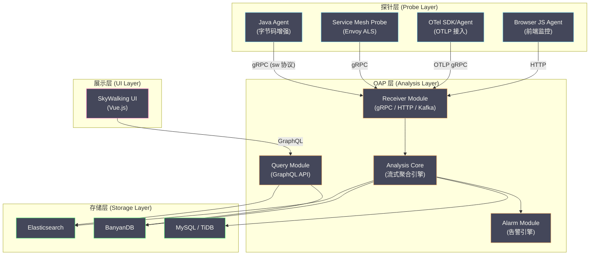

# 04 SkyWalking 整体架构深度解析

**摘要：**

[[Apache SkyWalking]] 是目前 Java 生态中最成熟的全栈 APM（Application Performance Management）系统。与 Zipkin、Jaeger 等"纯链路追踪"系统不同，SkyWalking 提供了**链路追踪 + 性能指标聚合 + 服务拓扑发现 + 告警 + 持续剖析**的完整能力。本文从 SkyWalking 的整体架构出发，深入剖析 Agent、OAP（Observability Analysis Platform）、UI 三层的职责划分与数据流转，重点解析 OAP 如何将原始 Segment 数据转化为拓扑图和聚合指标，以及 Elasticsearch、BanyanDB 两种存储后端的选型考量。

---

## 第 1 章 SkyWalking 的定位与设计哲学

### 1.1 不仅仅是链路追踪

很多人第一次接触 SkyWalking 时，会将它等同于"Java 的 Zipkin"——一个链路追踪系统。这个认知是不准确的。SkyWalking 的完整定位是 **APM（Application Performance Management）+ 可观测性分析平台**，链路追踪只是它的能力之一。

SkyWalking 提供的核心能力：

| 能力 | 说明 | 对应 Zipkin/Jaeger |
| :--- | :--- | :--- |
| **链路追踪** | Trace/Segment/Span 采集与查询 | ✓ 有 |
| **性能指标** | 服务/实例/端点级别的 P50/P99/QPS/错误率 | ✗ 无（需额外部署 Prometheus）|
| **服务拓扑** | 自动发现服务间调用关系，生成拓扑图 | ✗ 无（Jaeger 有基础版本）|
| **告警** | 基于指标阈值或异常检测触发告警 | ✗ 无 |
| **日志关联** | 将日志与 Trace ID 关联，在 UI 中联动查看 | ✗ 无 |
| **持续剖析** | 对慢 Span 触发线程 dump，生成火焰图 | ✗ 无 |
| **浏览器端监控** | 采集前端页面的性能数据（FP/FCP/LCP）| ✗ 无 |
| **基础设施监控** | 通过 [[Prometheus]] Exporter 或 OTel 接收 VM/K8s 指标 | ✗ 无 |

### 1.2 设计哲学：无侵入 + 流式分析

SkyWalking 的两个核心设计原则：

**原则一：无侵入（Non-Intrusive）**

SkyWalking 的 Java Agent 通过字节码增强实现埋点，**应用代码零修改**。这不仅仅是"方便"的问题——在大型企业中，要求每个团队在代码中添加追踪 SDK 是一个极其困难的推动过程（涉及代码审查、发布排期、回归测试等）。Java Agent 通过 JVM 参数 `-javaagent:` 注入，运维团队可以在部署层面统一配置，不需要开发团队的任何配合。

**原则二：流式分析（Streaming Analysis）**

SkyWalking OAP 不是简单地"存储 Span 然后查询"——它在接收 Segment 数据时，**实时进行流式分析**：从 Span 中提取服务名、端点名、响应时间等信息，实时计算 P50/P99/QPS/错误率等聚合指标，实时构建服务拓扑图。这意味着：

- **指标查询是 O(1) 的**：查看某个服务过去 1 小时的 P99 延迟，不需要扫描所有 Span 然后聚合——OAP 在数据接收时已经预聚合好了，查询时只需读取聚合结果
- **拓扑图是实时的**：新增一个服务或调用关系，几秒内就能在拓扑图中看到
- **存储压力更小**：聚合后的指标数据量远小于原始 Span 数据量

---

## 第 2 章 三层架构总览

### 2.1 架构图

SkyWalking 的架构分为三层：



### 2.2 数据流：从 Agent 到 UI 的完整路径

一个请求的链路数据在 SkyWalking 中经历的完整流转过程：

```
1. Agent 端（应用进程内）
   → 字节码增强拦截 HTTP 入口 → 创建 EntrySpan
   → 拦截数据库调用 → 创建 ExitSpan
   → 拦截 HTTP 出口调用 → 创建 ExitSpan + 注入 sw8 Header
   → 请求处理完成 → 整个 Segment 完成
   → 放入本地缓冲区（环形队列）
   → 后台线程通过 gRPC 流式发送到 OAP

2. OAP Receiver 端
   → 接收 gRPC 流中的 Segment 数据
   → 反序列化 Protobuf → 得到 Segment 对象

3. OAP Analysis Core
   → 从 Segment 中提取：
     - 服务名、实例名、端点名
     - 响应时间、是否错误
     - 上下游调用关系（从 EntrySpan 和 ExitSpan 的 Peer 信息）
   → 流式聚合：
     - 更新端点级别的 P50/P75/P90/P95/P99 延迟
     - 更新服务级别的 QPS、错误率
     - 更新服务拓扑关系
   → 将原始 Segment 和聚合指标分别写入存储

4. 存储层
   → Segment 数据存入 Trace 索引（按 Trace ID 可查询）
   → 聚合指标存入 Metrics 索引（按服务/端点 + 时间范围可查询）
   → 拓扑关系存入 Topology 索引

5. 查询与展示
   → 用户在 UI 上查看拓扑图 → UI 调用 GraphQL API → Query 模块从存储读取拓扑数据
   → 用户点击某个服务 → 查看该服务的指标（P99、QPS）→ 从 Metrics 索引读取
   → 用户点击某个慢请求 → 查看 Trace 详情 → 从 Trace 索引按 Trace ID 读取所有 Segment
```

---

## 第 3 章 Agent 层：数据采集的前线

### 3.1 Agent 的核心职责

SkyWalking Agent 运行在应用进程内，核心职责有三个：

**职责一：自动埋点**

通过字节码增强，在框架的关键方法（如 `javax.servlet.http.HttpServlet.service()`、`java.sql.PreparedStatement.execute()`）的入口和出口注入追踪逻辑，创建对应的 Span。这部分将在第 05 篇详细讲解。

**职责二：Context 管理**

维护当前线程的 Trace Context（通过 ThreadLocal），管理 Span 的父子关系。当检测到跨进程调用（如 HTTP 出口、Kafka 生产者）时，将 SpanContext 序列化到传输载体（HTTP Header 或 Kafka Message Header）中。

**职责三：数据上报**

将完成的 Segment 数据通过 gRPC 流式发送到 OAP。Agent 内部维护了一个**环形缓冲区（Ring Buffer）**作为本地暂存：

```
Agent 数据上报流程：

业务线程                          上报线程
   │                                │
   ├── 创建 Span                     │
   ├── 处理请求                      │
   ├── 结束 Span                     │
   ├── Segment 完成                  │
   ├── 放入 Ring Buffer ────────────→│
   │   （非阻塞，如果满了则丢弃）       ├── 从 Ring Buffer 取出 Segment
   │                                ├── 序列化为 Protobuf
   │                                ├── 通过 gRPC Stream 发送到 OAP
   │                                └── 如果发送失败，重试或丢弃
```

**Ring Buffer 的设计考量**：

使用环形缓冲区而不是阻塞队列，是因为**业务线程绝不能因为链路追踪而被阻塞**。如果 OAP 不可用或网络延迟，Ring Buffer 满了之后新的 Segment 会被**静默丢弃**——牺牲追踪数据的完整性，保证业务零影响。这是 Dapper 论文"低开销"原则的直接体现。

### 3.2 Agent 的配置与调优

Agent 的核心配置文件是 `agent.config`（或通过环境变量/JVM 系统属性覆盖）：

| 配置项 | 默认值 | 说明 |
| :--- | :--- | :--- |
| `agent.service_name` | 必填 | 服务名，OAP 用它来标识服务 |
| `collector.backend_service` | `127.0.0.1:11800` | OAP 的 gRPC 地址 |
| `agent.sample_n_per_3_secs` | `-1`（全量）| 每 3 秒最多采样 N 条 Trace |
| `buffer.channel_size` | `5` | Ring Buffer 的 Channel 数量 |
| `buffer.buffer_size` | `300` | 每个 Channel 的缓冲区大小 |
| `agent.ignore_suffix` | `.jpg,.png,.css,.js` | 忽略的 URL 后缀（不追踪静态资源）|
| `agent.span_limit_per_segment` | `300` | 单个 Segment 最多 Span 数量（防止无限递归）|

> [!warning] 生产避坑：agent.span_limit_per_segment
> 如果一个请求内部有大量循环调用（如 for 循环中调用数据库 1000 次），每次调用都会创建一个 Span，可能导致单个 Segment 非常大，既占内存又增加 OAP 处理压力。`span_limit_per_segment` 配置了上限，超过后新 Span 不再创建。默认 300 在大多数场景下够用，但 batch 插入场景（如 MyBatis 批量插入）可能需要调大。

---

## 第 4 章 OAP 层：可观测性分析的大脑

### 4.1 OAP 的模块化架构

OAP（Observability Analysis Platform）是 SkyWalking 的后端核心，采用**高度模块化**的架构设计。每个功能都是一个独立的 Module，通过 SPI（Service Provider Interface）机制加载：

| Module | 职责 |
| :--- | :--- |
| **receiver-trace** | 接收 Agent 上报的 Segment 数据（gRPC）|
| **receiver-otel** | 接收 OTel OTLP 格式的数据 |
| **receiver-meter** | 接收 Prometheus 格式的指标数据 |
| **receiver-log** | 接收日志数据 |
| **analysis** | 流式分析引擎核心（MAL + OAL）|
| **storage-elasticsearch** | Elasticsearch 存储实现 |
| **storage-banyandb** | BanyanDB 存储实现 |
| **query-graphql** | GraphQL 查询接口 |
| **alarm** | 告警规则引擎 |
| **configuration** | 动态配置管理（支持 Apollo、Nacos、etcd 等）|

这种模块化设计的好处是：可以根据需要只加载必要的模块。例如，如果只需要链路追踪（不需要指标和告警），可以只启用 `receiver-trace` + `analysis` + `storage` + `query-graphql`，减少资源消耗。

### 4.2 OAL（Observability Analysis Language）：指标聚合的 DSL

OAP 的流式分析引擎使用一种名为 **OAL（Observability Analysis Language）** 的领域特定语言来定义指标的聚合逻辑。OAL 脚本定义了"从哪些源数据中提取什么字段，用什么聚合函数，生成什么指标"。

**一个 OAL 脚本示例**：

```
// 服务级别的响应时间百分位数
service_resp_time = from(Service.latency).longAvg();
service_p99 = from(Service.latency).p99(10, 10000);  // 精度10ms，最大值10000ms

// 端点级别的 QPS
endpoint_cpm = from(Endpoint.*).cpm();  // Calls Per Minute

// 服务级别的错误率
service_sla = from(Service.*).percent(status == true);  // status=true 表示成功

// 服务关系级别的平均响应时间（用于拓扑图上的调用延迟标注）
service_relation_resp_time = from(ServiceRelation.latency).longAvg();
```

**OAL 的执行流程**：

```
Segment 到达 OAP
    ↓
Segment 被解析为一系列 Source 对象：
  - Service Source（服务名、延迟、状态）
  - Endpoint Source（端点名、延迟、状态）
  - ServiceRelation Source（调用方服务名、被调用方服务名、延迟）
  - ServiceInstance Source（实例名、延迟、状态）
    ↓
每个 Source 对象被分发到所有匹配的 OAL 规则：
  - Service Source → service_resp_time, service_p99, service_sla
  - Endpoint Source → endpoint_cpm
  - ServiceRelation Source → service_relation_resp_time
    ↓
OAL 引擎在内存中维护聚合窗口（默认 1 分钟）：
  - 1 分钟内的所有 latency 值被收集
  - 窗口结束时计算 avg、p99 等
    ↓
聚合结果写入存储（按"服务名 + 时间桶"索引）
```

### 4.3 拓扑图的自动发现

SkyWalking 的服务拓扑图是**自动发现**的——不需要手动配置服务间的依赖关系，OAP 从 Segment 数据中自动提取。

**发现逻辑**：

当 OAP 收到一个 Segment，如果 Segment 中包含一个 **ExitSpan**（服务出口调用），ExitSpan 中有一个 `peer` 字段，记录了被调用方的地址（如 `payment-service:8080` 或 `mysql:3306`）。OAP 从 ExitSpan 的 `peer` 信息中提取被调用方的服务名，结合当前 Segment 的服务名，就得到了一条"服务 A 调用服务 B"的关系。

**难点：如何识别被调用方的服务名？**

ExitSpan 的 `peer` 可能是 IP + 端口（如 `10.0.0.5:8080`），而不是服务名。OAP 需要将 IP 映射回服务名。有两种方式：

- **Agent 端注入**：如果被调用方也部署了 SkyWalking Agent，Agent 在处理 EntrySpan 时会在响应中携带自己的服务名信息（通过 sw8 Header 的 correlation 部分），调用方 Agent 可以从响应中获取被调用方的服务名
- **OAP 端关联**：OAP 维护了一个"实例 → 服务名"的映射表。当 Agent 注册时，会上报自己的服务名和实例地址（IP + 端口），OAP 用这个映射表将 ExitSpan 的 `peer` 转换为服务名

对于外部依赖（如 MySQL、Redis、Kafka），Agent 无法获取对方的"服务名"，但 Agent 会根据调用类型自动生成一个虚拟服务名（如 `mysql:3306`、`kafka-cluster`），在拓扑图中显示为外部依赖节点。

---

## 第 5 章 存储层：Elasticsearch vs BanyanDB

### 5.1 SkyWalking 的数据类型

SkyWalking 存储的数据分为三大类，对存储引擎的要求各不相同：

| 数据类型 | 特征 | 读写模式 | 数据量 |
| :--- | :--- | :--- | :--- |
| **Trace（Segment）** | 原始链路数据，按 Trace ID 查询 | 写多读少，按 ID 点查 | 极大（TB 级/天）|
| **Metrics（指标）** | 聚合后的时间序列，按服务+时间范围查询 | 写多读多，范围查询 | 中等（GB 级/天）|
| **Metadata（元数据）** | 服务列表、实例列表、拓扑关系 | 读多写少，全量查询 | 小（MB 级）|

### 5.2 Elasticsearch 作为存储后端

[[Elasticsearch]]（ES）是 SkyWalking 最成熟、使用最广泛的存储后端。SkyWalking 在 ES 中为每种数据类型创建独立的索引（带日期后缀，支持按天滚动和自动清理）：

```
索引命名规则：
  sw_segment-20240101          ← Trace 数据（按天分索引）
  sw_metrics-p99-20240101      ← P99 指标数据
  sw_service_traffic-20240101  ← 服务元数据
  sw_service_relation-20240101 ← 服务拓扑关系
```

**ES 存储的优势**：
- 成熟稳定，运维经验丰富
- 全文搜索能力强（可以按 Trace ID、Endpoint Name 搜索）
- 生态完善（Kibana 可视化、Index Lifecycle Management 自动清理）

**ES 存储的劣势**：
- **资源开销大**：ES 的倒排索引对时间序列数据（Metrics）不是最优的存储格式，写入放大明显
- **成本高**：ES 集群通常需要大量内存（JVM Heap + OS Page Cache），3 节点起步的 ES 集群每月成本可观
- **时间序列查询效率一般**：Metrics 的"按服务+时间范围聚合查询"，ES 的性能不如专用的 [[TSDB]]

### 5.3 BanyanDB：SkyWalking 的原生存储

**BanyanDB** 是 SkyWalking 社区从零开发的专用存储引擎，2023 年开始进入生产就绪状态。BanyanDB 针对 SkyWalking 的三种数据类型做了定制化优化：

**Trace 存储优化**：
- 使用 **倒排索引 + 列式存储** 的混合结构
- Trace ID 查询走倒排索引（O(1) 查找）
- 按时间范围扫描走列式存储（顺序读取）

**Metrics 存储优化**：
- 使用类似 TSDB 的**时间分片（Time Shard）**结构
- 每个时间窗口的指标数据紧凑存储，范围查询只扫描必要的时间分片
- 比 ES 的写入放大小得多（ES 需要维护倒排索引，BanyanDB 只需要追加写入）

**资源消耗对比**：

| 维度 | Elasticsearch | BanyanDB |
| :--- | :--- | :--- |
| **内存需求** | 高（JVM Heap + Page Cache）| 低（Go 实现，内存可控）|
| **磁盘使用** | 高（倒排索引膨胀）| 低（列式压缩）|
| **写入性能** | 中（需要构建倒排索引）| 高（追加写入为主）|
| **Trace 查询** | 快（倒排索引）| 快（倒排索引）|
| **Metrics 查询** | 中 | 快（时间分片优化）|
| **运维复杂度** | 高（JVM 调优、分片管理）| 低（单二进制部署）|
| **生态成熟度** | 非常成熟 | 早期（社区仍在快速迭代）|

> [!info] 存储选型建议
> - **已有 ES 集群且运维经验丰富**：继续使用 ES，稳定可靠
> - **新部署、追求低成本低运维**：考虑 BanyanDB，资源消耗显著更低
> - **超大规模（日均 TB 级 Trace）**：ES 集群成本高昂，BanyanDB 或 Kafka + 对象存储方案更经济
> - **需要日志全文搜索能力**：ES 不可替代（BanyanDB 不支持全文搜索）

---

## 第 6 章 UI 层与 GraphQL API

### 6.1 SkyWalking UI 的核心视图

SkyWalking UI 是一个 Vue.js 单页应用，提供以下核心视图：

**全局拓扑图（Topology）**：展示所有服务及其调用关系的拓扑图，每条边上标注调用的平均延迟和 QPS。支持按时间范围过滤和按服务名搜索。

**服务仪表盘（Service Dashboard）**：展示单个服务的详细指标：P50/P75/P90/P95/P99 延迟、QPS、错误率、Apdex 评分。支持多种时间粒度（分钟/小时/天）。

**Trace 查询（Trace Query）**：按 Trace ID、服务名、端点名、时间范围、最小延迟等条件搜索 Trace，展示完整的调用树和瀑布图。

**告警（Alarm）**：展示触发的告警列表，支持按严重级别和时间范围过滤。

**Profile（性能剖析）**：展示持续剖析任务的结果，以火焰图形式展示指定端点的线程栈采样数据。

### 6.2 GraphQL API

UI 与 OAP 之间通过 **GraphQL** 通信。GraphQL 相比 REST API 的优势是：客户端可以精确指定需要的字段，避免过度传输。

```graphql
# 查询某个服务过去 1 小时的 P99 延迟
query {
  readMetricsValues(condition: {
    name: "service_p99"
    entity: { serviceName: "order-service", normal: true }
  }, duration: {
    start: "2024-01-01 0900"
    end: "2024-01-01 1000"
    step: MINUTE
  }) {
    values {
      values { value }
    }
  }
}
```

---

## 第 7 章 高可用部署

### 7.1 OAP 集群部署

OAP 支持多实例集群部署，多个 OAP 实例之间通过**集群协调器**同步元数据（服务列表、实例列表等）。支持的集群协调器包括：

- [[ZooKeeper]]
- [[Kubernetes]] （通过 K8s API 自动发现 OAP Pod）
- [[etcd]]
- [[Consul]]
- [[Nacos]]

Agent 可以配置多个 OAP 地址（逗号分隔），通过客户端负载均衡将 Segment 数据分发到不同的 OAP 实例。OAP 实例之间**不需要互相同步 Segment 数据**——每个 OAP 独立接收和处理分配到自己的 Segment。

**OAP 无状态化设计**：OAP 本身是无状态的（所有持久化数据都在存储层），可以随时水平扩缩容。增加 OAP 实例只需启动新的进程并注册到集群协调器，Agent 会自动感知并开始向新实例发送数据。

### 7.2 Kafka 作为中间缓冲

在超大规模场景下（每秒数十万 Segment），Agent 直连 OAP 可能导致 OAP 过载。SkyWalking 支持通过 [[Apache Kafka]] 作为中间缓冲：

```
Agent → Kafka Topic (skywalking-segments) → OAP Kafka Fetcher → Analysis → Storage
```

Kafka 的引入带来了以下好处：
- **削峰填谷**：突发流量先写入 Kafka，OAP 按自身处理能力消费
- **Agent 端更可靠**：写入 Kafka 的延迟远低于直连 OAP（Kafka 追加写入），减少 Agent 的 Ring Buffer 溢出概率
- **OAP 重启不丢数据**：OAP 重启期间，数据暂存在 Kafka 中，重启后继续消费

---

## 参考资料

1. Apache SkyWalking 官方文档：https://skywalking.apache.org/docs/
2. SkyWalking OAL Reference：https://skywalking.apache.org/docs/main/latest/en/concepts-and-designs/oal/
3. BanyanDB 设计文档：https://skywalking.apache.org/docs/skywalking-banyandb/latest/
4. Wu Sheng (2020). Apache SkyWalking: Application Performance Monitoring for Distributed Systems. Medium.
5. SkyWalking GitHub Repository：https://github.com/apache/skywalking
6. SkyWalking Kafka Fetcher：https://skywalking.apache.org/docs/main/latest/en/setup/backend/backend-kafka-fetcher/

---

> [!note] 思考题
> 1. 一个 Trace 由多个 Span 组成——每个 Span 代表一个操作（如 HTTP 请求、数据库查询）。Span 之间的父子关系形成了树形结构——根 Span 是入口请求。在一个有 20 个微服务的调用链中，一个 Trace 可能包含 50+ 个 Span。如何通过 Span 的 `status` 和 `duration` 快速定位延迟最大的服务？
> 2. 异步调用（如消息队列消费）的 Trace 如何关联——Producer 发送消息时将 Trace Context 嵌入消息头，Consumer 消费时从消息头恢复 Trace Context 并创建新 Span。这样异步调用也能出现在同一个 Trace 中。但如果 Consumer 是批量处理（一次消费 100 条消息），每条消息的 Trace Context 不同——你如何处理？
> 3. Span 的 Attributes（属性）记录了操作的详细信息——如 HTTP 方法、URL、状态码、数据库语句。但过多的 Attributes 增加了数据量和存储成本。OTel 的 Semantic Conventions 定义了标准的 Attribute 名称和值——遵循这些约定有什么好处？在什么场景下你需要自定义 Attribute？
