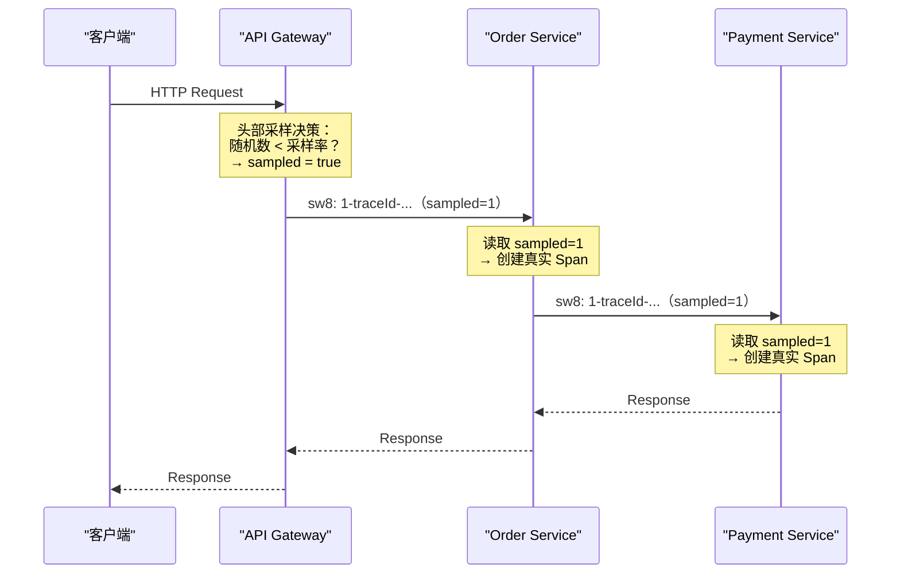

# 06 SkyWalking 采样策略与性能影响

**摘要：**

链路追踪系统面临一个根本性的矛盾：**数据越完整，排查问题越容易；但数据越多，存储和传输的成本越高，对业务系统的性能影响也越大**。采样（Sampling）是解决这个矛盾的核心手段——只记录一部分请求的链路数据，在信息完整性与资源开销之间找到平衡点。本文深入分析 [[Apache SkyWalking]] 的采样机制实现细节，对比头部采样与尾部采样的本质差异，量化链路追踪对业务系统的性能影响，并给出不同业务场景下的采样策略配置建议。

---

## 第 1 章 采样的根本矛盾

### 1.1 全量采集的代价

假设一个中等规模的微服务系统：
- 50 个微服务
- 平均每个请求经过 8 个服务（产生 8 个 Segment，约 20 个 Span）
- 系统总 QPS = 10,000

全量采集的数据量：

```
每个 Span 平均大小 ≈ 500 字节（包含 Attributes、Component、Peer 等）
每秒 Span 数 = 10,000 × 20 = 200,000
每秒数据量 = 200,000 × 500 B = 100 MB/s
每天数据量 = 100 MB/s × 86,400 = 8.64 TB/天
```

8.64 TB/天的原始链路数据意味着：
- **存储成本**：即使使用压缩，Elasticsearch 集群也需要 TB 级的 SSD 存储，按 7 天保留计算约 60 TB
- **网络带宽**：50 个服务的 Agent 总共每秒向 OAP 发送 100 MB 数据，需要千兆网络带宽
- **OAP 处理压力**：每秒 20 万个 Span 的反序列化、分析、聚合、写入存储
- **Agent 端开销**：每个服务实例每秒需要序列化和发送数千个 Span

### 1.2 不采样的后果：不仅仅是成本

全量采集不仅仅是"多花钱"的问题，它还可能**反过来影响业务系统的稳定性**：

**Agent 端内存压力**：每个 Span 在上报前需要暂存在 Agent 的 Ring Buffer 中。高 QPS 场景下，如果上报速度跟不上 Span 产生速度，Ring Buffer 满后新的 Span 会被丢弃——但在丢弃之前，大量 Span 对象的创建和 GC 回收本身就会增加 [[JVM GC]] 压力。

**网络抖动放大效应**：如果 Agent 到 OAP 的网络出现短暂延迟，全量模式下积压的数据量远大于采样模式，恢复后的突发流量可能导致 OAP 过载。

**OAP 雪崩风险**：OAP 的流式分析引擎有处理能力上限。全量数据超过这个上限时，OAP 的处理延迟增加 → Agent 的 gRPC 请求超时 → Agent 重试 → OAP 压力更大 → 恶性循环。

### 1.3 采样的核心权衡

采样不是"无损压缩"——它是有信息损失的。采样率越低，丢失的信息越多：

| 采样率 | 每天数据量（上述场景）| 信息完整性 | 适用场景 |
| :--- | :--- | :--- | :--- |
| **100%** | 8.64 TB | 完整 | 低流量系统、安全审计、金融交易 |
| **10%** | 864 GB | 高频接口信息充分，低频接口可能缺失 | 中等流量生产环境 |
| **1%** | 86 GB | 只有高频接口有足够样本 | 高流量生产环境 |
| **0.1%** | 8.6 GB | 大量接口无样本，只能看到热点路径 | 超高流量、成本敏感 |

关键认知：**采样率的选择不应该是一个全局统一的数字**。高频接口（QPS = 10,000）即使 1% 采样率，每秒仍有 100 条样本，足够做统计分析；但低频接口（QPS = 1）在 1% 采样率下，平均 100 秒才有 1 条样本——如果这个接口在某一秒出了问题，很可能恰好没被采样到。

---

## 第 2 章 头部采样：SkyWalking 的默认策略

### 2.1 头部采样的工作原理

**头部采样（Head-based Sampling）** 在请求进入系统的第一个服务（Root Span 创建时）就做出采样决策：这个 Trace 要不要记录？

决策一旦做出，就被编码到 SpanContext 中，传播到整条调用链的所有下游服务。所有下游服务遵守这个决策——要么整条链路全部记录，要么全部不记录。



### 2.2 SkyWalking Agent 的采样配置

SkyWalking Agent 提供两种头部采样配置：

**方式一：`agent.sample_n_per_3_secs`**

```properties
# 每 3 秒最多采样 N 条 Trace
# -1 = 全量采样（默认值）
# 0 = 不采样
# 正整数 = 每 3 秒最多采样 N 条
agent.sample_n_per_3_secs=100
```

这是一种**速率限制采样（Rate Limiting Sampling）**：每 3 秒最多记录 100 条 Trace。它的特点是：
- 采样数量恒定（不管 QPS 是 100 还是 100,000，每 3 秒都最多 100 条）
- 低流量时接近全量采样
- 高流量时等效采样率自动降低

**方式二：通过 `apm-trace-ignore-plugin` 忽略特定路径**

```properties
# 忽略健康检查、静态资源等无需追踪的路径
trace.ignore_path=/health,/actuator/**,/favicon.ico,*.css,*.js,*.png
```

这不是传统意义上的"采样"，而是**过滤**——直接排除不需要追踪的请求类型，减少无价值数据。

### 2.3 采样决策的传播一致性

头部采样的一个关键约束是：**整条调用链必须使用同一个采样决策**。

如果 API Gateway 决定采样（sampled=1），但 Order Service 的 Agent 配置了更低的采样率，Order Service 不能单方面推翻这个决策——否则会出现"半条链路"：Gateway 的 Span 有，Order Service 的 Span 没有，Trace 断裂。

SkyWalking 的实现方式是：**下游服务的采样决策以上游传播的 `sw8` Header 为准**。只有在 Root Span（没有上游传播的 sw8 Header）时，才根据本地的采样配置做决策。

```
采样决策逻辑（伪代码）：

if (收到了上游的 sw8 Header) {
    // 下游服务：遵循上游的采样决策
    sampled = sw8.sampledFlag;
} else {
    // Root Span：根据本地采样配置决策
    sampled = SamplingService.trySampling();
}
```

这意味着：**采样配置应该在入口服务（API Gateway）上设置**，下游服务的 `sample_n_per_3_secs` 只影响以该服务为 Root Span 的请求（如定时任务、消息消费等不经过 Gateway 的请求）。

### 2.4 头部采样的固有缺陷

头部采样有一个无法回避的根本缺陷：**在请求入口处，无法预知这个请求后续会不会出错、会不会异常缓慢**。

一个采样率为 1% 的系统，如果某个请求触发了一个罕见的 bug（导致 500 错误），这个请求有 99% 的概率没有被采样——工程师在链路追踪系统中找不到这条链路，只能靠日志和指标去定位。

这个缺陷在以下场景中尤其严重：
- **低频错误**：错误率 0.01%，采样率 1%，平均需要 100 万个请求才能采到 1 条错误链路
- **尾部延迟**：P99.9 的慢请求在采样率 1% 下，平均需要 10 万个请求才能采到 1 条
- **间歇性故障**：只在特定条件下触发的问题，采样可能完全错过

---

## 第 3 章 尾部采样：保留最有价值的链路

### 3.1 尾部采样的工作原理

**尾部采样（Tail-based Sampling）** 将采样决策推迟到 **Trace 的所有 Span 都收集完成之后**。此时可以看到 Trace 的全貌——是否包含错误、总耗时是多少、经过了哪些服务——然后根据这些信息决定是否保留这条 Trace。

```
尾部采样流程：

1. 所有 Agent 先全量上报 Span（不做采样决策）
2. 数据到达中间缓冲层（如 OTel Collector 或 Kafka）
3. 缓冲层等待 Trace 的所有 Span 到齐（或等待超时）
4. 根据完整 Trace 的属性做采样决策：
   - 包含错误 Span → 100% 保留
   - 总耗时 > 阈值（如 2 秒）→ 100% 保留
   - 正常请求 → 按概率采样（如 1%）
5. 被保留的 Trace 发送到后端存储
6. 被丢弃的 Trace 释放缓冲区空间
```

### 3.2 尾部采样的实现难点

尾部采样看起来完美解决了头部采样的缺陷，但它的实现复杂度远高于头部采样：

**难点一：如何判断 Trace 已经"完成"？**

在分布式系统中，一个 Trace 的最后一个 Span 可能来自任何服务。缓冲层无法确切知道"所有 Span 都到齐了"，只能设置一个**等待超时**（如 30 秒）——超时后不管是否完整，都做采样决策。

这个超时需要权衡：
- 太短（如 5 秒）→ 异步调用链可能不完整（如消息队列消费延迟 > 5 秒）
- 太长（如 5 分钟）→ 缓冲区内存压力大，采样决策延迟高

**难点二：缓冲区内存消耗**

全量上报 + 缓冲等待意味着所有 Span 都需要暂存在内存中。以前面的例子（每秒 20 万 Span，每个 500 字节），等待 30 秒：

```
缓冲区内存 = 200,000 span/s × 500 B × 30 s = 3 GB
```

3 GB 的内存用于缓冲，对于 OTel Collector 来说是可接受的（但需要足够的内存配置）。

**难点三：分布式 Trace 的全局聚合**

如果多个 OTel Collector 实例并行运行（高可用部署），同一个 Trace 的不同 Span 可能到达不同的 Collector 实例。尾部采样需要将同一个 Trace 的所有 Span **路由到同一个 Collector 实例**（通过 Trace ID 一致性 Hash），或者使用集中式的采样决策服务。

### 3.3 OTel Collector 的尾部采样实现

[[OpenTelemetry Collector]] 提供了 **Tail Sampling Processor**，支持基于多种条件的尾部采样：

```yaml
processors:
  tail_sampling:
    # 等待 Trace 完成的超时时间
    decision_wait: 30s
    # 同时缓冲的最大 Trace 数量
    num_traces: 100000
    # 每秒做多少次采样决策
    expected_new_traces_per_sec: 10000
    # 采样策略（按顺序评估，第一个匹配的策略生效）
    policies:
      # 策略 1：错误请求 100% 保留
      - name: errors-policy
        type: status_code
        status_code: {status_codes: [ERROR]}
      
      # 策略 2：慢请求（>2s）100% 保留  
      - name: latency-policy
        type: latency
        latency: {threshold_ms: 2000}
      
      # 策略 3：特定服务的请求提高采样率
      - name: important-service
        type: string_attribute
        string_attribute:
          key: service.name
          values: [payment-service, order-service]
      
      # 策略 4：其他正常请求 1% 采样
      - name: default-policy
        type: probabilistic
        probabilistic: {sampling_percentage: 1}
```

### 3.4 SkyWalking 对尾部采样的支持

SkyWalking 本身的 Agent 和 OAP 不直接支持尾部采样——SkyWalking Agent 做的是头部采样。但可以通过以下架构实现尾部采样：

```
Agent（全量上报） → OTel Collector（Tail Sampling）→ SkyWalking OAP

或者：

Agent（全量上报） → Kafka → OTel Collector（Tail Sampling）→ SkyWalking OAP
```

在这种架构中：
- Agent 配置 `sample_n_per_3_secs=-1`（全量上报）
- OTel Collector 的 Tail Sampling Processor 做采样决策
- 只有被保留的 Trace 发送到 SkyWalking OAP

> [!warning] 全量上报 + 尾部采样的资源代价
> 全量上报意味着 Agent 端的 Span 创建、序列化、网络传输开销与不采样时完全相同。尾部采样只减少了后端存储的数据量，**不减少 Agent 端和网络传输的开销**。如果 Agent 端的性能开销是瓶颈，尾部采样无法帮助——仍然需要在 Agent 端做头部采样来降低开销。

---

## 第 4 章 链路追踪的性能影响量化

### 4.1 Agent 端的 CPU 开销

SkyWalking Agent 的 CPU 开销来自以下几个环节：

| 环节 | 每次调用开销 | 说明 |
| :--- | :--- | :--- |
| **Span 创建** | ~1-3 μs | 创建 Span 对象、设置初始字段 |
| **Attribute 设置** | ~0.5 μs/个 | HashMap 的 put 操作 |
| **Context 传播（进程内）** | ~0.5 μs | ThreadLocal 的 get/set |
| **Context 传播（跨进程）** | ~5-10 μs | sw8 Header 的序列化/反序列化 |
| **Span 结束 + 入队** | ~2-5 μs | 计算 duration、放入 Ring Buffer |
| **Segment 序列化** | ~10-50 μs/Segment | Protobuf 序列化（后台线程执行）|

对于一个典型的 HTTP 请求处理（创建 1 个 EntrySpan + 2 个 ExitSpan + 1 个 LocalSpan）：

```
追踪开销 ≈ (3 + 3 + 3 + 3) μs（Span 创建+结束）
         + 10 μs（Context 传播）
         + 30 μs（Segment 序列化，后台线程）
         ≈ 22 μs（业务线程开销）+ 30 μs（后台线程开销）
```

如果业务请求的处理时间是 10 ms，追踪增加的延迟占比约 0.2%——对绝大多数服务来说可以忽略不计。

### 4.2 Agent 端的内存开销

Agent 的内存开销主要来自两部分：

**Span 对象的内存占用**：每个 Span 对象约 200-500 字节（取决于 Attributes 数量）。一个并发处理 100 个请求的服务，同时存在的 Span 对象约 400 个（每个请求 4 个 Span），总内存占用约 200 KB——可以忽略。

**Ring Buffer 的内存占用**：默认配置（`buffer.channel_size=5`，`buffer.buffer_size=300`）下，Ring Buffer 最多暂存 1,500 个 Segment。每个 Segment 约 2-5 KB，总内存占用约 3-7.5 MB。

**gRPC Channel Buffer**：Agent 通过 gRPC 流式发送数据，gRPC 内部有自己的缓冲区，通常占用 1-5 MB。

Agent 的总额外内存开销约 **5-15 MB**，对于现代 Java 服务（堆内存通常 1-8 GB）来说微不足道。

### 4.3 Agent 端的 GC 影响

链路追踪最隐蔽的性能影响不是 CPU 或内存的绝对值，而是**对 GC 的间接影响**。

每个请求创建的 Span 对象是**短生命周期对象**——在请求处理完成后立即变为垃圾。这些短生命周期对象会增加 [[JVM]] Young Generation 的 GC 压力。

在高 QPS 场景下（每秒数千请求），每秒额外创建数千个 Span 对象及其关联的 String、HashMap 等，可能导致 Minor GC 频率增加。但由于 Span 对象生命周期短且对象图简单（没有复杂的引用链），对 GC 暂停时间的影响通常很小（< 1 ms）。

SkyWalking Agent 内部通过以下优化减少 GC 影响：
- **对象复用**：部分内部对象（如 `ContextCarrier`）使用对象池
- **避免装箱**：Span ID 使用原始 `int` 类型而非 `Integer`
- **惰性初始化**：Attributes 的 HashMap 只在首次 `setAttribute()` 时创建

### 4.4 网络开销

Agent 到 OAP 的网络传输是全量采样场景下的主要瓶颈。以前面的例子：

```
每个服务实例 QPS = 200（总 10,000 QPS / 50 服务）
每个请求产生 1 个 Segment ≈ 2 KB
每秒网络传输 = 200 × 2 KB = 400 KB/s ≈ 3.2 Mbps

采样率 10%：400 KB/s × 10% = 40 KB/s（可忽略）
采样率 1%：400 KB/s × 1% = 4 KB/s（可忽略）
```

对于单个服务实例，即使全量采样，400 KB/s 的额外网络流量也不是问题。但从 OAP 端看，50 个服务共 200 个实例同时上报，总流量 = 200 × 400 KB/s = 80 MB/s——这需要 OAP 有足够的网络带宽和处理能力。

---

## 第 5 章 生产环境的采样策略配置建议

### 5.1 按业务场景分层配置

不同类型的服务应该使用不同的采样策略：

| 服务类型 | 推荐采样策略 | 理由 |
| :--- | :--- | :--- |
| **API Gateway** | `sample_n_per_3_secs=300`（~100/s）| 入口服务，采样决策传播到全链路 |
| **核心交易服务** | 全量或高采样率 | 每笔交易都可能需要追溯 |
| **内部 CRUD 服务** | 跟随上游决策 | 不需要独立采样 |
| **批处理/定时任务** | 全量 | QPS 低但每个任务都重要 |
| **消息消费者** | `sample_n_per_3_secs=30` | 作为独立入口，需要自己的采样决策 |

### 5.2 错误链路保留策略

即使在低采样率下，也应该尽量保留错误链路。SkyWalking 本身的 Agent 不支持"错误时强制采样"（这需要尾部采样能力），但可以通过以下方式近似实现：

**方案一：提高采样率 + 事后过滤**

将采样率设置得足够高（如 10%），确保错误链路有较大概率被采到。查询时通过 SkyWalking UI 的"只看错误"过滤器筛选。

**方案二：引入 OTel Collector 做尾部采样**

如前文所述，使用 OTel Collector 的 Tail Sampling Processor，配置"错误 Trace 100% 保留"策略。

**方案三：SkyWalking 的 `forceSampleErrorSegment` 配置**

SkyWalking 9.x+ 的 Agent 支持 `agent.force_sample_error_segment=true` 配置——当 Segment 中包含错误 Span 时，即使该 Trace 之前被标记为"不采样"，也会强制上报这个 Segment。

这个功能有一个限制：它只能保证**当前服务的 Segment 被上报**，不能保证整条调用链的所有 Segment 都被上报（上游服务可能已经丢弃了自己的 Segment）。结果是：错误 Segment 可以被看到，但可能缺少上下文（看不到完整的调用链）。

### 5.3 动态调整采样率

生产环境中，固定的采样率可能不够灵活：
- 日常低峰期可以提高采样率，获取更多数据
- 流量洪峰时需要降低采样率，保护系统
- 排查问题时需要临时提高特定服务的采样率

SkyWalking 支持通过**动态配置**实时调整采样率（不需要重启 Agent）：

```
动态配置源 → SkyWalking OAP → Agent 心跳时拉取最新配置

支持的动态配置源：
- Apollo
- Nacos
- ZooKeeper
- etcd
- Consul
- gRPC（直接通过 OAP API 下发）
```

运维人员可以在配置中心修改 `agent.sample_n_per_3_secs` 的值，Agent 在下一次心跳时（默认 30 秒间隔）自动生效，无需重启。

---

## 第 6 章 采样对指标准确性的影响

### 6.1 采样与指标聚合的关系

一个容易被忽视的问题：**采样会不会影响 SkyWalking 中指标（P99、QPS、错误率）的准确性？**

答案是：**SkyWalking 的指标不受采样影响**。

原因在于 SkyWalking 的指标聚合逻辑：OAP 从 Segment 中提取指标数据时，**无论 Segment 是否被采样，都会参与指标聚合**。采样只影响 Trace 查询（能不能按 Trace ID 查到完整链路），不影响指标的准确性。

但这有一个前提：**Agent 端的采样配置使用的是 `sample_n_per_3_secs`，而不是完全不创建 Span**。当 `sample_n_per_3_secs` 限制生效时，Agent 创建的是 `IgnoredTracerContext`——它不记录 Span 详情，但仍然会上报基本的**性能指标数据**（服务名、端点名、延迟、状态码）到 OAP。

这种"Trace 采样但 Metrics 全量"的设计是 SkyWalking 的一个重要架构优势——它意味着即使在极低的 Trace 采样率下，仪表盘上的 P99、QPS、错误率指标仍然是精确的。

### 6.2 与 Prometheus 指标的对比

如果用 [[Prometheus]] 采集同样的指标（通过应用内嵌的 Micrometer 等库），指标的准确性与链路追踪的采样率完全无关——因为 Prometheus 指标是在应用内部独立计算的，不依赖链路追踪。

SkyWalking 的指标来源于 Segment 数据，理论上与 Prometheus 的指标结果一致（两者都是全量统计）。但在实际中可能有微小差异，因为：
- SkyWalking 的指标聚合窗口是 OAP 端的 1 分钟窗口，Prometheus 的 `rate()` 函数依赖 scrape interval（通常 15-30 秒）
- 两者的 P99 计算算法可能不同（SkyWalking 使用自定义的桶分布，Prometheus 使用 Histogram 桶插值）

---

## 参考资料

1. Apache SkyWalking Agent Configuration：https://skywalking.apache.org/docs/skywalking-java/latest/en/setup/service-agent/java-agent/configurations/
2. OpenTelemetry Tail Sampling Processor：https://github.com/open-telemetry/opentelemetry-collector-contrib/tree/main/processor/tailsamplingprocessor
3. Sigelman, B., et al. (2010). Dapper, a Large-Scale Distributed Systems Tracing Infrastructure. Section 4.4: Trace Collection.
4. Shkuro, Y. (2019). *Mastering Distributed Tracing*. Chapter 7: Sampling.
5. SkyWalking Dynamic Configuration：https://skywalking.apache.org/docs/main/latest/en/setup/backend/dynamic-config/
