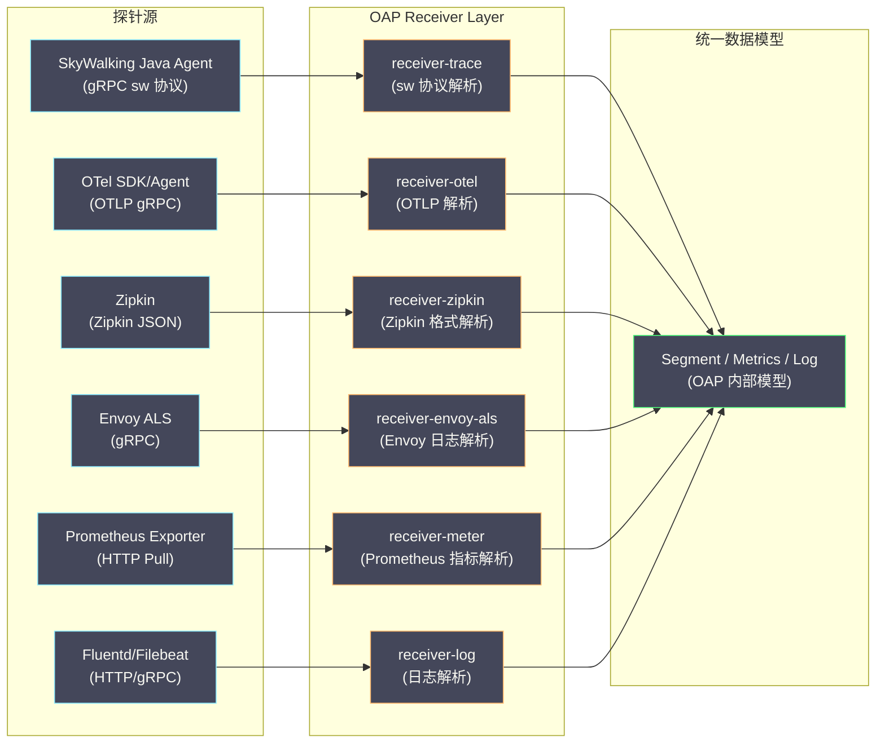
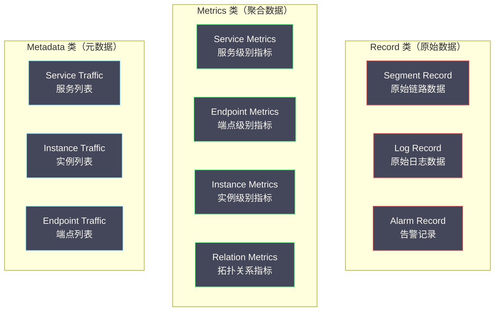

# 07 SkyWalking OAP 流处理与存储模型

**摘要：**

[[Apache SkyWalking]] 的 OAP（Observability Analysis Platform）是整个系统的"大脑"——它不是简单地将 Agent 上报的 Segment 数据原样存储，而是在数据接收的瞬间进行**实时流式分析**：提取服务拓扑关系、计算聚合指标（P99/QPS/错误率）、评估告警规则。这种"写入时计算"的架构设计，使得查询时不需要扫描海量原始 Span 数据，极大地降低了查询延迟和存储成本。本文深入剖析 OAP 的 Receiver 模块如何接收多种格式的数据、Analysis Core 如何通过 OAL（Observability Analysis Language）和 MAL（Meter Analysis Language）定义流式聚合逻辑、以及数据在 Elasticsearch 和 BanyanDB 中的具体存储结构。

---

## 第 1 章 OAP 的数据接收层

### 1.1 多协议 Receiver 架构

OAP 的 Receiver 层是一个**多协议适配器**——它接收来自不同探针、不同格式的数据，将其统一转换为 OAP 内部的数据模型后交给 Analysis Core 处理。



### 1.2 receiver-trace：SkyWalking 原生协议接收

这是最核心的 Receiver，负责接收 SkyWalking Agent 通过 gRPC 上报的 Segment 数据。

Agent 与 OAP 之间的通信基于 gRPC 的**双向流（Bidirectional Streaming）**——Agent 在一个长连接上持续发送 Segment 数据，OAP 在同一个连接上返回命令（如动态配置变更、Profile 任务下发）。

gRPC 流的好处：
- **减少连接开销**：不需要为每个 Segment 建立新的 HTTP 连接
- **背压（Back Pressure）**：gRPC 流内置流量控制，如果 OAP 处理不过来，gRPC 会自动降低 Agent 的发送速率
- **命令通道复用**：Agent 不需要额外的心跳连接来拉取配置和命令

**Segment 的 Protobuf 结构**（简化版）：

```protobuf
message SegmentObject {
    string traceId = 1;           // Trace ID
    string traceSegmentId = 2;    // Segment ID
    string service = 3;           // 服务名
    string serviceInstance = 4;   // 实例名
    repeated SpanObject spans = 5; // 本 Segment 包含的所有 Span
    bool isSizeLimited = 6;       // 是否因为 span_limit 被截断
}

message SpanObject {
    int32 spanId = 1;
    int32 parentSpanId = 2;
    int64 startTime = 3;          // 毫秒时间戳
    int64 endTime = 4;
    string operationName = 5;     // 端点名
    string peer = 6;              // 被调用方地址（ExitSpan）
    SpanType spanType = 7;        // Entry / Exit / Local
    SpanLayer spanLayer = 8;      // Http / Database / RPCFramework / MQ / Cache
    int32 componentId = 9;        // 组件 ID（如 Tomcat=1, SpringMVC=14）
    bool isError = 10;            // 是否错误
    repeated KeyStringValuePair tags = 11;   // 标签
    repeated Log logs = 12;                  // 日志/异常
    repeated SegmentReference refs = 13;     // 跨 Segment 引用（来自上游的 sw8）
}
```

### 1.3 receiver-otel：OTLP 协议接收

OAP 从 9.x 版本开始支持直接接收 [[OpenTelemetry]] 的 OTLP 格式数据，这使得使用 OTel SDK/Agent 的服务可以直接将数据发送到 SkyWalking OAP，不需要中间的 OTel Collector。

OTLP 到 SkyWalking 内部模型的转换逻辑：

| OTLP 字段 | SkyWalking 字段 | 转换规则 |
| :--- | :--- | :--- |
| `resource.service.name` | `service` | 直接映射 |
| `resource.service.instance.id` | `serviceInstance` | 直接映射 |
| `span.name` | `operationName` | 直接映射 |
| `span.kind = SERVER` | `spanType = Entry` | Kind 到 SpanType 的映射 |
| `span.kind = CLIENT` | `spanType = Exit` | Kind 到 SpanType 的映射 |
| `span.attributes["net.peer.name"]` | `peer` | 提取被调用方地址 |
| `span.attributes["http.method"]` | tags 中的 `http.method` | 属性透传 |

> [!note] OTLP 接收的局限性
> OTLP Receiver 的功能目前不如原生 sw 协议 Receiver 完整——一些 SkyWalking 特有的功能（如 Segment 级别的批量上报优化、sw8 Header 中携带的父服务名信息）在 OTLP 格式中没有对应。使用 OTLP 接入时，拓扑图的发现可能不如原生 Agent 精确（需要 OAP 做更多的反向关联推断）。

---

## 第 2 章 Analysis Core：流式分析引擎

### 2.1 "写入时计算"vs"查询时计算"

理解 OAP Analysis Core 的关键是理解两种数据处理范式的差异：

**查询时计算（Query-time Computation）**：原始数据原样存储，查询时扫描相关数据并实时聚合。例如：查询"Order Service 过去 1 小时的 P99 延迟"时，扫描过去 1 小时所有 Order Service 的 Span，提取延迟值，计算 P99。

- 优点：存储简单，灵活性高（可以按任意维度聚合）
- 缺点：查询慢（需要扫描大量原始数据），存储成本高（必须保留所有原始数据）

**写入时计算（Write-time Computation）**：数据到达时立即进行预聚合，将聚合结果存储为独立的指标。查询时直接读取预聚合结果。

- 优点：查询极快（只读取预聚合结果），存储成本低（聚合结果远小于原始数据）
- 缺点：灵活性低（只能查询预定义的聚合维度），写入逻辑更复杂

SkyWalking OAP 采用的是**写入时计算**——Segment 到达的瞬间就被分解为多个维度的聚合指标，查询时不需要再碰原始 Span 数据。这是 SkyWalking 的指标查询能做到毫秒级响应的根本原因。

### 2.2 Source Dispatch：数据分流

当一个 Segment 到达 Analysis Core 后，第一步是**Source Dispatch（数据分流）**——从 Segment 中提取不同维度的信息，生成多个 **Source 对象**，每个 Source 对象代表一种分析视角：

```
一个 Segment 到达后被分解为：

1. Service Source
   - 服务名: order-service
   - 延迟: 150ms
   - 是否错误: false
   → 用于计算服务级别的 P99、QPS、错误率

2. ServiceInstance Source
   - 服务名: order-service
   - 实例名: order-service-pod-abc123
   - 延迟: 150ms
   - CPU 使用率、JVM 内存（如果 Agent 上报了 JVM 指标）
   → 用于计算实例级别的指标

3. Endpoint Source
   - 服务名: order-service
   - 端点名: POST /api/orders
   - 延迟: 150ms
   - 是否错误: false
   → 用于计算端点级别的 P99、QPS

4. ServiceRelation Source（从 ExitSpan 提取）
   - 调用方: order-service
   - 被调用方: payment-service（从 peer 字段解析）
   - 延迟: 80ms
   → 用于构建服务拓扑图和边上的指标

5. EndpointRelation Source（从 ExitSpan 提取）
   - 调用方端点: POST /api/orders
   - 被调用方端点: POST /api/pay
   → 用于端点级别的依赖关系
```

### 2.3 OAL（Observability Analysis Language）：聚合规则定义

OAL 是 SkyWalking 自定义的 DSL（Domain Specific Language），用于声明式地定义"从哪个 Source 提取什么数据，用什么聚合函数，生成什么指标"。

**OAL 的语法结构**：

```
指标名 = from(Source.字段).聚合函数(参数);
```

**SkyWalking 内置的核心 OAL 规则**（摘选）：

```
// ===== 服务级别指标 =====

// 平均响应时间
service_resp_time = from(Service.latency).longAvg();

// P50/P75/P90/P95/P99 响应时间
service_percentile = from(Service.latency).percentile2(10);
// percentile2(10) 表示：精度为 10ms 的桶分布，计算 P50/P75/P90/P95/P99

// 每分钟调用次数（Calls Per Minute）
service_cpm = from(Service.*).cpm();

// SLA（成功率）
service_sla = from(Service.*).percent(status == true);
// status == true 表示请求成功

// Apdex 评分
service_apdex = from(Service.latency).apdex(name, status);

// ===== 端点级别指标 =====

endpoint_resp_time = from(Endpoint.latency).longAvg();
endpoint_percentile = from(Endpoint.latency).percentile2(10);
endpoint_cpm = from(Endpoint.*).cpm();
endpoint_sla = from(Endpoint.*).percent(status == true);

// ===== 服务关系指标（拓扑图上的边）=====

// 调用方到被调用方的平均响应时间
service_relation_server_resp_time = from(ServiceRelation.latency).longAvg();
// 调用次数
service_relation_server_cpm = from(ServiceRelation.*).cpm();
```

### 2.4 聚合窗口与时间桶

OAP 的指标聚合基于**固定时间窗口**（默认 1 分钟）。每分钟的聚合结果作为一个**时间桶（Time Bucket）**存储。

```
时间轴：

10:00 ─────── 10:01 ─────── 10:02 ─────── 10:03
  │             │             │             │
  └─ 窗口 1 ──┘             └─ 窗口 3 ──┘
         └─ 窗口 2 ──┘
         
窗口 1（10:00~10:01）：
  接收到 500 个 Service Source（order-service）
  计算结果：
    service_resp_time = avg(所有 latency) = 120ms
    service_p99 = percentile(所有 latency, 0.99) = 850ms
    service_cpm = 500
    service_sla = 498/500 = 99.6%
  存储为：
    key: order-service + 202401011000（时间桶）
    values: {resp_time: 120, p99: 850, cpm: 500, sla: 9960}
```

**多精度时间桶**：SkyWalking 支持多种时间精度的聚合（分钟/小时/天），用于不同时间范围的查询：

| 精度 | 时间桶格式 | 用途 |
| :--- | :--- | :--- |
| **分钟** | `202401011000` | 最近几小时的实时监控 |
| **小时** | `2024010110` | 最近几天的趋势分析 |
| **天** | `20240101` | 最近几个月的历史回顾 |

分钟级数据量最大（每天 1,440 个桶），保留时间最短（默认 2 天）；天级数据量最小，保留时间最长（默认 90 天）。OAP 内部有一个**降采样（Downsampling）**机制，自动将分钟级数据聚合为小时级和天级数据。

### 2.5 MAL（Meter Analysis Language）：外部指标处理

OAL 处理的是从链路追踪 Segment 中提取的指标。对于外部来源的指标（如 [[Prometheus]] Exporter 暴露的 JVM 指标、Kubernetes 指标），SkyWalking 使用另一种 DSL——**MAL（Meter Analysis Language）**。

MAL 的作用是将 Prometheus 格式的指标转换为 SkyWalking 的指标体系，并支持二次计算：

```yaml
# MAL 配置示例：处理 JVM 指标
expSuffix: tag({tags -> tags.service = service})
metricPrefix: meter_jvm

# 从 Prometheus 指标 jvm_memory_used_bytes 计算 JVM 内存使用率
metricsRules:
  - name: memory_used
    exp: jvm_memory_used_bytes
  - name: memory_max
    exp: jvm_memory_max_bytes
  - name: memory_usage_percent
    exp: jvm_memory_used_bytes / jvm_memory_max_bytes * 100
```

---

## 第 3 章 数据存储模型

### 3.1 三类数据的存储策略

OAP 存储的数据根据访问模式分为三类，每类使用不同的存储策略：



**Record 类（原始数据）**：
- 写入模式：追加写入，每条记录独立
- 查询模式：按 Trace ID 点查（Segment），按时间范围 + 过滤条件扫描（Log、Alarm）
- 数据量：最大（TB/天），保留时间短（默认 3 天）
- 存储优化重点：写入吞吐量、压缩比

**Metrics 类（聚合数据）**：
- 写入模式：按"实体 + 时间桶"为 key 的 upsert（如果同一分钟内有新数据，更新聚合结果）
- 查询模式：按实体 + 时间范围的范围查询
- 数据量：中等（GB/天），保留时间中等（默认分钟级 2 天、小时级 3 天、天级 90 天）
- 存储优化重点：范围查询效率、upsert 性能

**Metadata 类（元数据）**：
- 写入模式：低频更新（服务注册、实例上下线）
- 查询模式：全量扫描（列出所有服务/实例/端点）
- 数据量：小（MB 级）
- 存储优化重点：读取速度

### 3.2 Elasticsearch 中的存储结构

以 [[Elasticsearch]] 为存储后端时，OAP 为每种数据类型创建独立的 ES 索引：

**Segment 索引**：

```json
// 索引名：sw_segment-20240101
// 文档结构：
{
    "trace_id": "abc123...",
    "segment_id": "seg456...",
    "service_id": "order-service",
    "service_instance_id": "order-service-pod-abc",
    "endpoint_name": "POST /api/orders",
    "start_time": 1704067200000,
    "end_time": 1704067200150,
    "latency": 150,
    "is_error": 0,
    "data_binary": "<base64 encoded Protobuf>",  // 完整的 Segment Protobuf 序列化数据
    "time_bucket": 202401011000
}
```

注意 `data_binary` 字段：OAP 不将 Span 的每个字段都展开为 ES 文档的字段（那样会导致 mapping 极其复杂），而是将完整的 Segment Protobuf 序列化后以 binary 字段存储。ES 索引只对查询需要的字段建索引（`trace_id`、`service_id`、`start_time`、`latency`、`is_error`），完整数据在点查时从 `data_binary` 反序列化。

这种设计的权衡：
- 优点：ES mapping 简单，索引字段少，写入快
- 缺点：无法在 ES 层面对 Span 内部字段做查询（如搜索"包含特定 SQL 的 Span"），需要先按 Trace ID 查到 Segment，再在应用层解析

**Metrics 索引**：

```json
// 索引名：sw_service_resp_time-20240101
// 文档结构：
{
    "metric_table": "service_resp_time",
    "entity_id": "order-service",          // 服务名的 hash
    "time_bucket": 202401011000,            // 分钟级时间桶
    "value": 120,                           // 聚合结果：平均响应时间 120ms
    "total": 500,                           // 参与聚合的样本总数
    "count": 500                            // 有效样本数
}
```

Metrics 索引的 key 是 `entity_id + time_bucket`，查询时通过这两个字段的范围查询获取一段时间内的指标值。

### 3.3 Elasticsearch 索引生命周期管理

SkyWalking 使用**按天分索引 + TTL 自动删除**的策略管理 ES 索引：

```
索引清理规则（OAP application.yml 中配置）：

storage:
  elasticsearch:
    # Record 类数据保留天数
    recordDataTTL: 3          # Segment、Log 保留 3 天
    # Metrics 类数据保留天数（分钟级）
    metricsDataTTL: 7         # 分钟级指标保留 7 天
    # 其他精度的保留天数由 OAP 内部计算
```

OAP 内部有一个定时任务（默认每天凌晨 4 点执行），自动删除过期的索引。由于索引按天命名（如 `sw_segment-20240101`），删除操作是整个索引的删除（而不是文档级别的删除），效率极高。

**ES 索引优化建议**：

| 配置项 | 推荐值 | 说明 |
| :--- | :--- | :--- |
| **副本数** | 1（生产）/ 0（开发）| Segment 索引通常不需要高可用（丢失几小时的历史链路可接受）|
| **分片数** | 2-5 | 根据数据量调整，每个分片建议 10-50 GB |
| **刷新间隔** | 10s | 默认 1s 对 SkyWalking 不必要，增大可减少 I/O |
| **合并策略** | `tiered` | 适合追加写入模式 |
| **索引模板** | 使用 OAP 自动创建的模板 | OAP 启动时自动创建索引模板 |

### 3.4 BanyanDB 的存储结构

[[BanyanDB]] 作为 SkyWalking 社区自研的存储引擎，针对上述三种数据类型做了专门优化。

**Stream 存储（对应 Record 类）**：

BanyanDB 使用 **Stream** 数据模型存储 Segment 和 Log 等原始数据。Stream 的底层是 LSM-Tree（Log-Structured Merge Tree）结构，优化了追加写入的吞吐量。

与 ES 不同，BanyanDB 的 Stream 支持对数据中的特定字段建立**倒排索引**，同时原始数据按列式存储（而非 ES 的行式文档存储）。列式存储的优势在于：

- **压缩比更高**：同一列的数据类型相同，压缩效果远好于行式存储
- **选择性读取**：查询时只需读取需要的列，不需要加载完整文档

**Measure 存储（对应 Metrics 类）**：

BanyanDB 使用 **Measure** 数据模型存储聚合指标。Measure 的底层是针对时间序列数据优化的存储结构：

- **Time Shard（时间分片）**：数据按时间范围分片，范围查询只扫描必要的分片
- **Entity Index（实体索引）**：按实体 ID（服务名 hash）建索引，点查高效
- **压缩编码**：时间戳使用 delta-of-delta 编码，数值使用 XOR 编码（参考 [[Prometheus]] TSDB 的压缩方案）

---

## 第 4 章 拓扑图与告警引擎

### 4.1 服务拓扑的构建过程

服务拓扑图是 SkyWalking 最直观的功能之一——自动展示所有服务及其调用关系。拓扑图的数据来源于 `ServiceRelation Source`，构建过程如下：

```
1. Agent 上报 Segment，其中包含 ExitSpan
   ExitSpan: {
     operationName: "POST /api/pay",
     peer: "payment-service:8080",   // 被调用方地址
     componentId: 12                  // HTTP Client
   }

2. OAP 从 ExitSpan 中提取调用关系：
   调用方：order-service（当前 Segment 的服务名）
   被调用方：payment-service（从 peer 解析，或从下游 Segment 的服务注册信息关联）

3. 生成 ServiceRelation Source：
   {
     source: "order-service",
     dest: "payment-service",
     componentId: 12,
     latency: 80ms,
     isError: false
   }

4. ServiceRelation Source 进入 OAL 引擎：
   service_relation_server_resp_time = from(ServiceRelation.latency).longAvg();
   service_relation_server_cpm = from(ServiceRelation.*).cpm();

5. 聚合结果存入 Metrics 索引

6. UI 查询拓扑图时，OAP 从 Metrics 索引中读取所有 ServiceRelation 记录，
   构建节点和边，返回给 UI 渲染
```

**外部依赖的拓扑展示**：

对于数据库、Redis、消息队列等外部依赖，Agent 无法获取对方的"服务名"，但会根据 ExitSpan 的 `spanLayer` 和 `componentId` 自动生成一个虚拟服务名：

| ExitSpan 类型 | 虚拟服务名格式 | 拓扑图中的显示 |
| :--- | :--- | :--- |
| MySQL 查询 | `mysql:3306` | 数据库图标 + `mysql:3306` |
| Redis 操作 | `redis:6379` | 缓存图标 + `redis:6379` |
| Kafka 生产 | `kafka-cluster` | 消息队列图标 + `kafka-cluster` |
| HTTP 外部调用 | `api.thirdparty.com:443` | 外部服务图标 |

### 4.2 告警引擎

SkyWalking 的告警引擎基于 **OAL 聚合后的指标数据** 触发告警。告警规则在 `alarm-settings.yml` 中定义：

```yaml
rules:
  # 规则 1：服务平均响应时间 > 1000ms 持续 3 分钟
  service_resp_time_rule:
    metrics-name: service_resp_time
    op: ">"
    threshold: 1000
    period: 10        # 检查周期（分钟）
    count: 3          # 在 period 内触发 count 次则告警
    silence-period: 10 # 告警后沉默 10 分钟（避免重复告警）
    message: "服务 {name} 的平均响应时间超过 1000ms"

  # 规则 2：服务成功率 < 80%
  service_sla_rule:
    metrics-name: service_sla
    op: "<"
    threshold: 8000   # SLA 值 × 100（80% = 8000）
    period: 10
    count: 2
    silence-period: 10
    message: "服务 {name} 的成功率低于 80%"

  # 规则 3：端点 P99 > 3000ms
  endpoint_p99_rule:
    metrics-name: endpoint_percentile
    op: ">"
    threshold: 3000
    period: 10
    count: 3
    silence-period: 10
    message: "端点 {name} 的 P99 延迟超过 3000ms"
```

告警触发后，可以通过 **Webhook** 发送到外部系统（如钉钉、Slack、PagerDuty）：

```yaml
webhooks:
  - url: http://alert-gateway/skywalking/webhook
    # OAP 会向这个 URL POST 告警信息的 JSON
```

> [!info] 告警引擎的局限性
> SkyWalking 的告警引擎是基于预聚合指标的**阈值告警**——它能做到"P99 延迟超过阈值触发告警"，但不能做到"检测到异常的延迟波动模式触发告警"（即异常检测 / Anomaly Detection）。如果需要更高级的告警能力（如基于机器学习的异常检测），需要将 SkyWalking 的指标导出到 [[Prometheus]]，使用 [[Grafana]] Alerting 或专门的 AIOps 平台。

---

## 第 5 章 OAP 性能调优

### 5.1 OAP 的性能瓶颈分析

OAP 的性能瓶颈通常出现在以下环节：

| 环节 | 瓶颈表现 | 常见原因 |
| :--- | :--- | :--- |
| **gRPC 接收** | Agent 上报超时 | OAP 实例数不足，gRPC 线程池满 |
| **Analysis Core** | 聚合延迟增加 | CPU 不足（聚合计算是 CPU 密集型）|
| **ES 写入** | ES 写入队列积压 | ES 集群写入吞吐量不足 |
| **ES 查询** | UI 查询超时 | ES 分片过多 / 查询范围过大 |

### 5.2 关键调优参数

**OAP 端**：

```yaml
# application.yml

core:
  default:
    # OAP 内部线程池大小（用于 Analysis Core）
    # 建议 = CPU 核心数 × 2
    maxConcurrentCallsPerConnection: 0
    maxMessageSize: 10485760  # 10MB，防止超大 Segment 阻塞

receiver-trace:
  default:
    # gRPC 接收线程数
    gRPCThreadPoolSize: 8
    # gRPC 接收队列大小
    gRPCThreadPoolQueueSize: 10000

storage:
  elasticsearch:
    # ES 批量写入大小
    bulkActions: 5000         # 每批最多 5000 条
    flushInterval: 15         # 最长 15 秒刷一次
    concurrentRequests: 4     # ES 写入并发数
```

**ES 集群端**：

```yaml
# elasticsearch.yml

# 禁用副本（如果可以接受丢失数据的风险）
index.number_of_replicas: 0

# 增大 translog 刷盘间隔（提高写入性能）
index.translog.durability: async
index.translog.sync_interval: 30s

# 增大 refresh 间隔
index.refresh_interval: 30s

# 增大 indexing buffer
indices.memory.index_buffer_size: 30%
```

### 5.3 水平扩展策略

当单个 OAP 实例无法处理所有数据时，可以部署多个 OAP 实例组成集群。Agent 通过客户端负载均衡将数据分散到不同的 OAP 实例。

**扩展维度**：

- **OAP 实例数**：根据总 Segment QPS 增加实例。经验值：单个 OAP 实例（4C8G）大约能处理 5,000~10,000 Segment/秒
- **ES 节点数**：根据存储量和写入吞吐量增加节点。经验值：单个 ES 数据节点（8C32G, SSD）大约能处理 10,000~20,000 文档/秒的写入
- **Kafka 缓冲**：在 Agent 和 OAP 之间引入 Kafka，实现削峰填谷，OAP 按自身能力消费

---

## 参考资料

1. Apache SkyWalking OAP Configuration：https://skywalking.apache.org/docs/main/latest/en/setup/backend/configuration-vocabulary/
2. SkyWalking OAL Reference：https://skywalking.apache.org/docs/main/latest/en/concepts-and-designs/oal/
3. SkyWalking MAL Reference：https://skywalking.apache.org/docs/main/latest/en/concepts-and-designs/mal/
4. BanyanDB Architecture：https://skywalking.apache.org/docs/skywalking-banyandb/latest/
5. SkyWalking Alarm Configuration：https://skywalking.apache.org/docs/main/latest/en/setup/backend/backend-alarm/
6. Elasticsearch Performance Tuning for SkyWalking：https://skywalking.apache.org/docs/main/latest/en/setup/backend/backend-es-init/
