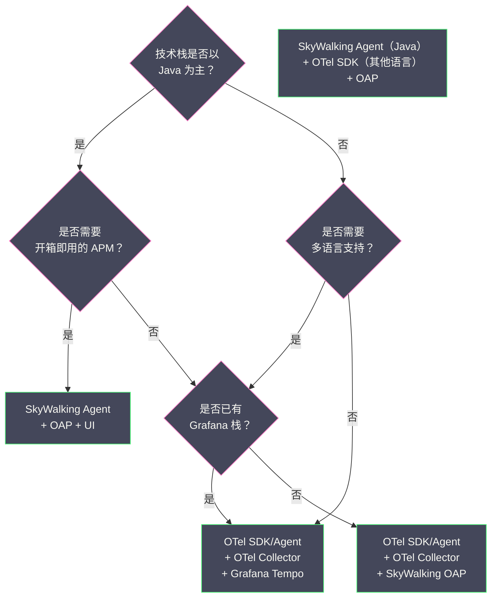

# 08 链路追踪工程实践落地经验

**摘要：**

前面七篇文章从理论到实现，完整地剖析了链路追踪的概念、标准、SkyWalking 的架构和内部机制。但"懂原理"和"用好"之间仍有巨大的鸿沟——在真实的生产环境中，链路追踪的落地会遇到大量工程问题：跨线程/跨协程的 Context 丢失、异步消息队列导致的链路断裂、操作名爆炸（Endpoint Name Explosion）导致 OAP 内存溢出、Agent 与框架的兼容性冲突等。本文作为链路追踪子专栏的收官之作，将这些实战中高频出现的问题逐一拆解，给出经过验证的解决方案和最佳实践。

---

## 第 1 章 链路断裂：最常见的落地问题

### 1.1 什么是链路断裂

**链路断裂（Trace Gap）** 是指一条完整的调用链路中，某些 Span 缺失，导致在 SkyWalking UI 中看到的 Trace 不完整——要么出现孤立的 Span（找不到父 Span），要么调用树中某个节点的子节点缺失。

链路断裂是链路追踪落地中最常见也最令人沮丧的问题。一个断裂的 Trace 不仅失去了排查价值（看不到完整的调用路径），还会干扰 OAP 的拓扑图构建（调用关系不完整）和指标计算（丢失的 Segment 不参与聚合）。

### 1.2 断裂原因一：跨线程 Context 丢失

这是 Java 生态中最高频的断裂原因。SkyWalking Agent 使用 [[ThreadLocal]] 存储 Trace Context，当业务代码将任务提交到线程池时，新线程的 ThreadLocal 中没有 Context，后续创建的 Span 无法关联到原始 Trace。

**常见的跨线程场景**：

| 场景 | 典型代码 | Agent 是否自动处理 |
| :--- | :--- | :--- |
| `ExecutorService.submit()` | `executor.submit(runnable)` | 需要 `apm-jdk-threading-plugin`（optional）|
| `CompletableFuture` | `CompletableFuture.supplyAsync(...)` | 需要 `apm-jdk-threading-plugin`（optional）|
| Spring `@Async` | `@Async public void asyncMethod()` | 需要 `apm-spring-async-plugin` |
| Reactor/WebFlux | `Mono.fromCallable(...).subscribeOn(Schedulers.boundedElastic())` | 需要 `apm-spring-webflux-plugin` |
| Netty EventLoop | Netty 的异步回调 | 部分支持（依赖具体插件）|
| 自定义线程 | `new Thread(runnable).start()` | 不支持（需手动传递）|

**解决方案**：

**方案一：启用 optional-plugins 中的线程增强插件**

SkyWalking Agent 的 `optional-plugins/` 目录中包含了 `apm-jdk-threading-plugin.jar`，启用后它会自动增强 `Runnable`、`Callable`、`Supplier` 等接口的实现类，在任务提交时捕获 Context，在任务执行时恢复。

```bash
# 启用方式：将插件从 optional-plugins 移动到 plugins 目录
cp optional-plugins/apm-jdk-threading-plugin-*.jar plugins/
```

> [!warning] 启用 jdk-threading-plugin 的风险
> 这个插件会增强所有实现了 `Runnable`/`Callable` 接口的类——包括 JDK 内部类、第三方库内部类、框架内部类。在某些场景下可能导致：
> - **类加载冲突**：增强 Bootstrap ClassLoader 加载的类时出错
> - **性能影响**：大量短生命周期的 Runnable（如 Netty 的事件处理）被增强，增加 GC 压力
> - **误增强**：与业务无关的线程任务也被增强，产生无意义的 Span
> 
> 建议在测试环境充分验证后再上线。如果只有特定场景需要跨线程传播，优先使用 `@TraceCrossThread` 注解精确控制。

**方案二：使用 @TraceCrossThread 注解**

对于无法或不愿启用全局线程插件的场景，SkyWalking 提供了 `@TraceCrossThread` 注解，只增强被标注的类：

```java
import org.apache.skywalking.apm.toolkit.trace.TraceCrossThread;

@TraceCrossThread
public class OrderProcessTask implements Runnable {
    @Override
    public void run() {
        // Agent 自动在 run() 入口恢复 Context
        // 这里创建的 Span 会正确关联到提交任务的父 Trace
        orderService.processOrder(orderId);
    }
}

// 使用方式不变
executor.submit(new OrderProcessTask(orderId));
```

**方案三：手动 Context 传递（终极兜底）**

对于上述方案都无法覆盖的场景（如自定义的协程框架、非标准的异步回调），可以使用 SkyWalking Toolkit API 手动传递：

```java
import org.apache.skywalking.apm.toolkit.trace.TraceContext;

// 在主线程中捕获 Context 快照
final String traceId = TraceContext.traceId();
// 实际使用 ContextManager.capture() 获取完整快照（需要 Agent 内部 API）

// 在新线程中恢复
executor.submit(() -> {
    // 使用 Toolkit API 创建关联的 Span
    ActiveSpan.tag("traceId", traceId);  // 至少记录关联信息
    // 完整的 Context 恢复需要使用内部 API
});
```

### 1.3 断裂原因二：消息队列的异步调用

当服务 A 通过 [[Apache Kafka]]、[[RabbitMQ]]、[[RocketMQ]] 发送消息到服务 B 时，消息可能在队列中停留几秒到几分钟。如果 Agent 没有正确处理消息队列的 Context 传播，服务 B 消费消息时创建的 Span 无法关联到服务 A 的 Trace。

**SkyWalking 对消息队列的支持**：

| 消息队列 | 插件 | Context 传播方式 | 注意事项 |
| :--- | :--- | :--- | :--- |
| **Kafka** | `apm-kafka-plugin` | 将 sw8 注入 Kafka Record Header | Producer 和 Consumer 都需要 Agent |
| **RabbitMQ** | `apm-rabbitmq-plugin` | 将 sw8 注入 AMQP Message Header | 同上 |
| **RocketMQ** | `apm-rocketmq-plugin` | 将 sw8 注入 Message UserProperty | 同上 |
| **Pulsar** | `apm-pulsar-plugin` | 将 sw8 注入 Message Property | 同上 |

**消息队列链路的特殊性**：

消息队列的链路与同步 RPC 链路有一个本质差异：**生产者和消费者之间存在时间解耦**。生产者发送消息后就结束了（ExitSpan 完成），消费者可能在几秒甚至几分钟后才开始处理。

在 Trace 的瀑布图中，消息队列的调用关系看起来是这样的：

```
Producer 的 Trace：
  [EntrySpan: POST /api/orders] ─── 150ms ───
    [ExitSpan: Kafka/Producer/order-topic] ── 5ms ──
    
Consumer 的 Trace（可能是同一个 Trace ID，也可能是新的 Trace）：
  [EntrySpan: Kafka/Consumer/order-topic] ─── 200ms ───
    [ExitSpan: MySQL/INSERT] ── 50ms ──
```

SkyWalking 的 Kafka 插件会在 Consumer 的 EntrySpan 中携带 Producer 的 Trace ID 作为 `ref`（SegmentReference），使两者关联为同一个 Trace。但如果消息经过了**多次转发**（如 Kafka → 中间处理服务 → 再写入另一个 Kafka Topic），链路可能会变得非常长且复杂，查看时需要注意时间跨度。

### 1.4 断裂原因三：网关/Proxy 未传播 Header

如果调用链中存在**不传播 sw8 Header 的中间层**（如 Nginx 反向代理、API Gateway、Service Mesh Sidecar），下游服务收不到 sw8 Header，链路在这里断裂。

**常见的中间层处理**：

| 中间层 | 默认行为 | 解决方案 |
| :--- | :--- | :--- |
| **Nginx** | 不转发自定义 Header（取决于配置）| 在 `proxy_pass` 中添加 `proxy_set_header sw8 $http_sw8;` |
| **Kong** | 默认转发所有 Header | 通常无需配置 |
| **Spring Cloud Gateway** | 需要 SkyWalking 插件 | 启用 `apm-spring-cloud-gateway-plugin`（optional）|
| **Envoy (Istio)** | 需要配置 Header 透传 | 配置 Envoy 的 `custom_tags` 或使用 SkyWalking 的 Envoy ALS 接入 |
| **gRPC Gateway** | 需要手动转发 Metadata | 在 gRPC Interceptor 中转发 sw8 Metadata |

---

## 第 2 章 操作名爆炸：OAP 的隐形杀手

### 2.1 什么是操作名爆炸

**操作名爆炸（Endpoint Name Explosion）** 是指 SkyWalking 中注册的端点（Endpoint）数量失控增长，导致 OAP 内存耗尽或 ES 索引膨胀。

正常情况下，一个服务的端点数量是有限的——每个 REST API 路径对应一个端点，如 `GET /api/orders`、`POST /api/users`。但如果端点名中包含了**动态参数**（如订单 ID、用户 ID），每个请求都会产生一个唯一的端点名：

```
正常的端点名：
  GET /api/orders         → 1 个端点
  GET /api/orders/{id}    → 1 个端点（Agent 应该参数化）
  POST /api/users         → 1 个端点

操作名爆炸：
  GET /api/orders/12345   → 1 个端点
  GET /api/orders/12346   → 1 个端点
  GET /api/orders/12347   → 1 个端点
  ...
  GET /api/orders/99999   → 87,655 个端点！
```

每个端点在 OAP 中都会创建独立的指标时间序列（P99、QPS、错误率等），端点数量 × 指标类型 × 时间桶 = 海量的指标数据，OAP 的内存和 ES 的索引容量迅速耗尽。

### 2.2 常见的爆炸原因

**原因一：RESTful URL 中的路径参数未参数化**

SkyWalking 的 Spring MVC 插件通常能正确将 `@PathVariable` 参数化（将 `/api/orders/12345` 转为 `/api/orders/{id}`），但以下情况可能失败：
- 使用了原生 Servlet 而不是 Spring MVC
- URL 路径中包含了非标准的动态部分（如 `/api/v1/tenant-abc/orders`，其中 `tenant-abc` 是动态的租户 ID）
- 使用了自定义的路由框架

**原因二：数据库 SQL 未参数化**

如果 JDBC 插件没有正确处理 SQL 参数化，每个不同的 SQL 语句都会成为一个独立的端点：

```
SELECT * FROM orders WHERE id = 12345   → 端点 1
SELECT * FROM orders WHERE id = 12346   → 端点 2
```

正确的参数化应该是：`SELECT * FROM orders WHERE id = ?`

**原因三：GraphQL / gRPC 的操作名不规范**

GraphQL 的 query name 和 gRPC 的 method name 如果包含动态部分，也会导致爆炸。

### 2.3 解决方案

**方案一：Agent 端操作名分组**

SkyWalking Agent 支持通过配置对端点名进行正则分组：

```properties
# agent.config
# 将 /api/orders/12345 统一为 /api/orders/{id}
plugin.springmvc.collect_http_params=false
agent.operation_name_threshold=500

# 或使用 apm-trace-ignore-plugin 过滤无关端点
trace.ignore_path=/health,/actuator/**
```

**方案二：OAP 端端点名分组（Endpoint Grouping）**

OAP 支持在服务端对端点名进行正则分组，在 `endpoint-name-grouping.yml` 中配置：

```yaml
grouping:
  # 将 /api/orders/{任意字符} 统一为 /api/orders/{id}
  - service-name: order-service
    rules:
      - /api/orders/.+  →  /api/orders/{id}
      - /api/users/.+/profile  →  /api/users/{id}/profile
```

**方案三：设置端点数量上限**

OAP 有一个 `maxEndpointNum` 配置（默认 500），超过这个数量的新端点会被忽略。如果看到日志中出现 `Endpoint name overflow` 警告，说明端点数量已经接近上限，需要排查爆炸原因。

---

## 第 3 章 Agent 与框架的兼容性问题

### 3.1 类加载冲突

SkyWalking Agent 通过字节码增强修改目标类，但某些框架也使用了类似的技术（如 Spring AOP 的 CGLIB 代理、Hibernate 的字节码增强），两者可能产生冲突。

**常见冲突场景**：

| 框架 | 冲突表现 | 解决方案 |
| :--- | :--- | :--- |
| **Spring AOP (CGLIB)** | 增强后的类被 CGLIB 再次代理，方法拦截失效 | SkyWalking 插件已适配，通常无问题 |
| **Lombok** | `@SneakyThrows` 生成的异常处理代码与 Agent 的异常拦截冲突 | 升级 Agent 到最新版本 |
| **MapStruct** | 编译时代码生成与运行时增强不兼容 | 排除 MapStruct 生成类的增强 |
| **GraalVM Native Image** | Native Image 不支持运行时字节码修改 | 无法使用 Java Agent，需改用 OTel SDK 手动埋点 |
| **Quarkus (Native)** | 同 GraalVM | 同上 |

### 3.2 版本兼容性矩阵

SkyWalking Agent 的版本需要与应用使用的框架版本匹配。以下是一些常见的兼容性要求：

| Agent 版本 | Java 版本 | Spring Boot | Dubbo | gRPC |
| :--- | :--- | :--- | :--- | :--- |
| **9.x** | 8, 11, 17, 21 | 2.x, 3.x | 2.7+, 3.x | 1.x |
| **8.x** | 8, 11, 17 | 2.x | 2.7+ | 1.x |

> [!warning] Java 17+ 的模块化限制
> Java 17 默认启用了强封装（Strong Encapsulation），禁止反射访问 JDK 内部 API。SkyWalking Agent 的某些增强需要访问 `java.lang` 或 `sun.misc` 包，需要在 JVM 启动参数中添加：
> ```
> --add-opens java.base/java.lang=ALL-UNNAMED
> --add-opens java.base/java.lang.reflect=ALL-UNNAMED
> ```

### 3.3 排查 Agent 问题的工具

当 Agent 出现异常（如类加载错误、NPE、Span 丢失）时，以下排查手段按优先级排列：

**手段一：Agent 日志**

Agent 的日志文件位于 `logs/skywalking-api.log`，默认日志级别为 `INFO`。排查问题时可以临时调整为 `DEBUG`：

```properties
# agent.config
logging.level=DEBUG
logging.output=FILE
logging.dir=/path/to/logs
logging.max_file_size=300000000  # 300MB
```

**手段二：Agent 自身的健康指标**

SkyWalking Agent 通过 JMX 暴露自身的健康指标（如已创建的 Span 数量、已丢弃的 Segment 数量、gRPC 连接状态）。可以通过 JMX 客户端（如 JConsole）或 Prometheus JMX Exporter 采集。

**手段三：独立测试**

在怀疑 Agent 与特定框架冲突时，创建一个最小化的测试项目（只包含该框架 + SkyWalking Agent），排除其他变量的干扰。

---

## 第 4 章 链路追踪与指标/日志的联动

### 4.1 Trace ID 注入日志

链路追踪的最大工程价值之一是**将 Trace ID 注入到应用日志中**，使得工程师可以从链路追踪系统跳转到日志系统，查看特定请求的详细日志。

SkyWalking 提供了 Toolkit 库，可以将 Trace ID 注入到主流日志框架：

**Log4j2 集成**：

```xml
<!-- pom.xml -->
<dependency>
    <groupId>org.apache.skywalking</groupId>
    <artifactId>apm-toolkit-log4j-2.x</artifactId>
    <version>${skywalking.version}</version>
</dependency>
```

```xml
<!-- log4j2.xml 的 Pattern 配置 -->
<PatternLayout pattern="%d [%traceId] [%thread] %-5level %logger{36} - %msg%n"/>
```

`%traceId` 是 SkyWalking Toolkit 提供的自定义 Pattern，它从当前线程的 Trace Context 中提取 Trace ID。如果当前线程没有 Trace Context（如应用启动阶段的日志），输出 `TID: N/A`。

**Logback 集成**：

```xml
<dependency>
    <groupId>org.apache.skywalking</groupId>
    <artifactId>apm-toolkit-logback-1.x</artifactId>
    <version>${skywalking.version}</version>
</dependency>
```

```xml
<!-- logback.xml -->
<appender name="STDOUT" class="ch.qos.logback.core.ConsoleAppender">
    <encoder class="ch.qos.logback.core.encoder.LayoutWrappingEncoder">
        <layout class="org.apache.skywalking.apm.toolkit.log.logback.v1.x.TraceIdPatternLogbackLayout">
            <pattern>%d [%tid] [%thread] %-5level %logger{36} - %msg%n</pattern>
        </layout>
    </encoder>
</appender>
```

日志输出效果：

```
2024-01-01 10:00:00.150 [abc123def456...] [http-nio-8080-exec-1] INFO  OrderController - 创建订单: orderId=789
2024-01-01 10:00:00.180 [abc123def456...] [http-nio-8080-exec-1] INFO  OrderService - 扣减库存成功
2024-01-01 10:00:00.250 [abc123def456...] [http-nio-8080-exec-1] ERROR PaymentService - 支付失败: timeout
```

工程师在日志中看到错误后，复制 Trace ID `abc123def456...`，在 SkyWalking UI 中搜索这个 Trace ID，就能看到完整的调用链路和每个环节的耗时。

### 4.2 从 Grafana 跳转到 SkyWalking

如果团队使用 [[Grafana]] 作为统一的可视化平台，可以在 Grafana 仪表盘中配置**数据链接（Data Links）**，实现从指标图表直接跳转到 SkyWalking UI：

```
Grafana Panel 的 Data Link 配置：
  Title: 查看 SkyWalking Trace
  URL: http://skywalking-ui:8080/trace?service=${__field.labels.service_name}&duration=30m
```

当工程师在 Grafana 中发现某个服务的 P99 延迟异常时，点击数据链接，直接跳转到 SkyWalking UI 查看该服务在对应时间段的慢请求 Trace。

### 4.3 SkyWalking 内置的日志关联

SkyWalking 9.x 支持**直接接收日志数据**（通过 receiver-log 模块），并在 UI 中展示与 Trace 关联的日志：

```
日志采集方式：
1. Agent Toolkit 直接上报（日志框架通过 Appender 直接发送到 OAP）
2. Fluentd / Filebeat 采集日志文件，发送到 OAP 的 HTTP/gRPC 端点
3. OTel Collector 采集日志，通过 OTLP 发送到 OAP
```

在 SkyWalking UI 中，查看某条 Trace 时，可以在 "Log" 标签页看到该 Trace 对应时间段内、该服务产生的所有日志——前提是日志中包含了正确的 Trace ID。

---

## 第 5 章 生产环境部署清单

### 5.1 Agent 端 Checklist

| 检查项 | 说明 | 优先级 |
| :--- | :--- | :--- |
| `agent.service_name` 配置正确 | 使用有意义的服务名（如 `order-service`，不要用默认值）| P0 |
| `collector.backend_service` 指向正确的 OAP | 多 OAP 实例时用逗号分隔 | P0 |
| 采样策略配置合理 | 入口服务配置采样率，内部服务跟随上游 | P0 |
| `trace.ignore_path` 过滤无关路径 | 排除 `/health`、`/actuator`、静态资源 | P1 |
| 日志中注入 Trace ID | 配置 Log4j2/Logback 的 TraceId Pattern | P1 |
| 跨线程插件是否需要启用 | 评估业务代码中的异步场景 | P1 |
| `span_limit_per_segment` 设置合理 | 防止循环调用产生海量 Span，默认 300 | P2 |
| Agent 版本与框架版本兼容 | 特别注意 Java 17+ 的模块化限制 | P2 |

### 5.2 OAP 端 Checklist

| 检查项 | 说明 | 优先级 |
| :--- | :--- | :--- |
| OAP 集群部署（至少 2 实例）| 避免单点故障 | P0 |
| ES 集群资源充足 | 内存、磁盘、写入吞吐量 | P0 |
| TTL 配置合理 | Segment 3-7 天，Metrics 7-30 天 | P0 |
| 告警规则配置 | 至少配置 P99 延迟和错误率的告警 | P1 |
| 端点分组规则 | 防止操作名爆炸 | P1 |
| Kafka 缓冲（大规模场景）| 削峰填谷，保护 OAP | P2 |
| 动态配置源接入 | 支持运行时调整采样率 | P2 |

### 5.3 故障排查 SOP（Standard Operating Procedure）

当线上出现性能问题时，利用链路追踪的标准排查流程：

```
Step 1: 发现异常（指标告警）
  → Grafana / SkyWalking 仪表盘显示 P99 延迟飙升
  → 确认受影响的服务和时间范围

Step 2: 定位服务（拓扑图）
  → 打开 SkyWalking 拓扑图，查看哪条调用边的延迟异常
  → 缩小到具体的上下游服务对

Step 3: 定位请求（Trace 查询）
  → 按服务名 + 时间范围 + 最小延迟条件搜索 Trace
  → 选择一个典型的慢 Trace，查看瀑布图
  → 找到耗时最长的 Span

Step 4: 查看上下文（日志关联）
  → 复制慢 Span 对应的 Trace ID
  → 在日志系统中搜索该 Trace ID
  → 查看详细的错误信息、SQL 语句、请求参数

Step 5: 定位代码（Profile 剖析）
  → 如果慢 Span 是服务内部处理（而非等待下游）
  → 在 SkyWalking UI 中对该端点创建 Profile 任务
  → 查看火焰图，定位到具体的函数级别

Step 6: 修复与验证
  → 根据定位结果修复代码/配置
  → 部署后观察指标是否恢复正常
  → 再次搜索 Trace 确认延迟恢复
```

---

## 第 6 章 选型决策树

### 6.1 我应该用 SkyWalking 还是 OTel + Tempo？

这是最常见的选型问题。以下决策树帮助你做出选择：



**总结**：
- **Java 为主 + 追求开箱即用**：SkyWalking 全家桶（Agent + OAP + UI）
- **多语言 + 已有 Grafana**：OTel + Grafana Tempo
- **Java 为主 + 多语言混合**：SkyWalking Agent（Java）+ OTel SDK（其他语言）+ SkyWalking OAP
- **标准化优先**：OTel SDK + Collector + 任意后端

---

## 参考资料

1. Apache SkyWalking Agent Plugin Development Guide：https://skywalking.apache.org/docs/skywalking-java/latest/en/setup/service-agent/java-agent/java-plugin-development-guide/
2. SkyWalking Toolkit Trace API：https://skywalking.apache.org/docs/skywalking-java/latest/en/setup/service-agent/java-agent/application-toolkit-trace/
3. SkyWalking Log Integration：https://skywalking.apache.org/docs/skywalking-java/latest/en/setup/service-agent/java-agent/application-toolkit-log/
4. SkyWalking Endpoint Grouping：https://skywalking.apache.org/docs/main/latest/en/setup/backend/endpoint-grouping-rules/
5. OpenTelemetry Best Practices：https://opentelemetry.io/docs/concepts/instrumentation/best-practices/
6. SkyWalking FAQ：https://skywalking.apache.org/docs/main/latest/en/faq/
