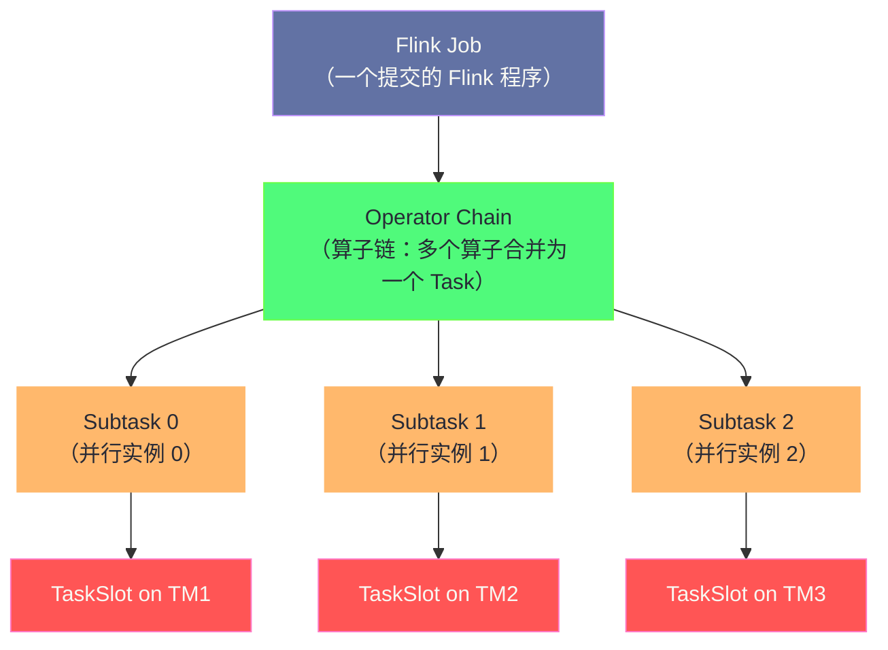

**摘要：**

在学习任何一项技术之前，最重要的问题不是"怎么用"，而是"它到底解决了什么问题，在什么场景下是最优选择"。Apache Flink 诞生于 2014 年，但其核心思想——**将流处理作为计算的第一等公民，批处理作为流处理的特例**——彻底颠覆了大数据领域"批处理优先"的传统认知。本文从流处理技术的演进历史出发，剖析每一代技术的核心痛点，进而阐明 Flink 在架构设计上的根本突破，并系统比较 Flink 与 Spark Streaming、Storm、Kafka Streams 的核心差异，最终帮助你建立起正确的技术选型判断框架。

---

## 第 1 章 数据处理的时间维度：批处理的根本局限

### 1.1 批处理范式及其隐藏假设

大数据处理的起点是 [[MapReduce]]。MapReduce 的设计哲学极其简单且优雅：将问题分解为 Map（映射）和 Reduce（归约）两个阶段，通过对**静态数据集**的分布式处理来完成大规模计算任务。

注意这里的关键词：**静态数据集**。MapReduce（以及之后的 [[Apache Spark]] 批处理）隐含了一个根本性假设——**数据是有界的（Bounded）**，即在开始计算之前，所有需要处理的数据已经完整地存在于存储系统中（HDFS 或 S3）。

这个假设在 2004 年 Google 发表 MapReduce 论文时是合理的：那个时代的数据处理场景主要是日志分析、离线报表、搜索索引构建，这些任务确实可以等到数据积累完成后再批量处理。

但随着互联网的发展，越来越多的业务场景需要对**持续产生的数据**进行实时处理：

**场景一：实时风控**。一笔信用卡交易在发生的瞬间，风控系统必须在几百毫秒内判断是否异常——等到凌晨批处理完成后再拦截，已经无法挽回损失。

**场景二：实时监控**。服务器 CPU 突然飙升，必须在秒级内触发告警和自动扩容——等一小时后的批处理报表显示"1 小时前 CPU 100%"，已经于事无补。

**场景三：实时推荐**。用户正在浏览商品，推荐系统需要根据用户当前的点击行为（而不是昨天的行为）实时调整推荐结果——昨日的行为数据对当下的推荐参考价值有限。

**场景四：流式 ETL**。将 Kafka 中的事件流实时清洗、关联、聚合后写入数据仓库，而不是每小时跑一次批处理——减少数据延迟，让分析结果更接近实时。

这些场景的共同特征是：**数据是无界的（Unbounded），持续不断地产生，需要低延迟地被处理**。批处理范式在这里遇到了根本性的障碍：你无法等到"所有数据到齐"才开始计算，因为数据永远不会"到齐"。

### 1.2 "Lambda 架构"：一个优雅但沉重的妥协

在 Flink 出现之前，工程界为了同时满足低延迟和高准确性，发明了 **Lambda 架构**（由 Nathan Marz 在 2012 年提出）。

Lambda 架构的核心思路是：**用两套系统并行处理同一份数据**：

```
原始数据
  ├── 批处理层（Batch Layer）：使用 Hadoop/Spark 对历史全量数据做精确计算
  │       延迟：小时级；准确性：高
  └── 速度层（Speed Layer）：使用 Storm/Spark Streaming 对最新数据做近似计算
          延迟：秒级；准确性：低（因为数据可能乱序、重复）

服务层（Serving Layer）：合并批处理层和速度层的结果，对外提供查询
  → 当批处理层的新结果出来时，替换速度层的近似结果
```

Lambda 架构确实解决了问题——在批处理层出结果之前，用速度层提供低延迟但可能不精确的结果；批处理层完成后，用精确结果覆盖近似结果。

但它的代价极其沉重：

**代价一：维护两套代码**。同一个业务逻辑（如"统计过去 1 小时的 UV"）需要用两种不同的框架（Spark 批处理 + Storm 流处理）实现两遍。两套代码必须保持语义一致，任何一处 bug 修复或逻辑变更都需要同步修改两套代码，极易出现不一致。

**代价二：两套运维体系**。两套计算引擎意味着两套部署、监控、调优体系，运维成本翻倍。

**代价三：数据一致性难以保证**。"何时用批处理结果替换速度层结果"本身就是一个复杂的工程问题，在实践中经常出现两层结果不一致的窗口期。

> [!note] 设计哲学：Lambda 架构的本质
> Lambda 架构是一个典型的"用系统复杂度换取功能完整性"的工程妥协。它承认了当时流处理框架（Storm）无法做到"精确一次"语义和有状态计算的局限性，用批处理层来弥补这个缺陷。这个架构存在的原因，恰恰说明了那个时代的流处理技术有多不成熟。

---

## 第 2 章 流处理技术的三代演进

### 2.1 第一代：Storm——低延迟的先驱，有状态的痛苦

[[Apache Storm]] 是第一代真正意义上的开源流处理框架，由 Twitter 于 2011 年开源。Storm 的核心贡献是证明了大规模低延迟流处理的可行性，它的 Topology（拓扑）模型——Spout（数据源）+ Bolt（处理节点）构成的 DAG——是后来所有流处理框架的概念先驱。

Storm 能做什么：单条消息延迟达到毫秒级；集群吞吐量每秒可处理数百万条消息；拓扑结构灵活，可以构建复杂的处理链路。

Storm 的根本局限是什么：

**局限一：无状态或状态管理极其痛苦**。Storm 本身不提供状态管理机制。如果你需要统计"过去 5 分钟每个 userId 的点击次数"，你必须自己维护一个外部状态存储（Redis、HBase），并自己处理状态的读取、更新、一致性。这在高并发场景下既复杂又容易出错。

**局限二：无时间语义**。Storm 完全基于处理时间（Processing Time），即数据到达 Storm Bolt 的时间。如果消息在网络中延迟了 5 分钟才到达，Storm 会把它当作"现在"产生的数据处理，导致统计结果不准确。

**局限三：At-Least-Once 的语义代价**。Storm 的消息可靠性是通过 ACK 机制实现的，每条消息被 Bolt 处理后需要向上游 ACK。这个机制保证了"至少处理一次"（At-Least-Once），但无法保证"精确一次"（Exactly-Once）——同一条消息可能被处理多次（网络重传时）。

**局限四：难以处理乱序数据**。实际生产中，消息的到达顺序和产生顺序几乎从不一致（网络抖动、机器重启等），Storm 没有任何机制处理乱序问题。

### 2.2 第二代：Spark Streaming——微批次的折衷

[[Apache Spark]] 团队在 Spark 之上构建了 Spark Streaming（2013 年）。Spark Streaming 的核心思路非常直接：**把流切成一个个小的批次（Micro-Batch），每个批次用 Spark 的批处理引擎处理**。

这个设计立刻继承了 Spark 的所有优点：成熟的容错机制、丰富的算子、与 Spark SQL 和 MLlib 的生态集成……同时将延迟从小时级（批处理）降低到了秒级（每个 Micro-Batch 通常 0.5 ~ 2 秒）。

Spark Streaming 比 Storm 进步的地方：

- **有内置状态管理**：`updateStateByKey` 和后来的 `mapWithState`，让有状态计算不再需要外部存储
- **语义更强**：Spark 的批处理基础使得 Exactly-Once 在某些场景下可以实现
- **更丰富的算子集**

但 Micro-Batch 这个根本设计选择也带来了 Spark Streaming 无法克服的限制：

**限制一：延迟下限**。Micro-Batch 的最小批次间隔通常为 0.5 秒，这意味着端到端延迟至少在秒级。对于需要毫秒级响应的实时风控、高频交易等场景，Spark Streaming 力不从心。

**限制二：时间语义的先天不足**。由于底层是批处理引擎，Spark Streaming（DStream API）的时间语义实际上是处理时间——每个 Micro-Batch 内的所有消息被当作同一时间点产生的数据。EventTime 支持非常有限（直到 Structured Streaming 才有所改善，但也存在局限）。

**限制三：窗口操作不自然**。流处理中的窗口（如"过去 1 小时"的统计）在 Micro-Batch 模式下需要跨越多个批次的状态，实现起来比较笨拙，且对齐问题复杂。

**限制四：背压（Backpressure）处理复杂**。当下游处理速度低于上游数据产生速度时，Micro-Batch 引擎需要动态调整批次大小，逻辑复杂，调优困难。

> [!info] 核心概念：Micro-Batch 与真正的流处理
> Micro-Batch（微批处理）本质上仍然是批处理——只是批次变得更小、更频繁。真正的流处理（Native Streaming）是**逐条处理每一个事件**，事件到达时立即触发计算，而不是等待一批数据积累后再统一处理。这两种模型在延迟、状态管理、时间语义处理上有根本性的差异。

### 2.3 第三代：Flink——真流处理的范式重建

Apache Flink 诞生于柏林工业大学的研究项目 Stratosphere（2010 年），2014 年捐献给 Apache 基金会，同年成为顶级项目。Flink 的核心论文（《Apache Flink: Stream and Batch Processing in a Single Engine》，2015）的第一句话就是：

> "Apache Flink is an open-source system for processing streaming and batch data. Flink is built on the philosophy that many classes of data processing applications, including real-time analytics, continuous data pipelines, historic data processing (batch), and iterative algorithms (machine learning, graph analysis) can be expressed and executed as pipelined fault-tolerant dataflows."

这句话背后有三个根本突破：

**突破一：以流处理为核心，批处理为特例**

Flink 的数学基础是**无界数据流（Unbounded Data Stream）**。批处理在 Flink 看来只是流处理的一个特例——数据是有界的（Bounded）流。这与 Spark 的思路完全相反：Spark 是以批处理为核心，Streaming 是批处理的扩展；Flink 是以流处理为核心，批处理是流处理的特例。

这个哲学差异导致了两者在时间语义、状态管理、Checkpoint 机制上的根本性架构差异。

**突破二：精确的时间语义**

Flink 是第一个将 **EventTime（事件时间）**、**ProcessingTime（处理时间）**、**IngestionTime（摄入时间）** 三种时间语义明确区分并完整支持的流处理框架。尤其是 EventTime + Watermark 机制，使得 Flink 可以正确处理乱序数据，即使消息晚到几分钟甚至几小时，也能被分配到正确的时间窗口中计算。

这个能力在现实中极其重要：网络延迟、机器重启、消息队列堆积都会导致消息乱序到达，一个不能处理乱序的流处理框架在生产中会产生大量不准确的结果。

**突破三：有状态计算 + 分布式快照（Checkpoint）**

Flink 将**状态（State）**作为流处理的第一等公民内置到框架中。开发者可以直接在算子中使用 `ValueState`、`ListState`、`MapState` 等状态原语，框架负责状态的分布式存储、容错恢复，以及在并行度变化时的状态重新分配。

更重要的是，Flink 基于 **Chandy-Lamport 分布式快照算法**实现了 Checkpoint 机制：在不停止作业的情况下，周期性地对整个分布式计算状态做一致性快照。一旦发生故障，从最近的 Checkpoint 恢复，且保证**精确一次（Exactly-Once）**的计算语义——每条数据恰好被处理一次，不多不少。

这三个突破共同解决了 Lambda 架构存在的根本原因：现在用一套 Flink 作业就能同时满足低延迟、高准确性、状态管理、容错恢复的需求，不再需要维护两套系统。

---

## 第 3 章 Flink 与其他流处理框架的横向对比

### 3.1 四维度核心对比

| 维度 | Apache Storm | Spark Streaming（DStream）| Spark Structured Streaming | Apache Flink |
|------|------------|--------------------------|--------------------------|-------------|
| **处理模型** | 原生流（逐条）| 微批次 | 微批次（可选 Continuous）| 原生流（逐条）|
| **端到端延迟** | 毫秒级 | 秒级（0.5s 以上）| 秒级（Continuous 模式毫秒级，限制多）| 毫秒级 |
| **时间语义** | 仅 ProcessingTime | 弱 EventTime 支持 | EventTime + Watermark | 完整三种时间语义 |
| **状态管理** | 无内置（需外部存储）| 有限内置 | 较完善 | 完整内置（多种状态类型 + 后端可选）|
| **Exactly-Once** | 仅 At-Least-Once | 部分场景支持 | 支持（部分 Source/Sink）| 完整端到端支持（含 Kafka）|
| **乱序处理** | 不支持 | 弱支持 | 支持 Watermark | 完整 Watermark 机制 |
| **批流一体** | 不支持 | 批处理另用 Spark Core | 同一 API | 统一流批 API |
| **反压处理** | 复杂 | 动态批次大小调整 | 内置 | Credit-based 精确背压 |
| **成熟度** | 高（但社区活跃度下降）| 高（DStream 已 Legacy）| 中高 | 高（主流选择）|
| **学习曲线** | 中 | 低（Spark 生态熟悉者）| 低（Spark 生态熟悉者）| 中高 |

### 3.2 Flink vs Spark Structured Streaming：最常见的选型困境

在 2024 年，对于大多数企业，流处理的选型往往收窄为两个选项：Flink 还是 Spark Structured Streaming？Storm 已经逐渐淡出主流视野，DStream API 也已经被标记为 Legacy。

**选 Flink 的核心理由**：

**理由一：毫秒级延迟**。如果你的业务需要真正的低延迟（< 100ms），Flink 是唯一选择。Spark Structured Streaming 的微批处理模型决定了其延迟下限在数百毫秒到秒级。Spark 的 Continuous Processing 模式（Spark 2.3 引入）可以实现低延迟，但功能限制极多（仅支持 map/filter，不支持聚合、Join、窗口），在实际生产中几乎不被使用。

**理由二：更成熟的状态管理**。Flink 的 RocksDB 状态后端支持超大状态（TB 级别），增量 Checkpoint 使得状态快照开销可控。Spark Structured Streaming 的状态管理相对有限，大状态场景下容易出现 OOM 或 Checkpoint 超时。

**理由三：更完善的 EventTime 支持**。Flink 的 Watermark 机制经过多年打磨，对多源 Watermark 对齐、Idle Source 检测、迟到数据处理等边界情况有完整的处理方案。

**理由四：流批一体更彻底**。Flink 1.9 之后，同一段代码（Table API/Flink SQL）可以在流模式和批模式下运行，无需修改。这使得离线验证、在线生产的代码统一成为可能。

**选 Spark Structured Streaming 的核心理由**：

**理由一：团队已熟悉 Spark 生态**。如果团队已经大量使用 Spark 做批处理，Structured Streaming 的学习成本接近于零，API 几乎一模一样。

**理由二：与 Delta Lake/Iceberg 的深度集成**。如果你的架构基于 Lakehouse，Structured Streaming 与 Delta Lake 的集成（流式 MERGE、Schema Evolution 等）比 Flink 更成熟。

**理由三：延迟要求不高（> 1 分钟）**。如果你的流处理实际上是"接近实时的批处理"（每分钟跑一次），Structured Streaming 完全够用，且更简单。

**理由四：复杂 SQL 分析场景**。Spark SQL 的优化器（Catalyst）更成熟，对复杂的分析 SQL 支持更好；Flink SQL 在这方面也在持续追赶，但差距依然存在。

### 3.3 Flink vs Kafka Streams：架构哲学的根本差异

[[Kafka Streams]] 是一个经常被拿来与 Flink 比较但实际上定位完全不同的框架：

- **Kafka Streams** 是一个**库（Library）**，嵌入在你的 Java/Scala 应用中运行，不需要独立的集群，天然与 Kafka 深度集成，但只能消费 Kafka 数据源，且不适合大规模计算
- **Flink** 是一个**分布式计算引擎**，需要独立的集群（JobManager + TaskManager），支持任意数据源（Kafka、MySQL、HDFS、HTTP 等），适合大规模复杂计算

**选 Kafka Streams 的场景**：轻量级的流处理逻辑，数据源只有 Kafka，不希望维护独立的计算集群，团队是 Java 应用开发背景

**选 Flink 的场景**：需要跨多数据源的复杂处理，需要大规模分布式计算，需要严格的时间语义和状态管理，数据来源不只是 Kafka

---

## 第 4 章 Flink 的核心设计思想

### 4.1 一切皆流：统一的计算模型

Flink 最核心的设计思想是：**数据流（DataStream）是计算的基础抽象，批处理是流处理的特例**。

这不只是一个哲学立场，它对技术实现产生了深远影响：

**影响一：统一的 API**。`DataStream` API 既可以处理无界流（Kafka、消息队列），也可以处理有界流（HDFS 文件、数据库表）。相同的 API，不同的执行模式（流模式/批模式）。

**影响二：统一的运行时**。不需要为流处理和批处理维护两套引擎代码。同一套 Flink 运行时负责执行所有类型的作业，减少了维护复杂度。

**影响三：一致的状态和容错语义**。无论是流作业还是批作业，状态管理和容错机制是同一套——虽然批作业通常不需要状态，但框架层面是一致的。

### 4.2 Flink 的执行单元：算子、任务与子任务

Flink 程序的执行被组织为以下层次：



- **算子（Operator）**：`map`、`filter`、`keyBy`、`window` 等，是用户代码中定义的处理逻辑单元
- **任务（Task）**：相邻的、可以链化的算子会被合并为一个 Task（减少序列化和网络开销），在同一个线程中执行
- **子任务（Subtask）**：每个 Task 按照并行度展开为多个 Subtask，每个 Subtask 是真正的执行单元
- **Task Slot**：TaskManager 上的资源隔离单元，每个 Slot 可以运行一个 Subtask（线程级隔离）

理解这个层次对于后续的并行度配置、资源规划至关重要。

### 4.3 Flink 的生产应用场景全景

Flink 在生产环境中的主要应用场景：

**场景一：实时 ETL 与数据管道**
从 Kafka 消费原始事件，经过过滤、转换、关联维度数据后，写入 HDFS、Hive、HBase 或数据仓库。这是 Flink 最典型的使用场景，每日处理数据量常达 TB 级别。

**场景二：实时聚合分析（OLAP 预计算）**
按照时间窗口（如每分钟、每小时）对用户行为、订单、日志数据做多维聚合，将结果写入 Redis 或 OLAP 系统，供报表系统查询。解决了"用批处理做实时报表"的延迟问题。

**场景三：实时风控与规则引擎**
对交易、登录、注册等事件做实时特征计算（如"过去 10 分钟内该账号发生了多少笔交易"），结合规则引擎判断是否触发风控规则。要求毫秒级延迟，是 Flink 与 Storm 竞争的核心战场。

**场景四：CDC（Change Data Capture）数据同步**
配合 Flink CDC 连接器，将 MySQL/PostgreSQL 的 binlog 变更事件实时同步到数据仓库，实现"准实时数仓"架构，替代传统的 T+1 全量同步。

**场景五：机器学习特征工程**
对用户行为流实时计算特征（如"最近 30 分钟的点击类目分布"），存入特征存储供模型推理使用，解决离线特征计算滞后导致模型效果衰减的问题。

---

## 第 5 章 Flink 的核心组件快速预览

在深入学习具体 API 之前，先建立对 Flink 整体架构的基本印象。

### 5.1 Flink 集群的核心进程

**JobManager（JM）**：集群的大脑，负责：
- 接收和解析用户提交的 Flink Job
- 将 Job 的逻辑执行图（JobGraph）转换为物理执行图（ExecutionGraph）
- 向 ResourceManager 申请 TaskSlot，调度 Subtask 到 TaskManager
- 触发 Checkpoint，协调故障恢复
- 监控整个作业的运行状态

**TaskManager（TM）**：集群的执行节点，负责：
- 提供 TaskSlot（计算资源）
- 执行 JobManager 分配过来的 Subtask
- 管理各 Subtask 的网络 Buffer（数据传输的缓冲区）
- 向 JobManager 汇报 Subtask 的运行状态

**Client（客户端）**：提交作业的入口，负责：
- 将用户代码编译为 JobGraph（逻辑执行图）
- 将 JobGraph 提交给 JobManager
- 提交完成后，Client 可以断开连接（作业在集群中独立运行）

### 5.2 Flink 支持的 API 层次

Flink 提供了多个抽象层次的 API，从低级到高级：

```
SQL / Table API（最高级，声明式）
    ↓
DataStream API / DataSet API（中级，程序化）
    ↓
ProcessFunction / 底层算子（低级，最大灵活性）
    ↓
Flink 运行时（用户不直接接触）
```

**SQL / Table API**：声明式接口，适合数据分析、ETL 场景，SQL 用户上手容易，与 Hive 元数据集成

**DataStream API**：程序化接口，支持完整的流处理语义，是 Flink 最核心的 API，本专栏的主要内容

**ProcessFunction**：最低级别的 API，可以直接访问 Timer（定时器）、State，用于实现复杂的自定义逻辑

---

## 小结

本文建立了理解 Flink 的基础框架：

**为什么需要流处理**：实时风控、实时监控、实时推荐等场景要求低延迟处理持续产生的数据，批处理范式根本无法满足

**流处理框架的三代演进**：Storm（低延迟但无状态管理）→ Spark Streaming（微批次，有状态但延迟受限）→ Flink（真流处理，完整状态管理，精确时间语义）

**Flink 的三大核心突破**：①以流处理为核心的统一计算模型 ②完整的三种时间语义（EventTime + Watermark）③有状态计算 + Checkpoint 分布式一致性快照

**技术选型框架**：
- 需要毫秒级延迟、大状态、完整 EventTime 支持 → **选 Flink**
- 团队已深度使用 Spark、与 Delta Lake 集成、延迟 > 1 分钟 → **选 Spark Structured Streaming**
- 轻量级流处理、只有 Kafka 数据源、不想维护独立集群 → **选 Kafka Streams**

下一篇 [[02 快速上手：第一个 Flink 程序]] 将从零开始搭建 Flink 开发环境，写出第一个可以运行的 Flink 程序，并讲解本地调试的技巧。
