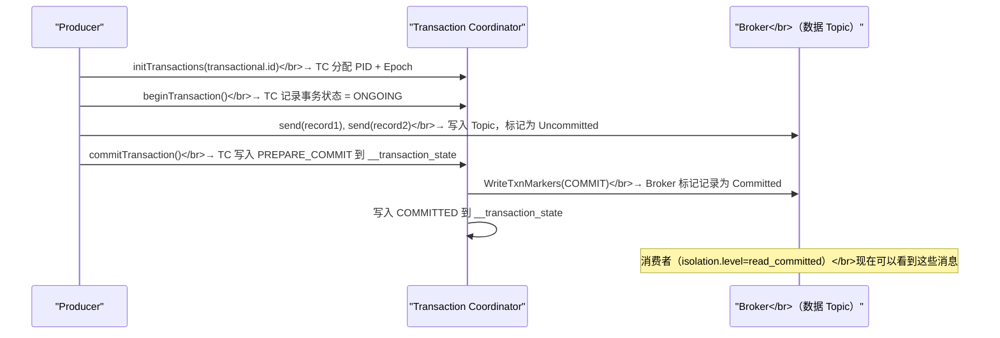

**摘要：**

"精确一次（Exactly-Once）"是流处理最高等级的数据一致性保证——每条输入消息恰好对系统状态产生一次影响，既不丢失也不重复。在 Flink + Kafka 的经典架构中，精确一次语义由三个部分协同保证：Kafka Source 的 Offset 管理（通过 Checkpoint 持久化消费位点）、Flink 内部状态的 Checkpoint 容错机制、以及 Kafka Sink 的事务性写入（两阶段提交协议）。本文从三个层次的语义保证出发，重点剖析 Kafka 事务的工作机制——`transactional.id`、`initTransactions()`、`beginTransaction()`、`commitTransaction()`、`abortTransaction()` 各自做了什么，以及 Flink 的 `FlinkKafkaProducer`（旧版）和新版 `KafkaSink` 如何将 2PC 嵌入 Checkpoint 生命周期。最终给出完整的生产配置清单，并分析精确一次的性能代价与取舍建议。

---

## 第 1 章 三种语义保证的本质差异

### 1.1 At-Most-Once：最多一次（允许丢失，不重复）

不做任何容错处理的最简单语义：数据处理失败时直接丢弃，不重试。

- **实现方式**：不开启 Checkpoint，Kafka Offset 不持久化
- **故障表现**：TaskManager 宕机后，Flink 重启从最新 Offset 继续消费（故障期间的数据丢失）
- **适用场景**：对数据完整性要求不高的监控类场景（偶尔丢几条指标数据可接受）

### 1.2 At-Least-Once：至少一次（不丢失，但可能重复）

通过 Checkpoint 持久化 Kafka Offset，故障恢复时从上一个成功的 Checkpoint 重放数据。

- **实现方式**：开启 Checkpoint，但 Sink 不使用事务写入
- **故障表现**：重放期间，Checkpoint 之后已经写入 Sink（Kafka/MySQL 等）的数据会被**重复写入**
- **适用场景**：允许幂等去重的场景（如 Kafka 下游有唯一 ID 去重逻辑）

### 1.3 Exactly-Once：精确一次（不丢失，不重复）

在 At-Least-Once 的基础上，通过事务机制保证 Sink 端的写入不重复。

- **实现方式**：开启 Checkpoint + Sink 使用事务性写入（两阶段提交）
- **故障表现**：故障恢复后数据重放，但重放的数据写入 Sink 时使用相同的事务 ID，幂等提交不产生重复
- **代价**：额外的事务开销（Checkpoint 期间预提交事务，Checkpoint 完成后才对消费者可见）

这三种语义形成了一个"保证强度 vs 性能开销"的权衡：

| 语义 | 数据丢失 | 数据重复 | 吞吐影响 | 典型场景 |
|------|---------|---------|---------|---------|
| At-Most-Once | 可能 | 否 | 无 | 监控指标、日志统计 |
| At-Least-Once | 否 | 可能 | 低 | 幂等写入、可容忍重复 |
| Exactly-Once | 否 | 否 | 中等（~10-20%）| 支付、账单、财务报表 |

---

## 第 2 章 Kafka 事务机制详解

### 2.1 为什么 Kafka 需要事务

Kafka 在 0.11 版本之前只支持幂等 Producer（通过 `enable.idempotence=true` 去重单个 Producer 的重试），但幂等 Producer 解决不了跨会话的重复：Producer 宕机重启后，新的 Producer 实例 ID 不同，重新发送的消息不会被识别为重复。

Kafka 0.11 引入了**事务性 Producer**，通过 `transactional.id`（用户指定的稳定 ID）将跨会话的多次写入绑定到同一个"事务 ID"下，Broker 端通过事务 ID 去重。

### 2.2 Kafka 事务的核心 API

```java
// 1. 创建事务性 Producer（必须设置 transactional.id）
Properties props = new Properties();
props.put("bootstrap.servers", "kafka:9092");
props.put("transactional.id", "my-transactional-producer-1");  // 必须全局唯一且稳定
props.put("enable.idempotence", "true");                        // 事务隐含开启幂等
KafkaProducer<String, String> producer = new KafkaProducer<>(props);

// 2. 初始化事务（向 Broker 注册 transactional.id，获取 PID）
producer.initTransactions();

// 3. 开始事务
producer.beginTransaction();

// 4. 在事务中发送消息（消息写入 Broker 但不对消费者可见）
producer.send(new ProducerRecord<>("topic", "key", "value"));
producer.send(new ProducerRecord<>("topic", "key2", "value2"));

// 5a. 提交事务（消息对消费者可见）
producer.commitTransaction();

// 5b. 或者回滚事务（消息对消费者不可见，Broker 端标记为 Aborted）
producer.abortTransaction();
```

### 2.3 事务协调器与 __transaction_state Topic

Kafka 事务由 **Transaction Coordinator（事务协调器）** 负责协调，每个 `transactional.id` 有一个固定的 Transaction Coordinator（通过 `hash(transactional.id) % num_partitions` 确定，存储在内部 Topic `__transaction_state` 中）。

**事务提交的完整流程**：



**消费者侧的隔离级别**：消费者需要设置 `isolation.level=read_committed`，才能只看到已提交事务的消息，忽略未提交和已回滚事务的消息。

```java
// 消费者配置
Properties consumerProps = new Properties();
consumerProps.put("isolation.level", "read_committed");  // 默认是 read_uncommitted
```

> [!warning] 生产避坑：消费者隔离级别是精确一次的必要条件
> 即使 Producer 端配置了事务，如果消费者使用默认的 `read_uncommitted`，它仍然能看到预提交但尚未 commit 的消息。如果事务之后被 abort，消费者已经读了这些数据——从消费者视角看，数据被"回滚"了，造成数据不一致。务必在 Exactly-Once 场景中将消费者的 `isolation.level` 设置为 `read_committed`。

### 2.4 transactional.id 的稳定性要求

`transactional.id` 必须是**稳定且唯一**的——对于同一个"逻辑写入通道"，跨多次运行使用相同的 ID。这样 Transaction Coordinator 才能识别"这个新 Producer 是上一个 Producer 的重启"，并使用相同的事务进行幂等去重。

如果 `transactional.id` 在重启后改变，Transaction Coordinator 视其为全新的 Producer，无法做跨会话去重。

---

## 第 3 章 KafkaSink 的两阶段提交实现

### 3.1 旧版 FlinkKafkaProducer（Flink 1.14 之前）

在 Flink 1.14 之前，Kafka Sink 使用 `FlinkKafkaProducer`，内部实现了 `TwoPhaseCommitSinkFunction`。

**transactional.id 的生成规则**：

```
transactional.id = {transactionalIdPrefix}-{subtaskIndex}-{checkpointId}

例：transactionalIdPrefix = "my-job-kafka-sink"，Subtask-0，Checkpoint-42 时：
  transactional.id = "my-job-kafka-sink-0-42"
```

这里有一个关键设计：`checkpointId` 作为 `transactional.id` 的一部分，意味着**每次 Checkpoint 使用不同的事务**（而不是一直复用同一个事务）。原因在于：每个 Checkpoint 区间的数据需要独立的事务管理——Checkpoint N 的数据在 Checkpoint N 完成时提交，Checkpoint N+1 的数据在 Checkpoint N+1 完成时提交。

**预提交（pre-commit）阶段**：

收到 Checkpoint Barrier 后，`FlinkKafkaProducer` 调用 `preCommit()`：
1. `producer.flush()`：确保当前事务中的所有消息都已发送到 Broker（不 commit，只确保网络发送完成）
2. 切换到新的 Kafka Producer 实例（开始新的事务，用于下一个 Checkpoint 区间的数据）

**提交（commit）阶段**：

收到 `notifyCheckpointComplete()` 时，调用 `commit()`：
1. `producer.commitTransaction()`：提交上一个 Checkpoint 区间的事务，消息对消费者可见

### 3.2 新版 KafkaSink（Flink 1.14+）

Flink 1.14 引入了全新的 `KafkaSink`（基于 Kafka 2.6+ 的新 Producer API），配置更简洁：

```java
// 完整的 Flink + Kafka Exactly-Once 配置（新版 KafkaSink）
KafkaSink<OrderEvent> kafkaSink = KafkaSink.<OrderEvent>builder()
    .setBootstrapServers("kafka:9092")
    .setRecordSerializer(
        KafkaRecordSerializationSchema.builder()
            .setTopic("enriched-orders")
            .setValueSerializationSchema(new OrderEventSerializationSchema())
            .build()
    )
    // *** 关键：设置投递语义 ***
    .setDeliverGuarantee(DeliveryGuarantee.EXACTLY_ONCE)
    // 设置事务 ID 前缀（必须全局唯一，不同作业不能相同）
    .setTransactionalIdPrefix("order-enrichment-job-sink")
    // Kafka Producer 额外配置
    .setKafkaProducerConfig(new Properties() {{
        put("transaction.timeout.ms", "600000");  // 事务超时 10 分钟（必须 > Checkpoint 间隔）
        put("acks", "all");                        // 所有副本确认
        put("retries", "3");
    }})
    .build();

// 配置 Flink 作业
StreamExecutionEnvironment env = StreamExecutionEnvironment.getExecutionEnvironment();
// Exactly-Once 必须开启 Checkpoint
env.enableCheckpointing(60_000, CheckpointingMode.EXACTLY_ONCE);
env.getCheckpointConfig().setCheckpointStorage("hdfs:///flink/checkpoints");

DataStream<OrderEvent> enrichedOrders = ...;
enrichedOrders.sinkTo(kafkaSink).uid("kafka-sink");  // 必须设置 UID！

env.execute("Order Enrichment Exactly-Once Job");
```

### 3.3 DeliveryGuarantee 的三个级别

```java
// AT_MOST_ONCE：不等 Broker 确认，最快但可能丢数据
.setDeliverGuarantee(DeliveryGuarantee.AT_MOST_ONCE)

// AT_LEAST_ONCE：等 Broker 确认（acks=all），但不开事务，故障重放时可能重复
.setDeliverGuarantee(DeliveryGuarantee.AT_LEAST_ONCE)

// EXACTLY_ONCE：开启 Kafka 事务 + Flink 两阶段提交
.setDeliverGuarantee(DeliveryGuarantee.EXACTLY_ONCE)
```

---

## 第 4 章 完整的端到端精确一次配置

### 4.1 Kafka Source 配置

```java
KafkaSource<OrderEvent> kafkaSource = KafkaSource.<OrderEvent>builder()
    .setBootstrapServers("kafka:9092")
    .setTopics("raw-orders")
    .setGroupId("order-enrichment-consumer")
    .setStartingOffsets(OffsetsInitializer.committedOffsets(OffsetResetStrategy.EARLIEST))
    // *** 精确一次的关键消费者配置 ***
    // isolation.level = read_committed：只消费已提交事务的消息
    .setProperty("isolation.level", "read_committed")
    .setDeserializer(KafkaRecordDeserializationSchema.valueOnly(new OrderEventDeserializationSchema()))
    .build();
```

**Kafka Source 侧的精确一次保证**：

Flink 的 `KafkaSource` 通过 **Checkpoint 持久化 Kafka Offset** 来实现精确一次的消费侧保证：
- 每次 Checkpoint 时，Source Task 将当前消费的 Topic-Partition → Offset 映射保存到 Checkpoint 状态中
- 故障恢复时，从最近一次成功的 Checkpoint 中读取 Offset，从该位置重新消费 Kafka
- 配合 `isolation.level=read_committed`，只消费 Flink 上游作业已提交的事务消息

**注意：Flink 不使用 Kafka Consumer Group Offset Commit**

在精确一次模式下，Flink 的 Kafka Source **不依赖** Kafka 自身的 Consumer Group Offset 管理（`auto.commit.enable=false`）。Offset 完全由 Flink 的 Checkpoint 状态管理。即使在 Kafka Broker 侧查看 Consumer Group 的 Committed Offset，也可能是过期的值（Flink 只在周期性地提交 Offset 给 Kafka 用于监控，实际恢复使用 Checkpoint 中保存的 Offset）。

### 4.2 完整端到端配置示例

```java
public class ExactlyOnceOrderPipeline {

    public static void main(String[] args) throws Exception {

        StreamExecutionEnvironment env = StreamExecutionEnvironment.getExecutionEnvironment();
        env.setParallelism(8);

        // ===== Checkpoint 配置（精确一次的基础）=====
        env.enableCheckpointing(60_000);  // 每 60 秒一次 Checkpoint
        env.getCheckpointConfig().setCheckpointingMode(CheckpointingMode.EXACTLY_ONCE);
        env.getCheckpointConfig().setCheckpointTimeout(10 * 60_000);  // 10 分钟超时
        env.getCheckpointConfig().setMinPauseBetweenCheckpoints(30_000);
        env.getCheckpointConfig().setTolerableCheckpointFailureNumber(3);
        env.getCheckpointConfig().setExternalizedCheckpointCleanup(
            ExternalizedCheckpointCleanup.RETAIN_ON_CANCELLATION);
        env.getCheckpointConfig().setCheckpointStorage("hdfs:///flink/checkpoints/order-pipeline");

        // ===== Kafka Source（精确一次消费）=====
        KafkaSource<String> source = KafkaSource.<String>builder()
            .setBootstrapServers("kafka:9092")
            .setTopics("raw-orders")
            .setGroupId("order-pipeline-consumer")
            .setStartingOffsets(OffsetsInitializer.committedOffsets(OffsetResetStrategy.EARLIEST))
            .setProperty("isolation.level", "read_committed")
            .setValueOnlyDeserializer(new SimpleStringSchema())
            .build();

        WatermarkStrategy<String> watermarkStrategy = WatermarkStrategy
            .<String>forBoundedOutOfOrderness(Duration.ofSeconds(5))
            .withIdleness(Duration.ofMinutes(2));

        DataStream<String> rawOrders = env.fromSource(
            source, watermarkStrategy, "Kafka-Source"
        ).uid("kafka-source");

        // ===== 业务逻辑处理 =====
        DataStream<EnrichedOrder> enrichedOrders = rawOrders
            .map(new OrderParser()).uid("order-parser")
            .keyBy(order -> order.getUserId())
            .process(new OrderEnrichmentFunction()).uid("order-enrichment");

        // ===== Kafka Sink（精确一次写入）=====
        Properties producerProps = new Properties();
        producerProps.put("transaction.timeout.ms", "600000");  // 10 分钟，必须 > Checkpoint 超时
        producerProps.put("acks", "all");

        KafkaSink<EnrichedOrder> sink = KafkaSink.<EnrichedOrder>builder()
            .setBootstrapServers("kafka:9092")
            .setRecordSerializer(
                KafkaRecordSerializationSchema.builder()
                    .setTopic("enriched-orders")
                    .setValueSerializationSchema(new EnrichedOrderSerializer())
                    .build()
            )
            .setDeliverGuarantee(DeliveryGuarantee.EXACTLY_ONCE)
            .setTransactionalIdPrefix("order-pipeline-sink-v1")
            .setKafkaProducerConfig(producerProps)
            .build();

        enrichedOrders.sinkTo(sink).uid("kafka-sink");

        env.execute("Order Enrichment Pipeline - Exactly Once");
    }
}
```

---

## 第 5 章 精确一次的代价与生产取舍

### 5.1 性能代价分析

**代价一：写入延迟增加**

Exactly-Once 模式下，Kafka Sink 写入的数据在事务提交之前对消费者不可见。事务提交发生在 Checkpoint 完成后，因此从数据产生到消费者可见的延迟 ≈ **Checkpoint 完成时间**（通常 10s ~ 2min）。

对于低延迟要求的场景（如实时监控大屏，要求秒级可见），Exactly-Once 的延迟是不可接受的。

**代价二：Kafka Broker 的事务协调开销**

每个事务涉及：
- `beginTransaction()`：向 Transaction Coordinator 注册事务（1次 RPC）
- 每条消息的事务标记写入（轻量）
- `commitTransaction()`：Transaction Coordinator 写入 PREPARE_COMMIT → 通知所有 Broker 写入 COMMIT 标记 → 写入 COMMITTED（多次 RPC）

在高并发场景（如 100 个并行 Sink Subtask 同时提交事务），Transaction Coordinator 可能成为瓶颈。

**代价三：Consumer 侧的 read_committed 开销**

Consumer 使用 `read_committed` 时，需要等待未提交事务的消息的事务状态确定后才能返回——如果 Kafka 中有长时间未提交的事务（如 Flink 故障期间的未完成事务），Consumer 可能被阻塞。

### 5.2 Exactly-Once vs At-Least-Once + 幂等去重

在很多实际业务中，**At-Least-Once + 下游幂等处理** 比 Exactly-Once 更实用：

```
方案：
  Flink Sink 使用 At-Least-Once 写入 Kafka
  下游消费者对每条消息有唯一 ID（如 orderId），写入 MySQL 时使用 INSERT IGNORE 或 ON DUPLICATE KEY UPDATE

优势：
  写入延迟低（不等 Checkpoint 完成就可见）
  实现简单（不需要事务配置）
  吞吐更高（无事务协调开销）

局限：
  下游必须能生成唯一 ID 并实现幂等写入
  不适合聚合计算结果（聚合值没有"唯一 ID"，无法去重）
```

**决策建议**：

| 场景 | 推荐语义 | 理由 |
|------|---------|------|
| 实时监控大屏、日志统计 | At-Least-Once | 偶尔重复可接受，延迟更重要 |
| 订单流水、消息转发（有唯一 ID）| At-Least-Once + 幂等 | 下游去重，性能更好 |
| 财务结算、账单生成（聚合结果）| Exactly-Once | 聚合值无法幂等，必须精确 |
| 实时特征工程、机器学习流水线 | Exactly-Once 或 At-Least-Once | 视下游算法对重复的容忍度 |

### 5.3 事务超时时间的关键配置

```
transaction.timeout.ms（Producer 配置）> checkpoint.timeout（Flink Checkpoint 超时）

原因：
  - 一次 Checkpoint 可能耗时最长 checkpoint.timeout 毫秒
  - 在 Checkpoint 完成之前，Kafka 事务处于 ONGOING 状态
  - 如果事务超时 < Checkpoint 超时，Kafka Broker 会自动 Abort 超时事务
  - Checkpoint 完成后 Flink 调用 commitTransaction()，但事务已被 Abort
  - 提交失败 → 作业重启 → 数据丢失或重复

推荐配置：
  checkpoint.timeout = 10 分钟（Flink 侧）
  transaction.timeout.ms = 900000（15 分钟，Kafka 侧，留 5 分钟余量）

注意：
  Kafka Broker 默认的 transaction.max.timeout.ms = 900000（15 分钟）
  如果需要更长的事务超时，需要同时修改 Broker 配置：
  transaction.max.timeout.ms = 1800000（30 分钟）
```

> [!warning] 生产避坑：孤儿事务的清理问题
> 当 Flink 作业异常终止（kill -9 或 OOM）时，正在进行中的 Kafka 事务不会被 abort——它们处于 ONGOING 状态，直到 `transaction.timeout.ms` 超时后 Kafka 自动 abort。
>
> 在超时期间，使用 `read_committed` 的消费者会被这些 ONGOING 事务"阻塞"（因为 Consumer 不知道这些消息最终会不会被 commit，所以会等待）。对于消费者延迟敏感的场景，建议将 `transaction.timeout.ms` 设置为较小的值（如 10 分钟），减少孤儿事务阻塞消费者的时间。

---

## 第 6 章 常见问题排查

### 6.1 Exactly-Once 配置后数据仍然重复

**可能原因一：消费者未设置 `isolation.level=read_committed`**

排查：检查消费者配置，确认 `isolation.level=read_committed`。

**可能原因二：`transactionalIdPrefix` 不唯一**

如果两个不同的 Flink 作业使用了相同的 `transactionalIdPrefix`，它们的 Subtask-0 会使用相同的 `transactional.id`，相互干扰事务状态。

排查：确保每个 Flink 作业的 `transactionalIdPrefix` 全局唯一（包含作业名称、版本等）。

**可能原因三：作业代码有多个 Sink 写同一 Topic**

同一个 Flink 作业如果有两个 `KafkaSink` 都写同一个 Topic，需要确保两个 Sink 的 `transactionalIdPrefix` 也不同，否则会相互干扰事务。

### 6.2 Checkpoint 完成后 commitTransaction 失败

**现象**：Flink 日志中出现 `ProducerFencedException` 或 `InvalidProducerEpochException`。

**原因**：这通常意味着同一个 `transactional.id` 被两个不同的 Producer 实例同时使用。

**常见场景**：
- 作业升级时，新版本和旧版本同时运行了一段时间，使用了相同的 `transactionalIdPrefix`
- 并行度变更后，某些 `transactional.id`（由 `{prefix}-{subtaskIndex}-{checkpointId}` 生成）发生冲突

**解决**：
- 每次作业升级时，修改 `transactionalIdPrefix`（如添加版本号后缀：`order-pipeline-sink-v2`）
- 确保旧作业完全停止后再启动新作业

### 6.3 KafkaSource 从非预期 Offset 消费

**现象**：作业从 Checkpoint 恢复，但实际消费的 Offset 不是 Checkpoint 中保存的 Offset。

**常见原因**：使用了 `setStartingOffsets(OffsetsInitializer.latest())` 的代码，在某些版本的 Flink 中，当 Checkpoint 中没有找到对应的 Offset 记录时（如新分区），会从 `latest` 开始消费而非 `earliest`，导致新分区的历史数据被跳过。

**解决**：使用 `OffsetsInitializer.committedOffsets(OffsetResetStrategy.EARLIEST)`，确保新分区从头消费。

---

## 小结

Flink + Kafka 端到端精确一次的完整配置清单：

**Flink 侧（必须配置）**：
- 开启 Checkpoint，模式设为 `EXACTLY_ONCE`
- `KafkaSink` 的 `DeliveryGuarantee.EXACTLY_ONCE`
- `setTransactionalIdPrefix()`：全局唯一、不同版本使用不同前缀
- Kafka Producer 的 `transaction.timeout.ms` > Flink Checkpoint 超时时间

**Kafka 侧（必须配置）**：
- Consumer：`isolation.level=read_committed`
- Broker：`transaction.max.timeout.ms` 需要 ≥ Producer 的 `transaction.timeout.ms`

**精确一次的代价**：写入延迟 ≈ Checkpoint 完成时间（10s ~ 2min），Kafka 事务协调开销（~10-20% 吞吐损失）。

**决策建议**：财务/账单/聚合结果类业务用 Exactly-Once；有唯一 ID 的消息转发类业务优先考虑 At-Least-Once + 幂等去重（延迟更低、性能更好）。

下一篇 [[09 Flink on YARN 与 Kubernetes 生产部署]] 将讲解 Flink 在 YARN 和 Kubernetes 两种资源管理平台上的部署模式（Session Mode、Per-Job Mode、Application Mode），以及生产环境的高可用配置与资源规划。


> [!note] 思考题
> 1. Flink + Kafka 的端到端精确一次依赖 Kafka 事务（两阶段提交）。Kafka 事务的 PreCommit 阶段在 Checkpoint 完成后触发，真正提交（Commit）发生在下一个 Checkpoint 开始时。这意味着在两个 Checkpoint 之间，已写入 Kafka 但未提交的数据对消费者是不可见的（隔离级别为 `read_committed`）。这个设计导致了端到端延迟至少是一个 Checkpoint 周期。如何在保证精确一次的前提下尽量降低这个延迟？
> 2. Kafka 事务 Producer 的 `transactional.id` 是事务的唯一标识符。如果 Flink 作业从 Checkpoint 恢复，新的 Producer 实例会使用相同的 `transactional.id`，并强制终止（Abort）之前未完成的事务。但如果有两个相同 `transactional.id` 的 Producer 同时活跃（比如由于 Split-Brain 导致新旧 Producer 并存），会发生什么？Flink 如何通过 Epoch 机制防止这种情况？
> 3. 精确一次的两阶段提交对 Sink 有要求——Sink 必须支持事务（PreCommit + Commit + Rollback）。对于不支持事务的 Sink（如写文件系统），Flink 通过"先写临时文件，Checkpoint 完成后 rename"来模拟事务。但这个"rename 即提交"的策略在分布式文件系统上有什么限制？在使用 S3 作为 Sink 时，rename 不是原子操作，如何解决？