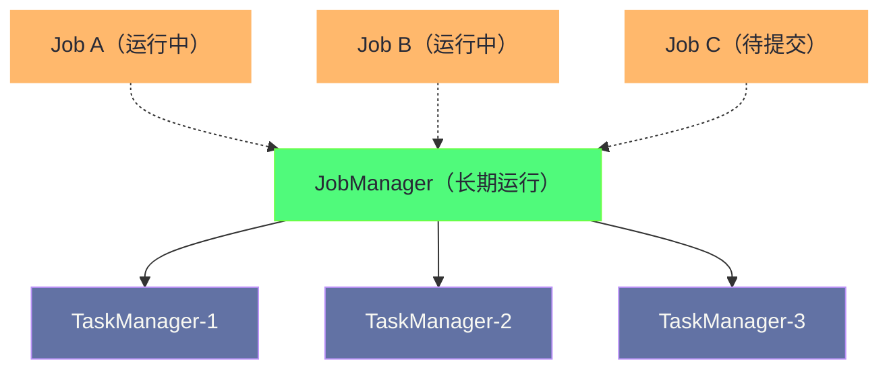

**摘要：**

将 Flink 作业部署到生产环境，不是简单地 `flink run` 一条命令的事——选择哪种部署模式（Session Mode、Per-Job Mode、Application Mode）、如何配置 JobManager 高可用、如何合理规划 TaskManager 资源（并行度 × 内存 = TM 数量）、如何在 YARN 和 Kubernetes 两种截然不同的资源管理范式下操作 Flink，每一个决策都直接影响作业的稳定性和资源利用率。本文系统讲解三种部署模式的本质差异与选型依据，分别给出 Flink on YARN 和 Flink on Kubernetes 的完整生产配置流程，重点解析 JobManager 高可用的配置（基于 ZooKeeper 和 Kubernetes Leader Election），以及资源规划的实践计算方法。

---

## 第 1 章 三种部署模式的本质差异

### 1.1 Session Mode：共享 Flink 集群

Session Mode 是 Flink 最早支持的部署模式，思路是：**先在 YARN/K8s 上启动一个长期运行的 Flink 集群（包含 JobManager 和若干 TaskManager），然后将多个 Flink 作业提交到这个共享集群中运行。**



**优点**：
- 多个作业共享 TaskManager，资源利用率高（TM 的 Slot 可以被不同作业使用）
- 作业提交速度快（集群已经存在，无需等待申请资源）
- 适合开发调试（快速迭代）

**缺点**：
- **资源隔离差**：一个作业的异常（如 OOM 导致 TM 崩溃）会影响同一 TM 上的其他作业
- **依赖集群存活**：如果 JobManager 宕机（单点故障），所有运行中的作业都会失败
- **不适合生产**的关键业务（稳定性要求高的作业不应与其他作业共享 TM）

**Session Mode 的适用场景**：
- 开发测试环境（快速提交、验证结果）
- 短时批处理作业（数据量小、执行时间短，不值得为每个作业单独申请集群）
- 资源有限、需要最大化共享的场景

### 1.2 Per-Job Mode（YARN 专属，Flink 1.15 后废弃）

Per-Job Mode 为**每个 Flink 作业单独申请一个 YARN Application（包含专属的 JobManager 和 TaskManager）**，作业完成后资源释放。

```
提交流程：
  flink run -m yarn-cluster -p 4 -yjm 1024 -ytm 2048 my-job.jar
  → YARN ResourceManager 分配一个 Container 启动 JobManager
  → JobManager 向 YARN 申请 N 个 TaskManager Container
  → 所有 Task 在专属 TM 上运行
  → 作业完成 → YARN Application 结束 → 资源释放
```

**优点**：
- 作业之间完全隔离（不同作业的 TM 不共享）
- 作业失败不影响其他作业

**缺点**：
- 每个作业启动都需要等待 YARN 分配资源（分钟级延迟）
- 大量短作业时，YARN AM 的启动开销占比很高

**Flink 1.15 起废弃**（被 Application Mode 替代）。

### 1.3 Application Mode：Flink 推荐的生产部署模式

Application Mode 是 Flink 1.11 引入、**当前推荐的生产部署模式**，也是 Flink on Kubernetes 的主流方式。

与 Per-Job Mode 的核心区别：**main() 方法（作业图的构建）在 Application 的 JobManager 中执行，而不是在提交客户端（Flink CLI / YARN Client）上执行。**

为什么这个区别很重要？

在 Session Mode 和 Per-Job Mode 中，`flink run` 命令会在客户端机器上执行 `main()` 方法来构建 JobGraph（即初始化 `StreamExecutionEnvironment`、构建 DataStream 计划、生成 StreamGraph 和 JobGraph），然后将 JobGraph 序列化发送给 JobManager。对于复杂的作业（有大量算子、复杂的 SQL 查询），构建 JobGraph 可能消耗大量内存和 CPU，在客户端机器上执行会增加客户端的资源压力，且 JobGraph 的序列化传输也会占用网络带宽。

在 Application Mode 中：
1. 客户端只负责打包 JAR 并上传到分布式文件系统
2. JobManager Pod/Container 启动后，直接在 JM 进程内执行 `main()` 方法构建 JobGraph
3. 客户端无需等待 JobGraph 构建完成，提交后即退出（fire-and-forget）

**这使得 Application Mode 完全适配 CI/CD 流水线**：客户端（如 Jenkins、GitLab CI）只负责提交，不需要维持长连接等待结果。

---

## 第 2 章 Flink on YARN 实战

### 2.1 前提条件

```bash
# 确认 YARN 集群可用
yarn node -list

# 确认 Flink 环境变量
export HADOOP_CLASSPATH=$(hadoop classpath)
# Flink 需要 HADOOP_CLASSPATH 来使用 HDFS 存储 Checkpoint

# 确认 Flink 配置（flink-conf.yaml）
# 以下是需要关注的关键配置
```

### 2.2 Session Mode on YARN

```bash
# 启动 YARN Session 集群
# -n: TaskManager 数量（初始），-s: 每个 TM 的 Slot 数
# -jm: JobManager 内存（MB），-tm: TaskManager 内存（MB）
flink yarn-session \
    -n 4 \
    -s 4 \
    -jm 2048 \
    -tm 8192 \
    --detached  # 后台运行，不阻塞终端

# 提交作业到已有的 Session 集群
export FLINK_YARN_SESSION_ID=<application_id>
flink run -m yarn-cluster my-job.jar

# 停止 Session 集群
echo "stop" | yarn application -kill <application_id>
```

### 2.3 Application Mode on YARN（推荐生产方案）

```bash
# Application Mode 提交（每次提交创建独立的 YARN Application）
flink run-application \
    -t yarn-application \
    -p 8 \                                          # 作业并行度
    -Djobmanager.memory.process.size=2g \           # JM 内存
    -Dtaskmanager.memory.process.size=8g \          # TM 内存（每个 TM）
    -Dtaskmanager.numberOfTaskSlots=4 \             # 每个 TM 的 Slot 数
    -Dyarn.application.name="OrderPipeline" \       # YARN Application 名称
    -Dyarn.application.queue=production \           # YARN 队列
    # Checkpoint 配置
    -Dstate.checkpoints.dir=hdfs:///flink/checkpoints/order-pipeline \
    -Dstate.backend=rocksdb \
    -Dstate.backend.incremental=true \
    # HA 配置（见下一章）
    -Dhigh-availability=zookeeper \
    -Dhigh-availability.zookeeper.quorum=zk1:2181,zk2:2181,zk3:2181 \
    -Dhigh-availability.storageDir=hdfs:///flink/ha/order-pipeline \
    # JAR 路径（HDFS 上的路径，避免每次传输）
    -c com.example.OrderPipelineJob \
    hdfs:///flink/jars/order-pipeline-1.0.0.jar
```

**关键参数解析**：

`-p 8`（作业并行度）与 TaskManager 数量的关系：
```
计算公式：
  TM 数量 = ceil(并行度 / 每个TM的Slot数)
  = ceil(8 / 4) = 2 个 TaskManager

因此：2 个 TM × 4 Slot/TM = 8 个 Slot，恰好满足并行度 8 的需求
每个 TM 申请 8GB 内存，总内存申请 = 2 × 8GB = 16GB（不含 JM）
```

`-Dyarn.application.queue=production`：将作业提交到指定 YARN 队列，利用 YARN 的 Capacity Scheduler 实现不同优先级作业的资源隔离。

### 2.4 YARN 上的 Flink 配置文件（flink-conf.yaml 关键配置）

```yaml
# ===== JobManager 配置 =====
jobmanager.memory.process.size: 2048m
jobmanager.rpc.address: localhost  # YARN 模式下由 YARN 动态分配，通常不需要修改

# ===== TaskManager 配置 =====
taskmanager.memory.process.size: 8192m
taskmanager.numberOfTaskSlots: 4

# ===== 内存细化配置（TaskManager）=====
# 托管内存（RocksDB 使用）：总内存的 40%
taskmanager.memory.managed.fraction: 0.4
# 网络缓冲区内存
taskmanager.memory.network.fraction: 0.1
taskmanager.memory.network.min: 64mb
taskmanager.memory.network.max: 1gb

# ===== Checkpoint =====
state.backend: rocksdb
state.backend.incremental: true
state.checkpoints.dir: hdfs:///flink/checkpoints
state.checkpoints.num-retained: 3

# ===== HA（High Availability）=====
high-availability: zookeeper
high-availability.zookeeper.quorum: zk1:2181,zk2:2181,zk3:2181
high-availability.storageDir: hdfs:///flink/ha
high-availability.zookeeper.path.root: /flink

# ===== Metrics =====
metrics.reporter.prometheus.class: org.apache.flink.metrics.prometheus.PrometheusReporter
metrics.reporter.prometheus.port: 9249
```

---

## 第 3 章 Flink on Kubernetes 实战

### 3.1 Flink on Kubernetes 的两种方式

**方式一：Flink Standalone on Kubernetes（不推荐）**

手动编写 Deployment YAML，将 JobManager 和 TaskManager 部署为 K8s Deployment，通过 Service 暴露端口。配置复杂，资源管理不灵活，生产很少使用。

**方式二：Native Kubernetes（推荐，Flink 1.10+）**

Flink 原生集成 Kubernetes API——JobManager 启动后，直接通过 **Kubernetes Client** 向 K8s API Server 申请 TaskManager Pod，无需手动管理 Pod YAML。这是当前推荐的 Flink on K8s 生产方案。

### 3.2 Application Mode on Kubernetes（生产标准）

**步骤一：准备 Docker 镜像**

```dockerfile
# 基于官方 Flink 镜像，添加作业 JAR 和依赖
FROM flink:1.18-java11

# 将作业 JAR 复制到镜像内（Application Mode 的关键：JAR 在容器内）
COPY target/order-pipeline-1.0.0.jar /opt/flink/usrlib/order-pipeline.jar

# 如果需要额外的连接器（如 Kafka Connector）
COPY flink-connector-kafka-*.jar /opt/flink/lib/
```

**步骤二：提交 Application Mode 作业**

```bash
# 使用 flink CLI 提交到 Kubernetes
flink run-application \
    -t kubernetes-application \
    -Dkubernetes.cluster-id=order-pipeline-prod \         # K8s 资源的唯一标识（作为 Pod 名前缀）
    -Dkubernetes.namespace=flink-production \             # K8s Namespace
    -Dkubernetes.container.image=registry.company.com/flink/order-pipeline:1.0.0 \
    -Dkubernetes.jobmanager.cpu=1 \
    -Dkubernetes.taskmanager.cpu=2 \
    -Djobmanager.memory.process.size=2g \
    -Dtaskmanager.memory.process.size=8g \
    -Dtaskmanager.numberOfTaskSlots=4 \
    -Dkubernetes.rest-service.exposed.type=ClusterIP \    # JM REST API 的 Service 类型
    -Dstate.checkpoints.dir=s3://my-bucket/flink/checkpoints/order-pipeline \
    -Dstate.backend=rocksdb \
    -Dstate.backend.incremental=true \
    -p 8 \
    local:///opt/flink/usrlib/order-pipeline.jar          # 容器内的 JAR 路径（local:// 前缀）
```

**提交后，Flink 会自动创建以下 K8s 资源**：
- `Deployment: order-pipeline-prod`（JobManager）
- `Service: order-pipeline-prod-rest`（REST API，端口 8081）
- `Service: order-pipeline-prod`（RPC 通信）
- `ConfigMap: order-pipeline-prod-config`（Flink 配置）
- 动态创建 `Pod: order-pipeline-prod-taskmanager-*`（根据并行度动态申请）

### 3.3 Kubernetes 上的 Flink HA 配置

Kubernetes 自带 Leader Election 机制（基于 K8s ConfigMap 的乐观锁），Flink 在 K8s 上可以使用 **Kubernetes HA 方案**，不需要额外部署 ZooKeeper：

```yaml
# flink-conf.yaml（K8s 原生 HA）
high-availability: kubernetes
high-availability.storageDir: s3://my-bucket/flink/ha/order-pipeline
# K8s HA 使用 K8s ConfigMap 存储 Leader 信息
# 不需要 ZooKeeper，简化了基础设施依赖

kubernetes.cluster-id: order-pipeline-prod
kubernetes.namespace: flink-production
```

**K8s HA 的工作原理**：

多个 JobManager 副本（通过 `kubernetes.jobmanager.replicas: 2` 配置）同时运行，但只有一个是 Active（Leader）。Leader 选举通过抢占一个 K8s ConfigMap 的所有权来实现：
- Active JM 定期更新 ConfigMap 的注解（类似心跳续期）
- Standby JM 监听 ConfigMap 变化
- 如果 Active JM 宕机，更新停止，ConfigMap 的 LeaderLease 过期，Standby JM 抢占成为新 Active

这个机制与 Kubernetes 自身的 `Lease-based Leader Election`（用于 kube-controller-manager、kube-scheduler 的 HA）完全一致，稳定可靠。

```bash
# 配置双 JobManager 副本
-Dkubernetes.jobmanager.replicas=2
-Dhigh-availability=kubernetes
-Dhigh-availability.storageDir=s3://my-bucket/flink/ha
```

### 3.4 Kubernetes 部署的完整 YAML 方案（Flink Operator）

对于大规模生产环境，**Flink Kubernetes Operator**（Apache Flink 官方项目）是更推荐的管理方式。通过 CRD（Custom Resource Definition），用声明式 YAML 管理 Flink 作业的生命周期：

```yaml
# FlinkDeployment CRD（需要先安装 flink-kubernetes-operator）
apiVersion: flink.apache.org/v1beta1
kind: FlinkDeployment
metadata:
  name: order-pipeline
  namespace: flink-production
spec:
  image: registry.company.com/flink/order-pipeline:1.0.0
  flinkVersion: v1_18
  flinkConfiguration:
    taskmanager.numberOfTaskSlots: "4"
    state.backend: rocksdb
    state.backend.incremental: "true"
    state.checkpoints.dir: s3://my-bucket/flink/checkpoints/order-pipeline
    high-availability: kubernetes
    high-availability.storageDir: s3://my-bucket/flink/ha/order-pipeline
    execution.checkpointing.interval: "60000"
    execution.checkpointing.mode: EXACTLY_ONCE
  serviceAccount: flink
  jobManager:
    resource:
      memory: "2048m"
      cpu: 1
    replicas: 2                 # 双 JM HA
  taskManager:
    resource:
      memory: "8192m"
      cpu: 2
  job:
    jarURI: local:///opt/flink/usrlib/order-pipeline.jar
    entryClass: com.example.OrderPipelineJob
    parallelism: 8
    upgradeMode: savepoint      # 升级时使用 Savepoint 保留状态
    savepointTriggerNonce: 0
```

**Flink Operator 的核心能力**：
- **声明式管理**：通过修改 YAML 触发升级（自动先 Savepoint、再重启）
- **自动恢复**：作业失败自动从最近 Checkpoint 恢复
- **滚动升级**：`upgradeMode: savepoint` 确保升级时状态不丢失

---

## 第 4 章 JobManager 高可用详解

### 4.1 为什么 JobManager 是单点故障

Flink 架构中，JobManager 承担了整个作业的"大脑"角色：
- 维护 ExecutionGraph（任务调度、状态跟踪）
- 运行 CheckpointCoordinator（Checkpoint 协调）
- 管理 ResourceManager（TaskManager 资源申请）
- 提供 REST API（Web UI、作业提交）

如果 JobManager 宕机，作业会立刻停止（TaskManager 失去心跳，TaskManager 端的 Task 会超时失败）。没有 HA 时，需要人工重启 JobManager，期间作业停止运行，数据积压。

### 4.2 ZooKeeper HA 方案（YARN 上的标准方案）

ZooKeeper HA 的核心：将 JobManager 的元数据（ExecutionGraph、Checkpoint 位置、当前 Leader 信息）持久化到 **ZooKeeper（Leader 信息）** 和 **HDFS/S3（作业元数据）** 中，新的 JobManager 启动后能从这些存储中完整恢复作业状态。

```
ZooKeeper HA 的 Leader 选举机制：
  1. 多个 JM 实例同时尝试在 ZooKeeper 上创建临时节点 /flink/leader
  2. 只有一个能成功（ZooKeeper 保证唯一性）→ 成为 Active JM
  3. Active JM 维持 ZooKeeper Session（心跳）
  4. Active JM 宕机 → ZooKeeper Session 超时 → 临时节点自动删除
  5. Standby JM 监听到节点删除 → 重新发起 Leader 选举 → 新 Active JM 产生
  6. 新 Active JM 从 HDFS 加载作业元数据 → 恢复 ExecutionGraph → 通知 TaskManager 重新注册
```

**ZooKeeper HA 配置要点**：

```yaml
high-availability: zookeeper
high-availability.zookeeper.quorum: zk1:2181,zk2:2181,zk3:2181
high-availability.storageDir: hdfs:///flink/ha   # 存储 JM 元数据
high-availability.zookeeper.path.root: /flink    # ZK 的根路径
high-availability.cluster-id: /order-pipeline   # 作业的 ZK 子路径，多作业时避免冲突
```

> [!warning] 生产避坑：ZooKeeper Session 超时配置
> ZooKeeper Session 超时（`high-availability.zookeeper.client.session-timeout`，默认 60000ms）决定了 Active JM 宕机到 Standby JM 接管的最长等待时间。不要设置过短（<30s），避免网络抖动导致误判 JM 宕机；也不要设置过长（>2min），否则故障切换太慢。生产建议 60s。

---

## 第 5 章 生产资源规划

### 5.1 TaskManager 数量的计算

```
基本公式：
  所需 TM 数 = ceil(最大并行度 / 每TM Slot数)

示例：
  作业最大并行度 = 32（Source 并行度可能更低，如 16，但某些算子需要 32）
  每个 TM 配置 Slot 数 = 4
  所需 TM = ceil(32 / 4) = 8 个 TM

注意：
  建议每个 TM 的 Slot 数不超过 CPU 核数（避免 Slot 之间 CPU 竞争）
  通常每个 TM 配置 2-4 个 Slot（取决于算子是 CPU 密集还是 IO 密集）
```

**CPU 密集型 vs IO 密集型的 Slot 数选择**：
- **CPU 密集型**（如大量计算、复杂的 CEP 匹配）：每 TM 2 个 Slot，1 个 Slot 对应 2 CPU 核
- **IO 密集型**（如大量 RocksDB 读写、网络传输）：每 TM 4 个 Slot，1 个 Slot 对应 1 CPU 核（IO 等待时 CPU 可以处理其他 Slot 的任务）
- **混合型**（Kafka 消费 + 计算 + RocksDB 状态）：每 TM 2-4 个 Slot，根据实测调整

### 5.2 内存规划

TaskManager 的内存组成（详见 [[03 Flink 内存模型深度解析]]）：

```
TM 总内存 = JVM 堆内存 + 托管内存 + 网络内存 + JVM Metaspace + JVM 开销

推荐比例（8GB TM 示例）：
  JVM 堆内存：~2GB（状态对象、算子状态 HashMap 后端，或 RocksDB 的 Java 侧对象）
  托管内存：~3.2GB（RocksDB Block Cache + Write Buffer，40% × 8GB）
  网络内存：~0.8GB（网络 Buffer，10% × 8GB）
  JVM Metaspace：~256MB（类加载，对大型 FAT JAR 需要增大）
  JVM 开销：~640MB（GC、JIT 等，8% × 8GB）
  合计：~6.9GB ≈ 8GB（粗估）

RocksDB 状态后端的内存配置原则：
  - 托管内存（Managed Memory）越大，RocksDB Block Cache 越大，读性能越好
  - 如果状态读多写少（如维度关联），增大托管内存；写多读少（如高频聚合），增大写缓冲
```

### 5.3 并行度的选择原则

并行度选择需要平衡三个因素：

**吞吐**：并行度越高，每个 Subtask 处理的数据越少，吞吐越高（线性扩展，直到出现 Shuffle 瓶颈）。

**延迟**：并行度越高，网络 Shuffle 的 RPC 数量越多，可能增加延迟；但并行度过低时，单个 Subtask 成为瓶颈，反而导致高延迟。

**状态大小**：并行度越高，每个 Subtask 管理的 Key 越少，单个 Subtask 的状态越小（RocksDB 的 SST 文件更小，Checkpoint 更快）。

**实践经验**：

```
初始并行度估算：
  观察 Source（Kafka）的分区数，设并行度 = Kafka 分区数（1:1 对应，Source 无需重分区）
  如果 Kafka 有 32 个分区，设初始并行度 = 32

验证是否合适：
  监控每个 Subtask 的平均 CPU 使用率
  - 如果 CPU 使用率 < 30%：并行度可能偏高，可以适当减少（降低资源开销）
  - 如果 CPU 使用率 > 80%：并行度不足，需要扩大
  - 如果某个算子出现 backpressure：该算子成为瓶颈，单独提高其并行度
```

---

## 小结

Flink 生产部署的核心知识点：

**部署模式选型**：
- **Session Mode**：开发测试、短批处理，资源共享但隔离差
- **Per-Job Mode**：已废弃，被 Application Mode 替代
- **Application Mode**：生产标准，main() 在 JM 中执行，独立集群，适配 CI/CD

**Flink on YARN**：
- `flink run-application -t yarn-application` 提交 Application Mode 作业
- 关键参数：`-p`（并行度）、`-Djobmanager.memory.process.size`、`-Dtaskmanager.memory.process.size`、`-Dtaskmanager.numberOfTaskSlots`
- 生产 HA：ZooKeeper + HDFS（`high-availability=zookeeper`）

**Flink on Kubernetes**：
- 推荐 Application Mode（`-t kubernetes-application`）+ Native K8s 资源申请
- 生产 HA：Kubernetes 原生 Leader Election（`high-availability=kubernetes`），无需 ZooKeeper
- 大规模管理：Flink Kubernetes Operator（声明式 FlinkDeployment CRD）

**资源规划核心公式**：
- TM 数量 = ceil(最大并行度 / Slot 数/TM)
- 内存比例：托管内存 40%（RocksDB）+ 网络内存 10% + JVM 堆 25% + 其他

下一篇 [[10 生产运维：监控、调优与常见问题排查]] 将覆盖 Flink 作业投产后的日常运维工作：Prometheus + Grafana 监控体系的搭建、关键 Metrics 的解读（吞吐、延迟、反压、Checkpoint 成功率），以及最常见的 10 类故障的排查思路与解决方案。


> [!note] 思考题
> 1. Flink 的 Application Mode 将 `main()` 方法在 JobManager 上执行（而不是 Client 侧），这避免了大型 JAR 文件通过网络传输到 JobManager 的开销。但 Application Mode 下，如果 `main()` 方法中有用户代码逻辑（比如读取配置文件、初始化外部连接），这些操作会在 JobManager 上执行。JobManager 是否应该访问业务相关的外部资源？这在安全性和运维上有什么影响？
> 2. Flink on K8s 的 Session Mode 允许多个作业共享同一个 Flink 集群，节省资源。但 Session Mode 存在"资源争抢"问题——一个作业的内存泄漏会影响同集群的所有作业。与 YARN 的队列隔离相比，Flink Session Mode 的资源隔离粒度更粗。在多团队共用集群的场景下，Application Mode（每个作业独立集群）和 Session Mode（共享集群）的选择应该考虑哪些具体因素？
> 3. Flink 的 HA（高可用）依赖 ZooKeeper 或 K8s 来存储 JobManager 元数据（如 Checkpoint 路径、作业状态）。当 JobManager 发生故障并触发主从切换时，新的 JobManager 如何从存储中恢复完整的作业执行状态？切换过程中正在处理中的 Checkpoint 会怎样？切换时间的长短主要取决于哪些因素？