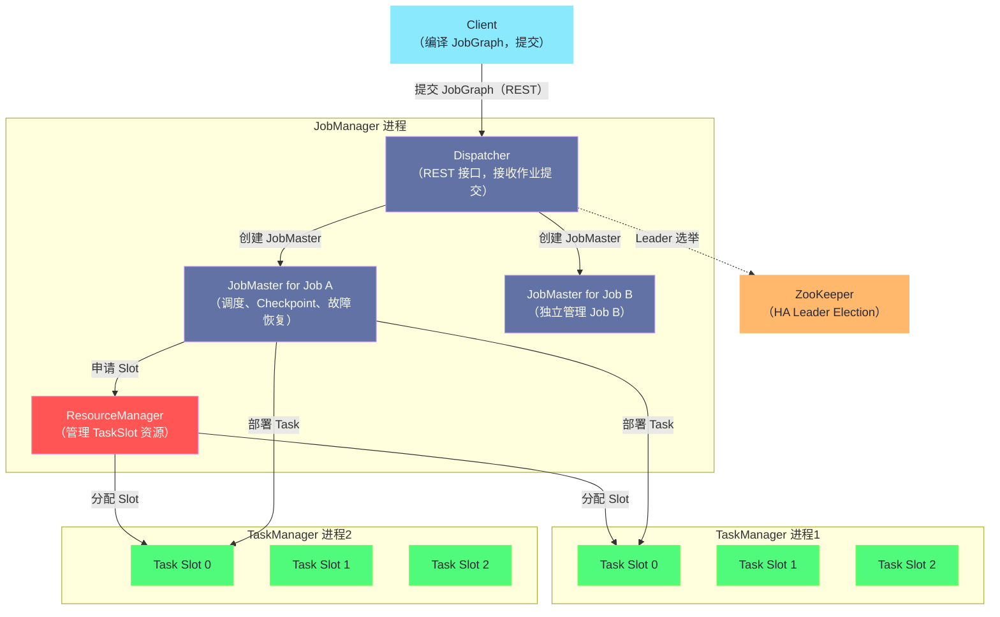
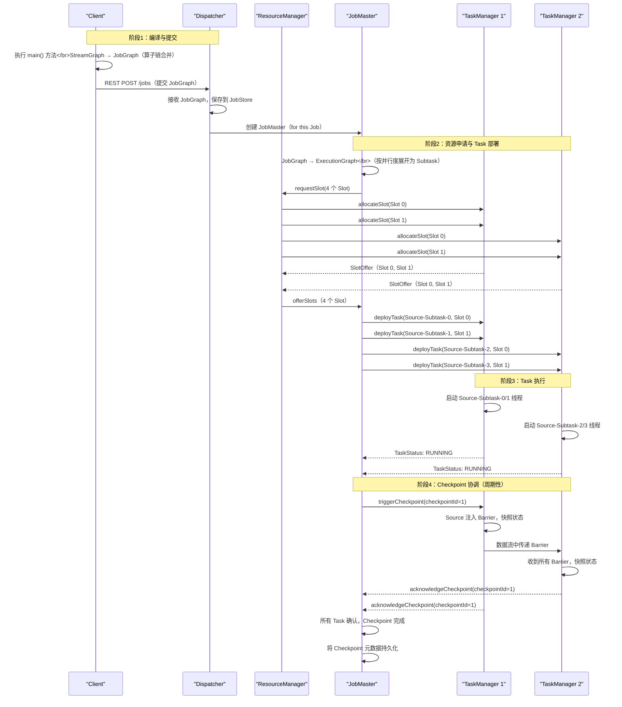

**摘要：**

理解 Flink 架构是深入调优和排障的前提。Flink 的进程模型乍看简单——JobManager 和 TaskManager——但当你真正深入时会发现，JobManager 内部由 Dispatcher、ResourceManager、JobMaster 三个相互协作的组件构成，每个组件职责边界清晰、生命周期各异。TaskManager 是真正的计算执行者，其 Task Slot 机制既是资源隔离的手段，又是决定集群并发能力的关键参数。更进一步，算子链（Operator Chain）这一编译期优化将多个算子合并在同一线程执行，直接影响吞吐量与延迟之间的权衡。本文从一次完整的作业提交过程出发，逐层剥开 Flink 执行模型的每一个设计决策，阐明每个设计背后的工程权衡。

---

## 第 1 章 为什么需要理解 Flink 的架构

### 1.1 架构知识的实际工程价值

很多 Flink 工程师能写出一个跑通的流处理作业，但当作业出现性能问题时却无从下手——`taskmanager.numberOfTaskSlots` 应该设多少？并行度为什么不能任意调大？为什么加了一个 `keyBy` 之后作业的吞吐量反而下降了？算子链合并到底省了什么开销？

这些问题的答案都藏在 Flink 的架构设计中。架构知识不是面试的装饰品，它是你在面对具体工程问题时做出正确判断的基础。

本文的目标是：读完之后，你能够：
1. 理解一次作业提交从 Client 到 JobManager 到 TaskManager 的完整路径
2. 解释 Dispatcher、ResourceManager、JobMaster 各自的职责，以及为什么要这样分层
3. 正确理解 Task Slot 的语义，能够为生产集群做合理的资源规划
4. 理解算子链的合并条件与代价，能够在正确的场景下选择禁用链合并

### 1.2 Flink 进程架构的三层模型

Flink 的进程架构可以归纳为三层：

**第一层：Client（客户端）**

Client 不是 Flink 集群的一部分，它是作业的编译和提交入口。用户的 Flink 程序（`main()` 方法）在 Client 端执行，`StreamExecutionEnvironment.execute()` 调用触发整个编译和提交过程：
1. 将用户的 DataStream API 调用链转换为 StreamGraph（流图）
2. 将 StreamGraph 优化为 JobGraph（作业图，包含算子链合并等优化）
3. 将 JobGraph 提交给 JobManager（通过 REST 接口）
4. 可选：等待作业完成或立即退出（attached/detached 模式）

**第二层：JobManager（作业管理进程）**

JobManager 是 Flink 集群的协调者，一个 Flink 集群有一个（或在 HA 模式下有多个）JobManager 进程。它不执行任何用户数据，只做协调工作：调度、Checkpoint 协调、故障恢复。

**第三层：TaskManager（任务执行进程）**

TaskManager 是真正的计算执行者，一个集群有 1 到 N 个 TaskManager。它接受 JobManager 下发的任务，执行用户的算子代码，管理内存和网络 Buffer，并与其他 TaskManager 交换数据。

---

## 第 2 章 JobManager：集群大脑的三组件剖析

### 2.1 JobManager 的三组件架构

JobManager 进程内部由三个职责分明的组件构成：**Dispatcher**、**ResourceManager**、**JobMaster**。很多文档把这三个组件混为一谈，用 "JobManager" 笼统代指，但在源码层面和故障排查中，理解它们的区别至关重要。



### 2.2 Dispatcher：作业的接待员

**是什么**：Dispatcher 是 JobManager 进程内对外暴露的 REST 服务入口。它监听 HTTP 端口（默认 8081），接收 Client 提交的 JobGraph，并为每个提交的作业创建一个 JobMaster 实例。

**为什么单独抽出来**：在 Flink 早期（1.5 之前），JobManager 同时承担接收作业、管理资源、执行调度等所有职责——这是一个典型的"大锁"设计，所有逻辑耦合在一起，既难扩展又难测试。从 Flink 1.5 开始，Flink 引入了 **Application Mode** 和 **Per-Job Mode** 等不同的部署模式，为了在不同模式下复用相同的内部逻辑，将"接收作业"这个职责单独抽象为 Dispatcher。

**Dispatcher 的生命周期**：Dispatcher 与 JobManager 进程同生共死，是一个长期运行的服务。它不会随着某个作业的结束而退出，只要 JobManager 进程存在，Dispatcher 就在运行。当你访问 Flink Web UI 时，看到的历史作业列表，就是 Dispatcher 维护的。

**Dispatcher 在不同部署模式下的行为差异**：

| 部署模式 | Dispatcher 行为 |
|---------|---------------|
| Session Mode | Dispatcher 在集群启动时就存在，多个作业共享同一个 Dispatcher |
| Per-Job Mode（已废弃）| 每个作业启动独立的 Flink 集群，Dispatcher 随集群启动 |
| Application Mode | Dispatcher 在集群内部直接执行用户 `main()` 方法，无需 Client 提前编译 |

### 2.3 ResourceManager：资源的调度官

**是什么**：ResourceManager 是 Flink 集群内部的资源仲裁者，负责管理 TaskSlot（计算资源的基本单元）的分配和回收。注意：**这个 ResourceManager 是 Flink 自己的，不是 YARN 的 ResourceManager**，不要混淆。

**为什么需要它**：当 JobMaster 需要资源来执行 Task 时，它不会直接向 TaskManager 申请，而是向 ResourceManager 提出"槽位请求（SlotRequest）"。ResourceManager 统一管理所有 TaskManager 注册进来的 Slot，决定将哪个 Slot 分配给哪个 JobMaster。这种集中管理的好处是：
- **资源全局视图**：ResourceManager 知道整个集群的 Slot 使用情况，可以做全局最优的资源分配
- **适配不同的底层集群**：Flink 为 YARN、Kubernetes、Standalone 分别实现了不同的 ResourceManager，对 JobMaster 屏蔽了底层差异。在 YARN 上，ResourceManager 可以向 YARN 申请新的 Container（启动新的 TaskManager）；在 Standalone 集群上，ResourceManager 只能使用已有的 TaskManager 的 Slot

**SlotRequest 的生命周期**：

```
JobMaster 需要 4 个 Slot 执行 Job A
  ↓
向 ResourceManager 发送 4 个 SlotRequest
  ↓
ResourceManager 检查是否有空闲 Slot：
  情况一：有足够空闲 Slot → 立即分配，返回 SlotOffer
  情况二：没有足够 Slot（YARN 模式）→ 向 YARN RM 申请新 Container，
          Container 启动后注册新 TaskManager，再分配 Slot
  情况三：没有足够 Slot（Standalone 模式）→ 等待，直到现有作业释放 Slot
            或超时后 Job 调度失败
  ↓
JobMaster 收到 SlotOffer，开始向对应 TaskManager 部署 Task
```

### 2.4 JobMaster：作业的执行指挥官

**是什么**：JobMaster 是 Flink 中最核心的调度组件，**每个运行中的 Flink Job 对应一个独立的 JobMaster 实例**。它负责管理单个作业的完整执行生命周期：

1. **ExecutionGraph 的生成与维护**：将 JobGraph（逻辑执行图）转换为 ExecutionGraph（物理执行图，含并行度展开），维护每个 Subtask 的执行状态（Scheduled → Deploying → Running → Finished/Failed）

2. **Slot 申请与 Task 部署**：向 ResourceManager 申请所需的 Slot，收到 SlotOffer 后向对应 TaskManager 发送 TaskDeploymentDescriptor，指示 TaskManager 启动对应的 Subtask

3. **Checkpoint 协调**：周期性地向所有 Source 算子的 Subtask 注入 Checkpoint Barrier，等待所有 Subtask 完成快照，然后将 Checkpoint 元数据持久化

4. **故障检测与恢复**：监控所有 Subtask 的心跳，当检测到 Subtask 失败时，根据配置的重启策略（RestartStrategy）决定是重启单个 Task、重启整个作业还是直接让作业失败

**JobMaster 的生命周期**：JobMaster 随着作业的提交被 Dispatcher 创建，随着作业的结束（完成/失败/取消）而销毁。这使得每个作业的执行上下文完全隔离——Job A 的 JobMaster 失败不会影响 Job B 的 JobMaster。

> [!info] 核心概念：为什么每个 Job 有独立的 JobMaster
> 将调度逻辑与单个 Job 绑定（而不是全局共享）是 Flink 1.0 到 1.5 架构演进的核心变化之一。这个设计的好处是：JobMaster 的崩溃只影响对应的一个 Job，其他 Job 的 JobMaster 和 TaskManager 继续运行。在 Flink 1.5 之前，JobManager 是单体的，任何内部错误都会导致整个集群所有作业中断。

---

## 第 3 章 TaskManager：计算执行节点的内部机制

### 3.1 TaskManager 是一个 JVM 进程

**TaskManager 是什么**：一个独立的 JVM 进程，运行在集群的工作节点上。一台物理机可以运行多个 TaskManager 进程，也可以只运行一个（更常见的生产配置）。

**TaskManager 内部的核心组件**：

- **TaskSlot**：资源隔离单元（详见 3.2）
- **Network Buffer Pool**：所有 Slot 共享的网络 Buffer 内存池，用于 Task 间的数据传输（详见原理深度专栏第 04 篇）
- **MemoryManager**：管理 Flink 托管内存（Managed Memory），用于 RocksDB 状态后端、排序、哈希等操作
- **TaskExecutor**：实际执行 Task 的组件，接受 JobMaster 的 RPC 调用，执行 Task 部署、暂停、取消等操作

### 3.2 Task Slot：资源隔离的基本单元

**是什么**：Task Slot 是 TaskManager 提供的计算资源的划分单位。一个 TaskManager 有 `taskmanager.numberOfTaskSlots` 个 Slot（默认为 1），每个 Slot 是一个独立的线程（准确说是一组线程），持有固定比例的 TaskManager 内存。

**为什么不用进程隔离，而用线程（Slot）**：进程隔离的代价很高——每个进程有独立的 JVM 实例，进程间通信需要序列化，内存无法共享。Flink 用同一个 JVM 进程内的多个 Slot（线程级别）来平衡隔离性和效率：同一 TaskManager 的多个 Slot 之间没有内存隔离（仅对 Managed Memory 做了按比例划分），但 TCP 连接和 JVM 堆可以共享，减少了资源开销。

**Slot 隔离的具体含义**：

```
一个有 3 个 Slot 的 TaskManager（16GB 堆内存 + 8GB 托管内存）：
  Slot 0：最多使用 8/3 ≈ 2.67GB 托管内存（RocksDB、排序等）
  Slot 1：最多使用 8/3 ≈ 2.67GB 托管内存
  Slot 2：最多使用 8/3 ≈ 2.67GB 托管内存

注意：JVM 堆内存是全部 3 个 Slot 共享的（不做隔离！）
这意味着：某个 Slot 中的 Task 如果有内存泄漏，
可能导致整个 TaskManager 进程 OOM，影响同 TM 上的其他 Slot
```

> [!warning] 生产避坑：Slot 数量的配置原则
> 很多人以为 Slot 数量越多越好——毕竟 Slot 越多意味着 TaskManager 可以同时运行更多 Subtask。但这个逻辑是错误的：
> - **CPU 层面**：过多的 Slot 意味着更多线程在同一 CPU 上竞争，频繁的上下文切换反而降低吞吐量
> - **内存层面**：Slot 数量增多导致每个 Slot 分配到的 Managed Memory 减少，RocksDB 状态后端性能下降
> - **生产最佳实践**：每个 Slot 对应 1-2 个 CPU 核。即如果 TaskManager 所在机器有 16 核，配置 8-16 个 Slot 是合理的范围，需要结合具体作业的 CPU 密集程度调整

### 3.3 Slot 共享（Slot Sharing）：一个违反直觉的重要优化

**是什么**：默认情况下，**同一个 Job 的不同算子的 Subtask 可以共享同一个 Slot**，这被称为 Slot Sharing（槽位共享）。

乍一看这很奇怪——一个 Slot 不是只能运行一个 Task 吗？

理解这里需要区分两个概念：
- **Task**：多个算子链（Operator Chain）合并后的执行单元，但如果两个 Task 没有链合并，它们是两个独立的 Task
- **Slot 中可以同时运行来自同一 Job 的多个 Task 的不同 Subtask**（一个 Pipeline 的各个阶段在同一 Slot 中端到端运行）

**用一个具体例子说明**：

假设有一个 Flink Job：`Source → Map → KeyBy → Window → Sink`，并行度为 4，集群有 2 个 TaskManager，每个 2 个 Slot（共 4 个 Slot）。

不使用 Slot Sharing（禁用）：
```
Source-SubTask-0  → Slot 0 on TM1
Map-SubTask-0     → Slot 1 on TM1
Window-SubTask-0  → Slot 0 on TM2
Sink-SubTask-0    → Slot 1 on TM2
```
这意味着 4 个并行度需要 4 × 5 = 20 个 Slot，而我们只有 4 个，根本运行不起来！

使用 Slot Sharing（默认启用）：
```
Slot 0 on TM1：Source-SubTask-0 + Map-SubTask-0 + Window-SubTask-0 + Sink-SubTask-0
Slot 1 on TM1：Source-SubTask-1 + Map-SubTask-1 + Window-SubTask-1 + Sink-SubTask-1
Slot 0 on TM2：Source-SubTask-2 + Map-SubTask-2 + Window-SubTask-2 + Sink-SubTask-2
Slot 1 on TM2：Source-SubTask-3 + Map-SubTask-3 + Window-SubTask-3 + Sink-SubTask-3
```
每个 Slot 中包含整个 Pipeline 的一个并行实例，4 个 Slot 正好能运行并行度为 4 的作业！

**Slot Sharing 的两个核心好处**：

1. **Slot 数量 = 作业最大并行度**：无论 Job 有多少个算子，只需要 Slot 数量 ≥ 最大并行度即可运行。不需要手动计算"这个 Job 需要多少个 Slot"

2. **负载均衡**：轻量级算子（Source、Filter）和重量级算子（Window、Join）分布在同一个 Slot 中，重量级算子的 CPU 高时，轻量级算子的线程处于 IO 等待，两者自然错峰，提高 CPU 利用率

---

## 第 4 章 算子链（Operator Chain）：编译期的关键优化

### 4.1 为什么需要算子链

在没有算子链的情况下，两个相邻算子（如 `map` 和 `filter`）之间的数据传递流程是：
1. 上游 `map` 算子处理完一条记录
2. 将结果序列化（对象 → 字节数组）
3. 放入网络 Buffer
4. 下游 `filter` 算子的线程从 Buffer 读取数据
5. 反序列化（字节数组 → 对象）
6. 执行 filter 逻辑

在同一个 TaskManager 节点内部（甚至同一个 Slot 内），这种序列化 + Buffer 传递的开销是完全不必要的——两个算子完全可以在同一个线程中直接进行方法调用，无需任何序列化。

**算子链（Operator Chain）**正是这个优化：将多个满足条件的相邻算子合并到同一个 Task 中，在同一个线程内以链式方法调用（method call）的方式传递数据，消除了序列化、Buffer、线程切换的所有开销。

### 4.2 算子链的合并条件

不是所有相邻算子都可以链合并，需要同时满足以下条件：

**条件一：相同的并行度**。如果 `map` 算子并行度为 4，`filter` 算子并行度也为 4，则对应的 Subtask 可以一一对应链合并。如果并行度不同，数据需要重新分区（Partition），必然需要网络传输，无法链合并。

**条件二：相同的 Slot 分组**（SlotSharingGroup）。只有在同一个 SlotSharingGroup 中的算子才能链合并。

**条件三：上游算子的输出类型是 FORWARD**。上游算子必须是将数据直接转发给下游的同一 Subtask（FORWARD 分区策略），而不是 KeyBy（Hash 分区）、Rebalance（轮询）等需要数据重分布的操作。

**条件四：没有被显式禁用链合并**。算子或作业级别没有调用 `disableChaining()` 或 `startNewChain()`。

**一个典型的链合并示例**：

```
原始算子序列（并行度均为 4）：
Source(4) → FlatMap(4) → Filter(4) → keyBy → Window(4) → Map(4) → Sink(4)

可以链合并的部分：
  Chain 1: Source + FlatMap + Filter（三者并行度相同，FORWARD 传递）
  [keyBy 处需要数据重分区，不能链合并，形成 boundary]
  Chain 2: Window + Map + Sink（三者并行度相同，FORWARD 传递）

最终生成的 Task：
  Task 1（Chain 1）: Source-FlatMap-Filter，并行度 4 → 4 个 Subtask
  Task 2（Chain 2）: Window-Map-Sink，并行度 4 → 4 个 Subtask
  Task 1 和 Task 2 之间通过网络传输（因为 keyBy 需要重分区）
```

### 4.3 算子链的影响与控制

**算子链对性能的影响**：
- **吞吐量提升**：消除了序列化/反序列化开销，典型提升 20%~50%
- **延迟降低**：数据在 Chain 内以方法调用传递，延迟从微秒（Buffer 等待）降到纳秒（直接方法调用）
- **线程数减少**：整个 Chain 只需一个线程，减少了线程调度开销

**何时应该禁用算子链**：

禁用算子链通常是调试或特定调优场景的需要：

```java
// 场景一：定位性能瓶颈——禁用链合并，让每个算子都有独立的 Metrics
env.disableOperatorChaining();  // 全局禁用

// 场景二：某个特定算子资源消耗极大，希望它独占一个 Slot
// 通过 startNewChain() 让 Window 算子开始新的 Chain
stream
    .map(...)            // Chain A 的一部分
    .keyBy(...)          // 数据重分区，自然断链
    .window(...)
    .apply(expensiveFunc)
    .startNewChain()     // 在此处强制开始新 Chain
    .map(...)            // Chain B 从这里开始
    .sink(...);
```

---

## 第 5 章 一次完整的作业提交与执行过程

### 5.1 端到端的作业提交流程

将前面所有知识串联起来，梳理一次完整的 Flink 作业提交流程：



### 5.2 ExecutionGraph 的状态机

JobMaster 在执行过程中维护每个 Subtask 的状态，这是一个有限状态机：

```
CREATED
  ↓ (资源申请完成，开始部署)
SCHEDULED
  ↓ (TaskDeploymentDescriptor 发送给 TM)
DEPLOYING
  ↓ (TM 确认 Task 已启动)
RUNNING
  ↓ (Task 处理完所有数据)            ↓ (Task 出现异常)
FINISHED                            FAILED
                                      ↓ (根据重启策略)
                                    CANCELING → CANCELED
```

**当某个 Subtask 进入 FAILED 状态时**，JobMaster 根据 `RestartStrategy` 决定如何处理：

- **NoRestartStrategy**：直接让整个 Job 失败
- **FixedDelayRestartStrategy**：等待固定延迟后，重启整个 Job（从最近的 Checkpoint 恢复），最多重启 N 次
- **ExponentialDelayRestartStrategy**：指数退避重启，每次失败后等待时间翻倍
- **FailureRateRestartStrategy**：在给定时间窗口内，失败次数不超过阈值则重启，超过则让 Job 失败

---

## 第 6 章 Flink HA 机制：JobManager 的高可用

### 6.1 HA 架构的必要性

在生产环境中，JobManager 是整个 Flink 集群的"大脑"——如果 JobManager 进程挂掉，所有正在运行的 Job 都会暂停（因为 JobMaster 也在 JobManager 进程中）。JobManager 的高可用（HA）因此是生产部署的必要条件。

### 6.2 基于 ZooKeeper 的 HA 机制

Flink 通过 [[ZooKeeper]] 实现 JobManager 的 Leader 选举：

```
启动多个 JobManager 进程（通常 2-3 个）
  ↓
每个 JM 进程向 ZooKeeper 注册候选节点
  ↓
ZooKeeper 通过临时节点（Ephemeral Node）完成 Leader 选举
  ↓
Leader JM：承担 Dispatcher、ResourceManager、JobMaster 的所有职责
Standby JM：处于待命状态，不接受任何请求
  ↓
Leader JM 宕机时：
  ZooKeeper 检测到临时节点消失（Leader 死亡）
  Standby JM 参与新一轮选举，成为新 Leader
  新 Leader 从持久化存储（HDFS/S3）恢复 JobGraph 和 Checkpoint 元数据
  重新创建 JobMaster，从最近的 Checkpoint 恢复作业执行
```

**关键的持久化组件**：

Flink HA 需要一个持久化的高可用存储（HAStore），用于保存：
- JobGraph（作业的逻辑执行图）
- Checkpoint 的元数据（指向 HDFS/S3 上的状态文件路径）

```yaml
# flink-conf.yaml：开启基于 ZooKeeper 的 HA
high-availability: zookeeper
high-availability.zookeeper.quorum: zk1:2181,zk2:2181,zk3:2181
high-availability.storageDir: hdfs:///flink/ha/
high-availability.zookeeper.path.root: /flink
```

---

## 小结

本文从 Flink 进程架构的三层模型出发，深入剖析了每个组件的设计原因和职责边界：

- **Dispatcher**：作业提交的 REST 入口，长期运行，与 Job 生命周期解耦
- **ResourceManager**：Slot 资源的统一仲裁者，适配不同底层集群（YARN/K8s/Standalone）
- **JobMaster**：单个 Job 的调度指挥官，管理 ExecutionGraph 和 Checkpoint，随 Job 结束而销毁
- **TaskManager/TaskSlot**：计算执行节点，Slot 是资源隔离的基本单元，Slot Sharing 允许同 Job 不同算子的 Subtask 共享 Slot，大幅降低 Slot 需求数量
- **算子链（Operator Chain）**：编译期优化，消除相邻算子之间的序列化和线程切换开销，提升吞吐量 20%~50%

这些架构知识的实际应用价值将在后续文章中逐步体现：内存配置（第 03 篇）需要理解 TM 的内存分区，网络反压（第 04 篇）需要理解 Task 间的数据传输路径，Checkpoint 优化（第 06 篇）需要理解 JobMaster 的 Checkpoint 协调逻辑。

下一篇 [[02 从 StreamGraph 到 JobGraph 再到 ExecutionGraph]] 将深入 Flink 的编译流水线，解析一段用户代码是如何一步步被转化为集群上真正运行的 ExecutionGraph 的。


> [!note] 思考题
> 1. Flink 的 JobManager 由三个组件构成：Dispatcher、ResourceManager 和 JobMaster。其中 JobMaster 是每个作业独有的，而 Dispatcher 和 ResourceManager 是整个集群共享的。如果 JobMaster 宕机（比如在一次 Checkpoint 过程中），整个作业会失败吗？HA 模式下 JobMaster 的恢复机制是什么？
> 2. TaskManager 上的每个 Task Slot 是一个资源单元，Flink 保证同一个 Job 的不同 SubTask 可以共享同一个 Slot（通过 SlotSharingGroup）。这个设计使得一个拥有 N 个 Task Slot 的 TaskManager 可以并行运行 N 个完整的 Pipeline 副本。但 Slot 共享意味着不同算子的 SubTask 在同一个 JVM 线程中通过对象传递（非序列化）通信。这种"本地优化"会在哪些情况下变成问题（如不同算子的内存需求差异悬殊）？
> 3. Flink 的执行模型是 Push 驱动的（上游 Task 将数据推送到下游 Task 的 Buffer），而 Spark 的执行模型是 Pull 驱动的（Reducer 从 Mapper 拉取数据）。两种模式在背压传导、故障恢复和延迟特性上各有什么优缺点？在什么具体场景下，Pull 模型比 Push 模型更有优势？