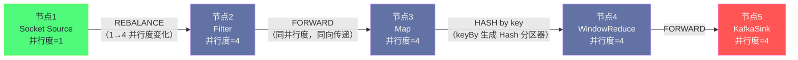
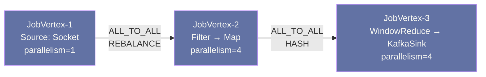
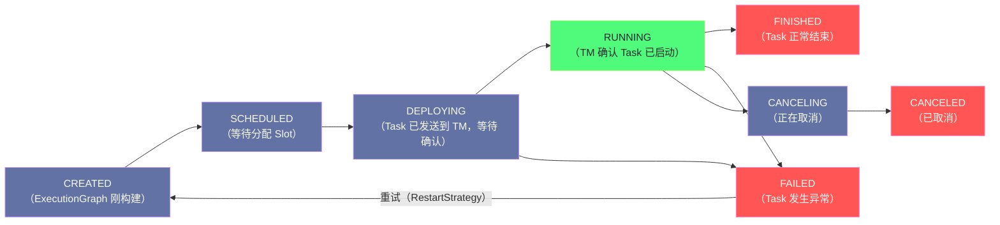

**摘要：**

用户写下一段 `DataStream` API 代码到它真正在 TaskManager 上被执行，中间经历了一条完整的编译流水线：`StreamGraph → JobGraph → ExecutionGraph`。每一次转换都代表着一次抽象层次的降低和一次具体优化的落地。`StreamGraph` 是用户意图的忠实翻译，完整保留了用户的每一个算子；`JobGraph` 完成了算子链（Operator Chain）合并等编译期优化，将多个算子合并为一个 Task，是提交给 JobManager 的"作业描述书"；`ExecutionGraph` 是真正的物理执行图，按并行度将每个 JobVertex 展开为多个 ExecutionVertex（Subtask），每个 ExecutionVertex 都有完整的状态机，是 JobMaster 调度和监控的基本单元。理解这三张图的数据结构和转换过程，是你能够解释"为什么算子链能提升性能"、"并行度是在哪里生效的"、"JobMaster 如何调度 Task"等深层问题的基础。

---

## 第 1 章 为什么需要三张图

### 1.1 从用户代码到集群执行的"语义鸿沟"

用户编写 Flink 程序时，表达的是**计算逻辑**：这个数据流经过 map 转换，然后按 userId keyBy，再做 5 分钟的窗口聚合，最后写入 Kafka。这是一个逻辑层面的描述，完全不涉及"这段代码在哪台机器上跑"、"用几个线程"、"算子之间怎么传数据"等物理细节。

而 TaskManager 执行的是**物理任务**：在节点 A 的 Slot 0 上运行 Subtask-0（包含 Source+Map 两个链合并的算子），接受来自节点 B 的 Subtask-1 通过网络发来的数据，写入本地的 NetworkBuffer，触发窗口计算，将结果序列化后发往节点 C 的 KafkaSink Subtask。

在逻辑意图和物理执行之间，需要一系列有序的转换步骤，每一步专注于解决一类特定的问题：

- **StreamGraph**：忠实翻译用户代码，保留完整的逻辑结构
- **JobGraph**：完成编译期优化（算子链合并），生成提交给 JobManager 的标准描述
- **ExecutionGraph**：将逻辑 Job 按并行度展开为物理任务，生成可被调度的执行单元

这种分层设计是编译器领域经典的 IR（Intermediate Representation，中间表示）思路——每一层 IR 只关注一类变换，保持职责单一，便于独立优化和测试。

---

## 第 2 章 StreamGraph：用户意图的忠实翻译

### 2.1 StreamGraph 是什么

`StreamGraph` 是 Flink 编译流水线的第一张图，在 Client 端（`StreamExecutionEnvironment.execute()` 调用时）生成，完全在用户的 JVM 进程内构建，无需任何网络通信。

它直接对应用户的 DataStream API 调用序列：用户每调用一次 `map()`、`filter()`、`keyBy()`，就在 StreamGraph 中增加一个 `StreamNode`（流节点）和对应的 `StreamEdge`（流边）。

**StreamGraph 的核心数据结构**：

```
StreamGraph
  ├── Map<Integer, StreamNode>    nodeMap       // 所有节点，key 是节点 ID
  └── 其他全局配置（执行模式、Checkpoint 配置等）

StreamNode
  ├── int                  id                  // 唯一 ID
  ├── String               operatorName        // 算子名称（如 "Map", "Source: Socket"）
  ├── StreamOperator<?>    operator            // 算子的实际实现对象
  ├── int                  parallelism         // 算子并行度
  ├── List<StreamEdge>     inEdges             // 入边列表
  └── List<StreamEdge>     outEdges            // 出边列表

StreamEdge
  ├── int                  sourceId            // 上游节点 ID
  ├── int                  targetId            // 下游节点 ID
  ├── StreamPartitioner<?> partitioner         // 分区策略（Forward/Hash/Rebalance 等）
  └── List<String>         selectedNames       // 侧输出（SideOutput）标签
```

### 2.2 一段代码如何变成 StreamGraph

用一个具体的程序说明：

```java
DataStream<String> source = env.socketTextStream("localhost", 9999);     // 节点 ID: 1
DataStream<String> filtered = source.filter(s -> !s.isEmpty());          // 节点 ID: 2
DataStream<String> mapped = filtered.map(String::toUpperCase);            // 节点 ID: 3
KeyedStream<String, String> keyed = mapped.keyBy(s -> s);                // keyBy 不是独立算子
DataStream<String> windowed = keyed.window(...)                           // 节点 ID: 4
                                   .reduce((a, b) -> a + b);
windowed.addSink(new KafkaSink(...));                                     // 节点 ID: 5
```

对应生成的 StreamGraph：



**几个关键点**：

1. `keyBy` **不是一个独立的 StreamNode**。`keyBy` 只影响 `StreamEdge` 的分区器类型（从 Forward 变为 Hash），它本身不产生数据变换，所以不需要独立节点。

2. 并行度不一致时（Source 的 `parallelism=1`，下游 `parallelism=4`），`StreamEdge` 的分区策略自动变为 `REBALANCE`（轮询分发），确保负载均衡。

3. 并行度相同且没有 `keyBy` 的相邻算子之间，默认使用 `FORWARD` 策略——数据直接从 Subtask-i 发往下游 Subtask-i，不需要 Shuffle。这正是算子链合并的前提条件。

### 2.3 StreamGraph 的局限性：它还太"原始"

StreamGraph 保留了用户代码的全部细节，但也意味着它包含了大量可以被优化的冗余结构——每个算子都是一个独立节点，即使两个相邻算子完全可以合并在同一个线程中执行（如上图中的 `Filter → Map`，两者并行度相同且 FORWARD 传递）。

如果直接将 StreamGraph 提交给 JobManager，每两个算子之间都需要序列化和网络 Buffer，这是极大的性能浪费。JobGraph 的主要任务就是完成这个优化。

---

## 第 3 章 JobGraph：算子链合并与提交标准化

### 3.1 JobGraph 是什么

`JobGraph` 是 StreamGraph 经过优化后生成的第二张图，是提交给 JobManager（Dispatcher）的标准格式。`JobGraph` 由以下核心元素构成：

```
JobGraph
  ├── JobID                   jobId               // 全局唯一作业 ID
  ├── String                  name                // 作业名称
  ├── Map<JobVertexID, JobVertex> taskVertices    // 合并后的顶点（Task）
  ├── List<JobEdge>           edges               // Task 之间的边（需要网络传输）
  └── 配置：Checkpoint、ClassPath、JAR 路径等

JobVertex（对应一个 Task，可能包含多个原始算子）
  ├── JobVertexID             id
  ├── String                  name                // 如 "Source: Socket -> Filter -> Map"（链名称）
  ├── int                     parallelism
  ├── List<OperatorInfo>      operators           // 链中包含的所有原始算子
  └── List<IntermediateDataSet> producedDataSets  // 输出的数据集（连接到下游 JobEdge）

JobEdge（对应一次需要网络传输的数据交换）
  ├── DistributionPattern     distributionPattern // POINTWISE（FORWARD）或 ALL_TO_ALL（Shuffle）
  └── IntermediateDataSet     source              // 上游数据集
```

### 3.2 算子链合并：StreamGraph → JobGraph 的核心转换

算子链（Operator Chain）合并是 StreamGraph → JobGraph 转换中最重要的优化，将满足条件的相邻算子合并到同一个 `JobVertex` 中。

**合并判断算法**（简化版）：

```
对于 StreamGraph 中的每个 StreamNode N：
  如果 N 可以成为一个新 Chain 的起点：
    从 N 开始，沿着输出边递归探索：
      对于每条出边 E（连接到下游节点 M）：
        检查以下条件是否都满足：
          1. E 的分区策略是 FORWARD（不是 Hash/Rebalance/Broadcast）
          2. N 和 M 的并行度相同
          3. N 和 M 在同一个 SlotSharingGroup
          4. M 没有被配置为 Chain 的起点（startNewChain）
          5. M 的入度为 1（只有一个上游，否则合并后上游数据来自多个 Chain 会导致问题）
          6. 整个作业没有禁用 Chain（disableOperatorChaining）
        
        如果所有条件都满足：将 M 合并到 N 的 Chain 中，继续从 M 探索
        否则：M 成为一个新 Chain 的起点，N 与 M 之间形成 JobEdge
```

**对上面的例子运行合并算法**：

```
StreamGraph: Source(1) → Filter(4) → Map(4) → WindowReduce(4) → KafkaSink(4)
              REBALANCE    FORWARD     HASH       FORWARD

合并过程：
  Source(1)：
    → Filter 的边是 REBALANCE（并行度不同：1→4）❌ 不满足条件
    → Source 单独成为 JobVertex-1

  Filter(4)：
    → Map 的边是 FORWARD，并行度相同(4=4) ✅ 可以合并
    → Map 合并进 Filter 的 Chain
    → Map → WindowReduce 的边是 HASH（keyBy）❌ 不满足条件
    → Filter+Map 成为 JobVertex-2，名称："Filter -> Map"

  WindowReduce(4)：
    → KafkaSink 的边是 FORWARD，并行度相同(4=4) ✅ 可以合并
    → KafkaSink 合并进 WindowReduce 的 Chain
    → WindowReduce+KafkaSink 成为 JobVertex-3，名称："WindowReduce -> KafkaSink"

最终 JobGraph：
  JobVertex-1（Source）
    ↓ [ALL_TO_ALL，REBALANCE]
  JobVertex-2（Filter -> Map）
    ↓ [ALL_TO_ALL，HASH by key]
  JobVertex-3（WindowReduce -> KafkaSink）
```



**算子链合并带来的性能收益**：

原来 Filter → Map 之间需要：
1. Filter 输出：序列化对象 → 字节数组（耗时：~100ns/条）
2. 写入 NetworkBuffer（可能引发 Buffer 满等待）
3. Map 线程从 Buffer 读取数据
4. 反序列化字节数组 → 对象（耗时：~100ns/条）

合并后 Filter → Map 之间：
1. Filter 调用 `collector.collect(record)`
2. `collect` 内部直接调用 Map 的 `processElement(record)` 方法
3. **总开销：一次方法调用，耗时 < 10ns**

在一个每秒处理 100 万条记录的作业中，序列化开销约 0.2 秒/秒（200ms/s）——即消耗了 20% 的 CPU 在序列化上。合并算子链可以将这部分开销降低至接近零。

### 3.3 JobGraph 中的其他优化

除算子链合并外，StreamGraph → JobGraph 转换还完成：

**JAR 文件打包**：将用户代码所在的 JAR 文件路径附加到 JobGraph，提交时 Client 将 JAR 上传到 JobManager，JobManager 再分发给 TaskManager 用于类加载。

**Checkpoint 配置的序列化**：将 `CheckpointConfig`（Checkpoint 间隔、超时、并发数等）序列化后嵌入 JobGraph，JobMaster 从中读取配置后负责触发 Checkpoint。

**用户自定义分区器的配置**：如果用户自定义了 `Partitioner`（通过 `partitionCustom()`），分区器对象被序列化后附着在对应的 `JobEdge` 上。

---

## 第 4 章 ExecutionGraph：物理展开与状态机

### 4.1 JobGraph 的局限：它还只是"逻辑"的

`JobGraph` 中的 `JobVertex` 有 `parallelism` 属性，表示这个 Task 应该运行多少个并发实例。但 JobGraph 本身不包含"哪个 Subtask 运行在哪个 TaskManager 的哪个 Slot 上"等物理信息——这是 ExecutionGraph 的职责。

### 4.2 ExecutionGraph 的数据结构

`ExecutionGraph` 在 **JobMaster** 内部构建（收到 JobGraph 后），是 Flink 最复杂的数据结构之一：

```
ExecutionGraph
  ├── Map<JobVertexID, ExecutionJobVertex>   tasks          // 逻辑 JobVertex 的包装
  └── 全局状态：CREATED/RUNNING/FAILING/FAILED/CANCELLING/CANCELLED/FINISHED

ExecutionJobVertex（对应一个 JobVertex，含多个并行实例）
  ├── JobVertex                    jobVertex               // 对应的 JobVertex
  ├── ExecutionVertex[]            taskVertices            // 所有并行实例
  └── IntermediateResult[]         producedDataSets        // 此 JobVertex 的输出

ExecutionVertex（对应一个 Subtask，最细粒度的调度单元）
  ├── int                          subTaskIndex            // 并行实例编号（0, 1, 2...）
  ├── Execution                    currentExecution        // 当前执行实例
  └── List<InputChannel>           inputChannels           // 输入通道（来自上游的数据）

Execution（一次具体的 Subtask 执行尝试，失败重试时会创建新 Execution）
  ├── ExecutionAttemptID           attemptId               // 唯一 ID（含重试次数）
  ├── ExecutionState               state                   // 当前状态（状态机）
  ├── LogicalSlot                  assignedResource        // 分配到的 Slot
  └── TaskDeploymentDescriptor     taskDeploymentDescriptor // 部署描述符
```

### 4.3 从 JobVertex 到 ExecutionVertex：并行度展开

`JobGraph → ExecutionGraph` 的核心转换是**按并行度展开**：每个 `JobVertex`（parallelism=N）被展开为 N 个 `ExecutionVertex`，每个 `ExecutionVertex` 对应一个并发执行的 Subtask。

以上面的例子（Source parallelism=1，其余 parallelism=4）为例：

```
ExecutionGraph 的展开结果：

ExecutionJobVertex for JobVertex-1（Source，parallelism=1）
  └── ExecutionVertex[0]   ← 只有一个 Subtask

ExecutionJobVertex for JobVertex-2（Filter->Map，parallelism=4）
  ├── ExecutionVertex[0]
  ├── ExecutionVertex[1]
  ├── ExecutionVertex[2]
  └── ExecutionVertex[3]

ExecutionJobVertex for JobVertex-3（WindowReduce->KafkaSink，parallelism=4）
  ├── ExecutionVertex[0]
  ├── ExecutionVertex[1]
  ├── ExecutionVertex[2]
  └── ExecutionVertex[3]

总计：1 + 4 + 4 = 9 个 ExecutionVertex（Subtask）
```

除了展开 ExecutionVertex 之外，ExecutionGraph 还明确了**数据传输路径**：

- JobVertex-1[0] → JobVertex-2[0..3]：ALL_TO_ALL（REBALANCE），Source Subtask-0 的数据会被分发给 Filter->Map 的 4 个 Subtask
- JobVertex-2[i] → JobVertex-3[j]：根据 Hash 分区，JobVertex-2 的某个 Subtask 的某条数据会精确发往 JobVertex-3 中 Key 对应的 Subtask

### 4.4 ExecutionVertex 的状态机

每个 `ExecutionVertex` 内部维护一个 `Execution` 对象，`Execution` 有完整的状态机：



**状态转换的触发者**：
- `CREATED → SCHEDULED`：JobMaster 的调度器（Scheduler）决定调度某个 Task
- `SCHEDULED → DEPLOYING`：JobMaster 向 ResourceManager 申请到 Slot，并向 TaskManager 发送 `TaskDeploymentDescriptor`
- `DEPLOYING → RUNNING`：TaskManager 确认 Task 已成功启动（通过 RPC 回调 `updateTaskExecutionState`）
- `RUNNING → FINISHED/FAILED`：TaskManager 的 Task 线程执行完成或抛出异常后回调 JobMaster
- `FAILED → CREATED`：JobMaster 根据 `RestartStrategy` 决定重试，创建新的 `Execution` 对象（attemptId + 1）

### 4.5 TaskDeploymentDescriptor：Task 部署的完整说明书

当 JobMaster 向 TaskManager 发送 Task 部署请求时，使用 `TaskDeploymentDescriptor`（TDD）作为"说明书"，包含 TaskManager 启动该 Subtask 所需的一切信息：

```
TaskDeploymentDescriptor
  ├── JobID, JobType, JobName        // 所属作业信息
  ├── ExecutionAttemptID             // 本次执行的唯一 ID
  ├── TaskInfo                       // Task 名称、并行度、当前 Subtask 编号
  ├── SerializedValue<JobInformation> // Job 级别的配置（序列化的 JobGraph 信息）
  ├── SerializedValue<TaskInformation> // Task 级别配置（算子 class、算子配置、状态描述符）
  ├── InputGateDeploymentDescriptor[] // 输入通道描述（从哪些上游 Subtask 接收数据）
  ├── ResultPartitionDeploymentDescriptor[] // 输出分区描述（向哪些下游 Subtask 发送数据）
  └── TaskStateHandles                // 状态句柄（Checkpoint 恢复时使用）
```

`TaskManager` 收到 TDD 后，使用 `ClassLoader` 加载算子类，按照 TDD 中的配置初始化算子，建立与上下游 Subtask 的网络连接，然后启动 Task 执行线程。

---

## 第 5 章 三张图的对比总结

### 5.1 核心属性对比

| 维度 | StreamGraph | JobGraph | ExecutionGraph |
|------|------------|---------|----------------|
| **生成位置** | Client JVM（用户代码执行时）| Client JVM（`execute()` 调用时）| JobMaster JVM（JobManager 端）|
| **核心元素** | StreamNode + StreamEdge | JobVertex + JobEdge | ExecutionJobVertex + ExecutionVertex + Execution |
| **算子粒度** | 每个算子一个节点 | 链合并后的 Task 一个节点 | 每个并行实例一个节点 |
| **并行度** | 每个 StreamNode 有 parallelism 属性 | 每个 JobVertex 有 parallelism 属性 | 已按并行度展开为物理实例 |
| **网络传输** | 由 StreamEdge 的 Partitioner 描述 | 由 JobEdge 的 DistributionPattern 描述 | 已明确哪个 Subtask 向哪个 Subtask 发数据 |
| **状态机** | 无 | 无 | 每个 Execution 有完整状态机 |
| **持久化** | 不持久化 | 持久化到 HA Store | 运行时内存中维护，不持久化 |

### 5.2 为什么 ExecutionGraph 不持久化

这是一个值得深思的设计决策。`JobGraph` 被持久化到 HA Store（HDFS 或 ZooKeeper），而 `ExecutionGraph` 只存在于 JobMaster 的内存中，不做持久化。

原因：`ExecutionGraph` 包含大量运行时状态（哪个 Subtask 在哪个 TM 上、当前的 InputChannel 地址等），这些信息与当前的集群拓扑强绑定——集群节点变化时（如某个 TM 宕机），这些信息就过期了，持久化也没有意义。

当 JobMaster 发生 Failover（切换到 Standby JM）时，新的 JobMaster 从 HA Store 读取 `JobGraph`，**重新构建 ExecutionGraph**，再重新调度所有 Task——这相当于整个作业从最近的 Checkpoint 重启。这比持久化 ExecutionGraph 更简单、更健壮。

### 5.3 调试视角：如何查看三张图

**查看 StreamGraph 和 JobGraph**：

Flink Web UI 的 "Overview" → 点击某个 Job → "Plan" 标签页，显示的是 **JobGraph**（已经完成算子链合并）。你看到的每个框对应一个 `JobVertex`，框内的 `->` 分隔的算子列表说明该 JobVertex 包含了哪些链合并的算子。

**查看 ExecutionGraph**：

同一界面点击某个 JobVertex 的框，可以看到该 JobVertex 展开的所有 Subtask（ExecutionVertex）的运行状态、所在 TaskManager、开始时间等信息。

**通过 REST API 获取详细信息**：

```bash
# 获取 Job 的 ExecutionGraph 概览
curl http://jobmanager:8081/jobs/<jobId>

# 获取某个 JobVertex 的所有 Subtask 的详情
curl http://jobmanager:8081/jobs/<jobId>/vertices/<vertexId>

# 获取某个 Subtask 的完整运行状态
curl http://jobmanager:8081/jobs/<jobId>/vertices/<vertexId>/subtasks/<subtaskIndex>
```

---

## 第 6 章 生产中与三张图相关的常见问题

### 6.1 作业运行正常但 Plan 图显示的算子数少于代码中的算子数

这是算子链合并的正常结果。如果你在代码中写了 `Source → Filter → Map → keyBy → Window → Sink`，但 Web UI 上只看到 3 个框（Source、Filter->Map、Window->Sink），说明 Flink 完成了算子链合并。

**如何查看合并了哪些算子**：点击 Job 的算子框，鼠标悬停在每个框上，会显示该 JobVertex 包含的所有原始算子名称。

### 6.2 作业提交失败：`java.io.InvalidClassException` 或 `ClassNotFoundException`

这类错误通常出现在 TDD（TaskDeploymentDescriptor）被 TaskManager 反序列化时，说明算子类无法被加载。

常见原因：
1. **JAR 未正确上传**：检查 Client 端的 JAR 路径配置，确保 Flink 能找到并上传用户 JAR
2. **类路径冲突**：用户 JAR 和集群 `lib/` 中存在同名但版本不同的类，ClassLoader 加载了错误版本
3. **序列化不兼容**：作业代码修改后，Checkpoint 中的旧版本状态对象无法被新版本代码反序列化（需要版本兼容处理或清除 Checkpoint）

### 6.3 修改并行度后，为什么需要从 Savepoint 恢复而不是直接修改

当你想将某个算子的并行度从 4 改为 8 时，ExecutionGraph 中的 ExecutionVertex 数量会从 4 个变为 8 个，但原来 4 个 Subtask 的状态（保存在 Checkpoint/Savepoint 中）需要按照某种规则重新分配给 8 个新 Subtask。

Flink 在 Savepoint 恢复时支持 **State Redistribution**（状态重分配）：
- **Keyed State**：根据 Key 的 Hash 值，将 Key 从原来的 4 个 Subtask 重新分配到 8 个 Subtask（Key 范围的重新划分）
- **Operator State**（List State）：将旧 Subtask 的 State List 合并，再按轮询或均匀分布重新分配给新 Subtask

这个过程在 ExecutionGraph 生成时完成，由 `StateAssignmentOperation` 负责。理解这个机制有助于你在需要扩缩容时做出正确的操作（必须通过 Savepoint，不能直接重启）。

---

## 小结

Flink 的三张图构成了一条完整的编译流水线，每张图专注于解决一类问题：

**StreamGraph**：用户代码的直接翻译，保留完整逻辑结构，每个算子独立为节点，生成于 Client JVM。

**JobGraph**：编译期优化的产物，核心是算子链合并——将满足条件的相邻算子合并为一个 Task，消除不必要的序列化和线程切换开销，提升吞吐量 20%~50%。JobGraph 被持久化到 HA Store，是 HA 恢复的基础。

**ExecutionGraph**：物理执行图，将 JobVertex 按并行度展开为 ExecutionVertex，明确每个 Subtask 的状态机、输入输出通道、所在 Slot。是 JobMaster 调度、Checkpoint 协调、故障恢复的核心数据结构。

这三张图的设计体现了 Flink 分层架构的核心思想：**逻辑与物理分离，每一层只做一类变换**。这种设计不仅使得优化逻辑清晰可维护，也使得不同的部署场景（本地/YARN/K8s）可以共享相同的 StreamGraph 和 JobGraph，只在 ExecutionGraph 层根据集群环境做差异化调度。

下一篇 [[03 Flink 内存模型深度解析]] 将深入 TaskManager 的内存分区设计，解析 Flink 为什么将 JVM 堆外内存用于网络 Buffer 和托管内存，以及生产中最常见的 OOM 问题的根因分析。


> [!note] 思考题
> 1. JobGraph 阶段会将满足条件的算子链（Operator Chain）合并成单个 Task，以减少数据传输开销。算子链合并的核心条件是"数据分区方式为 Forward"（即上游算子的一个分区只将数据发送给下游算子的一个对应分区）。如果用户在代码中显式调用 `disableChaining()` 或 `startNewChain()`，什么场景下这样做是有益的，什么场景下反而会降低性能？
> 2. ExecutionGraph 是 StreamGraph 和 JobGraph 的"并行化展开"——每个算子的逻辑节点变成 N 个并行的 `ExecutionVertex`（N 为并行度）。ExecutionGraph 由 JobMaster 维护，并在作业执行期间动态更新（记录每个 SubTask 的状态）。如果 JobMaster 内存中的 ExecutionGraph 非常大（如一个拥有数千个并行 SubTask 的超大规模作业），会对 JobMaster 产生什么内存压力？Flink 有没有机制控制 ExecutionGraph 的内存占用？
> 3. Flink 1.14 引入了"自适应调度器"（Adaptive Scheduler），允许在运行时动态调整作业的并行度，而不需要重启作业。这个能力需要对 ExecutionGraph 进行在线修改，打破了"ExecutionGraph 一旦生成就固定"的传统假设。自适应调度器修改并行度后，正在进行的 Checkpoint 会怎样？已有的状态如何重新分配给新的 SubTask？