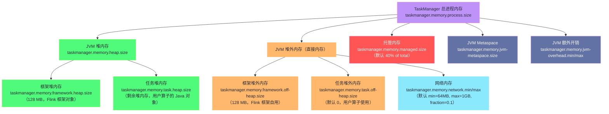

**摘要：**

内存配置是 Flink 生产调优中最复杂也最容易踩坑的领域。Flink 1.10 引入了全新的统一内存模型（FLIP-49），将 TaskManager 的内存划分为五大区域：JVM 堆内存、框架堆外内存、任务堆外内存、网络内存、托管内存。理解每个区域"为什么存在"——为什么网络 Buffer 必须在堆外？为什么 RocksDB 需要独立的托管内存区域？为什么 Flink 不直接把所有内存都交给 JVM 堆管理？——是你能够在 OOM 告警时正确定位根因、在性能调优时做出合理内存分配决策的前提。本文从 JVM 内存管理的根本局限出发，逐层解析 Flink 内存模型的设计动机，并给出生产环境的调优参数全景。

---

## 第 1 章 为什么 Flink 要自己管理内存

### 1.1 JVM 堆内存的根本问题

在深入 Flink 内存模型之前，必须先理解 Flink "自己管理内存"这个设计决策背后的驱动力——**[[JVM]] 的堆内存管理在大数据场景下有根本性的局限**。

**局限一：GC 停顿（Stop-the-World）**

[[JVM GC]] 的核心问题是 Stop-the-World（STW）停顿——在进行垃圾回收时，JVM 必须暂停所有应用线程，扫描堆内存中的对象引用关系。堆内存越大，存活对象越多，扫描时间越长，STW 停顿越久。

一个典型的场景：TaskManager 堆内存配置 32GB，运行 RocksDB 状态后端或大型窗口聚合作业，堆中存放了数 GB 的状态对象。此时 Full GC 一旦触发，STW 停顿轻则几秒，重则几十秒。在这几十秒内：
- 所有 Task 线程暂停，无法处理数据
- 上游 Buffer 被填满，反压向上游传播，最终可能导致 Kafka Consumer 消费停滞
- Checkpoint 无法完成（因为 Task 线程暂停），超时失败，作业开始重启
- 进入恶性循环：重启 → 恢复状态 → 重新积累大量状态对象 → 再次 Full GC

**局限二：内存使用不可预测，容易 OOM**

JVM 的垃圾回收有一定延迟——对象不再被引用后，需要等到下一次 GC 才能释放内存。在高吞吐的流处理场景下，短生命周期的对象（每条记录创建的 Tuple、String 等）大量积累，新生代 Eden 区频繁满溢，触发 Minor GC；如果 Minor GC 来不及清理，对象晋升到老年代，老年代满后触发 Full GC，内存使用曲线难以预测。

更严重的是：当 TaskManager 进程的堆内存使用率接近上限时，GC 频率增加，GC 停顿时间拉长，应用吞吐量急剧下降，系统陷入"GC 地狱"——花费 90% 的时间在做垃圾回收，只有 10% 的时间在做实际计算，最终 OOM 崩溃。

**局限三：无法精确控制每个 Task 的内存使用量**

当一个 TaskManager 的多个 Slot 中运行着不同的 Task 时，它们共享同一个 JVM 堆。如果某个 Task 因为数据倾斜导致状态急剧膨胀，会挤占其他 Task 的内存空间，最终导致整个 TaskManager 进程 OOM——一个 Task 的问题殃及整个 TaskManager。

### 1.2 Flink 的解决思路：堆外内存 + 自管理

Flink 的解决思路是：**将大块、生命周期长的内存移到 JVM 堆外（Off-Heap），由 Flink 自己管理其分配和释放**。

具体来说：
- **网络 Buffer**（Task 间数据传输的缓冲区）：移到堆外，使用 [[Netty]] 的 `DirectByteBuffer`。网络数据不需要 JVM 对象语义，只需要字节数组，放在堆外可以直接进行零拷贝（zero-copy）的网络 I/O，避免 GC 压力
- **托管内存（Managed Memory）**：Flink 从 JVM 向操作系统申请一大块堆外内存，然后自己用 `MemorySegment` 抽象管理这块内存的分配和释放。RocksDB 状态后端、算子的排序/哈希表等"大内存"操作都在这块区域进行，完全绕开 JVM GC

这样，JVM 堆中只剩下轻量级的业务对象（处理中的记录、算子的局部变量等），数量有限，GC 频率低，STW 停顿短。

---

## 第 2 章 Flink 内存模型全景：五大区域

### 2.1 TaskManager 内存的完整划分

Flink 1.10（FLIP-49）引入的统一内存模型将 TaskManager 的总内存（`taskmanager.memory.process.size`）划分如下：



### 2.2 五大内存区域详解

#### 2.2.1 JVM 堆内存（Heap Memory）

**框架堆内存（Framework Heap，默认 128MB）**：Flink 框架自身运行所需的堆内存，用于 JobManager 通信对象、算子元数据、Checkpoint 协调对象等。这部分内存由 Flink 保留，用户代码不应使用。

**任务堆内存（Task Heap）**：用户算子代码运行时的 Java 堆内存，存放：
- 算子处理中的记录对象（`map()`、`filter()` 中的输入输出对象）
- 用户代码中创建的临时对象
- `HashMapStateBackend` 中的状态对象（这是重点！如果使用 HashMapStateBackend，所有状态都在这里，状态大则 GC 压力大）

任务堆内存的大小 = JVM 堆总大小（`taskmanager.memory.heap.size`）- 框架堆内存（128MB）。

**直接配置方式**：
```yaml
# 方式一：直接指定总进程内存（推荐，其他区域按比例计算）
taskmanager.memory.process.size: 8g

# 方式二：直接指定 JVM 堆内存大小
taskmanager.memory.task.heap.size: 4g
```

#### 2.2.2 网络内存（Network Memory）

**是什么**：网络内存是 Flink 用于 Task 间数据传输的 Buffer 池，存放在 JVM 堆外（`DirectByteBuffer`），通过 Netty 进行网络 I/O。

**为什么必须在堆外**：网络数据传输的核心是"零拷贝"——数据从一个 Task 的输出 Buffer 直接经网络发往另一个 Task 的输入 Buffer，不需要在 JVM 对象和字节数组之间来回转换。如果 Buffer 在堆内，JVM 在 GC 时可能移动对象的内存地址，而网络 I/O 需要固定内存地址（DMA 操作）——这两个需求互相冲突。堆外内存地址固定，正好满足网络 I/O 的需求。

**配置参数**：
```yaml
# 网络内存最小值（容量下限保障）
taskmanager.memory.network.min: 64mb
# 网络内存最大值（容量上限保障）
taskmanager.memory.network.max: 1gb
# 网络内存占 TaskManager 总内存的比例（动态计算）
taskmanager.memory.network.fraction: 0.1
# 实际值 = max(min, min(max, total * fraction))
```

**网络内存不足的后果**：如果网络内存不足，Task 的输出 Buffer 申请不到内存，Task 线程被阻塞，等待 Buffer 释放。从外部看，这表现为反压（Backpressure）——即使上游数据量不大，也会出现背压告警。误判为数据量问题去增大并行度，反而无效，正确的处理是增大网络内存。

#### 2.2.3 托管内存（Managed Memory）

**是什么**：托管内存是 Flink 从操作系统申请的一大块堆外内存，由 Flink 的 `MemoryManager` 自主管理分配和回收，完全绕开 JVM GC。

**为什么需要托管内存**：以下操作需要大量内存，且这些内存的生命周期可预测（不依赖 GC 来回收）：
- **RocksDB 状态后端**：RocksDB 的 Block Cache（读缓存）和 Write Buffer（写缓冲）是 C++ 层面的内存，通过 JNI 操作，必须在堆外。如果不限制，RocksDB 会无限制地消耗堆外内存，与 Flink 其他组件争抢
- **排序（Sort）**：批处理模式下对大数据集的排序需要预分配大量排序缓冲区
- **哈希表（HashTable）**：Join、聚合操作中使用的内部哈希表

**托管内存的分配机制（MemorySegment）**：

Flink 的 `MemoryManager` 将托管内存预先切割为固定大小的 `MemorySegment`（内存段，默认 32KB），形成一个 `MemorySegment` 池。需要内存时从池中借出，使用完毕后归还——类似一个对象池，没有 GC 开销。

```
托管内存（例如 4GB）
  ↓ 切割为固定大小的 MemorySegment
MemorySegment Pool：
  [Segment 0: 32KB][Segment 1: 32KB][Segment 2: 32KB]...[Segment N: 32KB]
  
使用时：
  RocksDB State Backend → 申请 M 个 Segment（M × 32KB = 分配给 RocksDB 的内存）
  算子排序 → 申请 K 个 Segment（K × 32KB = 排序缓冲区大小）
  
使用完毕后归还，供其他算子复用
```

**托管内存配置**：
```yaml
# 托管内存大小（绝对值）
taskmanager.memory.managed.size: 4g
# 或按比例配置（占 Flink 总内存的比例，Flink 总内存 = 进程内存 - JVM 开销）
taskmanager.memory.managed.fraction: 0.4  # 默认 40%
```

> [!warning] 生产避坑：RocksDB 调优必须关注托管内存
> 使用 `EmbeddedRocksDBStateBackend` 时，RocksDB 的内存使用量由 Flink 托管内存控制（每个 Slot 分配固定比例的托管内存给 RocksDB）。如果托管内存不足，RocksDB 的 Block Cache 很小，读命中率低，导致频繁磁盘 I/O，状态读写延迟飙升。这时需要**增加托管内存比例**，而不是增加堆内存。

#### 2.2.4 JVM Metaspace

**是什么**：存放 JVM 类元数据（Class 对象、方法信息等），Java 8 后从 PermGen 移到本地内存（Native Memory）。

**何时需要调大**：当 TaskManager 需要加载大量类时（如使用了很多第三方依赖、Flink SQL 动态生成了大量代码类），默认的 Metaspace 大小（`taskmanager.memory.jvm-metaspace.size`，默认 256MB）可能不足，出现 `OutOfMemoryError: Metaspace`。

```yaml
taskmanager.memory.jvm-metaspace.size: 512mb  # 扩大 Metaspace
```

#### 2.2.5 JVM 额外开销（JVM Overhead）

**是什么**：预留给 JVM 内部使用的内存，用于 JVM 线程栈、JIT 编译缓冲、JVM 内部数据结构等，这部分内存无法精确预测，因此预留一个范围：

```yaml
taskmanager.memory.jvm-overhead.min: 192mb
taskmanager.memory.jvm-overhead.max: 1gb
taskmanager.memory.jvm-overhead.fraction: 0.1  # 占总进程内存的 10%
```

---

## 第 3 章 MemorySegment：堆外内存的基本操作单元

### 3.1 MemorySegment 是什么

`MemorySegment` 是 Flink 内部操作内存的核心抽象，代表一块连续的内存区域（默认 32KB）。它是 `NetworkBuffer`、托管内存分配的基础单元。

`MemorySegment` 有两种实现：
- **HeapMemorySegment**：包装 Java `byte[]`，位于 JVM 堆内，GC 可能移动其地址
- **HybridMemorySegment**：支持包装 Java `byte[]`（堆内）或 `ByteBuffer`（堆外，地址固定），Flink 1.5 之后的默认实现

```java
// MemorySegment 的核心 API（简化版）：
// 读写基本类型（直接操作字节偏移量，不需要序列化框架）
long readLong(int offset)
void putLong(int offset, long value)

int readInt(int offset)
void putInt(int offset, int value)

// 批量字节拷贝
void get(int offset, byte[] dst, int dstOffset, int length)
void put(int offset, byte[] src, int srcOffset, int length)

// 内存比较（用于排序）
int compare(MemorySegment seg2, int offset1, int offset2, int len)
```

**为什么用 `MemorySegment` 而不直接用 `ByteBuffer`**：`ByteBuffer` 的 API 很笨拙（position/limit/capacity 状态机），每次读写都需要维护 position，且不支持随机访问。`MemorySegment` 提供了更简洁的基于偏移量的随机访问 API，更适合 Flink 的场景（如对已知偏移量的字段进行读写比较）。

### 3.2 数据在 MemorySegment 中的序列化格式

Flink 在将 Java 对象写入 `MemorySegment` 时，使用自定义的**二进制序列化格式**，而不是 Java 原生序列化或 Kryo。

以一个 POJO `OrderEvent(orderId: Long, amount: Double, userId: String)` 为例：

```
MemorySegment 中的二进制布局：
  [0..7]   8 字节 Long：orderId
  [8..15]  8 字节 Double：amount
  [16..19] 4 字节 Int：userId 字符串的字节长度（如 5）
  [20..24] 5 字节 UTF-8：userId 字符串内容（如 "user1"）

总共：8 + 8 + 4 + 5 = 25 字节
```

这种格式的优势：
1. **紧凑**：没有 Java 对象头（16 字节）、没有引用指针开销，相同数据的存储空间只有 Java 对象的 1/3~1/5
2. **快速比较**：对 Long、Int 等固定长度字段的比较可以直接用 `readLong`/`readInt`，不需要反序列化整个对象
3. **零拷贝传输**：`MemorySegment` 内容可以直接通过网络传输（字节数组），接收端直接读取，不需要反序列化

---

## 第 4 章 网络 Buffer 的分配与流控

### 4.1 NetworkBuffer 的池化管理

网络内存被切割为固定大小的 `NetworkBuffer`（也是 `MemorySegment` 的封装，默认 32KB），通过 `NetworkBufferPool` 进行池化管理：

```
NetworkBufferPool（全局，属于整个 TaskManager）
  总 Buffer 数量 = 网络内存总大小 / 单个 Buffer 大小
  例如：64MB 网络内存，32KB 每个 Buffer → 共 2048 个 Buffer

每个 Task 的 InputGate 和 ResultPartition 从 NetworkBufferPool 中申请 Buffer：
  ResultPartition（输出）：每个输出子分区（SubPartition）预分配若干 Buffer
  InputGate（输入）：每个输入通道（InputChannel）预分配若干 Buffer
```

### 4.2 Buffer 数量计算（重要）

Flink 要求网络内存中有足够的 Buffer 来支撑所有 Task 的输入输出。如果 Buffer 不足，Task 无法启动（抛出 `InsufficientResourcesException`）。

Buffer 数量下限的估算公式：

```
所需 Buffer 数 ≈ 
    Σ (每个 Task 的输出并行度 × buffers-per-channel) 
  + Σ (每个 Task 的输入并行度 × buffers-per-channel)
  + Σ (每个 Task 的 floating buffers)

其中：
  buffers-per-channel（每个 channel 固定 Buffer 数）= taskmanager.network.memory.buffers-per-channel（默认 2）
  floating-buffers-per-gate（每个 gate 的浮动 Buffer 数）= taskmanager.network.memory.floating-buffers-per-gate（默认 8）
```

> [!info] 核心概念：为什么 Buffer 要池化而不是动态分配
> 动态 `malloc`/`free` 堆外内存的代价很高（系统调用，涉及 OS 内核），且碎片化严重。将 Buffer 预先分配并池化，每次"分配"只是从池中取出一个空闲 Buffer（指针操作，纳秒级），"释放"只是放回池中——这是 Netty 等高性能网络框架的标准做法，也是 Flink 网络层高吞吐的基础。

---

## 第 5 章 生产内存配置实践

### 5.1 内存配置的两种范式

**范式一：指定总进程内存（推荐）**

```yaml
taskmanager.memory.process.size: 8g
# Flink 会自动按比例分配各区域：
# - 网络内存 = max(64MB, min(1GB, 8GB × 0.1)) = 800MB
# - 托管内存 = (8GB - JVM开销) × 0.4 ≈ 3GB
# - JVM 堆 = 剩余约 3.3GB
# - JVM Metaspace = 256MB（固定）
# - JVM 开销 = max(192MB, min(1GB, 8GB × 0.1)) = 800MB
```

**范式二：逐项指定（精细控制）**

```yaml
# 指定 JVM 堆（Flink 会自动推算其他区域）
taskmanager.memory.task.heap.size: 2g
taskmanager.memory.managed.size: 4g
taskmanager.memory.network.min: 512mb
taskmanager.memory.network.max: 512mb
```

> [!warning] 生产避坑：不要同时配置 process.size 和 heap.size
> `process.size` 和 `task.heap.size` 同时配置会导致冲突（Flink 无法同时满足两者）。选择一种范式，不要混用。

### 5.2 不同场景的内存配置建议

#### 场景一：HashMapStateBackend（纯堆内状态）

```yaml
# 特点：状态全在 JVM 堆内，堆内存要大，托管内存可以小
taskmanager.memory.process.size: 8g
taskmanager.memory.managed.fraction: 0.1  # 托管内存比例降低到 10%
# → 更多内存留给 JVM 堆（任务堆内存）
# 注意：状态大时 GC 压力大，建议配合 G1GC
```

对应的 JVM GC 参数（在 `flink-conf.yaml` 的 `env.java.opts.taskmanager` 中配置）：
```
-XX:+UseG1GC 
-XX:G1HeapRegionSize=32m 
-XX:MaxGCPauseMillis=200
-XX:InitiatingHeapOccupancyPercent=35
```

#### 场景二：RocksDBStateBackend（堆外状态）

```yaml
# 特点：RocksDB 状态在托管内存（堆外），减少 GC 压力，但需要足够托管内存
taskmanager.memory.process.size: 16g
taskmanager.memory.managed.fraction: 0.5  # 托管内存比例提高到 50%
# → 8GB 给 RocksDB（Block Cache + Write Buffer），堆内存约 5GB

# RocksDB 内存使用比例（每个 Slot 分配多少托管内存给 RocksDB）
state.backend.rocksdb.memory.managed: true        # 启用 RocksDB 托管内存
state.backend.rocksdb.memory.fixed-per-slot: 2gb  # 每个 Slot 分配 2GB
```

#### 场景三：高吞吐网络密集型作业（大量 Shuffle）

```yaml
taskmanager.memory.process.size: 8g
# 增大网络内存以容纳更多 Buffer
taskmanager.memory.network.min: 1g
taskmanager.memory.network.max: 2g
taskmanager.memory.network.fraction: 0.2

# 增大每个 channel 的 Buffer 数（减少 Buffer 等待，提高吞吐）
taskmanager.network.memory.buffers-per-channel: 4  # 默认 2，提高到 4
```

### 5.3 OOM 问题快速定位

生产中 TaskManager 进程出现 OOM，根据 OOM 的类型定位不同区域：

| OOM 错误信息 | 根因区域 | 解决思路 |
|------------|---------|---------|
| `java.lang.OutOfMemoryError: Java heap space` | 任务堆内存不足 | 增大 `taskmanager.memory.task.heap.size`，或切换到 RocksDB 后端减少堆内状态 |
| `java.lang.OutOfMemoryError: GC overhead limit exceeded` | 任务堆内存不足，GC 无效 | 同上，且检查是否存在状态无限增长（未清理的状态） |
| `java.lang.OutOfMemoryError: Direct buffer memory` | 网络内存或任务堆外内存不足 | 增大 `taskmanager.memory.network.max` 或 `taskmanager.memory.task.off-heap.size` |
| `java.lang.OutOfMemoryError: Metaspace` | JVM Metaspace 不足 | 增大 `taskmanager.memory.jvm-metaspace.size` |
| TaskManager 进程被 Linux OOM Killer 杀死 | 总进程内存超过容器/CGroup 限制 | 增大 `taskmanager.memory.process.size`，或检查 RocksDB 是否未使用托管内存（native 内存泄漏）|

> [!warning] 生产避坑：Linux OOM Killer 与 JVM OOM 的区别
> JVM OOM 会在日志中留下 `OutOfMemoryError` 异常堆栈，较容易定位。Linux OOM Killer 直接发送 `SIGKILL` 杀死进程，进程没有机会输出日志，TaskManager 日志中只会看到进程突然退出，没有任何异常信息。区分方法：查看操作系统的 `dmesg` 日志（`dmesg | grep -i "oom"`），如果看到 `oom-kill event`，则是 Linux OOM Killer。
> 常见根因：RocksDB 未配置托管内存上限（`state.backend.rocksdb.memory.managed: false`），RocksDB 的 native 内存无限增长，最终超过容器内存限制。

### 5.4 内存调优的系统化方法

**第一步：确认内存使用分布**

在 Flink Web UI 的 TaskManager 详情页面，可以看到 "Memory" 标签页，显示各内存区域的实际使用情况（JVM 堆已用/总量、Direct Memory 已用/总量等）。

**第二步：根据 GC 情况调整堆比例**

通过 JVM GC 日志（在 `env.java.opts.taskmanager` 中加 `-Xloggc:/tmp/gc.log -XX:+PrintGCDetails`）分析：
- Minor GC 频率 > 1次/秒 → 堆太小或对象创建速率太高
- Full GC 出现 → 老年代空间不足，需要增大堆或切换到 RocksDB 后端
- GC 时间占比 > 5% → 开始影响吞吐，需要调整

**第三步：根据反压情况调整网络内存**

Web UI 中算子显示橙色/红色反压，但上游发送速率和下游处理速率基本相当时，可能是网络 Buffer 不足导致的"虚假反压"。增大网络内存后反压消失则确认。

**第四步：根据 RocksDB Metrics 调整托管内存**

在 Flink Metrics 中观察 `rocksdb.block-cache-hit`（Block Cache 命中次数）和 `rocksdb.block-cache-miss`（未命中次数）。命中率 = hit/(hit+miss)，如果命中率 < 50%，说明 Block Cache 太小，需要增大托管内存。

---

## 第 6 章 内存模型的边界与常见误区

### 6.1 误区一：增大 -Xmx 就能解决所有内存问题

在 Flink 中，直接修改 `-Xmx`（JVM 最大堆大小）是不推荐的，因为 Flink 会根据 `taskmanager.memory.process.size` 自动计算 `-Xmx`。如果手动设置 `-Xmx` 大于 Flink 计算的值，会导致：
- JVM 堆超出 `process.size` 的分配范围，与网络内存、托管内存等区域互相挤压
- 在容器环境（YARN/K8s）中，总内存超过容器限制，被 OOM Killer 杀死

**正确做法**：通过调整 `taskmanager.memory.process.size` 或 `taskmanager.memory.task.heap.size` 来扩大堆内存，让 Flink 自动计算对应的 `-Xmx`。

### 6.2 误区二：托管内存越大越好

托管内存（Managed Memory）增大，意味着其他区域（尤其是 JVM 堆）可用内存减少。如果作业使用的是 `HashMapStateBackend`（状态全在堆内），增大托管内存反而会导致堆内存不足、GC 更频繁。

托管内存应该根据实际需要配置：
- 使用 RocksDB 后端 → 托管内存要大（40%~60%）
- 使用 HashMapStateBackend → 托管内存可以小（10%~20%）
- 只做纯计算（无状态或极少状态）→ 托管内存最小化（5%~10%）

### 6.3 误区三：网络内存越大越好，可以无限提高吞吐

网络内存增大确实可以减少因 Buffer 不足导致的反压，提高吞吐量。但网络内存是从总内存中划分的，增大网络内存必然压缩其他区域（如堆内存和托管内存）。

更合理的做法是：先通过 Metrics 确认确实是 Buffer 不足导致的反压，再有针对性地增大网络内存，而不是无脑扩大。

---

## 小结

Flink 的内存模型是其性能和稳定性的底层基础，核心设计动机是**将 GC 压力大、生命周期长的内存移到堆外自管理**：

- **JVM 堆**（框架堆 128MB + 任务堆）：业务对象和 HashMapStateBackend 的状态；GC 压力的来源，需要合理控制
- **网络内存**（堆外，默认 10% of total）：Task 间数据传输的 Buffer 池，必须在堆外实现零拷贝；不足会导致虚假反压
- **托管内存**（堆外，默认 40% of total）：RocksDB Block Cache/Write Buffer、排序、哈希表；由 Flink 的 MemoryManager 通过 MemorySegment 池管理，完全绕开 GC
- **JVM Metaspace**（默认 256MB）：类元数据，大量动态类生成时需要扩大
- **JVM 额外开销**（默认 10% of total）：线程栈、JIT 缓存等 JVM 内部用途

**OOM 定位三步法**：看 OOM 错误类型 → 定位区域 → 调整对应参数

下一篇 [[04 Flink 网络传输与反压机制深度解析]] 将深入网络层，解析 Credit-based 流量控制如何在 Task 之间精确传递背压信号，以及 Unaligned Checkpoint 背后的网络设计代价。


> [!note] 思考题
> 1. Flink 的 Network Memory 用于存储 Task 间传输的数据缓冲区（Buffer Pool）。Network Memory 的大小影响了反压触发的阈值——Buffer 越大，下游消费速度越慢时上游才会感受到背压。在 Credit-based 流量控制中，每个远程传输连接会预分配一定数量的 Exclusive Buffer。如果 Network Memory 设置过小，导致无法为所有连接分配足够的 Exclusive Buffer，会发生什么？
> 2. Flink 的 Managed Memory 是由 Flink 自己管理的堆外内存，主要用于状态后端（RocksDB）和批处理算子（Sort、HashJoin）。当 Flink 作业同时包含流处理逻辑（使用 RocksDB State）和批处理逻辑（使用 Sort）时，Managed Memory 如何在两者之间分配？有没有配置参数控制这个分配比例？
> 3. JVM Metaspace 存储类的元数据信息。Flink 作业在运行时会动态生成大量代码（如 CodeGen 生成的算子代码、Kryo 序列化器的代理类），这些动态生成的类会被加载到 Metaspace 中。如果一个长期运行的 Flink 流作业不断触发代码重新生成（比如 Flink SQL 的动态 DDL 变更），Metaspace 会无限增长吗？如何监控和控制 Metaspace 的使用？