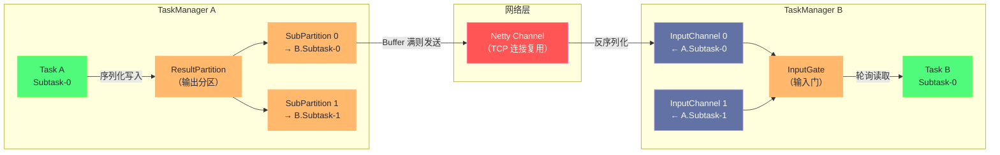
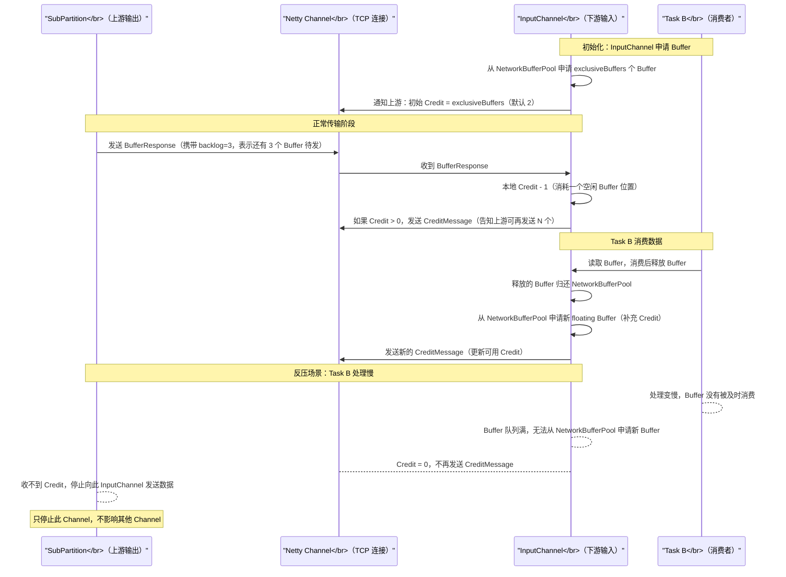

**摘要：**

反压（Backpressure）是流处理系统稳定性的核心保障机制，也是生产中最常见的性能问题来源。Flink 的反压机制经历了两个阶段的演进：早期基于 TCP 的隐式反压（利用网络缓冲区满溢自然阻塞），以及 Flink 1.5 引入的 Credit-based 显式流量控制。理解"为什么早期的 TCP 反压会影响 Checkpoint？""Credit 机制如何将反压精确定位到单个 InputChannel？""反压从下游如何一步步传播到 Source 算子？"——这些问题的答案不仅帮助你读懂 Web UI 上的背压告警，更让你在调优时做出准确的根因判断，而不是靠猜测盲目增加并行度。本文从网络层的数据流动路径出发，逐层拆解反压的产生、传播与消除机制。

---

## 第 1 章 Flink 网络层的数据流动路径

### 1.1 数据从一个 Task 到另一个 Task 的完整旅程

在理解反压之前，必须先清楚数据在 Flink 网络层中的流动路径。当 Task A（上游）的某个 Subtask 产生一条记录，需要发给 Task B（下游）的某个 Subtask 时，经历以下过程：



**核心组件**：

- **ResultPartition**：Task A 的输出分区，包含 N 个 SubPartition（N = 下游 Task B 的并行度）。Task A 的输出记录按分区策略（HASH/FORWARD/REBALANCE）写入对应的 SubPartition
- **SubPartition**：每个 SubPartition 对应一个下游 Subtask 的输入通道，内部维护一个 Buffer 队列
- **InputGate**：Task B 的输入门，包含 M 个 InputChannel（M = 上游 Task A 的并行度）。Task B 从 InputGate 轮询读取数据，从哪个 InputChannel 读取取决于哪个有数据
- **InputChannel**：每个 InputChannel 对应一个上游 Subtask 的输出，内部维护一个 Buffer 队列

### 1.2 本地传输 vs 远程传输

不是所有 Task 间的数据传输都需要走网络。Flink 根据上下游 Subtask 是否在同一个 TaskManager 进程中，选择不同的传输路径：

**本地传输（LocalInputChannel）**：上下游 Subtask 在同一 TaskManager 进程（同一 JVM）中。数据无需序列化/反序列化，直接通过 Java 对象引用传递 MemorySegment，零拷贝，延迟极低（微秒级）。

**远程传输（RemoteInputChannel）**：上下游 Subtask 在不同 TaskManager 进程中。数据需要：
1. 序列化：将 Java 对象写入 `MemorySegment`（二进制格式）
2. 封装为 Netty 消息，通过 TCP 连接发送
3. 对端 TaskManager 收到 Netty 消息，写入 InputChannel 的 Buffer 队列
4. Task B 从 Buffer 队列读取数据，反序列化为 Java 对象

**TaskManager 间的连接复用**：两个 TaskManager 之间只建立**一条 TCP 连接**（通过 [[Netty]] 的多路复用），即使两个 TM 之间有 100 对 Subtask 需要互相传数据，也共享这一条 TCP 连接。数据通过虚拟的 Channel ID 区分属于哪对 Subtask 的通信。这样做的原因是：TCP 连接建立（三次握手）和维护（心跳）有开销，连接数过多会消耗大量系统资源（文件描述符等）。

---

## 第 2 章 早期反压机制：基于 TCP 的隐式流控

### 2.1 TCP 滑动窗口的天然流控效果

在 Flink 引入 Credit-based 机制之前（Flink 1.5 以前），反压依赖 TCP 协议本身的流控机制——TCP 滑动窗口（TCP Window）。

TCP 是可靠传输协议，发送方不能无限制地发送数据，必须等待接收方的确认（ACK）。接收方通过 ACK 中携带的 `window size` 字段告诉发送方"我的接收缓冲区还有多少空间"。如果 `window size = 0`，发送方必须停止发送，等待接收方腾出缓冲区空间。

在 Flink 的早期网络层中，反压的传播路径是：

```
下游 Task B 处理慢
  → InputChannel 的 Buffer 队列积满
  → TaskManager B 的 Netty 接收缓冲区积满
  → TCP 接收窗口 = 0，通知发送方（TaskManager A）停止发送
  → TaskManager A 的 Netty 发送缓冲区积满
  → SubPartition 的 Buffer 队列积满（无法写入 Netty 发送缓冲区）
  → Task A 写入 SubPartition 时阻塞（申请不到新 Buffer）
  → Task A 的处理线程被阻塞，停止消费上游数据
  → 反压沿链路向上游逐跳传播
```

这个机制能工作，但有**两个严重问题**：

### 2.2 问题一：一个慢 Task 阻塞整条 TCP 连接

前面说到，两个 TaskManager 之间只有一条 TCP 连接，所有 Subtask 的数据通过这条连接传输。

如果 Task B 的 Subtask-0 处理很慢（产生反压），导致 TM_A → TM_B 的 TCP 连接的接收窗口归零，那么通过这条连接发往 TM_B 的**所有数据**都会被阻塞——不只是发往 Task B Subtask-0 的数据，还包括发往 TM_B 上其他 Task（Task C、Task D 等）的 Subtask 的数据。

换句话说：**一个慢 Subtask 会阻塞同一 TM 间 TCP 连接上的所有数据传输**，影响了与该 Subtask 无关的其他 Task，造成大范围的"雪崩"。

### 2.3 问题二：反压影响 Checkpoint Barrier 传播

Checkpoint 的 Barrier 是随着数据流一起传播的特殊消息。当某个算子的 InputChannel 被反压阻塞（Buffer 队列满、无法接收新数据）时，Checkpoint Barrier 也被阻塞在队列中，无法被算子处理。

结果：Checkpoint 协调被拖慢，甚至超时失败。在高反压场景下，Checkpoint 几乎无法完成，作业失去故障恢复能力，这是生产中最严重的稳定性问题之一。

---

## 第 3 章 Credit-based 流量控制：精确的反压机制

### 3.1 Credit 机制的核心思想

Flink 1.5 引入了 Credit-based 流量控制（参考论文：《Megaphone: Latency-conscious state migration for distributed streaming dataflow systems》中的信用机制），从根本上解决了 TCP 反压的两个问题。

**核心思想**：**在应用层（Flink）实现精细的流量控制，不依赖 TCP 层的隐式流控**。

Credit（信用/额度）的含义：下游 InputChannel 告知上游 SubPartition，"我当前有 N 个空闲 Buffer，你可以发送 N 个 Buffer 的数据给我"。上游只有在持有 Credit 时才发送数据，发送一个 Buffer 消耗一个 Credit。

这种机制的精妙之处：**流量控制精确到每个 InputChannel 粒度**，而不是整条 TCP 连接。某个 InputChannel 没有 Credit（下游慢），只停止发往该 Channel 的数据，不影响同一 TCP 连接上的其他 Channel。

### 3.2 Credit-based 机制的工作流程



### 3.3 Buffer 的两类分配：Exclusive Buffer 与 Floating Buffer

Credit-based 机制将 InputChannel 的 Buffer 分为两类：

**Exclusive Buffer（专属 Buffer）**：
- 每个 InputChannel 预分配固定数量的专属 Buffer（由 `taskmanager.network.memory.buffers-per-channel` 控制，默认 2 个）
- 这些 Buffer 只属于该 Channel，不与其他 Channel 共享
- 作用：保证每个 Channel 至少有最小量的 Buffer 可用，避免完全饥饿

**Floating Buffer（浮动 Buffer）**：
- 由每个 InputGate 维护一个共享的浮动 Buffer 池（大小由 `taskmanager.network.memory.floating-buffers-per-gate` 控制，默认 8 个）
- 当某个 InputChannel 的 Exclusive Buffer 不足时，可以从 FloatingBuffer 池中借用
- 当上游有很多 backlog（积压数据）等待发送时，Flink 会为该 Channel 分配更多 Floating Buffer，以快速消化积压
- 作用：弹性分配，将更多 Buffer 分配给"最需要"的 Channel

**Credit 值的计算**：

```
InputChannel 的可用 Credit = Exclusive Buffer 空闲数 + Floating Buffer 空闲数
  
当 SubPartition 发来消息时，携带 backlog 字段（还有多少 Buffer 等待发送）：
  如果 backlog > 0：InputGate 尝试从 NetworkBufferPool 申请 min(backlog, availableFloatingBuffers) 个 Floating Buffer
  新申请的 Floating Buffer 加入此 Channel 的 Credit，并通知上游
```

### 3.4 Credit-based 如何解决两个历史问题

**问题一（多 Channel 相互影响）的解决**：

Credit 控制精确到 InputChannel 粒度。Channel-0 没有 Credit（下游 Task B Subtask-0 处理慢），只停止向 Channel-0 发送数据。Channel-1（发往 Task C Subtask-0）独立持有自己的 Credit，不受影响，可以继续正常传输。

两个 TM 之间虽然共享一条 TCP 连接，但在应用层通过 Credit 实现了逻辑隔离——不再出现"一个慢 Channel 阻断整条 TCP 连接"的问题。

**问题二（Checkpoint 受阻）的解决**：

Checkpoint Barrier 不通过普通的 Buffer 通道传输，而是作为**优先消息（Priority Message）**通过专用通道发送，绕过 Buffer 队列的排队等待。

即使某个 InputChannel 处于反压状态（Buffer 队列满，Credit = 0），Checkpoint Barrier 仍然可以被接收和处理——这是 Unaligned Checkpoint（Flink 1.11 引入）的基础。

---

## 第 4 章 反压的产生、传播与消除

### 4.1 反压的产生：从根因到表象

反压的根本原因是**某个算子的处理速度跟不上其输入速率**。这个速度差距可能来自：

- **计算密集型瓶颈**：某个算子的 `processElement()` 执行时间过长（如复杂的字符串处理、正则匹配、访问外部系统）
- **IO 密集型瓶颈**：算子需要同步访问外部数据库/缓存（如同步查询维度表），等待 IO 完成
- **数据倾斜**：某些 Key 的数据量远多于其他 Key，对应的 Subtask 处理负载过重
- **GC 停顿**：JVM 发生 Full GC，Task 线程被暂停，处理速度瞬间归零
- **资源不足**：CPU 或内存不足，多个 Task 竞争有限资源

无论哪种原因，最终表现都是：**下游 Subtask 的 InputChannel 的 Buffer 队列被填满，Credit = 0，上游停止发送**。

### 4.2 反压的向上传播链

以 Source → Map → KeyBy → Window → Sink 为例，当 Window 算子处理变慢时，反压如何逐跳向上传播：

```
第一跳：Window 处理慢
  → Window Subtask 的 InputChannel(来自 Map) Buffer 满
  → Credit = 0，Map 的 SubPartition 停止向 Window 发送
  → Map Subtask 的输出 SubPartition Buffer 积满
  → Map Subtask 无法写出数据，processElement() 在等待输出 Buffer

第二跳：Map 反压传播到上游
  → Map Subtask 的 InputChannel(来自 Source) 仍在接收 Source 数据
  → 但 Map 的处理线程被输出阻塞，无法消费 InputChannel 中的数据
  → Map 的 InputChannel Buffer 积满
  → Credit = 0，Source 的 SubPartition 停止向 Map 发送
  → Source Subtask 的 SubPartition Buffer 积满
  → Source 的读取速度被限制（不再继续读 Kafka，维持当前位点）

最终效果：整条数据流的吞吐量降低到 Window 算子的处理速度
```

这是反压的**自适应流量控制**效果——整个 Pipeline 自动将吞吐量调整到最慢算子的处理速度，不会因为上游太快而导致内存溢出。

> [!info] 核心概念：反压是保护机制，不是性能问题
> 反压本身不是 Bug，而是 Flink 在面对处理能力不足时的**自我保护**。没有反压机制，上游高速写入、下游处理不及，内存会被 Buffer 填满直至 OOM。反压告警提示你"有地方处理速度跟不上"，是发现性能瓶颈的信号，而不是需要关闭的烦人报警。
> 
> 真正需要解决的是反压的**根因**——哪个算子成了瓶颈、为什么处理慢——而不是试图绕过反压机制本身。

### 4.3 在 Web UI 中定位反压根因

Flink Web UI 中每个算子的 Subtask 有一个背压（Backpressure）指标，显示为 `High`（红色）、`Low`（橙色）、`OK`（绿色）。

**定位规则**：
- 找到**最上游的、自身为 OK 但输出给下游后导致下游显示 High/Low 的算子**，那个下游算子就是瓶颈
- 或者：找到**自身显示 High，且其下游也显示 High**，继续向下找，直到找到**自身显示 High，但下游显示 OK**——这就是真正的瓶颈（它处理不完数据，却还在收数据）

**一个具体的判断示例**：

```
Source → Map → keyBy → Window → Sink

Web UI 显示：
  Source:  Backpressure = High（橙色/红色）← 被反压了
  Map:     Backpressure = High（橙色/红色）← 被反压了
  Window:  Backpressure = Low（轻微反压）  ← 本身有一点堆积，但在处理
  Sink:    Backpressure = OK              ← 没有反压，写得很快

结论：Window 算子是瓶颈。Sink 很快，Window 处理较慢，导致 Map 和 Source 被反压
根因排查方向：Window 的计算逻辑、Window 的并行度、数据倾斜
```

### 4.4 常见反压根因与解决思路

**根因一：计算逻辑耗时过长**

```
特征：
  Web UI 中特定 Subtask 的 CPU 使用率很高
  Backpressure 指标 High，但 InputChannel 中的 Buffer 还有空余（没有堆积）

解决思路：
  - 优化算子内部逻辑（减少对象创建、避免正则匹配等高开销操作）
  - 增大该算子的并行度（水平扩展）
  - 将同步 IO 操作改为异步 IO（AsyncDataStream.orderedWait/unorderedWait）
```

**根因二：数据倾斜（KeyBy 不均匀）**

```
特征：
  KeyBy 之后的算子，个别 Subtask 的处理速度远慢于其他 Subtask
  Web UI 中该 JobVertex 的 Subtask 列表中，某个 Subtask 的输入数据量远大于其他

解决思路：
  - 检查 Key 的分布是否均匀（热点 Key 问题）
  - 使用加盐（Salting）技术打散热点 Key：在 Key 上添加随机后缀，分散到多个 Subtask 处理，最后合并结果
  - 对热点 Key 单独处理（特判逻辑）
```

**根因三：外部 IO 阻塞**

```
特征：
  Subtask 的 CPU 使用率不高（甚至很低），但处理速度慢
  日志中有大量等待外部系统响应的时间

解决思路：
  同步查询外部系统（如 MySQL、Redis）：
    → 改为批量查询（每次查询一批数据而非逐条查询）
    → 使用 AsyncDataStream 将同步 IO 改为异步（需要外部系统支持异步客户端）
    → 使用 RichMapFunction 在 open() 中预加载维度数据到内存（适合小维度表）
```

**根因四：GC 压力**

```
特征：
  定期出现短暂的反压高峰，然后恢复正常
  GC 日志中有频繁的 Full GC 或长停顿的 G1GC

解决思路：
  → 增大 JVM 堆内存
  → 将 HashMapStateBackend 切换为 RocksDBStateBackend（状态移到堆外）
  → 调整 GC 参数（G1GC 的 MaxGCPauseMillis 等）
  → 检查是否有状态无限增长（需要及时清理过期状态）
```

---

## 第 5 章 Unaligned Checkpoint：反压下的 Checkpoint 突围

### 5.1 对齐 Checkpoint 在反压下的困境

Flink 的 Checkpoint 机制（将在[[06 Flink Checkpoint 机制深度解析]]中详细讲解）通过在数据流中插入 **Barrier（屏障）** 来触发状态快照。每个算子需要等待**所有输入通道**的 Barrier 都到达后，才能对自己的状态做快照，然后将 Barrier 发往下游。

这种"等待所有 Barrier 对齐"的机制称为**对齐 Checkpoint（Aligned Checkpoint）**。

在没有反压的正常情况下，Barrier 在数据流中快速传播，对齐等待时间很短（毫秒级），Checkpoint 完成顺畅。

但在**高反压**场景下：

```
假设 Task B 有 2 个上游（Task A0 和 Task A1），Task B 处理很慢（反压）

Checkpoint 触发：
  Barrier 从 Source 发出，随数据流传播
  
  Task A0 的 SubPartition 里积累了大量数据，Barrier 排在队列后面等待
  Task A1 也同理
  
  Task B 慢慢处理数据，终于处理到 Barrier_from_A0
  → Task B 阻塞 InputChannel_from_A0（不再消费，防止越过 Barrier 多读数据）
  → 等待 Barrier_from_A1 到达（Task A1 的队列中也积压了大量数据）
  → 等待过程中，InputChannel_from_A0 数据越积越多
  
  结果：Checkpoint 对齐需要等待所有积压数据被处理完，耗时几分钟甚至更长
  → Checkpoint 超时失败
  → 作业无法完成 Checkpoint，失去故障恢复能力
```

### 5.2 Unaligned Checkpoint 的设计

Flink 1.11 引入了 **Unaligned Checkpoint（非对齐 Checkpoint）**，核心思路是：**不等待 Barrier 对齐，直接对"飞行中的数据（in-flight buffers）"也一起做快照**。

**工作机制**：

```
Unaligned Checkpoint 触发（以 Task B 有 2 个上游为例）：

1. Barrier 从 Task A0 到达 Task B 的 InputChannel_0
   → 立刻触发快照（不等待 A1 的 Barrier）
   → Task B 将自己的当前状态 + InputChannel_0 中排在 Barrier 后面的数据 + InputChannel_1 中当前所有数据（飞行中的数据）一起打包进 Checkpoint
   → Barrier 立刻被"超越"（输出 Barrier 不等待输入 Barrier 对齐，直接发往下游）

2. Task A1 的 Barrier 之后到达
   → 已经不需要等待，Checkpoint 早已完成
```

**优势**：Checkpoint 完成时间大幅缩短，即使在高反压场景下（数据积压严重），Checkpoint 也能在秒级完成，作业恢复能力得到保障。

**代价**：
- **Checkpoint 体积增大**：需要将所有"飞行中的数据"一起存入 Checkpoint，数据积压越多，Checkpoint 越大
- **恢复速度变慢**：恢复时需要重放保存的"飞行中数据"，恢复时间比对齐 Checkpoint 长
- **实现复杂性**：需要精确记录哪些 Buffer 在 Barrier 之前，哪些在之后

**配置 Unaligned Checkpoint**：

```java
// 方式一：仅在超时时自动降级为 Unaligned（推荐）
env.getCheckpointConfig().setCheckpointingMode(CheckpointingMode.EXACTLY_ONCE);
env.getCheckpointConfig().setAlignedCheckpointTimeout(Duration.ofSeconds(30));
// 如果对齐等待超过 30 秒，自动切换为 Unaligned Checkpoint

// 方式二：始终使用 Unaligned Checkpoint
env.getCheckpointConfig().enableUnalignedCheckpoints();
```

> [!warning] 生产避坑：Unaligned Checkpoint 的适用场景
> Unaligned Checkpoint 不是银弹，它的主要价值在于"反压时保住 Checkpoint"，而不是提升正常情况下的性能。如果作业根本没有反压，Unaligned Checkpoint 带来的 Checkpoint 体积增大反而是额外负担。推荐策略：设置 `alignedCheckpointTimeout`，正常情况使用对齐 Checkpoint，只有在对齐超时时才降级为 Unaligned，兼顾性能与稳定性。

---

## 第 6 章 网络调优实践

### 6.1 关键网络参数一览

```yaml
# ===== Buffer 数量与大小 =====
# 单个 NetworkBuffer 的大小（默认 32KB，不建议修改）
taskmanager.memory.segment-size: 32kb

# 每个 InputChannel 的专属 Buffer 数（默认 2）
# 增大可以减少 Credit 通信频率，但增大内存占用
taskmanager.network.memory.buffers-per-channel: 2

# 每个 InputGate 的浮动 Buffer 数（默认 8）
# 增大可以更快消化上游积压，减少反压触发频率
taskmanager.network.memory.floating-buffers-per-gate: 8

# ===== 网络内存总量 =====
taskmanager.memory.network.min: 64mb
taskmanager.memory.network.max: 1gb
taskmanager.memory.network.fraction: 0.1

# ===== Netty 配置 =====
# TaskManager 的 Netty Server 线程数（默认 = CPU 核数）
taskmanager.network.netty.num-arenas: -1  # -1 表示自动（= CPU 核数）
# Netty Server 的接收/发送缓冲区大小
taskmanager.network.netty.server.backlog: 100
```

### 6.2 缓解反压的网络层调优

**增大 Floating Buffer 数量**（缓解突发流量）：

当上游短暂突发高速发送数据时，下游需要更多 Buffer 来暂存这些数据。增大 `floating-buffers-per-gate` 可以让下游短暂容纳更多数据，给处理线程争取时间，减少反压触发频率。但这是"治标"，真正的治本是提高下游算子的处理速度。

```yaml
taskmanager.network.memory.floating-buffers-per-gate: 16  # 从默认 8 增大到 16
```

**增大网络内存总量**（避免 Buffer 不足导致 Task 无法启动）：

如果作业的并行度很高（如 100），Task 数量多，需要的 Buffer 总数很大，可能出现作业启动时报 `Insufficient number of network buffers` 的错误：

```yaml
taskmanager.memory.network.fraction: 0.15  # 从默认 10% 增大到 15%
taskmanager.memory.network.max: 2gb        # 提高上限
```

### 6.3 异步 IO：消除同步外部调用导致的反压

同步调用外部系统（Redis、MySQL）是最常见的反压根因之一。Flink 提供了 `AsyncDataStream` 来将同步调用改为异步，充分利用外部系统的并发处理能力：

```java
// 同步版本（容易成为瓶颈）：每条记录等待 Redis 查询完成，吞吐量受限于 Redis 响应时间
DataStream<EnrichedOrder> syncResult = orders.map(order -> {
    String category = redisClient.get("category:" + order.getProductId());  // 同步阻塞
    return new EnrichedOrder(order, category);
});

// 异步版本：同时发出多个 Redis 请求，不等待回复就处理下一条
DataStream<EnrichedOrder> asyncResult = AsyncDataStream.unorderedWait(
    orders,
    new RichAsyncFunction<OrderEvent, EnrichedOrder>() {
        private transient RedisClient asyncRedisClient;

        @Override
        public void open(Configuration parameters) {
            asyncRedisClient = RedisClient.create("redis://redis-host:6379");
        }

        @Override
        public void asyncInvoke(OrderEvent order,
                                ResultFuture<EnrichedOrder> resultFuture) {
            // 异步发出请求，通过回调返回结果（不阻塞当前线程）
            asyncRedisClient.get("category:" + order.getProductId())
                .thenAccept(category -> {
                    resultFuture.complete(
                        Collections.singletonList(new EnrichedOrder(order, category))
                    );
                });
        }
    },
    1000,        // 最大并发异步请求数（"并发度"）
    TimeUnit.MILLISECONDS,
    100          // 超时时间（ms）
);
```

**`unorderedWait` vs `orderedWait`**：
- `orderedWait`：保证输出顺序与输入一致，但需要维护顺序缓冲区，延迟略高
- `unorderedWait`：不保证顺序，哪个异步请求先回来就先输出，延迟更低，吞吐更高

---

## 小结

Flink 网络传输与反压机制的核心要点：

**数据传输路径**：Task A 的输出 → ResultPartition/SubPartition → Netty（TM 间共享 TCP 连接）→ InputChannel/InputGate → Task B。本地传输（同 TM）直接传递 MemorySegment 引用，无序列化开销。

**早期 TCP 反压的两个问题**：
- 一个慢 Channel 会阻塞整条 TCP 连接上的所有通信
- Checkpoint Barrier 被反压阻塞，导致 Checkpoint 无法完成

**Credit-based 流量控制（Flink 1.5+）**：
- 应用层精确控制，粒度到每个 InputChannel
- Exclusive Buffer（专属）+ Floating Buffer（浮动），弹性分配
- 彻底解决了"一个慢 Channel 阻断所有传输"的问题

**Unaligned Checkpoint（Flink 1.11+）**：不等待 Barrier 对齐，将飞行中的数据一并快照，在高反压场景下保障 Checkpoint 完成。代价是 Checkpoint 体积更大，恢复更慢。

**反压根因四类**：计算密集 → 优化逻辑/增并行度；数据倾斜 → Key 加盐/特判热点；外部 IO 阻塞 → 异步 IO；GC 压力 → 增堆内存/切换 RocksDB。

下一篇 [[05 Flink 状态后端深度解析]] 将深入 HashMapStateBackend 与 EmbeddedRocksDBStateBackend 的内部实现，解析两者在读写性能、内存占用、Checkpoint 开销上的根本差异，帮助你在生产中做出正确的状态后端选型。


> [!note] 思考题
> 1. Credit-based 流量控制为每个远程传输通道分配了独立的 Credit（可接收的 Buffer 数量），解决了 TCP 共享连接的 Head-of-Line Blocking 问题。但 Credit 的分配和管理需要额外的控制消息（Credit Grant、Buffer Announcement）在发送方和接收方之间传递。在网络延迟较高的跨机房部署场景下，这些控制消息的往返时间会对吞吐量产生多大影响？
> 2. 反压在 Flink 中通过 Buffer 积满来自然传导——当下游 Buffer 满时，上游被阻塞，无法继续发送数据。这个反压信号最终会一路传回 Source，使 Source 降低读取速率。但如果 Source 是一个不支持"降速"的推送型数据源（如 Kafka 消费者无法"暂停"接收），Source Task 会被阻塞直到 Buffer 有空间。在这个阻塞期间，Checkpoint Barrier 能否正常传播？反压会如何影响 Checkpoint 的完成时间？
> 3. Flink 1.13 引入了基于信用（Credit-based）的反压指标——`outPoolUsage` 和 `inPoolUsage` 分别表示输出和输入 Buffer Pool 的使用率。当某个算子的 `outPoolUsage` 长期接近 100% 时，意味着它在被下游反压。但有时 `outPoolUsage` 高的算子本身并不是瓶颈，而是被它的下游算子的瓶颈传导过来的。如何通过这些指标的组合分析，沿着数据流方向精确定位真正的瓶颈算子？