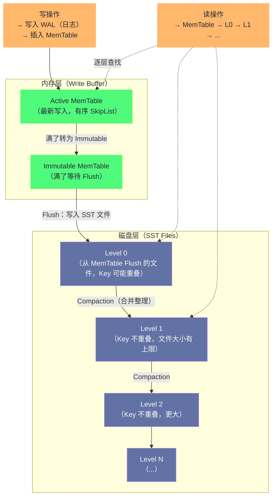

**摘要：**

状态（State）是 Flink 与无状态流处理框架最本质的差异——正是状态让 Flink 能够实现跨越多条消息的复杂计算（会话分析、去重、窗口聚合）。但"有状态"这个能力是有代价的：状态存在哪里？如何读写？内存够不够？Checkpoint 时怎么快照？这些问题都由**状态后端（State Backend）**负责回答。Flink 1.13 之后提供两种状态后端：`HashMapStateBackend`（堆内，速度快但受 GC 限制）和 `EmbeddedRocksDBStateBackend`（堆外，容量无限但有序列化开销）。本文从状态的类型体系出发，深入剖析两种状态后端的内部实现机制、读写性能特征、Checkpoint 策略差异，以及增量 Checkpoint 的设计原理，最终给出生产选型的决策框架。

---

## 第 1 章 Flink 状态的分类体系

### 1.1 为什么流处理需要状态

在讨论状态后端之前，先明确"状态"的本质需求。

一个纯无状态的流处理算子，处理每条记录只依赖该条记录本身，与历史无关：`filter(x -> x.amount > 0)` 是无状态的，`map(x -> x.amount * 1.1)` 也是无状态的。

但很多真实的业务逻辑需要跨越多条记录的"记忆"：

- **去重**：判断某个 userId 的事件是否是第一次出现，需要记住"已见过的 userId"集合
- **会话分析**：统计用户一次会话的总时长，需要记住会话开始时间
- **窗口聚合**：统计过去 5 分钟的累计金额，需要记住过去 5 分钟到来的所有记录（或它们的聚合值）
- **连接（Join）**：将订单流与用户信息流做连接，需要缓存一方的数据等待另一方的到来
- **机器学习特征**：基于用户历史行为计算实时特征，需要维护用户的历史行为序列

这些"记忆"就是状态。Flink 将状态持久化存储，并在 Checkpoint 时快照，确保故障恢复后状态不丢失——这是 Flink "精确一次语义"的基础。

### 1.2 Keyed State vs Operator State

Flink 的状态分为两个顶层类别，对应不同的使用场景：

**Keyed State（键控状态）**

Keyed State 只能用于 `KeyedStream`（`keyBy()` 之后的流）。每个 Key 有独立的状态实例，不同 Key 之间的状态完全隔离。

```
KeyedStream 的逻辑：
  Key="user_A" 的所有记录 → 由 Subtask-0 处理 → 访问 Subtask-0 中 "user_A" 的状态
  Key="user_B" 的所有记录 → 由 Subtask-1 处理 → 访问 Subtask-1 中 "user_B" 的状态

状态的物理存储：
  Subtask-0 的状态区域：{ "user_A": {...state_A...}, "user_C": {...state_C...}, ... }
  Subtask-1 的状态区域：{ "user_B": {...state_B...}, "user_D": {...state_D...}, ... }
```

**五种 Keyed State 类型**：

| 状态类型 | 对应接口 | 语义 | 典型用途 |
|---------|---------|------|---------|
| `ValueState<T>` | `value()` / `update(T)` | 单值，每个 Key 一个值 | 计数器、用户最后登录时间 |
| `ListState<T>` | `add(T)` / `get()` | 值列表，每个 Key 一个列表 | 用户最近 N 次行为 |
| `MapState<K, V>` | `put(K,V)` / `get(K)` | Key-Value Map，每个 Key 一个 Map | 购物车商品列表 |
| `ReducingState<T>` | `add(T)` / `get()` | 增量聚合值（自动对新加入的值做 reduce）| 累计金额 |
| `AggregatingState<IN, OUT>` | `add(IN)` / `get()` | 增量聚合值（输入输出可以不同类型）| 平均值、百分位数 |

**Operator State（算子状态）**

Operator State 与 Key 无关，绑定到算子的 Subtask。每个 Subtask 有一个独立的 Operator State 实例，不区分 Key。

Operator State 主要用于：
- **Kafka Offset 管理**：`FlinkKafkaConsumer` 用 `ListState<TopicPartitionOffsets>` 记录每个分区的消费位点，这是 Kafka Source 能实现 Checkpoint 的基础
- **广播状态（Broadcast State）**：通过 `BroadcastStream.connect()` 实现的广播规则状态，每个 Subtask 维护完整的规则副本

### 1.3 Raw State vs Managed State

除了上面的分类，状态还有另一个维度的区别：

**Managed State（托管状态）**：由 Flink 框架负责序列化、持久化、恢复的状态。`ValueState`、`ListState`、`MapState` 等都是 Managed State。**生产中应当始终使用 Managed State**。

**Raw State（原始状态）**：用户自行负责序列化为字节数组的状态。只有在极少数情况下（如自定义算子需要特殊序列化格式）才使用。Flink 对其内容一无所知，无法做任何优化。

---

## 第 2 章 HashMapStateBackend：堆内状态的实现原理

### 2.1 数据结构与存储位置

`HashMapStateBackend`（Flink 1.13 之前叫 `MemoryStateBackend` 或 `FsStateBackend` 的堆内模式）将所有状态数据存储在 **TaskManager 的 JVM 堆内存**中。

内部使用标准的 Java `HashMap` 来组织状态：

```
Subtask-0 的状态存储结构（HashMapStateBackend）：

KeyedStateBackend（per Subtask）
  └── HashMap<K, N, StateTable>
        K = Key 类型（如 String userId）
        N = Namespace 类型（如 TimeWindow 窗口范围）
        StateTable = 该 Key + Namespace 的状态集合

具体示例（ValueState<Double> totalAmount，1分钟窗口）：
  HashMap:
    Key="user_A", Namespace=[12:00,12:01) → StateTable → ValueState = 150.0
    Key="user_A", Namespace=[12:01,12:02) → StateTable → ValueState = 230.0
    Key="user_B", Namespace=[12:00,12:01) → StateTable → ValueState = 80.0
    ...
```

**状态访问过程**：当 Task 处理 `userId="user_A"` 的记录时：
1. Flink 将当前 Key（`"user_A"`）设置为活跃 Key（`currentKey`）
2. 调用 `state.value()` → 以 `(currentKey, currentNamespace)` 为索引查 HashMap → 返回对应的 Double 值
3. 调用 `state.update(newValue)` → 以相同索引更新 HashMap

整个过程是标准的 Java HashMap 操作，**读写速度极快（微秒级）**，没有任何序列化开销（对象直接存在堆内，以 Java 对象引用访问）。

### 2.2 性能特征：极快的读写，受 GC 制约的容量

**优势**：
- **读写延迟极低**：直接的 Java 对象访问，无序列化/反序列化，延迟 < 1μs
- **实现简单**：利用 JVM 的内存管理，代码简洁，易于调试

**劣势**：
- **受 JVM 堆大小限制**：所有状态都在堆内，可用状态容量 = JVM 堆大小。一台 32GB 内存的机器，去掉系统、网络 Buffer、框架等开销，实际可用状态容量通常不超过 20GB
- **GC 压力大**：大量状态对象（尤其是 Map、List）在 JVM 堆中，增大了 GC 扫描的对象数量，Full GC 停顿可能达到秒级（见 [[03 Flink 内存模型深度解析]]）
- **Checkpoint 慢（大状态场景）**：Checkpoint 时需要遍历所有 HashMap 中的状态对象，序列化并写出到持久化存储，状态越大 Checkpoint 越慢

### 2.3 Checkpoint 机制（HashMapStateBackend）

`HashMapStateBackend` 的 Checkpoint 是**全量快照（Full Snapshot）**：

```
Checkpoint 触发时：
  1. Task 线程暂停（或进入同步快照阶段）
  2. 遍历 StateBackend 中的所有 HashMap 条目
  3. 将每个 (key, namespace, state) 条目序列化为字节数组
  4. 写入 Checkpoint 存储（HDFS/S3）
  5. 通知 JobMaster Checkpoint 完成

Checkpoint 文件大小 ∝ 状态总大小（所有 Key 的所有状态数据）
```

**优化：异步快照（Asynchronous Snapshot）**

为了减少 Checkpoint 对正常处理的影响，Flink 支持异步快照：

1. Task 线程执行同步阶段（**极短**）：对 HashMap 创建一个快照视图（Copy-on-Write，不实际复制数据）
2. 立刻恢复处理数据（正常吞吐恢复）
3. 后台线程执行异步阶段：遍历快照视图，序列化并写出到 HDFS/S3
4. 写出完成，通知 JobMaster

Copy-on-Write 的代价：如果在异步阶段期间，Task 继续处理数据并修改了状态，被修改的状态对象会被复制（写时复制），内存临时翻倍。高写入量场景下，异步 Checkpoint 期间内存可能短暂翻倍，需要留有余量。

---

## 第 3 章 EmbeddedRocksDBStateBackend：堆外无限状态

### 3.1 为什么引入 RocksDB

`HashMapStateBackend` 的核心局限是"状态容量受 JVM 堆限制"。当业务状态需要超过堆内存上限时，唯一的出路是将状态移到 JVM 堆外，甚至移到磁盘。

[[RocksDB]] 是 Facebook 开源的基于 LSM-Tree（Log-Structured Merge-Tree）的嵌入式 KV 存储引擎，正好满足这个需求：
- **嵌入式**：以库的形式嵌入 JVM 进程，通过 JNI 调用，不需要独立的数据库进程
- **持久化**：数据存储在本地磁盘（SSD），容量远超 JVM 堆
- **高性能**：LSM-Tree 写入速度极快（顺序写），读取有 Block Cache 加速
- **成熟可靠**：在 Facebook 等大规模生产环境中经过多年验证

### 3.2 RocksDB 的 LSM-Tree 结构

理解 RocksDB 的读写性能，需要了解其底层的 LSM-Tree 结构：



**写入路径（高性能）**：
1. 写入 WAL（Write-Ahead Log）：顺序追加写，速度极快
2. 写入 MemTable（内存中的有序 SkipList）：内存操作，速度极快
3. MemTable 满后，转为 Immutable MemTable，异步 Flush 到 L0 SST 文件

写入从不随机写磁盘（WAL 和 SST 都是顺序写），这是 LSM-Tree 写性能高的根本原因。

**读取路径（可能较慢）**：
1. 先查 MemTable（内存，最快）
2. 未命中 → 查 L0 文件（L0 文件 Key 可能重叠，需要查所有 L0 文件）
3. 未命中 → 查 L1（L1 的文件 Key 不重叠，可以二分查找定位到一个文件）
4. 依次向下，直到 LN 或找到值

最坏情况需要读多个层，每层都可能有磁盘 IO。Block Cache（读缓存）是缓解这个问题的关键：热点数据命中 Block Cache 则无需磁盘 IO。

**Compaction（整理）**：后台线程周期性地将多个 SST 文件合并，删除旧版本（LSM-Tree 的更新是插入新版本，旧版本在 Compaction 时删除），控制文件层数。Compaction 会消耗 CPU 和磁盘 IO，生产中需要关注。

### 3.3 Flink 如何使用 RocksDB

Flink 在每个 TaskManager 节点上为 RocksDB 创建本地目录（默认在 TaskManager 的 tmp 目录），每个 Subtask 有独立的 RocksDB 实例（或共享，取决于配置）。

**状态的存储格式**：

Flink 将 `(key + namespace)` 序列化为 RocksDB 的 Key，将状态值序列化为 RocksDB 的 Value：

```
RocksDB 中的 KV 格式：
  Key  = serialize(flink_key) + serialize(namespace)
         如："user_A" + [12:00, 12:01)  → 字节数组
  Value = serialize(state_value)
          如：150.0（Double）→ 字节数组（8字节）

不同的 StateDescriptor 对应 RocksDB 的不同 Column Family（列族）：
  CF "totalAmount-ValueState": { (user_A,[12:00,12:01)) → 150.0, ... }
  CF "events-ListState":       { (user_A,VoidNamespace) → [event1, event2, ...], ... }
  CF "cart-MapState":          { (user_A,VoidNamespace,itemId-1) → quantity-3, ... }
```

**读写的序列化开销**：

每次读写 RocksDB 状态，都需要经过序列化/反序列化：
- 读：从 RocksDB 取出字节数组 → Java 反序列化器 → Java 对象
- 写：Java 对象 → Java 序列化器 → 字节数组 → 写入 RocksDB

这个序列化开销是 RocksDB 状态后端相比 HashMapStateBackend 读写延迟更高的根本原因（10μs ~ 100μs vs < 1μs）。

### 3.4 增量 Checkpoint：RocksDB 的杀手级特性

`HashMapStateBackend` 只支持全量 Checkpoint——每次都要将所有状态序列化并写出，随着状态增大，Checkpoint 耗时线性增长。

`EmbeddedRocksDBStateBackend` 支持**增量 Checkpoint（Incremental Checkpoint）**：每次 Checkpoint 只持久化**自上次 Checkpoint 以来新增/修改的 SST 文件**，已有且未修改的 SST 文件只记录引用（不重复上传）。

**增量 Checkpoint 的实现原理**：

RocksDB 的 SST 文件一旦生成，内容**不可变**（LSM-Tree 的特性）——修改操作会生成新的 SST 文件，而不是修改已有的。这个特性正好用于增量 Checkpoint：

```
Checkpoint N-1：
  持久化了 SST 文件：{sst-001, sst-002, sst-003}
  在 HDFS 上存储了这 3 个文件

Checkpoint N（增量）：
  RocksDB 新产生了 SST 文件：{sst-004, sst-005}（Compaction 结果）
  旧文件 {sst-001} 在 Compaction 中被删除（已被合并到 sst-004 中）
  
  增量 Checkpoint 内容：
    上传新文件：{sst-004, sst-005}
    引用旧文件：{sst-002, sst-003}（未变化，不重复上传）
    标记删除：{sst-001}（已被合并，之后可清理）

Checkpoint N 完整状态 = {sst-002, sst-003, sst-004, sst-005}
  但只需要上传 {sst-004, sst-005}（节省了大量网络 IO）
```

**增量 Checkpoint 的性能效益**：

对于状态很大（如 100GB）但每次 Checkpoint 期间变化量较小（如 1GB）的作业：
- 全量 Checkpoint：每次上传 100GB，耗时数分钟
- 增量 Checkpoint：每次只上传 ~1GB，耗时数十秒

**增量 Checkpoint 的代价**：

1. **恢复时间更长**：从最新 Checkpoint 恢复时，需要下载和重建完整的 RocksDB 状态（历次增量 Checkpoint 的所有有效 SST 文件），而不像全量 Checkpoint 只需下载一个完整快照
2. **历史文件管理复杂**：增量 Checkpoint 的 SST 文件被多个 Checkpoint 版本共享，需要引用计数，过早删除会导致恢复失败
3. **Compaction 的不确定性**：RocksDB 的 Compaction 可能在 Checkpoint 期间合并大量文件，反而增大本次增量 Checkpoint 的上传量

```java
// 启用增量 Checkpoint
EmbeddedRocksDBStateBackend rocksDB = new EmbeddedRocksDBStateBackend(true); // true = 启用增量
env.setStateBackend(rocksDB);
```

---

## 第 4 章 两种状态后端的全面对比

### 4.1 核心属性对比

| 维度 | HashMapStateBackend | EmbeddedRocksDBStateBackend |
|------|--------------------|-----------------------------|
| **存储位置** | JVM 堆内存 | 堆外（本地磁盘 + Block Cache）|
| **状态容量** | 受 JVM 堆大小限制（通常 < 数十 GB）| 受磁盘容量限制（可达 TB 级）|
| **读写延迟** | 极低（< 1μs，直接内存访问）| 较高（10μs~100μs，有序列化 + 可能磁盘 IO）|
| **GC 影响** | 大（状态对象在堆内，增大 GC 扫描量）| 小（状态在堆外，JVM GC 几乎不受影响）|
| **Checkpoint 方式** | 全量快照（Full Snapshot）| 全量或增量（推荐增量）|
| **Checkpoint 大小** | = 全部状态大小 | 增量：≈ 变化量（通常远小于全量）|
| **恢复时间** | 下载全量快照（一次 IO）| 增量：需重建所有历史增量文件（多次 IO）|
| **序列化开销** | 无（对象直接访问）| 有（每次读写都序列化）|
| **磁盘依赖** | 无 | 有（需要高速本地磁盘，推荐 SSD）|
| **适合状态大小** | < 数十 GB | 不限（TB 级可用）|

### 4.2 选型决策框架

**选 HashMapStateBackend 的场景**：
- 状态量小（每个 TaskManager 的状态 < 10GB）
- 要求极低的状态读写延迟（如复杂 CEP、高频更新状态）
- 集群没有高速本地磁盘（如纯内存计算环境）
- 作业以批处理为主，状态生命周期短

**选 EmbeddedRocksDBStateBackend 的场景**：
- 状态量大（超过 JVM 堆的 50%）
- 状态长期积累（如保留用户历史行为几天甚至几个月）
- Checkpoint 时间过长（全量快照太慢）
- 希望减少 GC 压力（状态移到堆外）

> [!note] 设计哲学：Flink 状态后端的可插拔设计
> Flink 将状态后端设计为**可插拔接口（StateBackend 接口）**，业务代码与状态存储方式完全解耦。同一段业务代码，只需修改一行配置（`env.setStateBackend(new EmbeddedRocksDBStateBackend())`），就能从 HashMap 切换到 RocksDB，无需改动任何算子逻辑。这种设计让 Flink 的适用范围从"小状态高吞吐"到"超大状态容量无限"都能覆盖。

---

## 第 5 章 状态的使用实践

### 5.1 ValueState：最常用的状态类型

```java
public class DeduplicationFunction extends KeyedProcessFunction<String, OrderEvent, OrderEvent> {
    // 声明状态描述符（放在字段，open() 中注册）
    private ValueStateDescriptor<Boolean> seenDescriptor;
    private transient ValueState<Boolean> seen;

    @Override
    public void open(Configuration parameters) {
        seenDescriptor = new ValueStateDescriptor<>("seen", Boolean.class);
        seen = getRuntimeContext().getState(seenDescriptor);
    }

    @Override
    public void processElement(OrderEvent order, Context ctx, Collector<OrderEvent> out)
            throws Exception {
        // 检查当前 Key（orderId）是否已见过
        if (seen.value() == null || !seen.value()) {
            seen.update(true);   // 标记为已见
            out.collect(order);  // 只输出第一次出现的订单
        }
        // 重复订单直接丢弃
    }
}
```

**状态的 TTL（Time-to-Live）**：去重场景中，历史 OrderId 的状态不能无限积累，需要设置过期时间：

```java
// 状态 TTL 配置
StateTtlConfig ttlConfig = StateTtlConfig
    .newBuilder(Time.days(7))                            // 7 天过期
    .setUpdateType(StateTtlConfig.UpdateType.OnCreateAndWrite)  // 创建或写入时刷新 TTL
    .setStateVisibility(StateTtlConfig.StateVisibility.NeverReturnExpired)  // 过期值不可见
    .build();

seenDescriptor.enableTimeToLive(ttlConfig);
seen = getRuntimeContext().getState(seenDescriptor);
```

**TTL 的实现原理**：Flink 在每个状态值上附加一个最后访问/创建时间戳（8 字节额外开销）。读取时检查是否超过 TTL，过期则视为 null。但**过期状态的物理清理是懒惰的**——不会立即删除，只有再次访问该 Key 时才清理，或通过配置 `cleanupStrategies` 开启后台清理。

### 5.2 MapState：替代 ValueState<Map<K,V>> 的正确选择

```java
// 错误做法：用 ValueState 包装整个 Map
// 每次读写都需要序列化/反序列化整个 Map！即使只修改一个 Key
ValueState<Map<String, Integer>> cartState = ...;
Map<String, Integer> cart = cartState.value();  // 反序列化整个 Map
cart.put("item-123", 3);
cartState.update(cart);  // 序列化整个 Map

// 正确做法：直接用 MapState
// 只读写需要的 Key，不需要序列化整个 Map
MapStateDescriptor<String, Integer> desc =
    new MapStateDescriptor<>("cart", String.class, Integer.class);
MapState<String, Integer> cart = getRuntimeContext().getMapState(desc);

cart.put("item-123", 3);    // 只写入一个 KV
int qty = cart.get("item-123");  // 只读取一个 KV
```

**为什么 `MapState` 比 `ValueState<Map<K,V>>` 好（尤其在 RocksDB 下）**：

在 `EmbeddedRocksDBStateBackend` 中，`MapState` 的每个 Map Entry 被单独存为一个 RocksDB KV（Key = flink_key + namespace + map_key），读写单个 Entry 只需要一次 RocksDB 点查，不涉及其他 Entry 的序列化。

而 `ValueState<Map<K,V>>` 将整个 Map 序列化为一个 Value，读取任何一个 Entry 都需要反序列化整个 Map。对于有 1000 个 Entry 的购物车，每次只修改一个商品数量，却要序列化/反序列化 1000 个 Entry，效率极低。

### 5.3 ListState vs AggregatingState：根据消费方式选择

```java
// 场景：记录用户最近 100 次点击事件，周期性输出分析结果

// ListState：保留所有原始记录，需要时迭代遍历
ListStateDescriptor<ClickEvent> clickDesc = 
    new ListStateDescriptor<>("clicks", ClickEvent.class);
ListState<ClickEvent> clicks = getRuntimeContext().getListState(clickDesc);

clicks.add(newClick);                     // O(1) 追加
for (ClickEvent e : clicks.get()) { ... } // O(N) 遍历

// AggregatingState：只保留聚合中间值（如点击数、平均间隔）
AggregatingStateDescriptor<ClickEvent, Tuple2<Long, Long>, Double> aggDesc =
    new AggregatingStateDescriptor<>("avg-interval", new IntervalAggregator(), ...);
AggregatingState<ClickEvent, Double> avgInterval = getRuntimeContext().getAggregatingState(aggDesc);

avgInterval.add(newClick);  // O(1) 更新聚合值
double result = avgInterval.get();  // O(1) 获取聚合结果
```

**选型原则**：
- 需要访问历史原始记录（如排序、过滤、模式匹配）→ `ListState`
- 只需要最终聚合值（如计数、求和、平均）→ `AggregatingState` 或 `ReducingState`（内存占用更小，Checkpoint 更快）

---

## 第 6 章 生产配置与调优

### 6.1 HashMapStateBackend 生产配置

```yaml
# flink-conf.yaml
# 状态后端（全局默认配置）
state.backend: hashmap

# Checkpoint 存储路径
state.checkpoints.dir: hdfs:///flink/checkpoints
state.savepoints.dir: hdfs:///flink/savepoints

# 异步快照（默认开启，避免 Checkpoint 阻塞处理）
execution.checkpointing.async: true
```

```java
// 代码中配置（优先级高于 yaml）
env.setStateBackend(new HashMapStateBackend());
env.getCheckpointConfig().setCheckpointStorage("hdfs:///flink/checkpoints");
```

### 6.2 EmbeddedRocksDBStateBackend 生产配置

```yaml
# flink-conf.yaml
state.backend: rocksdb
state.backend.incremental: true   # 启用增量 Checkpoint（强烈推荐）

# RocksDB 本地数据目录（生产强烈建议使用 SSD）
state.backend.rocksdb.localdir: /mnt/ssd/flink-rocksdb

# RocksDB 内存管理（启用 Flink 托管内存，避免 native 内存无限增长）
state.backend.rocksdb.memory.managed: true
# 每个 Slot 分配给 RocksDB 的托管内存上限
state.backend.rocksdb.memory.fixed-per-slot: 2gb

# Checkpoint 目录
state.checkpoints.dir: hdfs:///flink/checkpoints
```

### 6.3 RocksDB 关键调优参数

```java
// 通过 RocksDBOptionsFactory 精细控制 RocksDB 参数
EmbeddedRocksDBStateBackend rocksDB = new EmbeddedRocksDBStateBackend(true);
rocksDB.setRocksDBOptions(new DefaultConfigurableOptionsFactory() {
    @Override
    public DBOptions createDBOptions(DBOptions currentOptions, Collection<AutoCloseable> handlesToClose) {
        return currentOptions
            .setMaxOpenFiles(-1)                   // 不限制打开文件数（需要足够的文件描述符）
            .setMaxBackgroundJobs(4)               // 后台 Compaction/Flush 线程数
            .setBytesPerSync(1024 * 1024);         // WAL 同步频率（1MB 同步一次）
    }

    @Override
    public ColumnFamilyOptions createColumnOptions(ColumnFamilyOptions currentOptions,
                                                    Collection<AutoCloseable> handlesToClose) {
        return currentOptions
            .setWriteBufferSize(64 * 1024 * 1024)  // 单个 MemTable 大小 = 64MB
            .setMaxWriteBufferNumber(3)             // 最多 3 个 MemTable（1 active + 2 immutable）
            .setMinWriteBufferNumberToMerge(2)      // 至少 2 个 immutable 才 Flush
            .setCompactionStyle(CompactionStyle.LEVEL)  // 使用 Level Compaction（读性能更稳定）
            .setCompressionType(CompressionType.LZ4_COMPRESSION)  // L0/L1 不压缩，L2+ LZ4 压缩
            .setLevel0FileNumCompactionTrigger(4)   // L0 文件达到 4 个触发 Compaction
            .setTargetFileSizeBase(64 * 1024 * 1024); // L1 每个 SST 文件目标大小 64MB
    }
});
```

**Block Cache 调优（读性能关键）**：

```java
// Block Cache 是 RocksDB 读性能的核心
// 由 Flink 的托管内存控制（state.backend.rocksdb.memory.managed: true 时）
// 也可以手动配置：
rocksDB.setRocksDBOptions(factory -> {
    // 创建共享的 Block Cache（建议整个 TaskManager 共享，减少内存碎片）
    Cache sharedCache = new LRUCache(2 * 1024 * 1024 * 1024L); // 2GB Block Cache
    TableFormatConfig tableConfig = new BlockBasedTableConfig()
        .setBlockCache(sharedCache)
        .setBlockSize(16 * 1024)          // 16KB 块大小
        .setFilterPolicy(new BloomFilter(10, false))  // Bloom Filter 减少不必要的磁盘读
        .setCacheIndexAndFilterBlocks(true);           // 将 Index 和 Filter 也放入 Block Cache
    // ... 应用 tableConfig
});
```

> [!warning] 生产避坑：RocksDB 不要使用网络文件系统（NFS）
> RocksDB 大量使用随机 IO（Level Compaction 期间的随机读），在 NFS、CIFS 等网络文件系统上性能极差（网络延迟 × 大量随机 IO = 灾难）。生产中 RocksDB 的本地目录必须是**本地 SSD**，或者至少是本地 HDD。在 YARN 或 K8s 环境中，需要确保 RocksDB 使用的是挂载到容器中的本地磁盘（而不是网络 PVC）。

---

## 小结

Flink 状态管理的核心知识体系：

**状态类型选择**：
- per-Key 单值 → `ValueState`；
- per-Key Map → 用 `MapState` 而非 `ValueState<Map>`（RocksDB 下性能差异巨大）
- 只需聚合值 → `ReducingState`/`AggregatingState`（比 `ListState` 内存占用小）
- TTL → 通过 `StateTtlConfig` 配置，避免状态无限增长

**状态后端选型**：
- 状态小（< 10GB per TM）、延迟敏感 → **HashMapStateBackend**（堆内，微秒级访问）
- 状态大（> 10GB per TM）、GC 敏感 → **EmbeddedRocksDBStateBackend**（堆外，10μs~100μs 访问，支持增量 Checkpoint）

**RocksDB 关键调优**：
- 必须使用本地 SSD
- 开启增量 Checkpoint（`state.backend.incremental: true`）
- 通过 `state.backend.rocksdb.memory.managed: true` 防止 native 内存泄漏
- Block Cache 大小 → 观察 `rocksdb.block-cache-hit/miss` 命中率，命中率 < 50% 则需增大

下一篇 [[06 Flink Checkpoint 机制深度解析]] 将深入 Checkpoint 的触发、传播、完成全流程，解析 Chandy-Lamport 分布式快照算法在 Flink 中的具体实现，以及 Savepoint 与 Checkpoint 的本质区别。


> [!note] 思考题
> 1. `HashMapStateBackend` 将状态存储在 TaskManager 的 JVM 堆内存中，访问速度极快，但受 JVM GC 制约——大量小对象的状态会给 GC 带来巨大压力，导致长时间的 Stop-the-World 暂停。在什么状态规模（Key 数量 × 每 Key 状态大小）下，应该从 `HashMapStateBackend` 切换到 `EmbeddedRocksDBStateBackend`？有没有经验性的"临界点"判断方法？
> 2. `EmbeddedRocksDBStateBackend` 的 Checkpoint 支持增量模式（`incremental = true`）——只将自上次 Checkpoint 以来变更的 SST 文件上传到持久化存储，而不是每次全量上传。但增量 Checkpoint 的恢复速度比全量 Checkpoint 慢（需要合并多个增量快照）。在作业故障恢复时，恢复时间和 Checkpoint 时间之间存在什么权衡关系？在何种场景下应该关闭增量模式？
> 3. 当流作业的并行度发生变化（如从 4 改为 8）时，存储在 State Backend 中的 Keyed State 需要重新分配——每个 Key 的哈希值重新决定应属于哪个新的 SubTask。这个重新分配过程是在 Checkpoint 恢复时完成的。如果并行度从 4 变为 5，一个 Key 在旧布局中属于 SubTask 2，在新布局中可能属于 SubTask 3——Flink 如何保证这种重新分配不会丢失任何 Key 的状态？