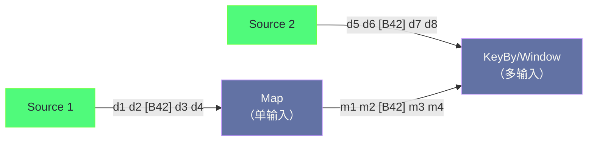
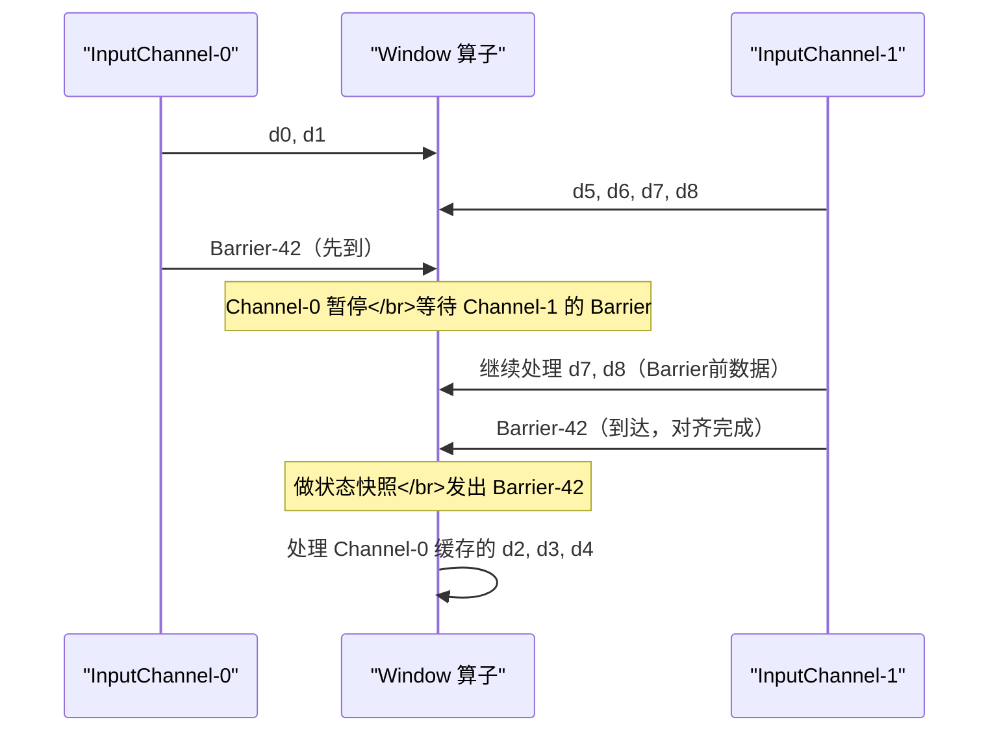
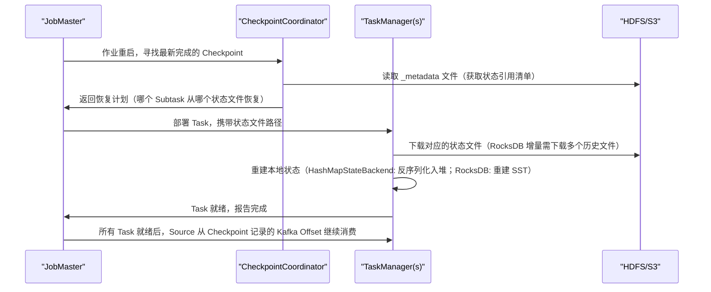

**摘要：**

Checkpoint 是 Flink 容错体系的核心，也是其实现"精确一次"语义的基础。其本质是 **Chandy-Lamport 分布式快照算法**在流处理场景中的工程化落地——在不停止数据流的前提下，对分布式系统的全局状态做一致性快照。本文从分布式快照的根本挑战出发，解析 Barrier 机制如何在有向无环图中传播和对齐，阐明为什么对齐可以保证快照的全局一致性，深入剖析 Checkpoint 的触发、执行、完成全流程（涉及 CheckpointCoordinator、TaskManager 快照线程、HDFS 写出的完整协议），并结合 Unaligned Checkpoint 和两阶段提交协议，解释端到端精确一次的完整实现路径。理解这些原理，才能在生产中正确地配置 Checkpoint 参数，在故障时快速定位根因。

---

## 第 1 章 分布式快照的根本挑战

### 1.1 为什么分布式快照很难

在单机程序中，快照（Snapshot）很简单——暂停程序，把内存状态写入磁盘，恢复时读回来。但在 Flink 这样的分布式系统中，"全局状态"分散在数十乃至数千个 Task 中，且这些 Task 之间通过网络通道持续传输数据。

难点在于：**网络通道中"在途"的数据（In-flight Messages）也是全局状态的一部分**。

考虑一个最简单的例子：Task A 向 Task B 传送数据，A 已处理消息 100，B 只处理了消息 80，消息 81-100 正在网络传输中。

此时若分别对 A 和 B 做快照：
- **先快照 A，再快照 B**：A 的状态反映了处理消息 100 后的结果，B 的状态反映了处理消息 80 后的结果。网络中的消息 81-100 既不在 A 的快照中（A 已处理），也不在 B 的快照中（B 未处理）——这 20 条消息从全局视角"消失"了，快照不一致。
- **先快照 B，再快照 A**：A 的快照包含了处理消息 100 后的状态，B 的快照只有消息 80 的状态，从全局来看消息 81-100 被计算了两次——快照依然不一致。

这就是分布式快照的根本难题：如何在不停止整个系统的情况下，对所有节点的状态做出一个**全局一致的快照**。

### 1.2 Chandy-Lamport 算法：分布式快照的经典解法

1985 年，Leslie Lamport 和 K. Mani Chandy 在论文《Distributed Snapshots: Determining Global States of Distributed Systems》中提出了解决方案，核心思想是：

**引入一种特殊的标记消息（Marker），让 Marker 随着正常数据流传播。每个节点收到 Marker 后，立即对自己的状态做快照，并将 Marker 转发给下游。这样，全局快照的"分割线"就是 Marker 在各个通道中的位置。**

Marker 将数据流划分为两部分：
- Marker **之前**的数据：已被该节点处理，体现在该节点的快照状态中
- Marker **之后**的数据：尚未处理，不在快照中（故障恢复时需要重新处理）

这样，对于任意一条数据：
- 如果它在所有通道中都在 Marker 之前到达→ 它的效果被纳入全局快照
- 如果它在任意通道中在 Marker 之后到达→ 它不在快照中，需要重放

全局快照的一致性得以保证：快照中不会有数据被"双计"，也不会有数据被"漏计"。

---

## 第 2 章 Flink 的 Checkpoint Barrier 机制

### 2.1 Barrier：Flink 对 Marker 的具体实现

Flink 将 Chandy-Lamport 算法中的 Marker 实现为 **Checkpoint Barrier（检查点屏障）**。Barrier 是一种特殊的流内消息，携带 Checkpoint ID（如 ID=42），它随着正常数据流在 Task 之间传播，作用与 Chandy-Lamport 的 Marker 完全对应。



**Barrier 的传播规则**：
1. Source 算子收到 CheckpointCoordinator 的触发指令后，在当前数据位置插入 Barrier，发往下游
2. 单输入算子（如 Map）：收到 Barrier → 立即做快照 → 将 Barrier 发往下游
3. 多输入算子（如 KeyBy → Window，有多个上游）：需要等待**所有输入通道的 Barrier 都到达后**（Barrier 对齐），才做快照，然后将 Barrier 发往下游

### 2.2 Barrier 对齐：保证多输入算子快照一致性

多输入算子的 Barrier 对齐是整个 Checkpoint 机制最关键也最容易误解的部分。

考虑一个有 2 个输入通道的 Window 算子（来自 Source-0 和 Source-1）：

```
时间→
InputChannel-0: d0 d1 [Barrier-42] d2 d3 d4...
InputChannel-1: d5 d6 d7 d8 [Barrier-42] d9...
```

**Barrier-42 先从 Channel-0 到达（在 d1 之后），Channel-1 的 Barrier-42 还未到（还在 d7 之后）**。

此时若立刻做快照（不对齐），Channel-0 中 Barrier-42 之后的 d2、d3、d4 已经处理（因为快照发生时 d2...d4 可能还没到，但 Channel-1 中 d5...d8 都在 Barrier 之前，这些会被处理并体现在快照中）。

快照时：
- Channel-0：已处理 d0、d1，快照后处理 d2...; → 快照包含 d0、d1 的效果
- Channel-1：已处理 d5、d6、d7、d8（都在 Barrier 之前），快照包含这些效果

但如果**不对齐**，Channel-0 的 d2、d3、d4（Barrier 之后的数据）在等待期间被处理，它们的效果也进入快照——这打破了 Chandy-Lamport 的一致性保证（d2...d4 既在快照中，又会被故障恢复后重放，导致双计）。

**对齐的操作**：

收到 Channel-0 的 Barrier-42 后：
1. **暂停 Channel-0 的数据处理**：Channel-0 中 Barrier-42 之后到来的 d2、d3、d4 被缓存在 Buffer 中，不处理
2. **继续处理 Channel-1 的数据**：直到 Channel-1 的 Barrier-42 也到达
3. **两个 Barrier 都到达（对齐完成）** → 做快照 → 将 Barrier-42 发往下游 → 恢复处理 Channel-0 的缓存数据

对齐确保了：快照时，所有输入通道中 Barrier 之前的数据都已被处理，Barrier 之后的数据都未被处理——全局快照一致。



> [!note] 设计哲学：对齐的代价与必要性
> Barrier 对齐会引入额外延迟——在等待慢通道的 Barrier 期间，快通道的后续数据被缓存（占用内存），且这段时间不能处理 Channel-0 的新数据。这正是高反压场景下 Checkpoint 超时的根因（反压 → 数据积压 → 对齐等待时间拉长）。但对齐是保证 **EXACTLY_ONCE** 语义的必要代价。如果接受 AT_LEAST_ONCE，可以不对齐（允许重放），此时收到任意 Barrier 就立刻做快照，无需等待其他通道。

---

## 第 3 章 Checkpoint 全流程剖析

### 3.1 触发阶段：CheckpointCoordinator 发令

Checkpoint 的触发由运行在 **JobMaster** 中的 `CheckpointCoordinator` 负责，它周期性地检查是否满足触发条件，并协调整个 Checkpoint 的生命周期。

**触发条件检查**：

```java
// CheckpointCoordinator 的触发逻辑（简化）：
// 1. 距上次 Checkpoint 完成的时间 >= minPauseBetweenCheckpoints（最小间隔）
// 2. 当前没有超过 maxConcurrentCheckpoints 个 Checkpoint 在进行中
// 3. 作业状态是 RUNNING（不能在 RESTARTING 状态触发）
if (满足条件) {
    long checkpointId = ++checkpointIdCounter;  // 递增的 Checkpoint ID
    // 向所有 Source Task 发送 TriggerCheckpoint RPC 消息
    for (ExecutionVertex source : sourceVertexes) {
        source.triggerCheckpoint(checkpointId, timestamp, checkpointOptions);
    }
    // 记录此次 Checkpoint 的 PendingCheckpoint 对象（等待所有 Task 汇报完成）
    pendingCheckpoints.put(checkpointId, new PendingCheckpoint(...));
}
```

**PendingCheckpoint** 是 CheckpointCoordinator 维护的一个"收集器"，记录了哪些 Task 已经完成了本次 Checkpoint 的快照，等待所有 Task 都汇报后，才认定本次 Checkpoint 完成（全局确认阶段）。

### 3.2 执行阶段：Barrier 传播 + 状态快照

**Source Task 的动作**：

收到 `TriggerCheckpoint` 消息后，Source Task：
1. 记录当前的数据读取位点（如 Kafka 的 `topic-partition → offset` 映射）
2. 在输出流中插入 Barrier（每个 SubPartition 插入一个 Barrier）
3. **异步**对自己的状态（Kafka Offset = Operator State）做快照，序列化写入 HDFS/S3
4. 快照完成后，通知 CheckpointCoordinator：`AcknowledgeCheckpoint(checkpointId, stateHandle)`

**中间算子（Map、Filter、Window 等）的动作**：

1. 等待所有输入通道的 Barrier 对齐（多输入算子）
2. 触发同步快照阶段（极短，通常微秒级）：
   - 对于 `HashMapStateBackend`：对 StateTable 的 HashMap 执行 Copy-on-Write，获得快照视图
   - 对于 `EmbeddedRocksDBStateBackend`：调用 RocksDB 的 `getSnapshot()`，获得 RocksDB 快照引用（不实际复制数据）
3. 恢复数据处理（不等待异步写出完成）
4. **后台线程**执行异步快照阶段：
   - 遍历快照视图，序列化状态对象
   - 写入 HDFS/S3（对于 RocksDB 增量 Checkpoint，只上传新增 SST 文件）
5. 写出完成，通知 CheckpointCoordinator

**Checkpoint 数据的目录结构**（写入 HDFS/S3 的格式）：

```
hdfs:///flink/checkpoints/
  └── job-{jobId}/
        ├── chk-42/                    ← Checkpoint ID=42
        │   ├── _metadata              ← Checkpoint 元数据（状态引用清单）
        │   ├── 0_0                    ← Subtask 0-0 的状态文件
        │   ├── 0_1                    ← Subtask 0-1 的状态文件
        │   └── ...
        └── chk-43/                    ← Checkpoint ID=43（增量：只有变化的文件）
            ├── _metadata
            └── rocksdb-sst-004.sst   ← 增量 SST 文件
```

### 3.3 完成阶段：全局确认与 Commit

当 **所有** Task（包括所有 Source、所有中间算子、所有 Sink）都向 CheckpointCoordinator 汇报了 `AcknowledgeCheckpoint`，CheckpointCoordinator 认定本次 Checkpoint 完成：

1. **写入 Checkpoint 元数据**（`_metadata` 文件）：记录每个 Subtask 的状态文件路径、Kafka Offset、Checkpoint 时间戳等
2. **通知所有 Task Checkpoint 完成**（`NotifyCheckpointComplete` RPC）：Task 收到后执行 `notifyCheckpointComplete()` 回调——这是触发外部系统 Commit 的时机（见第 4 章，两阶段提交）
3. **清理旧 Checkpoint**：根据 `state.checkpoints.num-retained` 配置，删除过期的 Checkpoint 目录

### 3.4 恢复阶段：从 Checkpoint 重建全局状态

当作业因 TaskManager 故障而重启时（或手动从 Checkpoint/Savepoint 恢复），恢复过程如下：



**故障恢复的语义保证**：

恢复后，Source 从 Checkpoint 时记录的 Kafka Offset 继续消费（而不是从最新 Offset）。这意味着 Checkpoint 之后、故障之前已经处理过的消息会被**重放**——即 AT_LEAST_ONCE 的基础。要达到 EXACTLY_ONCE，还需要 Sink 端的去重或幂等机制（见第 4 章）。

---

## 第 4 章 端到端精确一次：两阶段提交协议

### 4.1 仅靠 Checkpoint 无法实现端到端精确一次

Checkpoint 保证的是**算子内部状态的精确一次**——状态（ValueState、MapState 等）在故障恢复后完全一致，没有重复计算。

但是，对于**外部写入**（如写 Kafka、写 MySQL），Checkpoint 完成后才执行的写入没有问题，但 Checkpoint 之间的写入——如果在 Checkpoint 之后、下一次 Checkpoint 之前发生故障，已经写入外部系统的数据无法"撤回"，恢复后会被重放写入（因为 Kafka Offset 回退到上一个 Checkpoint），导致外部系统出现重复数据。

这就需要**端到端的精确一次机制**——即使在故障恢复重放时，外部系统也不会出现重复数据。

### 4.2 两阶段提交（2PC）协议

Flink 通过在 Sink 端实现**两阶段提交（Two-Phase Commit，2PC）**来实现端到端精确一次。原理如下：

**Phase 1（Pre-Commit，预提交）**：

在 Checkpoint 期间（收到 Barrier 后，做快照之前），Sink 对当前批次的数据执行"预提交"：
- **Kafka Sink**：将数据写入 Kafka 事务（`beginTransaction()` → `send()`），但**不提交事务**（数据对消费者不可见）
- **JDBC Sink**：开启数据库事务，写入数据，但不 commit

**Phase 2（Commit，正式提交）**：

当 CheckpointCoordinator 确认 Checkpoint 完成，向所有 Task 发送 `NotifyCheckpointComplete` 时，Sink 调用 `notifyCheckpointComplete()` 回调，**正式提交事务**：
- **Kafka Sink**：调用 `commitTransaction()`，数据对消费者可见
- **JDBC Sink**：执行 `connection.commit()`

**故障场景分析**：

```
场景一：Checkpoint 完成前故障
  → 预提交的事务随故障自动回滚（Kafka 事务超时回滚）
  → 从上一个 Checkpoint 恢复，重新处理数据
  → 重处理时重新预提交、重新提交 → 数据只提交一次 ✓

场景二：Checkpoint 完成、通知 Commit 前故障
  → 状态已保存在 Checkpoint 中，恢复时 Flink 会重新发送 NotifyCheckpointComplete
  → Sink 重新提交已预提交的事务 ✓

场景三：Commit 中途故障（部分提交）
  → 2PC 的标准问题，通过幂等提交解决
  → Kafka 事务 ID 全局唯一，重复提交相同事务 ID 不会产生重复数据 ✓
```

### 4.3 TwoPhaseCommitSinkFunction 的实现模式

Flink 提供了 `TwoPhaseCommitSinkFunction<IN, TXN, CONTEXT>` 抽象类，封装了 2PC 的框架，用户只需实现四个抽象方法：

```java
public class TransactionalJdbcSink
        extends TwoPhaseCommitSinkFunction<OrderEvent, Connection, Void> {

    @Override
    protected Connection beginTransaction() throws Exception {
        // Phase 1 开始：开启一个新的数据库事务
        Connection conn = DriverManager.getConnection(jdbcUrl, user, pass);
        conn.setAutoCommit(false);
        return conn;  // 返回的 Connection 作为"事务句柄"
    }

    @Override
    protected void invoke(Connection transaction, OrderEvent value, Context context)
            throws Exception {
        // 在事务中写入数据（不提交）
        PreparedStatement stmt = transaction.prepareStatement("INSERT INTO orders VALUES(?,?,?)");
        stmt.setLong(1, value.getOrderId());
        stmt.setDouble(2, value.getAmount());
        stmt.setLong(3, value.getTimestamp());
        stmt.executeUpdate();
    }

    @Override
    protected void preCommit(Connection transaction) throws Exception {
        // Checkpoint 完成前调用（可以做一些验证，通常留空）
    }

    @Override
    protected void commit(Connection transaction) {
        // Phase 2：NotifyCheckpointComplete 时调用，正式提交
        try {
            transaction.commit();
            transaction.close();
        } catch (Exception e) {
            // commit 失败处理：记录日志，等待下次重试
        }
    }

    @Override
    protected void abort(Connection transaction) {
        // Checkpoint 失败或作业取消时调用，回滚事务
        try {
            transaction.rollback();
            transaction.close();
        } catch (Exception e) { ... }
    }
}
```

> [!warning] 生产避坑：2PC 对外部系统的要求
> 端到端 EXACTLY_ONCE 要求外部系统支持以下特性：
> 1. **事务支持**：能开启、提交、回滚事务（如 Kafka 事务、MySQL 事务）
> 2. **事务幂等性**：相同事务 ID 重复提交不会产生重复效果（Kafka Producer 通过 `transactional.id` 实现）
> 3. **事务超时配置**：事务必须有超时机制，避免因 Flink 故障导致事务永久占用资源
>
> 不支持事务的外部系统（如 HBase、Elasticsearch）无法通过 2PC 实现 EXACTLY_ONCE，只能通过幂等写入（如使用唯一 ID 去重）来近似实现。

---

## 第 5 章 Unaligned Checkpoint 深度解析

### 5.1 为什么 Unaligned Checkpoint 能绕过对齐等待

在 [[04 Flink 网络传输与反压机制深度解析]] 中提到，高反压场景下 Barrier 对齐等待时间极长，导致 Checkpoint 超时失败。Flink 1.11 引入的 **Unaligned Checkpoint（UAC）** 通过改变"什么时候做快照"来解决这个问题。

**核心区别**：

- **Aligned Checkpoint**：收到**所有**输入通道的 Barrier 后（对齐完成），才做快照。快照只包含算子当前状态，不包含 Buffer 中的数据。
- **Unaligned Checkpoint**：收到**第一个** Barrier 后，**立刻**做快照。快照包含算子当前状态**加上**所有输入 Buffer 中 Barrier 之前尚未处理的数据（即"飞行中的数据"）。

### 5.2 Unaligned Checkpoint 的快照内容

以一个有 2 个输入的算子为例，Channel-0 的 Barrier 先到，Channel-1 的 Barrier 还在数据队列后面：

```
Aligned Checkpoint 的快照内容（等对齐后）：
  只有算子的 KeyedState / OperatorState

Unaligned Checkpoint 的快照内容（第一个 Barrier 到就快照）：
  算子的 KeyedState / OperatorState
  + Channel-0 中 Barrier 之后的 in-flight 数据（d2, d3, d4）
  + Channel-1 中的全部 in-flight 数据（d5, d6, d7, d8，包括 Barrier 本身之前的数据）
  + 输出 Buffer 中的 in-flight 数据（已序列化等待发送的数据）
```

**为什么包含这些数据能保证一致性**：

故障恢复时，Flink 从 Checkpoint 中恢复这些 in-flight 数据，将其注入对应的输入通道，相当于"把当时网络中传输的数据原样还原"。算子再处理这些 in-flight 数据时，状态回到 Checkpoint 时的值，从而保证全局一致性。

### 5.3 Unaligned Checkpoint 的代价与适用场景

**代价一：Checkpoint 体积大幅增加**

积压的数据越多（反压越严重），in-flight 数据越多，Checkpoint 体积越大。极端情况下（严重反压 + 大量数据积压），UAC 的 Checkpoint 体积可能比正常状态大几十倍。

**代价二：恢复时间更长**

恢复时需要"注入"保存的 in-flight 数据到输入 Buffer，然后重新处理，这比直接从 Kafka 重放数据更复杂，恢复时间更长。

**代价三：输出端的数据顺序可能变化**

UAC 期间，Barrier 被"超越"（先发往下游），导致下游在接收到 Barrier 后，还可能收到来自上游 Barrier 之前的数据——下游的 Barrier 对齐语义被打破。Flink 通过在下游记录每个通道的 Barrier 接收状态来处理这个问题，但增加了实现复杂度。

**推荐使用策略**：

```java
// 推荐：设置对齐超时，超时后自动降级为 UAC（而不是始终用 UAC）
env.getCheckpointConfig().setAlignedCheckpointTimeout(Duration.ofSeconds(30));

// 只在以下场景考虑始终开启 UAC：
// 1. 作业长期处于高反压状态，Aligned Checkpoint 几乎从未成功
// 2. 对 Checkpoint 完成时间有严格要求（如 SLA）
// env.getCheckpointConfig().enableUnalignedCheckpoints();
```

---

## 第 6 章 Checkpoint 性能优化

### 6.1 影响 Checkpoint 性能的因素

Checkpoint 的完成时间由以下因素决定：

**同步阶段（Sync Duration）**：Task 线程暂停处理数据，执行快照的时间。
- `HashMapStateBackend`：遍历 HashMap 获取快照视图，通常 < 1ms（Copy-on-Write 极快）
- `EmbeddedRocksDBStateBackend`：调用 RocksDB `getSnapshot()`，通常 < 5ms

**Barrier 传播延迟**：Barrier 从 Source 到所有下游算子的传播时间，受网络延迟和数据积压（反压）影响。

**对齐等待时间**：多输入算子等待所有 Barrier 到达的时间，受上游各通道的速度差异影响。

**异步写出时间（Async Duration）**：后台线程序列化状态并写入 HDFS/S3 的时间，受状态大小和 IO 带宽影响。

### 6.2 减少 Checkpoint 对吞吐的影响

**技巧一：确保异步快照开启**（HashMapStateBackend）

```java
// 确认异步快照没有被关闭
env.getCheckpointConfig().enableExternalizedCheckpoints(
    ExternalizedCheckpointCleanup.RETAIN_ON_CANCELLATION
);
// HashMapStateBackend 默认异步，可通过以下方式检查：
new HashMapStateBackend();  // 默认已开启异步
```

**技巧二：增大写出并发（RocksDB 增量 Checkpoint）**

RocksDB 增量 Checkpoint 支持并发上传多个 SST 文件：

```yaml
# 增量 Checkpoint 上传的并发数（默认 1）
state.backend.rocksdb.checkpoint.transfer.thread.num: 4
```

**技巧三：合理配置 minPauseBetweenCheckpoints**

```java
// 确保 Checkpoint 之间有足够的正常处理时间
// 比如 Checkpoint 耗时 30s，设置 minPause=30s，
// 则两次 Checkpoint 之间至少有 30s 正常处理 → Checkpoint 占比 ≈ 50%
env.getCheckpointConfig().setMinPauseBetweenCheckpoints(30_000);
```

**技巧四：使用本地恢复（Local Recovery）加速故障恢复**

```yaml
# 开启本地恢复：在 TaskManager 本地磁盘保留一份 Checkpoint 副本
# 本地故障（同一台机器重启）时直接从本地恢复，无需从 HDFS/S3 下载
cluster.local-recovery: true
```

> [!warning] 生产避坑：本地恢复的局限
> 本地恢复只能加速"同机器"上的恢复（如 TaskManager 进程崩溃后原地重启）。如果机器完全宕机（磁盘损坏），本地副本不可用，Flink 会降级到从 HDFS/S3 下载恢复。因此本地恢复是性能优化，而非替代 HDFS/S3 的冗余机制。

---

## 小结

Flink Checkpoint 机制的核心原理脉络：

**算法基础**：Chandy-Lamport 分布式快照算法——Barrier 将数据流分割为"已快照"和"未快照"两部分，保证全局快照一致性，无需停止数据处理。

**Barrier 对齐**：多输入算子收到第一个 Barrier 后缓存后续数据，等所有输入通道的 Barrier 都到达后才做快照——这是 EXACTLY_ONCE 的必要条件，代价是等待时间（高反压时变长）。

**全流程**：CheckpointCoordinator（JobMaster 侧）触发 → Source 插入 Barrier → Barrier 传播 + 各算子做快照 → 写入 HDFS/S3 → 所有 Task ACK → Coordinator 全局确认 → 通知 Sink Commit。

**端到端精确一次（2PC）**：Sink 在 Checkpoint 期间预提交事务（数据不可见），Checkpoint 全局确认后（`NotifyCheckpointComplete`）正式提交事务（数据可见）。要求外部系统支持事务和幂等提交。

**Unaligned Checkpoint**：第一个 Barrier 到达即做快照，将 in-flight Buffer 也纳入快照，彻底消除对齐等待。代价是 Checkpoint 体积大、恢复时间长。推荐通过 `alignedCheckpointTimeout` 在高反压时自动降级，而非始终开启。

下一篇 [[07 Flink 时间与 Watermark 底层机制]] 将深入 Watermark 在算子间的传播规则（最小值语义的由来）、Key Group 哈希空间的设计，以及 Timer 服务的底层实现机制。


> [!note] 思考题
> 1. Flink 的 Checkpoint 使用 Chandy-Lamport 算法的变体——通过在数据流中插入 Barrier 消息来触发所有 Task 的快照。Barrier 对齐（Aligned Checkpoint）要求多输入算子等待所有输入流的 Barrier 都到齐后才拍摄快照。在某个输入流速度很慢（或发生反压）的情况下，Barrier 对齐会导致其他输入流的数据积压在 Input Buffer 中。这会占用多少额外内存？Flink 1.11 引入的 Unaligned Checkpoint 是如何解决这个问题的？
> 2. Savepoint 和 Checkpoint 都是 Flink 的状态持久化机制，但设计目标不同：Checkpoint 用于故障恢复（自动触发、自动删除），Savepoint 用于手动管理（升级、迁移）。从 Savepoint 恢复时，Flink 允许修改算子的并行度和 uid。但如果在代码中删除了一个有状态算子（没有对应 uid 的 Savepoint 条目），默认行为是什么？如何配置 Flink 在这种情况下允许恢复？
> 3. Checkpoint 的性能直接影响作业的整体吞吐量——Checkpoint 期间，Task 需要将状态序列化并写入远程存储，这会占用网络 I/O 和 CPU 资源。在超大状态场景（如 TB 级 RocksDB State），异步快照（Asynchronous Snapshot）通过 RocksDB 的 SST 文件快照来避免阻塞数据处理。但如果在异步快照期间，状态发生了大量变更（大量新的 SST 文件生成），这会对 Checkpoint 的完整性产生影响吗？