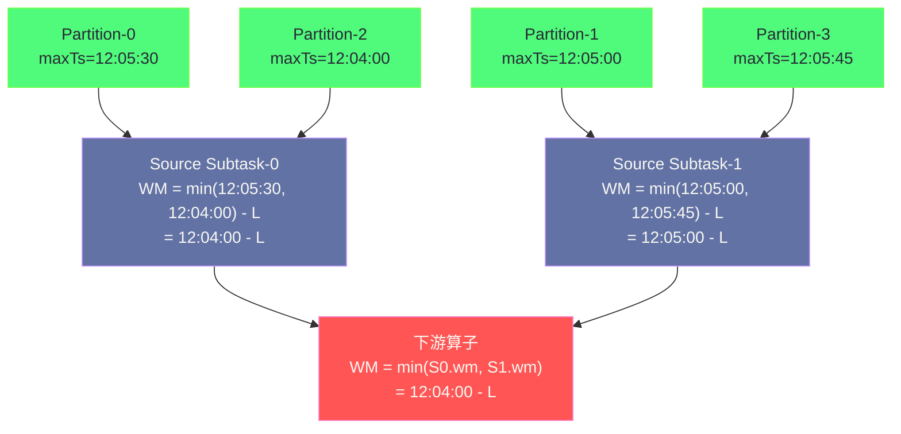

**摘要：**

Watermark 是 Flink 事件时间处理的核心机制，但绝大多数材料只讲了"Watermark 是什么"和"怎么用"，鲜有深入到"Watermark 在算子间如何传播"、"多分区 Source 的 Watermark 为什么取最小值"、"Timer 到底存在哪里、怎么被触发"这些根本性问题。本文从 Watermark 的本质语义出发，逐层深入：算子本地的 Watermark 推进机制、多输入算子的最小值传播语义与其背后的"全局时间进度"保证、空闲 Source 的 Watermark 阻塞问题及解决方案、`InternalTimerService` 的数据结构与 Timer 触发流程，以及与之密切相关的 Key Group 哈希空间设计——这是 Flink Savepoint 能够支持并行度变更的数学基础。

---

## 第 1 章 Watermark 的本质：流处理中的"时间进度断言"

### 1.1 重新理解 Watermark 的语义

Watermark 通常被解释为"允许数据乱序的最大延迟时间"，这个解释是正确的，但不够本质。

从更深的视角来看，Watermark 是一个**断言（Assertion）**：当算子收到 `Watermark(t)` 时，它被告知："事件时间早于 t 的所有数据已经到达，不会再来了。"

这个断言是**保守的**（而非精确的）：
- 发送方（Source 或 WatermarkGenerator）**承诺** Watermark(t) 之后不会再发出时间戳 < t 的数据
- 如果真的发来了时间戳 < t 的数据，这是迟到数据（Late Data），由 `allowedLateness` 处理或丢弃

Watermark 的数值本身代表了"系统认为当前事件时间已经推进到了哪里"。窗口触发的判断条件就是：**当前 Watermark ≥ 窗口结束时间**——只有当系统认为"窗口时间范围内的数据都到齐了"，才触发窗口计算。

### 1.2 Watermark 是特殊的流内消息

从实现角度，Watermark 是插入在数据记录之间的**特殊流内消息**，与正常数据记录在同一个通道中传输，遵循 FIFO 顺序。这意味着：

- Watermark(t) 之前的所有数据（时间戳 < t 的）在到达下游时，保证已被处理
- Watermark 随数据流传播，下游算子收到 Watermark 时，意味着上游到该 Watermark 为止的所有数据已经发送完毕

**Watermark 的两个约束**：
1. **单调递增**：Watermark 只能增大，不能回退（Flink 会自动丢弃倒退的 Watermark）
2. **跟随数据**：Watermark 不能超前于其"应该代表"的数据——如果数据还在网络中传输，不能提前发 Watermark 声称"那些数据已经到了"

---

## 第 2 章 Watermark 的生成机制

### 2.1 WatermarkGenerator 的调用时机

在 DataStream API 中，Watermark 由 `WatermarkStrategy` 中的 `WatermarkGenerator` 负责生成。`WatermarkGenerator` 有两个回调方法：

```java
public interface WatermarkGenerator<T> {
    // 每来一条记录调用（用于根据记录时间戳推进 Watermark）
    void onEvent(T event, long eventTimestamp, WatermarkOutput output);

    // 周期性调用（由 Flink 的 watermark-generator 定时器触发）
    // 频率由 auto-watermark-interval 参数控制（默认 200ms）
    void onPeriodicEmit(WatermarkOutput output);
}
```

`onEvent` 在每条记录处理时触发，适合"每条记录都可能推进 Watermark"的情况（如 `AscendingTimestampsWatermarks`：每收到一条时间戳更大的记录就推进 Watermark）。

`onPeriodicEmit` 是周期性触发的，适合"根据当前观测到的最大时间戳周期性发出 Watermark"（如 `BoundedOutOfOrdernessWatermarks`：每 200ms 检查一次最大时间戳，发出 maxTimestamp - maxOutOfOrderness 的 Watermark）。

**`BoundedOutOfOrdernessWatermarks` 的内部逻辑**：

```java
// 简化的 BoundedOutOfOrdernessWatermarks 实现
public class BoundedOutOfOrdernessWatermarks<T> implements WatermarkGenerator<T> {
    private long maxTimestamp = Long.MIN_VALUE + outOfOrdernessMillis;
    private final long outOfOrdernessMillis;

    @Override
    public void onEvent(T event, long eventTimestamp, WatermarkOutput output) {
        // 每来一条记录，更新最大时间戳（不立刻发 Watermark）
        maxTimestamp = Math.max(maxTimestamp, eventTimestamp);
    }

    @Override
    public void onPeriodicEmit(WatermarkOutput output) {
        // 每 200ms（auto-watermark-interval）发出一次 Watermark
        output.emitWatermark(new Watermark(maxTimestamp - outOfOrdernessMillis - 1));
        // 为什么 -1？因为窗口触发条件是 watermark >= windowEnd
        // 如果 windowEnd = 12:05:00.000，需要 watermark = 12:04:59.999（即 maxTimestamp - latency - 1）
        // 才能在恰好等到 12:05:00.000 之前（即第一条时间戳 >= 12:05:00.000 的数据 - latency）触发
    }
}
```

### 2.2 Watermark 的发出频率与延迟

Watermark 不是每条记录都发出（那样开销太大），而是通过 `ExecutionConfig.setAutoWatermarkInterval(ms)` 设置的定时器**周期性**发出。

```java
env.getConfig().setAutoWatermarkInterval(200);  // 每 200ms 发出一次 Watermark（默认）
```

这意味着：即使数据连续到来，Watermark 也是每 200ms 推进一次。**这引入了最多 200ms 的额外延迟**（窗口触发的最晚延迟 = 最大乱序时间 + 200ms）。对于延迟敏感的作业，可以减小这个间隔（如 50ms），但会增加 Watermark 消息的频率和处理开销。

---

## 第 3 章 Watermark 在算子间的传播规则

### 3.1 单输入算子：直接转发

对于只有一个上游（单输入）的算子（如 Map、Filter、FlatMap），Watermark 的传播规则极为简单：**原样转发**。

```
上游发出 Watermark(t=12:05:00)
  → 算子处理 Watermark
  → 算子发出 Watermark(t=12:05:00) 到下游（完全相同）
```

但有一个细节：算子本身可以在 Watermark 传播前"修改"它——如果算子有延迟（如 `TimestampAssigner` 或某些 `ProcessFunction` 中修改了时间戳），需要相应地更新 Watermark。对于大多数算子（无状态变换），直接转发。

### 3.2 多输入算子：Watermark 取最小值语义

这是最关键也最容易忽略的规则：**对于有多个上游输入的算子（如 Union、CoProcess、Window 的多分区输入），其 Watermark 等于所有输入通道当前 Watermark 的最小值。**

#### 3.2.1 为什么必须取最小值

以一个有 2 个上游 Source（S0 和 S1）的 Window 算子为例：

```
S0 → KeyBy → Window
S1 → KeyBy → Window（同一个 Window 算子，来自 S0 和 S1 的数据在此汇合）

当前状态：
  来自 S0 的 Watermark: 12:05:00
  来自 S1 的 Watermark: 12:03:00（S1 比较慢）
```

如果 Window 算子的 Watermark 取最大值（12:05:00），会发生什么？

时间戳在 12:03:00 ~ 12:05:00 之间的 S1 数据**尚未到达 Window 算子**（S1 的 Watermark 才到 12:03:00，说明 S1 那边还有时间戳在 12:03:00 之后的数据没有发出来）。如果 Window 算子此时认为"时间已到 12:05:00"并触发 12:00~12:05 的窗口，那么来自 S1 的、时间戳在 12:03:00~12:05:00 之间的数据到来时，就变成了"迟到数据"——被漏计算。

取最小值（12:03:00）的语义：**只有当所有输入通道都说"我这边的 12:03:00 之前的数据已经发完了"，Window 算子才认为"12:03:00 之前的所有数据都到齐了"**。这是一个全局时间进度的保守估计，确保不会漏计任何数据。

#### 3.2.2 多分区 Kafka Source 的 Watermark 合并

同样的规则适用于多分区 Kafka Source。一个 Source Subtask 负责消费多个 Kafka 分区：

```
Source Subtask-0 消费：Partition-0, Partition-2
  Partition-0 的最大时间戳：12:05:30
  Partition-2 的最大时间戳：12:04:00

Source Subtask-0 发出的 Watermark = min(12:05:30 - latency, 12:04:00 - latency)
                                   = 12:04:00 - latency
```

取最小值确保了：Subtask-0 的下游不会遗漏来自 Partition-2 的、时间戳在 12:04:00 之后的数据。



**从这个图可以直观理解**：下游算子的 Watermark 被 Source Subtask-0 所消费的最慢分区（Partition-2，maxTs=12:04:00）所限制。Partition-2 越慢，整条 Pipeline 的事件时间进度越慢，窗口触发越慢。

### 3.3 空闲 Source 对 Watermark 的阻塞问题

**问题**：如果某个 Source Subtask 消费的分区长时间没有新数据，其 Watermark 停止推进（因为没有新记录可以更新 maxTimestamp）。由于下游取最小值，整条 Pipeline 的 Watermark 也被冻结，窗口永远不触发。

**真实场景**：周末下午某个地区的用户活跃度很低，导致对应 Kafka 分区长时间无数据，影响了所有分区的统计窗口触发。

**解决方案：`WatermarkStrategy.withIdleness()`**

```java
WatermarkStrategy<OrderEvent> strategy = WatermarkStrategy
    .<OrderEvent>forBoundedOutOfOrderness(Duration.ofSeconds(5))
    .withIdleness(Duration.ofMinutes(1));
// 含义：如果某个 Source Subtask 超过 1 分钟没有收到新数据，
// 将其标记为"空闲（Idle）"，Watermark 传播时忽略空闲分区的贡献
// （不再将其 Watermark 纳入最小值计算）
```

**Idleness 的实现机制**：

当 Source Subtask 被标记为 Idle 时，它向下游发送一个特殊的 Watermark：`Watermark.MAX_WATERMARK`（= Long.MAX_VALUE / 2）。下游算子在计算最小值时，`MAX_WATERMARK` 不会成为限制因素，等效于"忽略了这个空闲 Subtask 的 Watermark"。

一旦空闲的 Source Subtask 重新收到数据，其 Watermark 会立刻回退到正常值（从 MAX_WATERMARK 回到实际计算的 Watermark），下游重新将其纳入最小值计算。

> [!warning] 生产避坑：Idleness 超时时间的设置
> `withIdleness` 的超时时间不能设置得过短——如果设为 1 秒，但某个分区偶尔有 2 秒的数据间隙（正常的生产波动），会被误判为空闲，导致该分区的 Watermark 被忽略，窗口可能被提前触发，遗漏来自该分区的数据。
>
> 建议将 Idleness 超时设置为比正常数据间隙大一个量级的值（如正常最大间隙 10 秒，Idleness 设为 1-2 分钟）。

---

## 第 4 章 Timer 服务：事件时间的触发引擎

### 4.1 Timer 是什么

Timer（定时器）是 Flink 中基于时间（事件时间或处理时间）触发回调的机制。Watermark 推进后，所有注册在 `t <= watermark` 时刻的事件时间 Timer 都会被触发。

在 `KeyedProcessFunction` 中，Timer 的使用如下：

```java
public class OrderTimeoutFunction extends KeyedProcessFunction<String, OrderEvent, AlertEvent> {

    // 记录订单的 Timer 时间戳（用于清除 Timer）
    private transient ValueState<Long> timerTsState;

    @Override
    public void open(Configuration parameters) {
        timerTsState = getRuntimeContext().getState(
            new ValueStateDescriptor<>("timer-ts", Long.class));
    }

    @Override
    public void processElement(OrderEvent event, Context ctx, Collector<AlertEvent> out)
            throws Exception {
        if ("ORDER_CREATED".equals(event.getType())) {
            // 注册 15 分钟后触发的事件时间 Timer
            long timerTs = event.getTimestamp() + 15 * 60 * 1000L;
            ctx.timerService().registerEventTimeTimer(timerTs);
            timerTsState.update(timerTs);
        } else if ("ORDER_PAID".equals(event.getType())) {
            // 已支付：删除 Timer（不需要超时报警）
            Long timerTs = timerTsState.value();
            if (timerTs != null) {
                ctx.timerService().deleteEventTimeTimer(timerTs);
                timerTsState.clear();
            }
        }
    }

    @Override
    public void onTimer(long timestamp, OnTimerContext ctx, Collector<AlertEvent> out)
            throws Exception {
        // Timer 触发：订单 15 分钟内未支付
        out.collect(new AlertEvent(ctx.getCurrentKey(), "ORDER_TIMEOUT", timestamp));
        timerTsState.clear();
    }
}
```

Window 算子内部也大量使用 Timer——当 Watermark 推进时，Window 的触发本质上是通过一个"窗口结束时间"的 Timer 来实现的（注册在 windowEnd 时刻，Watermark 超过 windowEnd 时触发）。

### 4.2 InternalTimerService 的数据结构

Timer 由 `InternalTimerService` 管理，内部维护两套数据结构：

**事件时间 Timer 的存储**：使用**堆（Heap）**数据结构（具体是 `TreeSet<InternalTimer>` 或优先队列），按触发时间升序排列。

```
eventTimeTimers（按触发时间升序排列的有序集合）：
  → InternalTimer(key="user_A", namespace=VoidNamespace, timestamp=12:10:00.000)
  → InternalTimer(key="user_B", namespace=VoidNamespace, timestamp=12:10:05.000)
  → InternalTimer(key="user_C", namespace=Window[12:00,12:10), timestamp=12:10:00.000)
  → ...
```

**处理时间 Timer 的存储**：同样是有序集合，但按系统时钟时间排列。

**Timer 的 Key 组成**：每个 Timer 由 `(key, namespace, timestamp)` 三元组唯一标识。

- **key**：当前正在处理的 KeyedStream 的 Key（如 userId）
- **namespace**：Timer 所属的命名空间（对于窗口 Timer，namespace = 窗口 `[start, end)`；对于直接在 ProcessFunction 中注册的 Timer，namespace = `VoidNamespace`）
- **timestamp**：触发时刻

### 4.3 Watermark 推进触发 Timer 的完整流程

当一个 Watermark 到达某个算子时，触发流程如下：

```java
// 算子内部的 Watermark 处理逻辑（简化）
void processWatermark(Watermark mark) {
    // 1. 更新本地 currentWatermark
    if (mark.getTimestamp() > currentWatermark) {
        currentWatermark = mark.getTimestamp();
    }

    // 2. 触发所有 timestamp <= currentWatermark 的事件时间 Timer
    InternalTimer<K, N> timer;
    while ((timer = eventTimeTimers.peek()) != null
           && timer.getTimestamp() <= currentWatermark) {

        eventTimeTimers.poll();  // 从堆中移除

        // 恢复该 Timer 对应的 Key 和 Namespace 上下文
        keyContext.setCurrentKey(timer.getKey());

        // 调用用户代码的 onTimer() 方法
        triggerTarget.onEventTime(timer.getTimestamp(), timer.getNamespace(), out);
    }

    // 3. 将 Watermark 转发给下游
    output.emitWatermark(mark);
}
```

**重要细节**：步骤 2 中，**同一个 Watermark 可能触发多个 Timer**（如果有多个 Timer 的 timestamp ≤ 当前 Watermark）。这些 Timer 按时间顺序依次触发（从最早到最晚）。

对于 Window 算子，每个窗口的触发就是在 `windowEnd` 时刻注册了一个 Timer，Watermark 超过 `windowEnd` 时该 Timer 触发，调用窗口函数。

### 4.4 Timer 状态与 Checkpoint 的关系

Timer 也是作业状态的一部分，在 Checkpoint 时被序列化保存，故障恢复后重新加载。这保证了：即使作业在 Timer 触发前发生故障，恢复后 Timer 仍然会在正确的时间（Watermark 再次推进到触发点时）被触发。

**Timer 与 RocksDB**：当使用 `EmbeddedRocksDBStateBackend` 时，Timer 数据存储在 RocksDB 中（而不是堆内存）。这意味着：
- 大量 Timer（如每个 Key 都有一个 Timer）不会撑爆 JVM 堆
- 但 Timer 的注册/查询有 RocksDB 的序列化开销

---

## 第 5 章 Key Group：Savepoint 支持并行度变更的数学基础

### 5.1 Key Group 的定义

Flink 中每个 Key 都被分配到一个 **Key Group**。Key Group 是状态在不同并行度之间**重新分配的最小单元**。

```
Key Group 的分配规则：
  keyGroupIndex = MathUtils.murmur3_32(key) % maxParallelism

  其中 maxParallelism 是作业的最大并行度（可配置，默认 128），
  而不是当前实际并行度（parallelism）
```

关键点：Key Group 的总数等于 `maxParallelism`，与当前实际并行度无关。

**为什么要区分 maxParallelism 和 parallelism**：

假设 `maxParallelism = 128`，那么 Key Group 0 ~ 127 共 128 个：
- 当 `parallelism = 4` 时：每个 Subtask 负责 32 个 Key Group（0-31, 32-63, 64-95, 96-127）
- 当 `parallelism = 8` 时：每个 Subtask 负责 16 个 Key Group（0-15, 16-31, ...）
- 当 `parallelism = 128` 时：每个 Subtask 负责 1 个 Key Group

**Key Group 是 Savepoint 支持并行度扩缩容的关键**：从 Savepoint 恢复时，只需要重新划分每个 Subtask 负责哪些 Key Group，Key Group 内部的状态数据不需要迁移（因为 Key → Key Group 的映射是固定的，不依赖并行度）。

### 5.2 Key Group 的哈希空间设计

Flink 使用 **Murmur3 哈希**将 Key 映射到 Key Group：

```java
// 简化的 Key → Key Group 映射
int keyGroupIndex = MathUtils.murmur3_32(Objects.hashCode(key)) 
                    % maxParallelism;
// Murmur3 的特性：
// 1. 分布均匀：不同 Key 均匀分布到 0 ~ maxParallelism-1
// 2. 确定性：相同 Key 永远映射到相同的 Key Group
// 3. 与 parallelism 无关：maxParallelism 固定，Key Group 固定
```

**Key Group 到 Subtask 的映射**：

```
Subtask i 负责的 Key Group 范围：
  start = (i * maxParallelism) / parallelism
  end   = ((i+1) * maxParallelism) / parallelism - 1

例：parallelism=4, maxParallelism=128
  Subtask-0: Key Group [0, 31]
  Subtask-1: Key Group [32, 63]
  Subtask-2: Key Group [64, 95]
  Subtask-3: Key Group [96, 127]

扩容到 parallelism=8 时：
  Subtask-0: Key Group [0, 15]   ← 原 Subtask-0 的前一半
  Subtask-1: Key Group [16, 31]  ← 原 Subtask-0 的后一半
  Subtask-2: Key Group [32, 47]  ← 原 Subtask-1 的前一半
  ...

Savepoint 恢复时：
  将原 Subtask-0 的 Key Group [0,31] 中的 [0,15] 分给新 Subtask-0，[16,31] 分给新 Subtask-1
  只需要从 Savepoint 文件中提取对应 Key Group 范围的状态数据，无需重新计算或迁移数据
```

这就是为什么 Flink 能支持从 Savepoint 以不同并行度恢复：**Key Group 是状态分配的逻辑单元，其与物理 Subtask 的对应关系可以根据新的并行度重新划分**，而不需要重新 shuffle 数据。

> [!note] 设计哲学：maxParallelism 的不可变性
> `maxParallelism` 一旦设置，对于给定的 Savepoint/Checkpoint 就不能改变（因为 Key → Key Group 的映射依赖于 `maxParallelism`，改变它会打乱所有 Key 的分配）。这就是为什么 `maxParallelism` 需要在作业创建之初就设置好足够大的值（默认 128）。如果你预期作业可能扩容到超过 128 的并行度，必须提前设置：
> ```java
> env.setMaxParallelism(512);  // 在作业第一次启动时设置，之后不可改变
> ```

---

## 第 6 章 处理时间 Timer 与事件时间 Timer 的实现差异

### 6.1 处理时间 Timer：系统时钟驱动

处理时间 Timer 基于系统时钟触发，与数据流无关。Flink 启动一个专用的调度线程，定期检查是否有处理时间 Timer 到期：

```java
// ProcessingTimeService 的调度机制（简化）
ScheduledThreadPoolExecutor scheduler = new ScheduledThreadPoolExecutor(1);

// 注册处理时间 Timer：在 targetTime 时刻触发
public ScheduledFuture<?> registerTimer(long targetTime, ProcessingTimeCallback callback) {
    long delay = targetTime - System.currentTimeMillis();
    return scheduler.schedule(
        () -> callback.onProcessingTime(targetTime),
        Math.max(delay, 0),
        TimeUnit.MILLISECONDS
    );
}
```

**处理时间 Timer 的特点**：
- 触发时机确定（取决于系统时钟，不受数据流速度影响）
- 不受 Watermark 影响
- 故障恢复时，处理时间 Timer 的触发时机会"跳变"——恢复后立刻触发所有过期的处理时间 Timer（因为恢复时系统时钟已经超过了原来的 Timer 时间）

### 6.2 事件时间 vs 处理时间 Timer 的触发顺序保证

**事件时间 Timer**：严格按照事件时间顺序触发（因为 Watermark 单调递增，先到期的 Timer 一定先触发）。同一 Watermark 推进时，所有到期的 Timer 按时间戳升序触发。

**处理时间 Timer**：基于系统时钟，多个 Timer 的触发顺序可能不完全符合注册顺序（受调度延迟影响），但通常符合。

**混用两种 Timer 时**：处理时间 Timer 和事件时间 Timer 的触发是独立的，没有互相影响。

---

## 小结

Flink 时间与 Watermark 底层机制的核心要点：

**Watermark 语义**：一个保守断言——"事件时间 < t 的数据已全部到达"。单调递增，随数据流传播。

**多输入算子取最小值**：保证全局时间进度的一致性——只有当所有输入通道都推进到时间 t，才认为"t 之前的所有数据都到了"。这是窗口触发正确性的基础。

**空闲 Source 的 Watermark 阻塞**：空闲分区会冻结下游的事件时间进度。通过 `withIdleness()` 标记空闲 Subtask（发出 MAX_WATERMARK），下游忽略其 Watermark 贡献。

**InternalTimerService**：维护有序堆结构（按触发时间升序）。Watermark 推进时，逐个弹出 ≤ currentWatermark 的 Timer 并触发 `onTimer()` 回调。Timer 状态纳入 Checkpoint，故障恢复后重新触发。

**Key Group 设计**：Key → Key Group 的映射依赖 `maxParallelism`（固定值），与实际 parallelism 无关。Savepoint 恢复时通过重新划分 Key Group 到 Subtask 的对应关系，实现并行度的动态变更，无需数据迁移。

下一篇 [[08 Flink SQL 与 Blink Planner 深度解析]] 将深入 Flink SQL 的查询优化层——Blink Planner 如何将 SQL 查询转化为 DataStream 执行计划，`RelNode` 树的优化规则，以及 MiniBatch、LocalGlobalAgg 等关键优化策略的内部实现。
