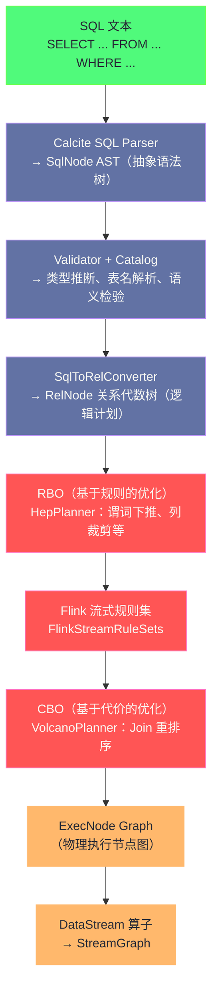

**摘要：**

Flink SQL 的背后是一套完整的查询编译与优化流水线，而不是简单地将 SQL 语句"翻译"成 DataStream 算子。从用户提交一条 SQL 语句，到最终生成可执行的 StreamGraph，中间经历了：SQL 解析（Calcite SQL Parser）→ 语义验证（Validator）→ 关系代数树（RelNode Tree）→ 优化规则应用（RBO + CBO）→ 物理执行计划（ExecNode Graph）→ DataStream 算子链。本文的核心是解释每个阶段"为什么这样设计"：Calcite 为什么采用关系代数作为中间表示？RBO（基于规则的优化）和 CBO（基于代价的优化）各自负责什么，两者如何协同？MiniBatch、LocalGlobalAgg 这两个 Flink SQL 特有的流式优化策略的内部实现机制是什么？理解这条流水线，才能在面对 SQL 性能问题时有准确的优化思路，而不是靠猜测调参。

---

## 第 1 章 Blink Planner 的由来与演进

### 1.1 从 Flink Planner 到 Blink Planner

Flink SQL 的查询优化器经历了一次重要的架构替换：

**原生 Flink Planner（旧版）**：
- Flink 1.9 之前的默认 Planner
- 基于 [[Apache Calcite]] 的 HepPlanner（启发式优化器，纯 RBO）
- 不支持 CBO，优化规则有限
- 流和批的优化逻辑分离，难以维护

**Blink Planner（新版）**：
- 阿里巴巴内部基于 Flink 1.x 开发的增强版 Planner，2019 年开源并贡献给 Apache Flink（随 Flink 1.9 合入主干）
- 同时支持 RBO 和 CBO（基于 Calcite 的 VolcanoPlanner）
- 流和批统一的优化框架（通过 `ExecEnv` 区分）
- 引入了大量流式特有的优化规则（MiniBatch、LocalGlobalAgg、Rank Optimization 等）
- **Flink 1.14 起 Blink Planner 成为唯一 Planner，原生 Flink Planner 移除**

Blink Planner 是 Flink SQL 成为生产级流处理 SQL 引擎的关键里程碑，它将阿里巴巴在双十一等大规模实时计算场景中积累的优化经验系统化地引入了开源社区。

---

## 第 2 章 SQL 编译流水线全景

### 2.1 从 SQL 文本到 StreamGraph 的完整路径



### 2.2 第一阶段：Calcite SQL Parser → SqlNode AST

Flink SQL 使用 [[Apache Calcite]] 的 SQL 解析器将 SQL 文本解析为 **SqlNode 抽象语法树（AST）**。这一阶段是纯语法层面的解析，不涉及语义——只要语法正确（关键字、括号、运算符匹配），就能生成 SqlNode 树。

```
SQL 文本：
  SELECT user_id, SUM(amount) FROM orders WHERE amount > 100 GROUP BY user_id

SqlNode AST（简化表示）：
  SqlSelect
    ├── SelectList: [user_id, SUM(amount)]
    ├── From: orders（SqlIdentifier）
    ├── Where: amount > 100（SqlBasicCall）
    └── GroupBy: [user_id]
```

Flink 在 Calcite 的标准 SQL 解析器基础上进行了**扩展**（通过 Calcite 的 `SqlParserImpl` 自定义机制），支持 Flink 特有的语法：
- `CREATE TABLE ... WITH (...)` （DDL with connector options）
- `WATERMARK FOR ts AS ...`（Watermark 声明）
- `MATCH_RECOGNIZE`（CEP 模式匹配）
- TVF 窗口函数（`TUMBLE(TABLE t, ...)`）

### 2.3 第二阶段：Validator → 语义验证与类型推断

`SqlNode AST` 只是语法树，此阶段的 `SqlValidator` 负责：

1. **表名解析**：将 `orders` 解析为 Catalog 中注册的具体表定义，获取其 Schema（字段名、类型）
2. **类型推断**：推断每个表达式的数据类型（如 `SUM(amount)` 的结果类型取决于 `amount` 的类型）
3. **语义合法性检查**：
   - `GROUP BY` 中的字段必须出现在 `SELECT` 列表中（或是聚合函数的参数）
   - `WHERE` 中不能使用聚合函数
   - Join 条件类型必须兼容

验证通过后，`SqlNode` 树被"类型化"——每个节点都知道自己的数据类型，为后续优化提供类型信息。

### 2.4 第三阶段：SqlToRelConverter → RelNode 逻辑计划

`SqlToRelConverter` 将类型化的 `SqlNode` 树转换为 **RelNode（Relational Node）关系代数树**——这是整个优化管道的核心中间表示（IR）。

**为什么要引入关系代数作为 IR？**

SQL 的语法形式多样（同一个查询可以用多种等价的 SQL 写法表达），而关系代数只有固定的几种算子（Filter、Project、Aggregate、Join、Sort 等）。将 SQL 转化为关系代数后：
1. 优化规则的作用对象统一（不需要针对每种 SQL 写法写规则，只针对关系代数算子）
2. 不同来源的查询（SQL、Table API）可以共享同一套优化框架
3. 关系代数有严格的等价变换理论（如交换律、分配律），优化规则的正确性有数学保证

```
RelNode 逻辑计划（对应上面的 SQL）：
  LogicalAggregate(group=[{user_id}], agg=[SUM($amount)])
    └── LogicalFilter(condition=[$amount > 100])
          └── LogicalTableScan(table=[default_catalog.orders])
```

每个 RelNode 节点代表一个关系代数算子，树结构表达了数据的流向（叶节点是数据源，根节点是最终输出）。

---

## 第 3 章 查询优化：RBO 与 CBO 的协同

### 3.1 RBO（基于规则的优化）：确定性变换

**RBO（Rule-Based Optimization）**通过预定义的**等价变换规则**对 RelNode 树进行改写，规则的应用不依赖数据统计信息，只要满足规则的匹配条件就执行变换。

Calcite 的 `HepPlanner`（启发式优化器）是 RBO 的执行引擎，按照固定顺序应用规则集。

**常见 RBO 规则及其效果**：

**谓词下推（Predicate Pushdown）**：

```
优化前：
  LogicalAggregate(group=[user_id])
    └── LogicalFilter(condition=[user_id = "A"])    ← Filter 在 Aggregate 之上
          └── LogicalTableScan(orders)

优化后：
  LogicalAggregate(group=[user_id])
    └── LogicalTableScan(orders)                    ← Filter 下推到 Scan
          [with predicate: user_id = "A"]           ← Scan 直接过滤，减少参与聚合的数据量
```

谓词下推的原理：过滤操作越早做越好，越靠近数据源，参与后续计算的数据量越少。

**投影消除（Project Pruning / Column Pruning）**：

```
SQL: SELECT user_id, SUM(amount) FROM orders GROUP BY user_id

原始计划中，TableScan 扫描所有字段（user_id, product_id, category, amount, ts, ...）
列裁剪后，TableScan 只读取需要的字段（user_id, amount）

对于列式存储（如 Parquet/ORC），此优化可大幅减少 IO
```

**聚合消除（Aggregate Elimination）**：当 `GROUP BY` 的字段包含主键时，`COUNT(*)` 等聚合可以被简化。

**子查询展开（Subquery Unnesting）**：将关联子查询转化为 Join，通常性能更好：

```sql
-- 原始（关联子查询）：对每行都执行子查询，O(N²)
SELECT user_id FROM orders o
WHERE amount > (SELECT AVG(amount) FROM orders WHERE category = o.category)

-- 展开后（Join）：先计算各 category 的 AVG，再 Join，O(N)
SELECT o.user_id FROM orders o
JOIN (SELECT category, AVG(amount) AS avg_amt FROM orders GROUP BY category) avg_table
ON o.category = avg_table.category
WHERE o.amount > avg_table.avg_amt
```

### 3.2 Flink 流式规则集：将逻辑算子转为流式物理算子

RBO 之后，Flink 应用自己的流式规则集（`FlinkStreamRuleSets`），将通用的逻辑 RelNode（`LogicalAggregate`、`LogicalJoin` 等）转化为 Flink 流处理特有的物理 RelNode（`StreamExecGroupAggregate`、`StreamExecIntervalJoin` 等）。

这些规则负责决定：
- `LogicalAggregate` → `StreamExecGroupAggregate`（无窗口的 GROUP BY，产生回撤流）还是 `StreamExecWindowAggregate`（窗口聚合，只追加）？
- `LogicalJoin` → `StreamExecIntervalJoin`（Interval Join）还是 `StreamExecTemporalJoin`（Temporal Join）？
- 是否可以应用 MiniBatch 优化？是否可以应用 LocalGlobalAgg 优化？

### 3.3 CBO（基于代价的优化）：统计信息驱动的 Join 重排序

**CBO（Cost-Based Optimization）**通过估算每种执行计划的代价（Cost）来选择最优方案，代价估算依赖**数据统计信息**（表的行数、字段的 NDV、数据分布等）。

Calcite 的 `VolcanoPlanner` 是 CBO 的执行引擎，基于**动态规划**（Cascades 框架）搜索所有等价执行计划，选择代价最低的。

**CBO 的核心场景：多表 Join 的顺序选择**

```
查询：A JOIN B JOIN C JOIN D

Join 的可能顺序（对于 4 表）有 4! / 2 = 12 种
每种顺序的代价完全不同，取决于每步的中间结果大小
CBO 通过行数估算选择中间结果最小的 Join 顺序
```

**流处理中的 CBO 局限**：

CBO 依赖精确的统计信息（行数、NDV），但在流处理中，数据是动态变化的，静态统计信息往往不准确。因此 Flink SQL 的 CBO 主要用于批处理场景（Join 重排序效果显著），在流处理中 RBO 规则更为关键。

---

## 第 4 章 流式特有优化策略深度解析

### 4.1 MiniBatch：微批聚合减少状态访问

**问题背景**：

非窗口的流式 GROUP BY 聚合（如实时统计每个用户的累计消费金额），每来一条记录就需要：
1. 读取 State（反序列化当前聚合值）
2. 计算新的聚合值
3. 写入 State（序列化并写回）

对于 RocksDB 状态后端，每次读写都有序列化和磁盘 IO 的开销。如果吞吐很高（如每秒 100 万条），每秒就有 100 万次 RocksDB 读写——这是一个巨大的性能瓶颈。

**MiniBatch 的解决思路**：

不立刻处理每条记录，而是将**短时间内到来的记录先缓存在本地 Buffer（内存中的 HashMap）**，等到触发条件满足时（Buffer 满了 / 定时器到期），将 Buffer 中的记录**批量合并后再读写一次 State**。

```
不使用 MiniBatch（每条记录一次状态访问）：
  record1: user_A, 100 → 读 State(user_A) = 0 → 写 State(user_A) = 100
  record2: user_A, 50  → 读 State(user_A) = 100 → 写 State(user_A) = 150
  record3: user_B, 200 → 读 State(user_B) = 0 → 写 State(user_B) = 200
  record4: user_A, 80  → 读 State(user_A) = 150 → 写 State(user_A) = 230
  ...
  4 条记录 = 4 次 State 读 + 4 次 State 写 = 8 次 RocksDB 操作

使用 MiniBatch（缓存后批量处理）：
  Buffer: {user_A: 100+50+80=230, user_B: 200}
  触发：
    读 State(user_A) = 0（一次）→ 写 State(user_A) = 0+230=230（一次）
    读 State(user_B) = 0（一次）→ 写 State(user_B) = 200（一次）
  4 条记录 = 2 次 State 读 + 2 次 State 写 = 4 次 RocksDB 操作
  
  且 4 条 user_A 的记录被合并为 1 条 → 节省了 3 次 State 读写！
  Key 的重复度越高，MiniBatch 节省的状态访问次数越多
```

**MiniBatch 的触发条件**：MiniBatch 通过一个处理时间定时器触发，而不是数据量（数据量触发需要维护每个 Key 的 Buffer 大小，开销较大）。

```java
// MiniBatch 配置
tableEnv.getConfig().set("table.exec.mini-batch.enabled", "true");
tableEnv.getConfig().set("table.exec.mini-batch.allow-latency", "5 s");  // 最多等 5 秒触发
tableEnv.getConfig().set("table.exec.mini-batch.size", "5000");           // 或 Buffer 达到 5000 条触发
```

**MiniBatch 的代价**：引入了最多 `allow-latency` 的额外延迟（5 秒内的数据不立刻输出，等到触发才输出）。对于延迟敏感的场景（要求亚秒级输出），MiniBatch 不适用。

### 4.2 LocalGlobalAgg：两阶段聚合消除 Shuffle 热点

**问题背景**：

当 `GROUP BY` 的 Key 分布不均匀（热点 Key 问题）时，某些 Key 的 Subtask 收到了远多于其他 Subtask 的数据，形成数据倾斜，成为性能瓶颈。

最典型的例子：统计全局总 PV（`SELECT COUNT(*) FROM page_views`），所有数据都 keyBy 到同一个 Key（虚拟 Key = 常量），导致只有一个 Subtask 处理所有数据。

**LocalGlobalAgg 的解决思路**：

将一次全局聚合拆分为**两阶段**：

1. **Local Aggregation（本地预聚合）**：在 keyBy 之前，在当前 Subtask 上对数据做一次本地聚合（类似 MapReduce 的 Combiner）。本地聚合是在同一 Subtask 上对同 Key 的数据做 partial aggregation，不涉及数据移动。

2. **Global Aggregation（全局聚合）**：keyBy 之后，只处理经过本地预聚合后的中间结果（数据量大幅减少），再做最终的全局聚合。

```
不使用 LocalGlobalAgg：
  Source（4个Subtask，每秒各 250 万条）→ keyBy(虚拟Key) → COUNT（1个Subtask，每秒 1000 万条）
  瓶颈：COUNT 的 Subtask 每秒处理 1000 万条

使用 LocalGlobalAgg：
  Source（4个Subtask）→ Local COUNT（4个Subtask，每个在本地做局部计数）
    → 本地聚合结果：4个Subtask 每秒各输出 1 条（partial_count=250万）
    → keyBy(虚拟Key) → Global SUM（1个Subtask，每秒只处理 4 条！）
  瓶颈消除：Global COUNT 的 Subtask 每秒只处理 4 条中间结果
```

**LocalGlobalAgg 与 MiniBatch 的组合**：

LocalGlobalAgg 通常与 MiniBatch 结合使用——Local Aggregation 先通过 MiniBatch 在本地积累数据，触发时输出局部聚合结果；Global Aggregation 同样使用 MiniBatch 对局部结果再做批量聚合。两种优化叠加，大幅减少状态访问和 Shuffle 压力。

```java
// LocalGlobalAgg 依赖 MiniBatch，必须同时开启
tableEnv.getConfig().set("table.exec.mini-batch.enabled", "true");
tableEnv.getConfig().set("table.exec.mini-batch.allow-latency", "5 s");
tableEnv.getConfig().set("table.exec.mini-batch.size", "5000");
// LocalGlobalAgg 在 MiniBatch 开启后默认自动开启（可通过配置显式控制）
tableEnv.getConfig().set("table.optimizer.agg-phase-strategy", "TWO_PHASE");  // 强制两阶段
```

### 4.3 Top-N 优化：排序 + 去重的特殊处理

**SQL Top-N 的标准写法**：

```sql
SELECT * FROM (
    SELECT
        user_id,
        amount,
        ROW_NUMBER() OVER (PARTITION BY category ORDER BY amount DESC) AS rn
    FROM orders
) WHERE rn <= 10
```

这种 `ROW_NUMBER() + WHERE rn <= N` 的模式在流处理中非常常见（实时 Top-N 榜单），但朴素实现需要维护每个 category 下所有数据的有序列表——随着数据不断到来，列表无限增长。

**Flink 的 Top-N 专项优化**：

Flink 识别这种模式，生成专用的 `StreamExecRank` 算子，内部维护一个**固定大小的 Heap（堆）**：

- 每来一条新记录，与堆顶（当前第 N 名）比较
- 如果新记录的 amount 小于第 N 名：直接丢弃，O(1) 操作
- 如果新记录的 amount 大于第 N 名：插入堆并调整，O(log N) 操作，同时输出被挤出的第 N 名的 DELETE 消息

这样无论处理多少条数据，堆的大小始终保持 N，状态大小固定为 O(N × Key 数量)，而不是 O(数据总量)。

**AppendRank vs UpdateRank**：

- 如果上游只有 INSERT（如窗口聚合结果），生成 `AppendRank`（不需要处理 UPDATE/DELETE 输入）
- 如果上游有 UPDATE（如非窗口的 GROUP BY 聚合），生成 `UpdateRank`（需要处理输入的撤回消息）

`AppendRank` 比 `UpdateRank` 实现更简单，性能更好。因此在 Top-N 场景中，**配合窗口聚合使用比配合非窗口聚合使用性能更好**。

---

## 第 5 章 执行计划的查看与分析

### 5.1 EXPLAIN 语句

```sql
-- 查看逻辑执行计划
EXPLAIN SELECT user_id, SUM(amount) FROM orders GROUP BY user_id;

-- 查看物理执行计划（带优化详情）
EXPLAIN PLAN FOR SELECT ...

-- 查看优化后的完整执行计划（推荐，信息最全）
EXPLAIN EXTENDED SELECT user_id, SUM(amount) FROM orders GROUP BY user_id;
```

**EXPLAIN 输出示例（简化）**：

```
== Abstract Syntax Tree ==
LogicalAggregate(group=[{user_id}], agg=[SUM($amount)])
  LogicalTableScan(table=[orders])

== Optimized Physical Plan ==
GroupAggregate(groupBy=[user_id], select=[user_id, SUM(amount) AS $f1])
  Exchange(distribution=[hash[user_id]])
    MiniBatchAssigner(interval=[5000ms], mode=[ProcTime])
      TableSourceScan(table=[orders], fields=[user_id, amount])

== Optimized Execution Plan ==
GroupAggregate(groupBy=[user_id], select=[user_id, SUM(amount) AS EXPR$1])
  Exchange(distribution=[hash[user_id]])
    MiniBatchAssigner(interval=[5000ms], mode=[ProcTime])
      TableSourceScan(table=[orders], fields=[user_id, amount])
```

**关键节点含义**：
- `Exchange`：数据重分区（keyBy），`distribution=[hash[user_id]]` 表示按 user_id 哈希分区
- `MiniBatchAssigner`：MiniBatch 优化已生效，5000ms 触发一次
- `GroupAggregate`：非窗口聚合算子（会产生回撤流）vs `LocalGroupAggregate + GlobalGroupAggregate`（LocalGlobalAgg 已生效）

通过 EXPLAIN 可以快速验证优化器是否生成了预期的执行计划，如 MiniBatch 是否生效、LocalGlobalAgg 是否生效、Join 使用了哪种策略。

### 5.2 执行计划的常见问题诊断

**问题一：EXPLAIN 中出现 `SortAggregate` 而不是 `HashAggregate`**

`SortAggregate` 意味着 Flink 认为这次聚合的内存不够用，降级为排序聚合（先排序、再聚合，内存占用更小但速度更慢）。

排查：检查 `table.exec.resource.default-parallelism` 和 `table.exec.resource.hash-agg.memory` 配置，增大分配给 HashAgg 的内存。

**问题二：Join 使用了 `NestedLoopJoin` 而不是 `HashJoin`**

`NestedLoopJoin` 的时间复杂度是 O(M×N)，当两侧数据量都很大时性能极差。`HashJoin` 的时间复杂度是 O(M+N)，性能远好于前者。

排查：`NestedLoopJoin` 通常出现在无法确定 Join 条件类型（如非等值 Join）或 CBO 估算异常时。检查 Join 条件是否为等值条件，并确保统计信息准确。

**问题三：EXPLAIN 显示了 LocalGlobalAgg，但实际运行性能未改善**

可能原因：`mini-batch.allow-latency` 设置过短（如 100ms），导致 MiniBatch 触发频率过高，批的平均大小很小，LocalGlobalAgg 的聚合效果不显著。

解决：增大 `mini-batch.allow-latency`（如 5s），让 MiniBatch 积累更多数据后触发。

---

## 第 6 章 Flink SQL 的代码生成机制

### 6.1 为什么需要代码生成

Flink SQL 的执行计划最终需要变成可运行的 JVM 字节码。如果对每种算子都写一个通用的解释执行框架（类似数据库的火山模型：每次 `next()` 返回一行），则：
- 每行数据都需要多次虚函数调用（Java interface dispatch）
- 无法利用 JVM 的 JIT 编译优化
- 数据以 `Row` 对象传递，有装箱/拆箱开销

**代码生成（Code Generation）** 的思路：根据具体的查询结构，动态生成**专用的** Java 代码（而不是通用的解释执行代码），让 JVM 能够充分 JIT 优化：
- 表达式直接编译为 Java 字节码（无虚函数调用）
- 操作原始类型（无装箱）
- 内联循环，让 CPU 分支预测友好

```java
// 通用解释执行（慢）：
for (Row row : inputRows) {
    Object field = row.getField(amountIndex);  // 虚函数调用 + 拆箱
    if ((Double) field > 100.0) {              // 拆箱
        outputRow.setField(0, row.getField(0));
        collector.collect(outputRow);
    }
}

// 代码生成后（快）：
// Flink 动态生成如下字节码（伪代码）：
for (BinaryRow row : inputRows) {
    double amount = row.getDouble(1);  // 直接操作原始类型，无虚函数
    if (amount > 100.0) {             // 原始类型比较，无装箱
        output.setLong(0, row.getLong(0));
        collector.collect(output);
    }
}
```

### 6.2 BinaryRow：列式内存布局

代码生成的基础是 **BinaryRow**——Flink SQL 中行数据在内存中的存储格式。BinaryRow 以二进制格式将一行数据紧凑地存储在一段连续的内存中（类似 Apache Arrow 或 Velox 的向量化列格式），避免了 Java 对象的堆分配和 GC 开销。

```
BinaryRow 内存布局（一行 3 个字段：userId:String, amount:Double, ts:Long）：

[Null Bitmap: 1 byte] [amount: 8 bytes] [ts: 8 bytes] [userId offset+length: 8 bytes] [userId bytes: variable]
  ↑ 标记哪些字段为 null    ↑ 固定长度字段直接存储          ↑ 变长字段用偏移量指向
```

这种布局的优势：
- 固定长度字段（数值类型）可以直接通过偏移量以原始类型读写（`getDouble()`、`getLong()`），零 GC
- 与 RocksDB 的序列化格式一致（减少转换开销）
- 支持向量化计算（SIMD 优化）

---

## 小结

Flink SQL 与 Blink Planner 的核心知识体系：

**编译流水线**：SQL 文本 → Calcite SqlNode AST（语法解析）→ 语义验证 → RelNode 关系代数树（逻辑计划）→ RBO 规则优化（谓词下推、列裁剪、子查询展开）→ 流式规则集（逻辑转物理算子）→ CBO 优化（Join 重排序）→ ExecNode Graph → DataStream StreamGraph。

**关系代数作为 IR 的价值**：统一 SQL 和 Table API 的优化框架，优化规则基于代数等价变换，正确性有数学保证。

**流式专有优化**：
- **MiniBatch**：微批积累后批量访问 State，减少 RocksDB IO，代价是增加处理延迟（`allow-latency`）
- **LocalGlobalAgg**：两阶段聚合消除热点 Key 的数据倾斜，Local 阶段在 keyBy 前做本地预聚合
- **Top-N 优化**：识别 `ROW_NUMBER() + WHERE rn <= N` 模式，用固定大小的 Heap 维护 Top-N，状态大小 O(N) 而非 O(数据总量)

**代码生成**：将 SQL 表达式编译为 JVM 字节码（针对具体查询的专用代码），配合 BinaryRow 列式内存布局，消除虚函数调用和装箱开销，性能接近手写 DataStream 代码。

下一篇 [[09 Flink 性能调优体系]] 将系统梳理 Flink 作业的性能调优方法论——从资源配置（并行度、内存）到算子级别的优化（状态后端、序列化、算子链），形成一套完整的生产调优决策树。


> [!note] 思考题
> 1. Blink Planner 使用 Apache Calcite 作为 SQL 解析和逻辑优化的基础，然后将 Calcite 的 RelNode 逻辑计划转换为 Flink 的 FlinkPhysicalRel 物理计划。Calcite 的优化规则（RBO + CBO）是为批处理（有界关系代数）设计的。对于流处理的特殊语义（如时间窗口、Retract 流），Flink 是通过向 Calcite 注册自定义规则来扩展的，还是在 Calcite 之外单独处理的？这两种方案各有什么优缺点？
> 2. Flink SQL 中的 `GROUP BY` + 聚合操作会产生 Retract 流——每次聚合结果更新时，先发出一条撤回消息（-U），再发出新的插入消息（+U）。这在下游需要维护完整的撤回语义。但某些场景（如固定时间窗口聚合）的结果一旦输出就不会变更，可以使用 Append-only 模式。Flink 如何在查询规划阶段判断一个聚合操作是否产生 Retract 流，从而选择更高效的 Append-only 路径？
> 3. Flink SQL 的 `MATCH_RECOGNIZE` 语句用于复杂事件处理（CEP）——在数据流中匹配符合特定模式的事件序列。这个操作在底层使用了一个 NFA（非确定有限自动机）来追踪可能的匹配路径。当模式非常复杂（如多个可选分支、循环匹配）时，NFA 的状态数会爆炸式增长。Flink 如何控制 CEP 的状态规模？有没有机制剪枝不可能成功的匹配路径？