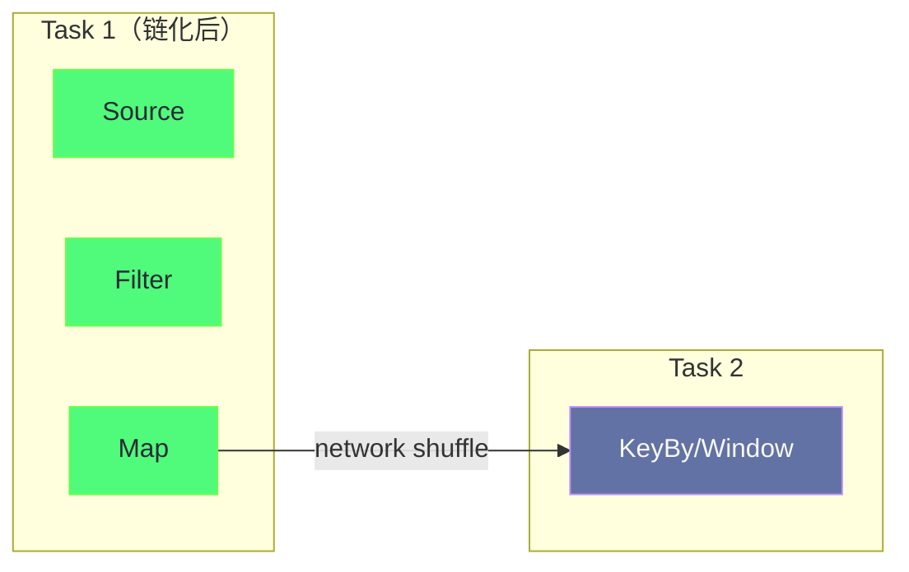

**摘要：**

Flink 性能调优不是一套固定的参数模板，而是一套**以诊断为驱动、以瓶颈定位为核心**的方法论。调优工作的第一步永远是定位瓶颈在哪——是算子计算慢（CPU 瓶颈）、数据倾斜（某个 Subtask 负载远高于其他）、状态访问慢（IO 瓶颈）、Checkpoint 超时（状态太大或 IO 慢）还是 GC 压力（内存配置不合理）？在准确诊断之前盲目调参，往往事倍功半甚至适得其反。本文构建一套完整的 Flink 性能调优决策树：从 Web UI 的 Metrics 入手，识别五类典型瓶颈（反压/数据倾斜/GC/序列化/Checkpoint），每类瓶颈对应具体的根因分析路径和调优手段，覆盖算子链优化、序列化框架选择、RocksDB 调优、内存精细化配置、以及数据倾斜的多种消除方案。

---

## 第 1 章 调优方法论：先诊断，后治疗

### 1.1 性能调优的核心原则

调优工作有一个常见的错误模式：**在不清楚瓶颈所在的情况下，凭直觉或"经验"盲目调整参数**——增大内存、提高并行度、换状态后端，做了一堆操作，最终不清楚哪个起了作用，也不清楚是否真正解决了问题。

正确的调优流程应该是：

```
1. 建立基线（Baseline）：记录当前作业的关键指标（吞吐、延迟、Checkpoint 完成时间）
2. 定位瓶颈：通过 Web UI / Metrics 找到限制性能的根本原因
3. 针对性优化：只改变与瓶颈直接相关的配置，每次只改一个变量
4. 验证效果：对比优化前后的基线指标，确认提升
5. 评估副作用：确认优化没有引入新的问题
```

**第一性原理**：Flink 作业的性能上限由**最慢的那个算子**决定（木桶原理）。提升非瓶颈算子的性能毫无意义——如果 Window 算子已经处理不过来（反压），给 Source 算子增加并行度只会让数据积压更严重。

### 1.2 五类核心瓶颈的识别信号

| 瓶颈类型 | Web UI 信号 | Metrics 信号 |
|---------|------------|-------------|
| **反压（Backpressure）** | 某算子显示 High Backpressure | `outPoolUsage > 0.8`，`inPoolUsage > 0.8` |
| **数据倾斜** | 某个 Subtask 的 Records In/Out 远高于其他 | 不同 Subtask 的 `numRecordsIn` 差异超过 3x |
| **GC 压力** | TM 日志频繁 GC，CPU 使用率高但吞吐低 | `Status.JVM.GarbageCollector.*.Time` 占比高 |
| **序列化瓶颈** | CPU 使用率高，但计算逻辑本身不复杂 | 通过 profiler 发现 Kryo/Java 序列化耗时占比高 |
| **Checkpoint 慢** | Web UI Checkpoint History 显示完成时间长 | `lastCheckpointDuration` 持续超过阈值 |

---

## 第 2 章 反压调优：定位与消除

### 2.1 反压的根本原因分析

反压（Backpressure）的唯一根因是：**某个算子的处理速度跟不上数据到来的速度**。但"处理速度慢"背后可能有多种原因，需要逐层排查。

**步骤一：找到产生反压的根源算子**

在 Flink Web UI 的 Job Graph 视图中，每个算子会显示当前的 Backpressure 状态（OK / LOW / HIGH）。反压会向上游传播——如果 Operator-C 慢，它会给 Operator-B 施加反压，Operator-B 再给 Operator-A 施加反压。所以最上游的"HIGH"算子，才是真正的瓶颈所在。

```
传播链（从下游到上游）：
Source → MapA → KeyBy → WindowB → SinkC

如果 SinkC 慢 → WindowB 输出 Buffer 堆积 → WindowB 反压 → MapA 反压 → Source 被限速

Web UI 显示：MapA: HIGH, WindowB: HIGH, SinkC: HIGH
实际瓶颈：SinkC（最下游的 HIGH）
```

**步骤二：分析瓶颈算子的慢原因**

| 慢的原因 | 典型特征 | 解决方向 |
|---------|---------|---------|
| 计算逻辑复杂（CPU 密集） | CPU 使用率接近 100%，无 IO 等待 | 提高并行度、优化计算逻辑 |
| 状态访问慢（RocksDB IO） | CPU 使用率不高，但 `rocksdb.compaction` 频繁 | 调优 RocksDB 配置（见第 5 章）|
| Sink 写出慢（外部 IO 等待）| CPU 使用率低，线程处于 WAITING 状态 | 提高 Sink 并行度、使用批量写入 |
| 数据倾斜（某个 Key 数据量极大）| 同一算子不同 Subtask 处理量差异极大 | 数据倾斜消除（见第 3 章）|
| GC 暂停（JVM 停顿）| 周期性的吞吐骤降，对应 GC 日志中的 STW | GC 调优（见第 4 章）|

### 2.2 提高并行度的正确姿势

如果瓶颈算子的慢原因是 CPU 密集型计算，且没有数据倾斜，提高该算子的并行度是最直接的解决方案。

**注意：只提高瓶颈算子的并行度，而不是全局提高**。

```java
DataStream<OrderEvent> enriched = orders
    .map(new LightweightMapFunction())
    .setParallelism(4)                 // 简单 Map，不是瓶颈，保持低并行度
    .keyBy(order -> order.getUserId())
    .process(new HeavyComputeFunction())
    .setParallelism(16)                // 计算密集，是瓶颈，提高并行度
    .addSink(new KafkaSink<>())
    .setParallelism(8);                // Sink 并行度适中
```

全局提高并行度（`env.setParallelism(N)`）会让非瓶颈算子也消耗更多资源（更多 Slot、更多 Checkpoint 状态），是资源的浪费。

---

## 第 3 章 数据倾斜：最顽固的性能问题

### 3.1 数据倾斜的本质

数据倾斜（Data Skew）发生在 `keyBy()` 之后——同一个 Key 的所有数据都路由到同一个 Subtask，如果某个 Key 的数据量远超其他 Key，这个 Subtask 就成了整条 Pipeline 的瓶颈。

**典型场景**：
- 电商订单统计：某个超大商家（如某电商平台）的订单量是普通商家的 1000 倍
- 用户行为分析：爬虫 IP 每秒产生数万条点击记录，而正常用户每秒 1-2 条
- 地理位置统计：北京、上海的数据量远超内蒙古某县

**识别数据倾斜**：

在 Web UI 的 Job Graph 中，点击 keyBy 之后的某个算子（如 GroupAggregate），查看各 Subtask 的 `Records In` 指标——如果某个 Subtask 的 `Records In` 是其他 Subtask 的 3 倍以上，就存在数据倾斜。

### 3.2 消除数据倾斜的方案

**方案一：预聚合（LocalGlobalAgg / 两阶段聚合）**

最优先考虑的方案。通过在 keyBy 之前做一轮本地预聚合，将大量相同 Key 的数据合并为少量中间结果，再 keyBy 汇总：

```java
// 原始（倾斜）：
orders.keyBy(order -> order.getMerchantId())
      .process(new AggregateFunction())  // 大商家的 Subtask 处理量是普通商家的 1000 倍

// 两阶段聚合（消除倾斜）：
orders
    // 第一阶段：先在当前并行度上做局部聚合（keyBy 前）
    .keyBy(order -> order.getMerchantId() + "_" + new Random().nextInt(100))  // 加随机后缀分散
    .process(new LocalAggregateFunction())   // 将相同 merchantId 的数据合并
    // 第二阶段：去掉随机后缀，做全局汇总
    .keyBy(result -> result.getMerchantId())
    .process(new GlobalAggregateFunction());
```

对于 Flink SQL，直接开启 LocalGlobalAgg（见 [[08 Flink SQL 与 Blink Planner 深度解析]]）。

**方案二：Key 打散（Salting）**

如果是聚合类操作，在 Key 上附加随机后缀（1-N），将热点 Key 分散到 N 个 Subtask 上并行处理，最后再合并：

```java
// 原始热点 Key："merchant_12345"
// 打散后：随机路由到 "merchant_12345_0", "merchant_12345_1", ..., "merchant_12345_99"

DataStream<PartialResult> scattered = orders
    .keyBy(order -> order.getMerchantId() + "_" + ThreadLocalRandom.current().nextInt(100))
    .process(new PartialAggregation());   // 100 个 Subtask 并行处理同一个商家的数据

DataStream<FinalResult> result = scattered
    .keyBy(partial -> partial.getMerchantId())   // 去掉后缀，汇总 100 个局部结果
    .process(new GlobalMergeFunction());
```

**方案三：过滤异常 Key（爬虫/机器人流量）**

如果倾斜来源于异常流量（如爬虫 IP、机器人账号），在源头过滤是最根本的解决方案：

```java
orders
    .filter(order -> !isBot(order.getUserId()))   // 过滤机器人流量
    .keyBy(order -> order.getUserId())
    .process(new UserAnalyticsFunction());
```

**方案四：自定义分区器（Partitioner）**

对于已知的热点 Key（如知道哪些商家是超级大商家），可以预先定义分区策略，将这些 Key 手动分配到多个 Subtask：

```java
orders.partitionCustom(
    (key, numPartitions) -> {
        // 超级大商家：轮询分配到 0-15 号 Subtask（多个 Subtask 同时处理）
        if (BIG_MERCHANTS.contains(key)) {
            return (int) (System.nanoTime() % 16);
        }
        // 普通商家：按 Hash 分配（保证同一商家只在一个 Subtask）
        return Math.abs(key.hashCode()) % numPartitions;
    },
    order -> order.getMerchantId()
);
```

> [!warning] 生产避坑：方案四破坏了 keyBy 的语义
> `partitionCustom` 不是 `keyBy`——它不保证相同 Key 的数据到达同一 Subtask（超级大商家被轮询分配）。这意味着不能对这样的流使用 `KeyedState`（状态是 per-Key 的，不同 Subtask 无法共享同一 Key 的状态）。方案四只适用于无状态的处理（如 Filter、Map），不适用于需要状态的聚合。

---

## 第 4 章 JVM GC 调优

### 4.1 Flink 中 GC 问题的主要来源

Flink 的托管内存（Managed Memory）和网络 Buffer 使用堆外内存（off-heap），理论上绕过了 JVM GC。但以下情况仍然会产生大量堆内存对象，引发 GC：

1. **用户代码中的大量临时对象**：如在 `map()` 中每次 `new` 一个大对象（如复杂的 POJO），每秒产生百万个临时对象，Eden 区快速填满，触发频繁的 Minor GC。
2. **HashMapStateBackend 的大量状态对象**：所有状态对象都在 JVM 堆上，状态越多，堆压力越大，频繁触发 Full GC（STW）。
3. **Java Serialization / Kryo 序列化**：使用 Kryo 序列化时，对象被序列化为字节数组（堆分配），再写入 MemorySegment，产生大量临时字节数组。

### 4.2 GC 问题的诊断

```bash
# 1. 查看 GC 日志（TaskManager 启动参数中添加）
-Xlog:gc*:file=/tmp/flink-gc.log:time,uptime,level,tags

# 2. 关键 GC 指标
#    - Minor GC 频率：> 1 次/秒 = 频繁，需关注
#    - Full GC 时间：> 1 秒/次 = 严重 STW，必须优化
#    - GC 总耗时占运行时间比例：> 5% = GC 是瓶颈

# 3. Flink Metrics 中的 GC 指标
Status.JVM.GarbageCollector.G1_Young_Generation.Count   # Minor GC 次数
Status.JVM.GarbageCollector.G1_Young_Generation.Time    # Minor GC 总耗时（ms）
Status.JVM.GarbageCollector.G1_Old_Generation.Count     # Full GC 次数（应接近 0）
Status.JVM.GarbageCollector.G1_Old_Generation.Time      # Full GC 总耗时
```

### 4.3 GC 调优策略

**策略一：增大 TaskManager JVM 堆内存**

增大堆内存，让 Eden 区更大，同一吞吐下 Minor GC 频率降低。

```yaml
# 增大 JVM 堆内存（相对 TM 总内存的比例）
taskmanager.memory.jvm-overhead.fraction: 0.1
# 同时相应增大 TM 总内存
taskmanager.memory.process.size: 12g  # 原来 8g，增大 50%
```

**策略二：切换到 RocksDB 状态后端（减少堆内对象）**

```java
// 将状态迁移到 EmbeddedRocksDBStateBackend，状态对象存 off-heap
env.setStateBackend(new EmbeddedRocksDBStateBackend(true));
// 堆内存只存 JVM 对象（用户代码临时对象），大幅减少 GC 压力
```

**策略三：对象复用（Object Reuse）**

Flink 支持对象复用模式：算子之间传递对象时，不每次 new 新对象，而是复用同一个对象实例：

```java
// 开启对象复用（谨慎使用，需要确保算子不持有对象引用）
env.getConfig().enableObjectReuse();
// 效果：map() / flatMap() 等算子不再为每条记录分配新对象，大幅减少 Eden 区压力
// 注意：开启后，算子不能在跨调用之间持有输入对象的引用（复用意味着下次调用会覆盖同一对象）
```

**策略四：调整 JVM GC 参数**

```bash
# Flink 默认使用 G1GC，以下是生产推荐的 G1 参数
env.java.opts.taskmanager: >
  -XX:+UseG1GC
  -XX:MaxGCPauseMillis=200        # 目标最大 GC 停顿时间 200ms
  -XX:G1HeapRegionSize=32m        # G1 Region 大小（大对象 > Region/2 会进入 Humongous 区）
  -XX:InitiatingHeapOccupancyPercent=35  # 堆占用 35% 时开始并发标记
  -XX:+ParallelRefProcEnabled     # 并行处理 Reference，加速 GC
  -XX:+DisableExplicitGC          # 禁止显式调用 System.gc()
  -verbose:gc
  -Xlog:gc*:file=/tmp/flink-gc.log:time,uptime,level,tags
```

---

## 第 5 章 RocksDB 深度调优

### 5.1 理解 RocksDB 调优的前提

RocksDB 的调优本质是在**写入性能（Write Throughput）**、**读取性能（Read Throughput）**和**空间使用（Disk Space）**三者之间做权衡：

- **增大 MemTable**：提升写入性能（更多数据在内存缓冲，延迟 Flush），代价是内存消耗增大
- **增大 Block Cache**：提升读取性能（更多 SST 数据缓存在内存），代价是内存消耗增大
- **调整 Compaction 策略**：减少磁盘空间放大（Space Amplification），代价是 Compaction 会消耗 CPU 和 IO

### 5.2 核心 RocksDB 调优参数

```java
EmbeddedRocksDBStateBackend rocksdbBackend = new EmbeddedRocksDBStateBackend(true);

// 通过 RocksDBOptionsFactory 自定义 RocksDB 配置
rocksdbBackend.setRocksDBOptions(new RocksDBOptionsFactory() {
    @Override
    public DBOptions createDBOptions(DBOptions currentOptions, Collection<AutoCloseable> handlesToClose) {
        return currentOptions
            // 增大后台 Compaction 线程数（默认 1，适合多核机器）
            .setMaxBackgroundJobs(4)
            // 增大 Compaction 写速率限制（防止 Compaction IO 影响读写）
            .setMaxSubcompactions(2);
    }

    @Override
    public ColumnFamilyOptions createColumnOptions(ColumnFamilyOptions currentOptions,
                                                    Collection<AutoCloseable> handlesToClose) {
        // Block Cache：缓存 SST 文件的数据块（提升读性能）
        // 默认大小很小，生产中应显著增大
        final long blockCacheSize = 256 * 1024 * 1024;  // 256MB per ColumnFamily
        LRUCache blockCache = new LRUCache(blockCacheSize);
        handlesToClose.add(blockCache);

        BlockBasedTableConfig tableConfig = new BlockBasedTableConfig()
            .setBlockCache(blockCache)
            .setBlockSize(128 * 1024)           // Block 大小 128KB（默认 4KB，增大减少索引开销）
            .setCacheIndexAndFilterBlocks(true)  // 将 Bloom Filter 和索引也放入 Cache
            .setPinL0FilterAndIndexBlocksInCache(true);

        return currentOptions
            .setTableFormatConfig(tableConfig)
            // MemTable 大小（写入缓冲，越大写性能越好，但 Flush 会产生大文件）
            .setWriteBufferSize(64 * 1024 * 1024)   // 64MB（默认 64MB）
            // 每个 ColumnFamily 最大 MemTable 数（达到上限时阻塞写入）
            .setMaxWriteBufferNumber(3)
            // 压缩算法（LZ4 比默认的 Snappy 压缩率更高，速度相当）
            .setCompressionType(CompressionType.LZ4_COMPRESSION)
            // 最底层使用 ZSTD 压缩（最高压缩率，减少磁盘占用）
            .setBottommostCompressionType(CompressionType.ZSTD_COMPRESSION);
    }
});

env.setStateBackend(rocksdbBackend);
```

**Flink 配置文件中的 RocksDB 简化配置**（不需要写 Java 代码）：

```yaml
# RocksDB Block Cache 大小（建议设为托管内存的 60-80%）
state.backend.rocksdb.block.cache-size: 200mb

# MemTable 写缓冲大小
state.backend.rocksdb.writebuffer.size: 64mb

# 最大 MemTable 数量
state.backend.rocksdb.writebuffer.count: 3

# 后台 Compaction 并发数
state.backend.rocksdb.compaction.level.max-size-level-base: 256mb

# 使用预定义调优选项（推荐生产环境）
state.backend.rocksdb.predefined-options: SPINNING_DISK_OPTIMIZED_HIGH_MEM
# 可选：FLASH_SSD_OPTIMIZED（SSD 场景）, SPINNING_DISK_OPTIMIZED（旋转磁盘 + 低内存）
```

### 5.3 RocksDB 的存储路径配置

RocksDB 将数据写到本地磁盘。生产中，**必须将 RocksDB 的本地路径指向本地 SSD**（而不是 NFS 或机械磁盘），性能差异可达 10-100 倍：

```yaml
# 配置 RocksDB 本地数据目录（支持多目录，跨多块磁盘负载均衡）
state.backend.rocksdb.localdir: /data/ssd1/flink-rocksdb,/data/ssd2/flink-rocksdb
```

---

## 第 6 章 序列化调优

### 6.1 序列化的性能影响

Flink 在算子间传输数据时（跨 TaskManager 的 Shuffle）、以及将状态写入 RocksDB / Checkpoint 时，都需要对数据进行序列化和反序列化（SerDe）。序列化的效率直接影响：
- 网络传输性能（序列化越快，数据越早发出）
- RocksDB 读写性能（状态读写 = 反序列化 + 计算 + 序列化）
- Checkpoint 完成时间（状态快照 = 大量序列化写出）

### 6.2 Flink 序列化框架的选择

Flink 支持多种序列化框架，性能差异显著：

| 框架 | 优点 | 缺点 | 适用场景 |
|------|------|------|---------|
| **Flink TypeSerializer（内置）** | 极快（特化实现），无反射 | 只支持 Flink 内置类型（基本类型、Tuple、POJO、Avro）| 首选，覆盖 90% 场景 |
| **Kryo** | 支持任意 Java 类 | 比内置序列化慢 3-5x；序列化字节较大 | 兜底方案（无法用内置时）|
| **Java Serialization** | 内置，无需配置 | 最慢（10-50x），产生大量临时对象 | **生产禁止使用** |
| **Avro** | Schema-based，跨语言 | 需要维护 Schema | SQL/Table API 的 Row 类型 |

**最佳实践：使用 POJO 类型确保使用内置序列化器**

```java
// Flink 对满足条件的 POJO 类自动使用内置序列化器（极快）
// 条件：public 类、public 无参构造、所有字段 public 或有 getter/setter
public class OrderEvent {
    public String orderId;    // public 字段
    public String userId;
    public double amount;
    public long timestamp;
    // 自动满足 POJO 条件，Flink 使用内置序列化器
}

// 反例：使用 Scala case class 或复杂的 Java 类（嵌套集合、泛型）
// → Flink 回退到 Kryo，性能下降 3-5x
```

**检查是否意外使用了 Kryo**：

```java
// 在作业启动时打印类型信息，检查是否有 KryoSerializer
env.getConfig().registerTypeWithKryoSerializer(MyClass.class, MySerializer.class);
// 如果看到类似 "MyClass uses Kryo serialization" 的日志，说明该类需要优化
```

**禁用 Kryo 作为 fallback（强制要求显式处理）**：

```java
env.getConfig().disableGenericTypes();  // 禁用 Kryo，如果有类型无法用内置序列化器处理，直接报错
// 这是一个"快速失败"策略，强制在开发阶段发现序列化问题
```

---

## 第 7 章 算子链（Operator Chain）调优

### 7.1 算子链的性能价值

Flink 的算子链（Operator Chaining）将多个连续的算子合并到同一个 Task 中执行，消除了算子间的序列化、网络传输（虽然同 TM 内是内存传输，但仍有序列化开销）和线程切换开销。



链化后的 Source → Filter → Map 在同一个线程中执行，数据以对象引用传递（无序列化），性能最优。只有跨 Task 的数据传输（如 KeyBy 的 Shuffle）才需要序列化。

### 7.2 链化的条件与手动控制

Flink 自动链化满足条件的算子（相同并行度、可传播的 StreamEdge）。但有时自动链化不是最优的，需要手动干预：

```java
// 全局关闭算子链（调试用，不适合生产）
env.disableOperatorChaining();

// 在特定算子处断开链（如某个算子内存消耗大，希望独立部署）
someStream
    .map(new HeavyFunction())
    .startNewChain()   // 从此处开始新的链（HeavyFunction 不与前面的算子链化）
    .filter(event -> event.isValid());

// 标记某个算子不参与链化（独立 Task）
someStream
    .map(new IsolatedFunction())
    .disableChaining();  // 这个 Map 独立为一个 Task
```

**何时需要断开链**：
- 某个算子有状态且状态量大（独立 Task，Checkpoint 时状态文件独立，便于并行写出）
- 某个算子需要单独调整并行度（链化的算子必须并行度相同）
- 调试时需要观察特定算子的输入/输出（链化后中间数据不可见）

---

## 第 8 章 Checkpoint 性能调优

### 8.1 Checkpoint 调优的核心目标

Checkpoint 调优需要平衡两个目标：
1. **Checkpoint 完成时间**尽量短（保证 SLA，故障恢复数据量少）
2. **Checkpoint 对正常处理的干扰**尽量小（Checkpoint 期间不能显著降低吞吐）

### 8.2 分析 Checkpoint 瓶颈

在 Web UI 的 Checkpoint 详情页，每个算子会显示：
- **Sync Duration（同步阶段耗时）**：Task 线程暂停处理数据，执行快照的时间（通常 < 5ms，若很长则有问题）
- **Async Duration（异步阶段耗时）**：后台线程序列化 + 写出到 HDFS/S3 的时间（通常几秒到几分钟）
- **Alignment Duration（对齐等待耗时）**：等待所有输入 Barrier 对齐的时间（反压时可能很长）

**瓶颈识别**：
- `Sync Duration > 100ms`：快照阶段太长，检查是否有大量小对象需要 copy（HashMapStateBackend 的 CoW 阶段）
- `Async Duration > 5min`：IO 瓶颈，检查 HDFS/S3 写入带宽，考虑增量 Checkpoint（RocksDB）
- `Alignment Duration > 1min`：反压导致对齐等待，参考第 2 章反压调优

### 8.3 Checkpoint 调优配置

```yaml
# 保留更多 Checkpoint 副本（防止最近一次 Checkpoint 损坏时无法恢复）
state.checkpoints.num-retained: 3

# 开启增量 Checkpoint（RocksDB 必须开，大幅减少每次 Checkpoint 数据量）
state.backend.incremental: true

# 开启本地恢复（故障恢复时从本地文件恢复，无需从 HDFS 下载）
cluster.local-recovery: true
taskmanager.state.local.root-dirs: /data/local-recovery

# Checkpoint 间隔：生产建议 1-5 分钟（平衡故障恢复时间与开销）
execution.checkpointing.interval: 60s
execution.checkpointing.min-pause: 30s  # 两次 Checkpoint 之间至少 30s 处理正常数据

# 高反压时自动降级为 Unaligned Checkpoint
execution.checkpointing.aligned-checkpoint-timeout: 30s
```

---

## 小结

Flink 性能调优体系的决策路径：

**第一步：定位瓶颈**：通过 Web UI 的 Backpressure 指标 + 各算子的 `numRecordsIn` 差异 + GC Metrics，识别属于哪类瓶颈（反压/倾斜/GC/序列化/Checkpoint）。

**反压调优**：找到最上游的 HIGH 算子 → 分析是 CPU 慢/RocksDB 慢/Sink 慢/倾斜 → 针对根因提高并行度或优化算子实现。

**数据倾斜消除**：首选两阶段聚合（LocalGlobalAgg）；次选 Key 打散（Salting）；确认热点来源是异常流量时优先过滤。

**GC 调优**：切换 RocksDB 减少堆内状态；开启 Object Reuse 减少临时对象；使用 G1GC 并合理设置 `MaxGCPauseMillis`。

**序列化**：确保使用 POJO 类型触发 Flink 内置序列化器；禁用 GenericTypes 在开发阶段快速发现 Kryo 降级。

**RocksDB 调优**：数据目录指向本地 SSD；合理设置 Block Cache 大小（Managed Memory 的 60-80%）；使用 `predefined-options: FLASH_SSD_OPTIMIZED`。

**Checkpoint 调优**：开启增量 Checkpoint + 本地恢复；`aligned-checkpoint-timeout` 触发 Unaligned Checkpoint；分析 Sync/Async/Alignment Duration 定位瓶颈环节。

下一篇 [[10 Flink 大规模生产实践]] 将结合真实的大规模生产场景（万级 TPS、TB 级状态、数百并行度），梳理 Flink 在大规模部署中的特殊挑战与解决方案，以及与 Hadoop 生态、云原生环境的集成实践。


> [!note] 思考题
> 1. Flink 的反压（Backpressure）不是问题本身，而是系统自我保护的正常机制。真正的问题是导致反压的瓶颈算子。定位瓶颈算子后，常见的调优手段是"提高该算子的并行度"。但提高并行度需要重启作业，在流处理场景下代价很高。在不重启作业的前提下，有哪些运行时手段可以临时缓解瓶颈算子的压力？
> 2. 数据倾斜在 Flink 中通常表现为某些 SubTask 的处理速度显著慢于其他 SubTask（在 Flink UI 的 Task 指标中可以看到）。对于 KeyBy 后的倾斜，加盐（Salting）是常见手段，但加盐后的 Key 与原始 Key 不同，需要在下游重新聚合。对于 GroupBy 窗口聚合（非实时流），两阶段聚合（Local Agg + Global Agg）是经典解法。在 Flink SQL 中，如何触发优化器自动采用两阶段聚合？有哪些情况下优化器不会自动选择两阶段聚合？
> 3. Flink 的 `AsyncFunction`（异步 I/O）允许在不阻塞主处理线程的情况下并发调用外部服务（如数据库、API）。`AsyncFunction` 的 `capacity` 参数控制同时并发的请求数量。如果外部服务本身有并发限制（如数据库连接池大小为 10），而 Flink 作业有 100 个并行 SubTask，每个 SubTask 的 `capacity` 应该设置为多少才能充分利用数据库的 10 个连接而不超载？