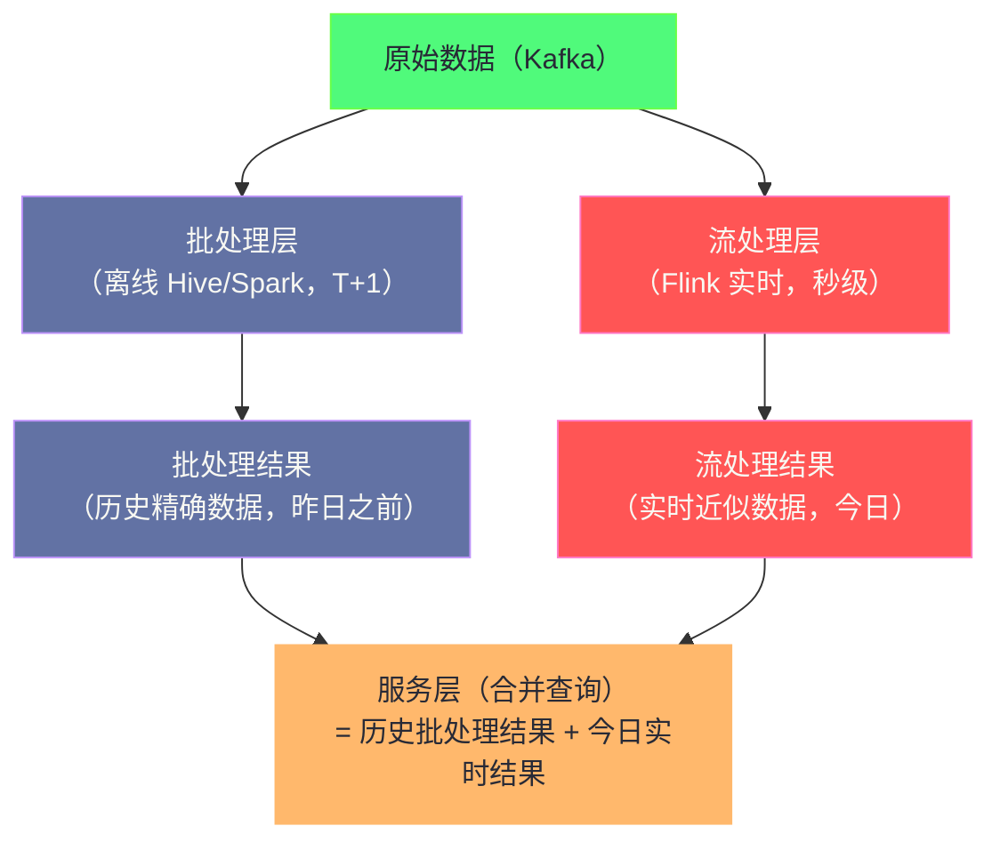
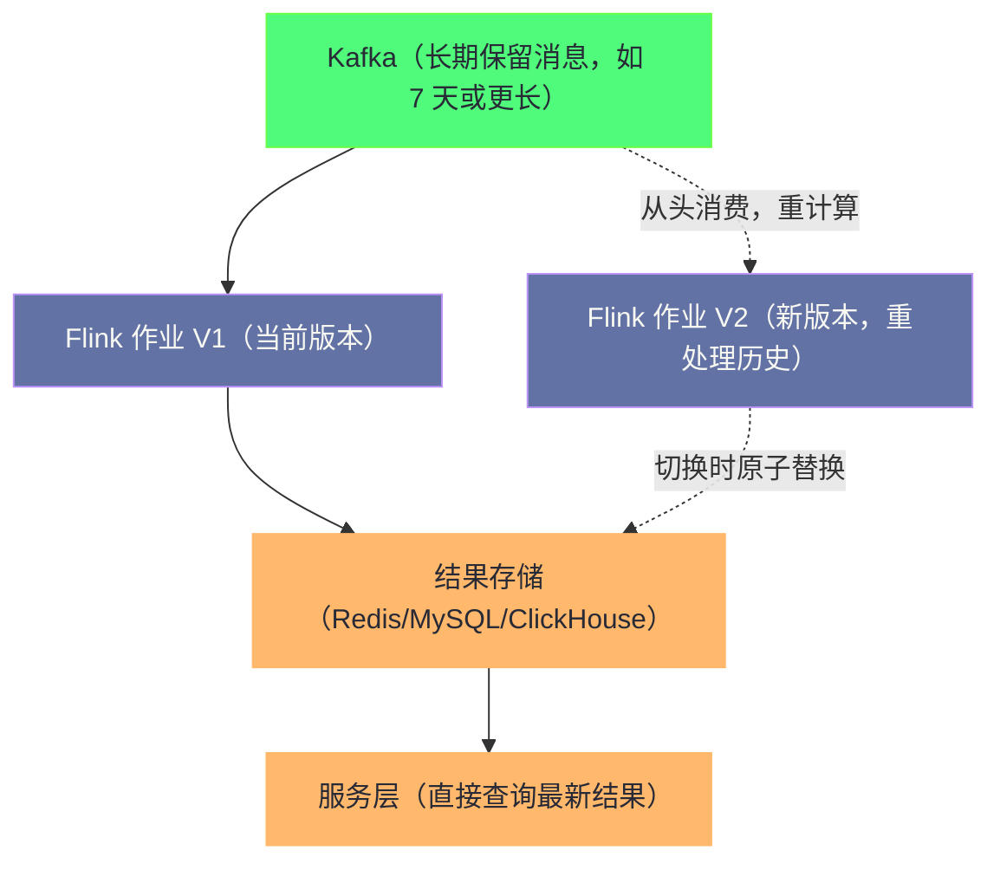

**摘要：**

当 Flink 作业从单个小作业演进到承载企业核心实时计算需求时，规模带来的挑战是本质性的：千级并行度下的 Checkpoint 协调开销、TB 级 RocksDB 状态的管理与迁移、高吞吐场景下 JobManager 的 RPC 风暴、实时数仓体系的架构选型（Lambda vs Kappa）、多租户资源隔离、以及如何构建标准化的 Flink 平台来降低大规模作业管理的复杂度。本文不重复介绍单作业的调优技巧（见 [[09 Flink 性能调优体系]]），而是聚焦于"规模化"带来的新挑战：当你同时管理 100 个 Flink 作业、单个作业有 1000 个并行度、状态总量达到几十 TB 时，需要在系统层面做哪些设计决策。

---

## 第 1 章 大规模 Flink 集群的架构挑战

### 1.1 JobManager 的 RPC 风暴问题

单个 JobManager 需要与所有 TaskManager 保持心跳（Heartbeat）并接收 Checkpoint ACK 消息。当集群规模扩大时，这两类消息的量都线性增长：

**心跳风暴**：
```
集群规模：500 个 TaskManager
心跳间隔：10 秒
每秒 RPC 量：500 / 10 = 50 次/秒（正常）

集群规模：5000 个 TaskManager
每秒 RPC 量：5000 / 10 = 500 次/秒（JM 负载显著上升）

当 TM 数量达到万级时，JM 的 RPC 处理线程（基于 Akka）可能成为瓶颈
```

**Checkpoint ACK 风暴**：

一次 Checkpoint 完成时，所有 Subtask 同时向 CheckpointCoordinator 发送 ACK。如果作业有 1000 个并行度、10 个算子，则一次 Checkpoint 的 ACK 消息量为 10,000 条——集中在几秒内涌入 JM，产生 ACK 风暴。

**缓解措施**：

```yaml
# 增大 JM 的 Akka 线程池（处理更多并发 RPC）
akka.actor.default-dispatcher.fork-join-executor.parallelism-max: 32

# 增大 JM 内存（缓解 JM 侧的 GC 压力）
jobmanager.memory.process.size: 8g

# 减小心跳频率（降低 RPC 量，代价是故障检测更慢）
heartbeat.interval: 20000    # 20 秒（默认 10 秒）
heartbeat.timeout: 120000    # 120 秒超时（默认 50 秒，相应增大）

# Checkpoint ACK 聚合（Flink 1.15+）
# 多个 Subtask 的 ACK 在 TM 侧先聚合，再统一发往 JM（减少 JM 收到的 RPC 数）
# 通过增大 TM 聚合等待时间来减少 JM 的 RPC 压力（默认行为，通常无需修改）
```

### 1.2 高并行度作业的 Shuffle 优化

当并行度达到数百以上时，算子间的网络 Shuffle（keyBy、rebalance 等）会产生 `O(N²)` 量级的网络连接：

```
并行度 = 100，两个算子之间的 Shuffle：
  上游 100 个 Subtask × 下游 100 个 Subtask = 10,000 个 TCP 子连接
  （在 Flink 的 Credit-based 流控下，实际 TCP 连接数 = TM 对数，但逻辑连接仍是 N²）

并行度 = 1000：
  逻辑连接数 = 1,000,000（百万级）
  每个 Subtask 需要管理 1000 个 InputChannel，内存和 CPU 开销显著上升
```

**高并行度下的网络 Buffer 调优**：

```yaml
# 减小每个 InputChannel 的初始 Buffer 数（降低内存峰值压力）
taskmanager.network.memory.buffers-per-channel: 1       # 默认 2，减为 1
taskmanager.network.memory.floating-buffers-per-gate: 8 # 默认 8，可适当增大
# floating-buffers 在各 InputChannel 之间动态共享，更高效

# 增大网络内存总量（支撑更多 Buffer）
taskmanager.memory.network.fraction: 0.15  # 从 0.1 增大到 0.15（高并行度作业）
taskmanager.memory.network.max: 2gb        # 网络内存上限
```

### 1.3 大状态的 Checkpoint 优化

TB 级 RocksDB 状态的 Checkpoint 面临两个核心问题：

**问题一：增量 Checkpoint 的历史文件积累**

RocksDB 增量 Checkpoint 每次只上传新增的 SST 文件，但这些文件在 HDFS 上需要保留直到被合并或删除。随着时间积累，历史文件越来越多：

```
Checkpoint N：上传 SST 文件 [001, 002, 003]
Checkpoint N+1：上传 SST 文件 [004, 005]（增量）
Checkpoint N+2：上传 SST 文件 [006]（增量）
...
Checkpoint N+1000：所有历史 SST 文件仍在 HDFS（因为某个未过期的 Checkpoint 可能引用它们）

HDFS 上的 Checkpoint 目录会随时间不断膨胀
```

**缓解措施**：
1. 合理设置 `state.checkpoints.num-retained`（建议 2-3，不要设置过大）
2. 定期对 RocksDB State 做全量 Savepoint（会触发一次全量快照，清理历史 SST 引用）
3. 监控 HDFS 上 Checkpoint 目录的总大小，设置告警

**问题二：故障恢复时间过长**

TB 级状态在故障恢复时，需要从 HDFS/S3 下载所有 SST 文件到本地磁盘，再重建 RocksDB 实例。1TB 状态 × 网络带宽 100MB/s = 至少 170 分钟。

**解决：本地恢复（Local Recovery）**

```yaml
# 开启本地恢复（在 TM 本地磁盘保留 Checkpoint 副本）
cluster.local-recovery: true
taskmanager.state.local.root-dirs: /data/ssd/flink-local-recovery

# 工作原理：
# - 每次 Checkpoint 时，TM 同时将状态写入 HDFS（主副本）和本地磁盘（本地副本）
# - 同机器重启（进程崩溃但磁盘完好）时，直接从本地读取，跳过 HDFS 下载
# - 机器完全宕机时，降级到从 HDFS 恢复（本地副本丢失）

# 本地恢复的效果：1TB 状态，本地读取速度 500MB/s → 恢复时间 ~30 分钟（vs HDFS 的 170 分钟）
```

---

## 第 2 章 实时数仓架构：Lambda 到 Kappa 的演进

### 2.1 Lambda 架构：批流并行，合并结果

Lambda 架构是大数据时代早期应对实时需求的经典方案：



**Lambda 架构的优点**：
- 批处理层保证了历史数据的准确性（T+1 全量重计算，修正流处理的近似结果）
- 流处理层提供低延迟的实时视图
- 两层相互独立，一层故障不影响另一层

**Lambda 架构的痛点**：

维护两套代码是最大的问题。批处理用 Spark SQL（或 Hive），流处理用 Flink——同一个业务逻辑需要实现两次。当业务逻辑发生变化时，两套代码都要同步修改，极易产生不一致。

> [!note] 设计哲学：Lambda 架构的历史背景
> Lambda 架构在 Flink 成熟之前是合理的选择——那时的流处理系统（Storm）无法保证精确一次，也无法处理大规模状态，只能做近似计算，必须用离线批处理来纠正。Flink 的出现从根本上改变了这个局面：Flink 能做到精确一次、能管理 TB 级状态、支持 SQL——流处理不再是"近似"的，而是与批处理一样精确。这为 Kappa 架构铺平了道路。

### 2.2 Kappa 架构：统一流处理，消灭批层

Kappa 架构（Jay Kreps 2014 年提出）的核心思想：**只用流处理系统，消灭批处理层。历史数据的重计算通过从 Kafka 消费历史消息来实现（而不是重跑批处理作业）。**



**Kappa 架构的重计算流程**：

1. Kafka 配置足够长的消息保留时间（如 7 天，或按容量设置无限保留）
2. 当业务逻辑需要变更时，部署新版本 Flink 作业（V2）并从 Kafka 的最早 Offset 开始消费
3. V2 作业写入**新的结果表/主题**（与 V1 不同），追赶历史数据
4. V2 追上当前消费进度后，原子切换服务层的查询指向新结果
5. 下线 V1 作业

**Kappa 架构对 Flink 的要求**：
- **流批一体 API**：同一套代码既能处理实时流（低延迟），又能处理历史批量数据（高吞吐）。Flink 1.12 引入的 Batch execution mode（`env.setRuntimeMode(RuntimeExecutionMode.BATCH)`）完美支持这一需求。
- **大规模状态管理**：重处理 7 天历史数据时，状态可能极大（RocksDB + 增量 Checkpoint 是必须的）
- **高吞吐模式**：重处理时不需要低延迟，需要最大化吞吐（可以关闭 Watermark 生成，使用 Processing Time，或使用 Batch Mode）

### 2.3 实时数仓分层架构（ODS → DWD → DWS → ADS）

在 Flink 驱动的实时数仓中，数据的处理遵循与离线数仓相同的分层架构，但每一层都是实时流处理：

```
ODS（贴源层）：Kafka Topic，存储原始事件
  → Flink 做基础清洗（格式转换、字段补全）
  → 输出到 DWD Kafka Topic

DWD（明细层）：标准化事实表，每条记录是一个业务事件
  → Flink 做维度关联（Lookup Join MySQL/Redis 补充维度信息）
  → 输出到 DWD Kafka Topic（宽表）

DWS（汇总层）：按维度聚合的中间结果
  → Flink 做窗口聚合（5 分钟、1 小时、1 天的统计）
  → 输出到 DWS Kafka/ClickHouse

ADS（应用层）：面向业务的指标
  → Flink SQL 或直接 ClickHouse 查询
  → 写入 Redis（实时大屏）/ MySQL（报表）/ ClickHouse（分析查询）
```

**分层实现的关键挑战**：

每多一层，端到端延迟就增加一个 Flink 作业的处理延迟（+ Kafka 传输延迟）。如果每层延迟 500ms，四层就是 2 秒的端到端延迟。对于要求亚秒级延迟的场景，需要将多层合并为单个 Flink 作业（减少 Kafka 中间层）。

---

## 第 3 章 Flink 平台化：多租户管理

### 3.1 为什么需要 Flink 平台

当一个组织有 100 个 Flink 作业时，逐个手动管理是不可持续的：
- 每次作业升级都需要手动执行 `flink stop` + `flink run`
- 监控告警配置各异，缺乏统一的可观测性
- 不同团队的作业混跑在同一集群，互相影响（资源抢占、一个作业 OOM 导致 TM 崩溃影响他人）
- 新团队需要自己研究 Flink 配置，学习成本高

**Flink 平台（Flink Platform）** 的目标是：将 Flink 的运维复杂度封装起来，让业务团队只需关注业务逻辑（SQL 或 JAR），平台负责资源管理、生命周期管理、监控告警。

### 3.2 多租户资源隔离方案

**方案一：YARN 队列隔离（物理隔离）**

```yaml
# 每个业务线（租户）分配独立的 YARN 队列
# Queue A（支付业务）：100 GB 内存，独占，不与其他队列共享
# Queue B（风控业务）：200 GB 内存，独占
# Queue C（数据分析）：共享弹性队列

# Flink 作业提交时指定队列
-Dyarn.application.queue=payment-queue
```

**方案二：Kubernetes Namespace + Resource Quota（推荐）**

```yaml
# 为每个租户创建独立的 K8s Namespace
apiVersion: v1
kind: Namespace
metadata:
  name: flink-payment  # 支付团队专属 Namespace

---
# 为 Namespace 设置 Resource Quota（限制最大资源用量）
apiVersion: v1
kind: ResourceQuota
metadata:
  name: flink-payment-quota
  namespace: flink-payment
spec:
  hard:
    requests.cpu: "100"       # 最多申请 100 CPU
    requests.memory: "400Gi"  # 最多申请 400GB 内存
    limits.cpu: "120"
    limits.memory: "480Gi"

---
# 为 Flink TM Pod 设置 LimitRange（限制单个 Pod 的最大资源）
apiVersion: v1
kind: LimitRange
metadata:
  name: flink-pod-limits
  namespace: flink-payment
spec:
  limits:
    - max:
        cpu: "8"
        memory: "32Gi"
      type: Pod
```

**方案三：Flink Session Cluster 隔离**

不同租户使用不同的 Flink Session Cluster（物理隔离的 JM + TM），共享底层 YARN/K8s 资源但相互不干扰：
- 优点：完全隔离，一个集群崩溃不影响其他
- 缺点：资源利用率低（每个集群有固定的最小资源开销）

### 3.3 标准化配置模板

平台层应该为不同类型的作业提供标准配置模板，业务团队按类型选择即可：

```yaml
# 模板一：小作业（开发/测试）
parallelism: 2
jobmanager.memory.process.size: 1g
taskmanager.memory.process.size: 2g
taskmanager.numberOfTaskSlots: 2
state.backend: hashmap
execution.checkpointing.interval: 300s

# 模板二：生产实时作业（标准）
parallelism: 8
jobmanager.memory.process.size: 2g
taskmanager.memory.process.size: 8g
taskmanager.numberOfTaskSlots: 4
state.backend: rocksdb
state.backend.incremental: true
execution.checkpointing.interval: 60s
execution.checkpointing.mode: EXACTLY_ONCE
state.checkpoints.dir: s3://prod-bucket/flink/checkpoints
high-availability: kubernetes

# 模板三：大状态作业（TB级状态）
parallelism: 64
jobmanager.memory.process.size: 4g
taskmanager.memory.process.size: 16g
taskmanager.numberOfTaskSlots: 2
taskmanager.memory.managed.fraction: 0.5  # 增大 RocksDB 托管内存
state.backend: rocksdb
state.backend.incremental: true
cluster.local-recovery: true
state.backend.rocksdb.predefined-options: FLASH_SSD_OPTIMIZED
execution.checkpointing.interval: 300s    # 大状态降低 Checkpoint 频率
execution.checkpointing.aligned-checkpoint-timeout: 30s
```

---

## 第 4 章 Flink 与大数据生态的集成实践

### 4.1 Flink + ClickHouse：实时 OLAP

ClickHouse 以其极高的 OLAP 查询性能（亿行/秒级别的 GROUP BY + FILTER）成为 Flink 实时数仓的首选 OLAP 引擎。Flink 负责实时计算和数据写入，ClickHouse 负责存储和高速分析查询。

**写入方案**：

```java
// 使用 ClickHouse JDBC Connector 写入
// 关键：批量写入（batch insert）而非逐条写入
Properties props = new Properties();
props.put("batchSize", "10000");           // 积累 10000 条再批量写入
props.put("flushIntervalMs", "5000");      // 或 5 秒后写入（避免数据停留过久）

// Flink SQL 方式
tableEnv.executeSql("""
    CREATE TABLE order_stats_ck (
        category     STRING,
        window_start TIMESTAMP(3),
        total_gmv    DOUBLE,
        order_count  BIGINT
    ) WITH (
        'connector' = 'jdbc',
        'url' = 'jdbc:clickhouse://ck-host:8123/default',
        'table-name' = 'order_stats',
        'driver' = 'com.clickhouse.jdbc.ClickHouseDriver',
        'sink.buffer-flush.max-rows' = '10000',
        'sink.buffer-flush.interval' = '5s'
    )
""");
```

**ClickHouse 表引擎选择**：

| 引擎 | 写入语义 | 适用场景 |
|------|---------|---------|
| `ReplacingMergeTree` | 按主键去重（异步，最终一致）| At-Least-Once 写入的幂等去重 |
| `SummingMergeTree` | 按主键聚合数值字段 | 实时累加型指标（销售额、点击数）|
| `AggregatingMergeTree` | 通用聚合函数 | 复杂聚合（UV、分位数）|
| `MergeTree` | 无去重，追加写入 | 明细数据、日志存储 |

**Flink 写 ClickHouse 的精确一次**：

ClickHouse 不支持 Kafka 式事务，无法做标准的两阶段提交。对于需要精确一次的场景，常用方案是：
1. 写入使用 `ReplacingMergeTree` + 业务唯一 ID 作为主键（At-Least-Once + 幂等去重）
2. 查询时使用 `FINAL` 关键字强制 Merge（`SELECT ... FROM table FINAL`），确保读到去重后的数据

### 4.2 Flink + Redis：实时特征工程

实时机器学习特征工程是 Flink 的重要应用场景——从用户行为流中实时计算特征（如最近 10 分钟的点击次数、最近 1 小时的购买金额），写入 Redis 供在线推荐系统调用。

**关键设计考量**：

```java
// 使用 RichSinkFunction 批量写入 Redis（减少 Redis RTT）
public class RedisBatchSink extends RichSinkFunction<UserFeature> {

    private transient JedisPool jedisPool;
    private final List<UserFeature> buffer = new ArrayList<>();
    private final int batchSize = 1000;

    @Override
    public void invoke(UserFeature feature, Context context) throws Exception {
        buffer.add(feature);
        if (buffer.size() >= batchSize) {
            flush();
        }
    }

    private void flush() {
        try (Jedis jedis = jedisPool.getResource()) {
            Pipeline pipeline = jedis.pipelined();
            for (UserFeature f : buffer) {
                // 使用 HSET 存储用户特征（field = 特征名，value = 特征值）
                pipeline.hset("user_features:" + f.getUserId(),
                    f.getFeatureName(), String.valueOf(f.getFeatureValue()));
                // 设置 TTL（避免 Redis 特征无限积累）
                pipeline.expire("user_features:" + f.getUserId(), 86400);  // 24 小时 TTL
            }
            pipeline.sync();  // 批量提交，一次 RTT 写入 1000 条
            buffer.clear();
        }
    }
}
```

**特征一致性的挑战**：

在线推理时，推荐系统从 Redis 读取特征；Flink 负责更新特征。如果 Flink 作业故障恢复（从 Checkpoint 重放数据），相同的特征更新可能被重放多次，导致 Redis 中的特征值不正确（如点击次数被多计）。

**解决方案**：
- 使用**带时间戳的条件更新**（`SET user_feature:xxx value EXAT timestamp NX`），只在特征时间戳更新时才覆写，避免旧数据覆盖新数据
- 对于累加型特征（如点击次数），在 Flink 侧维护精确状态（ValueState），每次写 Redis 都是写最终聚合值（幂等），而不是增量更新（`INCR`）

### 4.3 Flink CDC：实时数据集成

**CDC（Change Data Capture）** 是将 MySQL/PostgreSQL 等关系数据库的变更实时同步到数据湖/数仓的技术。Flink CDC（基于 Debezium）是当前主流方案：

```sql
-- 通过 Flink SQL 消费 MySQL Binlog
CREATE TABLE mysql_orders (
    order_id    BIGINT PRIMARY KEY NOT ENFORCED,
    user_id     STRING,
    amount      DOUBLE,
    status      STRING,
    created_at  TIMESTAMP(3),
    db          STRING METADATA FROM 'database_name' VIRTUAL,
    table_name  STRING METADATA FROM 'table_name' VIRTUAL,
    op_ts       TIMESTAMP_LTZ(3) METADATA FROM 'op_ts' VIRTUAL  -- 操作时间戳
) WITH (
    'connector' = 'mysql-cdc',
    'hostname' = 'mysql-host',
    'port' = '3306',
    'username' = 'flink-cdc-user',
    'password' = '***',
    'database-name' = 'orders_db',
    'table-name' = 'orders',
    -- 初次启动：全量读取（snapshot），之后增量消费 Binlog
    'scan.startup.mode' = 'initial'
);

-- 将 MySQL 数据实时同步到 Kafka（格式：Debezium JSON）
INSERT INTO kafka_orders_topic
SELECT order_id, user_id, amount, status, created_at FROM mysql_orders;
```

**Flink CDC 的技术挑战**：

1. **全量读取期间的锁问题**：Flink CDC 在全量快照阶段需要对表加全局读锁（默认），会阻塞业务写入。解决：使用 `'scan.incremental.snapshot.enabled' = 'true'`（无锁快照，Flink CDC 2.0+ 支持）。

2. **Binlog 位点的持久化**：Flink 将 MySQL Binlog 的消费位点存储在 Checkpoint 状态中，故障恢复后从正确的 Binlog 位置继续消费。**必须开启 Checkpoint**，否则故障后会重新全量读取。

3. **DDL 变更处理**：MySQL 表结构发生变化（如 `ALTER TABLE ADD COLUMN`）时，Flink CDC 会捕获 DDL 事件，需要在下游做好 Schema Evolution 处理。

---

## 第 5 章 Flink 的未来方向

### 5.1 Flink 2.0 的重大变化

Apache Flink 2.0（计划中）带来了几个重要的架构演进：

**统一批流 API 的进一步完善**：

Flink 1.x 虽然声称"批流一体"，但 DataStream API 和 Table API 在批处理模式下仍有一些行为差异。Flink 2.0 目标是真正统一这两套接口，让同一段代码在流和批模式下具有完全一致的语义。

**Disaggregated State Storage（分离式状态存储）**：

Flink 2.0 的重大架构变化之一：将状态存储与计算节点分离。当前架构中，RocksDB 状态存储在 TaskManager 本地磁盘——TaskManager 宕机时，RocksDB 文件也丢失，必须从 Checkpoint 恢复（慢）。

分离式存储将 RocksDB 替换为基于对象存储（S3/OSS）或专用分布式 KV 存储（如 Apache Paimon 或 RocksDB over S3）的远程状态后端——TaskManager 宕机后，状态不丢失，新 TM 直接挂载已有的远程状态继续执行，**消除了从 Checkpoint 恢复的耗时**。

```
当前架构（状态在 TM 本地）：
  TM 宕机 → 状态丢失 → 从 Checkpoint 恢复（分钟级）

分离式存储（状态在远程）：
  TM 宕机 → 新 TM 挂载同一个远程 State → 立即恢复（秒级）
```

**Adaptive Batch Scheduler（自适应批调度器）**：

对于批处理作业，Flink 2.0 引入了基于运行时统计信息的自适应并行度——算子并行度不再需要在提交时手动指定，而是根据上游数据量自动决定（类似 Spark 的 AQE）。

### 5.2 实时 AI：Flink 与机器学习的融合

**在线学习（Online Learning）**：

将机器学习模型的训练过程嵌入 Flink 流处理中——每处理一批数据，模型参数实时更新（如在线 SGD、在线特征工程）。Flink 的有状态流处理天然适合维护模型参数状态。

**流式特征存储（Streaming Feature Store）**：

将 Flink 作为实时特征计算引擎，将计算结果写入 Feature Store（如 Feast、Hopsworks），供在线推理调用。这是当前互联网公司实时推荐/风控系统的主流架构：

```
Kafka（用户行为）→ Flink（特征计算）→ Redis/Feature Store（特征存储）→ 在线模型（特征读取 + 推理）
```

---

## 小结

Flink 大规模生产实践的关键决策维度：

**集群规模化挑战**：
- JM RPC 风暴 → 增大 JM 内存、减小心跳频率、开启 ACK 聚合
- 高并行度 Shuffle → 调整网络 Buffer 配置（减小 per-channel buffers，增大 floating buffers）
- TB 级状态恢复慢 → 开启 Local Recovery，本地 SSD 加速恢复

**实时数仓架构选型**：
- **Lambda**：有离线兜底，精确性高，维护成本高（两套代码）
- **Kappa**：统一流处理，Kafka 长期保留支持重计算，但对 Flink 能力要求更高
- 分层架构（ODS→DWD→DWS→ADS）：延迟随层数增加，高实时性场景考虑合并层

**平台化**：
- K8s Namespace + Resource Quota 实现多租户隔离
- 标准化配置模板降低业务团队使用门槛
- Flink Kubernetes Operator 实现声明式生命周期管理

**生态集成**：
- ClickHouse：批量写入 + ReplacingMergeTree 幂等去重（实时 OLAP）
- Redis：Pipeline 批量写入 + 基于最终值的幂等更新（实时特征）
- Flink CDC：MySQL → Kafka 的 Binlog 实时同步，必须开 Checkpoint，推荐无锁快照

至此，「Flink 原理深度解析与性能优化」专栏全部 10 篇文章已完成创作，从 Flink 底层架构原理到大规模生产实践，形成完整的知识体系闭环。


> [!note] 思考题
> 1. 在大规模 Flink 集群中，JobManager 的 RPC 风暴问题源于：高并行度作业的所有 TaskManager 都需要定期向 JobManager 上报心跳和指标。如果有 1000 个 TaskManager 每秒上报一次，JobManager 的 RPC 处理能力成为瓶颈。除了减少上报频率（`heartbeat.interval`），还有哪些架构层面的手段可以减轻 JobManager 的 RPC 压力？Flink 社区是否有类似"联邦化 JobManager"的方向？
> 2. Kappa 架构消灭了批处理层，所有历史数据重算都通过流处理完成。当业务逻辑变更需要重新处理历史数据时，通常需要从消息队列的最早 Offset 开始重新消费。但如果历史数据有 3 年，而消息队列只保留了 7 天，如何实现 Kappa 架构下的历史数据回溯？数据湖（如 Iceberg 或 Delta Lake）在 Kappa 架构的历史回溯中扮演什么角色？
> 3. 实时数仓的 ODS → DWD → DWS → ADS 分层架构意味着数据需要经过多层 Flink 作业的处理，每一层的延迟叠加导致最终 ADS 层的数据新鲜度较低。在什么业务 SLA 要求下，分层架构的延迟叠加是可以接受的？如果业务要求秒级延迟，应该如何在保留分层架构的同时减少层间延迟？