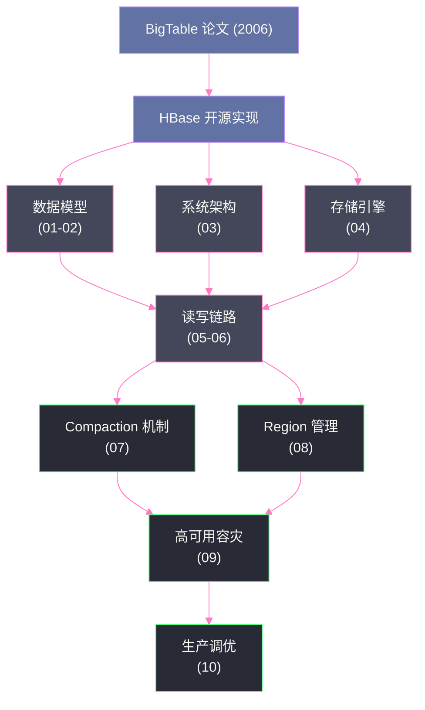

# HBase 深度原理专栏导览

## 专栏简介

本专栏从 [[Google BigTable]] 论文出发，系统性地拆解 HBase 的设计哲学、数据模型、存储引擎、读写链路、压缩合并机制、高可用架构与生产调优实践。目标是帮助读者真正理解 HBase **"为什么这样设计"**，而不仅仅是"是什么"。

> [!info] 适合读者
> 具备一定分布式系统基础，希望深入理解 HBase 底层原理的工程师。建议按顺序阅读，前几篇的概念会在后续文章中反复引用。

---

## 文章目录

| 序号 | 文章标题 | 核心内容 | 关键概念 |
|------|----------|----------|----------|
| 01 | [[01 HBase 的诞生——为什么 HDFS 不够用，列族存储的设计哲学]] | BigTable 论文背景、关系型 DB 的局限、列族模型 vs 行模型 | BigTable、列族、稀疏矩阵 |
| 02 | [[02 HBase 数据模型深度解析——RowKey、列族、Cell 与多版本机制]] | 四维坐标模型、版本存储、TTL、RowKey 设计原则 | RowKey、Column Family、MVCC |
| 03 | [[03 HBase 整体架构——Master、RegionServer 与 ZooKeeper 的三角协作]] | 三大组件职责、Master 非数据路径设计、ZK 协调角色 | Master、RegionServer、ZooKeeper |
| 04 | [[04 HBase 存储引擎深度解析——LSM-Tree、MemStore 与 HFile 的设计奥秘]] | LSM-Tree vs B-Tree、MemStore 写缓冲、HFile 块结构 | LSM-Tree、MemStore、HFile、Bloom Filter |
| 05 | [[05 HBase 写入链路深度解析——WAL、MemStore Flush 与数据持久性保证]] | 写路径全链路、WAL Durability、Flush 触发机制、MVCC | WAL、HLog、MemStore Flush |
| 06 | [[06 HBase 读取链路深度解析——BlockCache、多级合并读与 Bloom Filter]] | 读路径层次结构、BlockCache LRU/BucketCache、多版本合并读 | BlockCache、Scan、Get |
| 07 | [[07 HBase Compaction 机制——Minor 与 Major Compaction 的工程哲学与调优]] | Compaction 必要性、策略对比、读写放大、生产调优 | Minor Compaction、Major Compaction、写放大 |
| 08 | [[08 HBase Region 分裂与负载均衡——数据热点的根因与治理]] | Region 分裂机制、预分区设计、热点根因、散列策略 | Region Split、预分区、RowKey 热点 |
| 09 | [[09 HBase 高可用与容灾——RegionServer 宕机恢复与 WAL 回放机制]] | 故障恢复全链路、WAL Split、Region 重分配、MTTR 优化 | RegionServer 故障、WAL Replay、MTTR |
| 10 | [[10 HBase 生产调优实战——内存模型、GC 压力与读写性能的系统性优化]] | 内存分区模型、GC 调优、写吞吐与读延迟优化、参数最佳实践 | MemStore、BlockCache、GC 调优 |

---

## 知识图谱概览

---

## 阅读建议

- **入门路径**：01 → 02 → 03，建立基本认知框架
- **原理深挖**：04 → 05 → 06，理解 LSM-Tree 与读写机制
- **工程实践**：07 → 08 → 09 → 10，掌握生产环境核心问题

> [!note] 关联专栏
> - [[大数据/Hadoop/HDFS/00 专栏导览|HDFS]]：理解 HBase 依赖的底层存储
> - [[中间件/Zookeeper/00 专栏导览|ZooKeeper]]：理解 HBase 协调层的工作机制
> - [[大数据/Hadoop/Yarn/00 专栏导览|YARN]]：了解 HBase 所在的大数据生态
> - [[中间件/Leveldb/00 专栏导览|LevelDB]]：HBase LSM-Tree 与 LevelDB 的思路对比
> - [[Java/JVM/00 专栏导览|JVM]]：HBase RegionServer 的 GC 调优
