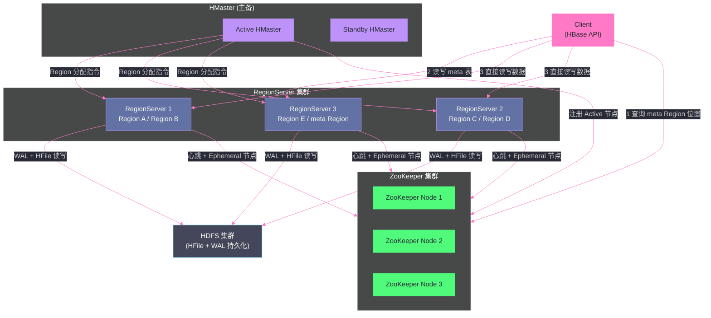
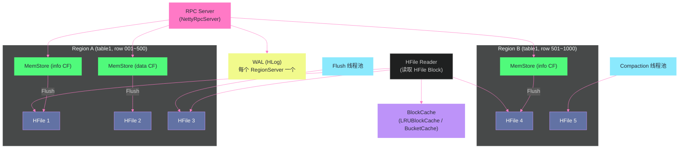

# HBase 整体架构——Master、RegionServer 与 ZooKeeper 的三角协作

**摘要：**

HBase 的整体架构是一个经过精心设计的职责分离体系：[[ZooKeeper]] 承担协调职责，[[HMaster]] 承担管控职责，[[RegionServer]] 承担数据服务职责，三者共同构成了一个能够在廉价商用服务器集群上支撑 PB 级数据随机读写的分布式系统。本文深入剖析三大核心组件各自的工作机理，重点揭示两个常被忽视的关键设计：**HMaster 不在数据读写的关键路径上**（这是 HBase 能在 Master 故障期间维持读写服务的根本原因）；以及 **`hbase:meta` 表的三级寻址机制**（这是客户端能高效定位任意 Region 的基础设施）。通过理解这三个组件的协作边界，读者将能够在生产环境中准确判断故障影响范围、合理配置资源、以及快速定位性能瓶颈。

---

## 第 1 章 架构全景：一张图读懂组件关系

### 1.1 为什么分布式系统需要"职责分离"

在理解 HBase 的三大组件之前，有必要先理解一个通用的分布式系统设计原则：**将不同的关注点分配给不同的角色**（Separation of Concerns）。

这个原则听起来平淡无奇，但在分布式系统设计中却有极高的工程价值。它的核心逻辑是：

- **数据路径（Data Path）**：处理每一次读写请求，需要极低延迟、极高吞吐，是系统的性能核心。这条路径上的任何组件故障都会直接影响服务可用性。
- **控制路径（Control Path）**：处理元数据管理、故障恢复、负载均衡等管控操作，频率低但对正确性要求高。这条路径上的短暂故障通常不影响正在进行的数据操作。

HBase 将这两条路径严格分离：[[RegionServer]] 负责数据路径（所有读写请求都由 RegionServer 直接处理），[[HMaster]] 负责控制路径（元数据管理、Region 分配、负载均衡）。[[ZooKeeper]] 作为独立的协调层，为两者提供分布式协调服务。

这种架构的关键优势是：**HMaster 的短暂不可用不会影响正在进行的读写操作**。一个运行中的 HBase 集群，即使 HMaster 发生故障，RegionServer 仍然可以继续服务已经分配给它们的 Region，客户端的读写请求不会受到影响——直到需要进行 Region 分配或 DDL 操作（如创建/删除表）时，才会因为 HMaster 不可用而阻塞。

这一设计与 [[HDFS]] 的 NameNode 形成鲜明对比：HDFS 的 NameNode 在数据读写的关键路径上（客户端需要从 NameNode 获取 Block 位置信息），NameNode 故障会直接导致读写不可用（在 HA 模式切换完成之前）。HBase 通过将元数据路由信息缓存在客户端，以及使用 `hbase:meta` 表而非 Master 来存储 Region 位置信息，实现了比 HDFS 更强的 Master 容错能力。

### 1.2 架构全景图



这张架构图揭示了 HBase 组件交互的几个关键特征：

1. **客户端直接与 RegionServer 通信进行数据读写**，不经过 HMaster
2. **客户端通过 ZooKeeper 定位 `hbase:meta` 表所在的 RegionServer**，再通过 meta 表定位目标 Region
3. **HMaster 只与 RegionServer 交互管控指令**，不参与数据读写
4. **所有组件（RegionServer、HMaster）都在 ZooKeeper 注册**，ZooKeeper 是统一的协调中枢

---

## 第 2 章 ZooKeeper：分布式协调的基石

### 2.1 ZooKeeper 在 HBase 中的核心职责

[[ZooKeeper]] 在 HBase 架构中扮演的角色，可以用一句话概括：**分布式系统的"公证处"**——提供强一致性的分布式协调服务，解决分布式系统中的选主（Leader Election）、服务发现（Service Discovery）和配置管理（Configuration Management）问题。

HBase 对 ZooKeeper 的依赖体现在以下几个具体职能上：

**职能一：HMaster 高可用选主**

HBase 支持多个 HMaster 节点同时运行（一主多备）。当 Active HMaster 故障时，Standby HMaster 需要接管。这个选主过程由 ZooKeeper 负责协调：

每个 HMaster 启动时，都尝试在 ZooKeeper 的 `/hbase/master` 路径下创建一个**临时节点（Ephemeral ZNode）**。ZooKeeper 保证只有一个节点能成功创建（分布式互斥），成功者成为 Active HMaster，失败者作为 Standby 监听该节点。

当 Active HMaster 与 ZooKeeper 的会话中断（无论是网络问题还是进程崩溃），ZooKeeper 会自动删除其创建的临时节点。监听该节点的 Standby HMaster 收到通知，发起新一轮竞争选主。

> [!info] 临时节点的工程含义
> ZooKeeper 的临时节点（Ephemeral ZNode）在创建它的客户端会话终止时自动删除，这是实现"心跳检测"和"故障感知"的基础机制。与传统的超时检测相比，ZooKeeper 的临时节点具有精确的语义：一旦网络长时间中断（超过 `sessionTimeout`），节点立即消失，不存在"僵死进程"占用节点的情况。

**职能二：RegionServer 注册与存活监测**

每个 RegionServer 启动时，在 ZooKeeper 的 `/hbase/rs/` 路径下注册一个临时节点（如 `/hbase/rs/regionserver1.example.com,16020,1705291800000`）。节点路径包含 RegionServer 的主机名、端口和启动时间戳。

HMaster 通过监听 `/hbase/rs/` 目录的变化来感知 RegionServer 的加入和退出。当某个 RegionServer 的临时节点消失（进程崩溃或网络超时），HMaster 立即感知到 RegionServer 故障，开始触发故障恢复流程（WAL 分割和 Region 重新分配）。

这套机制使得 HBase 的故障检测完全依赖 ZooKeeper 的会话超时机制，检测延迟等于 ZooKeeper 的 `sessionTimeout`（默认 90 秒，生产中通常调整为 30~60 秒）。

**职能三：存储 hbase:meta 表的位置信息**

这是 ZooKeeper 在 HBase 数据路径中唯一的参与点，极其重要。

`hbase:meta` 是一张特殊的系统表，存储了所有用户表的 Region 位置信息（即哪个 Region 由哪个 RegionServer 服务）。客户端需要先找到 `hbase:meta` 表在哪个 RegionServer 上，才能通过它定位目标数据。

`hbase:meta` 表本身所在 RegionServer 的地址，就存储在 ZooKeeper 的 `/hbase/meta-region-server` 节点中。这是客户端唯一需要查询 ZooKeeper 的场景——获取 meta Region 的位置。之后，客户端会缓存这个信息以及后续查询的 Region 位置，不再频繁访问 ZooKeeper。

**职能四：集群状态信息存储**

ZooKeeper 还存储了 HBase 的一些全局配置和集群状态信息：

| ZooKeeper 路径 | 存储内容 |
|---------------|----------|
| `/hbase/master` | Active HMaster 的临时节点（选主） |
| `/hbase/rs/` | 所有在线 RegionServer 的临时节点列表 |
| `/hbase/meta-region-server` | hbase:meta 表所在 RegionServer 地址 |
| `/hbase/table/` | 表的状态信息（如 ENABLED/DISABLED） |
| `/hbase/namespace/` | Namespace 信息 |
| `/hbase/hbaseid` | 集群的唯一 ID |
| `/hbase/backup-masters/` | 所有 Standby HMaster 节点 |

### 2.2 ZooKeeper 故障对 HBase 的影响

理解 ZooKeeper 的职责后，就能准确判断 ZooKeeper 故障对 HBase 的影响：

**ZooKeeper 短暂故障（<sessionTimeout）**：RegionServer 和 HMaster 的会话仍然有效，不会立即影响正在进行的读写操作。但如果 ZooKeeper 集群不可用时间超过 `sessionTimeout`，ZooKeeper 会认为所有客户端会话已超时，所有临时节点消失，触发 HBase 集群的连锁反应。

**ZooKeeper 完全不可用**：
- 正在进行的读写请求（已经建立到 RegionServer 的连接）：**短时间内不受影响**（只要 RegionServer 本身正常）
- 新的读写请求（客户端需要定位 meta Region 位置）：**受阻**，因为无法查询 ZooKeeper 获取 meta Region 地址
- HMaster 功能：**完全不可用**，无法进行 Region 分配、负载均衡等控制操作

这说明 ZooKeeper 是 HBase 的基础设施依赖，**ZooKeeper 的稳定性和可用性直接影响 HBase 的整体可用性**。生产环境中，ZooKeeper 集群应该是 3 节点或 5 节点（奇数，满足多数派选举），并与 HBase 服务器分离部署（避免资源竞争）。

> [!warning] 生产避坑
> HBase 的 `hbase.zookeeper.session.timeout`（默认 90000 毫秒，即 90 秒）是一个关键参数。如果网络抖动导致 RegionServer 与 ZooKeeper 的会话超时，ZooKeeper 会认为 RegionServer 已死，通知 HMaster 触发故障恢复——即使 RegionServer 进程本身是健康的。这种"假死"现象（RegionServer 因为临时网络问题被 ZooKeeper 踢出集群）在生产中会造成大量 Region 重新分配，是常见的性能抖动根因。适当增大 `sessionTimeout` 可以减少假死，但同时会增加真实故障的检测延迟。需要根据网络稳定性权衡。

---

## 第 3 章 HMaster：集群的"管理者"而非"数据中转站"

### 3.1 HMaster 的核心职责

[[HMaster]]（简称 Master）是 HBase 集群的管控中心，负责所有的**非数据路径操作**。它的核心职责包括：

**职责一：DDL 操作（表的生命周期管理）**

所有的表创建（`CREATE TABLE`）、表删除（`DROP TABLE`）、表启用/禁用（`ENABLE/DISABLE TABLE`）、列族修改（`ALTER TABLE`）操作，都由 HMaster 执行。

HMaster 在执行 DDL 时，需要：
1. 更新 `hbase:meta` 表中的表/Region 元数据
2. 在 HDFS 上创建或删除对应的目录结构
3. 向相关 RegionServer 发送 Region 的开启（`openRegion`）或关闭（`closeRegion`）指令

DDL 操作是阻塞性的：在 HMaster 不可用期间，DDL 操作无法执行。这是 HMaster HA 的主要动机——不是为了保障数据读写，而是为了保障 DDL 操作的连续可用。

**职责二：Region 分配与负载均衡**

Region 分配（Region Assignment）是 HMaster 最核心的数据管控职能：决定哪个 Region 由哪个 RegionServer 服务。

**初始分配**：集群启动时，HMaster 读取 `hbase:meta` 表中记录的所有 Region 信息，将每个 Region 分配给一个合适的 RegionServer。

**负载均衡**：HBase 内置了一个负载均衡器（Load Balancer），默认每 5 分钟运行一次（由 `hbase.balancer.period` 控制）。负载均衡器根据以下维度评估集群状态：
- 每个 RegionServer 上的 Region 数量
- 每个 RegionServer 上的存储大小
- MemStore 大小
- 数据本地性（Region 的数据是否在该 RegionServer 所在节点的 HDFS DataNode 上）

当某个 RegionServer 上的 Region 数量远超平均值，或者某些 Region 的数据本地性很低时，负载均衡器会生成一个迁移计划，将部分 Region 从过载的 RegionServer 迁移到负载较轻的 RegionServer。

> [!warning] 生产避坑
> **负载均衡不等于无感知迁移**。Region 迁移过程中，目标 Region 需要先关闭（在源 RegionServer 上 Flush MemStore、关闭 WAL），再在目标 RegionServer 上打开。在这个短暂的过渡期（通常数秒），该 Region 上的读写请求会短暂等待（客户端会感知到 Region 不可用，进行重试）。频繁的负载均衡会导致服务端不必要的抖动，生产中有时需要在高峰期关闭自动负载均衡（`balance_switch false`），在低峰期手动触发。

**职责三：故障恢复协调**

当 HMaster 通过 ZooKeeper 感知到某个 RegionServer 下线时，需要：

1. **标记失效 Region**：将该 RegionServer 上的所有 Region 标记为需要重新分配
2. **触发 WAL 分割（WAL Split）**：该 RegionServer 的 WAL（Write-Ahead Log）中可能包含尚未持久化到 HFile 的数据，需要将其分割到各个 Region 对应的目录中（具体机制在第 09 篇文章中详细讨论）
3. **重新分配 Region**：将这些 Region 分配给其他健康的 RegionServer

这个过程完全由 HMaster 协调，但实际的 WAL 分割工作可以由 RegionServer 分布式执行（分布式日志分割，DLS，Distributed Log Splitting）。

### 3.2 HMaster 不在数据路径上的深层含义

这是理解 HBase 架构最关键的一个认知点，值得深入展开。

**在 HDFS 中，NameNode 在数据路径上**：客户端每次读写文件都需要先访问 NameNode 获取 Block 位置。NameNode 虽然只返回元数据（不参与数据传输），但它是每次操作的必经环节。NameNode 的 RPC 处理能力成为集群的吞吐瓶颈，这也是为什么 HDFS Federation 需要多个 NameNode 来横向扩展命名空间。

**在 HBase 中，HMaster 完全不在数据路径上**：

客户端的 `Put`、`Get`、`Scan` 操作的执行路径如下：

```
客户端 → ZooKeeper（获取 meta Region 位置，仅第一次）
       → hbase:meta 表所在的 RegionServer（定位目标 Region，已缓存则跳过）
       → 目标 RegionServer（直接执行读写操作）
```

HMaster 完全不参与以上任何步骤。

这意味着：**HMaster 的 RPC 处理能力不是集群吞吐的瓶颈**。无论集群有多少个 RegionServer、每秒有多少次读写操作，HMaster 的负载几乎不随数据规模增长而增长（只有 DDL 操作频率增加时，HMaster 负载才会增加）。这是 HBase 能够无限水平扩展的重要基础。

同时，这也意味着：**HMaster 故障对在线读写的影响是零**（在 Region 分配不需要变动的情况下）。生产中，HMaster 进程重启或主备切换，用户几乎感知不到（除非在切换期间恰好有 RegionServer 下线，需要 HMaster 来协调故障恢复）。

> [!note] 设计哲学
> HBase 的这个设计选择（将 HMaster 完全排除在数据路径之外）是对 [[Google BigTable]] 中 Master 设计的忠实复现。BigTable 论文明确指出："Clients communicate directly with tablet servers for reads and writes... In practice, this means clients are not required to access the master." 这是大规模分布式存储系统中"控制平面与数据平面分离"原则的经典实践。

### 3.3 HMaster 的内部组件

HMaster 的内部结构包含以下几个主要模块：

**AssignmentManager（Region 分配管理器）**：维护所有 Region 的分配状态（哪个 Region 在哪个 RegionServer 上），处理 Region 的开启、关闭、迁移操作。AssignmentManager 的状态信息存储在 `hbase:meta` 表中（而不是 ZooKeeper 或 HMaster 内存中），即使 HMaster 重启，也能从 `hbase:meta` 表中恢复状态。

**ServerManager（RegionServer 管理器）**：维护在线 RegionServer 列表，处理 RegionServer 的加入（注册）和退出（故障/主动下线），监听 ZooKeeper 上 RegionServer 的临时节点变化。

**LoadBalancer（负载均衡器）**：定期（默认每 5 分钟）评估集群负载状态，生成并执行 Region 迁移计划。

**CatalogJanitor（元数据清理器）**：定期扫描 `hbase:meta` 表，清理已被删除或合并的 Region 留下的废弃元数据记录。

**ProcedureExecutor（过程执行引擎）**：HBase 2.0 引入的重要改进，将所有复杂的 HMaster 操作（如建表、Region 分裂、Region 合并）包装成可持久化的"Procedure"（过程），存储在 HDFS 上的 WAL 中。即使 HMaster 在操作执行中途崩溃，重启后也能从 Procedure WAL 中恢复状态，继续执行未完成的操作，保证操作的幂等性和原子性。这是 HBase 2.0 相比 1.x 在 HMaster 可靠性上的重大进步。

---

## 第 4 章 RegionServer：数据服务的核心

### 4.1 RegionServer 的整体架构

[[RegionServer]] 是 HBase 中最核心、最复杂的组件。所有的数据读写操作最终都由 RegionServer 执行，它的性能直接决定了 HBase 集群的整体吞吐量和延迟。

一个 RegionServer 进程内部包含以下主要组件：



**关键组件说明：**

- **RPC Server**：接收客户端的读写请求，基于 Netty 实现，支持高并发连接
- **WAL（Write-Ahead Log）**：每个 RegionServer 共享一个 WAL，所有该 RegionServer 服务的 Region 的写入都追加到这个 WAL 中，保证持久性（详见第 05 篇文章）
- **Region**：数据的物理分片单元，每个 Region 负责一张表的一段行键范围
- **MemStore**：每个列族对应一个 MemStore，是内存中的写缓冲区
- **HFile**：磁盘上的有序不可变文件，MemStore Flush 后生成
- **BlockCache**：读缓存，缓存最近从 HFile 读取的 Block，加速读请求
- **Compaction 线程池**：后台执行 Compaction（合并 HFile），控制 HFile 数量

### 4.2 Region：数据分片的基本单元

**Region 是 HBase 表水平分片的基本单位**，是 HBase 负载均衡和数据分布的最小粒度。

理解 Region 需要把握以下几个关键点：

**Region 与行键范围的关系**

每个 Region 负责一张表的一段连续行键范围，用 `[startKey, endKey)` 表示（左闭右开区间）。第一个 Region 的 startKey 为空（代表行键的最小值），最后一个 Region 的 endKey 为空（代表行键的最大值）。

例如，一张用户表的 3 个 Region：
```
Region 1: [""  , "user_033333")  → 由 RegionServer1 服务
Region 2: ["user_033333", "user_066666")  → 由 RegionServer2 服务
Region 3: ["user_066666", "")   → 由 RegionServer3 服务
```

**Region 的物理存储结构**

在 HDFS 上，每个 Region 对应一个独立的目录：
```
/hbase/data/<namespace>/<tableName>/<regionId>/
  <columnFamily1>/
    <hfile1>
    <hfile2>
  <columnFamily2>/
    <hfile3>
```

每个列族（Column Family）在 Region 目录下有独立的子目录，其中存放该列族的所有 HFile。

**一个 Region 同一时刻只属于一个 RegionServer**

这是一个严格的约束，保证了数据的强一致性。任何时刻，对特定 Region 的读写请求都只由一个 RegionServer 处理，不存在并发写入冲突（不同于 Cassandra 的多副本写入模型）。

**Region 的规模建议**

生产中，每个 Region 的大小建议控制在 1GB~10GB 之间（由 `hbase.hregion.max.filesize` 控制，默认 10GB）。Region 过小会导致元数据过多、Region 管理开销增大；Region 过大会导致 Compaction 时间过长、Region 分裂耗时。

每个 RegionServer 建议服务 20~200 个 Region（取决于 Region 大小和服务器内存）。Region 过多会导致 MemStore 内存占用过高（每个 Region 每个列族一个 MemStore）。

### 4.3 RegionServer 的读写流程概述

为了帮助理解整体架构，这里先给出读写流程的概要（详细机制在第 05、06 篇文章中深入展开）。

**写入流程（简版）：**
1. 客户端定位到目标 Region 所在的 RegionServer，发送 Put 请求
2. RegionServer 将操作记录追加到 WAL（Write-Ahead Log）
3. RegionServer 将数据写入目标 Region 对应列族的 MemStore（内存缓冲）
4. 返回写入成功

当 MemStore 达到阈值（默认 128MB），触发 Flush 操作，将 MemStore 中的数据排序后写入 HDFS 上的 HFile，然后清空 MemStore。

**读取流程（简版）：**
1. 客户端定位到目标 Region 所在的 RegionServer，发送 Get 请求
2. RegionServer 在以下位置中查找目标数据（可能存在于多个位置）：
   - MemStore（最新版本的数据）
   - BlockCache（最近读过的 HFile Block）
   - HDFS 上的 HFile（持久化数据）
3. 合并所有版本，返回最新版本（或指定版本数）给客户端

---

## 第 5 章 hbase:meta 表：Region 定位的核心基础设施

### 5.1 meta 表是什么，为什么需要它

在理解客户端如何定位数据之前，必须先理解 `hbase:meta` 表的本质。

`hbase:meta` 是一张特殊的 HBase 系统表，它存储了集群中所有用户表的**所有 Region 的元数据**。具体来说，`hbase:meta` 表的每一行记录了：

- 一个 Region 的起止行键范围（`startKey`，`endKey`）
- 该 Region 当前由哪个 RegionServer 服务（主机名 + 端口）
- 该 Region 的编码名称（`encodedName`）和其他元数据

`hbase:meta` 表的行键格式为：
```
<tableName>,<startKey>,<regionId>
```

例如：
```
users,,1705291800000.a1b2c3d4e5f6...       ← users 表的第一个 Region
users,user_033333,1705291900000.b2c3d4e5...  ← 从 user_033333 开始的 Region
```

`hbase:meta` 表本身也是一张 HBase 表，由某个 RegionServer 服务。在早期版本的 HBase 中（1.0 之前），有一张更上层的 `-ROOT-` 表指向 `.META.` 表，形成三级目录结构。从 HBase 1.0 开始，`-ROOT-` 表被废弃，`hbase:meta` 表只有一个 Region，其位置直接由 ZooKeeper 存储，简化为两级寻址。

**为什么需要 meta 表，而不是直接把 Region 位置存在 ZooKeeper 里？**

这是一个架构设计问题，答案在于数据规模：

ZooKeeper 的设计定位是协调服务，存储少量的配置和状态信息。ZooKeeper 的 ZNode 数据大小建议不超过 1MB，整体 ZooKeeper 数据量应该在 MB 量级。

而一个大型 HBase 集群可能有数万个 Region，每个 Region 的元数据记录大约 1KB，总量在数十 MB 到 GB 量级——这远超 ZooKeeper 的承受范围。

将 Region 元数据存储在 `hbase:meta` 表中（即存储在 HBase 自身的 HDFS 中），容量可以无限扩展，而且访问 `hbase:meta` 的方式与访问普通 HBase 表完全一样，可以复用所有的 HFile 读取优化（BlockCache、Bloom Filter 等）。

### 5.2 三级寻址机制：客户端如何定位任意 Region

HBase 的区域定位遵循一个简洁优雅的三级寻址流程：

```
第一级：ZooKeeper → 获取 hbase:meta 所在 RegionServer 地址
第二级：meta RegionServer → 查询 hbase:meta 表，获取目标 Region 所在 RegionServer
第三级：目标 RegionServer → 执行实际的数据读写操作
```

让我们用一个具体的例子来走通这个流程。

**场景**：客户端要读取 `users` 表中行键为 `user_050000` 的数据。

**步骤一：从 ZooKeeper 获取 meta Region 位置**

```java
// 客户端首次连接时，从 ZooKeeper 的 /hbase/meta-region-server 节点读取
// meta Region 所在 RegionServer 的地址
String metaRegionServer = zkClient.getData("/hbase/meta-region-server");
// 结果示例: "regionserver2.example.com:16020"
```

这个结果会被客户端缓存，后续请求不再查询 ZooKeeper（除非 meta Region 发生迁移）。

**步骤二：查询 hbase:meta 表，定位目标 Region**

```java
// 向 metaRegionServer 发送 Get 请求，查询 hbase:meta 表
// 行键为 "users,user_050000," 的前缀匹配（查找该行键所属的 Region）
Get metaGet = new Get(Bytes.toBytes("users,user_050000,"));
metaGet.addColumn(HConstants.CATALOG_FAMILY, HConstants.REGIONINFO_QUALIFIER);
metaGet.addColumn(HConstants.CATALOG_FAMILY, HConstants.SERVER_QUALIFIER);

Result metaResult = metaTable.get(metaGet);
// 解析结果，获取目标 Region 的 RegionInfo 和对应的 RegionServer 地址
// 结果示例: Region "users,user_033333,..." 由 "regionserver1.example.com:16020" 服务
```

这个结果同样被客户端缓存（Region 位置缓存），后续访问同一 Region 的请求直接使用缓存，跳过步骤一和步骤二。

**步骤三：直接访问目标 RegionServer**

```java
// 直接向 regionserver1.example.com:16020 发送 Get 请求
Get dataGet = new Get(Bytes.toBytes("user_050000"));
Result result = targetRegionServer.get(dataGet);
```

在实际的 Java 客户端实现中，整个三级寻址过程对用户是透明的，由 `ConnectionImplementation` 内部的 `RegionLocator` 组件自动完成，并维护了两级缓存（ZooKeeper 地址缓存 + Region 位置缓存）。

### 5.3 Region 位置缓存失效的处理

Region 位置缓存会在以下情况失效：
- Region 发生了迁移（负载均衡触发）
- Region 发生了分裂（Region Split，一个 Region 变两个）
- RegionServer 发生故障，Region 被重新分配

当客户端使用缓存的 Region 位置向 RegionServer 发送请求时，如果 Region 已经迁走，RegionServer 会返回 `NotServingRegionException`。客户端收到这个异常后，会**主动清除该 Region 的缓存**，重新走步骤二（查询 meta 表）获取新的 Region 位置，然后重试请求。

这个"请求-失败-重新定位-重试"的流程是透明的，对上层应用不感知（只会有轻微的延迟增加）。

> [!note] 设计哲学
> 这种"乐观缓存 + 失败重试"的设计模式（Optimistic Caching with Retry on Miss）是分布式系统中非常实用的设计范式。它假设缓存命中是常态，缓存失效是少数情况，通过在失效时按需刷新来兼顾性能（避免每次都查询 meta）和正确性（失效时能及时更新）。

---

## 第 6 章 集群启动序列：各组件如何协调上线

### 6.1 RegionServer 的启动过程

理解集群启动序列，有助于在启动失败时快速定位问题所在。

**RegionServer 启动步骤：**

1. **初始化本地目录结构**：在本机文件系统上创建临时目录，加载配置文件
2. **连接 ZooKeeper**：建立与 ZooKeeper 集群的会话，创建临时节点 `/hbase/rs/<hostname>,<port>,<startcode>`
3. **向 HMaster 汇报上线**：通过 RPC 向 Active HMaster 注册自身，报告主机名、端口、最大内存等信息
4. **扫描本地已有 HFile**：恢复 Region 状态（如果是重启，读取本地 HDFS 上的 HFile 目录）
5. **等待 HMaster 分配 Region**：进入就绪状态，等待 HMaster 发送 `openRegion` 指令
6. **打开分配到的 Region**：初始化 Region 的 MemStore、读取 HFile 索引到 BlockCache，标记为可服务状态

**Region 打开的细节**

打开一个 Region 不是一个即时操作。RegionServer 需要：
- 在 HDFS 上创建该 Region 的 WAL 目录引用
- 读取该 Region 下所有 HFile 的 Block 索引（加载到内存，用于快速定位 Block）
- 如果之前该 Region 有未完成的 WAL 记录（上次 RegionServer 崩溃留下的），执行 WAL 回放（WAL Replay），将这些记录重放到 MemStore 中

当 Region 数量很多（如每个 RegionServer 有 200 个 Region），Region 打开过程可能需要数十秒到数分钟，这是 HBase 集群冷启动慢的主要原因之一。

### 6.2 HMaster 的启动过程

**HMaster 启动步骤：**

1. **连接 ZooKeeper**：尝试在 `/hbase/master` 创建临时节点，竞争成为 Active Master（失败则作为 Standby 等待）
2. **初始化内部组件**：初始化 AssignmentManager、ServerManager、LoadBalancer 等
3. **等待 RegionServer 汇报**：等待足够数量的 RegionServer 上线（由 `hbase.master.wait.on.regionservers.mintostart` 控制，默认 1 个）
4. **扫描 hbase:meta 表**：获取所有 Region 的当前分配状态
5. **处理未分配的 Region**：将没有对应 RegionServer（上次集群故障遗留的）的 Region 重新分配
6. **启动负载均衡器**：开始周期性的负载均衡检查

### 6.3 集群整体就绪的判断标准

HBase 集群"就绪"（可以接受客户端请求）的标准是：
- 至少一个 Active HMaster 在线
- `hbase:meta` 表所在的 RegionServer 已上线
- `hbase:meta` 表的 Region 已成功打开
- 用户表的 Region 已分配并打开

需要注意的是，这个"就绪"是逐步达到的：在集群启动的早期阶段，可能只有部分 Region 上线，此时只能访问那些已上线的 Region。随着更多 RegionServer 完成启动和 Region 打开，集群逐渐达到完整可服务状态。

---

## 第 7 章 RegionServer 故障处理：容灾机制的工程细节

### 7.1 故障感知：ZooKeeper 的作用

RegionServer 故障的感知完全依赖 ZooKeeper 的会话超时机制：

1. RegionServer 周期性（每 `zookeeper.session.timeout/3` 毫秒）向 ZooKeeper 发送心跳
2. 如果 RegionServer 进程崩溃或网络中断超过 `sessionTimeout`，ZooKeeper 认为该 RegionServer 已失效，删除其 `/hbase/rs/<hostname>` 临时节点
3. HMaster 监听 `/hbase/rs/` 目录变化，感知到节点消失，开始故障处理流程

### 7.2 故障处理流程

故障处理的核心挑战是：**该 RegionServer 的 WAL 中可能包含尚未 Flush 到 HFile 的数据**，这些数据如果丢失，会造成数据不一致。

**步骤一：WAL 分割（WAL Split）**

HMaster 将故障 RegionServer 的 WAL 文件分割：原来一个 RegionServer 的 WAL 是所有 Region 混合写入的（写入时按 Region 区分，但物理上在同一个文件中），需要按 Region 将 WAL 中的记录拆分开，每个 Region 得到一个独立的"恢复日志文件"。

这个分割操作在 HBase 1.x 中由 HMaster 单独执行，在 HBase 2.x 的分布式日志分割（DLS）模式下，由多个 RegionServer 并行分割（每个 RegionServer 负责分割一部分 WAL 文件），大幅降低了故障恢复时间。

**步骤二：Region 重新分配**

HMaster 将故障 RegionServer 上的所有 Region 分配给其他健康的 RegionServer。

**步骤三：WAL 回放（WAL Replay）**

新的 RegionServer 接管 Region 时，会执行 WAL 回放：读取该 Region 的恢复日志文件，将其中的记录写入 MemStore，然后触发 Flush 将数据持久化到 HFile。

回放完成后，该 Region 的数据与故障前完全一致，可以开始服务新的请求。

> [!info] MTTR（Mean Time To Recovery）
> 整个故障恢复过程的时间取决于：ZooKeeper sessionTimeout（故障感知延迟）+ WAL 分割时间 + Region 重新分配时间 + WAL 回放时间。在大型集群中，如果故障 RegionServer 上有大量 Region（如 200 个），每个 Region 的 WAL 回放都需要时间，整体 MTTR 可能在 1~5 分钟。优化 MTTR 是 HBase 高可用工程中的重要课题（在第 09 篇文章中详细讨论）。

---

## 第 8 章 横向扩展能力：HBase 如何线性扩展

### 8.1 扩容的工程路径

HBase 的扩容（Scale Out）流程非常简洁：

1. 启动一台新的 RegionServer，加入 ZooKeeper 集群，向 HMaster 注册
2. HMaster 的 LoadBalancer 在下一次均衡周期（默认 5 分钟）检测到集群不均衡
3. LoadBalancer 生成迁移计划，将部分 Region 从过载的 RegionServer 迁移到新节点
4. 新节点逐渐承担起分配给它的 Region 的读写负载

整个过程对客户端透明，只有在 Region 迁移的短暂过渡期（秒级）内，该 Region 上的请求会有轻微延迟增加（客户端重试）。

**什么限制了 HBase 的扩展上限？**

理论上，HBase 的吞吐量随 RegionServer 数量线性增长（每增加一倍 RegionServer，吞吐量大约翻倍）。实际上，有几个因素限制了无限扩展：

- **`hbase:meta` 表的读取压力**：meta 表只有一个 Region（在一个 RegionServer 上），如果集群规模非常大（数千个 RegionServer、数百万个 Region），meta 表的访问可能成为瓶颈。不过由于客户端有本地缓存，这个瓶颈在实际中很少触发。
- **HMaster 的管控开销**：RegionServer 数量增多，HMaster 需要管理的 RegionServer 心跳和 Region 分配状态增多，但 HMaster 的负载主要来自 DDL 操作而非心跳，通常不是瓶颈。
- **HDFS NameNode 的容量**：HBase 的数据存储在 HDFS 上，HDFS NameNode 的内存容量（存储 Block 元数据）可能成为海量小文件场景下的瓶颈（不过通过合理的 Compaction 策略可以控制 HFile 数量）。

### 8.2 Region 预分区：从一开始就避免热点

HBase 默认在建表时只创建一个 Region。随着数据的写入，这个 Region 会持续增长，直到超过大小阈值（默认 10GB）才自动分裂成两个 Region。

这意味着在数据量较少的早期阶段，整张表只有一个 Region，所有写入都集中在这一个 Region 上（热点），无法利用集群的并行写入能力。

**预分区（Pre-splitting）**是解决这个问题的标准做法：在建表时，指定行键的分割点，提前将表分成多个 Region，均匀分布到集群的各个 RegionServer 上。

```java
// Java API 建表时指定预分区
TableDescriptor tableDescriptor = TableDescriptorBuilder
    .newBuilder(TableName.valueOf("users"))
    .setColumnFamily(ColumnFamilyDescriptorBuilder.of("info"))
    .build();

// 指定行键分割点，将表分成 4 个 Region
byte[][] splitKeys = {
    Bytes.toBytes("user_025000"),
    Bytes.toBytes("user_050000"),
    Bytes.toBytes("user_075000")
};

admin.createTable(tableDescriptor, splitKeys);
```

预分区的分割点应该根据数据的行键分布来设计。如果行键分布均匀（如哈希前缀），可以均等分割；如果行键分布不均匀（如实际业务数据），应该根据数据采样来确定分割点，避免分区倾斜。

---

## 第 9 章 三角协作的边界总结

### 9.1 三个组件的职责边界一览

经过以上分析，可以将三个组件的职责精确归纳如下：

| 职责 | ZooKeeper | HMaster | RegionServer |
|------|-----------|---------|--------------|
| **数据读写** | ❌ | ❌ | ✅ 核心职责 |
| **DDL 操作** | 存储表状态 | ✅ 执行 DDL | 执行指令 |
| **Region 分配** | 存储 meta 位置 | ✅ 决策分配 | 执行开/关 Region |
| **故障感知** | ✅ 临时节点删除 | 监听 ZK 通知 | ❌ |
| **故障恢复** | ❌ | ✅ 协调恢复 | 执行 WAL 回放 |
| **负载均衡** | ❌ | ✅ 决策均衡 | 执行 Region 迁移 |
| **元数据存储** | 少量协调元数据 | AssignmentManager 内存 | meta 表数据 |
| **HMaster 选主** | ✅ 临时节点竞争 | 竞争者 | ❌ |

### 9.2 单点故障分析

**ZooKeeper 故障**：
- 短暂（< sessionTimeout）：不影响进行中的读写
- 长时间（> sessionTimeout）：RegionServer 与 ZooKeeper 会话失效，触发 HBase 集群不稳定（RegionServer 可能相互踢出集群）

**HMaster 故障（HA 模式）**：
- 进行中的读写：**不受影响**
- DDL 操作：阻塞，直到 Standby HMaster 切换为 Active
- 发生 RegionServer 故障：无法及时处理，故障 Region 的数据暂时不可访问

**RegionServer 故障**：
- 该 RegionServer 上的所有 Region：**暂时不可访问**（1~5 分钟的恢复时间）
- 其他 RegionServer 上的 Region：完全不受影响

这个分析是 HBase 生产运维中故障处理的基本思维框架：**遇到读写超时，首先检查 RegionServer 状态；遇到 DDL 失败，检查 HMaster 状态；遇到集群全面不稳定，检查 ZooKeeper 状态**。

### 9.3 通往下一层：存储引擎的细节

理解了 HBase 的整体架构和三大组件的职责边界，我们已经有了一个完整的"鸟瞰视图"。接下来，我们需要深入到 RegionServer 内部——特别是 MemStore 和 HFile 的工作原理。

这将引出 HBase 存储引擎的核心：**LSM-Tree（Log-Structured Merge Tree）**。LSM-Tree 是 HBase 高吞吐写入能力的根本来源，也是读放大、写放大、Compaction 等所有性能问题的根因所在。

在第 04 篇文章中，我们将从 B-Tree 与 LSM-Tree 的工程取舍出发，逐步拆解 MemStore 的 ConcurrentSkipListMap 实现、HFile 的块结构与 Bloom Filter，以及 LSM-Tree 在 HBase 场景下的具体落地。

---

> [!note] 思考题
> 1. HBase Master 负责 Region 的分配和 RegionServer 的管理，但它不参与数据的读写路径——客户端直接与 RegionServer 通信，通过 ZooKeeper 找到对应 Region 的位置。这种"Master 旁路数据路径"的设计有什么好处？如果 Master 宕机，正在进行的读写操作是否受影响？新建表和 Region 分裂操作呢？
> 2. ZooKeeper 在 HBase 中承担了多个关键角色：存储 `hbase:meta` 表位置、Master 选主、RegionServer 存活检测。如果 ZooKeeper 集群发生网络分区（一部分节点与另一部分失联），HBase 可能出现什么问题？HBase 是如何避免"脑裂"（Split-Brain）导致两个 Master 同时认为自己是 Active 的？
> 3. `hbase:meta` 表存储了所有用户表的 Region 信息（Region 边界 → RegionServer 映射），是客户端路由的核心。`hbase:meta` 本身也是一个 HBase 表，存储在某个 RegionServer 上，其位置记录在 ZooKeeper 中。如果存储 `hbase:meta` 的 RegionServer 宕机，会发生什么？HBase 的元数据恢复流程是怎样的？

## 参考资料

- [1] Apache HBase Reference Guide — Architecture: https://hbase.apache.org/book.html#architecture
- [2] Chang, F., et al. "Bigtable: A Distributed Storage System for Structured Data." OSDI, 2006. Section 5: Implementation.
- [3] Lars George. "HBase: The Definitive Guide." O'Reilly Media, 2011. Chapter 9: Architecture.
- [4] HBase 原理详解——Master、RegionServer 内部机制: https://cloud.tencent.com/developer/article/1824515
- [5] Apache ZooKeeper Documentation — Overview: https://zookeeper.apache.org/doc/current/zookeeperOver.html
- [6] HBase HMaster ProcedureV2 Design: https://issues.apache.org/jira/browse/HBASE-12439
