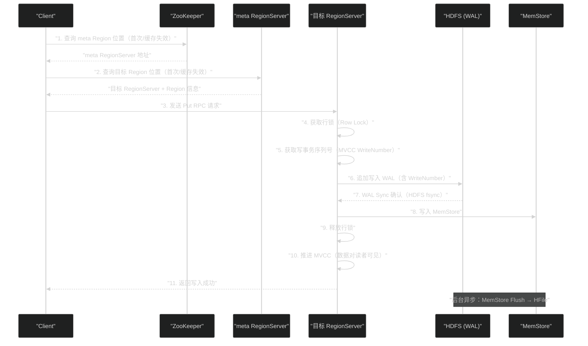

# HBase 写入链路深度解析——WAL、MemStore Flush 与持久性保证

**摘要：**

一次看似简单的 `put` 操作，在 HBase 内部经历了远比想象中更复杂的旅程。本文沿着写入请求的完整生命周期，逐层拆解 HBase 写入链路的每个关键节点：从客户端路由定位到 RegionServer，到 **WAL（Write-Ahead Log）的顺序追加与 HDFS 同步**，再到 **MemStore 的并发写入与行锁机制**，以及 **MVCC（多版本并发控制）如何保证读写一致性**，最后是 **MemStore Flush 的详细步骤与 WAL 生命周期管理**。理解这条链路，不仅能帮助读者在故障排查时精确定位问题层次，更能深刻理解 HBase 在"高吞吐写入"与"持久性保证"之间是如何做到两全的——以及在什么条件下这种两全是有代价的。

---

## 第 1 章 写入链路全景：从客户端 put 到数据可读

### 1.1 一次 Put 的完整旅程

在正式深入每个环节之前，先建立一个全局视图，看清整条写入链路的轮廓。



这个序列图中有几个关键的工程细节需要特别注意：

**步骤 6 在步骤 8 之前**：WAL 必须在数据写入 MemStore 之前先写入磁盘。这是"预写日志"（Write-Ahead Logging）原则的核心：**日志先于数据持久化**。这保证了即使在写入 MemStore 之后、Flush 到 HFile 之前 RegionServer 崩溃，也能通过重放 WAL 来恢复数据。

**步骤 9 在步骤 7 之后**：行锁在 WAL Sync 确认之后才释放（步骤 9），而不是在写 WAL 之前。这看似延长了锁持有时间，实际上是为了保证原子性：如果 WAL Sync 失败，需要回滚 MemStore 中的数据，此时行锁不能已经被释放（否则另一个线程可能读到不一致的数据）。

**步骤 10 是数据真正"可见"的时刻**：MVCC 推进（Advance）之前，即使数据已经在 MemStore 中，其他读线程也看不到它。这是 HBase 行级读写一致性的保证机制。

### 1.2 写入路径的三个关键阶段

整条写入链路可以分为三个逻辑阶段：

**阶段一：路由（Routing）**：客户端确定数据应该写到哪个 RegionServer 的哪个 Region。这个阶段通过 ZooKeeper 和 `hbase:meta` 表完成，通常被客户端缓存，实际开销极小。

**阶段二：写入事务（Write Transaction）**：RegionServer 在行锁保护下，完成 WAL 追加、WAL Sync、MemStore 写入，保证单行操作的原子性和持久性。这是整条写入链路中对延迟影响最大的阶段，HDFS 的 WAL Sync 延迟是关键瓶颈。

**阶段三：后台异步（Background Async）**：MemStore 在达到阈值后异步 Flush 到 HFile，WAL 对应段在 Flush 完成后可以被清理。这个阶段对写入响应时间没有直接影响，但会影响读取延迟（Flush 期间 MemStore 数据转移到 HFile）和存储空间。

---

## 第 2 章 WAL：HBase 持久性的最后防线

### 2.1 为什么需要 WAL

数据写入 HBase 的第一个持久化步骤，不是写入 HFile（磁盘上的有序文件），而是写入 WAL（Write-Ahead Log，预写日志）。理解 WAL 的必要性，需要回顾 HBase 的存储模型。

在 LSM-Tree 架构下，写入请求首先进入内存中的 MemStore。MemStore 是易失性的（Volatile）——一旦 RegionServer 进程崩溃，内存中的数据就会丢失。如果没有 WAL，这些尚未 Flush 到 HFile 的 MemStore 数据将永远消失，造成数据丢失。

WAL 正是为了解决这个问题而设计的：**在数据写入易失性内存之前，先将操作记录写入持久化存储（HDFS 上的 WAL 文件）**。这样，即使 RegionServer 崩溃，也能通过重放（Replay）WAL 文件来恢复 MemStore 中丢失的数据，重建崩溃前的状态。

WAL 的这个设计模式在数据库领域有悠久历史：[[MySQL]] 的 Binlog 和 Redo Log、[[PostgreSQL]] 的 WAL、[[ZooKeeper]] 的事务日志，都是同一原则的不同实现。HBase 的创新在于将 WAL 与 HDFS 的分布式存储结合，使 WAL 本身也具备了容错能力（HDFS 3 副本）。

### 2.2 WAL 的物理结构

**每个 RegionServer 有且仅有一个 WAL**，这是一个关键的设计决策。无论该 RegionServer 服务多少个 Region（可能是数百个），所有这些 Region 的写入操作都共享同一个 WAL。

这个"共享"设计不是随意的，而是针对磁盘 I/O 特性的精确优化：

如果每个 Region 有独立的 WAL，那么对每个 Region 的写入就需要对应的文件追加写，多个 Region 的 WAL 写入会成为多个独立的 I/O 流，退化为随机 I/O（各个文件分布在磁盘的不同位置）。

而共享一个 WAL，使得所有写入都追加到同一个文件——这是**严格的顺序 I/O**，充分发挥了磁盘顺序写的性能优势。这也是 HBase 能支撑高吞吐写入的另一个关键：不仅 MemStore 中的数据有序，WAL 本身也是顺序追加的。

**WAL 文件的位置**

WAL 文件存储在 HDFS 上，路径格式为：
```
/hbase/WALs/<regionserver_hostname>,<port>,<startcode>/
  <wal_file_1>
  <wal_file_2>
  ...
```

WAL 文件按时间滚动（Rolling）：当 WAL 文件达到大小阈值（默认 1GB，由 `hbase.regionserver.logroll.period` 控制，也可按时间滚动，默认 1 小时）时，关闭当前 WAL 文件，创建新的 WAL 文件。旧的 WAL 文件在其包含的所有 Region 数据都已 Flush 到 HFile 后，会被自动删除（或归档到 `/hbase/oldWALs/`）。

**WAL 条目的格式**

每条 WAL 记录（WALEdit）包含：

```
WALKey {
    encodedRegionName: bytes    // 所属 Region 的编码名
    tableName: TableName        // 所属表名
    logSeqNum: long             // 全局递增的序列号（关键！）
    writeTime: long             // 写入时间戳（毫秒）
    clusterId: UUID             // 集群ID（用于跨集群复制）
}
WALEdit {
    cells: List<Cell>           // 本次操作包含的所有 Cell（同一行的多列修改）
}
```

其中 `logSeqNum`（日志序列号，Log Sequence Number，LSN）是一个关键字段：它是全局单调递增的数字，记录了这条 WAL 条目在整个 RegionServer 写入历史中的序号。这个序号在故障恢复时非常重要——RegionServer 通过比较 HFile 中已持久化数据的最大 LSN 与 WAL 中条目的 LSN，确定哪些 WAL 条目需要重放。

### 2.3 WAL Sync：从 HDFS 缓冲到真正持久化

WAL 写入的关键步骤不仅仅是将数据追加到 HDFS 文件，更重要的是执行 **WAL Sync**——确保数据不只存在于 HDFS 客户端的写缓冲区（内存）中，而是真正持久化到了 DataNode 的磁盘上。

**HDFS 的写入语义**

HDFS 的文件写入是通过 DataNode 的写入管道（Write Pipeline）完成的：

```
HBase RegionServer (HDFS Client)
  → DataNode 1（本地，Pipeline 第一节点，写入本地磁盘缓存）
  → DataNode 2（Pipeline 第二节点，写入本地磁盘缓存）
  → DataNode 3（Pipeline 第三节点，写入本地磁盘缓存）
```

默认情况下，HDFS 的 `write()` 操作只是将数据写入 DataNode 的**内存缓冲区（OS Page Cache）**，并非立即持久化到磁盘。如果此时 DataNode 崩溃，内存中的数据可能丢失。

对于普通 HDFS 文件（MapReduce 输出、Hive 数据文件），这种延迟刷盘是可以接受的——数据批量写入，写完后 `close()` 就能保证持久化。

但对于 WAL，延迟刷盘是不可接受的：如果 WAL 数据在 DataNode 内存中而不在磁盘上，RegionServer 崩溃后 HBase 以为 WAL 已经安全（因为 HDFS `write()` 返回成功），实际上数据还在 DataNode 内存里，DataNode 再崩溃就会丢失数据。

**HSync 与 HFlush**

HDFS 提供了两个强制持久化的 API：

- **`hflush()`**：确保数据从客户端缓冲区传输到所有 DataNode，并进入 DataNode 的内核缓冲区（Page Cache）。这保证了 RegionServer 崩溃后数据不丢失（只要 DataNode 本身存活）。
- **`hsync()`**：在 `hflush()` 的基础上，进一步调用 DataNode 上的 `fsync()`，将数据从 DataNode 内核缓冲区强制写入磁盘（bypassing OS cache）。这保证了即使 DataNode 断电也不丢失数据，但代价是更高的延迟（需要等待磁盘物理写入）。

HBase 默认使用 `hflush()`（由 `hbase.wal.hsync` 配置控制，默认 `false`）。在对数据可靠性要求极高的场景（如金融数据），应将 `hbase.wal.hsync` 设为 `true` 使用 `hsync()`，代价是写入延迟增加约 2~5ms（一次磁盘旋转延迟）。

> [!warning] 生产避坑
> 很多工程师误以为 HBase 的"写入成功"等同于"数据一定不会丢失"。实际上，在默认配置（`hflush()`，非 `hsync()`）下，如果写入 WAL 后 DataNode 立即断电（比如 UPS 失效），Page Cache 中的 WAL 数据可能丢失。对于绝对不允许数据丢失的业务，必须：① 配置 `hbase.wal.hsync=true`；② 确保 HDFS DataNode 所在服务器有 UPS 电源保护。

### 2.4 WAL 的批量 Sync 优化：Group Commit

在高并发写入场景下，如果每次 WAL 写入都立即执行一次 `hflush()`/`hsync()`，I/O 次数会非常多。HBase 实现了 **Group Commit（组提交）** 机制来优化这个问题：

**核心思想**：将短时间内到达的多个写入请求的 WAL 条目批量写入，然后执行**一次** `hflush()`，让多个请求共享这次 Sync 的代价。

**实现机制**：

RegionServer 内部有一个专用的 WAL 写入线程（WAL Appender）和一个 Sync 队列：
1. 多个写入线程（处理不同客户端请求的 Handler 线程）将各自的 WAL 条目追加到 WAL 缓冲区，然后将自己的"Sync Future"加入 Sync 队列
2. WAL 写入线程定期（或缓冲区达到阈值时）批量将缓冲区中所有条目 Append 到 HDFS，然后执行**一次** `hflush()`
3. Sync 完成后，通知所有等待该批次 Sync 的 Handler 线程，这些线程继续各自的写入流程

```
时间轴：
t=0:    请求A 追加 WAL 条目，等待 Sync
t=0.1:  请求B 追加 WAL 条目，等待 Sync
t=0.2:  请求C 追加 WAL 条目，等待 Sync
t=1ms:  WAL Appender 将 A+B+C 批量 Append，执行一次 hflush()
t=2ms:  hflush() 返回，A+B+C 同时收到"Sync 成功"通知
```

Group Commit 将 N 次独立的 `hflush()` 合并为 1 次，在高并发场景下显著降低了写入延迟（从 N * 单次 Sync 延迟，降低到约 1 * Sync 延迟 + 少量等待时间）。

这个机制与关系型数据库中的 Group Commit 思路完全相同，是高吞吐持久化写入的标准优化手段。

### 2.5 WAL 的不同 Durability 级别

HBase 提供了四种 Durability（持久性）级别，可以在 Put 操作级别单独配置：

```java
Put put = new Put(rowKey);
put.addColumn(family, qualifier, value);

// 设置持久性级别
put.setDurability(Durability.SYNC_WAL);  // 写WAL并Sync（默认）
```

| 持久性级别 | WAL 行为 | 故障丢失风险 | 写入延迟 |
|-----------|---------|-----------|---------|
| `SYNC_WAL` | 写 WAL + `hflush()` | DataNode 断电可能丢失 | 中（默认） |
| `FSYNC_WAL` | 写 WAL + `hsync()` | 极低（磁盘物理持久化） | 高 |
| `ASYNC_WAL` | 写 WAL，异步 Sync | RegionServer 崩溃可能丢失 | 低 |
| `SKIP_WAL` | 不写 WAL | RegionServer 崩溃必然丢失 | 极低 |

**`SKIP_WAL` 的使用场景**

虽然 `SKIP_WAL` 意味着 RegionServer 崩溃会丢失数据，但在以下场景中是合理的：
- **批量导入**：通过 MapReduce 向 HBase 写入历史数据，源数据在 HDFS 上有备份，即使写入失败可以重跑 Job
- **缓存场景**：HBase 存储的是可再生的缓存数据，丢失后可以从源系统重建
- **测试环境**：降低 I/O 压力，加快写入速度

`SKIP_WAL` 可以将写入吞吐量提高 2~5 倍，因为完全去除了 HDFS Sync 的 I/O 开销。

---

## 第 3 章 行锁与 MVCC：写入的原子性与一致性保证

### 3.1 行锁：HBase 的并发写入控制机制

HBase 的写入使用**行锁（Row Lock）**来保证同一行的并发写入不会相互干扰。行锁的粒度是行（RowKey），同一时刻一行只能有一个写入操作持有锁。

**为什么需要行锁？**

考虑这样的场景：两个线程同时对同一行的不同列进行写入——

```
线程A：put("user_001", "info:age", "25")
线程B：put("user_001", "info:city", "Beijing")
```

如果没有行锁，两个线程可能交叉写入 MemStore：A 写入 `age`，B 写入 `city`，A 的 WAL 条目，B 的 WAL 条目……最终 MemStore 中包含了两个线程的数据，看上去正常。

但如果有一个客户端同时修改同一行的多个列（Multi-column Put），没有行锁会怎样？

```
线程A：put("user_001", "info:age"="25", "info:city"="Shanghai")  // 同时修改两列
线程B：put("user_001", "info:age"="30", "info:city"="Beijing")   // 同时修改两列
```

没有行锁时，可能出现：A 写入 `age=25`，B 写入 `age=30`，B 写入 `city=Beijing`，A 写入 `city=Shanghai`，最终状态是 `age=30, city=Shanghai`——这是一个混合了两个操作的不一致状态，两个操作都没有完整地生效。

行锁保证了：**同一行的写入操作是串行的，每个操作对该行的所有列修改是原子完成的**，不会被其他写入打断。

**行锁的实现**

HBase 的行锁是在 RegionServer 内存中维护的，每个 Region 有一个行锁映射（`ConcurrentHashMap<HashedBytes, CountDownLatch>`）：
- 写入时，对 RowKey 的哈希值尝试获取锁（`putIfAbsent`）
- 锁已存在（另一个写入持有）时，当前线程等待（`CountDownLatch.await()`）
- 写入完成后释放锁（`remove` + `CountDownLatch.countDown()`）

行锁是内存级别的轻量锁，锁的生命周期极短（WAL Sync 的时间，通常 1~5ms），不会成为性能瓶颈——除非存在大量对同一行的并发写入（热点行）。

**行锁超时**

HBase 有行锁超时机制（`hbase.rowlock.wait.duration`，默认 30 秒）：如果一个写入等待行锁超过 30 秒，抛出 `LockTimeoutException`。这防止了死锁导致的永久阻塞，同时也意味着：如果某个写入持有行锁时 RegionServer 进入长时间 GC 停顿，后续写入会因等待超时而失败。

### 3.2 MVCC：让读操作看到一致的数据

MVCC（Multi-Version Concurrency Control，多版本并发控制）是 HBase 实现读写隔离的核心机制。它解决的问题是：**一个正在进行的写入操作，应该何时对读操作可见？**

**问题场景**

假设写入一行数据包含两列：`info:name="Alice"` 和 `info:age="25"`，这两列的 KeyValue 先后写入 MemStore。

如果没有 MVCC，在第一列写入 MemStore 后、第二列写入 MemStore 前，一个并发的读操作可能读到一个"半完整"的行：`info:name="Alice"`（有），`info:age`（无，因为还没写入）。

这种"脏读"（Dirty Read）在某些业务场景下是不可接受的，特别是在需要行级一致性的场景（如同时更新多个关联字段）。

**MVCC 的核心机制：WriteNumber**

HBase 的 MVCC 基于一个全局单调递增的 **WriteNumber**（写事务序列号）：

- 每个 RegionServer 维护一个 `MvccReadPoint`（当前读事务可以看到的最大 WriteNumber）
- 每次写入操作开始时，分配一个新的 `WriteNumber`（比当前最大值 +1）
- 写入操作完成（WAL Sync 成功，MemStore 写入完毕）后，"推进"（Advance）MVCC，更新 `MvccReadPoint`
- 读操作只能看到 WriteNumber ≤ MvccReadPoint 的数据

**WriteNumber 在 KeyValue 中的存储**

每个 Cell 的 Timestamp 字段在 HBase 内部有双重含义：
- **对外**：用户看到的时间戳（版本号）
- **对内**（Flush 之前）：MVCC WriteNumber，标识这个 Cell 属于哪个写事务

当 MemStore Flush 到 HFile 时，WriteNumber 信息被从 Cell 中剥离（因为已经持久化，不再需要 MVCC 保护），只保留用户指定的时间戳。

**写事务的完整 MVCC 流程**

```
步骤 1：获取行锁（隔离同行的并发写入）

步骤 2：分配 WriteNumber = currentMax + 1（原子操作）
        此时 WriteNumber 比 MvccReadPoint 大，写入的数据对读者不可见

步骤 3：WAL 写入（包含 WriteNumber）

步骤 4：WAL Sync

步骤 5：写入 MemStore（所有 Cell 都标记相同的 WriteNumber）

步骤 6：释放行锁

步骤 7：推进 MVCC（Advance MvccReadPoint 到当前 WriteNumber）
        此时数据对读者可见！

步骤 8：返回客户端成功
```

注意步骤 7 在步骤 6（释放行锁）之后，在步骤 8（返回成功）之前。这个顺序保证了：

- **在写入完成之前，数据对读者不可见**（MVCC 未推进）
- **一旦返回客户端成功，数据对读者立即可见**（MVCC 已推进）
- **行锁释放和 MVCC 推进之间没有"可见但不完整"的状态**

> [!note] 设计哲学
> HBase 的行级 MVCC 保证了这样的读一致性：**在一个写事务的所有列都写入 MemStore 之前，没有任何读操作能看到这些新数据；一旦所有列都写入完毕并推进 MVCC，所有后续读操作立即可以看到完整的写入结果**。这是行级（但非跨行级）的读写一致性保证。

### 3.3 MVCC 对延迟写入的影响

MVCC 的推进是**串行的**，而不是并发的：`MvccReadPoint` 必须按 WriteNumber 的顺序递增推进（不能跳过）。

这意味着：如果 WriteNumber=5 的写事务在等待 WAL Sync（比较慢），而 WriteNumber=6 的写事务已经完成了 WAL Sync 和 MemStore 写入，WriteNumber=6 的数据**不能立即对读者可见**，必须等待 WriteNumber=5 先完成并推进 MVCC。

这种串行推进保证了"不存在写入顺序倒置"的一致性：WriteNumber 较小（更早的写入）一定在 ReadPoint 推进之前完成，不会出现"晚写的可见，早写的不可见"的乱序现象。

代价是：一个慢速写入（如 WAL Sync 延迟较高）可能阻塞后续写入的 MVCC 推进，导致后续写入数据的可见时间被推迟。这是 HBase 写入尾延迟（Tail Latency）高的一个内在原因。

---

## 第 4 章 写入链路的完整步骤解析

### 4.1 客户端侧：请求路由与批量写入优化

**Region 路由的缓存机制**

HBase Java 客户端（`Connection` 对象）内部维护了两级缓存：

1. **ZooKeeper meta 地址缓存**：meta 表所在 RegionServer 的地址，几乎永不失效（meta 表很少迁移）
2. **Region 位置缓存**：`TableName + RowKey → RegionServer + Region` 的映射，在 Region 迁移或分裂时失效，通过重试机制自动刷新

对于大多数写入操作，路由开销接近零（全部命中缓存），写入延迟主要由 WAL Sync 决定。

**批量写入：Put List 的优化**

HBase 客户端支持批量写入（`Table.put(List<Put>)`），内部实现了自动批次（Auto-Batch）机制：将属于同一个 RegionServer 的多个 Put 打包成一个 RPC 请求（`MultiAction`），批量发送，减少 RPC 次数。

对于属于同一个 Region 的多行写入，RegionServer 还会将这些写入合并成一个 WAL Sync（Group Commit），进一步减少 I/O 次数。

**客户端缓冲区写入（Buffer Put）**

HBase 客户端支持配置写入缓冲区（`setWriteBufferSize`），在缓冲区满之前不发送 RPC，适用于对延迟不敏感但对吞吐量有要求的批处理场景。

```java
// 配置 2MB 写入缓冲区
BufferedMutator mutator = connection.getBufferedMutator(
    new BufferedMutatorParams(TableName.valueOf("logs"))
        .writeBufferSize(2 * 1024 * 1024)
);
mutator.mutate(put);  // 不立即发送，积累到缓冲区满
mutator.flush();      // 显式刷新，发送所有积累的写入
```

### 4.2 RegionServer 侧：处理线程模型

RegionServer 使用 Netty 作为网络框架，内部有以下线程层次：

- **Netty I/O 线程（EventLoop）**：负责接收网络数据，**不执行业务逻辑**，立即将请求传递给 Handler 线程
- **RPC Handler 线程池**（默认 30 个，由 `hbase.regionserver.handler.count` 控制）：执行写入的业务逻辑（行锁、WAL 写入、MemStore 写入）

Handler 线程数量是 HBase 写入吞吐量的重要配置参数：
- 线程数太少：大量请求在队列中等待，写入延迟高
- 线程数太多：线程上下文切换开销大，内存占用高，同时会加剧 WAL Sync 的竞争

生产中，Handler 线程数通常根据 `CPU 核数 × 2` 或实际负载测试结果来配置，范围在 20~100 之间。

### 4.3 WAL 写入的详细时序

一次 Put 请求在 RegionServer 端的 WAL 写入过程：

**第一步：序列化 WALEdit**

将 Put 操作包含的所有 Cell 序列化为 `WALEdit` 对象（Protobuf 格式），与 `WALKey`（包含表名、Region 名、LSN）组合成一条 WAL 记录。

**第二步：追加到 WAL 缓冲区**

调用 `WAL.append()`，将 WAL 记录追加到内存缓冲区（不是立即写入 HDFS）。

**第三步：请求 Sync**

调用 `WAL.sync()`，将缓冲区中所有积累的 WAL 条目批量写入 HDFS，然后执行 `hflush()`/`hsync()`。当前 Handler 线程等待 Sync 完成（通过 `Future.get()` 或 `CountDownLatch.await()`）。

**第四步：检查 Sync 结果**

如果 Sync 失败（HDFS 写入异常），执行回滚：将已经写入 MemStore 的数据（如果有的话）标记为无效，返回客户端写入失败。

实际上，由于 MemStore 写入（步骤 8）在 WAL Sync（步骤 7）之后，Sync 失败时 MemStore 中可能还没有数据，不需要回滚。

### 4.4 MemStore 写入的并发细节

MemStore 写入是在 WAL Sync 完成后执行的，此时行锁仍然被持有。写入步骤：

1. **获取 MemStore 的写锁**（`updateLock.writeLock()`）：MemStore 在 Flush 时需要一个"将 active 切换为 snapshot"的原子操作，写锁保护这个切换不被并发写入干扰。这个锁持有时间极短（微秒级）。

2. **检查是否需要在写入前 Flush**：如果 MemStore 已经超过阈值（大于 `flush.size`），在写入新数据之前先触发 Flush（确保不会在极限边界上造成内存溢出）。

3. **将 Cell 写入 ConcurrentSkipListMap**：每个 Cell 以其完整的（RowKey, CF, CQ, Timestamp, Value）为 key/value 写入跳表。

4. **更新 MemStore 大小统计**：增加 MemStore 的内存占用计数（用于触发 Flush 判断）。

---

## 第 5 章 MemStore Flush 的完整机制

### 5.1 Flush 的触发与执行

在第 04 篇文章中，我们介绍了 MemStore Flush 的触发条件（单个 MemStore 超阈值、全局内存超限、WAL 文件数上限）。本节深入 Flush 的执行过程。

**阶段一：准备快照（瞬间操作）**

Flush 开始时，RegionServer 的 Flush 线程（`MemStoreFlusher`）对目标 Region 执行以下操作：

```java
// 准备快照：将 active ConcurrentSkipListMap 切换为 snapshot
// 这个操作在写锁保护下执行，耗时 < 1ms
region.snapshot();
// 此后新的写入进入新的 active，不影响正在 Flush 的 snapshot
```

快照准备完成后，新的写入立即可以继续进入新的 active MemStore。这个阶段对写入延迟的影响极小。

**阶段二：将 Snapshot 写入 HFile（耗时操作）**

Flush 线程遍历 Snapshot 中有序的 KeyValue 序列，逐条写入 HFile（通过 HFile Writer，详见第 04 篇）。

这个阶段的耗时取决于 Snapshot 的大小（通常是 128MB 左右）和 HDFS 写入速度。在正常情况下，128MB 的 Snapshot Flush 到 HFile 需要约 2~10 秒。

**阶段三：原子切换（提交 Flush 结果）**

HFile 写入完成后，RegionServer 执行一个原子操作：
- 将新生成的 HFile 注册到 Store 的 HFile 列表中
- 删除内存中的 Snapshot

这个切换是原子的：要么成功（HFile 注册 + Snapshot 清除），要么失败（保留 Snapshot，下次重试）。如果 RegionServer 在 HFile 写入完成后、切换之前崩溃，重启时会发现 HDFS 上存在一个未注册的 HFile，这个"孤儿文件"会在启动时的清理阶段被删除，Snapshot 中的数据通过 WAL 重放恢复。

**阶段四：WAL 清理**

Flush 完成后，RegionServer 检查可以清理哪些 WAL 文件：遍历所有 WAL 文件，对每个 WAL 文件检查其包含的所有 Region 的数据是否都已经 Flush 到 HFile（通过比较 WAL 中的 LSN 与 HFile 的最大 LSN）。可以安全删除的 WAL 文件被移动到 `/hbase/oldWALs/` 目录（等待 Master 的 HFile Cleaner 定期清理）。

### 5.2 Flush 期间的读取一致性

Flush 期间，一个 Region 同时存在三部分数据：
1. **新的 active MemStore**：新写入的数据
2. **正在 Flush 的 Snapshot**：准备写入 HFile 的数据
3. **已有的 HFile**：已经持久化的历史数据

读取请求需要合并这三部分数据，返回最新版本。RegionServer 的读取路径（详见第 06 篇）能够同时扫描 active MemStore、Snapshot 和所有 HFile，在合并时使用 WriteNumber/Timestamp 来确定版本顺序，保证读取到的是一致的最新视图。

### 5.3 Flush 的性能边界与调优

**关键指标：Flush 队列积压**

如果 Flush 速度赶不上写入速度（MemStore 增长速度 > Flush 速度），会发生：

1. **写入减速（Stall）**：当 RegionServer 全局 MemStore 超过 `global.memstore.size * lower.limit`，HBase 会主动降低写入速度（在写入请求处理前额外睡眠一段时间），给 Flush 追上的机会

2. **写入阻塞（Block）**：当全局 MemStore 超过 `global.memstore.size`（默认 40% 堆内存），HBase 完全阻止新的写入，直到 Flush 将内存降到阈值以下

写入阻塞是 HBase 生产中写入延迟突然暴增的常见根因，监控 `regionserver.memStoreSize` 指标是必要的。

**优化 Flush 速度的方法**：
- **增加 Flush 并发数**（`hbase.hstore.flusher.count`，默认 2）：允许多个 Store 并行 Flush
- **增加 HDFS 带宽**：使用更快的磁盘或 SSD，提升 DataNode 写入速度
- **减小 MemStore 阈值**（`hbase.hregion.memstore.flush.size`，从默认 128MB 降低到 64MB）：更频繁地 Flush，每次 Flush 的数据量更小，耗时更短，但 HFile 数量增多（需要更多 Compaction）
- **预写 L0 HFile 检查**（`hbase.hregion.memstore.chunkpool.maxsize`）：使用 MSLAB（MemStore Local Allocation Buffer）减少 GC 压力，稳定 Flush 速度

---

## 第 6 章 写入过程中的异常处理

### 6.1 WAL Sync 失败的处理

WAL Sync 失败是写入过程中最严重的错误。处理流程：

1. RegionServer 捕获 `IOException`
2. 如果可以重试（如临时网络抖动），等待一段时间后重新发起 Sync
3. 如果超过重试次数，RegionServer 会调用 `abort()`——**主动终止自己**（JVM 退出或 Kill -9 自身）

RegionServer 主动终止这个看似极端的行为，实际上是必要的：如果 WAL Sync 持续失败，RegionServer 不能继续服务写入请求（没有 WAL 的写入不符合持久性保证），也不能继续服务读取（因为可能存在不一致的状态）。主动终止触发 ZooKeeper 节点删除，HMaster 随即进行故障恢复——这是 HBase "Fail-Fast"设计哲学的体现。

### 6.2 RegionServer 崩溃后的 WAL 恢复

RegionServer 崩溃后，HMaster 触发 WAL 恢复流程（详细过程在第 09 篇高可用文章中展开）：

**WAL 分割（WAL Split）**：将故障 RegionServer 的 WAL 文件按 Region 拆分，每个 Region 得到一个独立的恢复日志文件（Recovery Log），存放在 `/hbase/data/<namespace>/<table>/<region>/recovered.edits/` 目录下。

**WAL 重放（WAL Replay）**：接管 Region 的新 RegionServer 在打开 Region 时，检查是否存在 `recovered.edits/` 目录。如果存在，按 LSN 顺序重放其中的 WAL 条目（将对应 Cell 写入 MemStore），然后触发 Flush，将恢复的数据持久化到 HFile。重放完成后，删除 `recovered.edits/` 文件。

**重放完成 = 数据完整恢复**：WAL 重放保证了在故障发生时 MemStore 中所有已通过 WAL Sync 的数据都被恢复，不丢失任何确认写入的数据。（如果写入在 WAL Sync 之前 RegionServer 崩溃，该写入对客户端本身就没有确认，不存在"应该恢复但没恢复"的数据）。

---

## 第 7 章 写入性能的工程调优框架

### 7.1 写入延迟的分解

一次 Put 操作的端到端延迟可以分解为以下部分：

```
总延迟 = 路由延迟 + 网络RTT + WAL Sync延迟 + MemStore写入延迟 + MVCC推进延迟

其中：
  路由延迟     ≈ 0（全部命中缓存）
  网络RTT      ≈ 0.1~1ms（局域网内）
  WAL Sync延迟 ≈ 1~10ms（最主要的延迟来源）
    - HDFS pipeline写入延迟
    - hflush()/hsync() 等待时间
    - Group Commit 批聚合等待时间
  MemStore写入延迟 ≈ < 0.1ms（内存操作）
  MVCC推进延迟 ≈ 0~几ms（依赖前序写入完成）
```

**WAL Sync 延迟**是写入延迟的绝对主导因素。优化写入延迟，本质上就是优化 WAL Sync 延迟。

### 7.2 WAL Sync 延迟的优化方向

**优化一：WAL 文件放在本地 SSD 而非 HDFS**

HBase 2.x 引入了 **WAL on SSD** 特性：将 WAL 文件写入本地 SSD，而不是 HDFS。本地 SSD 的 `fsync()` 延迟约 100μs，远低于 HDFS `hflush()` 的 1~5ms。

代价是：WAL 不再有 HDFS 的 3 副本保护，需要依靠 HDFS 定期将本地 WAL 归档到 HDFS 来确保持久性。这是一种持久性与延迟的权衡。

**优化二：增大 Group Commit 的批大小**

通过调整 Group Commit 的等待时间（`hbase.regionserver.wal.asyncer.batch.size` 或相关参数），让更多写入聚合在一次 Sync 中，降低每个写入分摊的 I/O 代价。适合高并发场景，但会略微增加单个请求的等待时间。

**优化三：使用 AsyncFSWAL**

HBase 2.x 引入了基于 Netty 的 **AsyncFSWAL**，相比传统的 `FSHLog`（使用 HDFS 同步写接口），AsyncFSWAL 使用 HDFS 的异步 Pipeline 写入，减少线程阻塞，在高并发下有更好的吞吐量。

**优化四：降低 Durability 要求（在业务允许的情况下）**

对于不需要严格持久性的写入（如日志类、可重建的数据），使用 `ASYNC_WAL` 甚至 `SKIP_WAL`，完全去除 Sync 延迟。

### 7.3 吞吐量与延迟的权衡总结

HBase 写入路径设计中，有几个核心的吞吐量-延迟权衡点，整理如下：

| 配置/机制 | 吞吐量 | 延迟 | 持久性 | 备注 |
|----------|--------|------|--------|------|
| `FSYNC_WAL` | 低 | 高 | 最强 | 磁盘物理持久化 |
| `SYNC_WAL`（默认）| 中 | 中 | 强 | HDFS hflush |
| `ASYNC_WAL` | 高 | 低 | 弱 | 崩溃可能丢最近写入 |
| `SKIP_WAL` | 极高 | 极低 | 无 | 不可用于重要数据 |
| Group Commit 大 | 极高 | 略高 | 不变 | 批次越大，延迟越高 |
| Group Commit 小 | 较低 | 极低 | 不变 | 适合低延迟场景 |
| Handler 线程多 | 高（高并发） | 低 | 不变 | 注意 GC 压力 |
| MemStore 大 | 高（少Flush）| 低 | 不变 | 注意内存压力 |

这个表格是 HBase 写入调优的"决策矩阵"：根据业务对吞吐量、延迟、持久性的要求，在表中找到最合适的配置组合。

---

## 第 8 章 总结：写入链路是 HBase 设计哲学的集中体现

HBase 写入链路的设计，是其核心工程哲学在具体机制上的集中体现：

**"先日志，后数据"（Log Before Data）**：WAL 在 MemStore 写入之前完成 Sync，这是持久性的基石，也是所有数据库可靠性设计的普适原则。

**"顺序写替代随机写"（Sequential over Random）**：WAL 的追加写、MemStore 的有序批量 Flush，将所有持久化操作转化为顺序 I/O，这是高吞吐写入的根本。

**"行锁 + MVCC = 原子性 + 一致性"**：行锁保证了同一行写入的串行性，MVCC 保证了读取者看到的是完整、一致的数据，两者共同构成了 HBase 行级事务的保证边界。

**"Fail-Fast 胜于容错蒙混"**：WAL Sync 失败时 RegionServer 主动终止，而不是带着可能不一致的状态继续运行，这是 HBase 容错设计的底线——宁可不可用，不接受数据不一致。

理解了写入链路的设计，下一篇文章的读取链路将顺理成章：读取的复杂性正是写入链路"分散存储"（MemStore + 多 HFile）的对立面——如何高效地将分散在多个位置的数据合并成一个一致的视图，就是读取链路的核心问题。

---

## 参考资料

- [1] Apache HBase Reference Guide — Write Path: https://hbase.apache.org/book.html#client.writebuffer
- [2] HBase: Durability Guarantees: http://hadoop-hbase.blogspot.com/2013/05/hbase-durability-guarantees.html
- [3] HBase 源码分析之 WAL: https://lihuimintu.github.io/2019/06/03/WAL-of-HBase-Source-Code-Analysis/
- [4] HBase 行锁与 MVCC: https://lihuimintu.github.io/2019/04/29/hbase-mvcc/
- [5] HBase 写入流程精讲: https://blog.csdn.net/qq_33446500/article/details/108564025
- [6] HDFS-744: HDFS fsync semantics: https://issues.apache.org/jira/browse/HDFS-744
- [7] HBASE-5954: Improve HBase WAL durability: https://issues.apache.org/jira/browse/HBASE-5954
