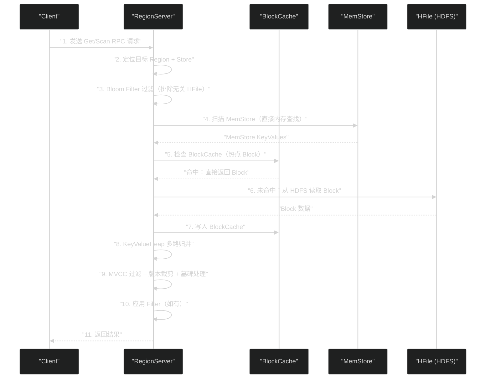

# HBase 读取链路深度解析——BlockCache、Scanner 与多版本合并

**摘要：**

如果说 HBase 的写入链路是"化随机为顺序"的工程杰作，那么读取链路则是在这份"分散存储"遗产上，尽力还原出高效访问能力的复杂工程。一次 `Get` 操作，在 RegionServer 内部需要同时扫描 MemStore、可能的 Flush Snapshot，以及磁盘上数量不等的 HFile——然后通过精巧的**优先级堆（KeyValueHeap）**将多路有序数据流归并，按 MVCC 规则过滤出用户可见的版本。本文从数据可能存在的每一个位置出发，逐层拆解读取路径：**BlockCache 的分层缓存架构**（LRUBlockCache vs BucketCache 的工程取舍）、**Bloom Filter 的过滤逻辑**（如何在毫秒内排除无关 HFile）、**StoreScanner 与 KeyValueHeap 的多路归并机制**，以及 **Scan 操作的流控与服务端过滤下推**。

---

## 第 1 章 读取链路的基本困境：数据分布在哪里

### 1.1 写入模型决定了读取的复杂性

HBase 的读取复杂性是其 LSM-Tree 写入模型的直接后果。一次 Put 写入后，数据可能同时存在于：

1. 当前活跃的 **MemStore**（最新写入但未持久化）
2. 正在 Flush 的 **MemStore Snapshot**（如果恰好在 Flush 过程中）
3. 最近 Flush 生成的小 **HFile**（L0 层）
4. 经过 Minor/Major Compaction 合并的更大 **HFile**

读取操作必须检查所有可能包含目标数据的位置，合并多个版本，返回最新结果——这就是第 04 篇所说"读放大"的具体体现。

### 1.2 读取链路全景时序图



步骤 3（Bloom Filter）和步骤 5（BlockCache 命中）是两个最关键的"短路"机会——任一命中，后续昂贵的磁盘 I/O 就可以跳过。

---

## 第 2 章 BlockCache：读取性能的第一道防线

### 2.1 BlockCache 是什么，为什么以 Block 为粒度缓存

[[BlockCache]] 是 RegionServer 级别的读缓存，缓存最近从 HFile 读取的数据块（Block）。

缓存粒度是 **Block**（默认 64KB），而不是单个 KeyValue，也不是整个 HFile。这个设计与 HFile 的实际 I/O 单元对齐：HDFS 读取的最小单位就是 Block，以 Block 为缓存粒度没有任何额外开销。

**BlockCache 中缓存的 Block 类型：**

| Block 类型 | 内容 | 缓存优先级 |
|-----------|------|-----------|
| **DATA Block** | 实际的 KeyValue 数据 | 标准（可被淘汰） |
| **INDEX Block** | HFile 的多级索引 | 高优先级（常驻） |
| **BLOOM Block** | Bloom Filter 位数组 | 高优先级（常驻） |

INDEX Block 和 BLOOM Block 被优先保留，因为它们是访问 HFile 的必要前提。

### 2.2 LRUBlockCache：基础的堆内缓存

**LRUBlockCache** 是默认实现，存储在 JVM 堆内存，使用改进版 LRU 淘汰策略。

**三级优先队列设计：**

- **Single Priority（25%）**：Block 首次被缓存，表示"只被访问过一次"
- **Multi Priority（50%）**：Block 被多次访问后晋升，表示"热点数据"
- **In-Memory Priority（25%）**：列族标记 `IN_MEMORY=true` 的数据，即使访问频率低也保留

这个设计解决了**全表扫描污染缓存（Scan Pollution）**问题：Scan 操作读取的 Block 进入 Single Priority，缓存满时首先从 Single 区淘汰，保护 Multi Priority 中的热点 Get 数据不被 Scan 驱逐。

> [!warning] 生产避坑
> 对于 MapReduce 作业等大规模 Scan，建议显式关闭缓存：
> ```java
> scan.setCacheBlocks(false);  // 禁止 Scan 结果进入 BlockCache
> ```

**LRUBlockCache 的 GC 问题：** 大量 Block 对象在 JVM 堆中，触发 Full GC 可能需要数十秒 Stop-the-World。这是 BucketCache 的设计动机。

### 2.3 BucketCache：堆外缓存的工程解决方案

**BucketCache** 将 Block 数据存储在 **JVM 堆外内存（Off-Heap）**或**本地 SSD 文件**中，彻底规避 GC 问题。

BucketCache 将堆外内存组织为不同大小的"桶（Bucket）"，每个 Block 分配到与其大小最接近的 Bucket 中，以原始字节数组存储——GC 无法感知，无需扫描和回收。

**CombinedBlockCache（生产推荐配置）：**

- **LRUBlockCache（堆内 L1）**：存储 INDEX Block 和 BLOOM Block（体积小、访问频率极高）
- **BucketCache（堆外 L2）**：存储 DATA Block（体积大，对 GC 影响大）

```xml
<!-- hbase-site.xml 配置示例 -->
<property>
  <name>hbase.bucketcache.ioengine</name>
  <value>offheap</value>
</property>
<property>
  <name>hbase.bucketcache.size</name>
  <value>8192</value>  <!-- 8GB 堆外缓存（MB） -->
</property>
<property>
  <name>hfile.block.cache.size</name>
  <value>0.2</value>   <!-- 20% 堆内作为 L1 -->
</property>
```

| 模式 | 数据位置 | 适用场景 |
|------|---------|---------|
| `offheap` | JVM 堆外内存 | 内存充足（>32GB），最常用 |
| `file` | 本地 SSD 文件 | 内存不足但有高速 SSD |
| `mmap` | 内存映射文件 | 特定 OS 调优场景 |

---

## 第 3 章 Bloom Filter 过滤：读取的第二道防线

### 3.1 Bloom Filter 的过滤时机与效益

在访问 HFile 的 I/O 之前，RegionServer 对每个 HFile 执行 Bloom Filter 查询：

```
结果 → "一定不存在"：跳过该 HFile，节省 2 次 I/O（索引 Block + 数据 Block）
结果 → "可能存在"  ：继续通过索引定位数据 Block
```

假设一个 Store 有 20 个 HFile，目标数据只在最新的 1 个文件中：
- **没有 Bloom Filter**：需访问所有 20 个 HFile → 约 40 次 I/O
- **有 Bloom Filter**（1% 误判率）：约 1.2 个 HFile 被访问 → 约 2-3 次 I/O

**I/O 次数降低约 15 倍**——这是生产中强烈建议开启 Bloom Filter 的核心依据。

### 3.2 Bloom Filter 粒度选择

| 粒度 | 适用场景 | 内存代价 |
|------|---------|---------|
| `ROW`（默认）| 按 RowKey 的 Get，每行列数均匀 | 低 |
| `ROWCOL` | 按特定列精确查询，数据极度稀疏 | 高 |
| `NONE` | 主要是全表扫描场景，Get 极少 | 无 |

---

## 第 4 章 Scanner 机制：多路归并的工程实现

### 4.1 Scanner 三层体系

```
RegionScanner（Region 级别）
  ├── StoreScanner（列族 CF1）
  │     ├── MemStoreScanner
  │     ├── SnapshotScanner（Flush 期间）
  │     ├── StoreFileScanner_1（HFile 1）
  │     └── StoreFileScanner_N（HFile N）
  │           ↕ 由 KeyValueHeap 归并
  └── StoreScanner（列族 CF2）
        └── ...
```

每一层都由 **`KeyValueHeap`**（最小堆）将下层多路数据流归并为一路有序数据流，时间复杂度 O(N log K)，K 是 Scanner 数量。

### 4.2 KeyValueHeap 排序规则

KeyValue 排序优先级（从高到低）：

1. **RowKey 字节序**（字典序升序）
2. **Column Family** 名称字典序
3. **Column Qualifier** 名称字典序
4. **Timestamp 降序**：**越新的版本排在越前面**
5. **KeyValue Type**：Put < Delete

Timestamp 降序是多版本支持的关键——最新版本总是最先出现，读取到足够的版本数后即可停止扫描，不必遍历所有历史版本。

### 4.3 MVCC 过滤与版本裁剪

**MVCC 过滤：** 读操作开始时获取当前 `MvccReadPoint` 快照，WriteNumber > MvccReadPoint 的 KeyValue 被过滤（这些是读操作开始后才写入的数据）。

**版本裁剪：** 对每个（RowKey, CF, CQ），按 Timestamp 降序只保留最新的 `VERSIONS` 个版本。

**墓碑处理：** `Delete`/`DeleteColumn` 类型的 KeyValue 被应用后，对应数据被标记为不可见。墓碑标记在 Compaction 阶段才会被物理清除。

---

## 第 5 章 Get 与 Scan 的执行差异

### 5.1 Get：精确点查的快速路径

Get 有两个额外优化：

**时间范围过滤：** HFile Trailer 中记录了最小/最大时间戳，若 Get 指定了 `TimeRange`，可直接跳过时间范围不重叠的 HFile，甚至不需要访问其 Bloom Filter。

**Bloom Filter 高效利用：** Get 的目标是精确的 RowKey（或 RowKey+Qualifier），与 Bloom Filter 的粒度完全匹配，过滤效率最高。

### 5.2 Scan：范围扫描的流控机制

Scan 操作有别于 Get 的关键挑战是：如何处理跨越大量行的扫描，同时控制内存和网络传输。

**Scan 的分批返回机制：**

客户端的一次 Scan 在逻辑上是连续的，但在实现上是分批次的 RPC 请求：

```java
Scan scan = new Scan();
scan.setCaching(100);        // 每次 RPC 从服务端获取 100 行
scan.setMaxResultSize(2 * 1024 * 1024);  // 每次 RPC 最大返回 2MB 数据
```

- **`setCaching(n)`**：RegionServer 一次返回 n 行给客户端，减少 RPC 次数（默认 1 行，效率极低，生产中建议 100~500）
- **`setMaxResultSize(bytes)`**：单次 RPC 返回的最大字节数，防止单行数据过大导致内存溢出

**Server-Side Scanner 的状态保持：**

RegionServer 为每个活跃的 Scan 维护一个 `RegionScanner` 对象（有状态的服务端游标）。每次客户端 RPC 时，RegionServer 从上次停止的位置继续扫描。

> [!warning] 生产避坑
> **Scan 泄漏问题**：如果客户端创建了 Scanner 但未调用 `close()`，RegionServer 上的 `RegionScanner` 对象会持续占用内存。HBase 通过 Scanner 租约（Lease）机制解决这个问题：若一个 Scanner 超过 `hbase.client.scanner.timeout.period`（默认 60 秒）无操作，RegionServer 自动关闭该 Scanner 并回收资源。
> 
> 因此生产代码中必须用 `try-with-resources` 确保 Scanner 被关闭：
> ```java
> try (ResultScanner scanner = table.getScanner(scan)) {
>     for (Result result : scanner) { ... }
> }  // 自动调用 scanner.close()
> ```

**Scan 的 HeartBeat 机制（HBase 2.x）：**

对于非常大的行（一行有数千列），服务端处理可能超过客户端超时时间。HBase 2.x 引入了 HeartBeat 响应：RegionServer 在超时前向客户端发送一个"心跳"（部分结果），告知客户端"我还在处理，请继续等待"。

---

## 第 6 章 Filter：服务端谓词下推

### 6.1 Filter 的工程价值

HBase 的 Filter 机制允许在 RegionServer 端执行数据过滤，只将满足条件的数据通过网络返回给客户端。

**没有 Filter 时：** RegionServer 返回所有数据 → 客户端过滤 → 大量无效网络传输

**有 Filter 时：** RegionServer 过滤后只返回满足条件的数据 → 网络传输量大幅减少

这是经典的"谓词下推（Predicate Pushdown）"优化，在数据库系统中普遍存在。

### 6.2 常用 Filter 分类与适用场景

**行键相关 Filter（高效，利用字节序）：**

| Filter | 作用 | I/O 优化 |
|--------|------|---------|
| `PrefixFilter(prefix)` | 只返回 RowKey 以 prefix 开头的行 | 扫描到第一个不匹配前缀的行时自动停止 |
| `RowFilter(op, comparator)` | 按 RowKey 正则/比较过滤 | 部分情况可提前终止 |
| `PageFilter(pageSize)` | 限制返回行数（分页） | 返回够了立即停止 |

**列相关 Filter（中等效率）：**

| Filter | 作用 |
|--------|------|
| `FamilyFilter` | 按列族过滤 |
| `QualifierFilter` | 按列限定符过滤 |
| `ColumnPrefixFilter(prefix)` | 列名前缀匹配 |
| `ColumnRangeFilter(min, max)` | 列名范围匹配 |

**值相关 Filter（低效，需扫描所有数据）：**

| Filter | 作用 | 注意 |
|--------|------|------|
| `ValueFilter(op, comparator)` | 按 Cell 值过滤 | 需扫描所有 Cell 的值 |
| `SingleColumnValueFilter(cf, cq, op, value)` | 按特定列的值过滤整行 | 类似 SQL WHERE，但本质是全行扫描 |

> [!warning] 生产避坑
> `SingleColumnValueFilter` 和 `ValueFilter` 虽然减少了网络传输，但**不能减少服务端的 I/O 扫描量**——它们仍然需要读取所有数据后才能判断是否满足条件。如果业务频繁需要按非 RowKey 字段查询，正确做法是建立二级索引（[[Apache Phoenix]]）或设计更合理的 RowKey，而不是依赖 ValueFilter 扫表。

**Filter 组合（FilterList）：**

```java
// AND 关系：同时满足多个条件
FilterList andFilter = new FilterList(FilterList.Operator.MUST_PASS_ALL);
andFilter.addFilter(new PrefixFilter(Bytes.toBytes("user_001")));
andFilter.addFilter(new ColumnPrefixFilter(Bytes.toBytes("info:")));

// OR 关系：满足任一条件
FilterList orFilter = new FilterList(FilterList.Operator.MUST_PASS_ONE);
```

---

## 第 7 章 读取性能的系统性分析

### 7.1 读取延迟的分解

一次 Get 操作的端到端延迟：

```
总延迟 = 路由延迟 + 网络RTT + RegionServer处理延迟

RegionServer处理延迟 ≈
  Bloom Filter 查询（内存）     < 0.1ms
  + BlockCache 查找            < 0.1ms（命中时）
  + HDFS 读取（未命中时）        5~30ms（Block 大小和网络决定）
  + KeyValueHeap 归并（CPU）    < 1ms（通常 HFile 数量不多）
  + MVCC/版本/墓碑处理          < 0.1ms
```

**BlockCache 命中率是决定读取延迟的关键变量**：命中时延迟在 1ms 以内，未命中时延迟跳升到 10~50ms。

### 7.2 影响读取性能的关键因素

**因素一：HFile 数量**

HFile 数量越多，需要 Bloom Filter 查询和潜在的索引/数据 I/O 就越多。控制 HFile 数量是 Compaction 的核心目标（详见第 07 篇）。

生产指标：每个 Store 的 HFile 数量建议控制在 5 个以内。超过 10 个时读取性能开始显著下降，超过 20 个时需要立即触发 Compaction。

**因素二：BlockCache 命中率**

通过监控 `blockCacheHitPercent` 指标（通常期望 > 90%）判断缓存是否足够大。

提升命中率的方法：
- 增大 BlockCache 容量（或使用 BucketCache 利用堆外内存）
- 对热点数据的列族配置 `IN_MEMORY=true`（保证其在 LRUBlockCache 的 In-Memory 分区，不被淘汰）
- 减少不必要的 Scan（Scan 会将 Single-use Block 放入缓存，稀释 Get 命中率）

**因素三：数据局部性**

HBase 数据存储在 HDFS 上，理想情况下 Region 的 HFile 数据存储在与 RegionServer 同一台机器的 DataNode 上（数据局部性 100%）。当数据局部性低时，读取 HFile 需要通过网络访问其他 DataNode，延迟增加。

数据局部性会在 Region 迁移（负载均衡）后下降，之后随着 Compaction（重写 HFile 到本地 DataNode）逐渐恢复。可通过 `storefile_localityIndex` 指标监控。

**因素四：Row 复杂度**

如果一行包含大量 KeyValue（数千个列限定符），即使 Bloom Filter 命中，读取该行也需要扫描大量数据。建议单行列数不超过 10 万，对超宽行进行行键拆分设计。

---

## 第 8 章 总结：读写链路的设计对称性

至此，写入链路（第 05 篇）和读取链路（本篇）都已完整解析。回顾两条链路的设计，可以看出一种清晰的**对称性**：

| 维度 | 写入链路 | 读取链路 |
|------|---------|---------|
| **核心挑战** | 随机写 → 顺序写 | 分散读 → 高效合并 |
| **内存结构** | MemStore（写缓冲） | BlockCache（读缓存） |
| **磁盘格式** | WAL（顺序追加） | HFile（有序不可变） |
| **关键优化** | Group Commit、双缓冲 Flush | Bloom Filter、KeyValueHeap |
| **一致性机制** | MVCC WriteNumber | MVCC ReadPoint 过滤 |
| **性能瓶颈** | WAL Sync（HDFS fsync） | BlockCache 未命中（HDFS 随机读） |

写入链路通过"分散存储"换来了高吞吐写入，读取链路通过"多级缓存 + 多路归并"尽力弥补分散存储带来的读放大代价。而 **Compaction**（第 07 篇）正是将这两条链路连接起来的关键后台机制——它通过合并 HFile，降低读取链路的 HFile 数量，从而直接改善读放大问题。

---

## 参考资料

- [1] Apache HBase Reference Guide — BlockCache: https://hbase.apache.org/book.html#block.cache
- [2] HBase BlockCache 读缓存: https://lihuimintu.github.io/2019/02/27/hbase-blockcache/
- [3] HBase 读流程解析与优化的最佳实践: https://www.iteblog.com/archives/2516.html
- [4] KeyValueHeap API: https://hbase.apache.org/2.5/devapidocs/org/apache/hadoop/hbase/regionserver/KeyValueHeap.html
- [5] Configuring HBase BlockCache (Cloudera): https://docs.cloudera.com/documentation/enterprise/5-3-x/topics/admin_hbase_blockcache_configure.html
- [6] HBase Scan & Filter 原理: https://blog.csdn.net/qq_26222859/article/details/80740568
