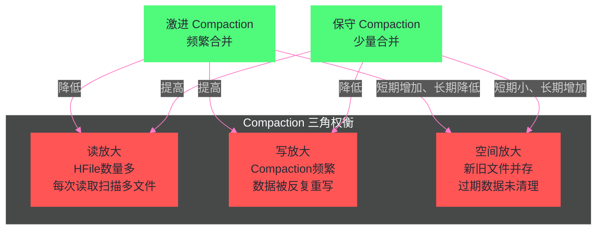

# HBase Compaction 机制深度解析——Minor、Major 与写放大的三角关系

**摘要：**

Compaction 是 HBase 中最复杂、对性能影响最深远的后台机制。它是 LSM-Tree 架构的"代谢系统"——通过合并磁盘上不断积累的 HFile，持续降低读放大（减少需要扫描的文件数量）；但合并本身消耗的 CPU、内存与磁盘 I/O，又构成了写放大的主体。本文围绕 Compaction 的三个核心问题展开：**为什么做（读/写/空间放大的三角困境）**、**怎么做（Minor/Major Compaction 的执行机制与文件选择策略）**、**如何做好（生产中的 Compaction 调优与避坑）**。深度解析 `ExploringCompactionPolicy`、`FIFOCompactionPolicy`、`StripeCompactionPolicy` 三种策略的适用场景，以及 Compaction 对业务延迟的影响与控速机制。

---

## 第 1 章 为什么需要 Compaction：LSM-Tree 的代谢困境

### 1.1 没有 Compaction 会发生什么

回顾 HBase 的写入链路：每次 MemStore Flush 都会在 HDFS 上生成一个新的 HFile。对一个写入活跃的表，Flush 可能每隔几分钟就触发一次。如果没有任何合并机制，时间一长会发生什么？

**读取性能急剧恶化**：一个 Store（列族）下积累了数百个 HFile，每次 Get 查询都需要对数百个文件执行 Bloom Filter 查询，即使过滤掉 99%，仍有数个 HFile 需要通过索引定位和磁盘读取。随机点查延迟从毫秒级退化到百毫秒甚至秒级。

**版本管理失控**：对于频繁更新的数据，同一个 RowKey 的多个历史版本散落在不同 HFile 中。读取时需要合并所有版本，然后才能应用版本裁剪。KeyValueHeap 的归并代价随 HFile 数量线性增长。

**"墓碑"数据永不清理**：Delete 操作写入的墓碑 KeyValue 与被删除的数据同时存在于磁盘。如果没有合并来进行物理清除，删除的数据永远占用磁盘空间，存储空间不断膨胀。

**TTL 过期数据不回收**：列族配置了 TTL（数据存活时间）的场景，过期数据同样不会被物理删除，只是读取时被过滤，磁盘空间无法回收。

这四个问题共同构成了 LSM-Tree 在没有 Compaction 的情况下不可避免的"熵增"——系统状态越来越混乱，性能越来越差。

**Compaction 是 LSM-Tree 抵抗熵增的机制**，通过周期性地将多个小 HFile 合并成更大的 HFile，同时清理过期数据、旧版本、墓碑标记，维持系统在一个性能可接受的稳态。

### 1.2 Compaction 的核心工作

一次 Compaction 操作的核心工作是：

1. **选择一组 HFile** 作为输入（根据选择策略决定合并哪些文件）
2. **多路归并**：使用 KeyValueHeap 以 K 路归并的方式读取所有输入 HFile 的 KeyValue，产生有序的 KeyValue 流
3. **清理过期数据**：在归并过程中，跳过以下类型的 KeyValue：
   - 版本号超过列族配置上限的旧版本（`maxVersions` 之外的版本）
   - 时间戳超过 TTL 的过期数据
   - 被墓碑标记覆盖的数据（Delete/DeleteColumn 对应的 Put）
   - 墓碑标记本身（在 Major Compaction 中，确认没有更旧的 HFile 后才能清除）
4. **写入新的 HFile**：将清理后的 KeyValue 流顺序写入一个（或多个）新的 HFile
5. **原子替换**：新 HFile 写入完成后，原子地用新 HFile 替换参与合并的旧 HFile，更新 Store 的 HFile 列表

整个过程的 I/O 模式是：**顺序读（读取多个输入 HFile）+ 顺序写（写入一个输出 HFile）**，没有随机 I/O——这是 Compaction 能够在不阻塞读写请求（太多）的情况下在后台执行的基础。

### 1.3 三角困境：读放大、写放大、空间放大

第 04 篇已经抽象地介绍了 LSM-Tree 的三种放大问题，这里结合 Compaction 来具体化这三角关系：

**读放大（Read Amplification）**：
- 来源：HFile 数量多，每次读取需要检查多个文件
- Compaction 的作用：减少 HFile 数量，直接降低读放大
- 激进 Compaction → 读放大低，但写放大高

**写放大（Write Amplification）**：
- 来源：Compaction 本身——同一份数据被反复读出、写入。一条数据从 MemStore Flush 到 L0，参与 Minor Compaction 合并到更大的文件，再参与 Major Compaction 被重写，每次 Compaction 都带来一次写入放大
- 激进 Compaction → 写放大高，磁盘 I/O 增加，SSD 损耗加速
- 保守 Compaction → 写放大低，但读放大高

**空间放大（Space Amplification）**：
- 来源：Compaction 执行期间，新旧 HFile 同时存在（新文件写入完成前旧文件不能删除），临时空间需求约为参与合并文件总大小的 1 倍
- Compaction 的作用：完成后清理旧版本、过期数据、墓碑，长期来看降低空间放大
- 但 Compaction 执行期间，空间放大临时增加

三者之间的关系是**零和博弈**：降低任何一种放大，都意味着另一种或两种放大的增加。Compaction 策略的本质是**在三者之间寻找最适合当前业务场景的平衡点**。



---

## 第 2 章 Minor Compaction：日常的小规模整理

### 2.1 Minor Compaction 是什么

**Minor Compaction** 是将一个 Store 下的少数几个 HFile 合并成一个更大 HFile 的操作。它是 HBase 中最频繁执行的 Compaction 类型，可以理解为"日常清洁"——不做彻底大扫除，只是把最近堆积的小文件整合一下，防止文件数量失控。

Minor Compaction 的特征：
- **参与文件少**：通常合并 2~10 个 HFile，不涉及全部文件
- **不做彻底清理**：墓碑标记（如果不是最老的 HFile 中）可能不会被清除，TTL 过期数据也可能不被清除（取决于是否有更旧的版本）
- **执行频繁**：每当 HFile 数量超过阈值（`hbase.hstore.compaction.min`，默认 3）就会触发
- **I/O 相对可控**：参与文件少，每次 Compaction 的 I/O 量有限

**为什么 Minor Compaction 不做彻底清理？**

这是一个关键的设计细节。考虑墓碑清理：一个 `Delete` 墓碑标记必须被放置在比被删除的 Put 更"新"（在所有 HFile 层级中可见）的位置。如果 Minor Compaction 将包含墓碑的新 HFile 与部分旧 HFile 合并，但还有更老的 HFile 没有参与合并，那么这些老 HFile 中可能还有被删除的 Put 数据。

如果 Minor Compaction 在合并时清除了墓碑，而老 HFile 中的 Put 数据依然存在，读取时就会读到"已删除"的数据——这破坏了删除的语义。

因此，**只有在确认没有更老的 HFile 可能包含被删除数据时，才能安全地清除墓碑**。Major Compaction（合并所有文件）能满足这个条件；Minor Compaction 则不能，所以墓碑保留。

### 2.2 Minor Compaction 的触发条件

Minor Compaction 的触发有两个路径：

**被动触发（Flush 触发）**：每次 MemStore Flush 完成后，RegionServer 检查该 Store 的 HFile 数量。如果超过 `hbase.hstore.compaction.min`（默认 3），向 Compaction 线程池提交一个 Minor Compaction 请求。

**主动触发（定期检查）**：RegionServer 有一个周期性的 Compaction Checker 线程（默认每隔 `threadWakeFrequency` = 10 秒扫描一次），检查所有 Store 是否需要 Compaction。

**写入阻塞触发（紧急情况）**：当一个 Store 的 HFile 数量超过 `hbase.hstore.blockingStoreFiles`（默认 16），HBase 会阻塞该 Region 的所有写入，直到 Compaction 完成将 HFile 数量降到阈值以下。这是防止 HFile 数量失控的最后防线，但代价是写入延迟暴增。

> [!warning] 生产避坑
> `hbase.hstore.blockingStoreFiles` 默认值 16 在高写入负载下容易触发写入阻塞。生产建议调整为 100，同时确保 Compaction 线程池足够大（`hbase.regionserver.thread.compaction.large` 和 `hbase.regionserver.thread.compaction.small`），避免 Compaction 处理不过来导致阻塞。

### 2.3 Minor Compaction 的文件选择策略：ExploringCompactionPolicy

Minor Compaction 的核心问题是：当一个 Store 有 N 个 HFile，应该选择哪几个来合并？选择不同的文件组合，Compaction 的效果和 I/O 代价差异显著。

**最朴素的想法**：每次选最小的几个文件合并。这能控制单次 Compaction 的 I/O 量，但可能导致大文件和小文件长期共存，小文件反复被合并，大文件一直不参与合并，形成"富者越富、穷者越穷"的马太效应。

**HBase 的选择思路：基于文件大小比例的选择**

HBase 的文件选择策略基于一个核心约束：**在一个候选合并序列中，较小的文件不应该比较大的文件大太多倍**（因为合并大小差距悬殊的文件效率很低）。

具体规则（`ExploringCompactionPolicy`，HBase 0.96+ 默认策略）：

对于一个候选序列（按文件大小升序排列），从最小的文件开始，若满足以下条件则加入合并集合：

```
当前文件大小 × hbase.hstore.compaction.ratio (默认 1.2)
  >= 候选序列中所有更大文件的大小之和
```

直到不满足条件为止。同时还有上下限约束：
- 合并文件数量 ≥ `hbase.hstore.compaction.min`（默认 3）
- 合并文件数量 ≤ `hbase.hstore.compaction.max`（默认 10）
- 单个参与合并的文件大小 ≤ `hbase.hstore.compaction.max.size`（默认 Long.MAX_VALUE）

**ExploringCompactionPolicy vs RatioBasedCompactionPolicy 的区别**：

旧版本（0.96 之前）的 `RatioBasedCompactionPolicy` 是贪心算法：从头到尾遍历文件列表，遇到第一个满足 Ratio 条件的序列就停止，提交这个序列进行 Compaction。

`ExploringCompactionPolicy` 是改进版：**遍历所有可能满足条件的序列**，从中选出"总文件大小最小（I/O 代价最小）且文件数量最多（合并效果最好）"的序列。

**举例说明差异**：

假设 Store 有以下 HFile（按时间顺序，大小单位 MB）：
```
HFile_1: 100MB（最老）
HFile_2: 10MB
HFile_3: 8MB
HFile_4: 5MB
HFile_5: 4MB（最新，刚 Flush）
```

`RatioBasedCompactionPolicy`：从最老的文件开始检查，发现 HFile_5(4MB) 满足：`4 × 1.2 = 4.8 < 5+8+10+100`，继续检查 HFile_4(5MB)：`(4+5) × 1.2 = 10.8 > 8+10+100` 不满足……最终只选 [HFile_5]，不够最小合并数（3），不发生合并；或者选择了一个次优序列。

`ExploringCompactionPolicy`：穷举所有满足条件的序列，找到 [HFile_2, HFile_3, HFile_4, HFile_5]（大小最均匀、总 I/O 最小），选这个序列合并。

---

## 第 3 章 Major Compaction：周期性的彻底清理

### 3.1 Major Compaction 是什么

**Major Compaction** 是将一个 Store 下的**所有** HFile 合并成**一个**大 HFile 的操作。它是 LSM-Tree 的"彻底大扫除"——在 Major Compaction 之后，一个 Store 只有唯一一个 HFile，读放大降为理论最低值（对该 Store 只需访问 1 个文件）。

Major Compaction 独有的清理能力（Minor Compaction 做不到的）：
- **彻底清除墓碑**：因为所有 HFile 都参与了合并，没有更老的文件存在，墓碑可以安全删除（被删除的数据在本次合并中不会出现在输出文件里）
- **彻底清除过期版本**：超过 `maxVersions` 的版本被丢弃
- **彻底回收 TTL 过期数据**：TTL 过期的 KeyValue 被过滤，磁盘空间真正释放
- **彻底清除过期的 Delete Family**：`DeleteFamily` 类型墓碑（删除整个列族某时间点之前的所有数据）在 Major Compaction 后真正生效

### 3.2 Major Compaction 的触发机制

**自动触发（定期，默认 7 天）**：

```xml
<!-- hbase-site.xml -->
<property>
  <name>hbase.hregion.majorcompaction</name>
  <value>604800000</value>  <!-- 7天，单位毫秒 -->
</property>
```

这个时间间隔有一定的随机抖动（`hbase.hregion.majorcompaction.jitter`，默认 0.5），即实际触发时间在 `[7天 * 0.5, 7天 * 1.5]` 之间随机，防止集群中所有 Region 同时触发 Major Compaction（雷同效应）造成 I/O 风暴。

**手动触发**：管理员可以通过 HBase Shell 手动触发：
```shell
# 对指定表执行 Major Compaction
hbase> major_compact 'tablename'

# 对指定 Region 执行 Major Compaction
hbase> major_compact 'region_name'

# 对指定表的指定列族执行 Major Compaction
hbase> major_compact 'tablename', 'column_family'
```

### 3.3 Major Compaction 的代价与生产实践

Major Compaction 是代价最高的操作之一，它的代价来自几个方面：

**I/O 代价巨大**：假设一个 Store 有 50GB 的数据分布在若干 HFile 中，Major Compaction 需要：
- 读取所有 50GB 数据
- 写入一个新的大 HFile（约 50GB - 过期数据大小）
- 写入期间同时存在旧文件和新文件，临时磁盘使用量翻倍（约 100GB）

这对 HDFS 的磁盘和网络带宽是极大的压力。

**写放大严重**：在 HDFS 3 副本的场景下，写入 50GB 实际上产生了 150GB 的网络 I/O（数据需要在 RegionServer 和 DataNode 之间传输，3 个副本 = 3 倍网络流量）。

**对在线业务的影响**：Major Compaction 期间，RegionServer 的磁盘 I/O 和 CPU 被大量占用，读取请求的 BlockCache 命中率可能因为 Compaction 向 BlockCache 写入大量新 Block 而下降（缓存污染），写入延迟也可能增加（磁盘竞争）。

> [!warning] 生产最佳实践
> **生产环境中，强烈建议关闭自动 Major Compaction，改为在业务低峰期手动触发。**
> 
> ```xml
> <!-- 关闭自动 Major Compaction -->
> <property>
>   <name>hbase.hregion.majorcompaction</name>
>   <value>0</value>
> </property>
> ```
> 
> 然后通过定时任务（Cron Job）在业务低峰期（如凌晨 2~4 点）对关键表执行 Major Compaction：
> ```shell
> # 脚本示例
> hbase shell <<EOF
> major_compact 'important_table'
> EOF
> ```
> 
> 同时配合 Compaction 限速（见第 4 章），防止 Major Compaction 影响在线服务。

---

## 第 4 章 Compaction 的执行机制

### 4.1 Compaction 线程池

RegionServer 有专用的 Compaction 线程池，分为两个：

- **Large Compaction 线程池**（`hbase.regionserver.thread.compaction.large`，默认 1 个线程）：执行超过 `hbase.regionserver.thread.compaction.throttle`（默认 2 * flushSize * minFilesToCompact = 约 256MB）大小的 Compaction
- **Small Compaction 线程池**（`hbase.regionserver.thread.compaction.small`，默认 1 个线程）：执行小于阈值的 Compaction

这种分离的设计防止了大 Compaction（如 Major Compaction）独占线程，让小 Compaction（快速整理少数小文件）能够及时执行，不被阻塞。

**为什么默认只有 1 个 Large Compaction 线程？**

因为 Large Compaction 已经是 I/O 密集型操作，多个并发的 Large Compaction 会激烈竞争 HDFS 带宽，导致每个 Compaction 都慢，还会影响正常读写。1 个线程确保 Large Compaction 是串行的，不相互干扰。

但在有大量 Region 的繁忙集群（每个 RegionServer 管理 200+ Region）上，1 个线程可能跟不上 Flush 速度，导致 HFile 数量持续增加。此时适当增加线程数（到 2~3 个）是合理的，但需要同时增加 Compaction 限速（见下节）以防止 I/O 过载。

### 4.2 Compaction 限速机制

为了降低 Compaction 对在线读写的影响，HBase 提供了 Compaction 限速：

```xml
<!-- 限制 Compaction 的吞吐量，单位：bytes/second -->
<property>
  <name>hbase.regionserver.throughput.controller</name>
  <value>org.apache.hadoop.hbase.regionserver.throughput.PressureAwareCompactionThroughputController</value>
</property>

<!-- 低压力时（HFile数量正常）的最大 Compaction 速度 -->
<property>
  <name>hbase.hstore.compaction.throughput.lower.bound</name>
  <value>52428800</value>  <!-- 50MB/s -->
</property>

<!-- 高压力时（HFile数量接近阻塞阈值）的最大 Compaction 速度 -->
<property>
  <name>hbase.hstore.compaction.throughput.higher.bound</name>
  <value>104857600</value>  <!-- 100MB/s -->
</property>
```

**`PressureAwareCompactionThroughputController`** 是动态限速控制器：
- 当 HFile 数量在正常范围内，Compaction 速度限制在 `lower.bound`（较低速度，减少对在线业务的影响）
- 当 HFile 数量接近 `blockingStoreFiles`（写入阻塞阈值），Compaction 速度提升到 `higher.bound`（较高速度，紧急清理，防止写入阻塞）

这种自适应限速在正常情况下对在线业务干扰小，在紧急情况下能快速响应，是生产环境的推荐配置。

### 4.3 Compaction 的完整执行流程

一次 Compaction 从触发到完成的完整流程：

```mermaid
%%{init: {'theme': 'dark', 'themeVariables': {'primaryColor': '#6272a4', 'primaryTextColor': '#f8f8f2', 'primaryBorderColor': '#bd93f9', 'lineColor': '#ff79c6', 'secondaryColor': '#44475a', 'tertiaryColor': '#282a36'}}}%%
graph TD
    A["触发 Compaction</br>（Flush后/定时检查/手动）"] --> B["请求加入 Compaction 队列"]
    B --> C["Compaction 线程取出请求"]
    C --> D["文件选择（CompactionPolicy）"]
    D --> E{"是否选出足够文件？"}
    E -->|"否"| F["跳过，等待下次触发"]
    E -->|"是"| G["创建新 HFile Writer"]
    G --> H["多路归并读取选中的 HFile"]
    H --> I["过滤墓碑/TTL/旧版本"]
    I --> J["顺序写入新 HFile"]
    J --> K["新 HFile close 并提交到 HDFS"]
    K --> L["原子替换：新文件上线，旧文件下线"]
    L --> M["更新 Store 的 HFile 列表"]
    M --> N["删除旧 HFile（标记待清理）"]
    N --> O["更新 BlockCache（无效化旧 Block）"]
    O --> P["Compaction 完成"]

    classDef trigger fill:#ff79c6,stroke:#ff79c6,color:#282a36
    classDef process fill:#6272a4,stroke:#bd93f9,color:#f8f8f2
    classDef decision fill:#f1fa8c,stroke:#f1fa8c,color:#282a36
    classDef end fill:#50fa7b,stroke:#50fa7b,color:#282a36

    class A trigger
    class B,C,D,G,H,I,J,K,L,M,N,O process
    class E decision
    class P end
    class F end
```

**步骤 L（原子替换）**是整个流程的关键：在新 HFile 写入完成之前，旧 HFile 仍然可以服务读请求；新 HFile 写入完成后，原子地更新 Store 的文件列表——HBase 通过 ZooKeeper 或 RegionServer 内部锁保证这个切换的原子性，在切换过程中读取请求看到的是完整的文件列表（要么全是旧文件，要么全是新文件 + 旧文件中未被覆盖的部分）。

---

## 第 5 章 Compaction 策略详解

### 5.1 ExploringCompactionPolicy（默认策略）

如前文所述，`ExploringCompactionPolicy` 是 HBase 0.96+ 的默认 Minor Compaction 策略。

**核心参数：**

```xml
<!-- 最少参与合并的 HFile 数量，低于此数量不触发 Compaction -->
<property>
  <name>hbase.hstore.compaction.min</name>
  <value>3</value>
</property>

<!-- 最多参与合并的 HFile 数量，单次合并的 I/O 上限 -->
<property>
  <name>hbase.hstore.compaction.max</name>
  <value>10</value>
</property>

<!-- 文件大小比例因子，越大选择越激进（更多文件参与合并） -->
<property>
  <name>hbase.hstore.compaction.ratio</name>
  <value>1.2</value>
</property>

<!-- 小文件无论大小都参与合并（防止小文件永远不被合并） -->
<property>
  <name>hbase.hstore.compaction.min.size</name>
  <value>134217728</value>  <!-- 128MB -->
</property>

<!-- 大文件排除在 Minor Compaction 之外（留给 Major Compaction） -->
<property>
  <name>hbase.hstore.compaction.max.size</name>
  <value>9223372036854775807</value>  <!-- Long.MAX_VALUE，即不限制 -->
</property>
```

**`compaction.min.size` 参数的工程含义：**

配置为 128MB 意味着：所有小于 128MB 的 HFile，无论其大小是否满足 Ratio 条件，都会被选入合并候选集合。这解决了这样一个问题：假设有一个 128MB 的文件和一个 1KB 的文件，按 Ratio 规则，1KB 的文件不可能满足 `1KB × 1.2 >= 128MB`，永远不会被合并——但它会让 HFile 数量增加，影响读取性能。`min.size` 确保所有小文件都被及时合并。

### 5.2 FIFOCompactionPolicy：TTL 场景的专用策略

**`FIFOCompactionPolicy`** 是一种极度简化的策略：它不做真正的合并（不重写 HFile），只是**扫描所有 HFile，删除其中所有数据都已过期（超过列族 TTL）的文件**。

**适用场景：**
- 数据有明确的、较短的 TTL（如时序数据保留 7 天、会话缓存保留 1 小时）
- 数据按时间顺序写入，老 HFile 中的数据整体比新 HFile 中的数据更早过期
- 读取模式是点查或短时间范围查询，不需要对历史数据做全表扫描

**FIFO 策略的工程价值：**

对于 TTL 数据，传统 Compaction（读旧文件 + 写新文件）会产生大量 I/O——即使最终只是为了删掉过期数据。`FIFOCompactionPolicy` 完全跳过合并，直接删除整个过期 HFile（HDFS 文件删除是 O(1) 操作），**将写放大降低到接近零**。

代价是：它不合并文件，因此 HFile 数量持续增长（每次 Flush 产生一个新文件，FIFO 策略只删除过期文件，不合并现有文件）。但只要 TTL 足够短、数据流速恒定，删除速度可以与产生速度持平。

**配置示例（适合日志类短 TTL 表）：**

```java
// Java API 设置列族策略
TableDescriptorBuilder tableBuilder = TableDescriptorBuilder.newBuilder(tableName);
ColumnFamilyDescriptor cf = ColumnFamilyDescriptorBuilder
    .newBuilder(Bytes.toBytes("log"))
    .setTimeToLive(86400)  // TTL = 1 天
    .setCompactionCompressionType(Compression.Algorithm.SNAPPY)
    .build();

// 使用 FIFO Compaction 策略
tableBuilder.setCompactionPolicy(FIFOCompactionPolicy.class.getName());
```

### 5.3 StripeCompactionPolicy：为大 Region 优化

**`StripeCompactionPolicy`** 是为解决 Major Compaction 对大 Region 的 I/O 冲击问题而设计的。

**背景问题：**

传统 Major Compaction 对大 Region（如 50GB）的操作是"一次性合并所有文件"，I/O 极大，期间对业务影响显著。能不能将大 Region 的 Compaction 切成更小的单元，每次只合并一部分数据？

**Stripe 的思路：**

`StripeCompactionPolicy` 将一个 Store 的 RowKey 空间按字典序切分为若干"条带（Stripe）"，每个 Stripe 包含一段 RowKey 范围的数据。每次 Compaction 只合并同一个 Stripe 内的 HFile，I/O 量大幅降低。

类似于将一个 50GB 的 Region 内部切成 10 个 5GB 的"逻辑子 Region"，每次只对其中一个做 Compaction——等效于 Major Compaction 被切成 10 次小操作，分散了 I/O 冲击。

**适用场景：**
- Region 大小 > 2GB 且不能频繁分裂的场景
- RowKey 分布比较均匀（能合理地按字典序分 Stripe）
- 希望彻底避免大 I/O 的 Major Compaction 事件

**局限性：**
- RowKey 分布极度不均匀时，Stripe 大小差异大，效果差
- 配置复杂，需要对 RowKey 分布有充分了解
- 目前生产使用较少，成熟度不如默认策略

### 5.4 四种策略的横向对比

| 策略 | 合并方式 | 写放大 | 读放大 | 适用场景 |
|------|---------|--------|--------|---------|
| **ExploringCompaction** | 选小文件合并 | 中 | 中 | 通用，适合大多数场景 |
| **RatioBased**（旧版本）| 贪心选文件合并 | 中 | 中偏高 | 已基本弃用 |
| **FIFO** | 不合并，只删过期文件 | 极低 | 高（随文件增多） | 短 TTL 的时序/日志数据 |
| **Stripe** | 按 RowKey 段合并 | 中低 | 低 | 大 Region，写入规律，RowKey 均匀 |

---

## 第 6 章 Compaction 对读写延迟的影响与监控

### 6.1 Compaction 对写入延迟的影响

Compaction 与写入路径的竞争点主要是**磁盘 I/O 带宽**。当 Compaction 在高速写入磁盘时，RegionServer 的 Flush 操作（将 MemStore 写入 HFile）需要同样的 HDFS I/O 带宽。两者竞争导致 Flush 变慢，MemStore 内存压力上升，最终可能触发写入阻塞。

**量化感知方法：**

通过监控以下指标来判断 Compaction 是否影响了写入：
- `regionserver.flushQueueSize`：Flush 队列积压数量，如果持续增大，说明 Flush 跟不上写入速度
- `regionserver.compactionQueueSize`：Compaction 队列积压，积压过大说明 Compaction 跟不上 Flush 速度
- `regionserver.storeFileCount`：Store 下 HFile 数量，持续增长说明 Compaction 速度不够

### 6.2 Compaction 对读取延迟的影响

Compaction 对读取的影响有正反两面：

**正面影响（长期）**：减少 HFile 数量，降低读取时需要扫描的文件数，BlockCache 中的有效数据比例提高，读取延迟长期下降。

**负面影响（短期）**：
- **BlockCache 抖动**：Compaction 生成的新 HFile 的 INDEX Block 和 BLOOM Block 会被加载到 BlockCache，可能驱逐原来缓存的热点 DATA Block，导致短期内 BlockCache 命中率下降
- **磁盘 I/O 竞争**：Compaction 读取旧 HFile 的同时，读取操作也在读 HFile，两者竞争 HDFS 读取带宽
- **RegionScanner 迭代中断**：一个正在执行的 Scan 如果跨越了 Compaction 的发生时刻（新文件替换旧文件），RegionServer 需要处理"文件已被替换"的情况，可能导致 Scan 短暂重试

### 6.3 关键监控指标与健康基线

| 指标 | 健康范围 | 超出时的意义 |
|------|---------|------------|
| `storeFileCount`（每 Store）| < 5 | 5~10 需关注，> 10 需立即触发 Compaction |
| `compactionQueueSize` | < 5 | 持续增长说明 Compaction 线程不足 |
| `majorCompactionTime` | < 1 小时/次 | 超过 2 小时说明 Region 过大，需要分裂 |
| `blockCacheHitPercent` | > 90% | Compaction 期间短暂下降是正常的 |
| `writtenBytes`（Compaction）| 随负载变化 | 异常升高说明 Compaction 进入死循环 |

---

## 第 7 章 Compaction 与 Region 大小的关系

### 7.1 Region 大小决定了 Major Compaction 的代价

一个 Region 的 HFile 总大小直接决定了 Major Compaction 的 I/O 代价。这是 HBase 控制 Region 大小的重要动机之一：

- **Region 越大**：Major Compaction 的 I/O 量越大，持续时间越长，对业务影响越大
- **Region 越小**：Major Compaction 代价小，但 Region 数量多，管理开销大，HMaster 负担重

HBase 默认的 Region 分裂阈值（`hbase.hregion.max.filesize`，默认 10GB）正是在这两者之间的折中选择。生产中，根据集群规模和业务场景，Region 大小通常在 5~20GB 之间调整。

### 7.2 预分区减少 Compaction 压力

在第 03 篇中提到了预分区（Pre-splitting）。预分区不仅避免了热点 Region，还能从一开始就将数据均匀分布到多个 Region，使得每个 Region 的数据量更小、Compaction 更轻量。

对于已知数据量和 RowKey 分布的表，在建表时通过预分区设置合理的初始 Region 数量和 Startkey，是减少后期 Compaction 压力的主动手段。

---

## 第 8 章 总结：Compaction 是 LSM-Tree 的调控阀

Compaction 在 HBase 的整体架构中扮演着"调控阀"的角色：

- **写入积极，Compaction 保守**：写入吞吐量极高，文件数量快速增长，读取性能受损。适合批量写入、对读取性能要求不高的离线场景。

- **写入积极，Compaction 积极**：写入吞吐量高，同时文件数量受控，读取性能良好。但 Compaction 消耗大量 I/O，需要足够的磁盘带宽和线程资源。适合在线 OLTP 场景，需要充足的硬件资源支撑。

- **写入保守，Compaction 适中**：通过批量写入（BulkLoad）等手段减少 Flush 频率，配合适度 Compaction，实现低写放大。适合数据仓库类场景，周期性批量写入，实时查询为主。

理解了 Compaction 的三角困境，才能在 HBase 调优时做出正确的参数选择——这将在第 10 篇（生产调优实战）中得到全面应用。

接下来的第 08 篇将讨论 **Region 分裂与负载均衡**：Region 的大小与 Compaction 代价密切相关，而 Region 分裂的时机和策略，直接影响了 Compaction 的长期效果。

---

> [!note] 思考题
> 1. Major Compaction 将一个 Region 的所有 HFile 合并成一个，同时清理过期数据、墓碑记录和超出版本数的数据。这个操作的 I/O 代价极高（读出所有数据再写回），在生产环境中通常禁止自动 Major Compaction（`hbase.hregion.majorcompaction=0`），改为在业务低峰期手动触发。如果长期不执行 Major Compaction，会有什么系统性问题逐渐积累？
> 2. Compaction 策略（`CompactionPolicy`）决定了哪些 HFile 被选中参与 Minor Compaction。默认的 `ExploringCompactionPolicy` 倾向于选择大小相近的 HFile 进行合并。这个策略的背后逻辑是什么？如果大量小 HFile 和少量超大 HFile 并存，这个策略会不会让小 HFile 长期无法被 Compact（因为找不到大小相近的文件）？
> 3. Compaction 会读取大量 HFile 数据，占用 RegionServer 的磁盘 I/O 和 CPU 资源，与正常读写请求竞争资源，导致读写延迟波动（Compaction 抖动）。HBase 提供了 Compaction 限速（`hbase.regionserver.throughput.controller`）来控制 Compaction 的资源占用。在设计 HBase 集群的容量规划时，应该为 Compaction 预留多少额外的 I/O 带宽？

## 参考资料

- [1] 深入理解 HBase Compaction 机制: https://cloud.tencent.com/developer/article/1488439
- [2] HBase Compaction 参数调优: https://cloud.tencent.com/developer/article/1635417
- [3] HBase Compaction 策略解析: https://lihuimintu.github.io/2019/06/06/HBase-Compaction/
- [4] ExploringCompactionPolicy API: https://hbase.apache.org/2.3/devapidocs/org/apache/hadoop/hbase/regionserver/compactions/ExploringCompactionPolicy.html
- [5] Apache HBase Reference Guide — Compaction: https://hbase.apache.org/book.html#compaction
- [6] Stripe Compaction Design Doc: https://issues.apache.org/jira/browse/HBASE-7667
