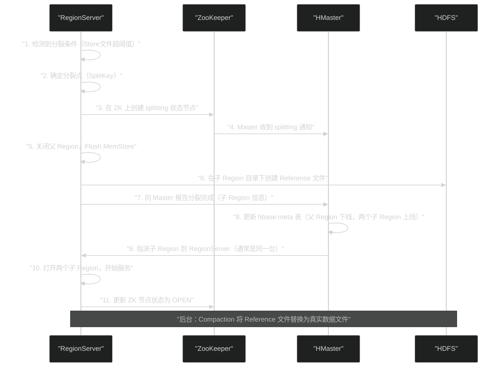

# HBase Region 分裂与负载均衡——水平扩展的工程底层

**摘要：**

HBase 声称支持"无限水平扩展"——通过增加 RegionServer 节点，读写能力线性增长。这一能力的工程基础是两个相互协作的机制：**Region 分裂（Split）** 和 **负载均衡（Load Balance）**。Region 分裂解决了"单个 Region 数据量超限"的问题，将过大的 Region 切成两半，让每个 Region 始终保持合理的大小；负载均衡解决了"Region 分布不均"的问题，将 Region 在 RegionServer 之间重新分配，确保每台服务器承担均衡的负载。本文深度解析 Region 分裂的完整执行过程（包括 HDFS 文件的"引用"技巧如何实现近乎零代价的分裂）、三代分裂策略的演进逻辑，以及 `StochasticLoadBalancer` 的多维度代价函数；同时揭示分裂和负载均衡过程中的陷阱——热点（Hotspot）、分裂风暴（Split Storm）与负载均衡引发的数据局部性损失。

---

## 第 1 章 Region 分裂的必要性与核心问题

### 1.1 为什么 Region 需要分裂

在第 03 篇文章中，我们建立了 HBase 的水平扩展模型：数据按 RowKey 排序，划分为若干连续的 Region，每个 Region 由一个 RegionServer 服务。初始建表时可能只有一个 Region（包含所有数据），随着数据持续写入，这个 Region 会越来越大。

**一个 Region 无限增大会带来什么问题？**

**问题一：Compaction 代价无上限**。第 07 篇中讨论过，Major Compaction 需要读写整个 Region 的数据。如果一个 Region 膨胀到 500GB，单次 Major Compaction 将产生 500GB × 2（读 + 写）× 3（HDFS 副本）= 3TB 的 I/O 量，持续数小时，严重干扰在线业务。

**问题二：单点负载无法分散**。HBase 的水平扩展依赖于多个 RegionServer 并行服务，但如果一个 Region 非常大，它只能由一台 RegionServer 服务（一个 Region 不能跨多台 RegionServer）。无论集群有多少台机器，这个大 Region 的请求都压在同一台机器上，形成单点瓶颈。

**问题三：RegionServer 恢复时间长**。RegionServer 故障后，它管理的所有 Region 需要在其他 RegionServer 上恢复。如果有一个超大 Region，其恢复过程（WAL 重放 + Flush）耗时极长，期间该 Region 的数据不可访问，影响可用性。

Region 分裂通过将大 Region 切成两半，将单个 Region 的大小控制在合理范围内（默认 10GB），从根本上解决了以上三个问题。

### 1.2 Region 分裂的核心挑战：如何做到近乎无感知

Region 分裂面临一个严峻的工程挑战：**分裂期间服务不能中断**。

最朴素的分裂实现是：暂停对该 Region 的所有读写请求，将数据物理地分成两半，各自写入两个新文件，然后恢复服务。但这个方法有两个严重问题：

1. 物理复制数据耗时极长（一个 10GB 的 Region 需要复制 10GB 数据到 HDFS，耗时数分钟）
2. 期间 Region 的读写完全不可用，对业务有直接影响

HBase 的解决方案非常精妙：**分裂时不复制任何数据，只创建"引用文件"（Reference Files）**。这使得分裂操作几乎是瞬间完成的（秒级），对在线业务几乎无感知。

---

## 第 2 章 Region 分裂的完整执行过程

### 2.1 四个阶段：从触发到完成

Region 分裂的完整过程分为四个阶段，涉及 RegionServer、HMaster 和 ZooKeeper 的协作：



### 2.2 Reference 文件：零代价分裂的核心机制

分裂的精华在步骤 6：**创建 Reference 文件**，而不是复制数据。

**Reference 文件是什么？**

当父 Region 被分裂为子 Region A（RowKey 范围 [min, splitKey)）和子 Region B（RowKey 范围 [splitKey, max)）时，父 Region 的每个 HFile 在两个子 Region 的目录下各创建一个 Reference 文件：

```
HDFS 目录结构（分裂前）：
/hbase/data/default/tableName/
  <parent_region_name>/
    cf/
      <hfile_1>   ← 包含全部数据
      <hfile_2>

HDFS 目录结构（分裂后，立即）：
/hbase/data/default/tableName/
  <parent_region_name>/          ← 父 Region 目录保留（数据仍在）
    cf/
      <hfile_1>
      <hfile_2>
  <child_region_A_name>/          ← 子 Region A 目录（新创建）
    cf/
      <hfile_1.reference_A>      ← Reference 文件（极小，只有元数据）
      <hfile_2.reference_A>
  <child_region_B_name>/          ← 子 Region B 目录（新创建）
    cf/
      <hfile_1.reference_B>
      <hfile_2.reference_B>
```

Reference 文件的内容极小（几十字节），它只包含两条信息：
1. **指向父 HFile 的路径**（指针）
2. **分裂点（splitKey）**和**分裂方向**（上半部分 TOP 还是下半部分 BOTTOM）

**Reference 文件如何支持读取？**

当子 Region 的 `StoreFileScanner` 遇到一个 Reference 文件时，它不是直接读文件，而是：
1. 解析 Reference 文件，获取父 HFile 路径和 splitKey
2. 打开父 HFile 的 `HalfStoreFileReader`（半文件读取器）
3. `HalfStoreFileReader` 只扫描父 HFile 中属于该子 Region RowKey 范围的数据（小于 splitKey 的部分 = Region A，大于等于 splitKey 的部分 = Region B）

整个读取过程对上层透明——`StoreScanner` 不知道自己在读 Reference 文件，逻辑上与读真实 HFile 完全相同。

**这就是分裂代价极低的秘密**：步骤 6 只是在 HDFS 上创建了几个小文件（Reference 文件），没有任何数据复制。父 Region 的数据仍在原位，子 Region 通过引用访问它。

### 2.3 后台 Compaction 完成真正的分裂

Reference 文件只是临时状态。子 Region 上线后，后台 Compaction 会将 Reference 文件"解引用"——将父 HFile 中属于该子 Region 的数据真正复制到子 Region 的独立 HFile 中，然后删除 Reference 文件。

```
后台 Compaction 完成后的目录结构：
/hbase/data/default/tableName/
  <parent_region_name>/          ← 父 Region 目录（此后可清理）
    cf/
      <hfile_1>                  ← 仍然保留，直到所有 Reference 都被替换
  <child_region_A_name>/
    cf/
      <hfile_A_real>             ← 真实的 HFile，只包含 Region A 的数据
  <child_region_B_name>/
    cf/
      <hfile_B_real>             ← 真实的 HFile，只包含 Region B 的数据
```

只有当父 Region 的**所有 HFile 都不再被任何 Reference 文件引用**时，父 Region 目录才会被清理（由 HMaster 的 HFileArchiver 负责）。

> [!note] 设计哲学
> Reference 文件机制体现了 HBase 的一个核心设计哲学：**将昂贵的操作分解为一个快速的"提交"阶段和一个慢速的"后台处理"阶段**。分裂的"提交"（创建 Reference 文件）是秒级的，对在线业务无感知；真正的数据迁移（Compaction 解引用）在后台慢慢完成，不影响服务可用性。

### 2.4 分裂点（SplitKey）的选择

分裂点直接决定了两个子 Region 的数据量是否均衡。HBase 通过 **HFile 中点（Midpoint）** 方法来选择分裂点：

1. 找到该 Region 中**最大 Store 文件（HFile）**
2. 读取该 HFile 的索引（Root Index Block），找到所有 Data Block 的起始 RowKey
3. 选择位于文件中间（按字节量而非行数）的 Data Block 起始 RowKey 作为分裂点

这种方法的优点是基于实际数据分布（字节量），而不是行数。RowKey 均匀分布时，按字节量中点也近似于行数中点；RowKey 分布不均匀时，按字节量更能保证两个子 Region 的数据量均衡。

**特殊情况**：如果 RowKey 空间极度不均匀（例如所有数据都有相同的 RowKey 前缀，只有最后几个字节不同），中点选择可能导致两个子 Region 大小严重不均，甚至出现"有边界无数据"的 Region。这是 RowKey 设计热点问题的延伸，第 02 篇中讨论的 RowKey 设计原则正是为了避免这类情况。

---

## 第 3 章 Region 分裂策略的演进

### 3.1 ConstantSizeRegionSplitPolicy：简单但有缺陷（0.94 版本之前默认）

**策略逻辑**：当一个 Region 中最大 Store 的 HFile 总大小超过 `hbase.hregion.max.filesize`（默认 10GB）时，触发分裂。

**缺陷一：小表大问题**

对于数据量较小的表（如只有 1GB 数据），系统可能只需要 1 个 Region。但按照此策略，只有当 Region 超过 10GB 才分裂，这意味着在 0~10GB 期间，整张表只有 1 个 Region，只能由 1 台 RegionServer 服务。即使集群有 100 台 RegionServer，这张小表的写入吞吐量也受单台机器限制。

**缺陷二：大表写入初期的热点**

建表时通常只有 1 个 Region，随着数据写入，第一个 Region 逐渐增大，前 10GB 的数据全部集中在这 1 个 Region 上，写入热点问题严重。

### 3.2 IncreasingToUpperBoundRegionSplitPolicy：动态阈值（0.94~2.0 版本默认）

**策略逻辑**：分裂阈值随当前 RegionServer 上同一张表的 Region 数量动态调整：

```
分裂阈值 = min(
    (Region数量)^3 × hbase.hregion.memstore.flush.size × 2,
    hbase.hregion.max.filesize
)
```

**举例说明（flush.size = 128MB，max.filesize = 10GB）**：

| 当前 Region 数 | 分裂阈值计算 | 实际阈值 |
|--------------|------------|---------|
| 1 个 Region | 1³ × 128MB × 2 = 256MB | **256MB** |
| 2 个 Region | 2³ × 128MB × 2 = 2048MB ≈ 2GB | **2GB** |
| 3 个 Region | 3³ × 128MB × 2 = 6.75GB | **6.75GB** |
| 4 个 Region | 4³ × 128MB × 2 = 16GB > 10GB | **10GB（上限）** |
| ≥4 个 Region | 超过上限 | **10GB** |

**核心思路**：表刚建立时（1 个 Region），阈值很低（256MB），数据很快就会触发分裂，使 Region 数量快速增加。随着 Region 数量增多，阈值不断提高，防止 Region 数量无限膨胀。

**效果**：解决了小表热点问题——新表能快速扩展到多个 Region，充分利用集群的多台 RegionServer。

**残留问题**：阈值增长太快（立方关系），从第 4 个 Region 开始就达到上限（10GB），之后退化为 `ConstantSizeRegionSplitPolicy`；且这个策略与"全局集群"的负载无关，只看当前 RegionServer 上的同表 Region 数量，在 Region 分布不均时判断不够准确。

### 3.3 SteppingSplitPolicy：简化的分步策略（HBase 2.0+ 默认）

**策略逻辑**：

```
如果当前 RegionServer 上同一张表只有 1 个 Region：
    分裂阈值 = 2 × hbase.hregion.memstore.flush.size = 256MB
否则：
    分裂阈值 = hbase.hregion.max.filesize = 10GB
```

相比 `IncreasingToUpperBoundRegionSplitPolicy` 的立方曲线，`SteppingSplitPolicy` 是一个简单的两步跳变：第 1 个 Region 使用极低阈值（256MB，快速触发首次分裂），此后所有 Region 都使用固定上限（10GB）。

**为什么 HBase 2.0 切换到这个策略？**

`IncreasingToUpperBoundRegionSplitPolicy` 的问题在于：在 Region 数量为 2~3 时，阈值（2GB、6.75GB）处于"不大不小"的中间状态。业务往往在这个阶段遭遇性能抖动——Region 数量不够多，写入热点还存在；但阈值又比 ConstantSize 小，分裂频率高，Compaction 和 Region 管理开销大。

`SteppingSplitPolicy` 的逻辑更清晰：**第一次分裂尽早触发，后续分裂按统一标准**，减少了中间状态的不确定性。

### 3.4 分裂策略的工程选择建议

| 场景 | 推荐策略 |
|------|---------|
| 通用场景（HBase 2.x） | `SteppingSplitPolicy`（默认，无需改动）|
| 需要精确控制 Region 大小 | `ConstantSizeRegionSplitPolicy`（稳定，可预测）|
| 已知数据分布，预分区充足 | `DisabledRegionSplitPolicy`（禁止自动分裂，手动管理）|
| 写入热点严重，数据分布非常均匀 | 预分区 + `DisabledRegionSplitPolicy` |

> [!warning] 生产避坑：分裂风暴（Split Storm）
> 如果不使用预分区，直接写入大量数据到一个 Region，该 Region 会快速触发分裂，产生两个 Region，这两个 Region 在很短时间内又会触发分裂……呈指数增长，短时间内产生大量 Region（分裂风暴）。
> 
> 大量 Region 意味着：
> - 每次 Flush 产生大量小 HFile
> - Compaction 压力极大
> - HMaster 需要管理大量 Region 的元数据
> - RegionServer 内存消耗急剧增加（每个 MemStore 占内存）
> 
> **解决方案：对已知数据量的表使用预分区（Pre-splitting）**，在建表时指定合理数量的 Region 和对应的 splitKey，避免分裂风暴。

---

## 第 4 章 负载均衡：Region 在集群中的重新分配

### 4.1 为什么分裂之后还需要负载均衡

Region 分裂后，两个子 Region 默认仍然由原来的 RegionServer 服务。这意味着：
- 分裂能控制每个 Region 的大小，但不能改变 Region 分布
- 如果某张热点表的所有 Region 都在同一台 RegionServer 上，即使有很多 Region，也只有一台机器承担所有压力

负载均衡的目标是：**在不影响数据访问的前提下，将 Region 在 RegionServer 之间重新分配，使每台服务器的负载尽量均衡**。

### 4.2 Region 迁移（Region Move）的执行过程

Region 迁移是负载均衡的基本操作单元。一次 Region 迁移包含以下步骤：

**第一步：HMaster 决定迁移计划**

HMaster 的 LoadBalancer 生成迁移计划（`RegionPlan`），指定源 RegionServer（Source）和目标 RegionServer（Destination）。

**第二步：关闭源 RegionServer 上的 Region**

HMaster 向源 RegionServer 发送"关闭 Region"指令。源 RegionServer：
1. 拒绝新的对该 Region 的读写请求
2. Flush 该 Region 的所有 MemStore（将内存数据写入 HFile）
3. 关闭 Region 的所有 HFile（释放文件句柄）
4. 在 ZooKeeper 上更新 Region 状态为 `CLOSED`
5. 向 HMaster 确认关闭完成

**第三步：HMaster 更新 meta 表**

HMaster 将 `hbase:meta` 表中该 Region 的 RegionServer 信息更新为目标 RegionServer 的地址。

**第四步：目标 RegionServer 打开 Region**

HMaster 向目标 RegionServer 发送"打开 Region"指令。目标 RegionServer：
1. 读取该 Region 对应的 HFile（这些文件在 HDFS 上，通过网络访问）
2. 在 ZooKeeper 上更新 Region 状态为 `OPEN`
3. 开始服务该 Region 的读写请求

**第五步：客户端感知到 Region 迁移**

客户端的 Region 位置缓存失效（meta 表已更新），下次请求时重新查询 meta，更新缓存，继续访问新的 RegionServer。

**迁移期间的不可用窗口**：从源关闭到目标打开的时间约为 **1~10 秒**，期间对该 Region 的请求会失败（客户端重试）。这是负载均衡不可避免的代价。

### 4.3 数据局部性的代价

Region 迁移后，HFile 数据仍然存储在 HDFS 的原有 DataNode 上（不会随 Region 移动而迁移文件），但 Region 现在由另一台 RegionServer 服务。

如果新的 RegionServer 与 HFile 所在的 DataNode 不在同一台机器，每次读取 HFile 都需要通过网络访问远程 DataNode，增加了读取延迟（通常额外增加 0.5~2ms 的网络延迟）。

**数据局部性（Data Locality）**会在 Region 迁移后短暂下降，随后随着 Compaction 的进行逐渐恢复——Compaction 在目标 RegionServer 上重写 HFile 时，新的 HFile 会优先写入本地 DataNode（HDFS 的"机架感知"写入策略），数据局部性因此恢复。

可以通过 `storefileLocalityIndex`（`regionserver.storefileLocalityIndex`）指标监控数据局部性，范围 0~1，1 表示 100% 本地（理想状态）。

### 4.4 StochasticLoadBalancer：多维度的负载均衡算法

**SimpleLoadBalancer**（HBase 0.94 默认）的思路很简单：让每台 RegionServer 上的 Region 数量尽量相等。但"Region 数量相等"≠ "负载均衡"——一个处理 10000 次/秒读请求的 Region，比 100 个每秒处理 1 次读请求的 Region 消耗多得多。

**StochasticLoadBalancer**（HBase 0.96+ 默认）是一种多维度的随机爬山（Stochastic Hill Climbing）算法，综合考虑 6 个维度的代价函数：

| 代价函数 | 衡量指标 | 权重（默认）|
|---------|---------|-----------|
| **RegionCountSkewCostFunction** | 各 RS 上 Region 数量的方差 | 500 |
| **ReadRequestCostFunction** | 各 RS 上每秒读请求数的方差 | 5 |
| **WriteRequestCostFunction** | 各 RS 上每秒写请求数的方差 | 5 |
| **MemStoreSizeCostFunction** | 各 RS 上 MemStore 总大小的方差 | 5 |
| **StoreFileSizeCostFunction** | 各 RS 上 HFile 总大小的方差 | 5 |
| **LocalityCostFunction** | 数据局部性损失（迁移导致的非本地文件比例）| 25 |

**算法流程**：

1. 计算当前 Region 分布的总代价（各维度代价加权求和）
2. 随机生成一个"微调动作"（如：将某个 Region 从 RS_A 迁移到 RS_B）
3. 计算调整后的新总代价
4. 如果新代价 < 旧代价，接受这个调整（更新计划）
5. 重复步骤 2~4，直到达到迭代次数上限（`hbase.master.balancer.stochastic.maxSteps`，默认 1000000）
6. 执行最终的调整计划（可能包含多个 Region 迁移动作）

**随机爬山的工程价值**：穷举所有可能的 Region 分配方案是 NP-Hard 问题（有 M 个 Region 和 N 台 RS，可能的方案数是 N^M），随机爬山通过随机采样找到足够好（不一定最优）的方案，在合理时间内完成计算。

### 4.5 负载均衡的触发与执行条件

HMaster 有一个专门的 Balancer 线程，默认每 **5 分钟**（`hbase.balancer.period`）触发一次负载均衡检查。

以下任意一个条件满足时，**不执行负载均衡**：
- HMaster 尚未完成初始化
- 上一次负载均衡仍在执行中
- 当前有 Region 处于 Splitting 状态（避免与分裂冲突）
- 当前有 RegionServer 宕机（等待故障恢复完成）
- 集群已禁用负载均衡（`hbase.balancer.enabled = false`）

每次负载均衡的 Region 迁移数量有上限（`hbase.balancer.max.balancing` 控制每次最多迁移的 Region 比例），防止一次均衡引起大规模迁移风暴。

**手动触发负载均衡**：

```shell
# 查看负载均衡状态
hbase> balancer_enabled

# 临时禁用负载均衡（如维护期间）
hbase> balance_switch false

# 手动触发一次负载均衡
hbase> balancer
```

---

## 第 5 章 预分区：避免分裂风暴的最优解

### 5.1 预分区的原理与价值

预分区（Pre-splitting）是在建表时指定 Region 的初始数量和边界（StartKey），使新表从一开始就有多个 Region 分布在不同的 RegionServer 上。

**预分区的核心价值：**

1. **立即分散写入热点**：写入请求根据 RowKey 路由到不同 Region，充分利用所有 RegionServer 的写入能力
2. **避免分裂风暴**：不需要等待 Region 增大后自然分裂，消除了分裂-Compaction 的级联压力
3. **可预测的 Region 大小**：通过计算总数据量 / 期望 Region 数量，精确控制每个 Region 的目标大小

### 5.2 预分区数量的计算

**步骤一：估算数据量**

```
预期总数据量 = 每行平均大小 × 预期行数
```

**步骤二：确定目标 Region 大小**

生产中建议每个 Region 的大小在 5~20GB 之间，推荐 10GB（`hbase.hregion.max.filesize` 默认值）。

**步骤三：计算 Region 数量**

```
初始 Region 数量 = max(
    ceil(预期总数据量 / 目标 Region 大小),
    RegionServer 数量 × 每 RS 期望 Region 数量
)
```

一般建议每台 RegionServer 服务 50~200 个 Region（太少则分散效果差，太多则管理开销大）。

**步骤四：生成均匀的 SplitKey**

如果 RowKey 是均匀分布的（如 Hash 前缀或 UUID），可以直接等分；如果 RowKey 是业务数字（如用户 ID），需要根据实际 ID 分布生成 SplitKey。

**代码示例（Java API 预分区）：**

```java
// 为 RowKey 格式为 "user_00000000" ~ "user_99999999" 的表预分区
Admin admin = connection.getAdmin();
TableName tableName = TableName.valueOf("user_behavior");

// 生成 10 个 Region 的 SplitKey
byte[][] splits = new byte[9][];
for (int i = 1; i <= 9; i++) {
    splits[i-1] = Bytes.toBytes(String.format("user_%08d", i * 10000000));
}
// splits = ["user_10000000", "user_20000000", ..., "user_90000000"]
// 这将创建 10 个 Region：
//   [min, user_10000000)
//   [user_10000000, user_20000000)
//   ...
//   [user_90000000, max)

TableDescriptor tableDescriptor = TableDescriptorBuilder
    .newBuilder(tableName)
    .setColumnFamily(ColumnFamilyDescriptorBuilder.of("info"))
    .build();

admin.createTable(tableDescriptor, splits);
```

### 5.3 HBase RegionSplitter 工具

对于数字或 Hex 格式的 RowKey，HBase 提供了 `RegionSplitter` 工具来自动生成均匀的 SplitKey：

```shell
# 使用 HexStringSplit 策略（RowKey 是 16 进制格式）创建 100 个 Region
hbase org.apache.hadoop.hbase.util.RegionSplitter \
  tableName HexStringSplit -c 100 -f cf1

# 使用 UniformSplit 策略（RowKey 是任意字节序列）创建 50 个 Region
hbase org.apache.hadoop.hbase.util.RegionSplitter \
  tableName UniformSplit -c 50 -f cf1
```

---

## 第 6 章 分裂与负载均衡的生产经验总结

### 6.1 Region 数量的黄金区间

**每台 RegionServer 的 Region 数量建议范围：50~200**

- **< 20**：Region 太少，某台 RS 宕机后，它管理的 Region 需要全部迁移到其他 RS，其他 RS 的 Region 数量急增，压力骤升
- **50~200**：Region 均匀分布，宕机后迁移的 Region 可以分散到多台 RS，每台 RS 的增量有限
- **> 200**：每个 MemStore 占 128MB，200 个 Region × 多个列族 × 128MB/MemStore 的内存消耗非常大；同时 HMaster 管理大量 Region 的元数据开销也增大

**整个集群的 Region 总数建议：< 100,000**

超过这个数量时，HMaster 的 Region Assignment Manager 在重启或故障恢复时，处理全量 Region 状态所需时间会显著增加（可能超过 ZooKeeper 的 Master 选举超时时间，导致 HMaster 反复重启）。

### 6.2 禁用自动负载均衡的场景

某些情况下，自动负载均衡反而是有害的：

**场景一：数据导入期间**。大规模数据导入（BulkLoad 或高速写入）期间，Region 可能因为短暂的写入不均匀而被误判为"需要均衡"，触发不必要的 Region 迁移，增加 I/O 负担。建议导入期间禁用负载均衡：
```shell
hbase> balance_switch false
# 导入完成后
hbase> balance_switch true
hbase> balancer  # 手动触发一次均衡
```

**场景二：维护窗口**。在对 RegionServer 进行操作（如配置变更、滚动重启）期间，禁用自动均衡，避免机器重启引发的 Region 迁移与维护操作冲突。

**场景三：Region 迁移代价远高于不均衡代价**。如果集群的读写压力来自固定的 Region，即使 Region 分布"不均衡"，这种不均衡是符合业务特点的（热点数据就在特定 Region 上），此时强行均衡只会无谓地增加迁移代价。

### 6.3 监控核心指标

| 指标 | 含义 | 健康基线 |
|------|------|---------|
| `regionCount`（每 RS）| 该 RS 管理的 Region 数 | 各 RS 之间差异 < 20% |
| `requestsPerSecond`（每 RS）| 读写请求总数/秒 | 各 RS 之间差异 < 30% |
| `storefileLocalityIndex` | 数据局部性指数 | > 0.9（90% 以上） |
| `splitQueueSize` | 待分裂 Region 数量 | 通常为 0，> 5 说明分裂积压 |
| `balancerClusterSize` | 参与均衡的 RS 数 | 等于在线 RS 数 |
| `numRegions`（master）| 全集群 Region 总数 | < 100,000 |

---

## 第 7 章 总结：Region 是 HBase 扩展性的基本单元

Region 分裂和负载均衡共同构成了 HBase 水平扩展能力的底层基础：

**Region 分裂**保证了单个 Region 的大小可控：
- 数据量小时，通过动态阈值（SteppingSplitPolicy）快速扩展到多个 Region，充分利用集群资源
- 数据量大时，通过 10GB 的固定上限保证 Compaction 代价可控
- Reference 文件机制使分裂对在线业务几乎无感知

**负载均衡**保证了 Region 在集群中的均匀分布：
- StochasticLoadBalancer 多维度评估负载，不只看 Region 数量，还考虑读写热度和数据局部性
- 通过控制每次均衡的迁移规模，避免大规模迁移风暴

**预分区**是高可用生产集群的最佳实践：
- 从建表之初就设计好 Region 数量和 RowKey 分布
- 避免写入热点和分裂风暴
- 配合禁用自动分裂（`DisabledRegionSplitPolicy`），手动控制 Region 大小上限

理解了 Region 分裂与负载均衡的机制，就掌握了 HBase 在大规模集群上保持稳定性能的关键。下一篇（第 09 篇）将讨论 HBase 的高可用与容灾——当 RegionServer 宕机、HMaster 故障时，HBase 如何在最短时间内恢复服务。

---

> [!note] 思考题
> 1. Region 分裂时，HBase 会找到 Region 的"中间 Key"作为分裂点，将 Region 一分为二。对于哈希散列的 RowKey，中间 Key 的计算是简单的字节层面的中点。但对于时间序列 RowKey（如 `userId_timestamp`），如果最近的数据都集中在某个时间段，找到的"中间 Key"可能并不是数据量的中点，导致两个子 Region 大小严重不均。预分区（Pre-splitting）是如何解决这个问题的？
> 2. Region 分裂后，Master 的负载均衡器（`LoadBalancer`）会将新产生的 Region 调度到负载较低的 RegionServer。但 Region 迁移本身也是有代价的——需要将该 Region 的所有 HFile 的"服务权"从源 RS 转移到目标 RS（实际上 HFile 不移动，只是更新 `hbase:meta` 中的路由信息，但目标 RS 需要重新打开 Region）。频繁的 Region 迁移（如负载均衡器过于激进）会对集群稳定性产生什么影响？
> 3. HBase 的自动分裂策略（`RegionSplitPolicy`）默认在 Region 大小超过阈值时触发。但在某些场景下，用户希望禁用自动分裂，完全依赖预分区（如时序数据库的时间分区）。禁用自动分裂后，如果预分区设计不合理（分区数量不足或边界不均），会有什么长期风险？如何监控 Region 大小分布来提前发现预分区不合理的问题？

## 参考资料

- [1] HBase 原理 – Region 切分细节: http://hbasefly.com/2017/08/27/hbase-split/
- [2] HBase Region 自动拆分策略: https://cloud.tencent.com/developer/article/1374592
- [3] HBase rebalance 负载均衡源码解读: https://www.cnblogs.com/lhfcws/p/7825932.html
- [4] StochasticLoadBalancer 设计: http://openinx.github.io/2016/06/21/hbase-balance
- [5] Apache HBase Reference Guide — Regions: https://hbase.apache.org/book.html#regions.arch
- [6] RegionSplitter Tool: https://hbase.apache.org/book.html#manual_region_splitting_decisions
