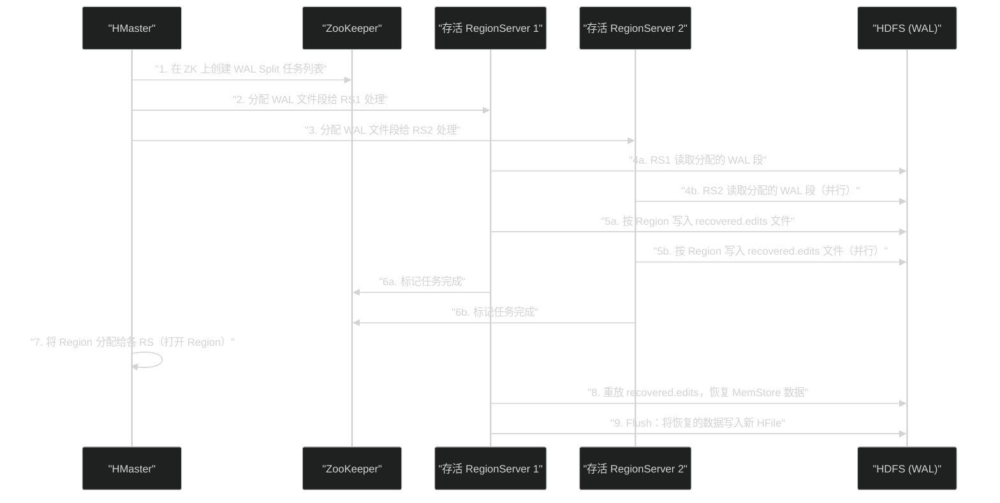
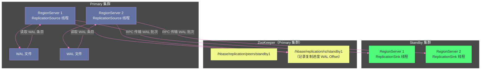

# HBase 高可用与容灾——崩溃恢复、备份与复制

**摘要：**

分布式系统的可靠性不来自于"不出故障"，而来自于"故障时能快速恢复"。HBase 的高可用体系围绕三道防线构建：**单节点故障恢复**（RegionServer 宕机时，通过 WAL 重放在秒到分钟级别恢复数据服务）、**控制面高可用**（HMaster 双机热备，通过 ZooKeeper 选举在秒级切换）、**跨集群容灾**（通过 Snapshot 备份和 Replication 复制，构建 RPO/RTO 可控的灾备能力）。本文逐层深入这三道防线的实现机制：WAL 分割（WAL Split）如何将一个宕机 RegionServer 的日志按 Region 切分后分发给存活节点重放；HMaster 的主备选举如何依托 ZooKeeper 的临时节点和 Watch 机制实现无缝切换；Snapshot 如何基于 HFile 的不可变性实现近零代价的在线备份；Replication 如何以 WAL 为媒介实现跨集群的异步数据同步。

---

## 第 1 章 分布式系统的故障模型

### 1.1 HBase 面临的故障场景分类

在讨论 HBase 的高可用方案之前，先建立故障场景的认知框架。HBase 集群可能面临的故障，按影响范围从小到大分为四类：

**节点级故障**：单台 RegionServer 宕机（OOM、硬件故障、系统崩溃）。这是最常见的故障类型，HBase 的核心容错机制针对此类故障设计。

**控制节点故障**：HMaster 宕机。HMaster 不在读写数据路径上（第 03 篇详细分析过），短暂宕机不影响正在进行的读写操作，但影响新的 DDL 操作和负载均衡。

**网络分区**：部分节点之间的网络断开，但节点本身未宕机。这是最难处理的故障类型，可能导致 ZooKeeper Session 超时，触发"脑裂"风险。

**机房级故障**：整个数据中心不可用（断电、自然灾害）。此时需要跨机房的容灾方案（Replication + 异地备份）。

每类故障对应不同的恢复机制和 RTO（Recovery Time Objective，恢复时间目标）：

| 故障类型 | 检测时间 | 恢复时间 | 主要机制 |
|---------|---------|---------|---------|
| RegionServer 宕机 | ZK Session 超时（30~60s）| 1~10 分钟 | WAL Split + Region 重分配 |
| HMaster 宕机 | ZK Session 超时（30s）| 30s~2min | ZK 选举 + Standby Master |
| 网络分区（ZK 超时）| ZK Session 超时 | 同 RegionServer 宕机 | Fail-Fast + 重分配 |
| 机房级故障 | 人工发现 | 分钟~小时 | Replication 切换 + Snapshot 恢复 |

### 1.2 HBase 高可用的设计基础：HDFS 作为持久化保障

HBase 所有持久化数据（HFile 和 WAL）都存储在 HDFS 上，而 HDFS 本身提供 3 副本的冗余存储。这意味着：

- **RegionServer 宕机不会导致数据丢失**：HFile 和 WAL 在 HDFS 上，RegionServer 只是这些文件的"读写代理"，宕机后数据依然完好地保存在 HDFS 中
- **恢复问题简化为"重新接管"问题**：不需要复制数据，只需要让其他 RegionServer 接管宕机 RS 上的 Region，并通过 WAL 恢复 MemStore 中尚未持久化的数据

这是 HBase 能够以相对简单的方式实现节点级高可用的根本原因——计算节点（RegionServer）与存储节点（HDFS DataNode）的分离，让容错恢复变得清晰可预期。

---

## 第 2 章 RegionServer 宕机恢复：WAL Split 机制

### 2.1 检测故障：ZooKeeper 的心跳超时机制

每个 RegionServer 启动时，在 ZooKeeper 的 `/hbase/rs/` 目录下创建一个**临时节点（Ephemeral Node）**，节点名为该 RegionServer 的地址（`hostname:port:startcode`）。

RegionServer 持续向 ZooKeeper 发送心跳，维持 ZooKeeper Session。ZooKeeper 默认的 Session 超时时间由 `zookeeper.session.timeout` 配置（通常 90 秒，建议生产中设置为 60~90 秒）。

当 RegionServer 宕机或因 Full GC 等原因无法响应时：
1. ZooKeeper Session 超时（在 `session.timeout` 时间内未收到心跳）
2. ZooKeeper 自动删除该 RegionServer 的临时节点
3. HMaster 通过 Watch 机制收到节点删除通知，确认该 RegionServer 已故障

> [!warning] 生产避坑：ZooKeeper Session 超时 vs JVM GC 停顿
> 如果 RegionServer 遭遇长时间 Full GC（如 CMS GC 并发失败触发 Stop-the-World GC，耗时超过 `zookeeper.session.timeout`），会导致 ZooKeeper Session 超时，进而触发 HMaster 将该 RS 视为宕机，开始 WAL Split 和 Region 重分配。
> 
> 但当 GC 结束后，RegionServer 进程本身还在运行，它尝试重新向 ZooKeeper 注册，此时集群中同一个 Region 会被两台 RS 同时服务——"脑裂（Split Brain）"风险！
> 
> HBase 通过 **RegionServer 自我终止（Suicide/Abort）** 来避免这个问题：RS 发现自己的 ZK Session 已失效时，主动调用 `abort()` 终止自己，而不是试图重新注册。这是 HBase Fail-Fast 设计哲学的关键体现。

### 2.2 WAL Split：将宕机 RS 的日志按 Region 切分

HMaster 确认 RegionServer 宕机后，立即触发 **WAL Split** 流程——这是整个故障恢复过程中最耗时的关键步骤。

**为什么需要 WAL Split？**

第 05 篇中介绍过，一个 RegionServer 的所有 Region 共享一个 WAL 文件。这个 WAL 文件中混合了该 RS 上所有 Region 的写入记录，例如：

```
WAL 条目序列（示意）：
  [LSN=101, Region_A, RowKey="user_001", Put(age=25)]
  [LSN=102, Region_B, RowKey="order_001", Put(amount=100)]
  [LSN=103, Region_A, RowKey="user_002", Put(age=30)]
  [LSN=104, Region_C, RowKey="prod_001", Put(price=50)]
  ...
```

Region_A、Region_B、Region_C 故障后会被分配到不同的 RegionServer 上（或同一台，视集群负载而定）。每台接管 RS 只需要恢复它自己接管的那些 Region 的 WAL 条目，不关心其他 Region 的条目。

因此，WAL Split 需要将混合的 WAL 文件**按 Region 拆分**，让每台接管 RS 只处理自己负责的 Region 的日志。

**WAL Split 的执行方式（两种模式）**：

**模式一：HMaster 单点 Split（旧版本，已弃用）**

HMaster 读取故障 RS 的全量 WAL 文件，解析每条记录，按 Region 写入对应的恢复日志文件。对于大型集群（WAL 文件可能有数 GB），这个过程非常耗时，且 HMaster 是单点，Split 期间其他故障无法处理。

**模式二：分布式 WAL Split（Distributed Log Replay，HBase 0.99+）**

将 WAL Split 工作分发给集群中所有**存活的 RegionServer** 并行执行，大幅缩短恢复时间：



分布式 WAL Split 的关键优化是**并行化**：10 台存活的 RS 可以同时处理不同段的 WAL 文件，理论上将 Split 时间降低到 1/10。

**WAL Split 的输出：recovered.edits 文件**

Split 后，每个 Region 在 HDFS 上的目录中产生 `recovered.edits/` 目录：

```
/hbase/data/default/tableName/<region_name>/
  cf/
    <hfile_1>
    <hfile_2>
  recovered.edits/
    0000000000000000123   ← 以 LSN 命名的恢复日志文件
    0000000000000000456
```

每个恢复日志文件中只包含属于该 Region 的 WAL 条目，按 LSN 排序。

### 2.3 Region 重放：接管 RS 的数据恢复

WAL Split 完成后，HMaster 将宕机 RS 上的 Region 分配给存活的 RegionServer。接管 RS 打开 Region 时，检测到 `recovered.edits/` 目录存在，执行重放（Replay）：

1. **按 LSN 顺序读取 recovered.edits 文件**：遍历目录下的所有文件（文件名即 LSN，按名字排序）
2. **将 WAL 条目重放到 MemStore**：每条 WAL 条目对应的 Cell 被写入 MemStore，就像正常写入一样
3. **Flush MemStore**：重放完成后，立即 Flush，将恢复的数据写入新的 HFile
4. **清理 recovered.edits**：删除 `recovered.edits/` 目录，标志恢复完成

**重放幂等性的保障**：同一条 WAL 条目可能被重放多次（如 Split 过程中 RS 再次宕机），HBase 通过 LSN 和 MVCC 机制保证重放的幂等性——相同 LSN 的操作多次执行结果相同，不会引起数据错误。

### 2.4 恢复时间分析与优化

RegionServer 宕机后的端到端恢复时间（RTO）由以下各阶段耗时决定：

```
总 RTO ≈ ZK 超时检测（60~90s）
       + WAL Split（并行模式下 30s~5min，取决于 WAL 大小和存活 RS 数量）
       + Region 重分配和打开（每个 Region 约 1~10s，取决于 HFile 数量）
       + WAL 重放和 Flush（取决于宕机时 MemStore 中的数据量）
```

典型场景下（宕机 RS 管理 100 个 Region，WAL 文件 1GB），总 RTO 约 **3~10 分钟**。

**优化 RTO 的关键参数**：

- **减少 ZK Session 超时时间**：从默认 90s 降低到 30s，更快检测故障（但 GC 停顿时更容易误判）
- **增大 Distributed Log Split 并行度**：通过 `hbase.master.distributed.log.replay` 和相关参数配置更多并行 Split 任务
- **控制 MemStore 大小**：较小的 MemStore（如 64MB）意味着 Flush 更频繁，WAL 中未持久化的数据量更少，重放时间更短
- **控制每台 RS 的 Region 数量**：Region 越少，Region 重分配和打开的总时间越短

---

## 第 3 章 HMaster 高可用：ZooKeeper 选举机制

### 3.1 HMaster 宕机的影响范围

第 03 篇已经深入分析过 HMaster 的职责：它不在数据读写路径上，只负责集群管理（Region 分配、DDL 操作、负载均衡）。

因此，HMaster 短暂宕机期间：
- **正在进行的读写操作不受影响**：RegionServer 继续服务客户端请求
- **新的 DDL 操作被阻塞**：建表、删表、修改表结构等操作需要 HMaster
- **负载均衡暂停**：Region 分裂、Region 迁移等操作暂停
- **RegionServer 故障无法处理**：如果此时有 RS 宕机，WAL Split 和 Region 重分配无法进行

这意味着 HMaster 宕机的影响虽然不如 RegionServer 宕机直接（不丢失正在处理的读写请求），但若 HMaster 长时间不可用，集群的管理能力（包括故障恢复能力）会丧失，最终影响可用性。

### 3.2 Active/Standby 双 HMaster 架构

HBase 支持同时运行多个 HMaster 进程（通常 2~3 个），但同一时刻只有一个是 **Active Master**，其他是 **Standby Master**（热备状态）。

**选举机制**：所有 HMaster 进程竞争在 ZooKeeper 的 `/hbase/master` 路径下创建临时节点。由于 ZooKeeper 的顺序临时节点（Sequential Ephemeral Node）机制，只有第一个成功创建的 HMaster 成为 Active Master，其他的创建失败，进入等待状态（监听 `/hbase/master` 节点的删除事件）。

```
ZooKeeper 节点示意：
  /hbase/master  ← Active Master（如 master1:16000,123456789）
                    临时节点，master1 宕机时自动删除
```

**故障切换**：Active HMaster 宕机后：
1. ZooKeeper Session 超时（30~60s），`/hbase/master` 临时节点被删除
2. 所有 Standby HMaster 收到节点删除通知（Watch 触发）
3. 所有 Standby HMaster 竞争重新创建 `/hbase/master` 节点
4. 第一个成功的 Standby HMaster 成为新的 Active Master
5. 新 Active HMaster 扫描 ZooKeeper 上的 Region 状态，重建集群视图，开始正常服务

**新 Master 的"接管流程"**：

新 Active HMaster 上线后，首先执行"集群状态重建"：

- 从 ZooKeeper 读取所有存活 RegionServer 列表
- 从 `hbase:meta` 表读取所有 Region 的当前分配情况
- 检查是否有处于中间状态（如 SPLITTING、OPENING）的 Region，并完成或回滚这些操作
- 开始正常的负载均衡和故障检测

这个接管过程通常需要 **30 秒~2 分钟**，期间新 Master 不接受外部管理请求。

> [!info] 核心概念：HMaster HA 的轻量性
> 与 RegionServer HA（需要 WAL Split 和数据重放）相比，HMaster HA 切换代价极低——Standby Master 不需要任何数据恢复，只需要从 ZooKeeper 和 `hbase:meta` 重建内存中的集群状态视图。这正是 HBase 将 HMaster 设计为"不在数据路径上"的工程回报：控制面的故障和恢复与数据面完全解耦。

---

## 第 4 章 Snapshot：在线备份的工程设计

### 4.1 为什么 HBase 需要独立的 Snapshot 机制

HDFS 的 3 副本提供了对节点故障的保护，但它无法防止以下情况：
- **数据逻辑错误**：应用 Bug 写入了错误数据，或误操作删除了重要数据——3 副本一样忠实地存储了错误数据
- **表结构误删除**：`drop 'tableName'` 执行后，数据从所有 HDFS 副本中删除
- **跨时间点的数据访问**：需要查看 3 天前的数据状态（时间点恢复）

[[Snapshot]]（快照）提供了数据在**特定时间点的完整视图**，支持：
- 将表恢复到快照时间点的状态（Restore）
- 从快照克隆出一个新表（Clone）
- 将快照导出到另一个 HDFS 集群（Export，用于异地备份和集群迁移）

### 4.2 Snapshot 的实现原理：基于 HFile 不可变性的零代价快照

HBase Snapshot 的实现依赖于 HFile 的**不可变性（Immutability）**：HFile 一旦写入就不再修改，只会被 Compaction 替换（新文件替换旧文件）。这个特性使得"拍摄快照"可以通过**记录当前 HFile 列表的元数据**来完成，不需要复制任何数据。

**Snapshot 的创建过程**：

```
执行 snapshot 'tableName', 'snapshot_name' 时：

1. HMaster 向所有服务该表的 RegionServer 发送"准备快照"指令
2. 每个 RegionServer：
   a. Flush 当前 MemStore（将最新数据持久化到 HFile）
   b. 记录当前 Store 下所有 HFile 的文件名列表
   c. 在 HDFS 上对每个 HFile 创建"硬链接（Hard Link）"
   d. 向 HMaster 确认完成
3. HMaster 将所有 RegionServer 的 HFile 列表合并，写入快照元数据文件
   存储位置：/hbase/.hbase-snapshot/<snapshot_name>/
```

**关键：硬链接（Hard Link）**

HDFS 的硬链接使两个文件名指向同一个数据块。HBase 的 Snapshot 对每个 HFile 创建硬链接：

```
原始 HFile：/hbase/data/default/myTable/<region>/cf/<hfile_1>
快照硬链接：/hbase/.archive/data/default/myTable/<region>/cf/<hfile_1>
```

两个路径指向相同的 HDFS 数据块（Block）——没有数据复制，快照创建几乎是瞬间完成的（只创建元数据和硬链接）。

**快照如何"保护"旧 HFile**：

Compaction 会替换旧 HFile（删除旧文件，写入新文件）。有了硬链接后，即使原始路径上的 HFile 被 Compaction 删除，快照目录中的硬链接依然有效——数据块的引用计数 > 0，HDFS 不会真正删除数据。

这意味着：创建快照后，Compaction 仍然正常进行，快照只是"保留了快照创建时刻的数据视图"，不影响后续的数据更新。

### 4.3 Snapshot 的空间占用演进

快照创建时不占用额外空间（只有元数据）。但随时间推移：

- 快照时刻的 HFile 被 Compaction 替换后，**新的 HFile 与快照无关**——新写入的数据正常占用新的 HDFS 空间
- 快照保护的旧 HFile（通过硬链接保留）会持续占用 HDFS 空间，直到快照被删除

因此，快照的"额外"空间占用等于：**快照创建后被 Compaction 替换的旧 HFile 的总大小**（因为这些文件原本会被 GC 删除，但有了快照的硬链接，它们被保留）。

快照保存时间越长、写入量越大（Compaction 越频繁），快照的额外空间占用越大。这是制定快照保留策略时需要考虑的关键因素。

### 4.4 Snapshot 的使用场景与操作

**场景一：在线备份**

```shell
# 创建快照
hbase> snapshot 'user_behavior', 'user_behavior_20260301'

# 列出所有快照
hbase> list_snapshots

# 查看快照详情
hbase> describe_snapshot 'user_behavior_20260301'
```

**场景二：表恢复（回滚到历史状态）**

```shell
# 将表恢复到快照状态（会覆盖当前数据！）
# 恢复前需要先 disable 表
hbase> disable 'user_behavior'
hbase> restore_snapshot 'user_behavior_20260301'
hbase> enable 'user_behavior'
```

**场景三：克隆快照（无损创建副本）**

```shell
# 从快照创建一张新表（不影响原表，不复制数据）
hbase> clone_snapshot 'user_behavior_20260301', 'user_behavior_backup'
```

**场景四：导出快照到另一个集群（异地备份）**

```shell
# 将快照导出到另一个 HDFS 集群（异地容灾）
hbase org.apache.hadoop.hbase.snapshot.ExportSnapshot \
  -snapshot user_behavior_20260301 \
  -copy-to hdfs://standby-cluster:8020/hbase \
  -mappers 10 \
  -bandwidth 100    # 限速 100MB/s
```

导出快照会将快照引用的所有 HFile 实际复制到目标集群，是真正的数据迁移，耗时与数据量成正比。

---

## 第 5 章 HBase Replication：跨集群的实时数据同步

### 5.1 Replication 的设计目标

Snapshot 提供的是"时间点"级别的备份，两次快照之间发生的数据变更无法通过快照恢复（只能接受快照时间点和故障时间点之间的 RPO 数据损失）。

[[HBase Replication]]（复制）提供了**接近实时的跨集群数据同步**——Primary 集群（源）的写入操作，异步地同步到 Standby 集群（目标），使两个集群的数据保持高度一致。

Replication 的典型应用场景：
- **异地灾备**：Primary 集群不可用时，快速切换到 Standby 集群
- **读写分离**：在线写入走 Primary 集群，离线分析走 Standby 集群（低延迟隔离）
- **多活架构**：多个集群互为对等体（Peer），双向复制

### 5.2 Replication 的实现机制：基于 WAL 的异步复制

HBase Replication 的实现基于 WAL——这是最自然的选择：WAL 已经包含了所有写入操作的完整记录，将 WAL 从 Primary 传输到 Standby 并在那里重放，就完成了数据同步。这与 [[MySQL]] 的 Binlog 复制机制在本质上是相同的。

**Replication 的组件：**



**ReplicationSource 线程（Primary RS 端）：**

每个 RegionServer 为每个配置的 Replication Peer（目标集群）运行一个 `ReplicationSource` 线程：

1. **追踪 WAL 文件**：持续读取当前 WAL 文件，从上次复制的 Offset（存储在 ZooKeeper 中）开始读取新的 WAL 条目
2. **过滤不需要复制的条目**：`SKIP_WAL`（不写 WAL）的写入无法复制；通过 `REPLICATION_SCOPE` 配置不复制的列族也会被过滤
3. **批量传输**：将一批 WAL 条目打包成 RPC 请求，发送到目标集群的某个 RegionServer（负载均衡选择）
4. **更新复制进度**：收到目标集群的确认后，在 ZooKeeper 中更新 WAL Offset

**ReplicationSink 线程（Standby RS 端）：**

接收 Primary RS 发来的 WAL 批次，在本地 RegionServer 上执行这些操作（写入对应的 Region），就像本地写入一样。

**防止复制循环**：在多集群双向复制场景下，一条数据从 A 复制到 B，不能再从 B 复制回 A（造成无限循环）。HBase 通过在每个 WAL 条目中记录 **ClusterID** 来实现防循环：复制时检查 ClusterID，如果目标集群的 ID 已经在 ClusterID 列表中，则跳过不再复制。

### 5.3 Replication 的 RPO 分析

**RPO（Recovery Point Objective，恢复点目标）** 是指在发生灾难时，最多可以丢失多少时间段内的数据。

HBase Replication 的 RPO 取决于 Replication 的延迟：

- Replication 是**异步**的——Primary 写入成功后，数据不是立即出现在 Standby 集群，而是异步复制
- 典型的 Replication 延迟在**毫秒到秒级**（同机房）或**百毫秒到几秒**（跨机房，受网络延迟影响）
- 如果 Primary 集群突然完全不可用（断电），Standby 集群上可能缺少最近几秒到几分钟的写入数据

因此，基于 Replication 的灾备方案的 RPO 通常在**秒到分钟级别**，远优于基于 Snapshot 的方案（RPO = 快照间隔，通常小时级别），但无法达到 RPO = 0（强一致同步复制）。

**强一致复制的代价**：如果要求 RPO = 0，必须等待 Standby 集群确认写入后才返回客户端成功——这意味着每次写入的延迟 = Primary 本地写入延迟 + 跨集群网络往返延迟（RTT）。对于跨机房（RTT 通常 3~50ms），这将使写入延迟倍增，是大多数业务无法接受的代价。

### 5.4 配置 Replication 的基本步骤

**第一步：在 Primary 集群添加 Peer（目标集群）**

```shell
# 在 Primary 集群的 HBase Shell 中执行
hbase> add_peer '1', CLUSTER_KEY => 'standby-zk1,standby-zk2,standby-zk3:2181:/hbase'
```

**第二步：配置列族开启 Replication**

```shell
# 修改列族配置，开启复制（REPLICATION_SCOPE => 1 表示开启异步复制）
hbase> disable 'user_behavior'
hbase> alter 'user_behavior', {NAME => 'info', REPLICATION_SCOPE => '1'}
hbase> enable 'user_behavior'
```

`REPLICATION_SCOPE` 的值：
- `0`（默认）：不复制该列族
- `1`：异步复制（Async Replication）
- `2`（HBase 2.x+）：串行复制（Serial Replication），保证写入顺序与 Primary 一致

**第三步：启动 Replication**

```shell
hbase> enable_peer '1'
```

**第四步：验证复制状态**

```shell
# 查看复制状态（包括落后的 WAL 条目数）
hbase> status 'replication', 'source'
```

---

## 第 6 章 Serial Replication：保证写入顺序一致性

### 6.1 为什么需要 Serial Replication

普通的异步 Replication 中，一个 RegionServer 上的多个 Region 的 WAL 条目可以并发地发送到 Standby 集群，不保证到达 Standby 的顺序与 Primary 的写入顺序一致。

**问题场景**：

```
Primary 集群写入顺序：
  t=1: Put(user_001, age=25)  ← LSN=100
  t=2: Delete(user_001)       ← LSN=101（删除 user_001）

Standby 集群可能到达顺序（网络不一致）：
  Delete(user_001) 先到达（LSN=101）
  Put(user_001, age=25) 后到达（LSN=100）

结果：Standby 上 user_001 数据又"复活"了！
```

这种乱序问题在 Region 发生 Split 或 Move 时尤为突出：Region 迁移后，新 RS 开始写入该 Region，而旧 RS 的 WAL 可能还在复制队列中。如果新 RS 的写入先到达 Standby，旧 RS 的写入再到达并覆盖新数据，就会产生数据回退。

**Serial Replication（HBase 2.x+）** 通过 `REPLICATION_SCOPE => 2` 保证写入到 Standby 的顺序与 Primary 严格一致，从根本上解决乱序问题。代价是复制吞吐量较低（串行 vs 并行）。

---

## 第 7 章 完整容灾体系的架构设计

### 7.1 三层容灾方案

基于前面的分析，一个完整的生产级 HBase 容灾体系通常包含三层：

**第一层：集群内高可用**

- 双/三 HMaster（Active + Standby）
- ZooKeeper 集群（奇数节点，通常 3 或 5 台）独立部署
- HDFS 3 副本（数据本身的冗余）
- RegionServer 故障：WAL Split + Region 重分配（分钟级 RTO）

**第二层：同城双集群 Replication**

- Primary 集群 + 同城 Standby 集群
- 实时 Replication（秒级 RPO）
- 切换流程：停止 Primary 写入 → 等待 Standby Replication 追平 → 切换客户端 DNS → 将 Standby 提升为新 Primary

**第三层：异地快照备份**

- 每日/每小时对重要表拍摄 Snapshot
- 通过 `ExportSnapshot` 将快照同步到异地 HDFS 或对象存储（如 S3）
- 极端灾难场景下，从快照恢复（小时级 RTO，RTO = 数据导出时间）

### 7.2 容灾切换的 SLA 设计

| 灾难级别 | 恢复方案 | 典型 RTO | 典型 RPO |
|---------|---------|---------|---------|
| 单 RS 宕机 | WAL Split + Region 重分配 | 3~10 分钟 | 0（WAL 保证）|
| 多 RS 同时宕机 | 分布式 WAL Split | 5~20 分钟 | 0 |
| 整个 Primary 集群不可用 | Standby 集群切换 | 5~30 分钟 | 秒级 |
| 机房级灾难 | 快照恢复 + 增量回放 | 1~4 小时 | 快照间隔（通常 1 小时）|

### 7.3 生产中的常见误区

**误区一：HBase 的 HDFS 3 副本 = 数据不会丢失**

HDFS 3 副本防止的是"数据块物理损坏导致丢失"，不防护"应用层误操作"（如 `delete` 正确执行了错误的数据）。逻辑备份（Snapshot）才能应对逻辑故障。

**误区二：Replication 完全等同于数据备份**

Replication 会将 Primary 集群的所有操作同步到 Standby，包括误操作（如误删一张表）。如果 Primary 上执行了 `drop 'tableName'`，几秒后 Standby 上这张表也会消失。Replication + Snapshot 双保险才能覆盖所有场景。

**误区三：快照不占额外空间**

快照创建时不占空间，但快照创建后的 Compaction 会产生额外的空间占用（旧 HFile 因硬链接保留）。长期保留大量快照会显著增加 HDFS 空间消耗，需要制定合理的快照保留策略（如保留最近 7 天，每天 1 个）。

---

## 第 8 章 总结：高可用是一个系统工程

HBase 的高可用体系体现了分布式系统高可用设计的几个普适原则：

**原则一：分层设计，每层独立容错**。RegionServer 宕机恢复不需要 HMaster 参与数据路径；HMaster 故障不影响 RegionServer 的读写服务——各层故障影响范围最小化，防止级联故障。

**原则二：持久化先于一切**。WAL Sync 在返回客户端成功之前完成，确保"已确认写入"的数据一定能恢复。RegionServer 宁可主动 Abort，也不以不一致状态继续运行。

**原则三：恢复过程幂等设计**。WAL 重放可以安全地多次执行（相同操作多次执行结果相同），Region 打开时对 `recovered.edits` 的处理幂等——即使恢复过程中再次失败，重新开始也不会导致数据错误。

**原则四：备份与复制分层互补**。Snapshot 应对"时间点恢复"需求（逻辑故障、历史数据查询），Replication 应对"实时容灾"需求（集群级故障切换）。两者的组合覆盖了所有主流的数据可靠性需求。

理解了 HBase 的高可用机制，最后一篇（第 10 篇）将在此基础上，把前面九篇所有知识综合起来，形成一套系统化的 HBase 生产调优实战方法论。

---

> [!note] 思考题
> 1. RegionServer 宕机后，WAL Split 是恢复流程的关键步骤：Master 将宕机 RS 的 WAL 文件按 Region 切分，分发给负责接管这些 Region 的其他 RS 进行重放。WAL Split 的时间与宕机 RS 上 Region 数量和 WAL 文件大小成正比。在拥有 1000 个 Region 的 RS 宕机时，WAL Split 可能需要数分钟，这期间相关 Region 不可用。有哪些配置和架构手段可以缩短 MTTR（平均恢复时间）？
> 2. HBase 的主从复制（Replication）通过异步复制 WAL 来实现跨集群同步，常用于异地容灾或读写分离。但异步复制存在复制延迟——在主集群写入数据后，从集群可能短暂看不到最新数据。在什么业务场景下，这个复制延迟是不可接受的？HBase 有没有机制实现同步复制（写主集群时同时确保从集群也写入成功）？
> 3. HBase 的 Snapshot 功能可以在不拷贝数据的情况下快速创建表的只读快照（通过 HFile 链接实现），用于备份或克隆表。Snapshot 期间 HFile 不会被 Major Compaction 删除（因为 Snapshot 持有引用）。如果一个 Snapshot 长期不删除，而表数据持续更新，会导致什么问题？如何设计自动化的 Snapshot 生命周期管理策略？

## 参考资料

- [1] HBase RegionServer 宕机恢复原理: https://www.cnblogs.com/cxhfuujust/article/details/11996272.html
- [2] HBase 分布式日志重放 (Distributed Log Replay): https://issues.apache.org/jira/browse/HBASE-5751
- [3] HBase Snapshot 设计: https://issues.apache.org/jira/browse/HBASE-1236
- [4] HBase Snapshot 使用: https://www.cnblogs.com/caoweixiong/p/13607657.html
- [5] Hbase 复制 (Replication) 原理: https://blog.csdn.net/shenliang1985/article/details/51420112
- [6] Serial Replication in HBase 2.x: https://issues.apache.org/jira/browse/HBASE-20046
- [7] Apache HBase Reference Guide — HA: https://hbase.apache.org/book.html#hbase.ha
