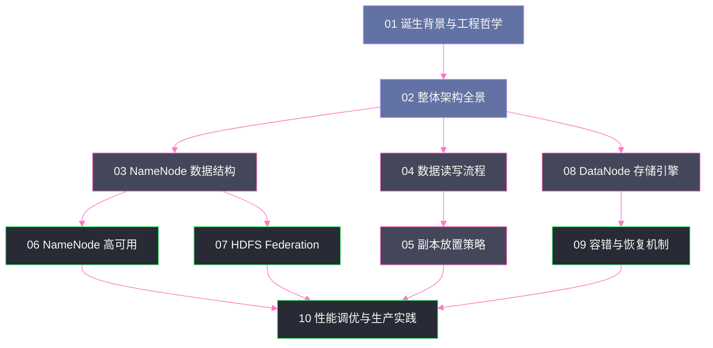

# HDFS 架构深度解析专栏导览

## 专栏定位

本专栏聚焦于 [[HDFS]]（Hadoop Distributed File System）本身的架构设计与底层原理，不涉及 [[Hadoop YARN]] 资源调度、[[MapReduce]] 计算框架等外围系统。目标读者是希望深入理解 HDFS 内部机制、在生产环境中排查问题和做出架构决策的工程师。

## 文章列表

| 序号 | 文章标题 | 核心主题 | 阅读建议 |
|---|---|---|---|
| 01 | [[01 HDFS 的诞生——大规模分布式存储的工程哲学]] | HDFS 解决了什么问题，GFS 论文的工程洞察，为什么要牺牲 POSIX 语义 | 入门必读 |
| 02 | [[02 HDFS 整体架构全景——NameNode、DataNode 与 Client 三角关系]] | 主从架构设计，元数据与数据分离的本质，三者协作的 IO 路径 | 架构基础 |
| 03 | [[03 NameNode 的核心数据结构——FsImage 与 EditLog 的设计奥秘]] | INode 树、BlockInfo 链表、FsImage 快照、EditLog 日志、Checkpoint 机制 | 深度原理 |
| 04 | [[04 HDFS 数据读写流程——Pipeline 写入与机架感知读取的底层路径]] | 租约机制、Pipeline 建立、Packet 传输、ACK 确认、读路径的 Block 选择 | 核心机制 |
| 05 | [[05 HDFS 副本放置策略——机架感知与数据可靠性的工程权衡]] | 三副本放置算法、机架拓扑感知、可靠性与带宽消耗的权衡模型 | 可靠性设计 |
| 06 | [[06 NameNode 高可用——QJM 协议与 Active-Standby 切换机制]] | HA 演进历史、QJM 的 Paxos 变体、Fencing 防脑裂、ZKFC 切换流程 | 高可用架构 |
| 07 | [[07 HDFS Federation——Namespace 水平扩展与 ViewFS 路由]] | 单 NameNode 天花板、Block Pool 隔离、ViewFS 路由、RBF 改进 | 扩展性设计 |
| 08 | [[08 DataNode 存储引擎——块文件布局、FsVolume 与 FsDataset]] | 磁盘布局、Block 生命周期、BlockReport 机制、多盘管理 | 存储底层 |
| 09 | [[09 HDFS 容错与恢复机制——心跳、块汇报与数据修复流程]] | 心跳检测、Under-Replicated 检测、CRC 校验、Balancer 均衡原理 | 容错机制 |
| 10 | [[10 HDFS 性能调优与生产实践——从参数配置到架构演进]] | NameNode GC、小文件问题、Short-Circuit Read、EC 纠删码 | 生产实践 |

## 推荐阅读路径

## 技术范围说明

> [!info] 边界说明
> 本专栏**只**覆盖 HDFS 文件系统本身：
> - NameNode 的元数据管理机制
> - DataNode 的块存储机制  
> - Client 的读写 IO 路径
> - HDFS 的高可用与扩展性架构
> - HDFS 的容错与数据可靠性机制
>
> **不**覆盖：YARN 资源调度、MapReduce 计算模型、Hive/Spark 如何使用 HDFS（仅作背景提及）

---

## 关联专栏

- [[大数据/Hadoop/Yarn/00 专栏导览|YARN]]：数据本地性调度依赖 HDFS 的块位置信息
- [[大数据/Hive/00 专栏导览|Hive]]：Hive 表数据存储在 HDFS
- [[大数据/HBase/00 专栏导览|HBase]]：HBase 的 HFile 存储在 HDFS
- [[中间件/JuiceFS/00 专栏导览|JuiceFS]]：JuiceFS 可替代 HDFS 实现存算分离
- [[中间件/Ceph/00 专栏导览|Ceph]]：CephFS vs HDFS 分布式文件系统对比
- [[Linux/文件系统/00 专栏导览|文件系统]]：DataNode 底层使用本地文件系统存储 Block
- [[Trouble-shooting/NameNode长GC事故深度分析：JVM内存管理与Linux Swap的致命交互|NameNode 长 GC 故障案例]]：HDFS NameNode 的生产故障分析
