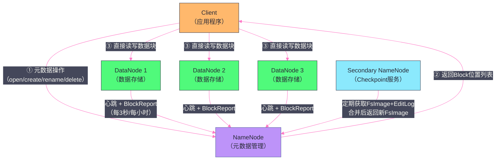
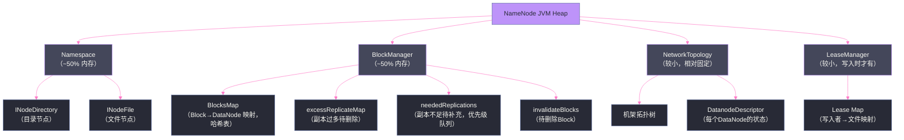
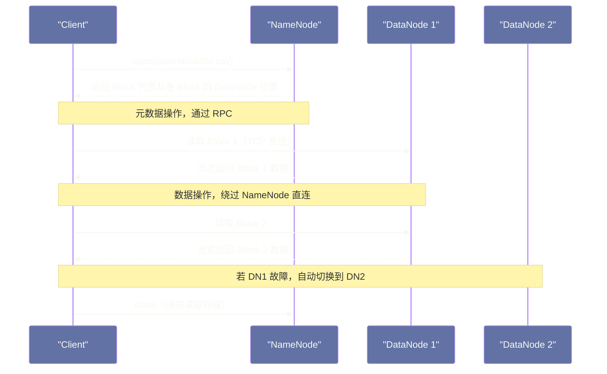
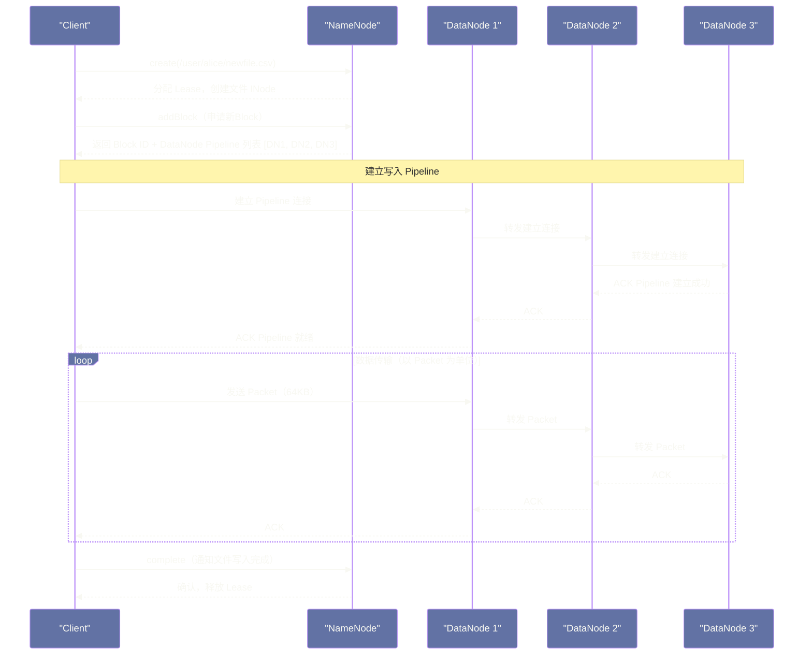

# HDFS 整体架构全景——NameNode、DataNode 与 Client 三角关系

## 摘要

本文系统性地拆解 HDFS 的整体架构，聚焦于 NameNode、DataNode、Client 三大角色的职责边界与协作机制。文章深入剖析元数据与数据分离这一核心架构决策背后的工程逻辑——为什么不让 NameNode 存数据、为什么 DataNode 不管元数据、为什么 Client 的 I/O 要绕开 NameNode 直连 DataNode。在此基础上，详细解析 NameNode 的四层内存数据结构（Namespace、BlockManager、NetworkTopology、LeaseManager），以及 DataNode 的存储职责和通信协议。理解这三者的"分工"与"协作"，是读懂 HDFS 一切后续细节的结构性基础。

---

## 第 1 章 引言：架构的本质是分工

上一篇文章讲清楚了 HDFS 诞生的历史背景和核心设计假设。本文进入架构层面，回答一个更具体的问题：HDFS 把整个分布式文件系统的工作，划分给了哪些角色，每个角色负责什么，它们如何协作？

在任何复杂系统的架构设计中，**分工**是降低复杂度的根本手段。HDFS 把分布式文件系统的职责切分成了三个清晰的角色：

- **NameNode**：系统的"大脑"，负责管理文件系统的元数据——目录树、文件属性、Block 到 DataNode 的映射。
- **DataNode**：系统的"肌肉"，负责实际存储数据块，响应 Client 的读写请求。
- **Client**：系统的"用户"，代表应用程序访问 HDFS，它既要与 NameNode 沟通"数据在哪里"，又要直接与 DataNode 传输实际数据。

这三者之间的关系，可以用一个现实中的类比来理解：**图书馆的管理员（NameNode）、书架（DataNode）和读者（Client）**。读者想借一本书，先去管理员处查询"这本书在几号书架的哪一格"（向 NameNode 查询），然后自己走到对应书架取书（直接从 DataNode 读数据），还书时也是先放回书架，再通知管理员更新记录。管理员自始至终不碰书本本身——他只管索引，不管内容。

这个类比揭示了 HDFS 架构中最核心的一个设计决策：**NameNode 永远不传输数据，用户数据永远不流过 NameNode**。这一决策的背后，有着深刻的工程逻辑，本文将一一展开。

### 1.1 架构全景图

在深入各个组件之前，先建立一个直观的整体印象：


![[Pasted image 20260323110737.png]]
这张架构图揭示了 HDFS 工作的三条核心数据流：
1. **元数据流**：Client ↔ NameNode（控制面，轻量级 RPC 通信）
2. **数据流**：Client ↔ DataNode（数据面，大块 TCP 流式传输）
3. **管理流**：DataNode → NameNode（心跳与 BlockReport，NameNode → DataNode 指令下发）

---

## 第 2 章 NameNode：系统的元数据大脑

### 2.1 NameNode 是什么，解决了什么问题

NameNode 是整个 HDFS 集群的元数据管理中心，是一个中心化的、单节点的服务（在 HDFS HA 模式下有一主一备）。它在 JVM 进程内存中维护着整个文件系统的"目录"——所有文件和目录的属性信息、所有文件被切分成哪些 Block、每个 Block 存储在哪些 DataNode 上。

在回答"NameNode 是什么"之前，更重要的问题是：**如果没有 NameNode，或者说不把元数据集中管理，会发生什么？**

设想一个没有 NameNode 的 HDFS：所有 DataNode 各自存储一些数据块，但没有人知道"文件 `/user/alice/data.csv` 被切成了哪些 Block，这些 Block 分别在哪台 DataNode 上"。Client 每次读文件，都要广播查询所有 DataNode，让它们汇报自己拥有哪些 Block，然后 Client 自己拼装……这显然是不可行的——查询开销是 O(N)（N 是 DataNode 数量），且并发查询会给所有 DataNode 带来巨大压力。

NameNode 通过集中管理元数据，把这个 O(N) 的查询变成了 O(1) 的内存查找——Client 只需向 NameNode 发一个 RPC 请求，NameNode 直接从内存哈希表中查出 Block 位置，毫秒级返回。这是集中式元数据管理的核心价值。

> [!info] 核心概念：元数据与数据的分离
> HDFS 架构中最重要的设计决策之一，是将**元数据（Metadata）**和**实际数据（Data）**的管理职责彻底分离到不同的节点上。NameNode 只管元数据，DataNode 只管数据。这种分离带来的好处是：元数据操作（open、rename、stat、list）全部在 NameNode 的内存中完成，速度极快；数据传输直接在 Client 和 DataNode 之间进行，不经过 NameNode，NameNode 不会成为数据 I/O 的瓶颈。

### 2.2 NameNode 管理的四层内存数据结构

NameNode 的内存是整个 HDFS 系统最宝贵的资源，它的内存结构可以分为四个主要部分：



#### 2.2.1 Namespace：文件系统的目录树

Namespace 是 NameNode 最核心的数据结构，它维护着整个 HDFS 文件系统的目录树，本质上是一棵保存在内存中的 N 叉树。树的每一个节点是一个 `INode` 对象，分为两种类型：

**`INodeDirectory`**：代表目录节点。其关键字段包括：
- `name`：节点名称（字节数组）
- `permission`：权限信息（owner、group、mode）
- `modificationTime`、`accessTime`：时间戳
- `children`：子节点列表，默认初始容量为 5 的 `ArrayList<INode>`，按子节点名称有序排列（便于二分查找）
- `features`：可扩展特性列表（如 `QuotaFeature`、`SnapshotFeature`）

**`INodeFile`**：代表文件节点。在 `INodeDirectory` 的基础上，额外包含：
- `header`：一个 64 位的 `long` 值，紧凑地编码了**副本系数（replication factor）**和**Block 大小（block size）**两个信息（高 16 位存副本数，低 48 位存 Block 大小）。这个设计节省了内存，但也意味着副本数最大只能是 65535，Block 大小最大只能是 2^48 字节（约 256TB，实践中远够用）。
- `blocks`：一个 `BlockInfo[]` 数组，按顺序存储该文件包含的所有 Block 的元数据引用。

> [!note] 设计哲学：为什么要把副本数和Block大小压缩进一个 long？
> 每个 `INodeFile` 对象在 JVM 中都要占用内存。一个大型 HDFS 集群可能有几亿个文件，每个文件节点节省哪怕 8 字节，乘以几亿就是几 GB。HDFS 的实现者对每个数据结构都非常在意内存占用，这种"极度节约内存"的编程风格在 HDFS 源码中随处可见。

`INodeDirectory` 的 `children` 列表按名称有序排列，这个设计是一个典型的"以写性能换读性能"的权衡：插入子节点时需要找到正确位置（O(log N) 二分查找 + O(N) 移位），而查找某个子节点时可以使用二分查找（O(log N)）。对于文件系统来说，读操作（`ls`、`stat`、`open`）的频率远高于写操作（`mkdir`、`create`），这个取舍是合理的。

整个 Namespace 目录树在内存中的大小，主要取决于文件和目录的总数量。美团技术团队的测试数据显示：**当目录和文件总量达到 2 亿时，Namespace 常驻内存使用量超过 50GB**（以 Hadoop 2.4.1 为基准）。这就是为什么大型 HDFS 集群的 NameNode 通常需要配置 128GB 到 512GB 的内存。

#### 2.2.2 BlockManager：Block 的全生命周期管理

BlockManager 是 NameNode 内存中第二大的数据结构，负责管理所有 Block 的元数据及其动态状态变化。

**BlocksMap：核心索引**

BlocksMap 是 BlockManager 最核心的数据结构，本质是一个以 Block 的 `blockId` 为 key、以 `BlockInfo` 对象为 value 的哈希表，底层通过 `LightWeightGSet`（一种针对内存优化的链式哈希表）实现。

`BlockInfo` 是 Block 元数据的核心载体，它包含：
- `blockId`：Block 的唯一 64 位整数 ID
- `numBytes`：Block 实际大小（字节数）
- `generationStamp`：Block 的时间戳/版本号，用于检测陈旧副本
- `triplets`：一个 `Object[]` 数组，大小为 `3 × replication`，存储了这个 Block 的所有副本所在的 DataNode 信息

`triplets` 的设计非常精妙。假设一个 Block 有 3 个副本，`triplets` 数组长度为 9：
- `triplets[0]`：第 0 个副本所在的 `DatanodeStorageInfo` 对象
- `triplets[1]`：该 DataNode 存储单元上，这个 Block 的**前一个** Block（构成双向链表）
- `triplets[2]`：该 DataNode 存储单元上，这个 Block 的**后一个** Block（构成双向链表）
- `triplets[3]`、`triplets[4]`、`triplets[5]`：第 1 个副本的同样信息
- `triplets[6]`、`triplets[7]`、`triplets[8]`：第 2 个副本的同样信息

通过这个设计，`BlockInfo` 同时服务于两个查询方向：
1. **给定文件，找到它的所有 Block 及每个 Block 的所有副本位置**：通过 `INodeFile.blocks[]` 数组遍历 `BlockInfo`，再通过 `triplets[0]`、`triplets[3]`、`triplets[6]` 找到各副本 DataNode。
2. **给定 DataNode，找到它存储的所有 Block**：通过 `DatanodeStorageInfo` 持有链表头指针，利用 `triplets[1]`/`triplets[2]` 的双向链表结构遍历该 DataNode 上的所有 Block。

这种"一个对象，两个方向都能高效遍历"的数据结构设计，是 HDFS 源码中最值得学习的工程技巧之一。

**BlocksMap 的初始化大小为什么不会 rehash？**

BlocksMap 在初始化时，会根据当前 JVM 可用内存的 2% 计算初始容量，一旦确定后不再扩容。这个设计背后的考量是：HDFS 的 BlocksMap 可能存储数以亿计的 BlockInfo，如果发生 rehash，需要重新计算所有 Block 的哈希值并重排，这个过程会造成严重的 GC 停顿（Stop-The-World），在生产环境中是不可接受的。通过预分配足够的容量，完全规避了 rehash 的风险，代价是可能有一定的内存浪费。

**Block 的动态状态管理**

除了静态的位置信息，BlockManager 还需要处理 Block 状态的动态变化。当集群状态发生变化（DataNode 宕机、磁盘故障、手动调整副本数等），一些 Block 的实际副本数可能与预期值不符，BlockManager 通过以下几个数据结构跟踪这些异常：

| 数据结构 | 类型 | 作用 |
|---|---|---|
| `neededReplications` | 优先级队列（副本缺少越多优先级越高） | 记录副本数不足的 Block，等待补充复制 |
| `excessReplicateMap` | `DataNode → Block集合` 映射 | 记录副本数超出预期的 Block，等待删除多余副本 |
| `invalidateBlocks` | `DataNode → Block集合` 映射 | 记录待删除的 Block（文件被删除时）|
| `corruptReplicas` | Block → 副本集合 映射 | 记录校验和不匹配的损坏副本 |
| `underReplicatedBlocks` | 优先级队列 | `neededReplications` 的前身，存储副本数不足的 Block |

`neededReplications` 是一个**优先级队列**，这个设计很重要：当多个 Block 同时需要补充副本时，缺少副本数最多的 Block（优先级最高）会被优先处理，以最快速度将这些"高风险"Block 恢复到安全状态。

#### 2.2.3 NetworkTopology：机架感知的基础设施

NetworkTopology 维护着 HDFS 集群的机架拓扑结构，是副本放置策略（Block Placement Policy）的基础数据。

其数据结构是一棵树：树的根节点代表整个数据中心，第二层节点代表每个机架（Rack），叶子节点代表每台 DataNode 服务器。每个 DataNode 在注册到 NameNode 时，会通过机架感知脚本（`net.topology.script.file.name` 配置项）确定自己属于哪个机架，NameNode 据此构建树形拓扑。

NetworkTopology 中还为每个 DataNode 维护了一个 `DatanodeDescriptor` 对象，这个对象是 NameNode 眼中一台 DataNode 的"画像"，包含：
- DataNode 的地址（IP、hostname、端口）
- DataNode 上每个存储单元（`DatanodeStorageInfo`）的状态
- 最后心跳时间（用于检测 DataNode 是否存活）
- 待下发给该 DataNode 的指令队列（`replicateBlocks`、`invalidateBlocks` 等）

NameNode 与 DataNode 的通信是**被动拉取模型**：不是 NameNode 主动推送指令给 DataNode，而是 DataNode 定期发送心跳，NameNode 在心跳响应中附带需要执行的指令（复制某个 Block、删除某个 Block 等）。这个设计避免了 NameNode 需要维护到每个 DataNode 的长连接，简化了网络管理。

#### 2.2.4 LeaseManager：写入互斥的保障机制

LeaseManager 管理着 HDFS 的**租约（Lease）机制**，这是 HDFS 实现"同一时刻只有一个写入者"语义的核心。

**什么是 Lease？为什么需要 Lease？**

HDFS 的文件写入模型是：在文件被创建并开始写入后，直到文件被关闭之前，这个文件处于"打开写入"状态，被称为处于**租约期**。在租约期内，只有持有该文件租约的 Client 才能向文件追加数据，其他任何 Client 都不能写入。

为什么需要这个机制？考虑这样的场景：如果没有租约，两个 Client 同时打开同一个文件并开始写入，它们都会向 NameNode 请求分配新的 Block，然后并发地向不同的 DataNode 写入数据。最终文件的内容将是两个 Client 写入内容的不确定混合，数据完整性无法保证。Lease 机制通过"独占写入权"彻底避免了这个问题。

Lease 的生命周期管理是通过 NameNode 内的 LeaseManager 实现的：
- Client 创建文件时，向 NameNode 申请 Lease，NameNode 将 `(Client ID → File Path)` 的映射记录在 LeaseManager 中。
- Client 在写入过程中，每隔一段时间（默认每 30 秒）向 NameNode 发送 Lease 续约请求（renew lease），告诉 NameNode"我还在写，这个 Lease 还要继续保持"。
- 如果 Client 正常关闭文件，Lease 被主动释放。
- 如果 Client 异常崩溃，LeaseManager 中的续约超时机制会介入：LeaseManager 的 `Monitor` 线程定期检查所有 Lease，如果某个 Lease 超过软限制时间（`dfs.namenode.lease-recheck-interval`，默认 60 秒）未续约，则允许其他 Client 强制恢复该文件（Force Lease Recovery）；如果超过硬限制时间（默认 60 分钟），则 NameNode 自动终止并回收该 Lease。

> [!warning] 生产避坑：Lease 过期导致文件无法写入
> 在生产环境中，如果写入 HDFS 的程序（如 Spark Streaming 的 FileOutputCommitter、自定义写入任务）因为 GC 停顿、网络抖动等原因长时间没有续约，Lease 会被其他进程或 NameNode 自动回收，导致写入失败并抛出 `LeaseExpiredException`。排查此类问题时，应检查 NameNode 日志中是否有 `Lease recovery` 相关日志，以及写入端是否有长时间 GC 停顿的迹象。

### 2.3 NameNode 的工作模式：安全模式与正常服务

NameNode 启动后会经历两个工作阶段：

**安全模式（Safe Mode）**

NameNode 启动时，首先从本地磁盘加载 FsImage 文件，重建内存中的 Namespace 目录树。但此时 BlocksMap 是空的——NameNode 不知道每个 Block 存储在哪些 DataNode 上。

NameNode 进入"安全模式"，等待 DataNode 陆续上线并发送 BlockReport（块报告）。BlockReport 是每个 DataNode 汇报"我本地存储了哪些 Block"的完整列表。NameNode 收到 BlockReport 后，逐渐重建 BlocksMap。

当足够多的 Block 副本数达到最低要求（默认是 99.9% 的 Block 都有至少 1 个可用副本）后，NameNode 自动退出安全模式，开始对外提供正常的读写服务。

> [!info] 核心概念：为什么 Block 位置信息不持久化到磁盘？
> 你可能会奇怪：FsImage 持久化了 Namespace，为什么不同时持久化 BlocksMap（即 Block 到 DataNode 的映射）？原因是：DataNode 上的数据是会变化的——磁盘可能被替换、DataNode 可能被迁移、Block 可能被手动移动。如果 NameNode 在 FsImage 里记录了"Block X 在 DN1 上"，但 DN1 后来宕机了、Block X 被复制到了 DN2 上，重启时 NameNode 会读到过时的位置信息，这比什么都不知道更危险。**让 DataNode 在每次启动时主动汇报自己的 Block 列表**，确保 NameNode 拿到的始终是当下真实的状态，这是更可靠的设计。

**正常服务模式**

退出安全模式后，NameNode 处理来自 Client 的元数据 RPC 请求，同时持续接收来自 DataNode 的心跳和增量 BlockReport，维护 BlocksMap 的实时状态。NameNode 的两个核心后台线程持续运行：
- **`ReplicationMonitor`**：定期扫描 `neededReplications` 和 `excessReplicateMap`，为副本不足的 Block 发起复制，为副本过多的 Block 发起删除指令。
- **`DecommissionManager`**：处理 DataNode 退役（Decommission）操作，确保退役节点上的 Block 在其下线前都有足够副本转移到其他节点。

---

## 第 3 章 DataNode：数据的实际存储者

### 3.1 DataNode 是什么，解决了什么问题

DataNode 是 HDFS 集群中数量最多的角色，在一个中等规模的集群中，DataNode 的数量通常在几十到几百台之间，大型集群可以达到数千台。每台 DataNode 就是一台普通的 x86 服务器，配备多块本地 HDD 或 SSD。

DataNode 的职责相对简单，可以概括为以下几点：
1. **存储数据块**：将 Client 发来的数据块写入本地磁盘，每个 Block 对应两个文件：数据文件（`blk_<blockId>`）和校验和文件（`blk_<blockId>.meta`）。
2. **响应读写请求**：接收 Client 的数据块读写请求，通过本地磁盘 I/O 完成数据的读取或写入。
3. **参与 Pipeline 复制**：在写入流程中，作为数据复制流水线的节点，将收到的数据块转发给下一个 DataNode。
4. **向 NameNode 汇报状态**：定期发送心跳（每 3 秒）和块报告（BlockReport，全量报告每小时一次，增量 BlockReport 在 Block 状态变化时即时发送），让 NameNode 掌握自己的存活状态和 Block 分布情况。

### 3.2 DataNode 的本地存储结构

DataNode 将数据存储在一系列本地目录中，这些目录由配置项 `dfs.datanode.data.dir` 指定（可以配置多个，对应多块磁盘，DataNode 会在多块磁盘之间分散存储 Block，以提高聚合 I/O 带宽）。

在每个数据目录下，DataNode 的存储布局大致如下：

```
/data/hdfs/dn1/
└── current/
    ├── BP-<namespace-id>-<NameNode-IP>-<创建时间戳>/   ← Block Pool 目录
    │   ├── current/
    │   │   ├── VERSION                                  ← 版本信息文件
    │   │   ├── finalized/                               ← 已完成写入的Block
    │   │   │   └── subdir0/
    │   │   │       └── subdir1/
    │   │   │           ├── blk_1073741825               ← 数据文件
    │   │   │           └── blk_1073741825_1001.meta     ← 校验和文件
    │   │   └── rbw/                                     ← 正在写入中的Block（RBW: Replica Being Written）
    │   └── tmp/                                         ← 临时Block
    └── VERSION
```

几个关键点值得解释：

**Block Pool 目录**

每个 HDFS NameNode 对应一个 Block Pool（块池），Block Pool ID 全局唯一。DataNode 可以同时服务于多个 NameNode（在 HDFS Federation 模式下），每个 NameNode 对应的 Block 数据存储在独立的 Block Pool 目录下，互不干扰。Block Pool ID 的格式是 `BP-<随机数>-<NameNode IP>-<时间戳>`，在集群格式化时生成。

**finalized 与 rbw 目录**

Block 在 DataNode 本地有两种状态：
- **`finalized`**（已完成）：写入完成、所有副本都已确认的 Block 存储在这里，这是 Block 的"稳定"状态。
- **`rbw`**（Replica Being Written，正在写入的副本）：Client 正在写入的 Block 暂时存储在 `rbw` 目录下。只有当 Client 关闭文件（调用 `close()`）、NameNode 收到通知后，Block 才从 `rbw` 目录移入 `finalized` 目录。

为什么要区分 `rbw` 和 `finalized`？这个设计是为了处理 DataNode 重启场景：DataNode 重启后，在 `rbw` 目录下发现的 Block 意味着它们是之前写入未完成的，DataNode 会将这些 Block 标记为"需要恢复"（`RWR: Replica Waiting to be Recovered`），等待 NameNode 决定如何处理。而在 `finalized` 目录下的 Block 则被认为是完全可信的数据。

**二级子目录结构（subdir0/subdir1）**

在 `finalized` 目录下，Block 文件并不是直接平铺存放的，而是通过两级子目录（`subdir0`~`subdir63`）来组织，形成最多 64×64=4096 个子目录。这是因为 ext4 等文件系统在单个目录下文件数量过多时，目录遍历和文件查找的性能会显著下降（`readdir` 系统调用的开销随目录项数量线性增长）。通过将 Block 分散到多个子目录中，每个子目录最多存放几百个 Block 文件，保证了本地文件系统操作的高效性。

**Block 文件与 .meta 文件**

每个数据 Block 对应两个文件：
- **数据文件**（`blk_<blockId>`）：Block 的原始数据内容。
- **校验和文件**（`blk_<blockId>_<generationStamp>.meta`）：存储 Block 的 CRC32 校验和，按 512 字节为单位计算，文件头部还包含 Block 的版本信息和校验算法类型。

`.meta` 校验和文件的作用是支持**数据完整性验证（Data Integrity Check）**：Client 读取 Block 时，DataNode 会同时读取对应的 `.meta` 文件，对数据做 CRC32 校验，如果校验失败，说明这个副本的数据已损坏，DataNode 会向 NameNode 汇报 `corruptedBlock`，NameNode 会调度从其他健康副本处重新复制该 Block，并将损坏副本标记为无效。

### 3.3 DataNode 与 NameNode 的通信协议

DataNode 与 NameNode 之间的通信是整个 HDFS 集群的"神经系统"，理解这个通信协议对于 HDFS 运维和故障排查非常重要。

**心跳（Heartbeat）**

DataNode 每隔 `dfs.heartbeat.interval`（默认 3 秒）向 NameNode 发送一次心跳。心跳包含当前 DataNode 的基本状态信息：
- 存储容量（总量、已用、剩余）
- 数据传输带宽（xmit bandwidth）
- 当前正在执行的数据传输连接数

NameNode 收到心跳后，返回一系列指令给 DataNode，包括：
- **块复制指令**（replicate block）：把某个 Block 复制到指定的 DataNode
- **块删除指令**（invalidate block）：删除本地某个 Block
- **块缓存指令**（cache block）：将某个 Block 加入内核 Page Cache
- **DataNode 退役指令**（decommission）

**全量 BlockReport（Full Block Report）**

DataNode 在启动时以及之后每隔 `dfs.blockreport.intervalMsec`（默认 6 小时）向 NameNode 发送一次完整的 BlockReport，列出自己所有存储的 Block 的 ID 和长度。NameNode 据此重建 BlocksMap，并发现 Block 副本状态的异常（如某个 Block 有 4 个副本但预期是 3 个——副本过多；或某个 Block 只有 1 个副本但预期是 3 个——副本不足）。

> [!warning] 生产避坑：大集群中 BlockReport 的压力
> 在一个有 1000 个 DataNode、每个 DataNode 上有 100 万个 Block 的大型集群里，全量 BlockReport 会在 NameNode 的 RPC 处理队列中产生巨大压力。Hadoop 2.x 引入了**增量 BlockReport（Incremental Block Report）**机制来缓解这个问题：DataNode 在 Block 状态发生变化时（写入新 Block、删除 Block、Block 损坏等），立即向 NameNode 发送增量报告，而不是等到下一次全量 BlockReport。这样全量 BlockReport 的间隔可以拉长，减少对 NameNode 的冲击。

**数据传输（Data Transfer）**

DataNode 之间、Client 与 DataNode 之间的数据传输，使用的是 HDFS 自定义的 **DataTransferProtocol** 协议，底层是 TCP 长连接。数据传输的单位是**Packet**（数据包），每个 Packet 默认大小为 64KB，包含实际数据和校验和。这个协议设计用于流式大块数据传输，不适合小包高频传输。

---

## 第 4 章 Client：IO 路径的编排者

### 4.1 Client 的角色定位

HDFS Client 是应用程序访问 HDFS 的入口，本质上是一个 Java 库（`hadoop-client`），嵌入在应用程序的进程中运行（而不是一个独立的代理进程）。这个设计意味着 Client 与应用程序共享同一个 JVM，没有额外的进程间通信开销，但也意味着 Client 的状态管理（如 Lease 续约、连接池管理）由应用程序进程负责。

Client 在 HDFS I/O 中扮演**编排者**的角色：
- 对于**元数据操作**（创建文件、列出目录、删除文件等），Client 通过 RPC 直接与 NameNode 交互。
- 对于**数据 I/O 操作**（读文件、写文件），Client 先向 NameNode 查询 Block 位置，然后**绕过 NameNode**，直接与相关的 DataNode 建立 TCP 连接进行数据传输。

这个"控制面走 NameNode、数据面直连 DataNode"的分离模型，是 HDFS 能够支撑 PB 级数据规模的关键：NameNode 只处理轻量级的元数据 RPC，不触碰任何数据字节，因此 NameNode 的 CPU 和网络不会成为瓶颈，即使有数百个 Client 并发访问，NameNode 也能应对。

### 4.2 Client 的读文件流程（概述）

Client 读取一个 HDFS 文件的完整流程如下（详细的 Pipeline 机制将在第 4 篇文章中展开）：



**步骤拆解：**

1. **`open()` 调用**：Client 调用 `FileSystem.open(path)` 时，底层向 NameNode 发起 `getBlockLocations` RPC 请求。NameNode 返回该文件的完整 Block 列表，以及每个 Block 的所有副本所在的 DataNode 列表（按距离 Client 由近到远排序——本地节点 > 同机架节点 > 跨机架节点）。

2. **按 Block 顺序读取**：Client 从第一个 Block 开始，选择最近的 DataNode，建立 TCP 连接，开始流式读取。HDFS Client 通过 `DFSInputStream` 对外暴露一个标准的 `java.io.InputStream` 接口，应用程序感知不到底层的分块读取细节。

3. **容错切换**：如果读取某个 Block 时发现数据损坏（CRC 校验失败）或 DataNode 不可达，Client 会自动切换到该 Block 的另一个副本所在的 DataNode，继续读取，整个切换过程对应用程序透明。

4. **本地优化——Short-Circuit Read**：如果 Client 进程恰好运行在存有目标 Block 副本的 DataNode 机器上（这在 MapReduce/Spark 的 Task 节点上是常见情况），HDFS 支持 **Short-Circuit Read（短路读取）**，即绕过 DataNode 进程，直接通过 Unix Domain Socket 读取 DataNode 本地磁盘上的 Block 文件，进一步减少网络 I/O 和进程间通信开销。

### 4.3 Client 的写文件流程（概述）

写文件流程比读文件流程更复杂，涉及 Lease 申请、Block 分配、Pipeline 建立等多个步骤：



**几个关键机制值得关注：**

**Lease 先行**：Client 在创建文件时就申请了 Lease，在文件被 `close()` 之前，任何其他 Client 都无法写入这个文件。

**Block 按需分配**：Client 并不是在创建文件时就预先分配所有 Block，而是在需要写入新 Block 时（当前 Block 写满 128MB 后）才向 NameNode 申请 `addBlock`。这避免了预分配大量未使用的空间。

**Pipeline 写入**：数据不是 Client 分别发给三个 DataNode，而是形成一个流水线：Client → DN1 → DN2 → DN3。每个节点在将数据写入本地磁盘的同时，同步向下游转发，实现了并行写入，充分利用了每个节点的网络出口带宽。

**Packet 粒度的 ACK 机制**：数据以 Packet（64KB）为单位传输，每个 Packet 写入完成后，由 DN3 逆向发送 ACK 到 DN2，再到 DN1，再到 Client。只有 ACK 到达 Client，对应的 Packet 才被认为写入成功，这确保了数据在所有副本上都落盘后才向 Client 确认。

### 4.4 Client 的容错处理

HDFS Client 在读写过程中内置了多层容错机制：

**读取时的副本切换**：如果某个 DataNode 上的 Block 读取失败（连接超时、数据 CRC 错误），Client 会自动尝试该 Block 的下一个副本所在的 DataNode，无需应用程序介入。

**写入时的 Pipeline 恢复**：如果 Pipeline 中某个 DataNode 在写入过程中失联，DataNode Pipeline 会执行恢复流程：
1. 关闭当前 Pipeline。
2. 已确认写入的 Packet 继续保留；未确认的 Packet 重新加入发送队列。
3. 将故障 DataNode 从 Pipeline 中剔除。
4. 用剩余的健康 DataNode 建立新的 Pipeline，继续写入。
5. 写入完成后，NameNode 检测到该 Block 的副本数不足（原来 3 个 DataNode 现在只有 2 个有完整数据），自动触发再复制，将副本数恢复到 3。

---

## 第 5 章 三者协作：元数据分离的代价与收益

### 5.1 元数据分离为什么能让系统 Scale

NameNode 永远不参与数据传输，这个看似简单的设计决策，是 HDFS 能够扩展到数千个 DataNode 的根本原因。

**数据面带宽随 DataNode 线性增长**：一个有 1000 个 DataNode 的集群，如果每个 DataNode 能提供 1 Gbps 的磁盘-网络聚合带宽，整个集群的数据面总带宽就是 1 Tbps。这个带宽与 NameNode 完全无关，NameNode 的处理能力不会制约数据传输的吞吐量。

**控制面 RPC 请求量相对可控**：Client 在读取文件时，只需一次向 NameNode 发起 `getBlockLocations` 请求，拿到 Block 位置列表后，后续所有的数据传输都绕过 NameNode。即使一个 1TB 的文件被切成了 8192 个 Block，Client 也只需要一次（或几次，对于超大文件会分批获取）RPC 请求，就能拿到所有 Block 的位置信息。NameNode 处理的 RPC 请求量与**文件数量**成正比，而不是与**文件大小**成正比。

### 5.2 元数据分离带来的代价：NameNode 的单点风险

集中式的元数据管理，在赋予系统高扩展性的同时，也带来了一个不可回避的代价：**NameNode 是整个 HDFS 的单点故障**。

如果 NameNode 宕机，整个 HDFS 集群立即不可用——没有人知道 Block 在哪里，没有人能创建新文件，也没有人能处理 DataNode 的心跳。DataNode 上的数据实际上是完好的，但因为"大脑"宕机了，所有数据都无法访问。

这个单点问题是 HDFS 早期版本最受诟病的设计缺陷，Hadoop 社区为此花了多年时间开发和完善 HDFS HA（高可用）方案——引入 Active/Standby NameNode 和 QJM（Quorum Journal Manager）协议，在 Hadoop 2.0 中正式发布。这些内容将在第 6 篇文章中深入讨论。

### 5.3 NameNode 内存的上限：另一个天花板

元数据集中存储在单节点内存中，带来的另一个代价是**NameNode 内存成为整个集群可管理的文件数上限**。

根据美团技术团队的实测数据，在 Hadoop 2.4.1 中，当目录和文件总量达到 2 亿时，NameNode 的常驻内存使用量超过 90GB（Namespace 和 BlockManager 各约占 50%）。一台配备 512GB 内存的高端服务器，大约能管理约 10 亿个文件和目录节点。超过这个规模，要么需要 HDFS Federation（将 Namespace 分片到多个 NameNode），要么需要升级到更大内存的服务器——而后者的单机内存上限也是有极限的。

> [!note] 设计哲学：中心化 vs. 分布式元数据
> HDFS 选择了集中式元数据（Single Master）而非分布式元数据（如 Ceph 的 MDS 集群）。集中式的优点是实现简单、一致性保证容易；缺点是存在单点风险和容量天花板。HDFS 用 HA 解决了单点风险，用 Federation 解决了容量天花板，而不是一开始就选择更复杂的分布式元数据方案。这是"先让系统跑起来，再根据实际问题迭代优化"的工程哲学体现。

---

## 第 6 章 小结：三角关系的核心要义

本文拆解了 HDFS 的三角关系架构，几个关键洞察值得记住：

**关于 NameNode**：
- 内存是 NameNode 最宝贵的资源，它的四层数据结构（Namespace、BlockManager、NetworkTopology、LeaseManager）各司其职，共同支撑元数据管理的所有功能。
- BlocksMap 中的 `triplets` 设计是 HDFS 源码中的精华——用一个数组同时支持"从 Block 找 DataNode"和"从 DataNode 找所有 Block"两个方向的高效查询。
- NameNode 不存储 Block 的物理位置到 FsImage，而是依赖 DataNode 启动时的 BlockReport 重建——这保证了位置信息的实时性和准确性。

**关于 DataNode**：
- Block 的本地存储分为 `finalized`（稳定）和 `rbw`（写入中）两种状态，支持崩溃恢复。
- 每个 Block 都有配套的 `.meta` 校验文件，支持端到端的数据完整性验证。
- DataNode 与 NameNode 的通信是被动拉取模型：DataNode 发心跳，NameNode 在心跳响应中下发指令。

**关于 Client**：
- Client 的 I/O 路径严格分为两段：元数据操作走 NameNode，数据传输绕过 NameNode 直连 DataNode。
- Pipeline 写入模型是 HDFS 高吞吐写入的核心机制，将在第 4 篇文章中深入展开。

在接下来的两篇文章中，我们将分别深入 NameNode 的持久化机制（FsImage 与 EditLog 的设计奥秘）和 HDFS 的数据读写流程（Pipeline 的完整工作机制），把这张整体架构图的每一个角落都照亮。

---

> [!note] 思考题
> 1. NameNode 将整个文件系统的命名空间和 Block 映射关系全部加载到内存中，这使得元数据访问极快，但也限制了 HDFS 能管理的文件总数（受限于 NameNode 内存大小）。每个文件和 Block 在 NameNode 内存中大约占用 150 字节元数据。如果一个集群的 NameNode 有 128GB 内存，理论上最多能管理多少个文件（假设平均每文件 2 个 Block）？这个上限对生产集群规划有什么指导意义？
> 2. HDFS 的写入流程是 Pipeline 模式：Client 将数据发送给第一个 DataNode，第一个 DataNode 转发给第二个，以此类推。这个链式传输的优势是什么？如果 Pipeline 中的某个 DataNode 在写入过程中宕机，Client 如何处理这个故障？写入操作会失败还是会自动重建 Pipeline？
> 3. Client 读取 HDFS 文件时，NameNode 会返回每个 Block 的所有副本位置，Client 根据网络拓扑选择"最近"的 DataNode 读取。"最近"的判断基于机架感知（Rack Awareness）。如果 Client 运行在集群外部（如一台独立的应用服务器），它对集群内部的机架拓扑一无所知，会选择哪个 DataNode？这对跨机房部署的读取性能有什么影响？

## 参考资料

- Apache Hadoop 官方文档：[HDFS Architecture](https://hadoop.apache.org/docs/current/hadoop-project-dist/hadoop-hdfs/HdfsDesign.html)
- 美团技术团队：[HDFS NameNode 内存全景](https://tech.meituan.com/2016/08/26/namenode.html)
- Shvachko, K. et al. (2010). *The Hadoop Distributed File System*. IEEE MSST 2010.
- Apache Hadoop 源码：`org.apache.hadoop.hdfs.server.namenode.INodeFile`、`BlockInfo`、`BlocksMap`
