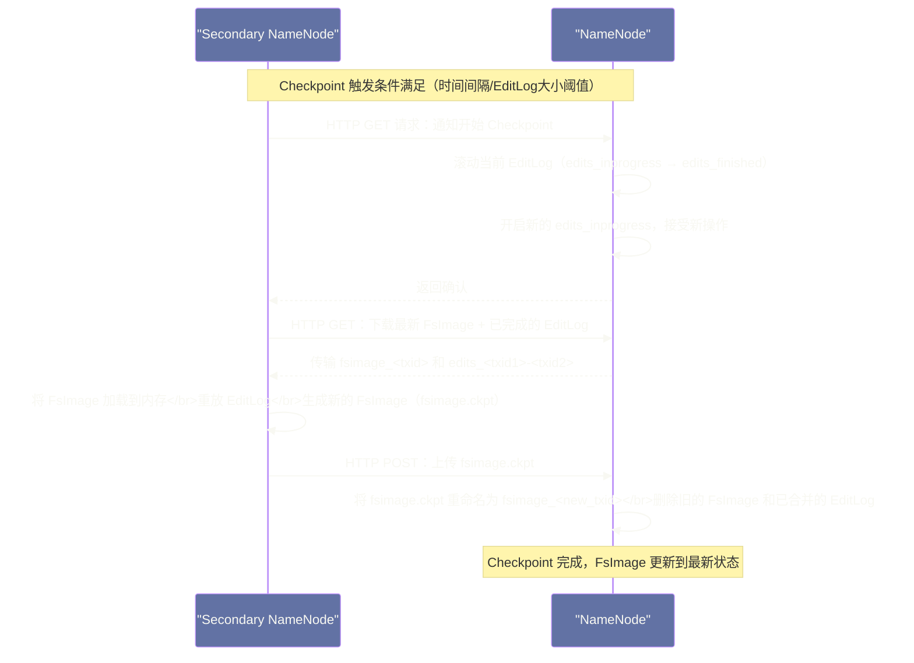
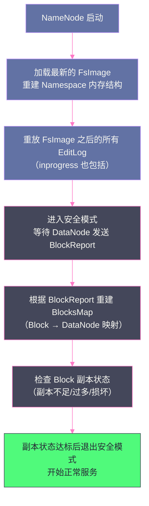

# NameNode 的核心数据结构——FsImage 与 EditLog 的设计奥秘

## 摘要

本文深入剖析 HDFS NameNode 元数据持久化的完整机制。前文讲清楚了 NameNode 在内存中维护的四层数据结构，本文聚焦于这些内存数据如何被安全地持久化到磁盘：FsImage（全量快照）与 EditLog（增量操作日志）分别是什么、为什么要这样设计而不用数据库、两者如何配合实现"内存高效 + 磁盘可恢复"的双重目标。在此基础上，深入解析 Checkpoint 合并机制、Secondary NameNode 的真实定位（它不是备份节点）、EditLog 滚动策略，以及 NameNode 重启时的恢复流程。最后分析这套设计在大规模集群下暴露的局限性，为理解 HDFS HA 的必要性奠定基础。

---

## 第 1 章 引言：内存中的数据如何活过重启

上一篇文章详细剖析了 NameNode 内存中的四层数据结构：Namespace 目录树（INode 树）、BlockManager（BlocksMap + 副本状态管理）、NetworkTopology（机架拓扑）、LeaseManager（写入租约）。这些数据结构是 NameNode 能够快速响应元数据请求的关键——所有查询都在内存中完成，速度极快。

但这里有一个根本性的问题：**内存是易失性的（Volatile）**。一旦 NameNode 进程崩溃或机器断电，内存中的所有数据都会消失。对于一个管理着 PB 级数据的文件系统来说，如果每次 NameNode 重启都要从头重建元数据，那是完全不可接受的——因为 NameNode 根本不知道那些数据"曾经存在过"，DataNode 汇报的 BlockReport 也无法与任何文件关联起来。

因此，NameNode 必须将内存中的元数据持久化到磁盘，以便在重启后能够恢复到崩溃前的状态。这个持久化机制就是本文的核心主题：**FsImage + EditLog 的设计**。

### 1.1 持久化设计面临的根本矛盾

在深入具体实现之前，我们先理解这个持久化设计面临的根本矛盾：

**矛盾一：写入性能 vs. 恢复完整性**

NameNode 每秒需要处理数百甚至数千个元数据操作（创建文件、删除目录、重命名等）。如果每次元数据操作都要把内存中的完整状态序列化写入磁盘（类似于数据库的全量快照），磁盘 I/O 会成为严重瓶颈，写入性能会大幅下降。

但如果完全不写磁盘，一旦 NameNode 崩溃，所有元数据都会丢失。

**矛盾二：快速恢复 vs. 日志文件大小**

如果只记录操作日志（EditLog），NameNode 崩溃后需要从头重放所有历史操作日志来重建状态。对于一个运行了数年的 HDFS 集群，历史操作日志可能有数百 GB，重启恢复时间可能长达数小时——这是不可接受的。

**矛盾三：元数据操作的原子性**

元数据操作（如"创建文件"）在逻辑上是原子的，但写入磁盘的过程并不是原子的——可能在写到一半时进程崩溃。如何确保崩溃后能正确恢复到一个一致的状态？

HDFS 的解法是经典的 **"全量快照 + 增量日志"双轨机制**：用 FsImage 存储周期性的全量快照，用 EditLog 记录快照之后的所有增量操作，两者配合既保证了性能，又保证了可恢复性。

---

## 第 2 章 FsImage：内存状态的全量快照

### 2.1 FsImage 是什么

FsImage（文件系统镜像）是 NameNode 内存中 Namespace 目录树的**完整序列化快照**。它是一个二进制文件，保存了某一个时间点上整个 HDFS 文件系统的完整元数据状态：所有目录和文件的 INode 信息（名称、权限、时间戳、副本数、Block 大小等）、文件与 Block 的映射关系（每个文件包含哪些 Block ID）。

FsImage **不包含** Block 到 DataNode 的物理位置映射（即 BlocksMap 的 triplets 信息）。原因在第二篇文章已经解释过：DataNode 是会变化的，存储物理位置信息到 FsImage 中会导致信息过时，不如每次启动时让 DataNode 主动汇报（BlockReport）来重建。

FsImage 文件的命名规则是 `fsimage_<txid>`，其中 `txid` 是**事务 ID（Transaction ID）**，代表这个 FsImage 所对应的最后一个已提交的元数据操作的序列号。例如 `fsimage_0000000000000123456` 表示这个 FsImage 包含了截止事务 ID 123456 的所有元数据变更。

在 NameNode 的工作目录（`dfs.namenode.name.dir` 配置项，通常配置多个目录以冗余）下，典型的文件列表如下：

```
/data/hdfs/nn/
└── current/
    ├── VERSION                          ← 版本元信息（namespaceID、clusterID等）
    ├── fsimage_0000000000000000000      ← 最初的空 FsImage
    ├── fsimage_0000000000000000000.md5  ← FsImage 的 MD5 校验文件
    ├── fsimage_0000000000001234567      ← 最新的 FsImage（txid=1234567）
    ├── fsimage_0000000000001234567.md5
    ├── edits_0000000000001234568-0000000000001245000  ← 已完成的 EditLog 段（已滚动）
    ├── edits_inprogress_0000000000001245001            ← 当前活跃的 EditLog（写入中）
    └── seen_txid                        ← 记录最后一个已见到的 txid
```

### 2.2 FsImage 的文件格式

FsImage 不是普通的文本文件，而是使用 Protocol Buffers（PB）序列化的二进制格式（Hadoop 2.4+ 开始使用 PB 格式，更早版本使用自定义二进制格式）。FsImage 文件由多个 Section（章节）组成，每个 Section 负责存储一类元数据：

| Section 名称 | 存储内容 |
|---|---|
| `NameSystemSection` | NameSystem 的基本参数（genstamp、lastAllocatedBlockId 等）|
| `INodeSection` | 所有 INode（目录和文件节点）的属性信息 |
| `INodeDirectorySection` | 目录树结构（父目录到子节点的映射）|
| `FilesUnderConstructionSection` | 当前正在写入的文件（处于 Under Construction 状态）|
| `SnapshotSection` | 快照相关元数据 |
| `SecretManagerSection` | 安全 Token 信息 |
| `CacheManagerSection` | 集中式缓存信息 |

这种分 Section 的设计有一个重要优点：NameNode 在加载 FsImage 时可以并行加载不同的 Section（Hadoop 2.7+ 引入的 parallel fsimage loading），大幅缩短启动时间。一个包含数亿文件的 FsImage 加载，在并行化之前可能需要 30~60 分钟，并行化之后可以降低到 5~10 分钟。

### 2.3 为什么不用数据库存储元数据

这是一个经常被问到的问题。MySQL、PostgreSQL 这类关系型数据库天然支持 ACID 事务、崩溃恢复、持久化写入，为什么 HDFS 不直接用数据库存储 NameNode 的元数据？

这个问题的答案，涉及几个关键的工程取舍：

**原因一：查询模式完全不同**

数据库为通用的随机查询（SELECT by any column）做了大量优化——B-Tree 索引、查询优化器、锁管理器。但 NameNode 的元数据查询模式非常固定：
- 按路径查找 INode（`/user/alice/file.csv` → INode）：只需要树形遍历，O(depth) 操作
- 按 Block ID 查找 BlockInfo：只需要哈希表查找，O(1) 操作
- 按 DataNode 找所有 Block：只需要双向链表遍历

这些查询在内存中的自定义数据结构上能达到纳秒到微秒级别的延迟。而如果走数据库，每次查询都要经过 SQL 解析、查询计划、B-Tree 遍历、磁盘 I/O 路径（即使有缓存，也多了很多中间层），延迟会增加几个数量级。

**原因二：内存驻留的绝对性能优势**

NameNode 的所有元数据必须全部常驻内存，这是其快速响应的根本。数据库虽然也有缓冲池，但不能保证所有数据都在缓冲池中——数据库的设计假设是数据量远大于内存，总有一部分数据在磁盘上。HDFS 的设计则是明确地假设所有元数据都能放入内存，并用服务器内存大小来界定集群的规模上限。

**原因三：外部数据库是一个新的单点和复杂度来源**

如果 NameNode 依赖一个外部数据库，那么数据库本身就成了一个新的故障点和复杂度来源。HDFS 团队选择了"自己实现持久化逻辑"而不是"依赖外部系统"的路线，这减少了运维复杂度，也使得 HDFS 的部署更加自包含。

> [!note] 设计哲学
> 这个"为什么不用数据库"的问题，折射出一个更普遍的架构原则：**通用系统（数据库）为通用场景做优化，在特定场景下可能不是最优解。** 当你的访问模式极度规律、数据量可以完全放入内存、查询延迟要求极低时，为这个特定场景量身定制的内存数据结构 + 简单的顺序日志，往往比通用数据库有更好的性能表现。这也是 Redis、Kafka、HDFS 等系统的共同选择。

---

## 第 3 章 EditLog：每一次操作的忠实记录

### 3.1 EditLog 是什么，为什么需要它

仅有 FsImage 是不够的。FsImage 只是某个历史时间点的快照，它拍摄完成后，后续所有的元数据操作（创建文件、删除目录等）都不会反映在这个快照里。如果 NameNode 在某次操作后崩溃，而这次操作没有记录到任何持久化存储，那么重启后这次操作就永久丢失了。

EditLog（操作日志）就是解决这个问题的：**每一次元数据操作在被应用到内存之前，都必须先写入 EditLog（Write-Ahead Log，WAL 模式）**。这确保了即使在操作完成后、FsImage 更新之前崩溃，重启时也能从 EditLog 中重放这次操作，恢复到崩溃前的状态。

这个"先写日志，再应用内存"的模式，在数据库领域被称为 **WAL（Write-Ahead Logging）**，是几乎所有需要崩溃恢复的持久化系统的标准做法（MySQL 的 Redo Log、PostgreSQL 的 WAL、Kafka 的 Segment Log 都是相同的思想）。

### 3.2 EditLog 的结构

EditLog 文件由连续的事务记录组成，每条记录是一个**EditLogEntry**，包含：
- **Transaction ID（txid）**：全局单调递增的事务序列号，每个元数据操作独占一个 txid
- **操作类型（opcode）**：如 `OP_ADD`（创建文件）、`OP_DELETE`（删除）、`OP_MKDIR`（创建目录）、`OP_RENAME`（重命名）、`OP_SET_REPLICATION`（修改副本数）等，Hadoop 3.x 中定义了约 60 种操作类型
- **操作参数**：该操作的具体参数，如 `OP_ADD` 包含文件路径、权限、副本数、Block 大小等
- **校验和**：用于检测日志文件损坏

EditLog 文件也以 txid 命名，分为两种状态：
- **`edits_inprogress_<start_txid>`**：当前正在写入的活跃 EditLog，NameNode 正在向其追加新的事务记录。
- **`edits_<start_txid>-<end_txid>`**：已完成的（已滚动关闭的）EditLog 段，包含从 `start_txid` 到 `end_txid` 的所有操作记录。

### 3.3 EditLog 的写入性能优化

EditLog 采用**顺序追加写**（Sequential Append）的方式，这是磁盘 I/O 性能最高的写入模式（顺序写的速度比随机写快 1~2 个数量级）。NameNode 的每次元数据写操作，只需在 EditLog 文件末尾追加一条记录，延迟极低。

但 EditLog 的持久化写入涉及一个关键问题：**`fsync()` 的代价**。POSIX 的 `write()` 系统调用只是把数据写入了操作系统的 [[Page Cache]]，并不保证数据落到了物理磁盘。只有调用 `fsync()`（或 `fdatasync()`）才能强制把 Page Cache 中的数据刷到磁盘。`fsync()` 的代价是几毫秒的磁盘寻道和写入时间。

如果每次 EditLog 追加都同步调用 `fsync()`，写入延迟会很高，NameNode 的元数据写吞吐量会被 `fsync()` 的延迟严重制约。HDFS 对此做了**批量 `fsync()` 优化**：

NameNode 内部有一个双缓冲机制（Dual Buffer）处理 EditLog 写入：
- **缓冲区 A（active buffer）**：接受当前正在到来的元数据写操作，事务记录先写入这个缓冲区。
- **缓冲区 B（sync buffer）**：当 A 积累了足够多的记录（或者有任何线程触发了 `logSync()`），缓冲区 A 和 B 交换角色，原来的 A 变成 sync buffer，由专用线程异步地将 sync buffer 的内容刷到磁盘（调用 `fsync()`），同时原来的 B（现在变成 active buffer）继续接收新的操作。

这个双缓冲机制将多个并发写入的事务合并成一次 `fsync()` 调用，大幅提高了 EditLog 的写入吞吐量。在高并发写入的场景下，一次 `fsync()` 可能合并了几十甚至上百个事务，每个事务分摊到的 I/O 延迟极低。

> [!info] 核心概念：WAL 中的批量 fsync
> 批量 `fsync()` 是高性能持久化系统的标准优化手段，不仅 HDFS，MySQL InnoDB 的 `innodb_flush_log_at_trx_commit=2` 模式、Kafka Producer 的 `linger.ms` 参数都是相似的思路：**通过短暂的批量积累，将多个写入的持久化代价摊薄到每一个操作上，换取整体吞吐量的大幅提升，代价是略微增加了单次操作的最大延迟。**

### 3.4 EditLog 的多目录写入

为了防止存储 EditLog 的磁盘发生故障导致日志丢失，NameNode 支持将 EditLog 同时写入多个目录（`dfs.namenode.edits.dir` 可以配置多个路径）。这些目录通常对应不同的物理磁盘或网络存储（NFS）。NameNode 对 EditLog 的写入是**同步写多份**的——只有所有配置的目录都成功写入，才认为这条 EditLog 记录持久化成功。

> [!warning] 生产避坑：EditLog 目录的磁盘故障处理
> 在生产环境中，如果 EditLog 配置了多个目录，其中一个目录所在的磁盘发生故障，NameNode 默认行为是**立即停止服务（shutdown）**，以防止在单副本状态下继续操作导致日志丢失风险。这个行为由 `dfs.namenode.edits.dir.required` 配置控制，可以将部分目录设置为非必需（optional），但需要谨慎权衡可靠性与可用性。

---

## 第 4 章 Checkpoint 机制：FsImage 与 EditLog 的合并

### 4.1 为什么需要 Checkpoint

随着 HDFS 集群的持续运行，EditLog 会持续增长——每一次元数据操作都会追加一条记录，每天可能产生数 GB 甚至数十 GB 的 EditLog。这带来了两个严重问题：

**问题一：NameNode 重启时间过长**

NameNode 重启时，需要先加载最新的 FsImage，再重放 FsImage 之后的所有 EditLog。如果 EditLog 积累了 3 个月未合并，重放 3 个月的操作日志可能需要数小时，这对于生产环境来说是无法接受的。

**问题二：磁盘空间持续消耗**

虽然 EditLog 是顺序追加写，但无限积累终究会耗尽磁盘空间。而且磁盘上大量的 EditLog 文件本身也需要管理，增加了运维复杂度。

解决这两个问题的机制叫做 **Checkpoint（检查点）**：定期将当前最新的 FsImage 与其后所有的 EditLog 合并，生成一个新的、更新版本的 FsImage，然后删除旧的 FsImage 和已合并的 EditLog。

Checkpoint 之后，NameNode 重启时只需要加载这个新的 FsImage（它包含了所有历史操作的最终状态），再重放 Checkpoint 之后新产生的（相对较少的）EditLog，重启时间就能控制在可接受的范围内。

### 4.2 在 NameNode 自身上做 Checkpoint 为什么不合适

为什么不直接在 NameNode 上做 Checkpoint？原因很简单：Checkpoint 的合并过程计算量很大（需要遍历整个 INode 树并序列化），会占用大量 CPU 和内存，并且会引发大规模的 [[JVM GC]]。如果在 NameNode 自身上执行，会严重影响 NameNode 的正常服务响应——在 Checkpoint 执行期间，NameNode 响应 Client 的元数据请求会出现明显的延迟抖动，在大规模集群下甚至可能触发 GC Stop-The-World 导致服务短暂不可用。

因此，HDFS 把 Checkpoint 工作**转移到一个独立的辅助进程**上执行，这就是 **Secondary NameNode（SNN）** 的由来。

### 4.3 Secondary NameNode：Checkpoint 服务，而非备份节点

Secondary NameNode 是 HDFS 早期架构（Hadoop 1.x 以及 2.x 非 HA 模式）中与 Checkpoint 相关的专用服务节点。它的名字具有极大的误导性，在工业界造成了无数误解，有必要在这里专门澄清：

> [!warning] 生产避坑：Secondary NameNode 不是 NameNode 的热备
> **Secondary NameNode 不是 NameNode 的 Standby（热备）节点**。当 NameNode 宕机时，Secondary NameNode **不能**自动接管服务，也没有能力快速切换成为新的 Active NameNode。Secondary NameNode 的唯一职责是：定期将 NameNode 上的 FsImage 和 EditLog 合并，减轻 NameNode 的 Checkpoint 负担。这个名字是历史遗留的命名错误，Google 的 GFS 对应的组件叫做"Shadow Master"，语义上更准确——它是 Master 的影子，而不是备份。

Secondary NameNode 的 Checkpoint 工作流程如下：



**详细步骤解析：**

**步骤一：触发 Checkpoint**

Checkpoint 由两个条件触发（满足其一即可）：
- 时间条件：距上次 Checkpoint 超过 `fs.checkpoint.period`（默认 3600 秒，即 1 小时）
- 大小条件：EditLog 大小超过 `fs.checkpoint.size`（默认 64MB，Hadoop 2.x 中已改为按事务数，默认 100 万个事务）

**步骤二：EditLog 滚动（Log Roll）**

Secondary NameNode 向 NameNode 发送 Checkpoint 请求后，NameNode 执行 **EditLog 滚动**：将当前的 `edits_inprogress_<N>` 文件关闭，重命名为 `edits_<N>-<M>`（其中 M 是当前最新的 txid），同时创建新的 `edits_inprogress_<M+1>` 文件继续接受新操作。滚动之后，在 Checkpoint 过程中产生的新操作都被写入新的 EditLog，不会影响 Checkpoint 过程读取的旧 EditLog。

**步骤三：Secondary NameNode 执行合并**

Secondary NameNode 下载 NameNode 上的最新 FsImage 和所有已完成（非 inprogress）的 EditLog，在自己的进程内存中：
1. 加载 FsImage，重建内存中的 INode 树。
2. 按顺序重放 EditLog 中的每一条事务记录，将操作应用到内存中的 INode 树上。
3. 将最终的内存状态序列化为新的 FsImage 文件（`fsimage.ckpt`）。

这个过程完全在 Secondary NameNode 的内存中进行，不占用 NameNode 的任何 CPU 和内存资源。

**步骤四：上传新 FsImage**

Secondary NameNode 将生成的 `fsimage.ckpt` 上传到 NameNode。NameNode 接收后，先计算 MD5 校验和验证完整性，然后将其重命名为正式的 `fsimage_<new_txid>` 文件，并删除旧的 FsImage 和已合并的 EditLog，完成 Checkpoint。

### 4.4 Checkpoint 的时间开销分析

Checkpoint 的耗时主要由两部分决定：

1. **FsImage 下载时间**：如果 FsImage 文件很大（例如 50GB），从 NameNode 下载到 Secondary NameNode 需要一定时间，取决于两者之间的网络带宽。
2. **EditLog 重放时间**：需要逐条解析和执行 EditLog 中的操作，在 EditLog 积累了大量事务时（比如几千万个事务），这个步骤可能耗时较长。

在一个管理了 2 亿个文件的大型集群中，FsImage 大小可能达到 50~100GB，Checkpoint 过程可能需要 15~30 分钟。这意味着 Secondary NameNode 必须有足够的内存（与 NameNode 相当），能够将完整的 FsImage 加载到内存中。

> [!warning] 生产避坑：Secondary NameNode 的内存配置
> Secondary NameNode 需要在内存中加载完整的 FsImage 并重放 EditLog，其内存需求与 NameNode **相当**。一个常见的运维错误是给 Secondary NameNode 配置了远低于 NameNode 的内存，导致 Checkpoint 过程中 Secondary NameNode 发生 OutOfMemoryError，Checkpoint 失败，EditLog 持续积累，最终 NameNode 磁盘被 EditLog 撑满，集群不可用。正确做法是将 Secondary NameNode 部署在与 NameNode 配置相当的机器上。

---

## 第 5 章 NameNode 的重启恢复流程

理解了 FsImage 和 EditLog 的设计，NameNode 的重启恢复流程就很清晰了：



### 5.1 阶段一：加载 FsImage

NameNode 启动时，在所有配置的目录（`dfs.namenode.name.dir`）中找到最新的（txid 最大的）FsImage 文件，将其加载到内存中，重建 Namespace 目录树（INode 树）。

如果配置了多个目录（用于冗余），NameNode 会选择其中 txid 最大且完整（MD5 校验通过）的 FsImage。

这个步骤的耗时取决于 FsImage 的大小，以及是否启用了并行加载（Hadoop 2.7+ 的 `dfs.image.parallel.load`，默认启用）。大型集群的 FsImage 加载耗时从数分钟到二三十分钟不等。

### 5.2 阶段二：重放 EditLog

FsImage 加载完成后，NameNode 找到所有 txid 大于 FsImage txid 的 EditLog 文件，按 txid 顺序逐一重放。

重放 EditLog 时，NameNode 逐条解析 EditLogEntry，根据操作类型（opcode）执行对应的内存操作：
- `OP_ADD`：在 INode 树中创建新的 `INodeFile` 节点
- `OP_MKDIR`：在 INode 树中创建新的 `INodeDirectory` 节点
- `OP_DELETE`：从 INode 树中删除对应节点
- `OP_RENAME`：移动 INode 节点
- ...

重放完所有 EditLog 后，内存中的 Namespace 就恢复到了崩溃前的最后状态。

**inprogress EditLog 的处理**

`edits_inprogress_<N>` 文件中可能包含了在崩溃前已写入日志但尚未完全执行的事务。NameNode 在重放 `inprogress` 文件时会特别谨慎：如果某个事务记录是不完整的（比如在写到一半时崩溃），NameNode 会截断到最后一个完整的事务记录，丢弃不完整的部分。这保证了恢复后的状态一致性。

### 5.3 阶段三：安全模式与 BlockReport 重建

进入安全模式后，NameNode 的 Namespace 已经恢复，但 BlocksMap 还是空的——NameNode 知道所有文件和目录，但不知道每个 Block 存储在哪些 DataNode 上。

DataNode 启动后会陆续向 NameNode 发送 BlockReport，汇报自己本地存储的所有 Block。NameNode 接收到 BlockReport 后，逐 Block 更新 BlocksMap，将 Block ID 与汇报的 DataNode 关联起来。

**安全模式的退出条件**：当满足以下两个条件时，NameNode 自动退出安全模式：
1. **最小 DataNode 数量**：有足够数量的 DataNode 已经上线并汇报了 BlockReport（默认要求 0 个，即不强制要求最小 DataNode 数，这个参数是 `dfs.namenode.safemode.min.datanodes`）。
2. **最小 Block 健康比例**：`dfs.namenode.safemode.threshold-pct`（默认 0.999）比例的 Block 都有至少一个可用副本。即 99.9% 的 Block 在至少一个 DataNode 上有副本。

退出安全模式后，NameNode 开始正常服务，同时后台启动 `ReplicationMonitor` 线程处理副本不足或过多的 Block。

### 5.4 启动时间优化：影响 NameNode 重启耗时的关键因素

理解了重启流程，就能知道哪些因素影响 NameNode 的重启耗时：

| 影响因素 | 典型耗时占比 | 优化手段 |
|---|---|---|
| FsImage 加载 | 30%~50% | 并行加载（`dfs.image.parallel.load`）；保持合理的 Checkpoint 频率减小 EditLog |
| EditLog 重放 | 20%~40% | 减小 Checkpoint 周期（更频繁 Checkpoint = 更少需重放的 EditLog）|
| DataNode BlockReport 等待 | 10%~30% | 增大 `dfs.namenode.safemode.threshold-pct` 不是办法；主要靠集群网络和 DataNode 启动速度 |
| BlocksMap 构建 | 10%~20% | Hadoop 2.7+ 引入增量 BlockReport，减少全量 BlockReport 的压力 |

---

## 第 6 章 HDFS HA 模式下的 EditLog 管理

在 Hadoop 2.x 引入 HDFS HA 之后，FsImage 和 EditLog 的管理方式发生了重大变化。HA 模式下不再使用 Secondary NameNode，而是引入了 **QJM（Quorum Journal Manager）** 来共享 EditLog。

在这里先给出一个整体印象（详细机制在第 6 篇文章中展开）：

**HA 模式下的关键变化**：
- Active NameNode 将 EditLog 写入 **JournalNode 集群**（通常是 3 或 5 个 JournalNode 节点组成的 Quorum），而不是本地磁盘。
- Standby NameNode 持续从 JournalNode 集群读取 EditLog，将其应用到自己的内存状态中，保持与 Active NameNode 的元数据同步。
- Checkpoint 工作由 Standby NameNode 承担，不再需要独立的 Secondary NameNode。
- 当 Active NameNode 发生故障时，Standby NameNode 已经拥有与 Active 相同的内存状态，可以在秒级（或更短）内完成切换。

这个设计从根本上解决了"Checkpoint 在独立节点上，发生故障后状态不一致"的问题，但也引入了新的复杂性——JournalNode 集群本身的可靠性、EditLog 的 Quorum 写入机制，这些都是 HA 方案的核心挑战。

---

## 第 7 章 EditLog 的设计局限与演进

### 7.1 EditLog 在大规模集群下的压力

随着 HDFS 集群规模的增大，EditLog 面临的压力主要体现在两个方面：

**压力一：写入带宽限制**

每次元数据操作都要同步写入 EditLog，且要求所有配置的 EditLog 目录都写入成功。在高并发元数据操作场景下（如 Hive 大量小文件写入），`fsync()` 的延迟成为 NameNode 元数据写入的瓶颈。Hadoop 社区通过双缓冲批量 `fsync()` 优化了这个问题，但在极高并发下仍然存在限制。

**压力二：Checkpoint 期间的 IO 放大**

Checkpoint 过程需要将完整的 FsImage（可能几十 GB）先传输到 Secondary NameNode，完成合并后再传输回 NameNode。在网络带宽有限的集群里，这个传输过程会占用大量带宽，影响正常的数据 I/O。

### 7.2 EditLog 滚动策略的演进

早期 HDFS 的 EditLog 滚动是基于**时间间隔**和**文件大小**两个条件触发的，这导致在高负载时 EditLog 文件快速增大，Checkpoint 频率不足。

Hadoop 2.x 引入了基于**事务数（txid count）**的滚动策略：`dfs.namenode.checkpoint.txns`（默认 100 万），当 EditLog 积累的事务数超过这个阈值时，无论时间和文件大小如何，都强制触发一次 Checkpoint。这使得 Checkpoint 的频率与集群活跃度相关联，在高负载时更频繁地合并，防止 EditLog 过度积累。

### 7.3 FsImage 与 EditLog 的共同局限：单 NameNode 的内存天花板

无论 FsImage 和 EditLog 的设计多么精巧，它们都无法解决一个根本性的问题：**整个 HDFS 集群的元数据都在一台 NameNode 的内存里**。

当集群规模增长、文件数量突破单台 NameNode 的内存上限时（通常是几亿到十几亿个文件和目录），无论怎么优化 FsImage 加载或 EditLog 重放，NameNode 的内存迟早会被耗尽。这个问题的根本解决方案是 **HDFS Federation**（将 Namespace 分片到多个 NameNode），将在第 7 篇文章中深入讨论。

---

## 第 8 章 小结：持久化设计的工程智慧

回顾本文，NameNode 的持久化机制体现了几个重要的工程智慧：

**WAL 模式的普遍性**：先写日志再应用内存，这个模式是所有需要崩溃恢复的系统的共同选择。HDFS 的 EditLog、MySQL 的 Redo Log、Kafka 的 Log Segment，本质上都是同一个模式的不同实现。

**全量快照 + 增量日志的互补性**：FsImage 解决了"重启不能重放所有历史日志"的问题，EditLog 解决了"快照不够频繁、两次快照之间的操作可能丢失"的问题。两者缺一不可。

**Checkpoint 转移的合理性**：把 CPU 密集型的 Checkpoint 工作转移到 Secondary NameNode，保护了 NameNode 的服务质量，这是"分离关注点（Separation of Concerns）"原则的体现。

**Secondary NameNode 的命名教训**：一个名字的误导性，足以让无数用户在生产环境中犯下严重错误（把 SNN 当作 NN 的备份）。好的系统设计不仅要有正确的技术实现，还要有准确、无歧义的概念命名。

在下一篇文章中，我们将把视角从 NameNode 的持久化机制转向 HDFS 的数据 IO 路径，深入解析 Client 写文件时 Pipeline 的完整工作机制，以及 Client 读文件时的机架感知选择策略。

---

> [!note] 思考题
> 1. NameNode 启动时需要将 FsImage 加载到内存，然后重放所有 EditLog 来恢复最新状态。如果 EditLog 积累了大量操作（如运行了数月未做 Checkpoint），这个重放过程可能需要数十分钟，导致 NameNode 长时间不可用。Secondary NameNode 通过定期合并 FsImage + EditLog 来生成新的 FsImage，压缩 EditLog 长度。在 HA 模式下，Secondary NameNode 被 Standby NameNode 取代，Standby NameNode 如何承担这个 Checkpoint 职责的？
> 2. EditLog 是追加写入的，每条操作都以事务形式记录（带有 Transaction ID）。如果 NameNode 在将一条操作写入 EditLog 的过程中崩溃（写了一半），重启后 NameNode 如何处理这条不完整的日志记录？EditLog 的完整性检查机制是什么？
> 3. FsImage 存储的是某个时间点的完整文件系统快照，格式是 Protobuf 序列化的二进制文件。对于超大型集群（如 FsImage 达到数 GB），每次生成 FsImage 的 Checkpoint 操作本身就是一个巨大的 I/O 操作。如何在不阻塞 NameNode 正常服务的前提下执行 Checkpoint？Hadoop 的 `dfsadmin -saveNamespace` 命令与自动 Checkpoint 在执行方式上有什么本质区别？

## 参考资料

- Apache Hadoop 官方文档：[HDFS User Guide - Checkpointing](https://hadoop.apache.org/docs/current/hadoop-project-dist/hadoop-hdfs/HdfsUserGuide.html)
- Apache Hadoop 官方文档：[HDFS Federation](https://hadoop.apache.org/docs/current/hadoop-project-dist/hadoop-hdfs/Federation.html)
- 美团技术团队：[HDFS NameNode 内存全景](https://tech.meituan.com/2016/08/26/namenode.html)
- Shvachko, K. (2010). *HDFS Scalability: The limits to growth*. USENIX ;login: Magazine.
- Apache Hadoop 源码：`org.apache.hadoop.hdfs.server.namenode.FSEditLog`、`FSImage`、`Checkpointer`
