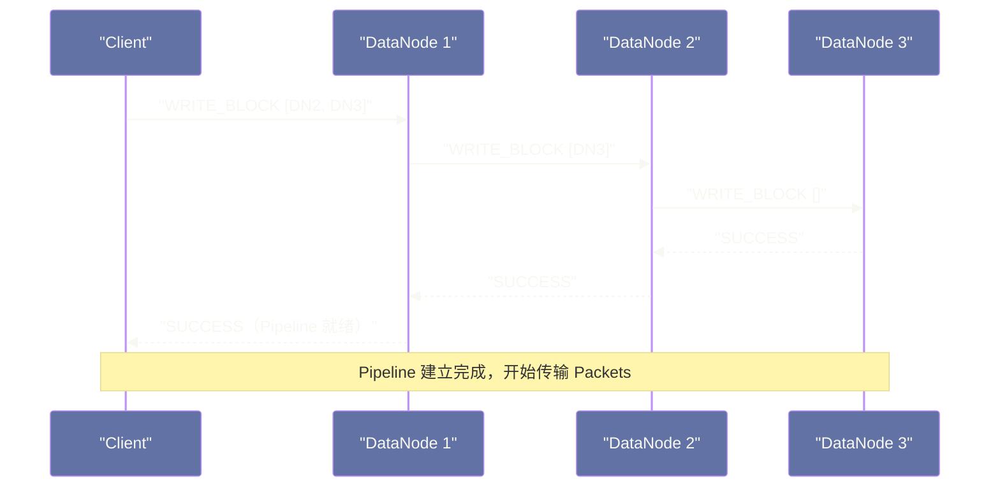
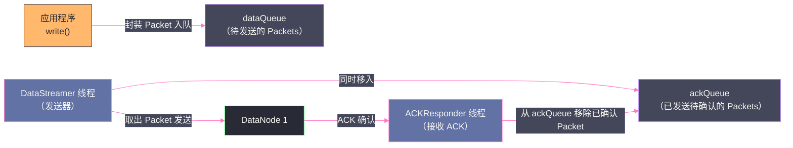

# HDFS 数据读写流程——Pipeline 写入与机架感知读取的底层路径

## 摘要

本文深度拆解 HDFS 数据读写的完整底层路径。写入侧，从 Client 调用 `create()` 开始，逐步追踪 Lease 获取、Block 分配、Pipeline 建立、Packet 构造与传输、ACK 确认、Block 完成直到 `close()` 的每个环节，重点讲清楚 Pipeline 写入为什么比"Client 分别向三个 DataNode 写"更高效、Packet 双队列机制的设计价值、以及 Pipeline 故障恢复的完整流程。读取侧，解析 `getBlockLocations` 返回的 DataNode 排序逻辑、机架感知选择策略、`DFSInputStream` 的 Block 切换机制，以及 Short-Circuit Read 的工作原理。这两条 I/O 路径是 HDFS 实现高吞吐的工程基础。

---

## 第 1 章 引言：数据 I/O 路径的设计哲学

前三篇文章建立了 HDFS 的整体认知框架：第一篇讲清了 HDFS 的设计哲学和核心假设，第二篇梳理了 NameNode/DataNode/Client 的职责分工，第三篇深入了 NameNode 的持久化机制。这些都是"控制面"的逻辑——关于元数据如何管理、如何持久化、如何恢复。

本文进入"数据面"——当 Client 真正要读写一个文件时，数据是如何从 Client 流向 DataNode（写），又如何从 DataNode 流向 Client（读）的？

HDFS 数据 I/O 路径的核心设计原则，在第二篇已经点明：**用户数据永远不流过 NameNode**。NameNode 只负责告诉 Client"数据在哪里"或"数据应该写到哪里"，实际的数据字节直接在 Client 和 DataNode 之间流动。

但仅仅知道这个原则还不够。要真正理解 HDFS 的 I/O 性能特征、故障恢复机制，以及如何在生产中调优，必须深入每一个环节的工作细节：
- Pipeline 为什么是链式的而不是并行的？
- Packet 为什么是 64KB 而不是更大或更小？
- ACK 队列和数据队列为什么要分开维护？
- 读取时选择哪个 DataNode 副本的依据是什么？

带着这些问题，我们开始拆解。

---

## 第 2 章 写文件：从 create() 到 close() 的完整链路

HDFS 的写文件流程，从应用层调用 `FileSystem.create()` 开始，到调用 `FSDataOutputStream.close()` 结束，中间经历了多个阶段。我们逐一拆解每个阶段。

### 2.1 阶段一：create() 调用与 Lease 申请

当应用程序调用：
```java
FSDataOutputStream out = fs.create(new Path("/user/alice/data.csv"));
```

底层发生了以下操作：

**Step 1：Client 向 NameNode 发起 `create` RPC 请求**

`DistributedFileSystem.create()` 底层调用 `DFSClient.create()`，向 NameNode 发送 `ClientNamenodeProtocol.create()` RPC 请求，参数包括：
- 文件路径（`/user/alice/data.csv`）
- 权限（`FsPermission`）
- 覆盖标志（`overwrite`）
- 副本数（`replication`，默认 3）
- Block 大小（`blockSize`，默认 128MB）
- Client 名称（`clientName`，格式为 `DFSClient_<UUID>`）

**Step 2：NameNode 处理 create 请求**

NameNode 收到请求后，执行以下操作：
1. 验证文件路径合法性（父目录是否存在、是否有写权限）
2. 如果文件已存在且 `overwrite=true`，先删除旧文件
3. 在 Namespace INode 树中创建新的 `INodeFile` 节点（此时文件处于 "Under Construction" 状态，Block 列表为空）
4. 在 LeaseManager 中记录 `(ClientName → FilePath)` 的 Lease 映射
5. 将 `OP_ADD` 操作记录到 EditLog

**Step 3：NameNode 返回 `HdfsFileStatus`**

NameNode 向 Client 返回文件状态信息，Client 创建 `DFSOutputStream` 对象，写文件的准备工作完成。

此时文件在 NameNode 的 INode 树中已经存在，但没有任何 Block，文件大小为 0。

> [!info] 核心概念：Under Construction 状态
> 处于 "Under Construction" 状态的文件，表示当前有 Client 正在写入它，文件的内容还不完整。其他 Client 只能读取到已完成写入并提交的 Block，无法读取当前正在写入的 Block（除非配置了 `dfs.client.read.shortcircuit.skip.checksum` 等特殊参数）。这个状态在 NameNode 的 EditLog 和 FsImage 中都有记录，确保即使 NameNode 重启也能知道哪些文件是未完成的写入。

### 2.2 阶段二：Block 申请与 Pipeline 建立

当应用程序开始调用 `out.write(bytes)` 写入数据时，底层的 `DFSOutputStream` 并不会立即发起网络请求，而是先在本地缓冲区中积累数据。当缓冲区积累到足够的数据后（一个 Packet 的大小），才开始真正的网络传输。

在第一次真正需要向 DataNode 写入数据之前，Client 需要先向 NameNode 申请一个 Block。

**`addBlock` RPC：申请新 Block**

`DFSOutputStream` 内部的 `DataStreamer` 线程向 NameNode 发起 `addBlock` RPC 请求，NameNode 返回：
- 新分配的 Block 的 `ExtendedBlock`（包含 Block ID 和 Generation Stamp）
- 存储这个 Block 的 DataNode Pipeline 列表（通常是 3 个 DataNode，按机架感知策略选择，见第 5 篇文章详解）

**建立 Pipeline TCP 连接**

`DataStreamer` 拿到 Pipeline 列表 `[DN1, DN2, DN3]` 后，向 `DN1` 建立 TCP 连接，发送 `DataTransferProtocol.Op.WRITE_BLOCK` 请求，并在请求头中携带完整的 Pipeline 列表 `[DN2, DN3]`。

`DN1` 收到 `WRITE_BLOCK` 请求后：
1. 在本地磁盘的 `rbw` 目录中创建 Block 文件和 `.meta` 文件
2. 向 `DN2` 建立 TCP 连接，发送 `WRITE_BLOCK` 请求（Pipeline 列表缩减为 `[DN3]`）
3. `DN2` 同理向 `DN3` 建立 TCP 连接

当 `DN3` 创建好本地 Block 文件后，逆向发送 `SUCCESS` 响应给 `DN2`，`DN2` 再响应给 `DN1`，`DN1` 再响应给 Client。至此，**Pipeline 建立完成**。

整个 Pipeline 建立是一个**握手链**——从前到后依次建立连接，从后到前依次确认成功，确保所有节点都准备好后才开始数据传输。



### 2.3 阶段三：Packet 构造与双队列传输机制

Pipeline 建立完成后，`DFSOutputStream` 开始把应用程序写入的数据切分成 **Packet（数据包）** 进行传输。

**Packet 的结构**

每个 Packet 的结构如下：

```
┌─────────────────────────────────────────────────────┐
│  Packet Header (25 bytes)                            │
│  ├── offsetInBlock: 该 Packet 在 Block 中的偏移量    │
│  ├── seqno: Packet 序列号（从 0 开始单调递增）        │
│  ├── lastPacketInBlock: 是否是 Block 的最后一个 Packet│
│  └── dataLen: 数据长度                               │
├─────────────────────────────────────────────────────┤
│  Checksum Data（校验和数据）                          │
│  每 512 bytes 数据对应 4 bytes CRC32 校验和           │
│  大小 = ceil(dataLen / 512) × 4 bytes               │
├─────────────────────────────────────────────────────┤
│  Data（实际数据）                                    │
│  最大 63.5KB（默认 Packet 大小 64KB - Header - CRC）  │
└─────────────────────────────────────────────────────┘
```

Packet 默认大小为 **64KB**（由 `dfs.client-write-packet-size` 控制，默认 65536 字节）。其中 Header 占 25 字节，CRC 校验和占约 512 字节，实际数据约 63.5KB。CRC 是以 **chunk**（512 字节，由 `dfs.bytes-per-checksum` 控制）为单位计算的，每个 chunk 对应一个 4 字节的 CRC32 校验值。

**双队列机制：dataQueue 与 ackQueue**

`DFSOutputStream` 内部维护两个队列，这是整个写入流程中最重要的设计之一：

- **`dataQueue`（数据队列）**：存放等待发送的 Packet。`DFSOutputStream.write()` 方法将数据封装成 Packet 放入 `dataQueue`。
- **`ackQueue`（ACK 队列）**：存放已发送但尚未收到所有副本 ACK 的 Packet。`DataStreamer` 线程从 `dataQueue` 取出 Packet 发给 DN1，同时将该 Packet 移入 `ackQueue`。

为什么需要两个队列分开管理？这个设计源于一个核心需求：**在 Pipeline 故障恢复时，能够重发未确认的 Packet**。

如果只有一个发送队列，Packet 一旦发出就从队列中移除，一旦发生 Pipeline 故障（比如 DN2 宕机），我们就不知道哪些 Packet 需要重发了。

通过将已发送但未确认的 Packet 保留在 `ackQueue` 中，当 Pipeline 出现故障时，可以：
1. 将 `ackQueue` 中所有未确认的 Packet 重新放回 `dataQueue` 头部
2. 重建 Pipeline（排除故障节点）
3. 用新 Pipeline 重新发送这些 Packet

这确保了即使在 Pipeline 故障的情况下，也不会丢失任何数据。



### 2.4 阶段四：Pipeline 数据流转与 ACK 机制

**数据在 Pipeline 中的流转**

`DataStreamer` 从 `dataQueue` 取出一个 Packet，发送给 `DN1`。`DN1` 接收到 Packet 后：
1. 将 Packet 的数据部分写入本地磁盘的 `rbw` 目录下的 Block 文件
2. 验证 Packet 中的 CRC 校验和（与数据一起传来的 checksum 数据）
3. 将 Packet 转发给 `DN2`（不等待本地写入完成——写本地磁盘和转发下游是**并行的**）

`DN2` 同样并行地写本地磁盘并转发给 `DN3`。

这个**流水线式传输**模式是关键：在 `DN1` 向 `DN2` 转发 Packet 的同时，`DN1` 自己的磁盘 I/O 也在进行；在 `DN2` 向 `DN3` 转发的同时，`DN2` 的磁盘 I/O 也在进行。三个节点的磁盘 I/O 几乎并行发生，而不是串行等待。

**逆向 ACK 机制**

`DN3` 将 Packet 写入本地磁盘后，向 `DN2` 发送 `ACK`（包含 Packet 的 `seqno` 和状态 `SUCCESS`/`ERROR`）。`DN2` 收到 `DN3` 的 ACK 后，结合自己的写入结果，向 `DN1` 发送 ACK。`DN1` 汇总后向 Client 发送 ACK。

只有 Client 的 `ACKResponder` 线程收到了包含三个 DataNode 均为 `SUCCESS` 状态的 ACK，才将对应 `seqno` 的 Packet 从 `ackQueue` 中移除，认为这个 Packet 已经成功持久化到三个副本上。

> [!info] 核心概念：为什么 Pipeline 比"Client 分别写三个 DataNode"更高效？
> 假设 Client 到每个 DataNode 的网络带宽都是 1 Gbps，写入一个 128MB 的 Block：
> - **Client 分别写三份**：Client 需要分别向 DN1、DN2、DN3 各发送 128MB。即使并行发送，Client 的上行带宽也需要达到 3 Gbps（或者串行发送需要 3 倍时间）。Client 的网络出口是瓶颈。
> - **Pipeline 写入**：Client 只向 DN1 发送 128MB，DN1 向 DN2 发送 128MB，DN2 向 DN3 发送 128MB。各段 TCP 连接充分利用各自的带宽，Client 的上行带宽只需要 1 Gbps，且三段传输几乎并行进行。
>
> Pipeline 写入的核心优势是：**将 Client 的网络出口带宽压力分散到整个 Pipeline 的每一段**，让数据传输的总时间接近于传输一份数据的时间，而不是三份数据的时间。

### 2.5 阶段五：Block 完成与下一个 Block 申请

当 `dataQueue` 中某个 Packet 的 `lastPacketInBlock` 标志为 `true`，表示当前 Block 的所有数据已经发送完毕，DataStreamer 等待所有 Packet 的 ACK 都从 `ackQueue` 中清空后，向 `DN1` 发送一个**空的"结束 Packet"（lastPacketInBlock=true, dataLen=0）**，触发各 DataNode 将 Block 从 `rbw` 目录移入 `finalized` 目录。

随后，DataStreamer 向 NameNode 发送 `blockReceived` 通知，NameNode 将这个 Block 的状态从"Under Construction"更新为"完成"，并更新 BlocksMap。

如果文件还有更多数据需要写入（超过当前 Block 的 128MB），DataStreamer 会继续向 NameNode 申请下一个 Block（`addBlock` RPC），建立新的 Pipeline，继续上述流程。

### 2.6 阶段六：close() 调用与 Lease 释放

当应用程序调用 `out.close()` 时：
1. `DFSOutputStream` 将 `dataQueue` 中剩余的所有 Packet 全部发送完毕，等待所有 ACK 返回。
2. 向 NameNode 发起 `complete` RPC 请求，通知文件写入完成。
3. NameNode 验证文件的最后一个 Block 是否满足最小副本数要求（`dfs.namenode.replication.min`，默认 1），满足后：
   - 将文件的 INode 状态从 "Under Construction" 改为 "完成"
   - 从 LeaseManager 中移除该文件的 Lease 记录
   - 将 `OP_CLOSE` 操作写入 EditLog
4. `complete` RPC 返回 `true`，`close()` 完成。

> [!warning] 生产避坑：close() 不能省略
> 在 Java 代码中，如果写入 HDFS 的 `FSDataOutputStream` 没有被 `close()`（比如程序异常退出、忘记在 `finally` 块中关闭），文件会一直处于 "Under Construction" 状态，Lease 不会被释放。其他进程无法写入这个文件，文件的内容也可能不完整。LeaseManager 的超时机制（软限制 60 秒，硬限制 60 分钟）会最终介入，但在超时之前，文件是处于不可写状态的。
>
> **最佳实践**：始终在 `try-finally` 或 `try-with-resources` 块中管理 `FSDataOutputStream`，确保即使发生异常也能正确 `close()`。

### 2.7 Pipeline 故障恢复：写入途中 DataNode 宕机

在写入过程中，如果 Pipeline 中的某个 DataNode 发生故障（网络断开、进程崩溃），Pipeline 写入会触发恢复流程：

**故障检测**：Client 的 `DataStreamer` 线程在发送 Packet 或等待 ACK 时，如果 TCP 连接超时或收到错误响应，检测到 Pipeline 故障。

**恢复流程**：

```
1. DataStreamer 将当前正在写入的 Block 标记为"恢复中"
2. 将 ackQueue 中所有未确认的 Packet 重新放回 dataQueue 头部
3. 关闭与故障节点的 TCP 连接
4. 向 NameNode 发送 updateBlockForPipeline RPC 请求：
   - NameNode 为这个 Block 生成新的 Generation Stamp（版本号递增）
   - 新的 Generation Stamp 用于区分故障前后的 Block 版本，防止旧的故障节点
     恢复后用过时的数据欺骗系统
5. 剩余健康的 DataNode（比如 DN1 和 DN3，DN2 宕机了）执行 Block 恢复：
   - 确认各自拥有的 Block 长度，统一截断到最短公共长度（防止副本数据不一致）
6. Client 用剩余的健康 DataNode（[DN1, DN3]）建立新的 Pipeline
7. 重新发送 ackQueue 中的 Packet（已经重放回 dataQueue）
8. 写入完成后，NameNode 发现这个 Block 只有 2 个副本（少于预期的 3 个）
   ReplicationMonitor 线程会调度把这个 Block 复制一份到另一台健康的 DataNode
   使副本数恢复到 3
```

> [!note] 设计哲学：Generation Stamp 防止"幽灵数据"
> Generation Stamp 是 HDFS Block 版本控制的核心机制。每次 Block 写入发生故障恢复时，NameNode 都会递增 Generation Stamp。这确保了：宕机的 DataNode 恢复后，即使它本地仍保存着这个 Block 的旧版本数据，NameNode 也能通过 Generation Stamp 识别出这是过时的副本，将其标记为无效并删除，防止旧数据污染集群的正确状态。

---

## 第 3 章 读文件：从 open() 到数据流的机架感知路径

读文件流程相对写入流程更简单，但其中的**机架感知选择策略**和**故障切换机制**同样值得深入了解。

### 3.1 阶段一：open() 与 getBlockLocations

Client 调用：
```java
FSDataInputStream in = fs.open(new Path("/user/alice/data.csv"));
```

底层，`DistributedFileSystem.open()` 调用 `DFSClient.open()`，向 NameNode 发送 `getBlockLocations` RPC 请求。

NameNode 返回 `LocatedBlocks` 对象，包含：
- 文件的总长度
- 文件所有 Block 的有序列表（每个 Block 对应一个 `LocatedBlock`）
- 每个 `LocatedBlock` 包含：Block ID、Block 大小、该 Block 所有副本的 DataNode 列表（已按距离排序）

**DataNode 列表的排序逻辑**

NameNode 返回的每个 Block 的 DataNode 列表，是按照**距离 Client 由近到远**排序的。"距离"由机架拓扑决定，按照以下优先级排序：

1. **节点本地（Node Local）**：DataNode 和 Client 在**同一台机器**上（距离 = 0）
2. **机架本地（Rack Local）**：DataNode 和 Client 在**同一机架**上（距离 = 2）
3. **跨数据中心（Off Rack）**：DataNode 和 Client 在**不同机架**上（距离 = 4）

Client 优先选择列表中的第一个（距离最近的）DataNode 读取数据。这个策略确保了**数据本地性**——运行在 DataNode 机器上的计算任务（如 Spark/MapReduce 的 Task）优先读取本机存储的副本，完全不需要网络传输。

> [!info] 核心概念：距离计算的实质
> HDFS 的"距离"实际上是机架拓扑树上两个节点之间的路径长度（以步数计）：
> - 同一节点：路径长度 = 0（自身）
> - 同一机架不同节点：路径长度 = 2（上到机架交换机，下到目标节点）
> - 不同机架：路径长度 = 4（上到机架交换机，到核心交换机，下到目标机架，到目标节点）
>
> 这个"距离"概念不是物理距离，而是网络拓扑距离的抽象，用于量化"读取某个副本需要经过多少跳网络设备"。

`getBlockLocations` RPC 请求默认一次最多返回 10 个 Block 的位置信息（`dfs.client.read.prefetch.size` 控制，单位是字节，默认 `10 × dfs.blocksize`）。对于大文件（比如 1000 个 Block），Client 会分批次向 NameNode 请求 Block 位置信息，每读取几个 Block 就预取下一批的位置，避免读取时的阻塞等待。

### 3.2 阶段二：DFSInputStream 的流式读取

`DFSClient.open()` 返回一个 `DFSInputStream` 对象（包装在 `FSDataInputStream` 中）。

当应用程序调用 `in.read(buffer)` 时，`DFSInputStream` 按以下逻辑进行读取：

**定位当前读取位置对应的 Block**

根据当前读取偏移量（`pos`），计算出对应的是文件的第几个 Block，以及在该 Block 内的偏移量（`pos % blockSize`）。

**建立到最优 DataNode 的 TCP 连接**

选择该 Block 位置列表中距离最近的 DataNode，建立 TCP 连接，发送 `DataTransferProtocol.Op.READ_BLOCK` 请求，参数包括：
- Block ID 和 Generation Stamp
- 读取的起始偏移量（在 Block 内的偏移）
- 读取的长度

**流式接收数据**

DataNode 收到 `READ_BLOCK` 请求后，从本地磁盘的 `finalized` 目录找到对应的 Block 文件，按请求的偏移量和长度读取数据，以 Packet（包含数据 + CRC 校验和）的形式流式发送给 Client。

Client 的 `DFSInputStream` 接收 Packet，验证 CRC 校验和，将数据复制到应用层的 `buffer` 中。

**跨 Block 边界的自动切换**

当一个 Block 读取完毕，`DFSInputStream` 自动切换到下一个 Block：关闭当前 DataNode 的 TCP 连接，为下一个 Block 选择最优 DataNode，建立新的 TCP 连接，继续读取。这个切换过程对应用程序完全透明，应用程序感知到的是一个连续的字节流。

### 3.3 读取时的容错：副本切换

如果 Client 在读取某个 Block 时遇到以下情况：
- **DataNode 连接失败**（TCP 连接超时或被拒绝）
- **数据 CRC 校验失败**（DataNode 返回的数据与校验和不匹配，说明这个副本数据已损坏）

`DFSInputStream` 会自动执行**副本切换**：
1. 将故障的 DataNode 加入到本次读取的"黑名单"（`deadNodes`），避免后续 Block 继续尝试这个节点。
2. 如果是 CRC 校验失败，还会通知 NameNode 这个副本已损坏（`reportBadBlocks` RPC），NameNode 将其标记为 `corruptReplicas`，后续会从健康副本重新复制。
3. 从当前 Block 的其他副本所在的 DataNode 中，选择距离最近的重新发起读取请求。

这个容错切换对应用层完全透明，应用程序收到的是连续的、正确的数据字节流，感知不到底层发生了副本切换。

### 3.4 Short-Circuit Read：绕过网络的本地优化

在 Spark 或 MapReduce 等计算框架中，计算 Task 通常运行在与 DataNode 相同的机器上。此时，读取 DataNode 上存储的 Block 数据，最高效的方式不是通过 TCP 网络协议（DataNode 进程 → 网络协议栈 → Client 进程），而是直接读取 DataNode 本地磁盘上的 Block 文件。

这个"绕过网络直接读本地磁盘"的机制叫做 **Short-Circuit Read（短路读取）**，需要以下配置才能启用：

```xml
<!-- dfs-site.xml -->
<property>
  <name>dfs.client.read.shortcircuit</name>
  <value>true</value>
</property>
<property>
  <name>dfs.domain.socket.path</name>
  <value>/var/run/hadoop-hdfs/dn._PORT</value>
</property>
```

**Short-Circuit Read 的工作机制**

当 Client 检测到目标 DataNode 与自己在同一台机器上（通过比较 hostname），会尝试 Short-Circuit 读取：

1. Client 通过 **Unix Domain Socket**（比 TCP 更轻量的本地 IPC 机制）向 DataNode 发送请求，要求直接访问 Block 文件。
2. DataNode 验证 Client 的权限，通过后，向 Client 传递该 Block 文件和 `.meta` 文件的**文件描述符（File Descriptor）**（通过 Unix Domain Socket 传递 fd 是 Linux 的特性）。
3. Client 拿到文件描述符后，直接通过 `read()` 系统调用读取 Block 文件，完全不经过 DataNode 的网络协议栈。

**Short-Circuit Read 的性能提升**

以读取一个 128MB Block 为例：
- **普通读取（via TCP）**：数据经过 DataNode 进程 → 操作系统 TCP 栈 → Client 进程，至少两次数据拷贝（DataNode 读磁盘到用户空间，DataNode 用户空间到 TCP 缓冲区，TCP 缓冲区到 Client 用户空间），延迟和 CPU 开销较高。
- **Short-Circuit Read**：Client 直接读取 DataNode 本地磁盘，仅一次磁盘到用户空间的数据拷贝，完全避免了网络协议栈的开销，读取速度接近本地磁盘读取速度。

在数据本地性好的 Spark 集群中，启用 Short-Circuit Read 可以将读取性能提升 20%~50%，CPU 使用率也会有所降低（减少了网络协议栈的 CPU 开销）。

> [!warning] 生产避坑：Short-Circuit Read 需要 DataNode 与 Client 同机器
> Short-Circuit Read 只有在 Client 进程与 DataNode 进程运行在**同一台物理机或虚拟机**上时才生效。在存算分离的架构（计算集群与 HDFS 集群分开部署）中，Short-Circuit Read 完全无法发挥作用。这是存算分离相比存算一体（Hadoop 传统架构）的一个性能劣势——存算分离无法享受 Short-Circuit Read 带来的本地读取加速。

---

## 第 4 章 读写流程的关键参数调优

理解了读写流程的底层机制，在生产调优时就能有针对性地调整相关参数：

### 4.1 写入相关参数

| 参数 | 默认值 | 说明 | 调优建议 |
|---|---|---|---|
| `dfs.client-write-packet-size` | 65536 (64KB) | Packet 大小 | 高吞吐场景可适当增大到 128KB~256KB，减少 Packet 数量和 ACK 开销 |
| `dfs.replication` | 3 | 默认副本数 | 冷数据可降为 2，热数据保持 3；EC（纠删码）数据可以进一步降低存储开销 |
| `dfs.blocksize` | 134217728 (128MB) | Block 大小 | 大文件密集型场景可增大到 256MB 或 512MB，减少 NameNode 元数据压力；小文件场景保持默认 |
| `dfs.namenode.replication.min` | 1 | 最小副本数（close() 时需满足）| 不建议增大，否则在 DataNode 较少时 close() 会超时等待 |

### 4.2 读取相关参数

| 参数 | 默认值 | 说明 | 调优建议 |
|---|---|---|---|
| `dfs.client.read.shortcircuit` | false | 是否启用 Short-Circuit Read | 存算一体集群**强烈建议**开启 |
| `dfs.client.read.prefetch.size` | 1280MB | 预取 Block 位置信息的大小 | 顺序读大文件场景适当增大，减少与 NameNode 的 RPC 次数 |
| `dfs.client.socket-timeout` | 60000 (60s) | 读取 DataNode 时的 TCP 超时 | 网络质量差的环境可适当增大，但过大会导致故障切换变慢 |
| `dfs.datanode.socket.write.timeout` | 480000ms | DataNode 写入超时 | 写入大文件时，如果 Pipeline 某节点磁盘慢，可适当增大 |

### 4.3 Lease 相关参数

| 参数 | 默认值 | 说明 |
|---|---|---|
| `dfs.client.file-block-storage-locations.timeout.millis` | 1000ms | 获取 Block 位置的超时 |
| `dfs.namenode.lease-recheck-interval-ms` | 2000ms | NameNode 检查 Lease 软限制的间隔 |
| `dfs.namenode.soft-lease-limit-ms` | 60000ms (60s) | Lease 软限制时间（超过后允许其他 Client 恢复文件）|
| `dfs.namenode.hard-lease-limit-ms` | 3600000ms (60min) | Lease 硬限制时间（超过后 NameNode 强制回收 Lease）|

---

## 第 5 章 读写流程在不同访问模式下的表现

### 5.1 顺序读：HDFS 的强项

顺序读是 HDFS 最优化的场景。Client 从文件头部开始，按 Block 顺序依次读取到文件末尾：
- 每个 Block 的读取都是一次 TCP 长连接上的流式传输，带宽利用率高
- `getBlockLocations` 的分批预取减少了与 NameNode 的 RPC 次数
- 配合 Short-Circuit Read，本地副本的读取速度接近磁盘物理带宽
- 多个 DataNode 并行服务（不同 Block 读自不同 DataNode），聚合读带宽随节点数线性增长

**典型吞吐量**：在配备 SATA HDD 的标准节点上，单 Client 顺序读 HDFS 大文件的吞吐量通常在 80~120 MB/s，接近单块 HDD 的顺序读速率上限。

### 5.2 随机读：HDFS 的弱项

如果 Client 频繁使用 `in.seek(position)` 跳转到文件任意偏移量进行读取，HDFS 的性能会显著下降：
- 每次 seek 到一个新的 Block，都需要重新建立 TCP 连接（连接建立有几十毫秒延迟）
- 如果 seek 频繁且跨 Block，NameNode 的 `getBlockLocations` RPC 调用也会增多
- HDD 的随机读本身延迟就很高（5~10ms 寻道时间）

这正是第一篇文章中分析的 HDFS 设计取舍：为了高吞吐顺序读，牺牲了随机读性能。如果业务需要高性能随机读，应该使用 [[HBase]]（构建在 HDFS 之上，但通过 [[HFile]] 索引和 BlockCache 实现了高效随机读）或 [[Apache Parquet]] 格式（列式存储，支持谓词下推减少不必要的数据读取）。

### 5.3 并发写多个文件：HDFS 的高效场景

HDFS 虽然不支持多 Client 并发写同一个文件，但完全支持多 Client 并发写**不同的文件**。每个写入 Client 独占自己文件的 Lease 和 Pipeline，互不干扰。

在 Spark Streaming 向 HDFS 写出结果、Hive 的多个 Reducer 并行写入 Output 等场景下，HDFS 的并发写性能通常不是瓶颈——真正的瓶颈往往是 DataNode 的磁盘 I/O 带宽，而多块磁盘配置的 DataNode 可以提供足够的聚合写带宽。

---

## 第 6 章 小结：I/O 路径的工程逻辑

本文拆解了 HDFS 读写 I/O 路径的每一个关键环节：

**写入侧的三个核心设计**：
- **Pipeline 链式写入**：将 Client 的网络出口压力分散到 Pipeline 各段，写三副本的时间接近写一副本
- **双队列机制（dataQueue + ackQueue）**：为 Pipeline 故障恢复提供了"可重发的 Packet 缓冲区"
- **Generation Stamp**：Block 的版本号机制，防止故障恢复后旧副本污染数据

**读取侧的三个核心设计**：
- **机架感知排序**：NameNode 返回的 DataNode 列表按拓扑距离排序，确保优先本地读取
- **DFSInputStream 透明切换**：跨 Block 和副本切换对应用层完全透明，提供连续字节流抽象
- **Short-Circuit Read**：存算一体架构下的本地读取优化，避免网络协议栈开销

下一篇文章，我们将深入 HDFS 副本放置策略——NameNode 在 `addBlock` 时如何选择 3 个 DataNode 构成 Pipeline、默认的三副本放置算法背后的可靠性与带宽权衡，以及如何通过自定义 `BlockPlacementPolicy` 满足特殊需求。

---

> [!note] 思考题
> 1. HDFS 写入使用双队列（DataQueue 和 AckQueue）来实现流水线传输——DataQueue 中的 Packet 被发送给 DataNode 后进入 AckQueue 等待确认，收到确认后才从 AckQueue 移除。这个设计允许 Client 在等待 ACK 的同时继续发送新数据，提升吞吐量。如果 DataNode 返回的 ACK 中包含错误（表示某个 Block 写入失败），Client 会如何处理 AckQueue 中已发送但未确认的 Packet？
> 2. HDFS 的租约（Lease）机制保证同一时刻只有一个 Writer 对一个文件进行写入。租约需要 Client 定期向 NameNode 续约（默认 60 秒）。如果 Writer 进程崩溃而没有正常关闭文件，NameNode 会在租约超时后（`dfs.namenode.lease-recheck-interval`）强制收回租约。在 Writer 崩溃到租约超时这段时间内，其他进程尝试打开同一文件写入会得到什么错误？有没有办法提前强制收回租约？
> 3. HDFS 读取时，Client 会优先读取本地 DataNode（`DFS_CLIENT_READ_SHORTCIRCUIT`，短路读取），完全绕过网络栈，通过本地文件系统直接读取 DataNode 的 Block 文件。这个优化对读取吞吐量有多大提升？短路读取依赖 Unix Domain Socket，在 Docker 容器化环境下，如何正确配置短路读取使其在容器中也能生效？

## 参考资料

- Apache Hadoop 官方文档：[HDFS Architecture - Data Replication](https://hadoop.apache.org/docs/current/hadoop-project-dist/hadoop-hdfs/HdfsDesign.html#Data_Replication)
- Apache Hadoop 官方文档：[Short-Circuit Local Reads](https://hadoop.apache.org/docs/current/hadoop-project-dist/hadoop-hdfs/ShortCircuitLocalReads.html)
- Apache Hadoop 源码：`org.apache.hadoop.hdfs.DFSOutputStream`、`DataStreamer`、`DFSInputStream`
- SegmentFault：[HDFS 读写流程译文](https://segmentfault.com/a/1190000020335137)
