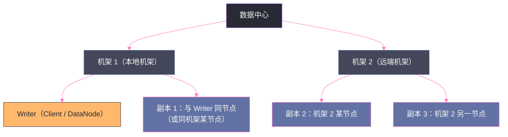

# HDFS 副本放置策略——机架感知与数据可靠性的工程权衡

## 摘要

本文深度解析 HDFS 副本放置策略的设计逻辑。当 Client 申请写入一个新 Block 时，NameNode 需要为这个 Block 的三个副本选择合适的 DataNode——这个看似简单的选择，背后是对**数据可靠性**、**写入带宽消耗**、**读取本地性**三者之间精心设计的权衡。文章从"如果不考虑机架，最朴素的策略是什么、有什么问题"出发，逐步推导出 HDFS 默认三副本放置算法（`BlockPlacementPolicyDefault`）的每一个设计决策，并深入分析机架感知配置、存储策略（Storage Policy）、以及不同业务场景下如何定制副本放置行为。

---

## 第 1 章 引言：一个看似简单的问题

当 Client 向 NameNode 申请一个新的 Block 时，NameNode 需要回答一个问题：**这个 Block 的三个副本，应该放在哪三台 DataNode 上？**

如果不假思索地回答，可能是："随便选三台空闲的 DataNode"——剩余空间最多的三台，或者负载最低的三台。这个答案在小集群（比如 5 台机器）里可能凑合，但在一个生产级别的 HDFS 集群（几十到几百台节点，分布在多个机架上）里，它会带来严重的问题。

问题一：**可靠性不足**。如果随机选出的三台 DataNode 恰好都在同一个机架上，那么这个机架的交换机发生故障时，这个 Block 的三个副本会同时不可访问，数据实际上只有"一份"——相当于没有冗余。

问题二：**写入带宽浪费**。Pipeline 写入时，Client → DN1 → DN2 → DN3 的数据流需要经过网络传输。如果三台 DataNode 分散在三个不同的机架，数据需要穿越两次机架间的核心交换机，消耗大量跨机架带宽，而跨机架带宽通常是集群网络中最稀缺的资源。

问题三：**读取本地性丢失**。如果一个 Block 的三个副本都在与 Client 不同的机架上，Client 读取时就无法实现本地读（node local）或机架本地读（rack local），每次读取都需要跨机架，消耗额外的网络带宽和延迟。

HDFS 的默认副本放置策略，就是在这三个目标之间寻找最优平衡点的工程答案。

---

## 第 2 章 机架感知的基础：集群拓扑是怎么建立的

在理解副本放置算法之前，必须先理解 NameNode 是如何感知集群机架拓扑的——它的信息来源是什么，精度如何，以及这个信息的局限性在哪里。

### 2.1 NetworkTopology：NameNode 眼中的集群地图

在第二篇文章中，我们介绍了 NameNode 内存中的 `NetworkTopology` 数据结构——一棵代表整个数据中心拓扑的树：

```
/          ← 根节点（数据中心）
├── /rack1  ← 机架 1
│   ├── /rack1/node1  ← DataNode 1
│   ├── /rack1/node2  ← DataNode 2
│   └── /rack1/node3  ← DataNode 3
└── /rack2  ← 机架 2
    ├── /rack2/node4  ← DataNode 4
    ├── /rack2/node5  ← DataNode 5
    └── /rack2/node6  ← DataNode 6
```

这棵树的**叶子节点**是每台 DataNode，**内部节点**是机架（Rack）或更高层级的网络设备（在支持多层拓扑的配置下，还可以有 Row、Pod、数据中心层级）。

### 2.2 机架感知脚本：拓扑信息的来源

NameNode 自己并不知道哪台 DataNode 在哪个机架上——这个信息必须由管理员通过**机架感知脚本（Rack Awareness Script）**提供。

配置方式是在 `core-site.xml` 中指定脚本路径：
```xml
<property>
  <name>net.topology.script.file.name</name>
  <value>/etc/hadoop/rack_topology.sh</value>
</property>
```

当一台 DataNode 向 NameNode 注册时，NameNode 会调用这个脚本，将 DataNode 的 IP 地址作为参数传入，脚本返回该 DataNode 所在的机架路径（如 `/rack1`）。NameNode 据此将 DataNode 插入 `NetworkTopology` 树的对应位置。

一个典型的机架感知脚本内容大致如下：

```bash
#!/bin/bash
# 根据 IP 地址返回机架路径
case $1 in
  10.0.1.*) echo "/rack1" ;;
  10.0.2.*) echo "/rack2" ;;
  10.0.3.*) echo "/rack3" ;;
  *) echo "/default-rack" ;;
esac
```

**如果没有配置机架感知脚本会怎样？**

如果没有配置脚本（或脚本返回值不合法），NameNode 会把所有 DataNode 都放入 `/default-rack` 这个默认机架中。这意味着 NameNode 认为所有 DataNode 都在同一个机架上，副本放置策略会退化为"全部在同一机架"的模式，完全失去了跨机架保护能力。

> [!warning] 生产避坑：机架感知配置是 HDFS 集群部署的必做项
> 很多小型集群或快速搭建的测试集群会忽略机架感知配置，导致所有节点都在 `/default-rack`。在这种情况下，即使配置了三副本，当某台核心交换机或整个机柜的电源故障时，三个副本可能同时不可访问。对于生产集群，**机架感知配置是可靠性的基础，必须在集群建立初期就配置正确**。

### 2.3 机架感知的粒度与局限

标准的机架感知是**两层拓扑**（机架 + 节点），对于小型到中型集群（几十到几百台节点）已经足够。但大型数据中心可能有更复杂的网络拓扑：

- **Row（行）**：多个相邻机架构成一行，共享一台汇聚交换机
- **Pod**：多个 Row 构成一个 Pod，共享一台核心交换机
- **数据中心（DC）**：多个 Pod 跨数据中心连接

HDFS 的 `NetworkTopology` 实现支持多层拓扑（通过 `NetworkTopologyWithNodeGroup` 扩展类），可以配置更细粒度的拓扑感知，但实际生产中使用两层拓扑已经能满足绝大多数需求。

---

## 第 3 章 默认三副本放置算法：`BlockPlacementPolicyDefault`

HDFS 默认的副本放置策略实现在 `BlockPlacementPolicyDefault` 类中。这是 NameNode 在 `addBlock` RPC 中调用的核心逻辑，每次为一个新 Block 的三个副本选择 DataNode。

### 3.1 算法全景

默认三副本放置算法的规则可以用一句话概括：

> **第一副本放在与 Writer（写入 Client）相同节点或相同机架的节点上；第二副本放在与第一副本不同的机架上；第三副本放在与第二副本相同的机架但不同的节点上。**

用图示表达：



### 3.2 逐副本推导：每个决策的工程逻辑

**副本 1：本地优先**

第一副本的选择规则：
- 如果 Writer 是运行在某台 DataNode 上的进程（例如 MapReduce 的 Reduce Task 直接写出到 HDFS），则第一副本优先放在**这台 DataNode 上**（`Node Local`），本地写入，零网络传输。
- 如果 Writer 是一个普通 Client 进程（不在任何 DataNode 上），则第一副本放在**随机选择的某台 DataNode**上。

这个设计的逻辑是：对于在 DataNode 机器上运行的计算任务，写出的第一副本直接存在本地，Pipeline 的第一跳（Client → DN1）是本地写入，不消耗网络带宽，并且这份本地副本未来被这个任务（或同机器的其他任务）读取时可以实现 Short-Circuit 本地读，最大化数据本地性。

**副本 2：跨机架保护**

第二副本放在与第一副本**不同的机架**上（随机选择该机架上的某台节点）。

为什么跨机架？这是可靠性设计的核心。**单机架故障（机架交换机宕机、机架断电、机柜火灾）是现实中发生频率最高的多节点故障模式**。如果三个副本都在同一个机架，一次机架级别的故障就会让这个 Block 的数据完全不可访问。

通过将第二副本放在不同机架，保证了即使整个机架 1 发生故障，机架 2 上仍有副本，数据不丢失且仍可访问。

代价是：副本 1 → 副本 2 的 Pipeline 复制需要跨机架传输，消耗跨机架带宽（通常是集群最稀缺的网络资源）。

**副本 3：同机架不同节点**

第三副本放在与第二副本**相同机架但不同节点**上（即机架 2 的另一台 DataNode）。

这个选择的逻辑是：
1. **可靠性要求已满足**：三个副本分布在两个不同机架（机架 1 一个，机架 2 两个），即使机架 1 完全故障，机架 2 上仍有两个副本，Block 数据安全。
2. **避免进一步消耗跨机架带宽**：如果把第三副本也放在第三个机架，需要再多一次跨机架传输（DN2 → DN3 跨机架），消耗更多的核心带宽。将第三副本放在机架 2 的另一节点，DN2 → DN3 是机架内传输，消耗的是机架内带宽（通常比核心带宽充裕得多）。
3. **读取负载均衡**：机架 2 有两个副本，意味着机架 2 的 Client 可以在两个 DataNode 之间分散读取负载。

**这个策略的整体权衡总结**：

| 可靠性维度 | 效果 |
|---|---|
| 单节点故障 | 安全（还有 2 个副本在其他节点）|
| 机架 1 整体故障 | 安全（机架 2 有 2 个副本）|
| 机架 2 整体故障 | 安全（机架 1 有 1 个副本）|
| 机架 1 + 机架 2 同时故障 | 数据丢失（需要至少 3 个机架才能完全防御两机架同时故障）|

| 性能维度 | 效果 |
|---|---|
| Pipeline 写入网络开销 | 1 次跨机架传输（DN1→DN2），1 次机架内传输（DN2→DN3）|
| 本地读取优化 | 机架 1 的 Client 可以本地读（副本 1）；机架 2 的 Client 可以机架内读（副本 2 或 3）|
| 读负载分散 | 机架 2 有 2 个副本可分散读压力 |

### 3.3 DataNode 的筛选条件：并非所有节点都可选

选择 DataNode 时，除了机架拓扑规则，还要满足以下筛选条件：

**存储空间充足**：DataNode 的剩余空间必须大于所需写入的 Block 大小，防止写入时磁盘空间不足导致 Block 写入失败。

**排除已在 Pipeline 中的节点**：已经选入 Pipeline 的 DataNode 不能重复选（同一个 Block 的三个副本不能在同一节点上）。

**排除宕机或不健康的节点**：NameNode 不会选择心跳超时（认为已宕机）或处于 Decommission 状态的 DataNode。

**写入负载均衡**：DataNode 当前正在处理的 Pipeline 写入连接数（xmit bandwidth）不能超过阈值，防止某个节点被过度写入。

**排除"不稳定"的节点**：如果某个 DataNode 在最近一段时间内频繁报错（Block 写入失败、磁盘 I/O 错误），它会被临时加入"排除列表"，暂时不参与新 Block 的副本放置。

### 3.4 当条件不满足时的降级处理

在某些情况下，默认的放置策略可能无法完全满足（例如整个集群只有一个机架，或某个机架上没有足够的健康 DataNode），此时算法会降级处理：

- 如果找不到满足跨机架条件的第二副本候选，就退而求其次，在同机架但不同节点中选。
- 如果整个集群只有两台健康 DataNode（极端情况），副本数会自动降为 2（受 `dfs.namenode.replication.min=1` 保护，文件仍可写入）。
- 如果无法满足任何副本放置（集群所有 DataNode 都不可用），`addBlock` RPC 会失败，Client 写入报错。

> [!note] 设计哲学：最优策略 vs. 可用策略
> HDFS 的副本放置算法采用"尽力而为（Best Effort）"的原则：它尽量满足跨机架分散、负载均衡等优化条件，但当条件不可满足时，会选择降级满足，而不是直接失败。这体现了"优先保证可用性，在可用的前提下追求最优"的工程哲学。

---

## 第 4 章 机架感知对可靠性的定量分析

### 4.1 三副本两机架策略的理论可靠性

以一个典型生产集群为例：100 台 DataNode，分布在 10 个机架上，每机架 10 台节点，默认三副本两机架策略。

假设每台 DataNode 的年故障率（AFR，Annual Failure Rate）为 5%，每台机架交换机的年故障率为 1%。

**单节点故障导致 Block 不可读的概率**：
- Block 三个副本全部失效所需的条件：三台 DataNode 同时故障（且在修复前没有再复制触发）
- 对于三副本策略，HDFS 在检测到副本不足后（心跳超时约 10 分钟 + ReplicationMonitor 调度），会快速触发再复制（通常在几十分钟内完成）
- 实际上，数据丢失的主要风险来自**修复窗口期内的连续故障**，而不是稳态故障概率

**机架级别故障的影响**：
- 三副本两机架策略：机架 1 故障时，机架 1 上的副本 1 不可用，机架 2 上副本 2、3 仍可用，Block 可读（HDFS 继续服务，副本数从 3 降到 2，触发再复制）
- 机架 1 + 机架 2 同时故障：Block 完全不可读，数据实际丢失（如果没有及时再复制）

**改进方向**：如果要进一步提高可靠性，可以使用**三机架放置策略**：三个副本分别放在三个不同机架，任何一个机架故障都不影响 Block 的可用性。代价是 Pipeline 写入需要两次跨机架传输（DN1→DN2 跨机架，DN2→DN3 再跨机架），写入带宽消耗更高。

| 策略 | 单机架故障 | 双机架同时故障 | Pipeline 跨机架传输次数 |
|---|---|---|---|
| 三副本同一机架 | Block 完全不可用 | Block 完全不可用 | 0（全机架内）|
| 三副本两机架（默认） | Block 可用（2 副本存活）| Block 完全不可用 | 1 次 |
| 三副本三机架 | Block 可用（2 副本存活）| Block 可用（1 副本存活）| 2 次 |

### 4.2 副本数的工程权衡

**三副本是最优解吗？**

对于大多数生产数据，三副本是可靠性与存储成本之间的合理平衡：
- 三副本的存储开销：原始数据量的 3 倍（200% 额外开销）
- 任意两台节点同时故障都不会丢失数据（满足大多数生产 SLA）

**降低副本数的场景（2 副本或纠删码 EC）**：
- **冷数据/归档数据**：访问频率极低的历史数据，可以将副本数调整为 2，节省 33% 的存储成本，或使用纠删码（EC）将存储开销降至 50%
- **中间结果数据**：Spark/MapReduce 的中间计算结果，即使丢失也可以重新计算，可以使用 1 副本（极端情况）

**增加副本数的场景（4 副本或更多）**：
- **热点数据**：被大量 Client 高频读取的数据（如共享的参数文件、字典表），增加副本数可以分散读取负载，减少每个副本所在 DataNode 的带宽压力
- **关键业务数据**：对可靠性要求极高的数据，可以配置 4 或 5 副本，但存储成本相应增加

---

## 第 5 章 存储策略（Storage Policy）：SSD/HDD/RAM 的差异化管理

Hadoop 2.6+ 引入了 **HDFS 存储策略（Storage Policy）** 功能，允许为不同的文件或目录配置不同的存储介质偏好（SSD、HDD、RAM_DISK、ARCHIVE），以实现分层存储。

### 5.1 存储介质类型

HDFS 支持以下几种存储介质类型（`StorageType`）：

| 类型 | 说明 | 典型用途 |
|---|---|---|
| `DISK` | 普通 HDD 磁盘（默认）| 大多数 HDFS 数据 |
| `SSD` | 固态硬盘 | 热点数据、需要低延迟读取的数据 |
| `ARCHIVE` | 大容量低速磁盘（如 JBOD）| 冷数据归档，极低成本存储 |
| `RAM_DISK` | 内存磁盘 | 极热数据（如实时流处理中间结果），牺牲持久性换极低延迟 |

### 5.2 内置的六种存储策略

HDFS 内置了 6 种预定义的存储策略：

| 策略 ID | 策略名称 | 副本分布 | 适用场景 |
|---|---|---|---|
| 15 | `HOT`（热数据，默认）| 全部 DISK | 正常生产数据 |
| 12 | `WARM`（温数据）| 1 副本 DISK + 2 副本 ARCHIVE | 访问频率适中的数据 |
| 2 | `COLD`（冷数据）| 全部 ARCHIVE | 低频访问的归档数据 |
| 16 | `ALL_SSD`（全 SSD）| 全部 SSD | 需要高 I/O 性能的热点数据 |
| 10 | `ONE_SSD`（一副本 SSD）| 1 副本 SSD + 2 副本 DISK | 兼顾性能与成本 |
| 5 | `LAZY_PERSIST`（懒持久化）| 1 副本 RAM_DISK + 1 副本 DISK | 临时/中间结果数据 |

### 5.3 存储策略的配置方式

可以通过 HDFS Shell 命令为目录或文件设置存储策略：

```bash
# 查看当前存储策略
hdfs storagepolicies -listPolicies

# 为目录设置存储策略（冷数据使用 ARCHIVE）
hdfs storagepolicies -setStoragePolicy -path /data/archive -policy COLD

# 触发文件按新策略迁移（Mover 工具）
hdfs mover -p /data/archive
```

> [!info] 核心概念：Mover 工具
> 存储策略的变更不会自动触发数据迁移——已有 Block 不会立即移到新的存储介质上。需要手动运行 **HDFS Mover** 工具，它会扫描路径下的所有 Block，检查其当前存储位置是否符合策略要求，不符合的 Block 会被调度复制到正确的存储介质上，旧副本删除。Mover 工具类似于 HDFS Balancer（数据均衡器），属于低优先级后台任务，不影响集群正常 I/O。

---

## 第 6 章 自定义副本放置策略

在某些特殊业务场景下，HDFS 默认的三副本两机架策略不能满足需求，需要自定义副本放置逻辑。

### 6.1 何时需要自定义

**场景一：多数据中心副本**

企业有两个物理数据中心（DC），需要确保 HDFS 数据在两个 DC 都有副本，以实现数据中心级别的容灾。默认策略无法保证副本跨数据中心分布。

自定义策略：扩展三层拓扑（DC → Rack → Node），在副本选择时强制要求至少一个副本在 DC1、至少一个副本在 DC2。

**场景二：优先将副本放在特定节点组**

某些数据集需要优先被特定的计算服务（如机器学习训练集群）访问，希望这些数据的副本优先放在训练集群所在的机架上，以最大化数据本地性。

**场景三：SSD 优先策略**

对于延迟敏感的数据，希望所有副本都优先放在 SSD DataNode 上，只有在 SSD 不足时才降级到 HDD。

### 6.2 自定义策略的实现方式

通过继承 `BlockPlacementPolicy` 抽象类并重写 `chooseTargets()` 方法，可以实现自定义副本放置逻辑：

```java
// 关键源码骨架（仅展示接口，不涉及完整实现）
public abstract class BlockPlacementPolicy {
    
    /**
     * 核心方法：为一个 Block 选择目标 DataNode 列表
     * 
     * @param srcPath    文件路径（可用于区分不同路径的策略）
     * @param numOfReplicas 需要的副本数
     * @param writer     Writer 节点（Client 所在 DataNode，可能为 null）
     * @param chosenNodes 已选择的节点（避免重复选择）
     * @param returnChosenNodes 是否在返回结果中包含已选节点
     * @param excludedNodes  排除的节点集合（故障节点、已有副本的节点等）
     * @param blocksize  Block 大小（用于检查 DataNode 空间是否足够）
     * @return 选中的 DataNode 列表
     */
    public abstract DatanodeStorageInfo[] chooseTarget(
        String srcPath,
        int numOfReplicas,
        Node writer,
        List<DatanodeStorageInfo> chosenNodes,
        boolean returnChosenNodes,
        Set<Node> excludedNodes,
        long blocksize,
        BlockStoragePolicy storagePolicy,
        EnumSet<AddBlockFlag> flags);
}
```

在 `hdfs-site.xml` 中配置自定义策略类：
```xml
<property>
  <name>dfs.block.replicator.classname</name>
  <value>com.example.MyCustomBlockPlacementPolicy</value>
</property>
```

### 6.3 `AvailableSpaceBlockPlacementPolicy`：空间感知的改进策略

Hadoop 社区提供了一个现成的改进策略 `AvailableSpaceBlockPlacementPolicy`，在默认策略的基础上增加了**磁盘空间均衡**的考虑：

在默认策略中，只要一台 DataNode 剩余空间大于 Block 大小，它就可能被选中。这导致在某些情况下，剩余空间较多的 DataNode 不会被优先选中（因为随机选择），导致集群空间分布不均衡，部分 DataNode 磁盘接近满载而其他 DataNode 大量空闲。

`AvailableSpaceBlockPlacementPolicy` 在随机选择候选节点时，**按照剩余空间比例加权**，使剩余空间越多的 DataNode 被选中的概率越高，从而在写入过程中动态平衡各节点的磁盘使用率。

配置方式：
```xml
<property>
  <name>dfs.block.replicator.classname</name>
  <value>org.apache.hadoop.hdfs.server.blockmanagement.AvailableSpaceBlockPlacementPolicy</value>
</property>
<property>
  <name>dfs.namenode.available-space-block-placement-policy.balanced-space-preference-fraction</name>
  <value>0.6</value>
  <!-- 0.6 表示 60% 的概率选择剩余空间更多的节点 -->
</property>
```

---

## 第 7 章 副本放置与 HDFS Balancer 的关系

副本放置策略决定了**新 Block 的分布**，但随着集群的运行，以下情况会导致 Block 分布逐渐不均衡：

- **节点扩容**：新加入的 DataNode 没有历史数据，磁盘使用率远低于老节点
- **节点故障恢复**：DataNode 宕机后再次上线，已有 Block 不会自动回流
- **副本数调整**：某个文件的副本数从 3 调整到 2，导致部分节点上有多余副本被删除，空间分布发生变化

**HDFS Balancer** 是解决这个问题的工具：它定期扫描集群中所有 DataNode 的磁盘使用率，找出磁盘使用率高于平均值（超过阈值 `dfs.datanode.balance.bandwidthPerSec`）的"过载节点"和低于平均值的"欠载节点"，将过载节点上的部分 Block 副本迁移到欠载节点，恢复集群的磁盘使用均衡。

> [!warning] 生产避坑：Balancer 的带宽限制
> HDFS Balancer 在执行 Block 迁移时会消耗网络带宽。如果不加限制运行，可能影响正常的业务 I/O。生产环境中应当为 Balancer 配置带宽上限：
> ```bash
> # 限制 Balancer 使用 100MB/s 带宽
> hdfs dfsadmin -setBalancerBandwidth 104857600
> # 或在启动 Balancer 时通过参数指定
> hdfs balancer -bandwidth 104857600 -threshold 10
> ```
> `-threshold 10` 表示：当节点磁盘使用率偏差超过 10% 时才触发均衡，避免过度频繁的迁移操作。

---

## 第 8 章 小结：副本放置是可靠性与性能的精妙平衡

HDFS 的默认三副本两机架放置策略，是经过多年工程实践验证的最优权衡方案：
- **机架内放两副本（副本 2 和副本 3）**：减少 Pipeline 写入的跨机架带宽消耗
- **跨机架放一副本（副本 2 到另一机架）**：保证单机架故障不丢数据
- **第一副本本地优先**：最大化写入者的数据本地性

理解这个策略的工程逻辑，能帮助我们在生产环境中做出更好的决策：配置正确的机架感知脚本、根据数据冷热选择合适的存储策略、在必要时使用 Balancer 恢复集群均衡。

下一篇文章，我们进入 HDFS 高可用（HA）的核心机制——QJM 协议如何用 Quorum 思想保证 EditLog 一致性，以及 Active/Standby NameNode 的切换是如何做到秒级完成而不丢失任何元数据的。

---

## 参考资料

- Apache Hadoop 官方文档：[HDFS Architecture - Replica Placement](https://hadoop.apache.org/docs/current/hadoop-project-dist/hadoop-hdfs/HdfsDesign.html#Replica_Placement:_The_First_Baby_Steps)
- Apache Hadoop 官方文档：[HDFS Storage Policy](https://hadoop.apache.org/docs/current/hadoop-project-dist/hadoop-hdfs/ArchivalStorage.html)
- Apache Hadoop 源码：`org.apache.hadoop.hdfs.server.blockmanagement.BlockPlacementPolicyDefault`
- Apache Hadoop 官方文档：[HDFS Balancer](https://hadoop.apache.org/docs/current/hadoop-project-dist/hadoop-hdfs/HdfsUserGuide.html#Balancer)
