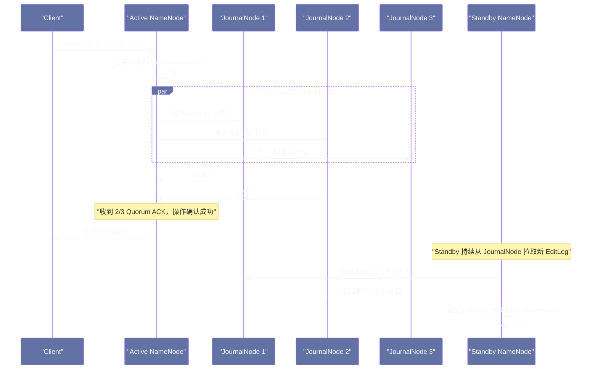
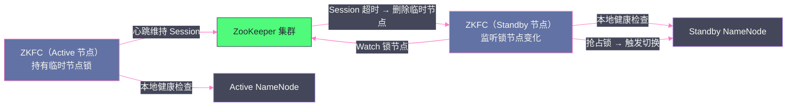
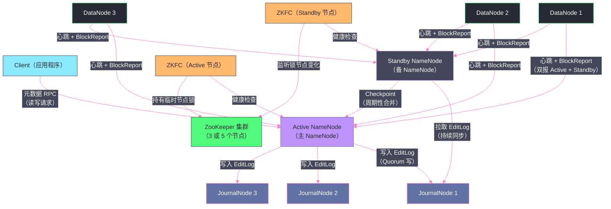

# NameNode 高可用——QJM 协议与 Active-Standby 切换机制

## 摘要

本文深度解析 HDFS NameNode 高可用（HA）的完整工程方案。前三篇文章已经揭示了 NameNode 作为单点的致命风险：一旦宕机，整个 HDFS 集群立即不可用。本文从"HA 的本质问题是什么"出发，逐步推导出 HDFS HA 的核心设计——Active/Standby 双 NameNode 架构、用 QJM（Quorum Journal Manager）共享 EditLog 解决状态同步问题、用 [[ZooKeeper]] 实现故障检测与自动切换（ZKFC）、以及用 Fencing 机制彻底消灭"脑裂（Split-Brain）"风险。每一个机制背后都有具体的工程推导：为什么需要 Quorum 写入、Fencing 不到位会发生什么、Standby 如何在不中断服务的情况下保持与 Active 完全同步。

---

## 第 1 章 引言：HA 的本质问题是什么

在第三篇文章中，我们分析了 NameNode 的持久化机制：FsImage 保存全量快照，EditLog 记录增量操作日志。有了这两个持久化文件，NameNode 重启后可以完全恢复到崩溃前的状态。

但"可以恢复"和"高可用"之间，有一段不可忽视的时间窗口：从 NameNode 崩溃到重启完成，少则几分钟（小集群），多则一两个小时（大型集群加载几十 GB 的 FsImage + 重放大量 EditLog）。在这段时间里，整个 HDFS 集群对外不可用——Client 无法读写任何文件，所有依赖 HDFS 的上层服务（Hive、Spark、HBase）全部停摆。

对于 SLA 要求"99.9% 可用性（全年允许宕机约 8.7 小时）"或更高的生产系统来说，这是无法接受的。

**HA 的本质目标**：当 Active NameNode 发生故障时，**在尽可能短的时间内**（理想情况下秒级到分钟级）切换到另一个健康的 NameNode，继续提供服务，且切换过程中不丢失任何已提交的元数据操作。

要实现这个目标，需要解决三个核心问题：

**问题一：状态同步**——Standby NameNode 需要与 Active NameNode 保持"实时"或"接近实时"的状态同步。Active 上发生的每一次元数据操作，Standby 都要知道，并应用到自己的内存状态中。

**问题二：故障检测**——谁来检测 Active NameNode 是否已经宕机？检测需要快速且可靠，不能漏报（Active 宕机了没检测到）也不能误报（Active 还活着但被认为宕机了，触发不必要的切换）。

**问题三：脑裂防护**——切换过程中，最危险的情况是"两个 NameNode 都认为自己是 Active"——这会导致两个 NameNode 同时处理 Client 请求，各自写自己的 EditLog，最终元数据状态不一致，数据损坏。这就是**脑裂（Split-Brain）**，是所有分布式 HA 系统的头号公敌。

HDFS HA 方案围绕这三个问题展开：**QJM 解决状态同步，ZKFC（ZooKeeper Failover Controller）解决故障检测，Fencing 机制解决脑裂防护**。

---

## 第 2 章 QJM：用 Quorum 实现 EditLog 的高可用共享

### 2.1 为什么不用 NFS 共享 EditLog

HDFS HA 的第一个商业实现（Cloudera 的早期方案）使用 NFS（Network File System）共享存储来实现 EditLog 共享：Active NameNode 将 EditLog 写入一个 NFS 挂载目录，Standby NameNode 从同一个 NFS 目录读取。

这个方案看起来简单直接，但有一个根本性的问题：**NFS 本身成了新的单点**。NFS 服务器宕机，EditLog 无法写入，整个 HA 方案失效。虽然 NFS 服务器本身可以配置 RAID 或双机热备，但这又引入了新的复杂性和运维成本。

Hadoop 社区在 2.0 版本引入了 **QJM（Quorum Journal Manager）** 作为更可靠的 EditLog 共享方案，彻底摆脱了对外部 NFS 的依赖。

### 2.2 QJM 的核心思想：Quorum 写入

QJM 的核心思想来自于分布式系统中经典的 **Quorum（多数派）机制**，与 [[Paxos]] 协议的思想一脉相承：

> 将 EditLog 写入一组 JournalNode（通常是 3 个或 5 个），只有当**多数派（Quorum）JournalNode 都确认写入成功**，这次写操作才被认为是持久化成功的。

对于 3 个 JournalNode 的集群（最常见配置），Quorum 是 2——只需要其中 2 个确认写入，就可以认为这条 EditLog 记录已经安全持久化。这意味着系统可以容忍 1 个 JournalNode 故障，整个 EditLog 写入服务仍然正常。

对于 5 个 JournalNode，Quorum 是 3，可以容忍 2 个 JournalNode 同时故障。

这个 Quorum 机制有两个关键优势：
1. **无单点**：没有任何单个 JournalNode 是必须可用的，只要多数派存活，服务就可以继续。
2. **一致性保证**：由于写操作必须在多数派上成功，任意两次写操作的成功集合至少有一个公共节点（两个多数派必然有交集），这保证了 EditLog 的全局顺序一致性。

### 2.3 JournalNode：轻量级的 EditLog 存储服务

**JournalNode** 是 QJM 方案中专门存储 EditLog 的进程，通常部署在独立的机器上（也可以与 NameNode 或 DataNode 共用机器）。每个 JournalNode 进程非常轻量：
- 不需要大内存（不像 NameNode 需要数百 GB）
- 主要功能就是接收 EditLog 写入请求，将日志追加到本地磁盘
- 提供日志读取接口（供 Standby NameNode 拉取 EditLog）

JournalNode 在本地存储 EditLog 的格式与 NameNode 本地存储 EditLog 的格式完全相同（`edits_<start>-<end>` 段文件 + `edits_inprogress_<N>` 活跃段），因此从 JournalNode 读取到的 EditLog 可以直接被 NameNode 处理。

### 2.4 Active NameNode 的写入流程

在 QJM 架构下，Active NameNode 处理每一次元数据写操作（如 Client 的 `create`、`rename`、`delete`）的流程如下：



**关键细节**：
1. Active NameNode 先将操作应用到自己的内存，然后并行地向所有 JournalNode 发送 EditLog 写入请求。
2. 只要收到 Quorum 数量（2/3 或 3/5）的 ACK，就认为操作持久化成功，向 Client 返回响应。
3. 即使有 1 个 JournalNode 延迟或暂时不可达，只要另外 2 个确认，操作依然成功。

### 2.5 Standby NameNode 的状态同步

Standby NameNode 的核心任务是**实时跟踪 Active NameNode 的状态变化**，使自己的内存 Namespace 始终接近 Active 的状态。

Standby 通过以下方式保持同步：

**EditLog 拉取**：Standby 内部的 `EditLogTailer` 线程持续从 JournalNode 集群拉取最新的 EditLog，将其重放到自己的内存 Namespace 中。拉取间隔可以通过 `dfs.ha.tail-edits.period`（默认 60 秒）配置，或者配置为实时拉取模式（`In-Progress Tailing`，Hadoop 2.6+ 支持）。

**BlockReport 双报**：所有 DataNode 同时向 Active NameNode 和 Standby NameNode 发送心跳和 BlockReport。这使得 Standby 也维护着完整的 BlocksMap，一旦切换为 Active，无需等待 DataNode 重新汇报，可以立即提供服务。

**Checkpoint 工作由 Standby 承担**：在 HA 模式下，不再需要 Secondary NameNode。Standby NameNode 承担了 Checkpoint 工作（合并 FsImage 和 EditLog 生成新 FsImage），周期性地将新 FsImage 上传到 Active NameNode。Active NameNode 接收后更新自己的 FsImage，删除旧的 EditLog 段。

> [!info] 核心概念：为什么 Standby 也维护 BlocksMap？
> Standby NameNode 接收 DataNode 的心跳和 BlockReport，维护与 Active 几乎相同的 BlocksMap，这个设计的目的是让切换"开箱即用（Hot Standby）"——切换完成后，新的 Active NameNode 可以**立即对外提供完整服务**，包括 Block 位置查询、副本管理等，而不需要等待 DataNode 重新汇报。
>
> 这个"双报"机制消耗了额外的网络带宽（每个 DataNode 的心跳和 BlockReport 都要发两份），但换来的是切换时间的大幅缩短——从早期非 HA 模式下重启需要几十分钟甚至几小时，到 HA 模式下切换只需要几十秒甚至更短。

### 2.6 Epoch 机制：防止"旧 Active"的 EditLog 污染

QJM 中有一个重要的 **Epoch（纪元）** 机制，用于防止已失效的旧 Active NameNode 的 EditLog 写入污染日志系统。

每次 Standby 切换为新的 Active 时，它会先向所有 JournalNode 发起一个 **`newEpoch`** 请求，获取一个新的、更大的 Epoch 编号。JournalNode 接受这个新 Epoch 后，会拒绝任何来自较小 Epoch 编号的 EditLog 写入请求。

这样，即使旧的 Active NameNode（比如因为 GC 停顿导致的短暂"假死"，恢复后认为自己还是 Active）尝试向 JournalNode 写入 EditLog，JournalNode 也会因为 Epoch 号过期而拒绝这些写入，防止新旧两个"Active"的 EditLog 交叉污染。

---

## 第 3 章 ZKFC：故障检测与自动切换

QJM 解决了 EditLog 共享的问题，但"谁来检测 Active NameNode 已经宕机、谁来触发切换"仍然需要一个机制——这就是 **ZKFC（ZooKeeper Failover Controller，ZooKeeper 故障切换控制器）**。

### 3.1 ZKFC 的部署结构

每台运行 NameNode 的机器上，同时运行一个 ZKFC 进程。ZKFC 是一个独立的 Java 进程，不在 NameNode 的 JVM 内，避免了 NameNode JVM 问题（如 GC 停顿、OOM）影响 ZKFC 的正常运行。

ZKFC 负责以下三件事：
1. **本地健康监测**：定期（默认每 `dfs.ha.log-roll.period`，即 2 分钟）检查本地 NameNode 的健康状态，通过向 NameNode 发送 RPC 请求（`monitorHealth`）确认 NameNode 进程是否正常响应。
2. **ZooKeeper Session 维护**：与 ZooKeeper 集群保持一个持久的 Session，通过心跳维持 Session 存活。
3. **Active 选举与切换**：当检测到本地 NameNode 健康，且 ZooKeeper 中的 Active 锁节点不存在时，尝试抢占 Active 锁；当检测到本地 NameNode 不健康时，主动放弃 Active 状态。

### 3.2 基于 ZooKeeper 的故障检测机制

HDFS HA 使用 ZooKeeper 来协调哪个 NameNode 是 Active。这里的核心是 ZooKeeper 的**临时节点（Ephemeral Node）**机制：

- 当前的 Active NameNode 的 ZKFC 在 ZooKeeper 中创建一个临时节点 `/hadoop-ha/<nameservice>/ActiveStandbyElectorLock`（具体路径由配置决定），并在节点数据中写入自己的 NameNode 地址。
- 这个临时节点的生命周期与 ZKFC 的 ZooKeeper Session 绑定——一旦 ZKFC 的 Session 超时（ZKFC 进程崩溃、网络分区导致 ZKFC 与 ZooKeeper 失联），这个临时节点自动被 ZooKeeper 删除。
- Standby NameNode 的 ZKFC 监听这个临时节点，一旦检测到节点被删除（Active ZKFC 失联），立即尝试创建同名临时节点，成功则宣布自己成为新的 Active。



**故障切换的完整触发链**：

```
1. Active NameNode 的 JVM 发生 OOM 崩溃
   ↓
2. Active ZKFC 检测到本地 NameNode 不响应（monitorHealth 超时）
   OR Active ZKFC 进程本身也崩溃（随 NameNode 进程一起死亡）
   ↓
3. Active ZKFC 的 ZooKeeper Session 超时（sessionTimeout 默认 10 秒）
   ↓
4. ZooKeeper 自动删除 Active ZKFC 创建的临时节点
   ↓
5. Standby ZKFC 监听到临时节点被删除的 Watch 事件
   ↓
6. Standby ZKFC 先执行 Fencing（后文详述），确认旧 Active 已经被隔离
   ↓
7. Standby ZKFC 创建新的临时节点，宣布 Standby NameNode 成为新 Active
   ↓
8. Standby NameNode 完成状态切换（从 Standby 变为 Active），开始处理 Client 请求
```

### 3.3 切换时间的决定因素

从 Active NameNode 崩溃到 Standby 开始提供服务，整个切换时间由以下几部分叠加：

| 阶段 | 典型耗时 | 影响因素 |
|---|---|---|
| ZooKeeper Session 超时 | 10~30 秒 | `ha.zookeeper.session-timeout.ms` 配置 |
| Standby ZKFC Watch 事件响应 | 毫秒级 | ZooKeeper Watch 通知延迟 |
| Fencing 操作 | 1~30 秒 | Fencing 方法（SSH 命令 vs. 幂等 RPC）|
| Standby 切换为 Active 的内部操作 | 几秒到几十秒 | 主要是让 Standby 最终追上所有未读的 EditLog |
| **总计** | **约 30~90 秒** | - |

在精心优化的集群配置下，整个切换过程可以在 30 秒以内完成（Session 超时设置较短 + Fencing 方法轻量）。相比非 HA 模式下数十分钟到几小时的恢复时间，这是质的飞跃。

---

## 第 4 章 Fencing：脑裂防护的最后防线

### 4.1 脑裂（Split-Brain）是什么

脑裂是分布式系统中最危险的故障模式之一。在 HDFS HA 的场景下，脑裂表现为：**两个 NameNode 同时认为自己是 Active，同时处理 Client 请求**。

这个场景看起来似乎不太可能发生，但现实中有一种常见的触发路径：

> Active NameNode 的 JVM 发生了严重的 Full GC Stop-The-World，进程暂停了 30 秒（GC 期间无法响应任何请求）。在这 30 秒内，ZKFC 的 ZooKeeper Session 超时，临时节点被删除，Standby ZKFC 触发切换，Standby 变成了新的 Active。GC 结束后，旧的 Active NameNode 进程恢复，它不知道自己已经"被踢下台"，继续认为自己是 Active，处理 Client 请求——此时两个 NameNode 都在写 EditLog，数据损坏在即。

这就是 **Fencing（隔离）** 机制存在的必要性：在 Standby 正式接管之前，**必须确保旧的 Active 已经被彻底隔离**，不再能够处理任何请求或写入任何数据。

### 4.2 HDFS 的多层 Fencing 机制

HDFS HA 的 Fencing 是一套多层防护体系，从最轻量到最粗暴，依次执行：

**第一层：SSH 命令 Fence（sshfence）**

ZKFC 通过 SSH 连接到旧 Active 节点，执行 `fuser` 命令找到 NameNode 进程的 PID，然后执行 `kill -9` 强制杀死进程：

```bash
# sshfence 执行的等效命令
ssh <旧Active主机> "fuser -k <NameNode端口>/tcp"
```

配置方式：
```xml
<property>
  <name>dfs.ha.fencing.methods</name>
  <value>sshfence</value>
</property>
<property>
  <name>dfs.ha.fencing.ssh.private-key-files</name>
  <value>/home/hdfs/.ssh/id_rsa</value>
</property>
```

SSH Fencing 的限制：如果旧 Active 节点的 SSH 服务不可达（比如网络分区），`sshfence` 会超时失败，切换流程卡住。

**第二层：Shell 命令 Fence（shell fencing）**

执行管理员自定义的 shell 脚本，比如通过 IPMI（智能平台管理接口）强制关闭服务器电源、或者通过网络交换机命令断开旧 Active 节点的网络连接：

```xml
<property>
  <name>dfs.ha.fencing.methods</name>
  <value>sshfence
         shell(/opt/hadoop/scripts/fence.sh ${target_host})</value>
</property>
```

多个 Fencing 方法可以用换行分隔，ZKFC 会**依次尝试**，直到一个成功为止。

**第三层：QJM Epoch 机制（软隔离）**

即使 SSH Fencing 没有成功（旧 Active 进程还活着），QJM 的 Epoch 机制也提供了一层软保护：新 Active 启动后会向 JournalNode 请求新的 Epoch，旧 Active 的所有 EditLog 写入请求都会被 JournalNode 拒绝（因为 Epoch 号过期）。

这意味着旧的 Active 即使还活着，也无法向 JournalNode 持久化任何新的元数据操作——Client 的写入请求会失败（因为写入 EditLog 失败），旧 Active 对集群状态不会造成实质性污染。

**这就是为什么 QJM 比 NFS 方案更安全**：NFS 没有 Epoch 机制，如果 Fencing 失败，旧 Active 可以继续向 NFS 写入 EditLog，真正造成脑裂数据损坏。QJM 的 Epoch 机制提供了软隔离，即使物理 Fencing 失败，旧 Active 也无法污染 EditLog。

> [!warning] 生产避坑：Fencing 配置不当是 HA 最常见的故障根因
> 很多生产集群的 HDFS HA 配置了 `sshfence`，但没有配置 SSH 免密登录（或者 SSH 密钥权限配置错误），导致故障切换时 `sshfence` 失败，整个 Fencing 流程超时，切换卡住，集群长时间不可用（比单机版 NameNode 重启更慢）。
>
> **最佳实践**：
> 1. 配置多个 Fencing 方法（`sshfence` + `shell` IPMI）作为备选
> 2. 定期演练故障切换（在维护窗口执行手动 Failover），验证 Fencing 链路完整性
> 3. 确认 SSH 免密登录配置正确，`hdfs` 用户可以无密码 SSH 到对方节点

### 4.3 手动 Failover vs. 自动 Failover

HDFS HA 支持两种切换模式：

**手动 Failover**（`ha.automatic-failover.enabled=false`）：
- 运维人员手动执行 `hdfs haadmin -failover nn1 nn2` 命令触发切换
- 切换过程受控，风险低，适合计划内的维护操作（如 NameNode 升级）
- 故障发生时需要人工介入，切换时间取决于运维人员的响应速度

**自动 Failover**（`ha.automatic-failover.enabled=true`）：
- 由 ZKFC 自动检测故障并触发切换，无需人工干预
- 切换时间约 30~90 秒，最大化减少服务不可用时间
- 依赖 ZooKeeper 集群的可用性（如果 ZooKeeper 不可用，自动切换也无法进行）

生产环境强烈建议启用自动 Failover。

---

## 第 5 章 HA 模式下的系统全景

### 5.1 完整的 HA 架构图



### 5.2 HA 模式下的 Client 透明访问

Client 怎么知道应该连接哪个 NameNode（Active 还是 Standby）？HDFS HA 通过 **NameService** 机制对 Client 透明：

在 `hdfs-site.xml` 中配置 `dfs.nameservices` 为一个逻辑名称（如 `mycluster`），并将两台 NameNode 的地址都列在这个 NameService 下：

```xml
<property>
  <name>dfs.nameservices</name>
  <value>mycluster</value>
</property>
<property>
  <name>dfs.ha.namenodes.mycluster</name>
  <value>nn1,nn2</value>
</property>
<property>
  <name>dfs.namenode.rpc-address.mycluster.nn1</name>
  <value>namenode1.example.com:8020</value>
</property>
<property>
  <name>dfs.namenode.rpc-address.mycluster.nn2</name>
  <value>namenode2.example.com:8020</value>
</property>
```

Client 使用 `hdfs://mycluster/user/alice/file.csv` 这样的逻辑 URI 访问 HDFS，底层由 **`ConfiguredFailoverProxyProvider`** 负责自动检测哪个 NameNode 是 Active：
- 向 `nn1` 发送 RPC 请求，如果 `nn1` 是 Standby，会收到 `StandbyException` 响应
- 收到 `StandbyException` 后，自动切换到 `nn2` 重试
- 应用程序感知不到这个切换过程

> [!info] 核心概念：Observer NameNode（Hadoop 3.0+）
> Hadoop 3.0 引入了 **Observer NameNode** 的概念，作为 Active/Standby 之外的第三种角色。Observer NameNode 与 Standby 一样实时同步 Active 的状态，但它可以处理**只读的元数据请求**（如 `stat`、`getBlockLocations`），将读流量从 Active NameNode 分流出去，减轻 Active 的负担。对于元数据读请求量非常大的集群（如有大量 Spark 作业频繁 `list` 目录），Observer NameNode 可以提供显著的性能提升。

### 5.3 HA 最小资源需求

部署一套完整的 HDFS HA 集群，最少需要以下节点：

| 组件 | 最少节点数 | 说明 |
|---|---|---|
| NameNode | 2 | 1 Active + 1 Standby |
| ZKFC | 2 | 每台 NameNode 机器各一个 |
| JournalNode | 3 | 最少 3 个保证 Quorum 容错 1 个故障 |
| ZooKeeper | 3 | 最少 3 个保证 Quorum 容错 1 个故障 |
| DataNode | 1+ | 根据存储需求决定 |

JournalNode 和 ZooKeeper 可以部署在同一批机器上（通常 3 台机器同时运行 JournalNode 和 ZooKeeper），NameNode 和 ZKFC 也必须在同一台机器上。所以一套最小 HDFS HA 集群最少需要 **5 台机器**（2 台 NameNode + 3 台 JournalNode/ZooKeeper + DataNode 可复用这些机器）。

---

## 第 6 章 Observer NameNode 与 Multiple Standby NameNode

### 6.1 多 Standby NameNode（Hadoop 3.0+）

Hadoop 3.0 将 HDFS HA 从原来只支持 1 个 Active + 1 个 Standby，扩展到支持 **1 个 Active + N 个 Standby**（N 可以是 1、2 甚至更多）。

多个 Standby 的价值在于：
- **更高的 HA 可用性**：原来 1+1 模式下，如果 Standby 也宕机，则没有可用的切换目标。1+2 模式下，即使一个 Standby 宕机，还有另一个 Standby 可以接管。
- **Checkpoint 负载分散**：多个 Standby 可以轮流执行 Checkpoint，分散 Checkpoint 的 CPU 和网络 I/O 开销。
- **为 Observer 打基础**：Observer NameNode 本质上是一种特殊的 Standby，它同步 Active 的状态，但还处理只读请求。

### 6.2 Observer NameNode 的一致性保证

Observer NameNode 处理只读请求时，面临一个一致性挑战：Client 刚刚向 Active NameNode 创建了一个文件，然后立刻向 Observer 查询这个文件是否存在——如果 Observer 还没有同步到这次创建操作，就会返回"文件不存在"的错误答案。

Hadoop 解决这个问题的方式是 **`msync`（元数据同步屏障）**：

- Client 在向 Active NameNode 完成写操作后，可以调用 `msync()` 向 Observer 发送一个同步请求，请求中携带了最新的事务 ID（txid）。
- Observer 收到 `msync()` 请求后，等待自己的 EditLog 同步进度达到这个 txid，再响应 Client，确保 Client 后续的读请求能看到这次写操作的结果。

这个机制提供了 **Read-Your-Writes 一致性**：Client 能保证读到自己刚刚写入的数据，即使读请求发给了 Observer 而不是 Active。

---

## 第 7 章 生产运维：HA 日常管理与常见故障处理

### 7.1 常用运维命令

```bash
# 查看当前 NameNode 状态（Active/Standby）
hdfs haadmin -getServiceState nn1
hdfs haadmin -getServiceState nn2

# 手动触发 Failover（将 nn1 切换为 Active）
hdfs haadmin -failover --forcefence --forceactive nn2 nn1

# 检查 HA 健康状态
hdfs haadmin -checkHealth nn1
hdfs haadmin -checkHealth nn2

# 查看 ZooKeeper 中的 Active 节点信息
zookeeper-client -server localhost:2181 get /hadoop-ha/<nameservice>/ActiveStandbyElectorLock
```

### 7.2 常见故障场景及处理

**场景一：Active NameNode JVM OOM 导致宕机**

触发自动切换，ZKFC 检测到 NN 不响应，ZK Session 超时，Standby 接管。关键是检查 NN 宕机原因（GC 日志、heap dump），针对内存压力调整 JVM heap 配置（`-Xmx`）和 GC 策略（通常推荐 G1GC）。

**场景二：EditLog 写入延迟过高导致客户端超时**

症状是 Client 的元数据操作（`create`、`rename` 等）延迟突然升高。排查方向：
1. JournalNode 的磁盘 I/O 是否存在瓶颈（`iostat` 检查 JN 所在机器的磁盘利用率）
2. JournalNode 的网络是否有拥塞
3. Active NameNode 的 GC 是否频繁（Full GC 会导致 EditLog 批量 `fsync()` 延迟上升）

**场景三：Standby 无法追上 Active 的 EditLog**

症状是 Standby 的 EditLog 同步进度持续落后于 Active。可能原因：
1. Standby 本身 GC 过于频繁，重放 EditLog 的速度跟不上 Active 写入速度
2. Standby 在执行 Checkpoint，占用大量 CPU，影响 EditLog 重放速度
3. JournalNode 或网络带宽限制

> [!warning] 生产避坑：Standby 落后过多时的故障切换风险
> 如果 Standby 的 EditLog 同步进度严重落后于 Active，此时发生 Failover，Standby 需要在切换为 Active 之前先追上所有落后的 EditLog（"Standby catch-up" 阶段），这个过程可能需要几分钟，期间集群不可用。因此，在生产环境中需要监控 Standby 的 EditLog 同步延迟（通过 NameNode 的 JMX/Prometheus 指标 `LastWrittenTransactionId` 的差值），及时发现并处理同步滞后问题。

---

## 第 8 章 小结：HA 方案的工程精华

回顾 HDFS HA 的完整设计，几个核心工程决策值得反复回味：

**QJM 的本质**：用 Quorum 机制将 EditLog 的"写入可靠性"与任何单个存储节点解耦——只要多数派 JournalNode 存活，EditLog 就不会丢失。这与 [[Raft]] 和 [[Paxos]] 的核心思想完全一致：多数派确认 = 安全提交。

**Fencing 的本质**：HA 系统的正确性比可用性更重要。宁可因为 Fencing 操作消耗额外的 10 秒，也不能冒脑裂风险。QJM 的 Epoch 机制提供了一层"无论如何都不会真正脑裂"的软保护，让系统在物理 Fencing 失败时仍然保持数据一致性。

**Standby 双报的代价**：让所有 DataNode 同时向两个 NameNode 汇报，额外消耗了大量的 RPC 资源，但换来的是切换时刻的"即开即用"——Standby 已经拥有完整的元数据状态，切换完成后无需等待即可服务。这是典型的"用资源换时间"的工程取舍。

在下一篇文章中，我们将看到 HDFS HA 也无法解决的问题——NameNode 的内存容量上限。当集群规模增长到 NameNode 内存装不下所有文件的元数据时，就需要 **HDFS Federation** 来打破这个天花板。

---

> [!note] 思考题
> 1. QJM（Quorum Journal Manager）要求写入 EditLog 到大多数（Quorum）JournalNode 才算成功（如 3 个 JN 中的 2 个）。这确保了 EditLog 的高可用，但如果某个 JournalNode 宕机，Active NameNode 仍然可以继续写（只需 2/3 的 JN 确认）。当宕机的 JournalNode 重新上线时，它如何追上遗漏的 EditLog 条目？JN 之间的数据同步机制是什么？
> 2. NameNode HA 中，Active 和 Standby NN 之间的状态同步依赖 JournalNode 传递 EditLog，而 DataNode 与两个 NN 都建立了 Block Report 连接。如果发生网络分区，导致 Standby NN 无法访问 JournalNode，但 Active NN 仍然正常工作，ZKFC 会触发 HA 切换吗？这种情况下，脑裂防护（Fencing）机制的作用是什么？
> 3. NameNode 的 Active-Standby 切换（Failover）过程包括：ZKFC 检测到 Active NN 失联 → 触发 Fence（SSH 杀死旧 Active 进程）→ 新 Active NN 从最新 EditLog 位置开始服务。在"旧 Active NN 卡住（GC 暂停导致 ZK 会话超时，但进程并未真正宕机）"场景下，Fencing 执行成功后，旧 Active 进程恢复正常，此时集群中有两个认为自己是 Active 的 NN，会发生什么？HDFS 如何防止这种情况下的数据损坏？

## 参考资料

- Apache Hadoop 官方文档：[HDFS High Availability Using QJM](https://hadoop.apache.org/docs/current/hadoop-project-dist/hadoop-hdfs/HDFSHighAvailabilityWithQJM.html)
- Hexiaoqiao 博客：[HDFS HA Using QJM 原理解析](https://hexiaoqiao.github.io/blog/2018/03/30/the-analysis-of-basic-principle-of-hdfs-ha-using-qjm/)
- Apache Hadoop 官方文档：[HDFS Observer NameNode](https://hadoop.apache.org/docs/current/hadoop-project-dist/hadoop-hdfs/ObserverNameNode.html)
- Apache Hadoop 源码：`org.apache.hadoop.hdfs.qjournal.client.QuorumJournalManager`、`DFSZKFailoverController`
