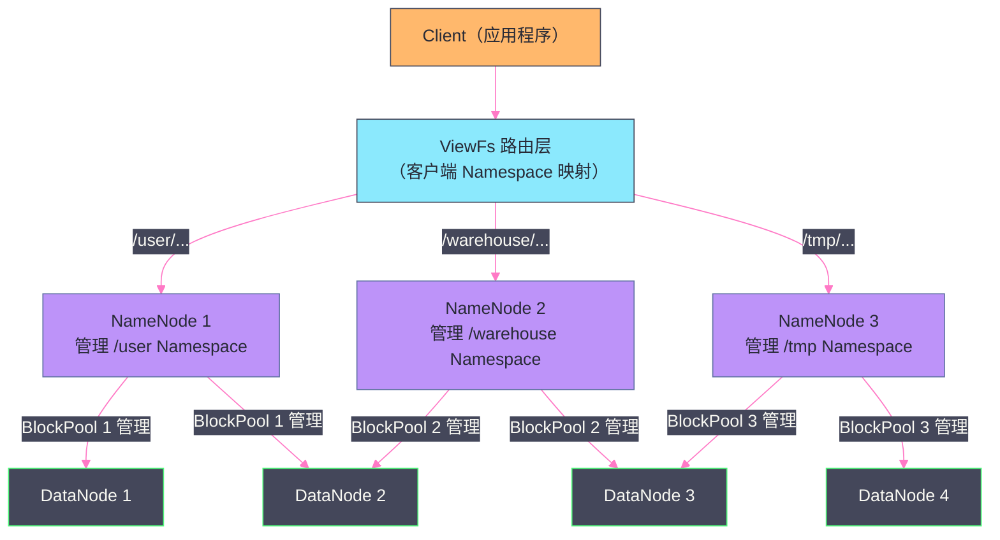
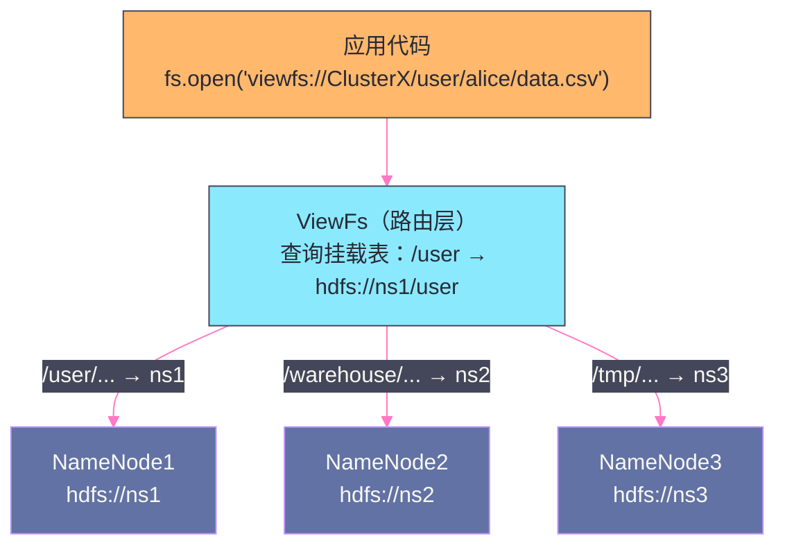
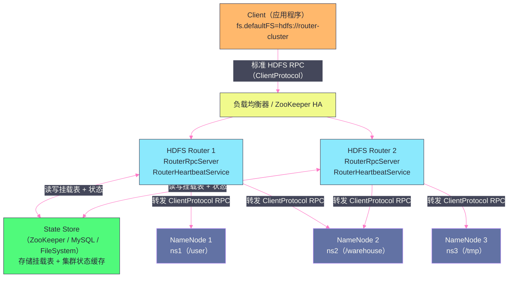
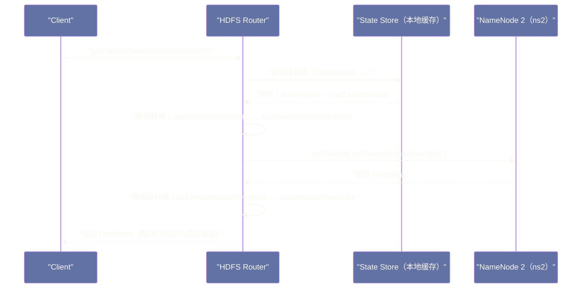

# HDFS Federation——打破单 NameNode 的内存天花板

## 摘要

本文深度解析 HDFS Federation（联邦）架构的设计动机、核心机制与工程边界。前一篇文章解决了 NameNode 的高可用问题（Active/Standby + QJM），但 HA 无法解决另一个根本性瓶颈：**单台 NameNode 的内存是有上限的，当集群文件数量突破这个上限，整个 HDFS 就无法再存入新文件**。Federation 通过将 Namespace 水平切分到多个独立的 NameNode 上，让元数据的管理容量可以随 NameNode 数量线性扩展。文章重点拆解 Block Pool 与 Namespace 解耦的设计价值、DataNode 多 Block Pool 注册机制、ViewFs 客户端路由层的工作原理，以及 Federation 在实践中的局限性和演进方向（Router-Based Federation）。

---

## 第 1 章 引言：HA 解决不了的问题

经过第六篇文章的剖析，HDFS HA（Active/Standby + QJM）已经从根本上解决了 NameNode 的单点故障风险——当 Active NameNode 宕机时，Standby 可以在几十秒内接管，集群持续可用。

但 HA 有一个它力所不及的问题：**内存容量**。

NameNode 把整个文件系统的所有 INode（每个文件和目录各对应一个）全部保存在 JVM Heap 内存中。这是 NameNode 实现极低延迟元数据查询的根本保障，但也决定了集群能管理的文件数量有一个硬性上限——由单台物理服务器能配置的最大内存决定。

从第二篇文章的美团技术团队测试数据我们知道：在 Hadoop 2.4 中，当目录和文件总量达到 **2 亿**时，NameNode 的常驻内存使用量已经超过 90GB。即使用今天最高配置的服务器（2TB 内存），理论上限也不过约 40~50 亿个文件——对于一个运营多年、积累了海量小文件的大型互联网数据平台来说，这个上限是真实存在且可能被突破的。

更重要的是，单个 NameNode 还存在**性能瓶颈**：所有来自 Client 的元数据 RPC 请求都汇聚到这一个进程处理，当集群规模增大、并发请求量激增时，NameNode 会成为整个系统的性能瓶颈——吞吐量无法随 DataNode 数量线性提升。

**HDFS Federation** 就是针对这两个问题的水平扩展方案。

---

## 第 2 章 Federation 的核心思想：Namespace 的水平分片

### 2.1 基本架构

Federation 的核心思想可以用一句话概括：

> **将原来由一个 NameNode 管理的整个 Namespace（`/` 根目录树），切分成多个子 Namespace，每个子 Namespace 由一个独立的 NameNode 管理，所有 NameNode 共享同一批 DataNode 的物理存储。**

在 Federation 架构下：
- 每个 NameNode 管理 Namespace 的一个**子树**（比如 `/user` 由 NameNode1 管理，`/warehouse` 由 NameNode2 管理，`/tmp` 由 NameNode3 管理）
- 每个 NameNode 是**完全独立**的——它们之间没有任何通信，不需要协调，没有共享状态
- 所有 DataNode 向**所有 NameNode** 注册，同时服务于多个 NameNode



### 2.2 Federation 带来的两个扩展维度

**维度一：元数据容量水平扩展**

在非 Federation 模式下，集群可管理的文件总数上限 = 单个 NameNode 的内存上限。

在 Federation 模式下，集群可管理的文件总数上限 = **N × 单个 NameNode 的内存上限**（N 是 NameNode 数量）。元数据容量随 NameNode 数量线性扩展，理论上可以无限增长（只要不断增加 NameNode）。

**维度二：元数据读写吞吐量水平扩展**

不同 Namespace 的元数据请求由不同 NameNode 处理，NameNode 的处理能力不再是全集群的单点瓶颈。访问 `/user` 的 RPC 请求打到 NN1，访问 `/warehouse` 的请求打到 NN2，两组请求完全并行处理，整体吞吐量随 NameNode 数量线性提升。

---

## 第 3 章 Block Pool：Namespace 与存储的解耦设计

Federation 架构中最精妙的设计之一是 **Block Pool（块池）** 机制——它实现了 Namespace 管理（NameNode 负责）与物理存储（DataNode 负责）之间的解耦。

### 3.1 什么是 Block Pool

**Block Pool** 是属于某个 NameNode 的一组 Block 的集合。每个 NameNode 管理自己独立的 Block Pool，拥有一个全局唯一的 `BlockPoolId`（在集群格式化时生成）。

在 Federation 架构下：
- NameNode1 管理 Block Pool 1（`BlockPoolId = BP-1234-nn1-...`），Pool 中包含 `/user` Namespace 下所有文件的 Block
- NameNode2 管理 Block Pool 2（`BlockPoolId = BP-5678-nn2-...`），Pool 中包含 `/warehouse` Namespace 下所有文件的 Block
- NameNode3 管理 Block Pool 3，以此类推

### 3.2 DataNode 的多 Block Pool 存储结构

每个 DataNode 同时服务于所有 NameNode，在本地磁盘上为每个 Block Pool 维护独立的存储目录。在第二篇文章介绍的 DataNode 目录结构中已经体现了这一点：

```
/data/hdfs/dn1/
└── current/
    ├── BP-1234-nn1-<timestamp>/     ← Block Pool 1（属于 NameNode1）
    │   └── current/
    │       └── finalized/
    │           └── subdir0/.../
    │               ├── blk_1073741825
    │               └── blk_1073741825_1001.meta
    ├── BP-5678-nn2-<timestamp>/     ← Block Pool 2（属于 NameNode2）
    │   └── current/
    │       └── finalized/
    │           └── ...
    └── BP-9012-nn3-<timestamp>/     ← Block Pool 3（属于 NameNode3）
        └── ...
```

不同 Block Pool 的数据在 DataNode 本地文件系统中**物理隔离**，互不干扰。一个 DataNode 故障不会导致整个集群不可用——只影响这个 DataNode 服务的各个 Block Pool 中的相关 Block 副本，NameNode 会触发对应 Block 的再复制。

### 3.3 解耦的工程价值

Block Pool 机制将 **Namespace 的逻辑结构** 与 **DataNode 的物理存储** 完全解耦，这带来了几个重要的工程价值：

**独立扩展**：可以在不改变 DataNode 数量的情况下，增加新的 NameNode（增加新的 Namespace 分片）；也可以在不改变 NameNode 数量的情况下，增加新的 DataNode（扩展物理存储容量）。

**独立故障隔离**：一个 NameNode 宕机，只影响它管理的 Namespace，其他 Namespace 的读写不受影响。DataNode 上属于宕机 NameNode 的 Block Pool 数据依然存在，只是暂时没有 NameNode 来管理它们（等待 NameNode 恢复后，DataNode 重新汇报 BlockReport，Block Pool 恢复正常）。

**存储利用率均衡**：所有 Namespace 的数据共享同一批 DataNode 的物理磁盘，磁盘空间可以在不同 Namespace 之间自由分配，不存在"某个 Namespace 磁盘满了而其他 Namespace 磁盘大量空闲"的碎片化问题。

> [!note] 设计哲学：共享存储 vs. 独立存储
> Federation 的 Block Pool 设计选择了"Namespace 隔离、存储共享"的中间方案，而不是"每个 Namespace 有自己独立的一批 DataNode"。后者（独立存储）的隔离性更强，但存储利用率低（每个 Namespace 都需要预留足够的磁盘空间，无法跨 Namespace 借用空闲空间）。共享存储的方案更灵活，但需要在 DataNode 层面处理多 Block Pool 的资源竞争（例如，某个 Namespace 的大量 Block 复制任务会占用 DataNode 的磁盘 I/O 带宽，影响同一 DataNode 上其他 Block Pool 的 I/O）。

### 3.4 DataNode 向多个 NameNode 注册的机制

在 Federation 模式下，DataNode 的启动流程发生了变化：它需要向**所有**配置的 NameNode 发起注册，而不是只向一个 NameNode 注册。

DataNode 的配置文件（`hdfs-site.xml`）中会列出所有 NameNode 的地址：

```xml
<!-- Federation 模式下，DataNode 感知到所有 NameNode 的地址 -->
<property>
  <name>dfs.nameservices</name>
  <value>ns1,ns2,ns3</value>
</property>
<property>
  <name>dfs.namenode.rpc-address.ns1.nn1</name>
  <value>namenode1.example.com:8020</value>
</property>
<property>
  <name>dfs.namenode.rpc-address.ns2.nn2</name>
  <value>namenode2.example.com:8020</value>
</property>
<property>
  <name>dfs.namenode.rpc-address.ns3.nn3</name>
  <value>namenode3.example.com:8020</value>
</property>
```

DataNode 启动后，会**并行地**向每个 NameNode 发起注册请求，接收各自分配的 Block Pool ID，并开始定期向所有 NameNode 发送心跳和 BlockReport（每个 NameNode 只收到属于自己 Block Pool 的 Block 列表，而不是 DataNode 上所有 Block 的列表）。

这意味着 DataNode 的通信开销随 NameNode 数量线性增加——有 3 个 NameNode，DataNode 每隔 3 秒就要向 3 个 NameNode 各发一次心跳，以及定期向 3 个 NameNode 各发一次全量 BlockReport。在 Federation 规模较大时，DataNode 的网络负担会比较可观，需要关注 DataNode 的 RPC 线程池配置和网络带宽。

---

## 第 4 章 ViewFs：对 Client 透明的 Namespace 统一视图

### 4.1 问题：多个 NameNode 如何对 Client 透明

Federation 将 Namespace 分片到多个 NameNode 上，但 Client 使用 HDFS 的方式通常是"我有一个统一的文件系统视图，`/user/alice/file.csv` 和 `/warehouse/hive/db/table/file.parquet` 都属于同一个文件系统"。如果 Client 需要自己判断每个路径该去哪个 NameNode，那无论是代码复杂度还是运维复杂度都会大幅增加。

**ViewFs（Virtual File System，虚拟文件系统）** 就是解决这个问题的透明路由层。它在 Client 侧实现了一个"虚拟的统一文件系统视图"，将不同的路径前缀映射到不同的 NameNode，对应用层完全透明。

### 4.2 ViewFs 的工作原理

ViewFs 是 HDFS Client 库中的一个特殊 `FileSystem` 实现，通过挂载表（Mount Table）配置路径到 NameNode 的映射关系：

```xml
<!-- core-site.xml 中配置 ViewFs 挂载表 -->
<property>
  <name>fs.defaultFS</name>
  <value>viewfs://ClusterX</value>
</property>

<property>
  <name>fs.viewfs.mounttable.ClusterX.link./user</name>
  <value>hdfs://ns1/user</value>
</property>
<property>
  <name>fs.viewfs.mounttable.ClusterX.link./warehouse</name>
  <value>hdfs://ns2/warehouse</value>
</property>
<property>
  <name>fs.viewfs.mounttable.ClusterX.link./tmp</name>
  <value>hdfs://ns3/tmp</value>
</property>
```

配置完成后，Client 代码使用 `viewfs://ClusterX/user/alice/file.csv` 这样的统一 URI 访问 HDFS：
- ViewFs 检测到路径前缀 `/user`，查找挂载表，发现映射到 `hdfs://ns1/user`
- 自动将请求路由到 NameNode1（`ns1` 对应的 NameNode）
- 返回结果给 Client，Client 完全感知不到底层有多个 NameNode



### 4.3 ViewFs 的配置粒度与灵活性

ViewFs 的挂载表支持多种配置粒度：

**路径级挂载（Link）**：将某个路径前缀挂载到指定 NameNode 的路径上，这是最常见的配置方式（如上面的例子）。

**合并挂载（LinkMerge）**：将多个 NameNode 上相同路径下的内容合并呈现为一个统一目录。例如，将 `ns1:/user` 和 `ns2:/user` 合并挂载到 `/user`，使得 Client `ls /user` 时能看到两个 NameNode 上的所有用户目录。

**Fallthrough 挂载（LinkFallback）**：为没有匹配任何挂载规则的路径提供一个默认的 NameNode，防止出现路径找不到对应 NameNode 的错误。

> [!warning] 生产避坑：ViewFs 挂载表需要在所有 Client 节点保持一致
> ViewFs 的挂载表配置保存在每个 Client 节点（计算节点）本地的 `core-site.xml` 中。当需要调整 Namespace 切分方案（如将 `/data` 从 NN1 迁移到 NN2）时，必须同步更新所有计算节点的配置文件。如果有部分节点配置未更新，会出现同一个路径在不同节点上路由到不同 NameNode 的问题，产生难以排查的数据不一致故障。

---

## 第 5 章 Federation 的局限性

Federation 解决了元数据容量和吞吐量的水平扩展问题，但它并不是一个完美的方案，有以下几个明显的局限性：

### 5.1 跨 Namespace 操作的限制

在单 NameNode 的 HDFS 中，`rename` 操作可以将文件从一个目录移动到另一个目录，只需修改 NameNode 内存中的 INode 树即可，是一个 O(1) 的操作。

但在 Federation 中，如果要将一个文件从 `/user/alice/data.csv`（NN1 管理）移动到 `/warehouse/hive/db/data.csv`（NN2 管理），这涉及两个 NameNode——NN1 需要删除源路径，NN2 需要在目标路径创建文件。这不是一个原子操作，如果在两个步骤之间系统崩溃，可能出现文件在两个地方都存在或都不存在的状态。

HDFS 的标准 `rename` RPC 不支持跨 NameNode 的操作，必须通过 `hdfs dfs -cp` + `hdfs dfs -rm` 的方式做跨 Namespace 数据迁移，但这是一个**数据复制**操作（复制 Block 数据），而不是简单的元数据移动，消耗大量时间和带宽。

> [!info] 核心概念：跨 Namespace 操作的根本难题
> 跨 Namespace 操作的原子性难题，是所有分布式元数据系统的共同挑战。要实现真正的原子性跨 Namespace 操作，需要引入分布式事务机制（如两阶段提交），这会显著增加系统复杂度和延迟。Federation 选择了"不支持原子跨 Namespace 操作"的简单路线，将这个复杂性留给了用户层面处理——代价是用户需要在设计数据目录结构时，提前规划好哪些数据会频繁跨 Namespace 访问，避免这类操作。

### 5.2 Namespace 切分粒度固化

Federation 的 Namespace 切分是一次性的：一旦某个路径被挂载到某个 NameNode，未来要迁移到另一个 NameNode 需要大量的数据复制和配置变更工作，没有"在线重新切分"的能力。

这意味着在部署 Federation 时，必须提前规划好 Namespace 切分方案。如果前期规划不当（例如某个 NameNode 的 Namespace 文件数增长过快，而另一个 NameNode 的 Namespace 几乎为空），后期调整代价很高。

### 5.3 管理复杂度增加

传统的运维命令（`hdfs dfsadmin`、`hdfs fsck` 等）在 Federation 模式下需要针对每个 NameNode 分别执行，无法用一个命令查看整个集群的状态。

例如，查看整个集群的磁盘使用情况，需要对每个 NameNode 分别执行 `hdfs dfsadmin -report`，然后手动汇总结果。这增加了运维的心智负担和出错概率。

### 5.4 DataNode 的多 NameNode 通信开销

如第三章所述，DataNode 需要向所有 NameNode 定期发送心跳和 BlockReport。当 Federation 规模较大时（例如 10 个 NameNode），每个 DataNode 需要维护 10 个并发的 RPC 连接并定期发送心跳，DataNode 的 RPC 线程和网络开销随 NameNode 数量线性增长。

在一个有 1000 个 DataNode、10 个 NameNode 的集群中，每个 NameNode 每 3 秒会收到 1000 次心跳——这与非 Federation 模式下相同。但每个 DataNode 现在需要维护 10 倍的 RPC 连接，整个集群的 RPC 流量是非 Federation 模式的 10 倍，对网络交换机和 DataNode 的 CPU 都有额外压力。

---

## 第 6 章 Router-Based Federation（RBF）：更彻底的透明化方案

HDFS Federation 的 ViewFs 方案有一个根本性的问题：挂载表配置存储在**每个 Client 节点的本地**。这意味着：
1. 任何挂载表变更都需要同步到集群中所有 Client 节点
2. 不同节点的配置可能出现不一致
3. 需要重启应用（或刷新配置）才能生效

试想一个有 2000 台计算节点的生产集群，当需要将 `/data` 路径从 NN1 迁移到 NN2 时，需要在 2000 台机器上修改 `core-site.xml` 并重启相关服务——这是一个极其繁琐且容易出错的运维操作。更严重的是，如果 50 台机器配置更新失败，这 50 台机器上的作业就会将 `/data` 路由到错误的 NameNode，产生数据错误，且难以排查。

为了解决这个问题，Hadoop 3.x 引入了 **RBF（Router-Based Federation，基于路由器的联邦）** 方案。

### 6.1 RBF 的整体架构

RBF 在 Client 和各 NameNode 之间引入了一层独立的 **HDFS Router** 服务。Router 对外暴露与 NameNode **完全相同的 RPC 接口**，Client 访问 Router 就像访问一个普通 NameNode 一样，无需任何代码改动：



RBF 的四个核心组件：

- **RouterRpcServer**：Router 的 RPC 服务端，实现 `ClientProtocol`（与 NameNode 对外暴露的接口完全相同），接收 Client 的元数据请求
- **RouterRpcClient**：Router 的 RPC 客户端，负责向下游 NameNode 转发请求，维护与各 NameNode 的连接池
- **State Store**：集中存储挂载表（Mount Table）、各 NameNode 的状态缓存（心跳信息、存储容量）、Router 自身的注册信息
- **RouterHeartbeatService**：Router 的后台线程，定期向各 NameNode 发送心跳，感知各 NameNode 的健康状态，并将状态刷新到 State Store

### 6.2 RBF 的请求转发流程

理解 RBF 的核心，需要拆解一个元数据请求从 Client 到 NameNode 的完整转发路径。以 `getFileInfo("/warehouse/hive/db/t1")` 为例：



关键步骤说明：

**步骤一：挂载表查询（本地缓存，无网络 I/O）**

Router 启动时将 State Store 中的挂载表加载到本地内存缓存（`MountTableResolver`）。正常运行时，挂载表查询直接命中本地缓存，不需要访问 State Store（State Store 只在挂载表变更时被访问），因此单次查询的延迟可以控制在微秒级，不是性能瓶颈。

**步骤二：路径转换（虚拟路径 → 真实路径）**

Router 将 Client 请求的虚拟路径（`/warehouse/hive/db/t1`）转换为对应 NameNode 上的真实路径（`/warehouse/hive/db/t1`，在路径挂载点与 NameNode 根路径相同的情况下路径不变，但如果挂载表配置了路径重写，则会有差异）。

**步骤三：RPC 转发**

Router 通过 `RouterRpcClient` 向目标 NameNode 发起 RPC 调用。Router 与各 NameNode 之间维护持久的 RPC 连接池，转发本身只是连接池中的一次方法调用，延迟通常在 1~5ms 之间（取决于 Router 到 NameNode 的网络延迟）。

**步骤四：路径反转换（真实路径 → 虚拟路径）**

NameNode 返回的 `FileStatus` 中包含文件的完整路径，这个路径是 NameNode 上的真实路径。Router 在将结果返回给 Client 之前，需要将真实路径反转换为 Client 期望看到的虚拟路径。这对 Client 是完全透明的——Client 始终看到的是统一的虚拟路径空间。

### 6.3 Router 的心跳服务与 NameNode 状态感知

Router 的 `RouterHeartbeatService` 后台线程扮演了类似"集群状态中继站"的角色：

- **定期轮询各 NameNode 状态**：每隔 `dfs.router.heartbeat.interval`（默认 5 秒）向每个 NameNode 发送 `getStats()` 和 `getDatanodeReport()` 等 RPC，获取各 NameNode 管理的存储容量、DataNode 数量、Block 统计等信息
- **写入 State Store**：将收集到的状态信息写入 State Store，作为 Router 汇总视图的数据来源
- **Active NameNode 探测**：在 HA 模式下，Router 需要感知各 NameService 当前的 Active NameNode 是哪个（因为只有 Active NameNode 可以处理写请求），Router 通过定期调用 `HAServiceProtocol.getServiceStatus()` 来维护这个映射关系

这个机制解决了一个重要问题：**Router 如何对外呈现整个 Federation 集群的统一视图**（例如 `hdfs dfsadmin -report` 应该显示所有 NameService 的汇总容量，而不是某一个 NameService 的容量）。Router 从 State Store 读取各 NameService 的状态缓存，聚合后返回给 Client，使 Client 看到的是整个 Federation 的全局视图。

### 6.4 跨 NameService 操作：RBF 如何处理

ViewFs 完全无法处理跨 NameService 的操作（如将文件从 `/user`（ns1）rename 到 `/warehouse`（ns2）），但 RBF 可以通过**代理层模拟**来处理部分场景：

**跨 Namespace 的 rename 处理**：

RBF 的 `RouterRpcServer` 在处理 `rename` 请求时，会检查源路径和目标路径是否映射到同一个 NameService：
- **同一 NameService**：直接转发到对应 NameNode，一次 RPC 完成，原子性由 NameNode 保证
- **不同 NameService**：RBF 将 `rename` 分解为 `copy`（从源 NameNode 复制数据到目标 NameNode）+ `delete`（删除源 NameNode 上的数据），这是非原子的，RBF 在返回给 Client 的错误信息中会明确提示这是跨 Namespace 操作

> [!warning] 生产避坑：RBF 跨 NameService rename 的非原子性
> 即使使用了 RBF，跨 Namespace 的 `rename` 仍然不是原子操作。RBF 的处理方式是：先在目标 NameService 上创建文件并复制数据，再删除源 NameService 上的文件。如果在复制完成后、删除前 Router 崩溃，数据会在两个 NameService 上各存一份，需要人工介入清理。**设计数据目录结构时，应当将会频繁互相 rename 的目录路径规划在同一个 NameService 下。**

**跨 Namespace 的 `getContentSummary` 聚合**：

当 Client 请求 `getContentSummary("/")` 时，Router 会向所有 NameService 分别发起 `getContentSummary` 请求，将各 NameService 返回的结果（文件数、目录数、字节数）累加后返回给 Client，实现了跨所有 NameService 的全局统计视图。

### 6.5 Router 的 Quota 管理

在传统 Federation + ViewFs 方案中，配额（Quota）管理是一个棘手的问题：每个 NameNode 只管理自己 Namespace 的 Quota，无法在 Router/ViewFs 层面做跨 Namespace 的全局 Quota 控制。

RBF 引入了 **Router-level Quota（路由器级别配额）**，允许管理员在 Router 层面为整个虚拟挂载点设置配额，由 Router 统一执行，而不依赖底层各 NameNode 的 Quota 机制：

```bash
# 在 Router 层面为虚拟路径 /user 设置配额（不需要分别在各 NameNode 上设置）
hdfs dfsrouteradmin -setQuota /user -nsQuota 1000000 -ssQuota 1t
hdfs dfsrouteradmin -clrQuota /user
```

Router-level Quota 的实现原理：Router 在 State Store 中记录虚拟路径的 Quota 配置。每次 Client 发起写操作（`create`、`mkdirs` 等）时，Router 先查询 State Store 中该路径的 Quota，计算累积使用量，判断是否超额，超额则直接在 Router 层面拒绝请求，不转发给 NameNode。

### 6.6 RBF vs ViewFs：横向对比

| 维度 | ViewFs（客户端路由）| RBF（服务端路由）|
|---|---|---|
| 挂载表存储位置 | 每台 Client 节点本地 `core-site.xml` | 集中存储在 State Store |
| 配置变更方式 | 修改所有 Client 节点配置，重启生效 | 在线修改 State Store，Router 动态感知 |
| Client 代码改动 | 需要修改 `fs.defaultFS` 为 `viewfs://` | 无需修改，连接 Router 地址即可 |
| 额外网络延迟 | 无（Client 直连 NameNode）| 有（多一跳 Router 转发，通常 1~5ms）|
| 跨 Namespace rename | 不支持 | 支持（非原子，代理模式）|
| 全局 Quota 管理 | 不支持 | 支持（Router-level Quota）|
| 全局统计视图 | 不支持 | 支持（Router 聚合各 NameService 结果）|
| 部署复杂度 | 低（无额外服务）| 高（需要部署 Router 集群 + State Store）|
| 适用场景 | 小规模 Federation，Namespace 切分稳定 | 大规模 Federation，需要动态管理挂载表 |

### 6.7 RBF 的现状与局限

RBF 从 Hadoop 3.0 开始作为 alpha 功能引入，在 3.2 和 3.3 中逐渐成熟，到 3.4 已经在字节跳动、阿里云等多个大规模生产集群中部署使用。

但 RBF 也有自己不可忽视的代价：

**额外的转发延迟**：每个元数据请求需要经过 Router 转发，增加了一跳网络延迟。在 NameNode 本地处理延迟为 1ms 的场景下，Router 转发可能将总延迟增加到 3~5ms。对延迟敏感的应用（如 HBase 的 HDFS 元数据操作）需要评估这个延迟是否可接受。

**Router 是新的可用性依赖**：引入 Router 后，Client 无法直接访问 NameNode（除非绕过 Router 直连），Router 的可用性成为整个 HDFS 访问路径的依赖。Router 集群需要至少 2 个节点并配置 HA（通过 ZooKeeper 选主），否则 Router 单点故障会导致整个集群不可写。

**State Store 的一致性压力**：多个 Router 并发读写同一个 State Store，在挂载表频繁变更时可能产生并发冲突。State Store 本身也需要高可用配置（ZooKeeper 3 节点集群或高可用 MySQL）。

> [!note] 设计哲学：ViewFs 还是 RBF？
> 不存在"ViewFs 一定比 RBF 好"或"RBF 一定比 ViewFs 好"的结论，选择取决于场景：
>
> - **Federation 规模小（2~3 个 NameService）、Namespace 切分稳定、Client 节点数量可控（<500 台）**：ViewFs 更轻量，无额外服务依赖，延迟更低，维护成本更低。
>
> - **Federation 规模大（>5 个 NameService）、需要动态调整挂载表、Client 节点数量庞大（>1000 台）、需要跨 Namespace 全局视图**：RBF 的集中化管理优势压倒了它引入的复杂性，是更合理的选择。
>
> 实践中，许多团队选择的路径是：先用 ViewFs 起步（简单、低风险），在规模增大后再迁移到 RBF（可以平滑迁移，Client 只需修改 `fs.defaultFS` 配置）。

---

## 第 7 章 Federation 的实际使用场景与切分策略

### 7.1 何时需要 Federation

并非所有 HDFS 集群都需要 Federation。判断是否需要 Federation 的主要指标：

| 指标 | 建议阈值 | 说明 |
|---|---|---|
| 文件和目录总数 | > 3 亿（单 NN 内存已紧张）| 超过此阈值，NameNode 内存压力开始显现 |
| NameNode RPC 延迟 | P99 > 100ms | 元数据操作延迟上升，说明 NN 已成性能瓶颈 |
| NameNode GC 停顿 | Full GC > 1 次/天 | GC 频繁说明 Heap 压力大，内存接近上限 |
| 单日新增文件数 | > 500 万 | 预估未来 1~2 年内会突破内存天花板 |

### 7.2 Namespace 切分策略

Namespace 切分是 Federation 部署中最需要仔细规划的环节，因为切分方案一旦确定后调整成本很高。常见的切分策略：

**按业务线切分**：每个业务线（用户数据 `/user`、数仓 `/warehouse`、日志 `/log`、ML 特征 `/ml`）对应一个 NameNode。这是最直观的切分方式，业务边界清晰，故障隔离好（某个业务线的 NameNode 故障不影响其他业务线）。

**按数据热度切分**：热数据（频繁读写的当日数据）放在高性能 NameNode（大内存、高主频 CPU）上，冷数据（历史归档数据）放在普通配置的 NameNode 上，结合存储策略（ARCHIVE 磁盘）降低成本。

**按文件大小特征切分**：小文件密集的 Namespace（如 Spark Streaming 的输出目录）单独放在一个 NameNode 上，并在这个 NameNode 上配置更大的内存（因为小文件的 INode 数量远多于大文件）；大文件为主的 Namespace（如 Parquet/ORC 格式的数仓数据）放在另一个 NameNode 上。

> [!warning] 生产避坑：避免将频繁跨 Namespace 访问的目录切分到不同 NameNode
> 如果某个业务场景需要频繁地将数据从 `/tmp`（NN3）移动到 `/warehouse`（NN2），切分到不同 NameNode 后这个操作从 O(1) 的 rename 变成了 O(data) 的 copy + delete，性能大幅下降。在规划 Namespace 切分时，应当将经常需要"原子移动（rename）"的目录对切分到同一个 NameNode 管理。

---

## 第 8 章 Federation 与 HA 的组合使用

Federation 和 HA 是两个正交的特性，可以组合使用：**每个 Federation 中的 NameNode 都可以配置自己的 Active/Standby HA 对**。

这样，即使某个 NameNode 发生硬件故障，其 Standby 会自动接管（HA 负责），同时其他 NameNode 管理的 Namespace 继续正常服务（Federation 的故障隔离）。

完整的 Federation + HA 部署架构：

```
NameService 1 (管理 /user):
  - Active NameNode 1a
  - Standby NameNode 1b
  - JournalNode 集群（3 个节点）

NameService 2 (管理 /warehouse):
  - Active NameNode 2a
  - Standby NameNode 2b
  - JournalNode 集群（可复用同一组 JournalNode）

NameService 3 (管理 /tmp):
  - Active NameNode 3a
  - Standby NameNode 3b

DataNode: 所有 DataNode 注册到所有 NameService
```

JournalNode 集群通常可以在多个 NameService 之间共用（每个 NameService 使用 JournalNode 集群中的独立 EditLog 存储路径），减少机器数量。

---

## 第 9 章 小结：Federation 的工程价值与边界

Federation 是 HDFS 在面对超大规模集群时的水平扩展方案，其核心工程价值在于：

- **Block Pool 解耦**：Namespace 管理与 DataNode 物理存储的解耦，是 Federation 架构优雅性的基础
- **彻底的 NameNode 独立性**：Federation 中的 NameNode 之间无任何通信，零协调成本，这是它能够实现线性扩展的关键
- **向后兼容**：存量代码无需改动（通过 ViewFs 或 RBF 对 Client 透明），Federation 是一个对上层应用透明的基础设施扩展

但 Federation 的局限性也同样清晰：跨 Namespace 操作代价高、Namespace 切分固化难以调整、多 NameNode 管理复杂度增加。这些局限性决定了 Federation 是一个"在不得不用时才用"的方案，而不是"一开始就部署"的常规选择。

下一篇文章，我们将目光转向 DataNode 的存储引擎——DataNode 如何通过 Fsdataset 管理本地磁盘上的 Block 数据，磁盘故障如何被检测和隔离，以及 DataNode 如何高效利用内核 [[Page Cache]] 优化 I/O 性能。

---

> [!note] 思考题
> 1. HDFS Federation 通过多个独立的 NameNode（Namespace）来突破单 NameNode 的内存限制，每个 Namespace 管理独立的目录树和文件，共享底层的 DataNode 存储池。但 Federation 不能跨 Namespace 重命名或移动文件（因为两个 NN 完全独立）。在多业务共享集群的场景下，如何合理地划分 Namespace 边界，既能隔离不同业务，又不频繁遇到"需要跨 Namespace 移动文件"的场景？
> 2. ViewFS 是 Federation 的客户端路由层——它将不同路径前缀映射到不同的 Namespace（如 `/user` → NN1，`/data` → NN2）。这个映射配置存储在客户端的 `core-site.xml` 中。如果集群扩容需要调整 Namespace 划分（如将 `/data/log` 从 NN1 迁移到 NN3），需要修改所有客户端的配置并重启应用，这是一个运维痛点。有没有办法将 ViewFS 的路由配置集中化，实现动态更新而无需修改客户端配置？
> 3. Federation 下多个 NameNode 共享同一批 DataNode，但每个 NN 只能看到自己的 Block Pool 中的 Block。DataNode 的总存储容量由所有 Block Pool 共同使用，没有隔离机制——某个 Namespace 的数据爆增会占满整个集群的磁盘，影响所有其他 Namespace。在多租户场景下，如何通过配额（Quota）机制来防止某个 Namespace"吃光"所有存储资源？

## 参考资料

- Apache Hadoop 官方文档：[HDFS Federation](https://hadoop.apache.org/docs/current/hadoop-project-dist/hadoop-hdfs/Federation.html)
- Apache Hadoop 官方文档：[Router-Based Federation](https://hadoop.apache.org/docs/current/hadoop-project-dist/hadoop-hdfs/HDFSRouterFederation.html)
- Apache Hadoop 官方文档：[ViewFs Guide](https://hadoop.apache.org/docs/current/hadoop-project-dist/hadoop-common/ViewFs.html)
- 腾讯云开发者社区：[HDFS Federation 简介](https://cloud.tencent.com/developer/article/1349468)
- Shvachko, K. (2010). *HDFS Scalability: The limits to growth*. USENIX ;login: Magazine.
