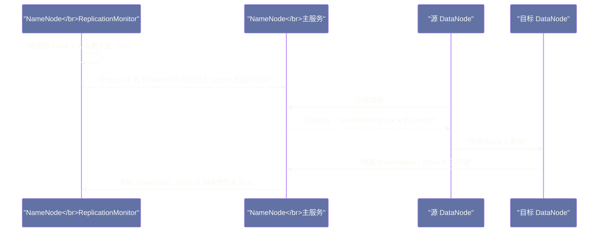

# HDFS 容错与恢复机制——自愈修复的工程实现

## 摘要

HDFS 的高可靠性不依赖于单个组件的高质量，而依赖于**系统层面的自愈（Self-Healing）能力**。本文完整梳理 HDFS 的三大容错维度：**节点级容错**（DataNode 宕机如何触发副本再复制恢复到目标副本数）、**数据级容错**（Block 校验失败如何触发损坏副本替换）、**写入级容错**（Client 写入中途 DataNode 故障时的 Pipeline 恢复与 Lease Recovery 流程）。每个机制背后都有严密的工程推导：心跳超时时间为什么是 10 分钟、ReplicationMonitor 的优先级队列如何防止副本恢复风暴、为什么 Lease 软限制和硬限制要分开设计。理解这些机制，是分析生产集群中副本告警、数据可靠性事件和写入超时的根本出发点。

---

## 第 1 章 引言：HDFS 的可靠性从何而来

HDFS 集群通常部署在由普通商用服务器组成的集群上，这些机器没有 RAID、没有冗余电源（或有但不绝对可靠），磁盘、网卡、内存任何一个部件都可能随时出现故障。Google 2003 年的 GFS 论文明确指出：**"组件失效是常态，而不是例外"**。

HDFS 的可靠性设计，不是让每个组件尽量少出故障，而是**假设组件必然会出故障，并把故障恢复设计成系统的核心能力**。这与传统企业级存储（依赖高可靠硬件保证零故障）的设计哲学截然不同。

HDFS 的自愈能力由三个相互协作的层次构成：

1. **心跳与 BlockReport 体系**：NameNode 通过这个体系实时感知集群状态，是所有容错机制的信息基础
2. **副本状态监控与恢复**：ReplicationMonitor 持续检查 Block 的副本数是否符合预期，对不足或过多的副本进行处理
3. **写入容错与 Lease Recovery**：在写入过程中发生故障时的 Pipeline 恢复和文件状态修复

---

## 第 2 章 心跳与 BlockReport：故障感知的信息基础

### 2.1 心跳机制：DataNode 的存活证明

每个 DataNode 每隔 `dfs.heartbeat.interval`（默认 **3 秒**）向 NameNode 发送一次**心跳（Heartbeat）**，心跳报文中包含：
- DataNode 的基本信息（节点 ID、版本号）
- 存储容量统计（各 Volume 的总容量、已用、剩余）
- 当前承载的 Block 传输连接数（用于 NameNode 评估写入负载）
- 数据节点当前的存储报告摘要信息

NameNode 收到心跳后，更新 `DatanodeDescriptor` 中该节点的 `lastUpdate` 时间戳，并返回给 DataNode 一批**指令（Commands）**，可能包含：
- 要复制的 Block 列表（`BlockCommand.TRANSFER`）
- 要删除的 Block 列表（`BlockCommand.INVALIDATE`）
- 要恢复的 Block 列表（`BlockRecoveryCommand`）
- 重新注册或重新汇报 BlockReport 的指令

这个心跳-应答的双向通道，是 NameNode 对 DataNode 下达管理指令的唯一途径。

### 2.2 DataNode 宕机的检测逻辑

NameNode 维护着每个 DataNode 的 `lastUpdate` 时间戳。后台的 `HeartbeatManager` 线程定期扫描所有 DataNode，对于 `当前时间 - lastUpdate > dfs.namenode.heartbeat.recheck-interval + 10 × dfs.heartbeat.interval` 的节点，将其标记为"Dead"（宕机）。

默认参数下：
- `dfs.heartbeat.interval` = 3 秒
- `dfs.namenode.heartbeat.recheck-interval` = 5 分钟（300000ms）

超时阈值 = 5 分钟 + 10 × 3 秒 = **5 分 30 秒**

也就是说，一个 DataNode 如果连续 5 分 30 秒没有发送心跳，NameNode 就认为它已经宕机。

> [!info] 核心概念：为什么超时时间要这么长？
> 你可能会问：5 分 30 秒不是太慢了吗？如果 DataNode 宕机，难道要等 5 分多钟才开始恢复副本？
>
> 这个超时时间的设计来自一个工程权衡：**误报的代价远高于漏报的延迟代价**。
>
> 如果超时时间设得太短（比如 30 秒），网络抖动（交换机短暂拥塞、GC 停顿导致心跳延迟发送）就可能导致 NameNode 误判大量健康的 DataNode 为宕机，触发大规模的副本再复制，产生巨大的带宽压力，甚至导致集群不稳定。
>
> 5 分 30 秒的超时时间经过了大量生产实践验证，能有效区分"真正宕机"和"短暂心跳延迟"。而副本恢复并不是在超时后立即开始的，NameNode 还会等待一段 `dfs.namenode.replication.interval`（默认 3 秒）的周期再进行副本补充，避免为短暂故障浪费资源。

### 2.3 BlockReport：Block 层面的完整状态同步

心跳只包含节点级别的状态摘要，每个具体 Block 的存储情况通过 **BlockReport** 上报。

每个 DataNode 每隔 `dfs.blockreport.intervalMsec`（默认 **21600000ms，即 6 小时**）向 NameNode 发送一次**全量 BlockReport**，内容是该 DataNode 上所有 Block 的完整列表（每个 Block Pool 一份报告），包含 Block ID、Generation Stamp、Block 长度。

NameNode 收到 BlockReport 后，对报告中的每个 Block：
- **Block 在 NameNode 的 BlocksMap 中有记录**：更新 DataNode 对应的副本信息，将这个 DataNode 加入该 Block 的副本节点列表
- **Block 不在 NameNode 的 BlocksMap 中**：这是一个"游离 Block"（Orphan Block），NameNode 将其加入 `invalidateBlocks` 集合，后续会发指令让 DataNode 删除（防止磁盘空间被无效 Block 占用）
- **NameNode BlocksMap 中有记录但这个 DataNode 的报告里没有**：说明 DataNode 上没有这个 Block 的副本，NameNode 记录副本缺失，触发再复制

除了 6 小时一次的全量 BlockReport，DataNode 还会在每次完成 Block 写入后，立即向 NameNode 发送**增量 BlockReport**（IBR，Incremental Block Report），汇报新增、删除、修改的 Block，使 NameNode 的 BlocksMap 能实时反映最新状态。

---

## 第 3 章 副本状态监控：ReplicationMonitor 的工作逻辑

### 3.1 副本不足（Under-Replicated）的检测

NameNode 内部有一个后台线程 **`ReplicationMonitor`**（在 Hadoop 3.x 中重构进入 `BlockManager`），每隔 `dfs.namenode.replication.interval`（默认 3 秒）扫描整个 BlocksMap，检查每个 Block 的实际副本数是否达到目标副本数（`dfs.replication`，默认 3）。

**副本不足的触发条件**：
- DataNode 被标记为 Dead，其上所有 Block 的副本数减少
- DataNode 汇报 `reportBadBlocks`，某个 Block 的某个副本被标记为损坏
- 管理员手动提高某个文件的副本因子（`hdfs dfs -setrep 5 /path/to/file`）

检测到副本不足的 Block 被放入 **`neededReplications` 优先级队列**，按以下规则确定优先级：
- 当前副本数越少的 Block，优先级越高（副本数为 1 的 Block 比副本数为 2 的 Block 优先级更高）
- 同等副本数的情况下，文件系统路径靠前的 Block 优先处理

### 3.2 副本恢复的执行流程

`ReplicationMonitor` 从 `neededReplications` 队列取出 Block，为其选择**源 DataNode**（提供 Block 数据的节点，从现有健康副本中选择）和**目标 DataNode**（新副本的存放节点，使用副本放置策略选择），然后：

1. 向源 DataNode 发送 `BlockCommand.TRANSFER(targetDN)` 指令（通过下次心跳的应答返回）
2. 源 DataNode 收到指令后，将 Block 数据直接传输给目标 DataNode（**DataNode 间直接传输，不经过 Client 或 NameNode**）
3. 目标 DataNode 接收完整 Block 数据，写入本地磁盘（FINALIZED 状态），向 NameNode 发送增量 BlockReport 汇报新副本
4. NameNode 收到汇报，更新 BlocksMap，该 Block 的副本数恢复到目标值



### 3.3 副本过多（Over-Replicated）的处理

当某个 Block 的副本数超过目标值时（例如，管理员将文件副本数从 3 降为 2，或者宕机后恢复的 DataNode 重新汇报了 Block，使副本数暂时超过目标），NameNode 将多余的 Block 副本加入 `excessReplicateMap`。

NameNode 会通过心跳应答向对应的 DataNode 发送 `BlockCommand.INVALIDATE` 指令，DataNode 收到指令后删除本地的多余副本，释放磁盘空间。

副本删除遵循以下选择策略（优先删除哪个 DataNode 上的多余副本）：
1. 优先删除损坏副本（如果有的话）
2. 优先删除磁盘使用率最高的 DataNode 上的副本（有助于均衡磁盘使用率）
3. 优先删除与其他副本在同一机架上的副本（保留跨机架的副本，维持机架容错能力）

### 3.4 防止副本恢复风暴：限速与延迟触发

如果一个 DataNode 宕机，其上存储了 10 万个 Block，NameNode 不会立即触发所有 10 万个 Block 的再复制——这会在集群中掀起大规模的 Block 传输风暴，严重消耗带宽，影响正常业务。

HDFS 通过以下机制防止副本恢复风暴：

**再复制带宽限制**：每个 DataNode 同时处理的再复制任务数上限由 `dfs.datanode.max.replication.streams`（默认 2）控制，即一个 DataNode 同时最多作为"源"向 2 个目标 DataNode 复制 Block。这确保了再复制流量不会无限制地占用 DataNode 的网络带宽。

**NameNode 端的发送速率控制**：`ReplicationMonitor` 每次处理 `neededReplications` 队列时，每个 DataNode 的指令队列中最多放入 `dfs.namenode.replication.work.multiplier.per.iteration × 待复制块数`（默认 2）个复制任务，避免一次性下发大量任务。

**安全模式的保护**：NameNode 重启后进入安全模式（Safe Mode），在安全模式下不执行任何副本复制或删除操作，等待 DataNode 汇报足够多的 BlockReport，确认全局副本状态后再退出安全模式，开始处理副本不足问题。这防止了 NameNode 在没有充分了解集群状态时就贸然触发大量不必要的再复制。

> [!note] 设计哲学：优先级队列 vs. 先进先出
> 使用优先级队列而不是简单 FIFO 队列处理再复制任务，是 HDFS 容错设计中的一个重要决策。副本数为 1 的 Block（如果再丢一个副本就数据丢失）比副本数为 2 的 Block 风险高得多，必须优先处理。在大规模故障场景下（例如一个机架整体下线，数百台节点的 Block 副本数都降低），优先级队列确保了最高风险的 Block 最先得到保护，而不是按照时间顺序机械地处理。

---

## 第 4 章 数据损坏恢复：Block 损坏的检测与修复

### 4.1 损坏检测的三个触发点

Block 损坏可以在三个场景被检测到：

**读取时校验失败**：Client 读取 Block 时，DataNode 对数据重新计算 CRC32C，与 `.meta` 文件中存储的值不符，说明这个 Block 副本已损坏。DataNode 向 Client 报错，同时向 NameNode 发送 `reportBadBlocks(blockID, datanodeID)` RPC 请求。

**BlockScanner 定期扫描发现**：上一篇文章介绍的后台 `BlockScanner` 对所有 FINALIZED Block 做周期性扫描（默认 21 天一轮），CRC 不符的 Block 同样通过 `reportBadBlocks` 汇报给 NameNode。

**DataNode 重启后的 Block 验证**：DataNode 重启时，`FsDataset` 会扫描所有 `finalized` 目录下的 Block，验证每个 Block 文件是否完整（文件大小是否与元数据一致，`.meta` 文件是否存在），对于有问题的 Block 立即汇报给 NameNode。

### 4.2 损坏 Block 的修复流程

NameNode 收到 `reportBadBlocks` 后：
1. 将这个 DataNode 上对应的 Block 副本标记为 `corruptReplicas`（损坏副本），在 BlocksMap 中标记该副本不可用
2. 检查该 Block 是否仍有足够数量的**健康副本**（未被标记为损坏的副本）
3. 如果健康副本数 ≥ 最小副本数（`dfs.namenode.replication.min`，默认 1），Block 仍可正常读取，NameNode 将该 Block 加入 `neededReplications` 队列，从健康副本复制一份新副本到其他 DataNode，补足副本数
4. 新副本复制完成后，NameNode 向持有损坏副本的 DataNode 发送 `INVALIDATE` 指令，删除损坏副本
5. 如果所有副本都损坏（极端情况），该 Block 的数据永久丢失，NameNode 在文件的 INode 中记录该 Block 为"缺失"（Missing Block），使用 `hdfs fsck` 可以查看到此类文件报告损坏

> [!warning] 生产避坑：Missing Block 是不可逆的数据丢失
> 如果 HDFS 中出现 Missing Block（`hdfs fsck /` 报告有文件处于 `CORRUPT` 状态），说明这些文件的某些 Block 的所有副本都已经丢失，数据永久不可恢复。这通常是因为三个副本所在的 DataNode 同时宕机且没有在足够短的时间内恢复，导致 Block 的所有副本在 NameNode 副本补充前全部消失。
>
> 预防措施：
> 1. 正确配置机架感知，确保三副本分布在至少两个机架，避免单机架故障导致所有副本消失
> 2. 保持 DataNode 资源充足，避免长时间的 DataNode 死亡（宕机后尽快修复）
> 3. 对关键数据考虑使用 4 副本或更高，或者配合外部备份机制

---

## 第 5 章 写入容错：Pipeline 故障与 Lease Recovery

### 5.1 写入途中 DataNode 故障：Pipeline 恢复

第四篇文章已经介绍了 Pipeline 故障恢复的大体流程，本章从容错角度做更完整的分析。

**Pipeline 中任意位置的故障处理**

设 Pipeline 为 `Client → DN1 → DN2 → DN3`：

**DN2 宕机（Pipeline 中间节点故障）**：
- DN1 向 DN2 发送 Packet 时，TCP 连接断开
- DN1 向 Client 发送 `ERROR` ACK（或者 Client 等待 DN2 ACK 超时）
- Client 的 `DataStreamer` 检测到错误，向 NameNode 发送 `updateBlockForPipeline` RPC，获取新的 Generation Stamp
- Client 用 `[DN1, DN3]`（排除 DN2）建立新 Pipeline，重发 `ackQueue` 中未确认的 Packet
- Block 恢复后继续写入，Block 最终只有 2 个副本（DN1、DN3），NameNode 后续触发再复制到第三个 DataNode

**DN1 宕机（Pipeline 第一节点故障）**：
- Client 的 TCP 连接直接断开
- Client 从 NameNode 获取新的 Generation Stamp 和排除 DN1 后的新 Pipeline
- 用 `[DN2, DN3]` 建立新 Pipeline，重发未确认的 Packet
- 注意：DN2 和 DN3 已经接收了部分 Packet，但由于 DN1 宕机它们没有收到完整 ACK 链（DN1 没有转发 ACK）。新 Pipeline 建立时，DN2 和 DN3 会将已接收的 Block 数据截断到与 Client 一致的位置（Block Recovery 协议的一部分），确保三个节点的数据视图一致

**DN3 宕机（Pipeline 最后节点故障）**：
- DN2 向 DN3 发送数据失败，向 DN1 发送 `ERROR` ACK
- DN1 向 Client 发送 `ERROR` ACK
- Client 检测到错误，建立 `[DN1, DN2]` 的新 Pipeline（排除 DN3），重发 Packet

### 5.2 Lease Recovery：修复未完成写入的文件

当 Client 在写入过程中崩溃（JVM 进程意外退出、网络永久断开），文件的 Lease 不会被正常 `close()` 释放，文件处于 `Under Construction` 状态，其他 Client 无法再写入这个文件。

NameNode 的 **LeaseManager** 通过两个阈值处理这种情况：

| 阈值类型 | 默认值 | 触发行为 |
|---|---|---|
| 软限制（Soft Limit）| 60 秒 | 超过后，**其他 Client** 可以抢占这个文件的 Lease（如果它们需要写入同一文件）|
| 硬限制（Hard Limit）| 60 分钟 | 超过后，**NameNode 主动强制回收** Lease，无论是否有其他 Client 请求 |

**为什么需要两个阈值？**

软限制和硬限制的分开设计体现了 HDFS 的工程哲学：

- **软限制（60 秒）**：允许新的 Client 快速接管一个疑似失效的写入会话，而不必等待整整 60 分钟。例如，Spark Task 因 GC 停顿假死，60 秒后另一个 Task 可以接管继续写入，不会被阻塞太久。
- **硬限制（60 分钟）**：是 NameNode 的最后兜底。即使没有任何 Client 主动请求 Lease 接管，NameNode 也会在 60 分钟后主动清理，防止大量"僵尸文件"长期处于 Under Construction 状态，占用 Lease 资源。

**Lease Recovery 的完整流程**

当 LeaseManager 判定某个文件需要 Lease Recovery 时：

```
1. NameNode 从 Lease 持有者（崩溃的 Client）强制移除 Lease
2. NameNode 找到文件最后一个 Block 的所有副本所在的 DataNode
3. NameNode 向其中一个 DataNode 发送 Block Recovery 指令，
   这个 DataNode 成为 Primary Recovery Node（主恢复节点）
4. 主恢复节点联系所有持有这个 Block 副本的 DataNode，
   让它们各自汇报本地的 Block 长度和 Generation Stamp
5. 主恢复节点计算所有副本的最小公共长度（即所有副本中最短的那个），
   通知各 DataNode 将 Block 截断到这个长度
   （截断而不是保留最长，是为了保证只有被所有 Pipeline 节点都确认的数据才被保留）
6. 主恢复节点向 NameNode 汇报恢复完成，
   NameNode 将 Block 的 Generation Stamp 更新（递增），
   将 Block 状态更新为 FINALIZED
7. NameNode 将文件的 Under Construction 状态清除，文件变为正常完成状态
```

> [!info] 核心概念：为什么截断到最短长度而不是最长？
> 假设 Pipeline `Client → DN1 → DN2 → DN3`，Client 发送了 Packet P1 和 P2：
> - DN1 收到了 P1 和 P2
> - DN2 收到了 P1，P2 在传输中 Client 崩溃
> - DN3 只收到了 P1
>
> 此时三个节点的 Block 数据长度分别是：DN1 > DN2 > DN3。
>
> 如果截断到最长（DN1 的长度），那么 DN2 和 DN3 需要凭空"补充"它们没有收到的数据——这是不可能的。如果截断到最短（DN3 的长度），则 DN1 和 DN2 只需要丢弃尾部多余的数据。Packet P2 中 Client 发送给 DN2 的数据从未被 ACK 确认（Client 没有收到 ACK 就崩溃了），不应该被认为是已提交的数据，截断到最短长度正确地丢弃了这些未提交的数据。

---

## 第 6 章 NameNode 重启时的 Safe Mode：有序恢复的保护机制

### 6.1 Safe Mode 是什么

NameNode 每次启动后（无论是正常重启还是崩溃后恢复），都会进入 **Safe Mode（安全模式）**。在 Safe Mode 下，NameNode 只接受只读的元数据请求（`stat`、`ls`、`getBlockLocations` 等），**不接受任何写操作**（`create`、`delete`、`rename` 等），也不执行任何 Block 复制或删除操作。

### 6.2 为什么需要 Safe Mode

NameNode 重启后，它的 BlocksMap 中对每个 Block 的副本信息是空白的——它只知道"文件 F 包含 Block B1、B2、B3"，但不知道这些 Block 目前分别在哪些 DataNode 上存在（因为 DataNode 的副本存储位置不持久化到 FsImage，每次都需要 DataNode 重新汇报）。

如果 NameNode 在没有充分了解全局 Block 分布情况的前提下就开始响应请求，会发生错误判断：例如，认为某个 Block 副本不足（因为还没有收到相关 DataNode 的 BlockReport），触发不必要的大量再复制，浪费带宽。

Safe Mode 的作用是：**让 NameNode 在完全了解集群状态之前，保持静默，只观察不行动**。

### 6.3 Safe Mode 的退出条件

NameNode 等待 DataNode 陆续上线并汇报 BlockReport，逐步填充 BlocksMap。当满足以下条件时，NameNode 自动退出 Safe Mode：

**条件一：满足最小副本比例**
集群中，处于"安全"状态（至少有 `dfs.namenode.replication.min`，即 1 个副本）的 Block 数量占总 Block 数量的比例，达到 `dfs.namenode.safemode.threshold-pct`（默认 **99.9%**）。

**条件二：满足最小 DataNode 数量**
在线的 DataNode 数量达到 `dfs.namenode.safemode.min.datanodes`（默认 0，表示不检查 DataNode 数量）。

**条件三：等待延迟时间**
条件一和二都满足后，还需要等待 `dfs.namenode.safemode.extension`（默认 **30000ms，即 30 秒**）后才正式退出 Safe Mode。这个延迟是为了给还没来得及汇报 BlockReport 的 DataNode 额外时间，避免在刚好满足 99.9% 阈值时立即退出，之后又有 DataNode 宣告死亡导致比例下降。

> [!warning] 生产避坑：Safe Mode 卡住不退出
> 在某些情况下，NameNode 可能长时间卡在 Safe Mode 无法自动退出：
> - 集群有大量 DataNode 宕机，在线节点不足以提供 99.9% 的 Block 副本
> - 有大量 Block 的所有副本都位于宕机的 DataNode 上（Missing Blocks）
>
> 管理员可以通过以下命令手动强制退出 Safe Mode（在确认已充分了解原因后）：
> ```bash
> hdfs dfsadmin -safemode leave
> ```
> **但需要谨慎**：如果在有大量 Missing Block 的情况下强制退出 Safe Mode，写入操作会立即触发，而实际上部分数据可能已经丢失，贸然退出可能掩盖真实的数据损失情况。正确做法是先用 `hdfs fsck /` 全面诊断，了解损失范围，再决定是否退出 Safe Mode。

---

## 第 7 章 Decommission：DataNode 的优雅下线

### 7.1 Decommission vs. 直接停机

在需要将某台 DataNode 下线维护时，直接停止 DataNode 进程会导致该 DataNode 上所有 Block 的副本数立即减少，触发大量再复制。而且下线不受控——NameNode 只是检测到心跳超时，不知道这是计划内维护还是意外故障。

**Decommission（退役）** 是优雅下线的正确方式：

1. 管理员在 `hdfs-site.xml` 的 `dfs.hosts.exclude` 文件中添加该 DataNode 的地址
2. 执行 `hdfs dfsadmin -refreshNodes` 让 NameNode 感知到这台节点需要退役
3. NameNode 将该 DataNode 标记为 `DECOMMISSION_INPROGRESS` 状态，停止向其分配新的 Block 写入任务
4. NameNode 为这台 DataNode 上所有的 Block 副本在其他健康节点上创建新的副本（再复制到其他节点），确保每个 Block 在退役 DataNode 之外仍有足够副本
5. 当所有 Block 在其他节点上的副本数都满足目标副本数后，该 DataNode 状态变为 `DECOMMISSIONED`
6. 管理员此时可以安全停止 DataNode 进程，不会造成任何数据副本减少

Decommission 的代价是时间：根据这台 DataNode 上存储的数据量和集群带宽，退役过程可能需要数小时。但好处是完全安全——没有任何数据丢失风险。

### 7.2 Maintenance Mode（维护模式）

Hadoop 3.x 引入了 **Maintenance Mode**，作为比 Decommission 更轻量的短期维护方案：

- 与 Decommission 不同，Maintenance Mode 不强制要求将这台节点的所有 Block 副本复制到其他节点
- 只要这台节点下线后，每个 Block 仍有至少 `minReplicationToBeInMaintenance`（默认 1）个副本在其他节点，就允许进入维护模式
- 维护完成后节点重新上线，Block 副本数会自动恢复到目标值
- 适合短期维护（如系统升级、硬件更换）场景，比完整 Decommission 快得多

---

## 第 8 章 纠删码（Erasure Coding）：副本机制的替代方案

### 8.1 三副本的存储成本问题

HDFS 默认的三副本策略，存储开销是原始数据量的 **300%**（3 倍）。对于 PB 级甚至 EB 级的大数据集群，这是巨大的成本负担。

**纠删码（Erasure Coding，EC）** 是一种用更少的存储开销实现同等（或更高）容错能力的技术。以常见的 **RS-6-3**（Reed-Solomon 6+3）方案为例：
- 将数据分成 6 个数据块（data blocks）
- 计算 3 个奇偶校验块（parity blocks）
- 共 9 个块分散存储在 9 个 DataNode 上
- **任意 3 个块丢失（DataNode 故障）都可以从剩余 6 个块中完全恢复数据**
- 存储开销：9/6 = **150%**（相比三副本的 300%，节省 50%）

### 8.2 EC 的适用场景与限制

EC 适合**冷数据**（访问频率低的归档数据）：
- 存储成本优势明显（比三副本节省约 50% 存储空间）
- 数据修复时需要跨多个节点读取数据重新计算，比简单的 Block 复制计算量大得多
- 写入时的数据条带化（Striping）会增加小文件写入的开销

EC 不适合**热数据**（频繁读写的数据）：
- 读取时如果某个 DataNode 不可用，需要额外的网络 I/O 来从其他节点读取并恢复数据，增加读取延迟
- 写入小文件时，条带化导致的 I/O 放大会降低性能

Hadoop 3.0 正式引入了 EC 支持，可以为特定目录配置 EC 策略：
```bash
hdfs ec -setPolicy -path /data/archive -policy RS-6-3-1024k
```

> [!note] 设计哲学：EC 不是三副本的替代，而是补充
> EC 和三副本面向的是不同场景：三副本适合热数据（低延迟访问、频繁写入），EC 适合冷数据（高存储效率、低频访问）。在大型生产集群中，通常将两者结合使用：热数据区（`/user`、`/warehouse/current`）使用三副本，冷数据归档区（`/archive`）使用 EC RS-6-3，实现性能与成本的最优平衡。

---

## 第 9 章 小结：自愈能力是 HDFS 最核心的工程价值

HDFS 的容错体系是一个层次分明、相互配合的完整工程体系：

**感知层**：心跳（3 秒间隔）提供节点存活状态，BlockReport（6 小时全量 + 增量实时）提供 Block 副本分布状态，DataNode 的 `reportBadBlocks` 提供数据完整性状态。这三个信息流给 NameNode 提供了完整的集群状态视图。

**决策层**：`ReplicationMonitor` 根据副本状态视图，通过优先级队列有序地决定哪些 Block 需要再复制、复制到哪里、删除哪些多余副本。Safe Mode 保护 NameNode 在信息不充分时不做错误决策。

**执行层**：DataNode 之间的直接 Block 传输（不经过 NameNode）执行再复制任务，将网络带宽压力分散到所有 DataNode，而不是集中在 NameNode。

**写入保护层**：Pipeline 故障恢复机制（Generation Stamp + ackQueue 重发）和 Lease Recovery 机制（截断到最短公共长度），确保任何阶段的写入中断都不会导致数据损坏或文件不可用。

这个自愈体系使 HDFS 在不依赖任何高可靠硬件的前提下，实现了企业级的数据可靠性——这是 HDFS 在过去二十年中成为大数据事实标准存储层的根本原因之一。

下一篇也是本专栏的最后一篇，我们将从工程实践角度，梳理 HDFS 在生产环境中的性能调优策略、小文件问题的根治方案，以及 HDFS 未来的演进方向（存算分离、对象存储融合）。

---

## 参考资料

- Apache Hadoop 官方文档：[HDFS Architecture - Fault Tolerance](https://hadoop.apache.org/docs/current/hadoop-project-dist/hadoop-hdfs/HdfsDesign.html#Robustness)
- Apache Hadoop 官方文档：[HDFS Erasure Coding](https://hadoop.apache.org/docs/current/hadoop-project-dist/hadoop-hdfs/HDFSErasureCoding.html)
- Apache Hadoop 官方文档：[HDFS Commands Guide - dfsadmin](https://hadoop.apache.org/docs/current/hadoop-project-dist/hadoop-hdfs/HDFSCommands.html)
- Apache Hadoop 源码：`org.apache.hadoop.hdfs.server.blockmanagement.BlockManager`、`LeaseManager`
