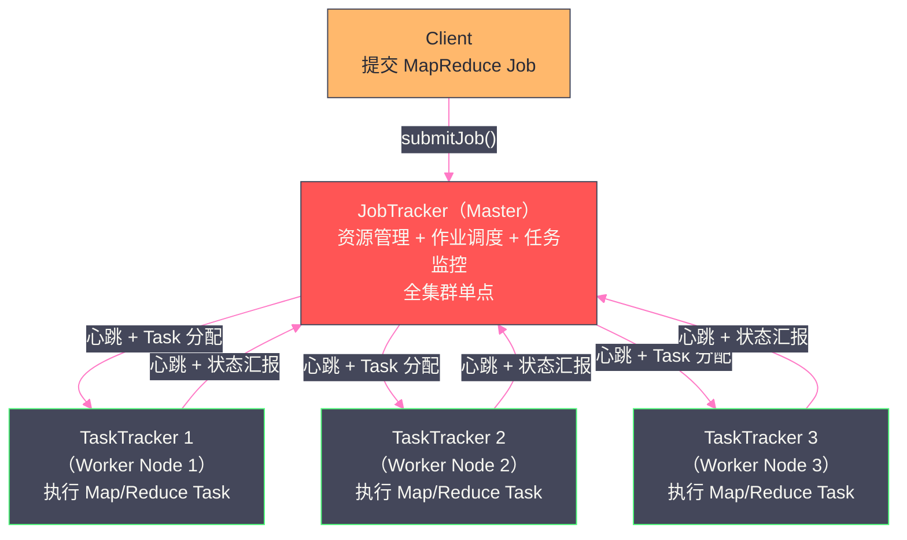
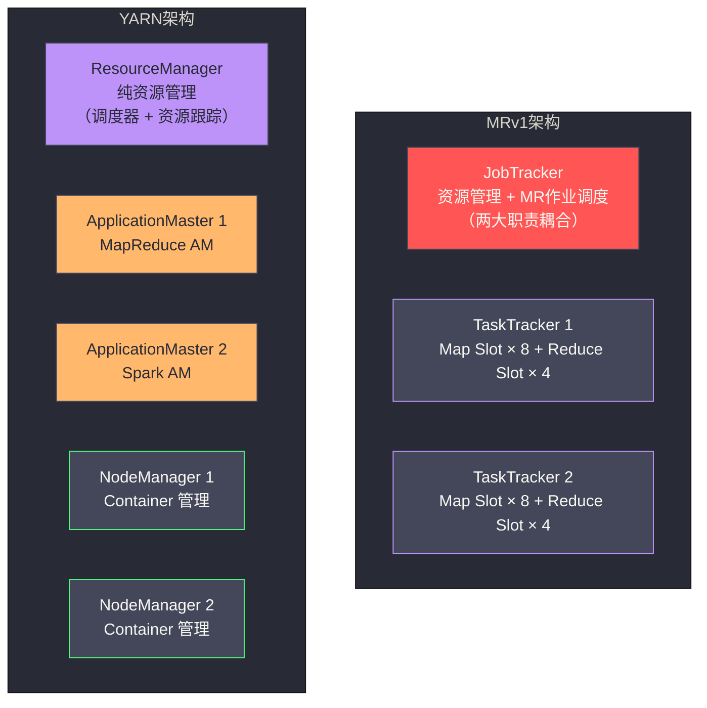

# YARN 的诞生——从 MRv1 到资源管理与计算分离

## 摘要

本文从历史演进的视角，深度解析 Apache YARN 诞生的工程动机。Hadoop 1.x 的 MRv1 架构中，JobTracker 承担了资源管理和作业调度的双重职责——这个设计在小规模集群上运行良好，但随着集群规模突破 4000 节点，四个根本性缺陷开始显现：单点瓶颈导致的扩展性上限、资源槽（Slot）静态划分造成的利用率低下、计算框架强绑定带来的生态封闭、以及 JobTracker 的单点故障风险。YARN 通过将"资源管理"与"作业调度"彻底分离，引入 ResourceManager + NodeManager + ApplicationMaster 的三层架构，从根本上解决了这四个问题。理解这段演进历史，是理解 YARN 每一个设计决策背后逻辑的起点。

---

## 第 1 章 Hadoop 1.x 的资源管理：一切从 JobTracker 说起

### 1.1 MapReduce 的计算模型与执行框架

在理解 MRv1 的架构缺陷之前，我们需要先建立一个基础认知：**MapReduce 不只是一种编程模型，也是一套完整的执行框架**。

MapReduce 编程模型的核心思想非常简单：将大规模数据处理问题分解为两个阶段——
- **Map 阶段**：对输入数据的每条记录独立执行转换，输出中间键值对
- **Reduce 阶段**：将相同 key 的中间值聚合，输出最终结果

这个模型的优雅之处在于它的确定性：Map 之间完全独立（无通信），Reduce 之间也完全独立，框架只需要处理好中间数据的分发（Shuffle）即可。这种无共享（Share-Nothing）的设计使得 MapReduce 天然适合大规模分布式执行。

但**编程模型**和**执行框架**是两回事。MapReduce 编程模型定义了"用户写什么代码"，执行框架则定义了"这些代码怎么在集群上跑"。在 Hadoop 1.x（MRv1）中，执行框架由两个核心守护进程构成：**JobTracker** 和 **TaskTracker**。

### 1.2 MRv1 的双核架构：JobTracker 与 TaskTracker

MRv1 是一个典型的 **Master-Worker** 架构：

- **JobTracker**（运行在 Master 节点，全集群唯一）：整个 MapReduce 集群的大脑，负责接收用户提交的 Job，将 Job 切分为 Map Task 和 Reduce Task，在集群中调度执行，并监控所有 Task 的运行状态
- **TaskTracker**（运行在每个 Worker 节点，与 DataNode 共部署）：负责在本地节点上执行 JobTracker 分配的 Task，并定期向 JobTracker 汇报 Task 的运行状态和本节点的资源情况



**JobTracker 的职责清单**：

在 MRv1 中，JobTracker 承担了极其繁重的职责，几乎是整个集群的"全能管家"：

1. **接收 Job 提交**：接收 Client 提交的 Job，验证输入路径、输出路径等基本参数
2. **资源跟踪**：维护所有 TaskTracker 的心跳，跟踪每个节点的 Slot 使用情况（可用 Map Slot 数、可用 Reduce Slot 数）
3. **Task 调度**：根据数据本地性（Data Locality）和 Slot 可用情况，决定将哪个 Task 分配给哪个 TaskTracker
4. **Task 状态监控**：跟踪所有 Task 的运行状态（RUNNING、SUCCEEDED、FAILED），处理 Task 失败和重试
5. **Job 状态管理**：维护每个 Job 的整体进度，判断 Job 何时完成（所有 Task 都成功）
6. **Speculative Execution**：检测执行缓慢的 Task（Straggler），启动推测执行副本提高 Job 完成速度

这个设计在 Hadoop 早期（集群规模几百台节点）运行良好。但当 Yahoo 等公司开始将 Hadoop 集群扩展到 4000+ 节点时，MRv1 的裂缝开始显现。

---

## 第 2 章 MRv1 的四大根本性缺陷

### 2.1 缺陷一：JobTracker 的单点瓶颈——扩展性天花板

**问题描述**：

每个 TaskTracker 每隔 `mapred.tasktracker.expiry.interval`（默认 10 分钟，实践中通常配置为 3 秒）向 JobTracker 发送一次心跳，心跳中包含当前节点的 Slot 使用情况和正在运行的 Task 状态。

在一个有 N 个 TaskTracker 的集群中，JobTracker 每秒需要处理 N/3 个心跳（以 3 秒心跳间隔计算）。当 N = 4000 时，JobTracker 每秒需要处理约 1333 个心跳 RPC，同时还要为这些心跳的响应中携带 Task 分配决策——每个心跳响应都需要 JobTracker 运行调度算法，决定是否给该 TaskTracker 分配新的 Task。

这是一个严重的**计算密集 + I/O 密集**双重压力：
- 计算密集：调度算法在大量 Task 和大量 TaskTracker 中做匹配，时间复杂度随集群规模平方增长
- 内存密集：需要在内存中维护所有 Job、Task、TaskTracker 的状态，4000 节点集群的状态数据量已经非常可观

**实测数据**：Yahoo 的工程师在 2011 年的论文中报告，MRv1 在 4000 节点集群上开始出现明显的调度延迟，TaskTracker 心跳响应时间超过 1 秒（正常应在毫秒级），导致 Task 分配效率急剧下降。LinkedIn 的测试显示，当集群超过 5000 节点时，JobTracker 的 GC 停顿频率高到无法接受。

**根本原因**：JobTracker 的架构是单线程事件循环（虽然后来加入了部分多线程优化），所有的心跳处理和调度决策都在同一个 JVM 进程中串行或有限并行地执行。**单进程的处理能力有物理上限，不可能通过增加机器水平扩展**——这与 HDFS NameNode 的内存瓶颈是同一类问题。

> [!info] 核心概念：为什么 MRv1 不能简单地"加一台 JobTracker"来扩展？
> JobTracker 维护了整个集群所有 Task 的调度状态——哪个 Task 在哪个 TaskTracker 上运行、Task 完成了多少 Map Task、哪个 Map Task 的输出在哪台机器上（供 Reduce Task 读取）。这些状态是高度耦合的，无法简单地切分给多个 JobTracker 分别管理。要实现多 JobTracker，需要对整个调度模型做根本性的重新设计。

### 2.2 缺陷二：Slot 静态划分——资源利用率低下

**问题描述**：

MRv1 用 **Slot（槽位）** 作为资源分配的基本单位。每个 TaskTracker 配置固定数量的 Map Slot 和 Reduce Slot：

```xml
<!-- mapred-site.xml -->
<property>
  <name>mapred.tasktracker.map.tasks.maximum</name>
  <value>8</value>  <!-- 这台节点最多同时运行 8 个 Map Task -->
</property>
<property>
  <name>mapred.tasktracker.reduce.tasks.maximum</name>
  <value>4</value>  <!-- 这台节点最多同时运行 4 个 Reduce Task -->
</property>
```

这个配置在集群初始化时确定，运行时**静态不变**。一个 Slot 代表"可以运行一个 Task 的资源量"，但 Slot 的实际资源含义是模糊的——它不精确对应到 CPU 核数或内存大小，只是一个抽象的"任务槽位"。

**静态划分带来了两个严重问题**：

**问题 A：Map Slot 和 Reduce Slot 不能相互借用**

作业执行有明显的阶段性：Map 阶段时，所有 Map Task 并行运行，Reduce Task 还没开始；等 Map 阶段完成，才开始 Reduce 阶段。

这意味着在 Map 阶段，集群上所有的 Reduce Slot 都是**空闲**的——它们什么也不做，但也不能被 Map Task 使用（因为类型不匹配）。在 Reduce 阶段，Map Slot 又大量空闲。

一个有 8 个 Map Slot 和 4 个 Reduce Slot 的节点，在作业执行的大部分时间里，有 4 个 Slot 处于强制空闲状态。在整个集群维度，这意味着平均 30%~50% 的资源利用率浪费在 Map/Reduce Slot 的类型不匹配上。

**问题 B：Slot 粒度固定，不能匹配 Task 的实际资源需求**

一个 Map Task 可能只需要 512MB 内存，而另一个 Map Task（处理复杂的连接操作）可能需要 4GB 内存——但它们都占用"1 个 Map Slot"。在内存需求小的 Task 上，Slot 预留的资源大量浪费；在内存需求大的 Task 上，如果实际使用的内存超过 Slot 的"预期分配量"，可能引发 OOM，而框架层面没有合理的隔离机制。

> [!warning] 生产避坑：MRv1 的 Slot 资源超用问题
> 在 MRv1 时代，生产集群中经常出现这样的场景：一个内存占用较高的 Map Task 触发了 OOM Killer，被操作系统强制杀死，导致整个 TaskTracker 进程变得不稳定，影响同一节点上其他 Task 的执行。由于缺乏 CGroups 等硬性资源隔离机制，MRv1 无法从根本上阻止一个"坏" Task 消耗超过预期的资源并影响"好邻居"。

### 2.3 缺陷三：计算框架强绑定——生态封闭

**问题描述**：

MRv1 不只是资源管理系统，它同时也是 MapReduce 计算框架的执行引擎。这意味着：在 Hadoop 1.x 集群上，**只能运行 MapReduce 作业**。

但 2010 年前后，大数据处理的需求已经远远超出了 MapReduce 能处理的范围：

- **迭代计算**（机器学习算法如 K-Means、PageRank）：MapReduce 每轮迭代都需要将中间结果写回 HDFS，再由下一轮 MapReduce 读取，磁盘 I/O 开销极大，性能远落后于内存迭代计算框架（如 Spark 的 RDD 机制）
- **流处理**（实时数据管道）：MapReduce 是批处理模型，有分钟级甚至小时级的延迟，无法满足实时流处理（如事件驱动的告警系统）的需求
- **图计算**（社交网络分析、推荐算法）：需要大量节点间通信的图算法在 MapReduce 模型下极难高效实现，Apache Giraph 等图计算框架（基于 BSP 模型）需要独立的执行引擎
- **交互式查询**（业务分析师的即席查询）：MapReduce 的启动开销（分钟级）使得交互式查询体验极差，Impala、Presto 等 MPP 查询引擎需要绕开 MapReduce

每种计算需求都催生了一个新的计算框架，但这些框架都**无法共享同一个 Hadoop 集群的资源**。公司不得不为 Hadoop MapReduce、Spark 集群、Impala 集群分别部署独立的硬件资源，造成严重的资源浪费：某时刻 MapReduce 集群资源空闲而 Spark 集群资源紧张，两边资源无法互通。

**这是 MRv1 最深层的架构局限**：它将"资源管理"和"MapReduce 计算框架"深度耦合在一起，无法支持其他计算框架共享同一套硬件资源。

> [!note] 设计哲学：为什么 MRv1 会走向耦合？
> MRv1 的架构设计来自 Google 2004 年的 MapReduce 论文，当时 Google 内部的主要数据处理需求就是 MapReduce——将资源管理和 MapReduce 调度耦合在 JobTracker 中，是一个合理的"够用就好"的设计选择。但随着大数据处理需求的多样化，这个"够用就好"变成了"严重不够用"。
>
> 这个演进过程反映了一个软件工程的普遍规律：系统的初始设计总是针对当时的需求，当需求扩展超出初始设计的边界时，往往需要对架构进行根本性的重构，而不只是打补丁。YARN 对 MRv1 的重构，正是这个规律的经典案例。

### 2.4 缺陷四：JobTracker 的单点故障风险

**问题描述**：

MRv1 没有 JobTracker 的高可用（HA）机制。整个集群只有一个 JobTracker 进程，一旦 JobTracker 所在机器宕机或 JobTracker 进程崩溃：

1. 所有正在运行的 Job 立即失败（因为 Task 状态只在 JobTracker 内存中维护，不持久化）
2. 集群无法接受任何新的 Job 提交
3. 管理员需要手动重启 JobTracker，重启过程中所有 Job 的状态从内存中丢失，需要用户重新提交所有作业

在大规模生产集群中，JobTracker 进程的 Full GC 停顿（因内存压力导致）、网络抖动、机器重启等事件时有发生。每次 JobTracker 不可用都意味着集群完全停止工作，对上层业务造成严重影响。

MRv1 后期（0.21 版本后）引入了有限的 JobTracker HA 支持，但实现较为粗糙，需要借助第三方故障检测工具，且恢复时间较长（分钟级），不是一个真正可靠的生产级 HA 方案。

---

## 第 3 章 YARN 的设计目标：分离关注点

面对 MRv1 的四大缺陷，Apache YARN（Yet Another Resource Negotiator，另一个资源协调者）的设计目标清晰而明确——用一句话概括：

> **将"集群资源管理"与"具体计算框架的作业调度"彻底分离，使资源管理层成为通用基础设施，让任何计算框架都能运行在同一个资源管理层之上。**

### 3.1 关注点分离的核心思想

YARN 的核心设计决策是：**JobTracker 的职责太重，必须将其职责分拆给专门的组件**。

MRv1 中，JobTracker 承担的职责可以分为两类：
- **资源管理类**：跟踪集群资源（Slot）、分配资源给 Task、处理 TaskTracker 心跳
- **作业调度类**：接收 Job 提交、将 Job 切分为 Task、跟踪 Task 状态、处理 Task 失败重试

YARN 将这两类职责彻底分开：

**资源管理类职责 → ResourceManager（RM）**：RM 是 YARN 中全集群唯一的资源管理者，负责跟踪集群的所有资源（CPU、内存）并分配给各应用。RM **不关心**任何具体应用（MapReduce 作业、Spark 作业等）的内部调度逻辑。

**作业调度类职责 → ApplicationMaster（AM）**：每个提交到 YARN 的应用（Job）都有一个专属的 ApplicationMaster 进程，负责这个应用内部的 Task 调度和状态管理。AM 向 RM 申请资源（Container），在 Container 中启动实际的 Task。不同计算框架（MapReduce、Spark、Flink）实现各自的 AM，YARN 只管资源分配，不关心 AM 内部怎么调度 Task。

这个关注点分离，从根本上解决了 MRv1 的四大缺陷：

| MRv1 缺陷 | YARN 的解决方案 |
|---|---|
| JobTracker 单点扩展性瓶颈 | RM 只做资源管理（职责大幅缩减），扩展性大幅提升；每个 AM 只管自己的应用（不在 RM 中集中）|
| Slot 静态划分，利用率低 | Container 化资源分配（精确的 CPU + 内存），无 Map/Reduce 类型区分，资源可被任意类型 Task 使用 |
| 计算框架强绑定 | AM 与计算框架耦合，RM 与计算框架完全解耦，任何框架实现自己的 AM 即可接入 YARN |
| JobTracker 单点故障 | RM 的状态持久化到 ZooKeeper，支持主备切换；AM 的状态持久化，支持重启恢复 |

### 3.2 Container：从 Slot 到精确资源描述的跨越

YARN 彻底废弃了 MRv1 的 Slot 概念，用 **Container（容器）** 替代。Container 是 YARN 资源分配的基本单元，每个 Container 代表集群上一组精确的资源量：

```
Container = { vcores: N, memory: M MB }
```

与 Slot 相比，Container 的关键区别：

**资源类型丰富**：Container 明确描述了 CPU（虚拟核数）和内存（MB），而不是模糊的"一个 Slot"。YARN 3.x 还扩展了 GPU 资源（`yarn.io/gpu`）、FPGA 资源等。

**资源量可变**：不同 Container 可以申请不同大小的资源量。一个轻量级 Mapper Container 可以申请 `{vcores:1, memory:512MB}`，一个内存密集型 Reducer Container 可以申请 `{vcores:1, memory:4GB}`，框架根据实际需求精确申请，避免资源浪费。

**无类型区分**：Container 不区分是给 Map Task 用还是给 Reduce Task 用——Container 只是一组资源，它里面运行什么进程由 ApplicationMaster 决定。这消除了 MRv1 中 Map Slot 和 Reduce Slot 不能互用的问题。

> [!info] 核心概念：Container ≠ Docker 容器
> YARN 的 Container 是一个**逻辑资源单元**，不是 Docker 容器。默认情况下，YARN 通过 CGroups 对 Container 进行资源隔离，但 Container 中运行的进程仍然是普通的 JVM 进程（如 MapReduce Task 或 Spark Executor），不是容器镜像。YARN 3.x 引入了对 Docker 容器的支持（通过 `DockerContainerExecutor`），此时 Container 确实会对应一个 Docker 容器实例，但这是一个可选的高级功能，而不是 Container 概念的基本含义。

---

## 第 4 章 YARN 的诞生背景与 Apache 社区历史

### 4.1 YARN 项目的起源

YARN 的设计工作始于 2010 年，最初由 Yahoo 的工程师主导（尤其是 Arun Murthy、Vinod Kumar Vavilapalli 等人），核心动机正是 Yahoo 自己遭遇的 MRv1 扩展性瓶颈——Yahoo 在 2010 年运营着世界上最大的几个 Hadoop 集群，包含超过 4000 个节点，JobTracker 的性能问题已经严重影响了日常的大数据处理工作。

YARN 的设计思路最初在一篇 2013 年的论文 **"Apache Hadoop YARN: Yet Another Resource Negotiator"**（Vavilapalli et al., SOCC 2013）中被正式发表，标志着 YARN 从工程实践上升为学术可引用的架构设计。

### 4.2 版本演进时间线

| 时间节点 | 事件 | 意义 |
|---|---|---|
| 2010 年 | Yahoo 启动 YARN 设计 | 响应 MRv1 在 4000 节点集群上的性能瓶颈 |
| 2012 年 | Hadoop 0.23 首次引入 YARN 代码 | YARN 作为实验性功能进入 Apache 主线 |
| 2013 年 | Hadoop 2.0 正式发布 | YARN 成为 Hadoop 2.x 的标准资源管理层，MRv1 官方不再推荐 |
| 2013 年 | Spark 1.0 发布 Spark on YARN 支持 | 证明了 YARN 框架无关性的工程可行性 |
| 2015 年 | Hadoop 2.6 发布 | YARN Timeline Service v1、NodeLabel 等特性成熟 |
| 2017 年 | Hadoop 3.0 发布 | YARN Federation（支持超大规模集群）、GPU 资源、Container Resizing |
| 2023 年 | Hadoop 3.3.x | YARN 持续演进，支持 Kubernetes 集成、Submarine（深度学习调度）|

### 4.3 YARN 解决了哪些问题，留下了哪些问题

YARN 成功解决了 MRv1 的核心缺陷，但也引入了新的复杂性，并且有一些问题 YARN 选择了"合理的妥协"而不是彻底解决：

**YARN 成功解决的问题**：
- 单点扩展性：RM 只做资源管理，集群规模可以扩展到 10000+ 节点
- 资源利用率：Container 精确资源分配，动态分配无类型约束，集群资源利用率可达 80%+
- 框架多样性：MapReduce、Spark、Flink、Storm 等都可以运行在同一个 YARN 集群上

**YARN 引入的新复杂性**：
- **三方协调复杂度**：RM、NM、AM 之间的协调协议比 MRv1 的 JobTracker-TaskTracker 协议复杂得多，出现问题时的排查难度更高
- **AM 单点**：虽然 RM 支持 HA，但每个应用的 AM 仍然是单点——AM 宕机后，RM 会重新启动 AM（AM 重启），但 AM 重启后需要从 NM 重新获取所有 Container 的状态，这个恢复过程有延迟
- **数据本地性的弱化**：在存算一体架构下，YARN 仍然能通过 `Node Locality` 偏好做数据本地性调度；但在存算分离架构下，数据本地性不再存在，YARN 的调度优势削弱

**YARN 合理妥协的问题**：
- **资源隔离的不完整性**：YARN 默认使用 CGroups 做内存和 CPU 隔离，但在早期版本中，内存限制的执行依赖于外部脚本（`DefaultContainerExecutor`），并不是真正意义上的硬隔离；`LinuxContainerExecutor` + CGroups 才是完整的隔离，但配置较为复杂
- **调度延迟**：YARN 的心跳驱动调度（NM 心跳时 RM 才分配 Container）引入了调度延迟，对短时 Task 不友好（这也是 Kubernetes 调度延迟更低的原因之一）

---

## 第 5 章 YARN 的框架无关性：一个资源管理层，多个计算框架

### 5.1 框架无关性的实现机制

YARN 的框架无关性不是一句口号，而是通过严格的架构设计实现的。RM 与具体计算框架之间的解耦点在于：**RM 只与 ApplicationMaster 交互，不关心 AM 的内部逻辑**。

RM 对 AM 的唯一认知是：
1. AM 是一个在 YARN Container 中运行的 JVM 进程
2. AM 会向 RM 发起资源申请（`allocate` RPC），说明"我需要多少个 Container、每个 Container 有多少资源、偏好哪些节点"
3. RM 根据集群资源状态和调度策略，将 Container 分配给 AM
4. AM 与 NodeManager 交互，在分配到的 Container 中启动实际的 Task 进程

至于 AM 内部如何决定申请多少个 Container、如何监控 Task 运行、如何处理 Task 失败——这些完全由各框架的 AM 实现自己决定，RM 完全不干涉。

这就是 YARN 框架无关性的本质：**通过标准化"资源申请接口"（AM 与 RM 之间的 ApplicationMasterProtocol），将资源管理与计算逻辑解耦**。

### 5.2 各计算框架的 ApplicationMaster 实现

| 计算框架 | ApplicationMaster 实现 | 核心调度策略 |
|---|---|---|
| MapReduce | `MRAppMaster`（`org.apache.hadoop.mapreduce.v2.app.MRAppMaster`）| 按 InputSplit 数量申请 Mapper Container，按 Reducer 数申请 Reducer Container |
| Spark | `SparkYarnClient` + `ApplicationMaster`（`org.apache.spark.deploy.yarn.ApplicationMaster`）| 申请 Driver Container，再按 `--num-executors` 申请 Executor Container |
| Flink | `YarnApplicationMasterRunner`（Flink YARN 模块）| 申请 JobManager Container，再动态申请 TaskManager Container |
| Tez | `DAGAppMaster` | 按 DAG 拓扑动态申请 Container，支持 Mapper/Reducer 之间的内存数据传递（减少 HDFS 读写）|
| Storm | `StormMasterCommand` AM | 申请 Nimbus Container 和 Supervisor Container，保持长时运行 |

这个表格揭示了一个重要事实：YARN 的"框架无关性"是双向的——对上层框架来说，YARN 只是一个资源提供者；对下层 YARN 来说，各个框架都是等价的资源消费者，没有任何一个框架有特权。这使得 MapReduce 作业和 Spark 作业可以公平地竞争同一个 YARN 集群的资源，并由调度器统一管理资源分配策略。

### 5.3 YARN 与 MRv1 的核心架构对比



---

## 第 6 章 小结：演进的本质是关注点分离

MRv1 的四大缺陷，归根结底是一个软件工程的根本问题：**单一组件（JobTracker）承担了过多职责，违反了"单一职责原则"**。随着系统规模增大，这个职责过重的单点成为整个系统的性能、可用性和扩展性的瓶颈。

YARN 的解决方案体现了"**关注点分离（Separation of Concerns）**"的设计哲学：
- **ResourceManager** 只关心"集群有多少资源、该把资源分给谁"
- **NodeManager** 只关心"这台机器上的 Container 的生命周期"
- **ApplicationMaster** 只关心"我这个应用需要多少资源、我的 Task 运行得怎么样"

这三者各司其职，通过清晰定义的协议接口（RPC）相互协作。这个设计不仅解决了 MRv1 的瓶颈，更为大数据生态系统的多样化计算需求奠定了可扩展的基础设施。

下一篇文章，我们将深入 YARN 的三大核心组件——ResourceManager、NodeManager 和 ApplicationMaster 的内部结构，解析它们各自承担的具体职责以及三者之间的交互协议。

---

## 参考资料

- Vavilapalli, V. K. et al. (2013). *Apache Hadoop YARN: Yet Another Resource Negotiator*. SOCC 2013.
- Apache Hadoop 官方文档：[YARN Architecture](https://hadoop.apache.org/docs/current/hadoop-yarn/hadoop-yarn-site/YARN.html)
- Dean, J. & Ghemawat, S. (2004). *MapReduce: Simplified Data Processing on Large Clusters*. OSDI 2004.
- 博客：[Hadoop——JobTracker 和 TaskTracker 演变成 YARN](https://blog.csdn.net/qq_22938671/article/details/104559708)
