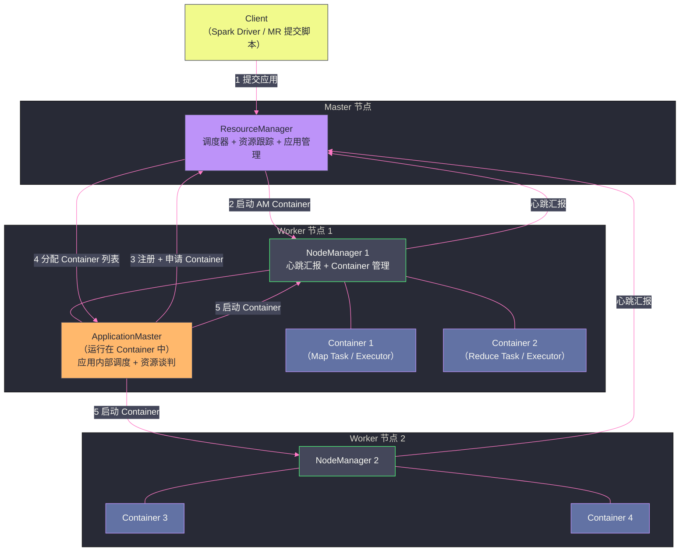
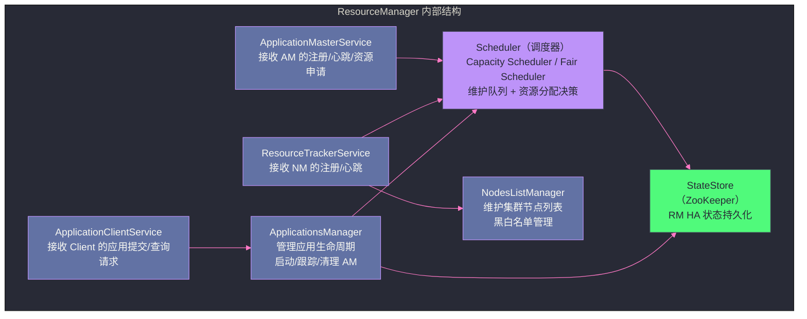
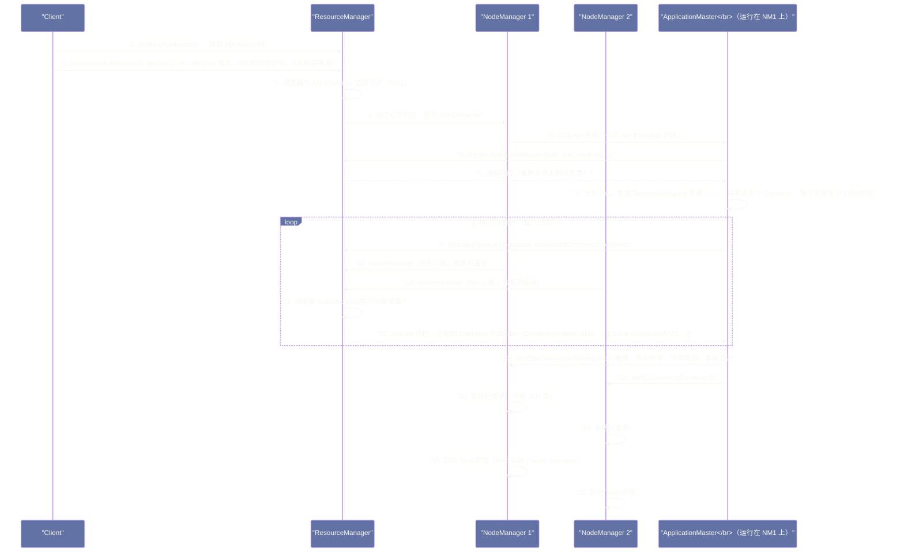

# YARN 整体架构全景——ResourceManager、NodeManager 与 ApplicationMaster 三角协作

## 摘要

本文系统拆解 YARN 的整体架构：三大核心组件 ResourceManager（RM）、NodeManager（NM）、ApplicationMaster（AM）的职责边界，以及它们之间的四套协作协议（`ApplicationClientProtocol`、`ApplicationMasterProtocol`、`ContainerManagementProtocol`、`ResourceTracker`）。文章重点剖析三个工程问题：**为什么 AM 需要向 RM 注册而不是直接申请 Container**、**NM 的心跳为什么是调度触发的核心机制**、**一个应用从提交到第一个 Task 开始执行的完整调用链**。理解这三大组件的职责边界和协作协议，是读懂后续调度器、Container 生命周期等所有深度章节的基础。

---

## 第 1 章 从 MRv1 到 YARN：架构图的演变

上一篇文章建立了 YARN 诞生的历史背景：MRv1 的 JobTracker 职责过重，YARN 的核心解决思路是"关注点分离"。现在我们进入 YARN 的具体架构。

YARN 的整体架构可以用下面这张图概括：



这张图揭示了 YARN 架构的关键特征：
- RM 只和 NM、AM 通信，**不直接和 Task 通信**
- AM 和 NM 直接通信（启动 Container），**不经过 RM**
- 每个应用有自己独立的 AM 实例，AM 之间互相隔离

接下来，我们分别深入三大组件的内部结构。

---

## 第 2 章 ResourceManager：集群资源的唯一仲裁者

### 2.1 RM 的职责边界

ResourceManager（RM）是 YARN 中**全集群唯一**的资源仲裁者。它的职责可以用一句话概括：**知道集群有多少资源，并决定把这些资源分给谁**。

注意这个定义的边界：RM 只关心"分给谁"，**不关心分出去的资源被用来做什么**。一旦 RM 把某批 Container 分配给某个 AM，RM 就不再管这些 Container 里跑什么进程、进程执行得怎么样。这是 YARN "关注点分离"设计哲学的核心体现。

RM 的完整职责清单：

**资源侧职责**：
- 接收所有 NodeManager 的心跳，维护集群中每个节点的资源状态（总资源、已用资源、可用资源）
- 根据 NM 心跳维护集群全局的资源视图（`SchedulerNode`）
- 当 NM 汇报 Container 完成/失败时，回收对应的资源，重新标记为可用

**应用侧职责**：
- 接收 Client 的应用提交请求（`submitApplication`），为应用分配一个 AM Container 并启动 AM
- 接收 AM 的注册（`registerApplicationMaster`）和资源申请（`allocate`）
- 根据调度器算法，从可用资源中为 AM 分配 Container 列表
- 接收 AM 的应用完成通知，清理应用状态

**调度侧职责**：
- 内置调度器（Capacity Scheduler 或 Fair Scheduler），实现资源分配策略（队列管理、优先级、抢占）

RM **不负责**的事情：
- Container 的实际启动（这是 NM 的职责）
- Task 的运行状态监控（这是 AM 的职责）
- Task 失败的重试（这是 AM 的职责）

### 2.2 RM 的内部模块结构

RM 内部由多个子模块组成，每个模块负责一个独立的功能域：



**`ApplicationClientService`（ACS）**：对外暴露 `ApplicationClientProtocol` RPC 接口，供 Spark Driver、MR 提交脚本等 Client 调用。Client 通过这个接口提交应用、查询应用状态、终止应用。

**`ApplicationMasterService`（AMS）**：对外暴露 `ApplicationMasterProtocol` RPC 接口，供 AM 调用。AM 通过这个接口注册自身、申请/释放 Container、汇报应用进度。

**`ResourceTrackerService`（RTS）**：对外暴露 `ResourceTracker` RPC 接口，供 NM 调用。NM 通过这个接口注册节点、发送心跳、汇报 Container 状态。

**`Scheduler`（调度器）**：YARN 的核心组件，实现 `ResourceScheduler` 接口。调度器维护"队列树"结构，根据调度策略（公平性、优先级等）决定将 Container 分配给哪个 AM。YARN 内置了 Capacity Scheduler（默认）和 Fair Scheduler，也支持自定义调度器。

**`ApplicationsManager`（ASM）**：管理所有应用的生命周期——跟踪每个应用的 AM 运行状态，处理 AM 失败后的重启，接收 AM 的完成通知并清理应用状态。

### 2.3 调度器是 RM 的大脑：为什么调度是 RM 的核心

调度器（Scheduler）是 RM 中最复杂、最重要的组件，理解它的角色需要回答一个问题：**调度决策在什么时刻触发？**

在 MRv1 中，调度是"主动推送"的：JobTracker 维护一个 Task 列表，当 TaskTracker 心跳时，JobTracker 主动将 Task 分配给 TaskTracker。

在 YARN 中，调度是**"心跳驱动的拉取"**：

1. NM 每隔 `yarn.nodemanager.heartbeat.interval-ms`（默认 1000ms，即 1 秒）向 RM 发送心跳
2. RM 的 `ResourceTrackerService` 收到 NM 心跳后，调用调度器的 `nodeUpdate()` 方法，通知调度器"某个节点有了新的资源状态"
3. 调度器在 `nodeUpdate()` 中执行分配逻辑——遍历等待分配的 AM 的资源请求，看是否有可以在这个节点上满足的请求
4. 如果有匹配的请求，调度器将 Container 分配给对应 AM，并将分配结果放入"待通知" 队列
5. AM 下次调用 `allocate()` 心跳时，RM 将已分配的 Container 列表返回给 AM

这个"心跳驱动"的设计有一个重要含义：**Container 的分配不是实时的，而是有延迟的**。一个 AM 提交了资源请求，不会立即收到 Container——它需要等待下一个 NM 心跳触发调度器运行，再等待下一个 AM 心跳来获取分配结果。在默认配置下，这个延迟约为 1~2 秒。

> [!info] 核心概念：为什么不用"事件驱动"而用"心跳驱动"？
> 理论上可以设计成"AM 提交资源请求后 RM 立即计算并推送 Container 分配结果"的实时模式，但这会带来严重问题：RM 需要同时处理来自数千个 AM 的并发申请，实时调度会导致 RM 的 CPU 持续高负载。心跳驱动模式将调度计算均摊到所有 NM 的心跳周期上，RM 每秒只需要执行 NM 数量次调度（每个 NM 心跳触发一次），不会因为 AM 请求激增而过载。这是一个典型的"用延迟换稳定性"的工程权衡。

---

## 第 3 章 NodeManager：节点资源的本地守护者

### 3.1 NM 的职责边界

NodeManager（NM）运行在集群的每个 Worker 节点上，是 YARN 在节点层面的代理。如果说 RM 是"集群资源的分配者"，NM 就是"单个节点资源的执行者"。

NM 的完整职责：

**对 RM 侧**：
- 启动时向 RM 注册（`registerNodeManager`），上报节点的总资源量（CPU 核数、内存、可选的 GPU 数量）
- 每隔 1 秒向 RM 发送心跳（`nodeHeartbeat`），汇报本节点当前运行的 Container 列表及其状态
- 将 Container 的完成/失败事件通过心跳告知 RM，使 RM 能及时回收资源

**对 AM 侧**：
- 接收 AM 的 `startContainers` RPC 请求，在本节点上启动 Container 进程
- 接收 AM 的 `stopContainers` RPC 请求，停止/杀死指定 Container
- 向 AM 返回 Container 的运行状态

**本地资源管理**：
- 管理 Container 的本地化资源（Localization）：在 Container 启动前，从 HDFS 下载应用所需的 JAR 包、配置文件、用户 Token 到本地磁盘，并维护本地资源缓存
- 通过 [[Linux CGroups]] 对 Container 的 CPU 和内存使用进行硬性限制（在 `LinuxContainerExecutor` 模式下）
- 监控 Container 的内存使用，超过限制的 Container 会被强制杀死

NM **不负责**的事情：
- 决定在哪个节点启动 Container（这是 RM 调度器的职责）
- 决定启动什么应用（这是 AM 的职责）
- 跟踪 Task 的业务层面进度（这是 AM 的职责）

### 3.2 NM 的心跳机制：YARN 的神经脉冲

NM 的心跳是 YARN 整个系统运转的"脉搏"。每次 NM 心跳，RM 都会在响应中捎带对 NM 的操作指令：

NM 心跳请求（`NodeHeartbeatRequest`）携带的信息：
- `NodeStatus`：当前正在运行的所有 Container 的状态（RUNNING、COMPLETE、FAILED）
- `keepAlive`：表明节点在线
- `nodeLabels`：节点标签（如 `gpu`、`highmem` 等）

RM 心跳响应（`NodeHeartbeatResponse`）携带的指令：
- `containersToCleanup`：需要停止/清理的 Container 列表（例如，AM 已经告诉 RM 某个 Container 不再需要，RM 通过下一个心跳响应通知 NM 清理）
- `applicationTokensToCleanup`：需要清理的应用 Token（应用已完成）
- `nodeAction`：节点动作（`NORMAL`、`RESYNC`）——`RESYNC` 告诉 NM 重新向 RM 注册（发生在 RM 重启后，NM 的注册信息丢失）

> [!note] 设计哲学：心跳响应捎带指令的设计
> YARN 的心跳响应捎带指令（Piggybacking）是一种常见的分布式系统设计模式：不为每种控制操作单独建立连接或协议，而是利用已有的心跳通道捎带控制消息。这样做的好处是减少了网络连接数（NM 只需要和 RM 维护一个持久 RPC 连接），缺点是控制指令的传达有心跳延迟（最多 1 秒）。对于 YARN 的 Container 管理场景，这个延迟是可以接受的。

### 3.3 Container 本地化（Localization）：Task 启动前的准备工作

Container 启动之前，NM 需要为它准备运行环境——将 Task 需要的文件从 HDFS 下载到本地磁盘。这个过程称为 **Container 本地化（Localization）**。

本地化需要下载的资源分为三类：

**APPLICATION 级别资源**：整个应用共享，只在应用第一个 Container 启动时下载一次，后续 Container 直接复用本地缓存。典型的 APPLICATION 级别资源是应用的 JAR 包（如 Spark 的 `spark-assembly.jar`）、用户代码 JAR（如 `my-spark-app.jar`）。

**CONTAINER 级别资源**：每个 Container 独有，每次启动 Container 都重新下载，Container 退出后清理。典型的 CONTAINER 级别资源是 Container 的启动脚本（`launch_container.sh`）、Container 的私有配置文件。

**PUBLIC 级别资源**：全节点共享，只要同一台机器上任何应用的任何 Container 第一次用到某个 PUBLIC 资源，NM 会下载到本地公共缓存，后续所有应用都可以复用。典型的 PUBLIC 资源是 Hadoop 的公共库 JAR。

本地化的资源存放路径由 `yarn.nodemanager.local-dirs` 配置，通常挂载在本地高速磁盘上（避免本地化 I/O 成为瓶颈）。本地化过程由 NM 的 `LocalizationService` 负责，它维护一个资源缓存，避免重复下载相同的资源。

> [!warning] 生产避坑：本地化缓存目录磁盘空间管理
> YARN 的本地化资源会在 `yarn.nodemanager.local-dirs` 目录下累积。NM 有定期清理的机制，但如果磁盘空间不足（低于 `yarn.nodemanager.disk-health-checker.min-free-space-per-disk-mb`，默认 0），NM 会停止在该磁盘上启动新 Container，甚至将该磁盘标记为不健康并上报 RM。生产环境需要为 `yarn.nodemanager.local-dirs` 配置专用磁盘，并监控其使用率。

---

## 第 4 章 ApplicationMaster：应用的内部大脑

### 4.1 AM 是什么，为什么每个应用都需要一个独立的 AM

**ApplicationMaster（AM）** 是每个 YARN 应用专属的调度代理。当 Client 提交一个应用（比如一个 Spark 作业）时，RM 会先启动一个专门的 Container 来运行这个应用的 AM；然后由 AM 负责这个应用内部的所有调度逻辑。

这个设计解答了 MRv1 最核心的扩展性问题：在 MRv1 中，所有 Job 的调度逻辑都集中在 JobTracker 中，JobTracker 是集中式的单点瓶颈。在 YARN 中，每个应用有自己的 AM，AM 运行在 Worker 节点上的 Container 中，调度逻辑被**分散**到了各个 AM，RM 只处理高层的资源分配，不处理 Task 级别的细节。

这样，即使有 10000 个并发应用，RM 的负载也只是处理 10000 个 AM 的资源申请（这是 RM 能力范围内的），而不是 10000 个应用的数百万个 Task 的调度决策。每个 AM 只管自己的应用，负载分散。

**不同计算框架的 AM 实现**：

AM 是一个接口（`ApplicationMaster` 协议），不同的计算框架实现自己的 AM：
- **MapReduce AM**（`MRAppMaster`）：负责将 Job 切分为 Map Task 和 Reduce Task，按 InputSplit 申请 Mapper Container，等 Map 完成后申请 Reducer Container，监控所有 Task 状态，处理 Task 失败重试
- **Spark AM**（`org.apache.spark.deploy.yarn.ApplicationMaster`）：负责启动 Spark Driver（如果是 cluster 模式），然后根据 Driver 的请求申请 Executor Container，监控 Executor 心跳
- **Flink AM**（`YarnApplicationMasterRunner`）：负责启动 JobManager Container，根据 Job 的并行度申请 TaskManager Container

这些 AM 的内部调度逻辑完全不同，但它们与 YARN RM 交互的接口是统一的（`ApplicationMasterProtocol`），因此 YARN RM 不需要为每种框架做任何修改。

### 4.2 AM 的生命周期

AM 从被 RM 启动到最终退出，经历以下几个阶段：

**阶段一：AM Container 启动**

当 Client 提交应用后，RM 的 `ApplicationsManager` 为该应用分配一个 `AM Container`，并通知某个 NM 启动这个 Container。AM Container 中运行的进程就是该应用的 AM 主程序（例如 MapReduce 的 `MRAppMaster` 类的 `main()` 方法）。

**阶段二：AM 向 RM 注册**

AM 启动后，首先向 RM 发送 `registerApplicationMaster` RPC，告知 RM：
- AM 的主机名和端口（供 Client 查询应用状态使用）
- AM 的 Tracking URL（Web UI 地址，用于在 YARN UI 中跳转到应用详情页）

注册之后，AM 才能开始向 RM 申请 Container。这个"先注册、再申请"的两步设计，使 RM 能在 AM 发起资源申请之前建立 AM 的完整上下文。

**阶段三：资源申请与 Container 分配（循环）**

AM 向 RM 发送 `allocate` RPC（AM 的心跳），携带：
- 新的 Container 申请（`ResourceRequest` 列表）
- 已完成使用的 Container 列表（释放资源）
- 应用进度（0.0~1.0 之间的浮点数）

RM 在响应中返回：
- 新分配的 Container 列表（`AllocatedContainers`）
- 已完成的 Container 状态（用于通知 AM 某个 Container 已退出）
- 抢占请求（如果调度器决定抢占 AM 的某些 Container，会在响应中包含抢占通知）

AM 收到分配的 Container 后，向对应的 NM 发送 `startContainers` RPC 启动 Task 进程。

**阶段四：应用完成与 AM 退出**

当所有 Task 完成（或作业失败），AM 向 RM 发送 `finishApplicationMaster` RPC，告知应用完成状态（`SUCCEEDED`、`FAILED`、`KILLED`），然后 AM 进程退出。RM 收到通知后，清理该应用的所有状态，回收 AM Container 的资源。

---

## 第 5 章 四套协作协议：YARN 的交互骨架

YARN 的三大组件通过四套 RPC 协议交互。理解这四套协议，就理解了 YARN 的完整通信架构。

### 5.1 ApplicationClientProtocol：Client 与 RM 的接口

**方向**：Client → RM

**主要 RPC**：

| RPC 方法 | 调用时机 | 说明 |
|---|---|---|
| `submitApplication` | 提交应用 | Client 提交应用描述（AM 的启动命令、AM Container 的资源需求等）|
| `killApplication` | 终止应用 | 强制停止正在运行的应用 |
| `getApplicationReport` | 查询应用状态 | 获取应用的当前状态、进度、AM URL 等 |
| `getClusterNodes` | 查询集群节点 | 获取所有 NM 的状态信息 |
| `getQueueUserAcls` | 查询队列权限 | 获取当前用户在各队列的权限 |
| `getNewApplication` | 获取新应用 ID | 获取一个全局唯一的 `ApplicationId`（提交 Job 的第一步）|

`ApplicationClientProtocol` 是用户/Client 能接触到的 YARN 接口。`hadoop jar`、`spark-submit`、`flink run` 等命令行工具底层都是通过这个协议与 RM 通信的。

### 5.2 ApplicationMasterProtocol：AM 与 RM 的心跳通道

**方向**：AM → RM

**主要 RPC**：

| RPC 方法 | 调用时机 | 说明 |
|---|---|---|
| `registerApplicationMaster` | AM 启动后一次 | AM 向 RM 注册，提供 AM 的 host/port/trackingUrl |
| `allocate` | 周期性（AM 心跳）| AM 的核心接口：携带新申请的资源请求 + 完成的 Container + 应用进度；响应中包含 RM 分配的 Container |
| `finishApplicationMaster` | AM 完成时一次 | 通知 RM 应用完成，携带最终状态 |

`allocate` 是最重要的接口，它是双向通信的融合——AM 发送资源请求和进度，RM 返回分配的 Container 和抢占通知。这个设计将"请求"和"心跳"合并到一个接口，减少了 RPC 连接数。

AM 的 `allocate` 调用频率由 `yarn.app.mapreduce.am.scheduler.heartbeat.interval-ms`（对 MapReduce）或 `spark.yarn.scheduler.heartbeat.interval-ms`（对 Spark）控制，默认约 1 秒一次。

### 5.3 ContainerManagementProtocol：AM 与 NM 的直连通道

**方向**：AM → NM

**主要 RPC**：

| RPC 方法 | 调用时机 | 说明 |
|---|---|---|
| `startContainers` | AM 收到 RM 分配的 Container 后 | 告知 NM 启动一批 Container，携带每个 Container 的启动命令、环境变量、本地资源列表 |
| `stopContainers` | AM 需要停止某个 Container 时 | 告知 NM 停止/杀死指定的 Container（例如某个 Task 已完成，其他副本不再需要）|
| `getContainerStatuses` | AM 查询 Container 状态 | 查询指定 Container 的当前状态（运行中、已退出等）|

这是 YARN 架构中非常关键的设计点：**AM 直接与 NM 通信，不经过 RM**。这意味着 RM 不是 Container 启动指令的中转站——RM 只决定"把资源分配给谁"，但"如何启动 Container"完全由 AM 和 NM 之间直接协商完成。

这个设计大大降低了 RM 的负载：在一个有 10000 个并发 Task 的集群中，所有 Task 的启动请求直接打到各个 NM，不经过 RM，RM 的 RPC 压力只来自 NM 的心跳和 AM 的 allocate 心跳，而不是所有 Task 的启动请求。

> [!info] 核心概念：AM 如何知道去哪个 NM 启动 Container？
> RM 在 `allocate` 响应中返回分配的 Container 列表，每个 Container 对象包含 `nodeId`（NM 的主机名 + 端口）字段。AM 收到 Container 后，直接通过 `nodeId` 联系对应的 NM，发起 `startContainers` 请求。AM 不需要向 RM 查询"这个 Container 该去哪个 NM"，Container 对象本身就携带了目标 NM 的地址信息。

### 5.4 ResourceTracker：NM 与 RM 的心跳通道

**方向**：NM → RM

**主要 RPC**：

| RPC 方法 | 调用时机 | 说明 |
|---|---|---|
| `registerNodeManager` | NM 启动时一次 | NM 向 RM 注册，汇报节点总资源（CPU 核数、内存、标签等）|
| `nodeHeartbeat` | 每秒一次 | NM 的核心心跳：汇报 Container 状态变化；RM 在响应中携带对 NM 的操作指令 |

`ResourceTracker` 是 YARN 最高频的协议——每个 NM 每秒发一次心跳。在一个 1000 节点的集群中，RM 的 `ResourceTrackerService` 每秒处理约 1000 次 `nodeHeartbeat` RPC，每次处理都会触发调度器的 `nodeUpdate()` 执行一次调度决策。这是 YARN 的主要调度触发机制。

---

## 第 6 章 一个 Job 的完整生命旅程：从提交到第一个 Task 执行

通过一个完整的交互时序图，串联前面介绍的所有组件和协议：



关键步骤解读：

**步骤 1~2（Client 提交）**：Client 先调用 `getNewApplication()` 获取全局唯一的 `ApplicationId`，再调用 `submitApplication()` 提交应用描述。AM 的启动命令（如 `${JAVA_HOME}/bin/java MRAppMaster`）、AM 所需资源（CPU、内存）都包含在 `submitApplication` 的参数中。

**步骤 3~5（AM 启动）**：RM 为 AM Container 选择一个节点，通过下一个 NM 心跳的响应通知 NM1 启动 AM Container。NM1 收到指令后，本地化 AM 需要的资源，然后执行 AM 的启动命令，AM 进程在 NM1 上运行起来。

**步骤 6~8（AM 注册）**：AM 向 RM 注册自身，然后分析 Job 内容，生成需要申请的 Container 资源列表。这个分析过程对不同框架完全不同——MapReduce AM 读取 HDFS 上的输入目录，按 128MB 的 Block 大小计算需要多少个 Mapper；Spark AM 根据用户传入的 `--num-executors` 和 `--executor-memory` 生成 Container 申请。

**步骤 9~12（资源谈判）**：这是整个 YARN 交互中最重要的循环。AM 发送资源申请，NM 发送心跳触发调度器，调度器将 Container 分配给 AM，AM 在下次心跳响应中收到已分配的 Container 列表。这个循环持续到作业完成。

**步骤 13~15（Container 启动）**：AM 收到分配的 Container 后，直接联系对应 NM，发送 `startContainers` 请求，携带 Task 的启动命令（如 `java YarnChild` 对 MapReduce Task，或 `java CoarseGrainedExecutorBackend` 对 Spark Executor）。NM 本地化资源后，启动 Task 进程。

> [!warning] 生产避坑：AM Container 启动失败的排查路径
> 当应用提交后长时间不开始（卡在 ACCEPTED 状态），通常是 AM Container 启动失败或无法被调度。常见原因：
> 1. **AM Container 资源需求超过集群单节点资源上限**：例如 AM 申请 8GB 内存，但集群所有节点的 `yarn.nodemanager.resource.memory-mb` 只配置了 4GB，AM Container 永远无法被调度
> 2. **AM Container 所在队列没有可用资源**：集群整体资源充足但目标队列已满，需要等待队列中其他作业释放资源
> 3. **NodeManager 全部处于 UNHEALTHY 状态**：节点磁盘满或其他健康检查失败，NM 被 RM 标记为不可用
>
> 排查命令：`yarn application -status <appId>` 查看应用状态；`yarn logs -applicationId <appId>` 查看应用日志（包括 AM 启动日志）

---

## 第 7 章 Resource Model：YARN 的资源抽象层

### 7.1 Resource 对象：精确描述一个 Container 需要多少资源

YARN 用 `Resource` 对象描述资源量。在早期版本中，`Resource` 只包含内存和 CPU；在 Hadoop 3.x 中，`Resource` 扩展为支持任意资源类型的泛化容器：

```java
// YARN 的 Resource 数据结构（简化展示）
public abstract class Resource {
    // 内存（单位：MB）
    public abstract long getMemorySize();
    
    // CPU 虚拟核数（vCores）
    public abstract int getVirtualCores();
    
    // Hadoop 3.x 扩展：通用资源（GPU、FPGA 等）
    // key: 资源名称（如 "yarn.io/gpu"）
    // value: 资源数量
    public abstract Map<String, Long> getResources();
}
```

**为什么用"虚拟核数（vCores）"而不是"物理核数"？**

物理 CPU 核的概念在 YARN 中难以直接使用，原因是不同型号的机器 CPU 性能差异巨大——一台老机器的 8 核 CPU 和一台新机器的 8 核 CPU，实际计算能力相差几倍。YARN 引入"虚拟核数（vCores）"这个抽象，允许管理员为每台机器配置适当的 `yarn.nodemanager.resource.cpu-vcores`（如老机器配 8，新机器配 16），让调度器在"标准化的虚拟 CPU 单位"上做资源分配，而不是直接暴露物理差异。

### 7.2 ResourceRequest：AM 申请 Container 的完整描述

AM 向 RM 申请 Container 时，不是简单地说"我要 10 个 Container"，而是通过 `ResourceRequest` 精确描述每个申请的约束条件：

```java
// ResourceRequest 的核心字段
public class ResourceRequest {
    // 数据本地性偏好：希望在哪个节点/机架/任意位置运行
    // 通常是 HDFS Block 所在节点的主机名、机架名或 "*"（任意）
    private String resourceName;  // e.g. "host1.example.com", "/rack1", "*"
    
    // 每个 Container 需要的资源量
    private Resource capability;  // e.g. {memory: 4096, vcores: 1}
    
    // 申请的 Container 数量
    private int numContainers;
    
    // 是否允许放宽本地性约束（relaxLocality）
    // true：如果指定节点没有资源，可以分配到同机架或任意节点
    // false：严格要求必须在指定节点
    private boolean relaxLocality;
    
    // 所属优先级（优先级高的请求先被调度）
    private Priority priority;
    
    // 节点标签表达式（Hadoop 3.x）
    // e.g. "gpu" 表示只在有 gpu 标签的节点上运行
    private String nodeLabelExpression;
}
```

**数据本地性（Data Locality）的三个级别**

对于需要处理 HDFS 数据的 Task（如 MapReduce Mapper），AM 会为同一个数据块生成三个层次的 `ResourceRequest`：
1. **节点本地（Node-Local）**：`resourceName` = 数据块所在的某个 DataNode 的主机名，优先级最高
2. **机架本地（Rack-Local）**：`resourceName` = 数据块所在节点的机架名（如 `/rack1`），中等优先级
3. **任意位置（Off-Rack）**：`resourceName` = `"*"`，最低优先级

调度器按照优先级顺序处理：如果指定节点有可用资源，分配节点本地的 Container；否则尝试同机架；否则任意节点。这个三级本地性机制是 YARN 实现数据本地性优化的核心手段。

---

## 第 8 章 小结：三角协作的工程精髓

YARN 的三大组件 RM、NM、AM 共同构成了一个精心设计的三角协作关系：

**RM 是资源仲裁的权威**：它知道整个集群的资源全貌，但不关心资源被用来做什么。RM 的职责极度聚焦，确保了它在超大规模集群（10000+ 节点）下仍然能高效工作。

**NM 是节点的忠实执行者**：它只关心"这台机器上发生了什么"，忠实地执行来自 AM 的 Container 启动指令，定期向 RM 汇报节点状态。NM 的无状态性（除了本地资源缓存外，NM 不维护应用的业务逻辑状态）使其极易水平扩展和故障恢复。

**AM 是应用的聪明大脑**：它只关心"我这个应用怎么最高效地使用分配到的资源"，针对自己的计算框架特性（MapReduce 的数据本地性、Spark 的内存计算）做最优化的资源利用策略。

这三者的职责边界清晰而严格，通过四套标准化协议交互，不存在"跨越职责边界"的操作。这正是 YARN 能支持多框架、能扩展到超大规模的根本原因。

下一篇文章，我们深入 ResourceManager 的内部——调度器的实现细节、资源抽象模型的工程设计，以及 RM HA 机制的工作原理。

---

> [!note] 思考题
> 1. ResourceManager 是 YARN 集群的全局资源仲裁者，所有计算框架都通过 AM 向 RM 申请资源。RM 不了解具体的作业逻辑，只负责资源分配。这种设计的代价是：RM 无法做"预知"调度——它不知道一个 Spark 作业未来还需要多少资源，只能响应当前的资源申请。在什么场景下，这种"无预知"调度会导致资源分配不优化？Gang Scheduling（全有全无调度）是如何在这个框架下实现的？
> 2. NodeManager 负责管理单个节点上的 Container 生命周期，向 RM 汇报本节点的资源状况。NM 上报的资源量（CPU、内存）是静态配置的（`yarn.nodemanager.resource.memory-mb`），而不是动态检测的实际可用资源。如果节点上运行了 YARN 之外的进程（如系统守护进程、监控 Agent）占用了大量内存，NM 仍然会向 RM 声明配置的内存量可用，导致 Container 申请量超过实际可用量，引发 OOM。如何解决这个"资源超售"问题？
> 3. AM 与 RM 之间通过心跳（`allocate()` 调用）来申请和释放资源。AM 在每次心跳时可以同时发送资源申请（ResourceRequest）和资源释放（ContainerRelease）。如果 AM 在申请了大量 Container 之后崩溃（还没有使用这些 Container），这些已分配但未使用的 Container 如何被回收？RM 会因为 AM 心跳超时而自动回收吗？

## 参考资料

- Apache Hadoop 官方文档：[YARN Architecture](https://hadoop.apache.org/docs/current/hadoop-yarn/hadoop-yarn-site/YARN.html)
- Apache Hadoop 官方文档：[Writing YARN Applications](https://hadoop.apache.org/docs/current/hadoop-yarn/hadoop-yarn-site/WritingYarnApplications.html)
- Vavilapalli et al. (2013). *Apache Hadoop YARN: Yet Another Resource Negotiator*. SOCC 2013.
- Apache Hadoop 源码：`org.apache.hadoop.yarn.server.resourcemanager.ResourceManager`
- Apache Hadoop 源码：`org.apache.hadoop.yarn.server.nodemanager.NodeManager`
