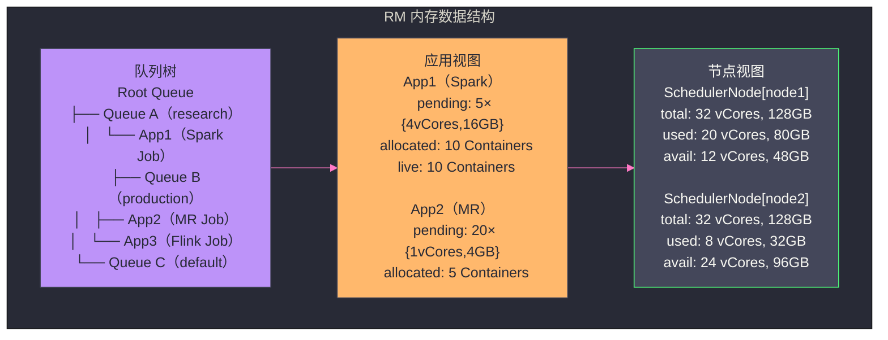
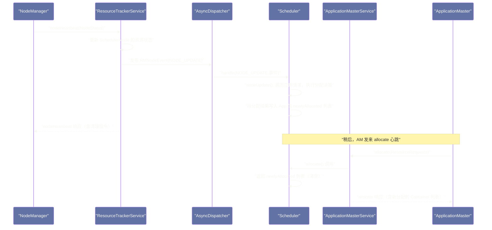

# ResourceManager 深度解析——调度器内核与资源抽象模型

## 摘要

本文深入 ResourceManager 的内核，重点剖析三个核心问题：**调度器的内部数据结构**（RM 如何在内存中表示集群所有节点的资源状态和所有应用的资源需求）、**调度触发机制**（NM 心跳如何驱动调度算法执行，以及调度算法如何在毫秒级内完成决策）、**资源抽象的设计取舍**（为什么 YARN 的资源模型采用 CPU + 内存的二维向量，以及 Hadoop 3.x 如何将其扩展为支持 GPU 等任意资源类型）。理解 RM 的内部实现，是读懂后续 Capacity Scheduler 和 Fair Scheduler 深度解析的基础。

---

## 第 1 章 RM 的内存数据结构全景

ResourceManager 是 YARN 的中枢，它需要在内存中实时维护整个集群的完整资源状态。理解 RM 的内存数据结构，是理解调度算法为什么能在毫秒级完成决策的前提。

### 1.1 RM 内存中的三类核心数据

RM 的内存可以分为三个维度的数据：

**维度一：节点视图（Node View）**

RM 为集群中的每个 NodeManager 维护一个 `SchedulerNode` 对象，记录该节点的：
- 总资源量（`totalResource`）：该节点 NM 启动时注册上报的总 CPU vCores 和内存 MB
- 已分配资源量（`allocatedResource`）：当前在该节点上运行的所有 Container 消耗的资源总和
- 可用资源量（`availableResource` = `totalResource` - `allocatedResource`）
- 正在运行的 Container 列表（`launchedContainers`）
- 节点标签（`nodeLabels`）：如 `gpu`、`highmem` 等

所有 `SchedulerNode` 的可用资源之和，就是整个集群的可用资源池。

**维度二：应用视图（Application View）**

RM 为每个正在运行的应用维护一个 `SchedulerApplication` 对象（以及对应的 `SchedulerApplicationAttempt`），记录：
- 应用的 `ApplicationId` 和所属队列
- AM 已经申请但尚未被满足的资源请求列表（`ResourceRequest` 列表，按优先级分层）
- 已经分配但 AM 尚未启动（未发出 `startContainers`）的 Container 列表（`newlyAllocatedContainers`）
- AM 已启动的 Container 列表（`liveContainers`）
- 应用的优先级

**维度三：队列视图（Queue View）**

YARN 的调度器通过"队列"组织资源分配策略。RM 内部维护一棵**队列树**（`Queue Tree`），每个队列节点包含：
- 队列的资源分配策略参数（如 Capacity Scheduler 的 `capacity`、`maximum-capacity`）
- 队列当前的已用资源量（`usedResource`）
- 队列中等待被调度的应用列表

以下是这三类数据在 RM 内存中的关系：



### 1.2 为什么要把资源状态全部加载到内存？

RM 把集群所有节点和所有应用的资源状态都维护在内存中（而不是写入数据库），原因与 HDFS NameNode 的设计选择相同：**调度决策必须在毫秒级完成**。

每次 NM 心跳触发调度时，调度器需要遍历等待调度的应用列表，为每个应用检查其 `ResourceRequest` 是否能在当前心跳的节点上满足——这需要在极短时间内（理想情况下 <1ms）完成大量匹配运算。如果每次调度决策都需要访问数据库，即使是最快的 MySQL 查询也需要 1~5ms，在 1000 节点集群每秒 1000 次心跳的场景下，数据库 I/O 将成为不可接受的瓶颈。

全内存的代价是 RM 重启后状态丢失——YARN 通过 ZooKeeper 状态存储解决 RM HA 的状态恢复问题，我们将在第 08 篇详述。

---

## 第 2 章 调度触发机制：心跳驱动的事件模型

### 2.1 YARN 的事件驱动架构

YARN RM 的内部实现是一个**事件驱动（Event-Driven）架构**，基于 `AsyncDispatcher`（异步事件分发器）构建。RM 的各个组件通过发布和订阅事件进行通信，而不是直接方法调用。

主要的事件类型包括：
- `RMNodeEventType`：节点相关事件（节点注册、心跳收到、节点失效等）
- `SchedulerEventType`：调度器相关事件（节点更新、应用添加、Container 完成等）
- `RMAppEventType`：应用生命周期事件（应用提交、AM 注册、应用完成等）
- `RMContainerEventType`：Container 状态事件（Container 分配、启动、完成、杀死等）

当 NM 发来心跳时，`ResourceTrackerService` 处理心跳后，发布一个 `RMNodeEvent`（类型为 `NodeUpdate`），`AsyncDispatcher` 将此事件路由给 `SchedulerEventHandler`，后者调用调度器的 `handle(SchedulerEvent)` 方法执行调度决策。



### 2.2 调度器的 nodeUpdate() 核心逻辑

`nodeUpdate()` 是调度器最核心的方法，每次 NM 心跳都会触发它。以 Capacity Scheduler 为例，`nodeUpdate()` 的执行逻辑：

**第一步：处理已完成的 Container**

NM 心跳中包含已完成（退出）的 Container 列表。调度器首先处理这些退出事件：将对应 Container 从应用的 `liveContainers` 中移除，回收其资源（更新 `SchedulerNode.allocatedResource`），触发 `RMContainerEventType.FINISHED` 事件通知应用。

**第二步：尝试为等待中的应用分配新 Container**

这是 `nodeUpdate()` 的核心部分。调度器遍历队列树，按照优先级和调度策略，尝试在当前心跳的节点上为等待的应用分配 Container：

```
// nodeUpdate() 的核心逻辑（伪代码，展示调度决策流程）
void nodeUpdate(RMNode rmNode) {
    SchedulerNode node = getSchedulerNode(rmNode.getNodeID());

    // 1. 处理已完成的 Container，回收资源
    for (ContainerStatus cs : rmNode.getCompletedContainers()) {
        completedContainer(cs);  // 从 App 中移除，回收到 node.availableResource
    }

    // 2. 尝试分配新 Container
    // Capacity Scheduler 按队列层级遍历，找到最"饥饿"（used/capacity 最低）的叶队列
    // 再从该队列中选择最优先的 Application
    // 再从该 Application 的 ResourceRequest 中找到能在此 Node 满足的请求
    assignContainers(node);
}

void assignContainers(SchedulerNode node) {
    // 按层级遍历队列树，找到最需要被调度的叶队列（具体策略因 CS/FS 而异）
    LeafQueue queue = selectQueueToSchedule();
    if (queue == null) return;  // 所有队列都满足，无需调度

    // 从队列中选择最优先的 Application
    FiCaSchedulerApp app = queue.selectApplicationToSchedule();
    if (app == null) return;

    // 尝试在当前节点为 app 分配 Container
    // 优先检查 NODE_LOCAL > RACK_LOCAL > OFF_RACK 请求
    Resource assigned = app.assignContainers(node);

    if (assigned.getMemory() > 0) {
        // 分配成功：更新 node.allocatedResource 和 app.newlyAllocatedContainers
        node.allocateResource(assigned);
    }
}
```

**第三步：数据本地性的三级降级**

当为应用分配 Container 时，调度器会检查该 NM 节点是否与应用的某个 `ResourceRequest` 匹配：

1. **检查 NODE_LOCAL 请求**：当前节点是否在应用的 `NODE_LOCAL` ResourceRequest 的 `resourceName` 列表中？（即数据块是否在这台机器的本地磁盘上？）
2. **检查 RACK_LOCAL 请求**：如果没有 NODE_LOCAL 匹配，当前节点所在机架是否与某个 `RACK_LOCAL` 请求匹配？
3. **检查 OFF_RACK 请求**：如果前两者都不匹配，是否有 `OFF_RACK`（`resourceName = "*"`）的通用请求？

YARN 在这里有一个**延迟调度（Delayed Scheduling）**机制：当应用有 NODE_LOCAL 请求，但当前节点不是目标节点时，调度器不会立即降级到 RACK_LOCAL——它会等待几次心跳，期望目标节点的下一次心跳带来可用资源，从而实现节点本地分配。只有等待超过 `yarn.scheduler.capacity.node-locality-delay`（默认 40 次心跳）后，才降级到 RACK_LOCAL。

> [!info] 核心概念：为什么延迟调度能提升性能？
> 如果立即降级，Task 就会被调度到非本地节点，读取 HDFS Block 时需要通过网络从远端 DataNode 获取数据（增加网络传输和延迟）。延迟调度通过"等待"让 Task 有机会在数据本地节点启动，节省了网络 I/O。代价是 Task 的启动时间略有延迟（最多延迟 40 秒）。对于读取大量数据的 MapReduce Mapper 来说，这个延迟换来的网络 I/O 节省是值得的；但对于 Spark 的短 Task（运行时间 <10 秒），延迟调度可能得不偿失，需要调整参数。

---

## 第 3 章 资源抽象模型：从二维向量到多维资源

### 3.1 为什么需要抽象"资源"？

在 MRv1 时代，TaskTracker 上的资源用"Slot"（槽位）来表示，一个 Slot 代表"可以运行一个 Task 的能力"，但这个"能力"到底对应多少 CPU 和内存，是由系统管理员通过调参隐式控制的，对用户不透明。

这种模糊性带来了两个问题：
1. **资源隔离难以实现**：由于不知道一个 Task 实际用了多少 CPU/内存，无法为每个 Task 设定精确的资源上限，更无法通过 CGroups 强制限制
2. **调度决策无法优化**：调度器不知道不同 Task 对 CPU 和内存的需求差异，无法做出"CPU 密集型 Task 调度到高 CPU 节点、内存密集型 Task 调度到大内存节点"这样的智能调度决策

YARN 从设计之初就引入了**明确的资源抽象**，要求应用在申请 Container 时精确声明每个 Container 需要的 CPU vCores 和内存 MB。

### 3.2 Resource：YARN 资源向量的设计演进

**Hadoop 2.x 时代：二维资源向量**

早期 YARN 的 `Resource` 对象只有两个维度：
```java
// Hadoop 2.x Resource（简化）
public class Resource {
    private int vcores;      // CPU 虚拟核数
    private long memory;     // 内存（MB）
}
```

这个设计对于"CPU + 内存"为主的通用计算场景是足够的，但随着 AI/ML 工作负载进入大数据平台，GPU 成为关键资源，简单的二维向量不够用了。

**Hadoop 3.x 时代：泛化资源向量**

Hadoop 3.0 引入了 `Resource Profiles` 和泛化资源扩展，`Resource` 对象变为支持任意资源类型：

```java
// Hadoop 3.x Resource（简化）
public abstract class Resource {
    // 固定维度（向后兼容）
    public abstract int getVirtualCores();
    public abstract long getMemorySize();   // 单位：MB

    // 扩展维度（Hadoop 3.x 新增）
    // 通过 ResourceInformation 对象描述任意资源类型
    public abstract ResourceInformation getResourceInformation(String resourceName);
    public abstract Map<String, ResourceInformation> getResources();
}

// ResourceInformation 描述一种扩展资源
public class ResourceInformation {
    private String name;          // 资源名称，如 "yarn.io/gpu"
    private long value;           // 资源数量
    private String units;         // 单位（GPU 通常为空，表示"个"）
    private ResourceTypes resourceType;  // COUNTABLE（可数） 或 ATTRIBUTE
}
```

通过这个扩展，YARN 3.x 可以管理以下资源类型：
- `yarn.io/gpu`：GPU 卡数
- `yarn.io/fpga`：FPGA 卡数
- `memory-mb`：内存（MB）
- `vcores`：虚拟 CPU 核数
- 用户自定义资源（如 `custom.io/tpu`）

**配置示例**（在 `yarn-site.xml` 中声明 GPU 资源）：

```xml
<property>
  <name>yarn.resource-types</name>
  <value>yarn.io/gpu</value>
</property>
<property>
  <name>yarn.nodemanager.resource-plugins</name>
  <value>yarn.io/gpu</value>
</property>
```

### 3.3 最小分配量与规整机制（Normalization）

RM 不会把任意大小的 Container 资源原样分配出去——它有**最小分配量**的概念，所有分配的资源都会被规整（Normalize）到最小分配量的整数倍：

```xml
<!-- yarn-site.xml -->
<property>
  <name>yarn.scheduler.minimum-allocation-mb</name>
  <value>1024</value>  <!-- 内存最小分配单位：1GB -->
</property>
<property>
  <name>yarn.scheduler.minimum-allocation-vcores</name>
  <value>1</value>     <!-- CPU 最小分配单位：1 个 vCore -->
</property>
<property>
  <name>yarn.scheduler.maximum-allocation-mb</name>
  <value>8192</value>  <!-- 单个 Container 内存上限：8GB -->
</property>
<property>
  <name>yarn.scheduler.maximum-allocation-vcores</name>
  <value>4</value>     <!-- 单个 Container CPU 上限：4 个 vCore -->
</property>
```

**规整的工作原理**：

如果 AM 申请 `{memory: 1500MB, vcores: 1}`，但最小分配量是 `1024MB`，RM 会将内存向上规整为 `2048MB`（最小分配量的 2 倍），实际分配 `{memory: 2048MB, vcores: 1}`。

这个规整机制的目的是**减少内存碎片**：如果允许任意大小的内存分配（如 1000MB、1500MB、1200MB），节点内存会被碎片化，可能出现节点剩余 2000MB 但无法满足任何 2048MB 请求的情况。通过强制规整到 1024MB 的整数倍，节点内存总能被整洁地切分。

> [!warning] 生产避坑：规整导致的资源"膨胀"
> 如果 `yarn.scheduler.minimum-allocation-mb` 设置过大（如 4096MB），而作业中有大量小 Container 申请（如 Spark 的 Driver 申请 1GB 内存），每个这样的 Container 实际会被分配 4GB，导致大量资源浪费。建议将 `minimum-allocation-mb` 设置为 512MB 或 1024MB，与集群的主要工作负载需求匹配。

---

## 第 4 章 调度器接口：RM 与调度算法的解耦

### 4.1 ResourceScheduler 接口：调度器的契约

YARN 的调度算法通过 `ResourceScheduler` 接口与 RM 解耦。`ResourceScheduler` 是所有调度器必须实现的接口，它定义了调度器与 RM 其他组件交互的完整契约：

```java
// ResourceScheduler 核心接口（简化）
public interface ResourceScheduler extends YarnScheduler, Recoverable {

    // RM 初始化时调用，配置调度器参数
    void reinitialize(Configuration conf, RMContext rmContext);

    // NM 心跳时触发，核心调度方法
    void nodeUpdate(RMNode rmNode);

    // 新节点加入集群时调用
    void addNode(RMNode rmNode);

    // 节点离开集群时调用
    void lostNode(NodeId nodeId);

    // AM 提交新的资源申请时调用
    Allocation allocate(
        ApplicationAttemptId appAttemptId,
        List<ResourceRequest> ask,
        List<ContainerId> release,
        ...
    );

    // 新应用添加到调度队列
    void addApplicationAttempt(ApplicationAttemptId attemptId, ...);

    // 应用完成时清理
    void doneApplicationAttempt(ApplicationAttemptId attemptId, ...);
}
```

这个接口设计的关键点：**RM 不关心调度器的具体算法**——无论是 Capacity Scheduler 的按比例分配、Fair Scheduler 的公平分配，还是用户自定义的调度算法，只要实现了 `ResourceScheduler` 接口，就可以通过 `yarn.resourcemanager.scheduler.class` 配置项插入到 RM 中使用。

### 4.2 调度器的关键内部数据结构：FiCaSchedulerApp 与 SchedulerNode

**`FiCaSchedulerApp`（FIFO-Capacity Scheduler Application）**

这是 Capacity Scheduler（以及 Fair Scheduler 的类似实现）中代表一个应用的调度视图对象。名字中的 "FiCa" 来自 FIFO + Capacity 的组合，它是调度器眼中对 `SchedulerApplicationAttempt` 的具体化：

```java
// FiCaSchedulerApp 关键状态（简化）
public class FiCaSchedulerApp extends SchedulerApplicationAttempt {

    // 按优先级组织的 ResourceRequest 列表
    // Priority → { resourceName → ResourceRequest }
    private Map<Priority, Map<String, ResourceRequest>> resourceRequests;

    // 已分配但 AM 尚未收到通知的 Container（等待下次 AM 心跳时返回）
    private List<RMContainer> newlyAllocatedContainers;

    // 正在运行的 Container（AM 已经收到并启动了这些 Container）
    private Map<ContainerId, RMContainer> liveContainers;

    // 已消耗的资源总量（用于调度器的抢占和公平性计算）
    private Resource consumed;

    // 尝试分配的超时计数（用于延迟调度的降级判断）
    private Map<Priority, Long> lastScheduledContainer;
}
```

**`SchedulerNode`**

调度器的节点视图，在 NM 注册时创建，心跳时更新：

```java
// SchedulerNode 关键状态（简化）
public abstract class SchedulerNode {

    // 节点总资源（CPU vCores + 内存 MB）
    private Resource totalResource;

    // 已分配资源（所有运行中的 Container 消耗之和）
    private Resource allocatedResource;

    // 可用资源 = totalResource - allocatedResource
    // 注意：这是实时计算的，不是独立维护的字段
    public Resource getAvailableResource() {
        return Resources.subtract(totalResource, allocatedResource);
    }

    // 已分配的 Container 列表
    private Map<ContainerId, RMContainer> launchedContainers;

    // 节点标签（用于节点标签调度）
    private Set<String> labels;

    // 节点所在机架（用于机架感知调度）
    private String rackName;
}
```

### 4.3 调度器的并发模型：为什么调度器需要全局锁？

YARN RM 是多线程的（处理 NM 心跳、处理 AM 心跳、处理 Client 请求各有独立线程池），但调度器的核心逻辑**全部在同一把全局锁下执行**：

```java
// Capacity Scheduler 中的全局调度锁（简化）
public class CapacityScheduler implements ResourceScheduler {
    // 这把 ReadWriteLock 保护所有调度器内部状态
    private final ReentrantReadWriteLock lock = new ReentrantReadWriteLock();
    private final Lock writeLock = lock.writeLock();
    private final Lock readLock = lock.readLock();

    @Override
    public void nodeUpdate(RMNode rmNode) {
        writeLock.lock();   // 调度决策需要修改内部状态，使用写锁
        try {
            // 处理 Container 完成、执行分配决策
            ...
        } finally {
            writeLock.unlock();
        }
    }

    @Override
    public Allocation allocate(ApplicationAttemptId appAttemptId, ...) {
        writeLock.lock();
        try {
            // 更新 ResourceRequest，读取 newlyAllocatedContainers
            ...
        } finally {
            writeLock.unlock();
        }
    }
}
```

**为什么调度器必须用全局锁？**

调度器的内部状态（节点资源、应用请求、队列用量）是高度关联的——分配一个 Container 时，需要同时修改 `SchedulerNode.allocatedResource`、`FiCaSchedulerApp.consumed`、队列的 `usedResource` 三处状态。如果这三处修改不在同一个锁内完成，可能出现以下竞态：

- 线程 A（处理 NM1 心跳）正在检查 node1 的可用资源，发现 10GB 可用，决定为 App1 分配 Container
- 线程 B（处理 NM2 心跳）同时也在为 App1 分配 Container，发现同一队列的可用量足够
- 两个线程都提交了分配，导致 App1 的实际分配量超出队列的 `capacity` 限制

全局锁虽然牺牲了调度器的并发性，但保证了**调度决策的正确性**。

> [!note] 设计哲学：Hadoop 3.x 的调度器并发优化
> YARN 社区意识到全局锁是大规模集群调度性能的瓶颈。Hadoop 3.x 引入了调度器的"增量分配"（Incremental Allocation）和"多线程队列遍历"优化，将全局写锁的持有时间缩短，提升调度吞吐量。但核心的"原子分配"逻辑仍然需要锁保护，彻底去锁是极难的工程问题。

---

## 第 5 章 AM 的 allocate 心跳与 RM 的响应机制

### 5.1 AM 的资源请求是如何被 RM 解析的

AM 每次调用 `allocate` 时，携带的 `List<ResourceRequest>` 并不是"增量"的——它是 AM 当前**全量未满足的资源需求**。AM 每次都发送完整的当前需求列表，RM 负责与上次的请求做 diff，更新 AM 的资源需求状态。

这个"全量发送"设计的原因：**避免消息丢失导致的状态不一致**。如果采用增量发送（只发送变化的部分），一旦某次 `allocate` 请求或响应在网络中丢失，AM 和 RM 的视图就会出现永久性的不一致。全量发送使得每次 `allocate` 都是一个"幂等操作"——即使消息重复或丢失，最终状态也能通过重试收敛到正确状态。

### 5.2 Container 的分配时序：AM 心跳和 NM 心跳的交叉

一个容易被忽视的细节：**RM 的调度决策（nodeUpdate）和 AM 收到分配结果是两个独立的时间点**。

当 NM 心跳触发 `nodeUpdate()` 时，调度器将分配的 Container 放入 `FiCaSchedulerApp.newlyAllocatedContainers` 列表，并**不**立即通知 AM。AM 需要在**下一次 `allocate` 心跳**时，才能从响应中取走 `newlyAllocatedContainers` 列表。

这个"分配 → 等待 → AM 取走"的时序意味着：**从 RM 完成调度决策到 AM 实际收到 Container，有 0~1 个 AM 心跳间隔的延迟**（默认约 1 秒）。这 1 秒的延迟在大多数场景下可以忽略，但对于需要快速扩缩容的流处理场景（如 Flink 的动态扩容），这个延迟可能影响响应速度，需要缩短 AM 的心跳间隔（但同时增加 RM 的 RPC 压力）。

### 5.3 RM 对 AM 的黑盒承诺：Allocation 对象

RM 在 `allocate` 响应中返回的 `Allocation` 对象，是 RM 对 AM 的核心承诺：

```java
// Allocation 响应对象
public class Allocation {
    // 新分配的 Container 列表（AM 下次心跳取走）
    // 每个 Container 包含：containerId、nodeId、resource、token
    private List<Container> containers;

    // 已完成的 Container 状态（Task 退出状态、退出码、诊断信息）
    private List<ContainerStatus> completedContainersStatuses;

    // 集群资源使用情况（供 AM 做决策参考）
    private Resource availableResources;

    // 抢占请求（调度器决定需要抢占 AM 的某些 Container 时通知 AM）
    private PreemptionMessage preemptionMessage;

    // NodeManager Token（AM 用于联系 NM 启动 Container 的安全凭证）
    private List<NMToken> nmTokens;
}
```

其中 `nmTokens` 是一个安全设计的体现：AM 不能随意向任何 NM 发送启动 Container 的请求——它必须持有该 NM 的访问 Token，而这个 Token 是 RM 在分配 Container 时通过 `Allocation.nmTokens` 下发给 AM 的。没有 Token，AM 无法与 NM 建立 `ContainerManagementProtocol` 通信，确保了只有 RM 授权的操作才能在 NM 上执行。

---

## 第 6 章 RM 的状态机：应用与 Container 的状态转换

### 6.1 RMApp 的状态机

YARN RM 中的每个应用（`RMApp`）是一个状态机，维护应用从提交到完成的完整生命周期状态：


**`NEW_SAVING` 和 `FINAL_SAVING` 状态**是 YARN RM HA 设计的体现：应用状态在发生关键变更时（提交时、完成时），会先持久化到 ZooKeeper 的 `StateStore` 中，然后才执行后续操作。这确保了即使 RM 在持久化后立即崩溃，重启后也能从 `StateStore` 恢复应用状态，不丢失任何已提交的应用。

### 6.2 RMContainer 的状态机

每个 Container（`RMContainer`）也是一个独立的状态机：

| 状态 | 含义 |
|---|---|
| `NEW` | Container 刚被创建，尚未分配给 AM |
| `ALLOCATED` | 调度器已分配，等待 AM 的 `allocate` 心跳取走 |
| `ACQUIRED` | AM 已通过 `allocate` 收到此 Container，即将发起 `startContainers` |
| `RUNNING` | Container 已在 NM 上启动（NM 心跳确认）|
| `COMPLETED` | Container 已退出（正常退出、失败或被杀死）|
| `EXPIRED` | Container 在 `ALLOCATED` 状态等待太久（AM 未发起启动），被 RM 回收 |

`EXPIRED` 状态是一个重要的防护机制：如果 AM 收到分配的 Container 后，长时间（超过 `yarn.rm.container-allocation.expiry-interval-ms`，默认 600 秒）不发起 `startContainers`，RM 会自动回收这个 Container，防止资源被"持有但不用"的情况。

---

## 第 7 章 小结：RM 是 YARN 可扩展性的基石

ResourceManager 的核心价值在于它的**极度聚焦**：它只做"资源仲裁"这一件事，并且把这件事做到极致。

- **调度器可插拔**：通过 `ResourceScheduler` 接口，YARN 可以在不修改 RM 任何其他代码的情况下切换调度算法
- **资源模型可扩展**：从 `{vcores, memory}` 到 `{vcores, memory, gpu, fpga, ...}`，资源模型的扩展不影响调度器框架
- **心跳驱动的设计**：将调度计算与 NM 心跳解耦，RM 的调度压力随集群规模线性增长而不是指数增长
- **状态机 + StateStore**：所有关键状态变更先写 ZooKeeper 再执行，确保 RM 重启后能完整恢复

下一篇文章，我们深入 Container 的完整生命周期——从 AM 发起 `startContainers` 请求到 Task 进程在 NM 上运行起来，期间发生了哪些具体步骤（本地化、Executor 启动、安全 Token 验证），以及 Container 退出后 RM 和 AM 如何感知并响应。

---

## 参考资料

- Apache Hadoop 官方文档：[YARN Capacity Scheduler](https://hadoop.apache.org/docs/current/hadoop-yarn/hadoop-yarn-site/CapacityScheduler.html)
- Apache Hadoop 源码：`org.apache.hadoop.yarn.server.resourcemanager.scheduler.capacity.CapacityScheduler`
- Apache Hadoop 源码：`org.apache.hadoop.yarn.server.resourcemanager.scheduler.SchedulerNode`
- Vavilapalli et al. (2013). *Apache Hadoop YARN: Yet Another Resource Negotiator*. SOCC 2013.
- Apache Hadoop JIRA：[YARN-2597: Improved container scheduling](https://issues.apache.org/jira/browse/YARN-2597)
