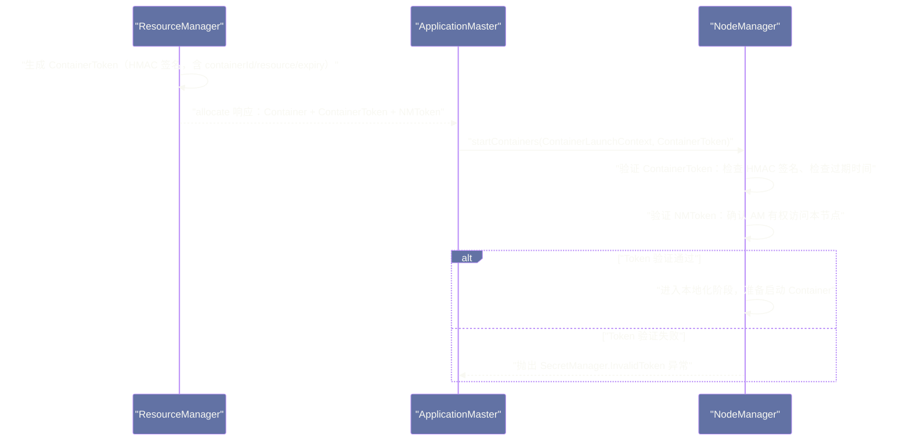
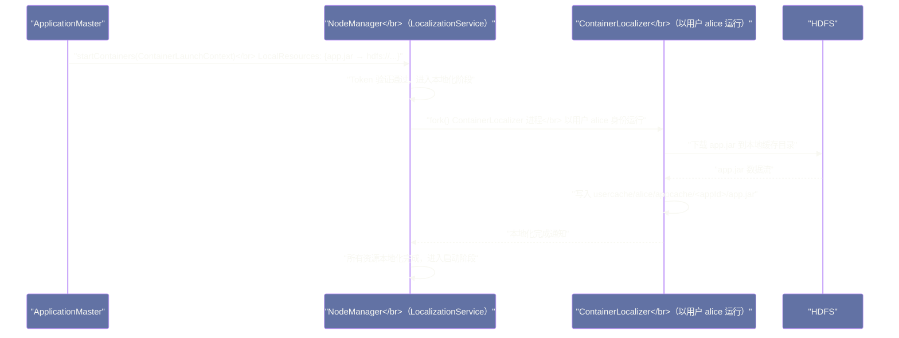
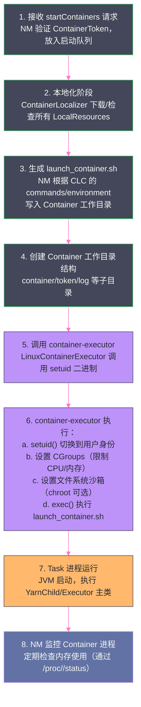
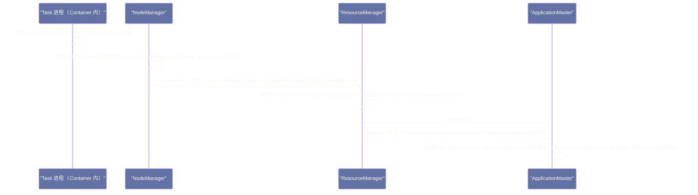

# Container 生命周期——从资源申请到进程启动的完整调用链

## 摘要

本文完整拆解一个 YARN Container 从"RM 调度分配"到"Task 进程真正运行起来"的全路径。这条路径涉及五个阶段：**资源分配**（RM 调度器决定）→ **Container Token 验证**（安全机制）→ **本地化**（NM 从 HDFS 下载依赖文件）→ **Container 启动**（ContainerExecutor 执行启动命令）→ **运行监控与退出处理**（NM 监控 Container 进程，回收资源）。每个阶段都有精心设计的工程细节——为什么本地化要区分 PUBLIC/APPLICATION/CONTAINER 三级缓存、为什么 Container 启动脚本要先写到磁盘再执行、Container OOM 如何被检测并上报。理解这条完整路径，是排查"Task 启动慢"、"Container 频繁被杀"等生产问题的基础。

---

## 第 1 章 Container 的本质：一个受控的操作系统进程

在理解 Container 生命周期之前，先建立一个基础认知：**YARN 的 Container 在操作系统层面就是一个普通的 Linux 进程**（或进程组）。

YARN 的 Container 不是虚拟机，也不是（默认情况下）Docker 容器。当 NodeManager 启动一个 MapReduce Task 的 Container 时，它实际上是在 NM 所在的 Linux 系统上 `fork()` 出一个子进程，执行 `java -cp ... org.apache.hadoop.mapred.YarnChild` 这样的命令。这个进程就是 Container——它在 YARN 的资源模型中被分配了一定量的 CPU vCores 和内存，在操作系统层面通过 CGroups 进行资源限制（在 `LinuxContainerExecutor` 模式下）。

理解这一点的重要性在于：Container 的很多行为（启动时间、内存使用、进程退出码）本质上都是 Linux 进程的行为，用操作系统的视角看待 Container，往往能更清晰地理解问题。

---

## 第 2 章 Container Token：YARN 的安全凭证体系

### 2.1 为什么 Container 需要 Token？

在一个多租户的 YARN 集群上，不同用户的 AM 可能运行在同一个集群中。如果没有安全机制，AM 可以向任意 NM 发送 `startContainers` 请求，在其他用户的节点上执行任意命令——这是严重的安全漏洞。

YARN 通过 **Kerberos + Token** 体系解决这个问题。具体来说，有两个关键 Token：

**Container Token**：RM 在分配 Container 时，为每个 Container 生成一个 `ContainerToken`，并将其包含在 `allocate` 响应返回给 AM。AM 向 NM 发送 `startContainers` 时，必须在请求中携带这个 `ContainerToken`。NM 收到请求后，验证 Token 的合法性（检查签名、检查过期时间），只有合法 Token 的请求才会被执行。

**NM Token**：AM 与 NM 通信需要对 NM 进行身份验证，RM 在分配 Container 时也会下发对应 NM 的 `NMToken`（通过 `Allocation.nmTokens` 返回给 AM），AM 使用 `NMToken` 与 NM 建立安全的 RPC 连接。

这个 Token 机制确保了：
- 只有持有合法 ContainerToken 的 AM 才能在 NM 上启动 Container
- Token 是一次性的（使用后或过期后失效），防止 Token 被重用
- Token 由 RM 签发，NM 可以验证 Token 的合法性而无需与 RM 通信（降低 RM 压力）

### 2.2 Token 验证的工程实现



---

## 第 3 章 Container 本地化：启动前的环境准备

### 3.1 什么是本地化，为什么需要它？

**本地化（Localization）** 是 NM 在启动 Container 之前，将 Container 运行所需的文件从 HDFS（或其他分布式存储）下载到本地磁盘的过程。

为什么不让 Container 进程在运行时自己去 HDFS 读取依赖文件？答案有两点：

**原因一：启动速度**。如果 Container 进程需要在启动时自己去 HDFS 读取所有依赖（如 JAR 文件），每次启动都会有额外的 HDFS I/O 延迟（尤其是 JAR 文件通常有几十 MB 甚至几百 MB）。本地化提前将文件下载到本地磁盘并缓存，后续 Container 可以直接使用缓存，大幅加快启动。

**原因二：HDFS 负载分散**。在一个大型 YARN 集群上，可能同时启动数千个 Container。如果每个 Container 都在启动时并发读取 HDFS 上的同一个 JAR 文件，会对 HDFS 产生巨大的并发读取压力。本地化缓存机制将 HDFS 读取分散到各 NM，每个 NM 只读取一次（后续从本地缓存复用），大幅降低 HDFS 压力。

### 3.2 本地化的三级缓存

NM 将本地化资源分为三个可见性级别，对应三种缓存策略：

**PUBLIC 缓存（全节点共享）**

PUBLIC 资源对这台机器上所有用户的所有 Container 可见，只要任何 Container 第一次使用某个 PUBLIC 资源，NM 将其下载到 `yarn.nodemanager.local-dirs` 下的 `filecache/` 目录，后续所有 Container 直接读本地文件。

典型的 PUBLIC 资源：Hadoop 的公共库（`hadoop-common.jar`、`hdfs.jar` 等）、Spark 的 Assembly JAR（当以 shared 方式分发时）。

PUBLIC 缓存使用**引用计数**管理生命周期：每个使用该资源的 Container 增加引用计数，Container 退出时减少计数，当引用计数为 0 且磁盘空间不足时，NM 的 `LocalizedResourcesTracker` 会淘汰长期未使用的 PUBLIC 资源（LRU 淘汰策略）。

**APPLICATION 缓存（应用内共享）**

APPLICATION 资源对同一应用（同一 `ApplicationId`）的所有 Container 可见，在第一个 Container 本地化时下载，当应用结束（AM 退出）时由 NM 清理。

典型的 APPLICATION 资源：用户提交的应用代码 JAR（如 `my-spark-job.jar`）、应用的配置文件。APPLICATION 缓存路径通常是 `yarn.nodemanager.local-dirs` 下的 `usercache/<username>/appcache/<appId>/`。

**CONTAINER 缓存（Container 独有）**

CONTAINER 资源只属于某个特定 Container，Container 退出后立即清理。典型的 CONTAINER 资源：Container 的启动脚本（`launch_container.sh`）、Container 的私有 Token 文件（`container_tokens`）。

CONTAINER 缓存路径：`usercache/<username>/appcache/<appId>/<containerId>/`。

### 3.3 本地化的实现机制

NM 的本地化过程由两个组件协作完成：

**`LocalizationService`（本地化服务）**：NM 中负责本地化的核心服务，维护本地化请求队列，调度下载任务。

**`ContainerLocalizer`（Container 本地化器）**：NM 为每个 Container 的本地化任务启动一个独立的 `ContainerLocalizer` 进程（不是线程，是独立进程！），以该 Container 的用户身份（通过 `runAs` 机制）从 HDFS 下载资源。

**为什么用独立进程而不是线程来执行本地化？**

安全隔离：使用独立进程可以以 Container 对应的 Linux 用户身份执行下载操作，确保下载的文件属于正确的用户，不会出现 NM 主进程（通常以 `yarn` 用户运行）下载的文件被 Container 进程（以用户 `alice` 运行）访问的权限问题。



### 3.4 本地化的时序对启动延迟的影响

本地化是 Container 启动延迟的主要来源之一。一个典型的 Container 启动时间分解：

| 阶段 | 典型耗时 | 说明 |
|---|---|---|
| RM 调度分配 | 0~1 秒 | 等待 NM 心跳触发调度 |
| AM 取走 Container | 0~1 秒 | 等待 AM 的 `allocate` 心跳 |
| Token 验证 | < 10ms | 纯内存操作 |
| PUBLIC/APPLICATION 资源本地化（缓存命中）| 1~100ms | 检查本地缓存，无需下载 |
| PUBLIC/APPLICATION 资源本地化（缓存未命中）| 5~60 秒 | 从 HDFS 下载 JAR（大小决定时间）|
| CONTAINER 资源生成 | < 100ms | 生成启动脚本、Token 文件 |
| 进程启动（JVM 启动）| 1~3 秒 | JVM 冷启动时间 |

**冷启动 vs. 热启动**：第一个 Container 启动时，PUBLIC 和 APPLICATION 缓存为空，需要从 HDFS 下载所有依赖，启动时间可能长达 30~60 秒。后续 Container 启动时，缓存已热，本地化几乎为零延迟，启动时间降到 3~5 秒（JVM 启动时间为主）。

这就是为什么 Spark 作业的第一个 Executor 启动总是比后续 Executor 慢的原因——第一个 Executor 触发了 Spark Assembly JAR 的 HDFS 下载，后续 Executor 直接复用缓存。

> [!warning] 生产避坑：Spark Assembly JAR 过大导致启动慢
> 旧版本 Spark（1.x/2.x）会将所有依赖打包成单个 `spark-assembly.jar`（通常 150~300MB）。第一次运行时需要将这个大文件上传到 HDFS，然后每个 NM 第一次启动 Spark Executor 时都需要下载它。可以通过以下方式优化：
> 1. 将 `spark-assembly.jar` 预先放在每个 NM 的本地目录，并配置为 PUBLIC 资源路径（绕过 HDFS 下载）
> 2. 使用 `--conf spark.yarn.archive=hdfs://...` 指定已上传到 HDFS 的 Assembly 归档路径（复用，不重复上传）
> 3. Spark 3.x 默认不再打包 Assembly JAR，改为多个小 JAR，可以充分利用本地化缓存

---

## 第 4 章 Container 启动：从 ContainerLaunchContext 到操作系统进程

### 4.1 ContainerLaunchContext：AM 给 NM 的完整启动描述

AM 在调用 `startContainers` 时，需要为每个 Container 提供一个 `ContainerLaunchContext`（CLC），描述如何启动这个 Container：

```java
// ContainerLaunchContext 核心字段（简化）
public abstract class ContainerLaunchContext {

    // 本地资源映射：容器内名称 → HDFS 路径 + 资源类型
    // e.g. "app.jar" → LocalResource{hdfs://nn/jars/app.jar, APPLICATION}
    public abstract Map<String, LocalResource> getLocalResources();

    // 环境变量
    // e.g. "JAVA_HOME" → "/usr/lib/jvm/java-11"
    //      "CLASSPATH" → "./app.jar:./hadoop-common.jar:..."
    public abstract Map<String, String> getEnvironment();

    // 启动命令（列表形式）
    // MapReduce Task 示例：
    // ["/bin/bash", "-c", "$JAVA_HOME/bin/java -Xmx4096m
    //   org.apache.hadoop.mapred.YarnChild ..."]
    // Spark Executor 示例：
    // ["/bin/bash", "-c", "$JAVA_HOME/bin/java -server -Xmx4096m
    //   -XX:+UseG1GC org.apache.spark.executor.CoarseGrainedExecutorBackend ..."]
    public abstract List<String> getCommands();

    // Container Token 文件（供 Task 进程与 NM 通信使用）
    public abstract ByteBuffer getTokens();

    // ACL 设置（谁可以查看/修改此 Container）
    public abstract Map<ApplicationAccessType, String> getApplicationACLs();
}
```

CLC 中最关键的字段是 `getCommands()`——这是实际要执行的命令行。MapReduce 的 `MRAppMaster` 会在 CLC 中设置 `YarnChild` 的启动命令，Spark AM 会设置 `CoarseGrainedExecutorBackend` 的启动命令，Flink AM 会设置 `TaskManagerRunner` 的启动命令。**CLC 的内容完全由 AM 决定，NM 只是忠实地执行它**。

### 4.2 ContainerExecutor：NM 执行 Container 启动的核心组件

NM 的 `ContainerExecutor` 是实际负责创建操作系统进程的组件。YARN 提供了三种 `ContainerExecutor` 实现，安全级别依次增强：

**`DefaultContainerExecutor`（默认，不推荐生产使用）**

以 NM 进程本身的用户身份（通常是 `yarn` 用户）运行所有 Container 进程。所有用户的 Task 都以 `yarn` 用户身份运行，没有用户级别的隔离，存在多租户安全风险（用户 alice 的 Task 可以读写用户 bob 的文件）。

**`LinuxContainerExecutor`（生产推荐）**

以 Container 所属用户（提交作业的用户）的 Linux 身份运行 Container 进程，实现用户级别的隔离。配合 CGroups，可以对 Container 进行硬性的 CPU 和内存资源限制。

`LinuxContainerExecutor` 通过一个名为 `container-executor` 的 **setuid 二进制程序** 实现跨用户启动：

```bash
# container-executor 二进制文件的权限（setuid root）
-rwsr-x--- 1 root hadoop 123456 Jan 1 00:00 /usr/lib/hadoop/bin/container-executor
```

`container-executor` 拥有 setuid 权限（`s` 位），这意味着它以 root 身份运行，从而可以 `setuid()` 切换到任意用户身份启动 Container 进程。整个切换过程由 YARN 框架严格控制，用户无法直接调用 `container-executor`。

**`DockerContainerExecutor`（Hadoop 3.x，实验性）**

以 Docker 容器方式运行 Container，提供完整的容器级别隔离（文件系统、网络、进程空间独立）。适合需要严格多租户隔离或需要自定义运行时环境（特定版本的 Python/TensorFlow 等）的场景。

### 4.3 Container 启动的完整步骤

以 `LinuxContainerExecutor` 为例，Container 启动的完整执行序列：



**步骤 3：生成 `launch_container.sh`** 是一个值得关注的设计细节。NM 不是直接 `exec()` CLC 中的命令，而是先将命令写入一个 shell 脚本文件，再执行这个脚本。这样做的原因：

1. **环境变量的预处理**：CLC 中的环境变量可能包含对其他变量的引用（如 `$CLASSPATH` 引用了 `$HADOOP_CONF_DIR`），写入 shell 脚本后可以利用 shell 的变量展开能力自动处理
2. **启动命令的可审计性**：`launch_container.sh` 文件会保留在 Container 工作目录下，出现问题时可以直接查看这个脚本，复现问题或人工执行调试
3. **安全验证的最后防线**：`container-executor` 在执行 `launch_container.sh` 之前会对脚本文件进行权限检查，确保脚本确实由 NM 生成（文件所有者是 `yarn` 用户），防止注入攻击

---

## 第 5 章 Container 运行期间的监控

### 5.1 NM 对 Container 内存的监控机制

NM 的 `ContainersMonitor` 是 Container 运行期间的守护者，它通过定期读取 `/proc/<pid>/status` 来监控每个 Container 进程的内存使用情况：

```bash
# /proc/<pid>/status 的关键字段（NM 监控使用）
VmRSS:     4096000 kB   # 物理内存使用（Resident Set Size）
VmPeak:    5120000 kB   # 历史峰值
Threads:   150          # 线程数
```

`ContainersMonitor` 每隔 `yarn.nodemanager.container-monitor.interval-ms`（默认 3000ms）扫描一次所有运行中的 Container 进程，获取其内存使用量。

**物理内存 vs. 虚拟内存的两种限制**：

YARN 同时监控物理内存（RSS）和虚拟内存（VSZ）：
- `yarn.nodemanager.pmem-check-enabled`：是否启用物理内存检查（默认 `true`）
- `yarn.nodemanager.vmem-check-enabled`：是否启用虚拟内存检查（默认 `true`）
- `yarn.nodemanager.vmem-pmem-ratio`：虚拟内存/物理内存的允许比率（默认 `2.1`，即申请 4GB 内存的 Container 最多使用 8.4GB 虚拟内存）

当 Container 的内存使用超过限制时，NM 会：
1. 向 RM 发送 Container 失败通知（ContainerStatus 包含 `OOM` 退出码）
2. 通过 `container-executor kill` 命令强制终止 Container 进程

> [!warning] 生产避坑：虚拟内存检查导致 Spark Executor 频繁被杀
> JVM（以及 Spark 使用的 Native Memory）会预分配大量虚拟内存地址空间，导致进程的虚拟内存（VSZ）远远大于实际物理内存使用（RSS）。在某些 Linux 发行版（如 CentOS 7）上，JVM 的虚拟内存使用可能达到申请物理内存的 3~5 倍，触发 YARN 的虚拟内存超限杀进程。
>
> **解决方案**：在 `yarn-site.xml` 中关闭虚拟内存检查（保留物理内存检查）：
> ```xml
> <property>
>   <name>yarn.nodemanager.vmem-check-enabled</name>
>   <value>false</value>
> </property>
> ```

### 5.2 Container 日志的聚合机制

Container 运行期间的标准输出（stdout）和标准错误（stderr）被 NM 重定向到本地目录 `yarn.nodemanager.log-dirs` 下。但这些日志分散在各个 NM 节点，查看起来极为不便。

**日志聚合（Log Aggregation）** 是 YARN 的日志集中化机制：当 Container 退出后，NM 将 Container 的本地日志文件上传到 HDFS（路径由 `yarn.nodemanager.remote-app-log-dir` 配置，默认 `hdfs:///tmp/logs`），并在本地删除原始日志文件。

日志聚合后，可以通过统一命令查看任意 Container 的日志，无需 SSH 到对应节点：

```bash
# 查看整个应用的日志（包括所有 Container 的 stdout/stderr）
yarn logs -applicationId application_1234567890_0001

# 查看特定 Container 的日志
yarn logs -applicationId application_1234567890_0001 \
          -containerId container_1234567890_0001_01_000003

# 查看特定 Container 的 stderr
yarn logs -applicationId application_1234567890_0001 \
          -containerId container_1234567890_0001_01_000003 \
          -log_files stderr
```

**日志聚合的时序**：Container 退出后，NM 的 `LogAggregationService` 会等待一段时间（`yarn.nodemanager.log-aggregation.roll-monitoring-interval-seconds`）确保所有日志都已写入完毕，然后创建一个 `LogAggregationAppMaster` 进程（以用户身份）将日志文件打包上传到 HDFS。

> [!info] 核心概念：日志聚合的两种保留策略
> 上传到 HDFS 的聚合日志有两个关键配置控制保留时间：
> - `yarn.log-aggregation.retain-seconds`（默认 -1，即永久保留）：聚合日志在 HDFS 上的保留时间
> - `yarn.log-aggregation.retain-check-interval-seconds`（默认 -1）：检查过期聚合日志的间隔
>
> 生产环境建议设置适当的保留时间（如 7 天 = 604800 秒），否则历史日志会持续占用 HDFS 空间。

---

## 第 6 章 Container 退出处理：YARN 如何感知 Task 失败

### 6.1 Container 退出的三种原因

Container 可以因以下三种原因退出：

**正常退出（Exit Code 0）**：Task 成功完成，进程正常退出，退出码为 0。NM 通过监控子进程 PID 感知进程退出，将 Container 状态标记为 `COMPLETE(SUCCESS)`，并在下次 NM 心跳中汇报给 RM。

**Task 内部失败（Exit Code ≠ 0）**：Task 因业务逻辑错误（如 NullPointerException、数据格式错误）抛出未捕获异常，JVM 以非零退出码退出。NM 感知到进程退出，标记为 `COMPLETE(FAILED)`，并在退出状态中记录退出码，通过心跳上报 RM。

**Container 被杀（SIGKILL）**：
- 内存超限：NM 的 `ContainersMonitor` 检测到内存超限，调用 `container-executor kill` 发送 SIGKILL
- AM 主动终止：AM 调用 `stopContainers` RPC，NM 向 Container 发送 SIGTERM（优雅关闭），等待一段时间后如果进程未退出则 SIGKILL
- RM 抢占：调度器决定抢占此 Container，通过 AM 的 `allocate` 响应中的 `PreemptionMessage` 通知 AM，AM 随后调用 `stopContainers`

### 6.2 失败信息的传递链路

Container 失败后，失败信息沿 `NM → RM → AM` 的路径传递：



**Container 失败的诊断信息（Diagnostics）**：

`ContainerStatus` 中的 `diagnostics` 字段携带失败原因的文字描述，对排查问题至关重要。常见的 diagnostics 内容：
- `Container killed by the ApplicationMaster`：AM 主动终止
- `Container killed on request. Exit code is 143`：收到 SIGTERM 后退出（exit 128 + 15 = 143）
- `Container [pid=12345,containerID=...] is running beyond physical memory limits`：物理内存超限被杀
- `Container [pid=12345,containerID=...] is running beyond virtual memory limits`：虚拟内存超限被杀
- `Application application_xxx_yyy failed N times due to AM Container failure`：AM 自身的 Container 失败

### 6.3 失败重试的策略：谁负责重试？

YARN 框架本身不负责 Task 的重试——这是 AM 的职责。当 AM 收到 Container 失败通知后，AM 根据自身的重试策略决定是否重新申请新的 Container 来重试失败的 Task：

- **MapReduce AM**：每个 Task 最多重试 `mapreduce.map.maxattempts`（默认 4）次，超过上限则标记 Task 为永久失败，并最终失败整个 Job
- **Spark AM**：Executor 失败后，Spark Driver 会重新申请新的 Executor Container，已分配在失败 Executor 上的 Task 会被重新提交到新 Executor 上执行（利用 Spark 的 Task 失败重试机制）

---

## 第 7 章 小结：Container 生命周期的工程精髓

Container 的生命周期是 YARN 工程设计精华的集中体现：

**安全性**：ContainerToken + NMToken 双重验证机制，确保只有持有合法 Token 的 AM 才能在授权节点上启动 Container，多租户安全有保障。

**效率**：三级本地化缓存（PUBLIC/APPLICATION/CONTAINER）大幅减少了重复的 HDFS I/O，使得集群可以高效地启动数千个 Container 而不对 HDFS 造成压力。

**灵活性**：ContainerLaunchContext 将"如何启动 Container"的控制权完全交给 AM，YARN 框架只负责执行，不干涉 AM 的调度决策，确保了多计算框架的兼容性。

**可观测性**：ContainerStatus 的诊断信息 + 日志聚合机制，使得 Container 的任何异常都有完整的信息链路可供排查。

理解这条完整的 Container 生命周期，是在生产环境中快速定位"Task 启动慢"、"Container 频繁 OOM"、"日志找不到"等问题的根本基础。

下一篇文章，我们深入 YARN 调度器的核心——Capacity Scheduler 的队列树模型和资源分配算法，以及 Fair Scheduler 的公平性保障机制与抢占实现。

---

## 参考资料

- Apache Hadoop 官方文档：[YARN Node Labels](https://hadoop.apache.org/docs/current/hadoop-yarn/hadoop-yarn-site/NodeLabel.html)
- Apache Hadoop 官方文档：[YARN Log Aggregation](https://hadoop.apache.org/docs/current/hadoop-yarn/hadoop-yarn-site/LogAggregation.html)
- Apache Hadoop 源码：`org.apache.hadoop.yarn.server.nodemanager.containermanager.ContainerManagerImpl`
- Apache Hadoop 源码：`org.apache.hadoop.yarn.server.nodemanager.LinuxContainerExecutor`
- Apache Hadoop 源码：`org.apache.hadoop.yarn.server.nodemanager.containermanager.monitor.ContainersMonitorImpl`
