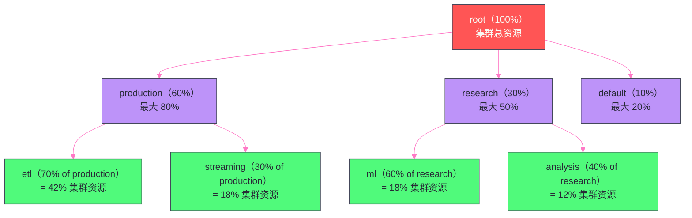

# 调度器深度解析——Capacity Scheduler 与 Fair Scheduler 的算法内核

## 摘要

本文深度解析 YARN 的两大内置调度器：**Capacity Scheduler（CS）** 和 **Fair Scheduler（FS）**。两者都用"队列树"组织资源分配策略，但核心差异在于资源分配的"公平性定义"不同——CS 保证每个队列分得其配置容量的"最低保障"，FS 保证每个作业随时间积分的"资源份额相等"。文章重点剖析四个工程问题：**CS 的队列树如何计算每个节点该被哪个队列"消费"**、**FS 的 DRF（Dominant Resource Fairness）算法如何在 CPU 和内存两个维度上同时保证公平**、**两种调度器的抢占机制有何本质不同**、以及**生产环境下如何选择和配置调度器**。

---

## 第 1 章 为什么需要调度器：资源分配的三个核心问题

在 YARN 集群中，调度器需要同时解答三个相互关联的核心问题：

**问题一：谁先得到资源？**

当集群资源不足，多个应用同时在等待资源时，调度器需要决定优先满足哪个应用的需求。是按提交时间（FIFO）、按优先级、还是保证资源均匀分配（公平调度）？

**问题二：资源如何在组织层面隔离？**

在一个多团队共享的集群中，数据科学团队的 GPU 训练作业和数据工程团队的 ETL 作业需要共享资源，但不能互相"吃掉"对方的资源。如何保证每个团队"分得其应有的份额"，同时又允许资源的灵活共享？

**问题三：当集群满负荷时，如何为高优先级应用腾出资源？**

当集群资源已经被低优先级作业占满时，新提交的高优先级作业需要等待（可能很久）。是否应该"抢占"低优先级作业的资源？如果抢占，抢谁的、怎么抢，才能保证抢占的副作用最小？

两大调度器（Capacity Scheduler 和 Fair Scheduler）对这三个问题的答案体现了不同的设计哲学，理解这些差异，才能在生产环境中做出正确的选型决策。

---

## 第 2 章 Capacity Scheduler：最低保障与弹性共享

### 2.1 核心设计理念：容量保障 + 弹性共享

Capacity Scheduler（CS）是 YARN 的默认调度器，由 Yahoo/Hortonworks 主导开发。它的设计目标是：**在保证每个队列最低容量的前提下，允许空闲容量被其他队列弹性借用**。

"容量保障"的含义：每个叶队列都配置了一个 `capacity`（容量百分比），表示这个队列在集群资源充足时，保证能获得的最低资源比例。即使集群整体资源紧张，CS 也会确保每个队列的已用资源不低于其配置的容量。

"弹性共享"的含义：当某个队列的资源需求低于其 `capacity` 时，空闲的资源可以被其他队列借用（只要其他队列不超过 `maximum-capacity`）。当原队列的资源需求上升，借出的资源会被逐渐归还。

### 2.2 队列树模型：CS 资源分配的基础数据结构

CS 用一棵**队列树**（Queue Tree）来组织资源分配策略。队列树的叶节点是实际接收应用提交的队列，中间节点是逻辑父队列，用于层级化管理容量配置。



**队列配置关键参数**：

```xml
<!-- capacity-scheduler.xml -->
<property>
  <name>yarn.scheduler.capacity.root.queues</name>
  <value>production,research,default</value>
</property>

<!-- production 队列：占集群 60%，最高可借用到 80% -->
<property>
  <name>yarn.scheduler.capacity.root.production.capacity</name>
  <value>60</value>
</property>
<property>
  <name>yarn.scheduler.capacity.root.production.maximum-capacity</name>
  <value>80</value>
</property>

<!-- production.etl 子队列：占 production 队列的 70% -->
<property>
  <name>yarn.scheduler.capacity.root.production.etl.capacity</name>
  <value>70</value>
</property>
<!-- 用户限制：etl 队列中，单个用户最多占 50% 的队列资源 -->
<property>
  <name>yarn.scheduler.capacity.root.production.etl.user-limit-factor</name>
  <value>0.5</value>
</property>
```

### 2.3 CS 调度算法的核心：资源使用率排序

当 NM 心跳触发 `nodeUpdate()` 时，CS 调度算法的核心思路是：**找到当前"最饥饿"（资源使用率最低）的队列，优先为它分配资源**。

CS 用 `used / capacity`（已用资源 / 配置容量）来衡量队列的"饥饿程度"。这个比值越低，说明队列相对于其应得份额越饥饿，越应该优先被调度。

**CS 调度决策的完整流程**（以前面的队列树为例）：

**第一步：从 Root 开始，向下选择最饥饿的子队列**

假设当前状态：
- `production` 队列：used = 48% 集群资源，capacity = 60%，饥饿度 = 48/60 = 0.80
- `research` 队列：used = 10% 集群资源，capacity = 30%，饥饿度 = 10/30 = 0.33
- `default` 队列：used = 5% 集群资源，capacity = 10%，饥饿度 = 5/10 = 0.50

CS 选择饥饿度最低（最饥饿）的队列 `research`（0.33）。

**第二步：递归向下，在 research 内选择最饥饿的子队列**

- `research.ml` 子队列：used = 6%，capacity = 18%（60% of research），饥饿度 = 6/18 = 0.33
- `research.analysis` 子队列：used = 4%，capacity = 12%（40% of research），饥饿度 = 4/12 = 0.33

两个子队列饥饿度相同，CS 按 FIFO（队列内部先进先出）顺序选择更早等待的队列。

**第三步：在选定的叶队列中，选择最优先的 Application**

在叶队列中，CS 使用 `FiCaSchedulerApp` 的优先级和提交时间来选择应用——优先级相同时，等待更久的应用优先被调度。

**第四步：在选定 Application 中，按数据本地性匹配 ResourceRequest**

检查当前心跳 NM 节点是否满足该 Application 的某个 ResourceRequest（NODE_LOCAL > RACK_LOCAL > OFF_RACK 三级本地性）。如果满足，分配 Container；否则本次心跳不为该 Application 分配资源（等待延迟调度超时再降级）。

### 2.4 CS 的抢占机制

**为什么需要抢占？**

在弹性共享的场景下，可能出现这样的情况：`production` 队列的资源需求很低，其 60% 的容量几乎没有被使用，于是 `research` 队列借用了大量 `production` 的空闲资源，`research` 队列实际使用量达到 70%。此时 `production` 队列突然提交了一批高优先级的 ETL 作业，需要立即使用其保证的 60% 容量，但这些资源都被 `research` 的 Container 占用着，`production` 的作业只能等待 `research` 的 Container 自然完成——这个等待可能长达数小时。

**CS 的抢占逻辑（Intra-queue Preemption）**：

CS 的抢占服务（`ProportionalCapacityPreemptionPolicy`）定期（每隔 `yarn.resourcemanager.monitor.capacity.preemption.monitoring-interval`，默认 3 秒）检查各队列的资源使用情况：

1. 计算每个队列应得的资源份额（`ideal_assigned`）：在当前所有活跃应用的需求下，按 `capacity` 比例分配的理想资源量
2. 计算每个队列的"超用量"（`reclaimable`）：`used` - `ideal_assigned`，超用的队列需要归还资源
3. 计算每个队列的"欠缺量"（`deficit`）：`ideal_assigned` - `used`，欠缺的队列需要获得资源
4. 向 AM 发送抢占通知（通过 `allocate` 响应中的 `PreemptionMessage`），要求 AM 主动释放指定的 Container
5. 如果 AM 在 `yarn.resourcemanager.monitor.capacity.preemption.max-wait-before-kill`（默认 15 秒）内未主动释放，RM 会强制杀死这些 Container

> [!warning] 生产避坑：抢占带来的 Spark 作业稳定性问题
> Spark 的 Executor 被抢占杀死后，Executor 上运行的所有 Task 都会失败，需要重新调度。如果一个 Stage 的大量 Executor 同时被抢占，可能导致整个 Stage 需要重新执行，作业时间大幅延长。
>
> **缓解策略**：
> 1. 为重要的 Spark 作业配置高优先级，减少被抢占的概率
> 2. 在队列配置中为 Spark 作业队列设置 `disable_preemption = true`（Hadoop 3.x 支持）
> 3. Spark 3.x 的 Dynamic Allocation 可以主动释放空闲 Executor，减少被动抢占的发生

---

## 第 3 章 Fair Scheduler：时间公平与 DRF 算法

### 3.1 Fair Scheduler 的核心设计理念：时间维度上的公平

Fair Scheduler（FS）的设计目标与 CS 有本质差异：**FS 追求的是每个应用（或队列）在时间维度上获得相等的资源份额**。

CS 的公平是"空间公平"——在某一时刻，每个队列应该按照 `capacity` 比例使用资源。FS 的公平是"时间公平"——每个应用在整个运行周期内，平均获得的资源份额应该相等（或按权重比例相等）。

**最简单的 FS 模型（无队列，仅 FIFO Pool）**：

假设集群有 4 个等量资源槽，同时有 3 个应用在运行：
- T=0：只有 App1，App1 独占 4 个槽
- T=1：App2 提交，FS 重新均分，App1 和 App2 各占 2 个槽
- T=2：App3 提交，FS 三等分，每个 App 各占 1.33 个槽（向下取整为 1 个，剩余轮流分配）

这个"动态重新均分"的机制，确保了后来的应用能够快速获得资源，不会因为早先运行的大作业独占资源而被饿死。

### 3.2 DRF 算法：多资源维度的公平性

当资源只有一个维度（如只有内存）时，"公平"的定义很简单——每个应用获得等量的内存。但 YARN 的资源有 CPU 和内存两个维度，不同应用对这两个维度的需求比例不同：内存密集型应用（如 Hive Join）需要大量内存但 CPU 需求低；CPU 密集型应用（如机器学习训练）需要大量 CPU 但内存需求相对低。

**什么是 DRF（Dominant Resource Fairness，主导资源公平性）？**

DRF 是 FS 用于多资源维度公平调度的算法，由 UC Berkeley 的研究人员于 2011 年提出（论文发表于 NSDI 2011）。

DRF 的核心思想：**每个应用的"主导资源"（Dominant Resource）是其各类资源需求中占集群总量比例最高的那一类资源，公平调度应保证所有应用的主导资源份额相等**。

**DRF 举例说明**：

集群总资源：CPU 9 核，内存 18 GB

| 应用 | 每个 Task 需要 CPU | 每个 Task 需要内存 | 主导资源 | 主导资源占比 |
|---|---|---|---|---|
| App A（内存密集型）| 1 核 | 4 GB | 内存（4/18 = 22.2%）> CPU（1/9 = 11.1%）| 22.2% |
| App B（CPU 密集型）| 3 核 | 1 GB | CPU（3/9 = 33.3%）> 内存（1/18 = 5.6%）| 33.3% |

DRF 的分配目标：使两个应用的主导资源占比趋于相等。

DRF 的分配过程（贪心迭代）：
1. 当前 App A 主导资源占比 = 0，App B 主导资源占比 = 0，选择主导资源占比更低的（相同时按任意顺序）
2. 给 App A 分配一个 Task（+1 核，+4 GB），App A 主导资源占比 = 4/18 = 22.2%
3. App B 主导资源占比 = 0 < App A 的 22.2%，给 App B 分配一个 Task（+3 核，+1 GB），App B 主导资源占比 = 3/9 = 33.3%
4. App A 主导资源占比 = 22.2% < App B 的 33.3%，给 App A 分配第二个 Task（+1 核，+4 GB），App A 主导资源占比 = 8/18 = 44.4%
5. ...

最终分配结果：App A 得到 3 个 Task（3 核，12 GB），App B 得到 2 个 Task（6 核，2 GB），集群资源总使用：9 核、14 GB。两个应用的主导资源占比分别为 66.7%（App A，内存）和 66.7%（App B，CPU），公平性实现。

**DRF vs. 最大最小公平（Max-Min Fairness）**：

如果不使用 DRF，而是简单地对每个资源维度分别做最大最小公平分配：
- 内存维度：App A 和 App B 各分 9 GB
- CPU 维度：App A 和 App B 各分 4.5 核

但 App A 每个 Task 需要 1 核 4 GB，4.5 核对应 1.125 个 Task（向下取整 1 个），而内存最多支持 9/4 = 2.25 个 Task（向下取整 2 个）——两个约束中取最严格的，App A 最终只能运行 1 个 Task，大量内存被浪费。

DRF 通过"主导资源"视角，使得资源分配更有效率，避免了多维度独立公平导致的资源利用率低下。

### 3.3 Fair Scheduler 的队列与权重

FS 也支持队列配置，通过 `fair-scheduler.xml` 定义队列树：

```xml
<!-- fair-scheduler.xml -->
<allocations>
  <queue name="production">
    <weight>3</weight>         <!-- production 队列权重是 research 的 3 倍 -->
    <schedulingPolicy>drf</schedulingPolicy>
    <minResources>10240 mb,4vcores</minResources>   <!-- 最低保障资源 -->
    <maxResources>614400 mb,200vcores</maxResources> <!-- 最高上限 -->
    <maxRunningApps>50</maxRunningApps>

    <queue name="etl">
      <weight>2</weight>
    </queue>
    <queue name="streaming">
      <weight>1</weight>
    </queue>
  </queue>

  <queue name="research">
    <weight>1</weight>
    <schedulingPolicy>drf</schedulingPolicy>
  </queue>

  <!-- 队列内部调度策略可以配置为 fair / fifo / drf -->
  <defaultQueueSchedulingPolicy>fair</defaultQueueSchedulingPolicy>
</allocations>
```

当队列有权重配置时，FS 的公平性目标变为：**各队列的资源份额按权重比例分配**。`production` 权重为 3，`research` 权重为 1，集群资源应按 3:1 比例分配给两个队列。FS 的调度算法在每次 NM 心跳时，将资源优先分配给当前资源份额最低于"应得份额"的队列。

### 3.4 FS 的抢占机制

FS 的抢占逻辑与 CS 有所不同，它基于"公平份额亏欠"来触发抢占：

**超时抢占（Timeout Preemption）**：如果某个队列的已用资源长时间低于其"公平份额"（`fairShare`），FS 会触发抢占，从其他超用队列中回收资源。具体阈值由 `yarn.scheduler.fair.preemption.cluster-utilization-threshold` 和 `yarn.scheduler.fair.preemption-interval` 控制。

**最小份额抢占（Min Share Preemption）**：如果队列配置了 `minResources`，但实际获得的资源长时间低于 `minResources`，FS 会立即触发抢占（不等待超时），确保最低保障资源的交付。超时时间由 `minSharePreemptionTimeout` 配置（默认 300 秒）。

> [!note] 设计哲学：FS 抢占的"温和"策略
> FS 的抢占是"温和的"——它不会直接杀死 Container，而是先通过 AM 的 `allocate` 响应发送 `PreemptionMessage`，给 AM 一定时间（默认 15 秒）主动释放资源。这给了 AM 机会做"优雅关闭"（如 Spark Executor 在被杀前完成当前 Task 的 Shuffle Write，避免后续 Stage 无法读取 Shuffle 数据）。只有 AM 未在规定时间内主动释放，FS 才会强制杀死 Container。

---

## 第 4 章 CS 与 FS 的深度对比

### 4.1 核心设计差异对比表

| 维度 | Capacity Scheduler | Fair Scheduler |
|---|---|---|
| **资源保障方式** | 配置容量百分比（`capacity`），保证最低份额 | 配置权重（`weight`）+ 最低资源（`minResources`）|
| **资源借用** | 超出 `capacity` 可借用，但不超过 `maximum-capacity` | 按权重比例动态共享，无固定上限（除 `maxResources`）|
| **调度算法** | 按 `used/capacity` 比值（饥饿度）选择最饥饿队列 | 按 DRF 或 Fair 算法选择主导资源份额最低的队列/应用 |
| **多资源维度** | 按 CPU 和内存分别考虑，以内存为主 | DRF 算法原生支持多维度公平性 |
| **队列内应用顺序** | FIFO（先进先出） | Fair（公平，同队列多应用均分资源）或 FIFO 可配 |
| **抢占触发条件** | 队列超出 `capacity` 且其他队列不足 | 队列低于 `fairShare` 超过超时时间 |
| **配置文件** | `capacity-scheduler.xml` | `fair-scheduler.xml` |
| **适用场景** | 多团队资源隔离，固定容量分配 | 多用户共享，追求短作业快速响应 |
| **Hadoop 默认** | **是（默认调度器）** | 否（需要显式配置）|

### 4.2 实际选型建议

**选 Capacity Scheduler 的场景**：
- 集群有多个业务团队，各团队有明确的资源配额要求（如"ETL 团队必须保证 40% 集群资源"）
- 需要严格的资源隔离（某团队的作业不能影响另一团队的资源保障）
- 作业类型主要是批处理 MapReduce 或 Spark 批作业（不需要极短的调度延迟）
- 团队对 YARN 配置较为熟悉，愿意维护较复杂的队列配置

**选 Fair Scheduler 的场景**：
- 集群主要是个人用户提交的短作业（如数据分析师的即席查询），追求每个用户的作业都能快速启动
- 不需要严格的团队级资源隔离，而是追求全局公平
- 有大量小作业与少量大作业混合，需要避免大作业独占资源导致小作业饿死
- 使用 Hive/Impala 等查询引擎，对调度响应速度要求较高

> [!info] 核心概念：Hadoop 3.x 的调度器统一方向
> Apache Hadoop 社区在 3.x 版本中开始将 CS 和 FS 的功能逐步统一，尤其是在 YARN-5552（CS 支持惰性抢占）和 YARN-9907（CS 支持类 FS 的权重配置）等 JIRA 推进下，CS 正在逐步吸收 FS 的优点。目前社区的长期规划是以 CS 为主调度器，将 FS 的 DRF 算法和动态公平性机制移植到 CS 中，最终可能弃用独立的 FS。在新建集群上，推荐优先考虑 CS。

---

## 第 5 章 节点标签：调度器的高级特性

### 5.1 什么是节点标签

**节点标签（Node Labels）** 是 YARN Capacity Scheduler 的高级特性，允许管理员为集群中的节点打标签，再在队列配置中指定某个队列只能调度到特定标签的节点上。

典型使用场景：
- 集群中有 GPU 节点和普通 CPU 节点，希望 ML 训练作业只调度到 GPU 节点，ETL 作业只调度到 CPU 节点
- 集群中有高内存节点（如 512GB 内存）和普通节点，希望内存密集型的 Hive 大查询只调度到高内存节点
- 某些节点安装了特定版本的操作系统依赖，需要将特定应用锁定到这些节点

### 5.2 节点标签的配置方式

```bash
# 1. 创建节点标签（RM 侧）
yarn rmadmin -addToClusterNodeLabels "gpu(exclusive=true),highmem"

# exclusive=true：该节点只运行带标签的 Container（不接受无标签 Container）
# exclusive=false（默认）：无标签 Container 也可以调度到此节点

# 2. 为节点打标签
yarn rmadmin -replaceLabelsOnNode "node1:45454=gpu,node2:45454=gpu,node3:45454=highmem"

# 3. 在队列配置中绑定标签（capacity-scheduler.xml）
# ml 队列绑定 gpu 标签，且在 gpu 分区内占 100% 资源
<property>
  <name>yarn.scheduler.capacity.root.ml.accessible-node-labels</name>
  <value>gpu</value>
</property>
<property>
  <name>yarn.scheduler.capacity.root.ml.capacity.[gpu]</name>
  <value>100</value>
</property>
```

### 5.3 节点标签分区的资源计算

引入节点标签后，集群资源被切分为多个"分区"（Partition）：

- **DEFAULT 分区**：没有标签的普通节点的资源
- **GPU 分区**：有 `gpu` 标签的节点的资源（exclusive=true 时，GPU 分区资源只分配给指定了 `gpu` 标签的队列）
- **HIGHMEM 分区**：有 `highmem` 标签的节点的资源

每个叶队列的 `capacity` 配置需要分别在各分区上指定：队列在 DEFAULT 分区的容量 + 队列在 GPU 分区的容量，各自独立计算。

---

## 第 6 章 调度器的配置最佳实践

### 6.1 Capacity Scheduler 生产配置模板

```xml
<!-- capacity-scheduler.xml 生产配置参考 -->

<!-- 集群级别配置 -->
<property>
  <name>yarn.scheduler.capacity.maximum-applications</name>
  <value>10000</value>  <!-- 集群最大并发应用数 -->
</property>
<property>
  <name>yarn.scheduler.capacity.maximum-am-resource-percent</name>
  <value>0.1</value>    <!-- AM 最多占集群资源的 10%，防止大量小作业的 AM 撑爆集群 -->
</property>
<property>
  <name>yarn.scheduler.capacity.resource-calculator</name>
  <!-- DominantResourceCalculator 支持 CPU+内存双维度公平性，推荐生产使用 -->
  <!-- DefaultResourceCalculator 只考虑内存，是旧版本默认，不推荐 -->
  <value>org.apache.hadoop.yarn.util.resource.DominantResourceCalculator</value>
</property>

<!-- 抢占配置 -->
<property>
  <name>yarn.resourcemanager.scheduler.monitor.enable</name>
  <value>true</value>   <!-- 启用抢占监控 -->
</property>
<property>
  <name>yarn.resourcemanager.scheduler.monitor.policies</name>
  <value>org.apache.hadoop.yarn.server.resourcemanager.monitor.capacity.ProportionalCapacityPreemptionPolicy</value>
</property>
<property>
  <name>yarn.resourcemanager.monitor.capacity.preemption.max-wait-before-kill</name>
  <value>30000</value>  <!-- 等待 AM 主动释放资源的最长时间（ms），默认 15s，生产建议 30s -->
</property>
```

### 6.2 常见调度问题排查命令

```bash
# 查看队列资源使用情况
yarn queue -status root.production.etl

# 查看集群调度器状态
yarn schedulerconf

# 查看某个应用的资源使用和队列
yarn application -status application_1234567890_0001

# 动态修改队列配置（不需要重启 RM，Hadoop 3.x 支持）
yarn rmadmin -updateSchedulerConf

# 查看 RM 的调度器详细指标（通过 JMX 或 REST API）
curl http://rm-host:8088/ws/v1/cluster/scheduler

# 强制刷新队列配置
yarn rmadmin -refreshQueues
```

---

## 第 7 章 小结：调度器是集群资源管理的核心杠杆

YARN 调度器是整个集群资源利用效率的核心杠杆。选错调度器或配置不当，可能导致：
- 高优先级作业等待低优先级作业，SLA 无法保证
- 某些队列资源长期空闲而另一些队列严重排队
- Spark 作业因抢占被频繁重试，运行时间翻倍

**CS 和 FS 的本质差异**归结为一点：CS 是"空间公平"（任意时刻各队列按比例使用资源），FS 是"时间公平"（随时间积分每个应用获得相等份额）。两种公平性观念对应不同的使用场景，没有绝对的优劣。

**DRF 算法**的贡献是将单维度的公平性扩展到多维度，使得 CPU 密集型和内存密集型应用能够在同一集群中和谐共存，各得其所。

下一篇文章，我们深入 ApplicationMaster 机制——以 Spark on YARN 为具体案例，拆解 Spark AM 如何向 RM 申请 Executor Container、如何处理 Executor 失败、以及 Spark 的 Dynamic Allocation 如何与 YARN 调度器协作实现弹性扩缩容。

---

## 参考资料

- Apache Hadoop 官方文档：[Capacity Scheduler](https://hadoop.apache.org/docs/current/hadoop-yarn/hadoop-yarn-site/CapacityScheduler.html)
- Apache Hadoop 官方文档：[Fair Scheduler](https://hadoop.apache.org/docs/current/hadoop-yarn/hadoop-yarn-site/FairScheduler.html)
- Ghodsi, A. et al. (2011). *Dominant Resource Fairness: Fair Allocation of Multiple Resource Types*. NSDI 2011.
- Apache Hadoop 官方文档：[Node Labels](https://hadoop.apache.org/docs/current/hadoop-yarn/hadoop-yarn-site/NodeLabel.html)
- Apache Hadoop 源码：`org.apache.hadoop.yarn.server.resourcemanager.scheduler.capacity.CapacityScheduler`
- Apache Hadoop 源码：`org.apache.hadoop.yarn.server.resourcemanager.scheduler.fair.FairScheduler`
