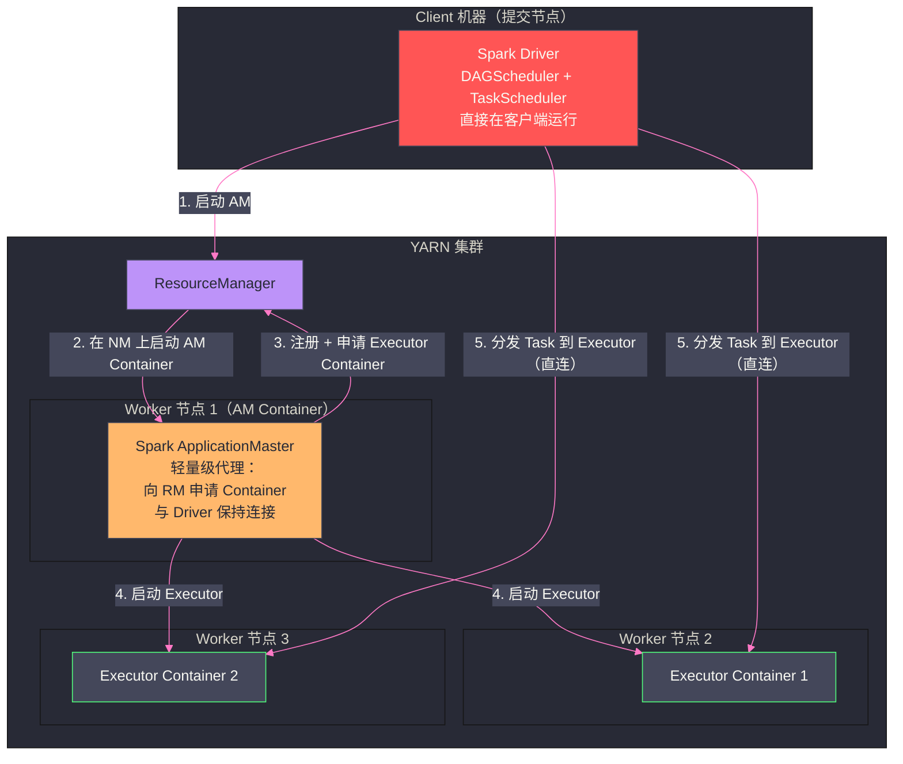
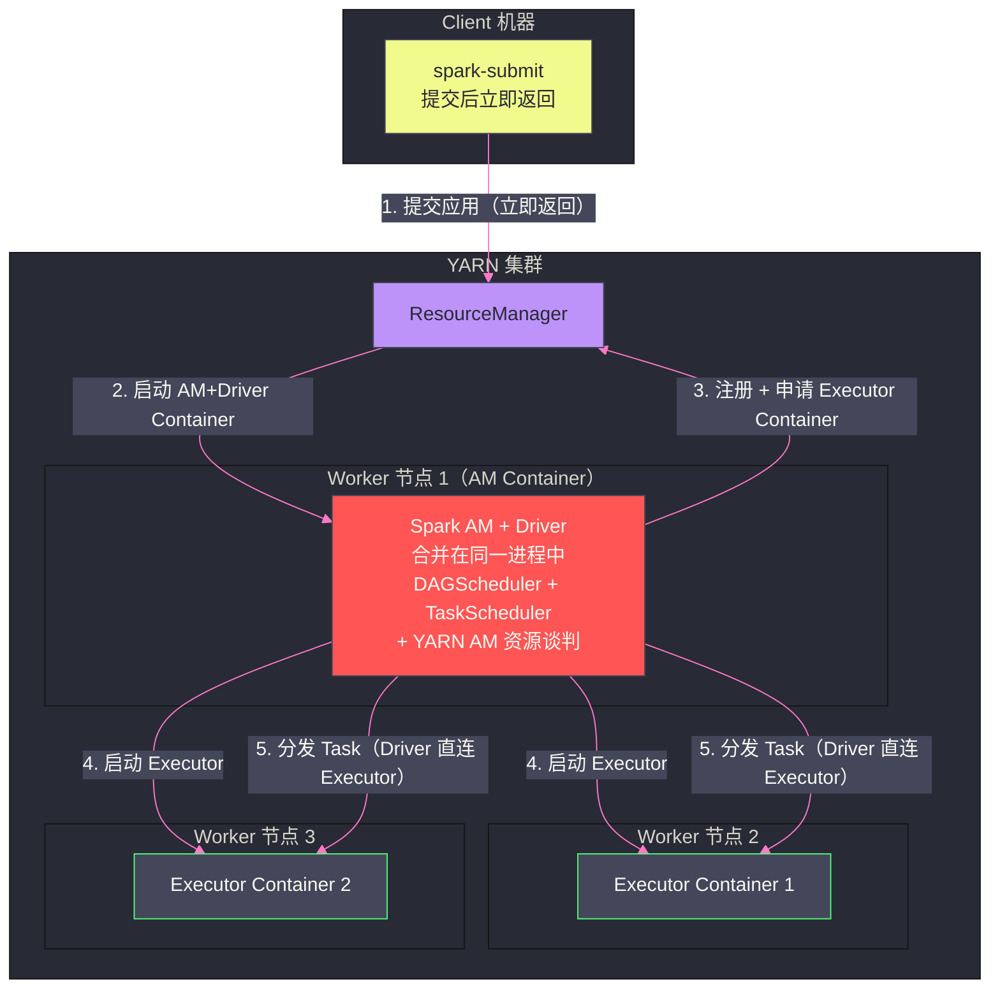
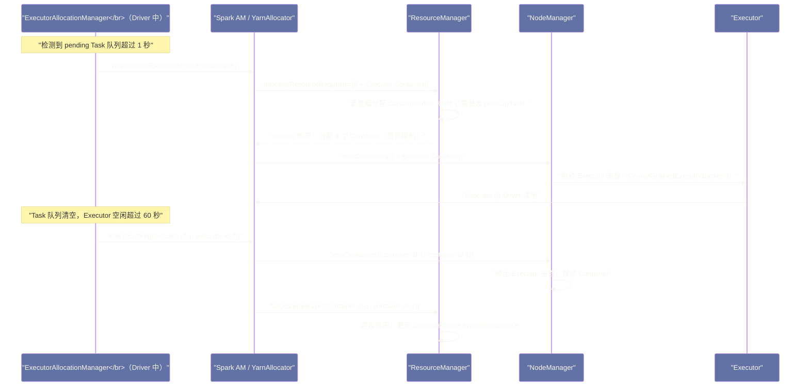

# ApplicationMaster 机制——以 Spark on YARN 为例

## 摘要

本文以 Spark on YARN 为具体案例，深度解析 ApplicationMaster 的工作机制。AM 是 YARN 框架无关性的核心载体——不同计算框架通过各自的 AM 实现，与 YARN RM 进行标准化的资源谈判，同时保留框架内部调度逻辑的完全自主权。本文重点剖析四个核心问题：**Spark 的 client 模式与 cluster 模式在 AM 职责上的根本差异**、**Spark AM 如何将 Driver 的 `--num-executors` 配置转化为 YARN 的 `ResourceRequest`**、**Executor Container 的申请策略与本地性偏好的工程实现**、以及 **Dynamic Allocation 如何与 YARN 调度器协作实现弹性扩缩容**。理解 Spark AM 的工作原理，是优化 Spark 作业资源利用率和排查 Executor 申请异常的关键。

---

## 第 1 章 AM 在 YARN 框架中的定位回顾

在第二篇文章中，我们建立了 ApplicationMaster 的基本认知：AM 是每个 YARN 应用专属的内部调度代理，运行在一个 YARN Container 中，负责与 RM 进行资源谈判，以及与 NM 协作启动 Task Container。

但"AM 负责内部调度"这句话有多深的含义，需要通过具体的计算框架案例才能真正体会。Spark on YARN 是最适合的分析案例，因为：

1. **Spark 的 Driver 机制**：Spark 有自己的 Driver（应用程序的主控程序，负责 DAG 构建、Stage 划分、Task 分发），这个 Driver 与 YARN 的 AM 之间的关系，在不同部署模式下（client vs. cluster）有本质差异，理解这个差异是理解 Spark on YARN 行为的起点
2. **Spark 的 Dynamic Allocation**：Spark 支持根据 Task 队列的实时长度动态申请和释放 Executor，这是 AM 与 YARN RM 协作实现弹性扩缩容的典型案例
3. **Spark 的本地性调度**：Spark AM 在申请 Executor Container 时，会根据数据所在的 HDFS 节点计算本地性偏好，并将这个偏好通过 `ResourceRequest` 传递给 YARN 调度器

---

## 第 2 章 Spark on YARN 的两种部署模式

### 2.1 client 模式：Driver 在提交节点上运行

在 `--deploy-mode client`（client 模式）下，Spark Driver 直接运行在提交 `spark-submit` 命令的客户端机器上，而 Spark AM 是一个独立的轻量级进程，运行在 YARN 的一个 Container 中，负责代理 Driver 向 RM 申请 Executor Container。



**client 模式的特点**：

- **Driver 与客户端共存**：Driver 直接在你的笔记本电脑或跳板机上运行，可以直接在终端看到 `spark-submit` 的输出（包括 Driver 的日志）
- **Driver 与 Executor 直连**：Driver 通过网络直接与 Executor 通信（分发 Task、收集结果），不经过 AM。这意味着客户端机器需要与 YARN 集群的所有节点网络互通
- **Driver 不在 YARN 管控中**：Driver 进程不是 YARN Container，不受 YARN 的资源管理（没有 CGroups 限制，也不在 YARN 监控中）。Driver OOM 或崩溃不会被 YARN 检测到
- **AM 是轻量级代理**：client 模式下的 AM 非常轻量，它只负责向 RM 申请 Executor Container，并监控 Executor 的存活；Driver 的 TaskScheduler 直接与 Executor 通信，AM 不参与 Task 的分发

**适用场景**：交互式开发（如 `spark-shell`、Jupyter Notebook）、调试阶段（可以直接看 Driver 日志）。

### 2.2 cluster 模式：Driver 作为 YARN Container 运行

在 `--deploy-mode cluster`（cluster 模式）下，Spark Driver 和 Spark AM 合并为同一个进程，运行在 YARN 的 AM Container 中。`spark-submit` 命令在提交应用后立即返回，Driver 进程在集群内部运行。



**cluster 模式的特点**：

- **Driver 受 YARN 资源管控**：Driver 是 AM Container，有明确的 CPU 和内存限制（由 `--driver-memory` 和 `--driver-cores` 指定）。Driver OOM 会被 YARN 检测，AM Container 失败后 YARN 会尝试重启 AM（AM 重试）
- **spark-submit 立即返回**：提交作业后终端立即返回，Driver 在后台运行。作业状态通过 `yarn logs` 或 YARN Web UI 查看
- **客户端不需要与集群节点直连**：Driver 在集群内部，不需要客户端机器与所有 Worker 节点网络互通
- **AM 即 Driver**：cluster 模式下没有独立的"轻量级 AM"，Driver 主线程本身就承担了 AM 的职责（注册、申请 Container、心跳）

**适用场景**：生产环境的作业调度（通过 Airflow、Oozie 等调度系统提交），长时间运行的 Spark 流处理作业。

### 2.3 两种模式的核心差异对比

| 维度 | client 模式 | cluster 模式 |
|---|---|---|
| **Driver 位置** | 客户端机器（本地进程）| YARN AM Container（集群内）|
| **AM 进程** | 独立的轻量级 AM 进程 | AM 与 Driver 合并为同一进程 |
| **Driver 日志查看** | 直接在终端看到 | 需要 `yarn logs` 或 Web UI |
| **Driver 内存设置** | `--driver-memory`（本地 JVM）| `--driver-memory`（Container 限制）|
| **作业监控** | `spark-submit` 阻塞直到作业完成 | `spark-submit` 立即返回 |
| **网络要求** | 客户端需与所有 Worker 节点互通 | 仅需与 RM 和 NM（AM 所在）互通 |
| **Driver 容错** | 无（本地进程崩溃则作业失败）| YARN 可重启 AM Container |
| **适用场景** | 交互式开发、调试 | 生产环境调度 |

---

## 第 3 章 Spark AM 的内部结构与启动流程

### 3.1 Spark AM 的核心类

Spark on YARN 的 AM 实现在 `org.apache.spark.deploy.yarn.ApplicationMaster` 类中（`spark-yarn` 模块）。这个类的职责在 client 和 cluster 两种模式下略有不同：

**cluster 模式下的 `ApplicationMaster`**：

```java
// cluster 模式下 AM 的主要职责（简化伪代码）
class ApplicationMaster {

    def main(args) {
        // 1. 解析参数（--class, --jar, 用户代码 class 等）
        val amArgs = new ApplicationMasterArguments(args)

        // 2. 向 RM 注册 AM
        rmClient.registerApplicationMaster(hostname, port, trackingUrl)

        // 3. 在单独线程中启动 Driver（用户的 main() 方法）
        userClassThread = startUserApplication()  // 执行用户 Spark 代码

        // 4. 等待 Driver 创建 SparkContext（SparkContext 初始化时会通知 AM）
        sparkContextRef.awaitTimeout()

        // 5. 开始资源谈判循环
        allocator = new YarnAllocator(rmClient, ...)
        allocator.allocateResources()  // 根据 Driver 的需求申请 Container

        // 6. 监控 Driver 和 Executor 状态
        runDriver()
    }
}
```

**`YarnAllocator`**：这是 Spark AM 中负责 YARN 资源谈判的核心类，它封装了向 RM 发送 `allocate` 心跳、处理分配结果、向 NM 发送 `startContainers` 的全部逻辑。

### 3.2 SparkContext 与 AM 的交互：双向注册

在 cluster 模式下，Driver 代码（用户的 `main()` 方法）运行在 AM 进程内部的一个独立线程中。当用户代码创建 `SparkContext` 时，SparkContext 会向 AM 注册自身：

```
用户代码：val sc = new SparkContext(conf)
  → SparkContext 初始化
  → SparkContext 中的 YarnSchedulerBackend 向 AM 发送注册消息
  → AM 的 sparkContextRef.set(sc)  // AM 获得 SparkContext 的引用
  → AM 开始根据 sc.conf 中的 Executor 配置申请资源
```

这个"双向注册"是 Spark cluster 模式下 AM 能够感知 Driver 需求的关键。AM 需要知道 Driver 的 `TaskScheduler` 在哪里（端口、主机名），才能将申请到的 Executor Container 的地址告知 Driver，使 Executor 能够连接到 Driver。

### 3.3 Executor Container 的启动命令

当 AM 通过 YARN 分配到 Executor Container 后，它向对应的 NM 发送 `startContainers` 请求，启动命令大致如下：

```bash
# Spark Executor 的 Container 启动命令（简化）
/usr/lib/jvm/java-11/bin/java \
  -server \
  -Xmx4096m \                          # --executor-memory 指定的堆内存
  -XX:+UseG1GC \
  -XX:+PrintGCDetails \
  -Djava.io.tmpdir={{PWD}}/tmp \
  -Dspark.yarn.app.container.log.dir={{LOG_DIR}} \
  org.apache.spark.executor.CoarseGrainedExecutorBackend \  # Executor 主类
  --driver-url spark://CoarseGrainedScheduler@<driver-host>:<driver-port> \
  --executor-id <executor-id> \
  --hostname <container-host> \
  --cores <executor-cores> \
  --app-id <app-id> \
  --user-class-path file:{{PWD}}/app.jar \
  1><LOG_DIR>/stdout 2><LOG_DIR>/stderr
```

关键参数说明：
- `--driver-url`：Executor 启动后需要向 Driver 注册，这个 URL 是 Driver 的 `CoarseGrainedSchedulerBackend` 的 Akka/RPC 地址
- `--executor-id`：Executor 的唯一 ID，由 AM 分配
- `--cores`：`--executor-cores` 的值，告知 Executor 它可以并发运行多少个 Task

---

## 第 4 章 Executor 申请策略：AM 如何决定申请多少 Container

### 4.1 静态分配：按配置数量申请

在默认的静态分配模式（`spark.dynamicAllocation.enabled = false`）下，Spark AM 在启动时根据 `spark-submit` 的参数一次性计算需要申请的 Executor 数量：

```
申请的 Executor Container 数 = --num-executors（或 spark.executor.instances）
每个 Container 的资源 = (--executor-cores, --executor-memory + overhead)
```

**内存 overhead 是什么？**

`--executor-memory 4g` 指定的是 JVM 堆内存（`-Xmx`），但 Container 实际需要的内存还包括：
- JVM 的非堆内存（Code Cache、Metaspace 等）
- Spark 的堆外内存（`spark.memory.offHeap.size`，如果启用）
- Python/R 进程的内存（pyspark/sparkR 场景）
- NM 的 Container 监控开销

因此 YARN Container 申请的实际内存是：
```
Container 内存 = executor-memory + max(executor-memory * 0.1, 384MB)
# 默认 overhead = max(executor-memory * 10%, 384MB)
# 可通过 spark.yarn.executor.memoryOverhead 覆盖
```

例如 `--executor-memory 4g`，Container 申请的实际内存 = 4096 + max(409, 384) = 4096 + 409 ≈ 4505 MB，向上规整到 YARN 最小分配单位（通常 512MB）的整数倍，实际分配约 4608MB 或 5120MB（取决于集群配置）。

> [!warning] 生产避坑：Container 被拒绝的常见原因
> Spark 作业提交后 Executor 迟迟不启动，大概率是 Container 申请被拒绝，常见原因：
> 1. **Container 内存超过节点最大值**：`yarn.scheduler.maximum-allocation-mb` 默认 8192MB，如果申请的 Container 内存（含 overhead）超过此值，YARN 直接拒绝。检查：`yarn logs -applicationId ...` 中是否有 `Required resource allocation exceeds maximum resource allocation` 错误
> 2. **虚拟核数超过节点限制**：`--executor-cores 5` 但 `yarn.scheduler.maximum-allocation-vcores = 4`，同样会被拒绝
> 3. **队列剩余资源不足**：提交到的队列当前可用资源不足以分配一个 Executor Container，作业将一直等待
>
> 快速排查命令：
> ```bash
> yarn application -status <appId>  # 查看应用状态和诊断信息
> yarn queue -status <queueName>    # 查看队列当前资源使用情况
> ```

### 4.2 AM 的 ResourceRequest 本地性策略

Spark AM 在向 RM 申请 Executor Container 时，会尽可能地考虑数据本地性（对于读取 HDFS 数据的作业）。

**本地性偏好的生成逻辑**：

Spark 的 `TaskSetManager` 在调度 Task 时，维护了每个 Task 的"偏好位置"（`preferredLocations`）——即该 Task 处理的数据所在的 HDFS 节点列表（通过 HDFS API 获取 Block 的位置信息）。

Spark AM 的 `YarnAllocator` 根据 `TaskSetManager` 的偏好位置，为每个需要申请的 Executor Container 生成带有本地性偏好的 `ResourceRequest`：

```scala
// YarnAllocator 生成 ResourceRequest 的核心逻辑（简化）
def updateResourceRequests(): Unit = {
  val pendingTasks = taskScheduler.getPendingTaskLocations()
  
  // 统计每个节点上有多少个待执行的 Task 偏好在这里
  val nodePreferenceCount = pendingTasks
    .flatMap(_.preferredLocations)
    .groupBy(identity)
    .mapValues(_.size)
  
  // 为偏好节点多的节点生成 NODE_LOCAL ResourceRequest
  for ((node, count) <- nodePreferenceCount.take(numPendingExecutors)) {
    resourceRequests.add(ResourceRequest(
      resourceName = node,           // NODE_LOCAL
      capability = executorResource, // {vcores: executorCores, memory: executorMemoryMB}
      numContainers = 1,
      relaxLocality = true           // 允许降级到 RACK_LOCAL 或 ANY
    ))
  }
  
  // 同时生成 RACK_LOCAL 和 ANY 的 ResourceRequest（作为降级选项）
  resourceRequests.add(ResourceRequest(
    resourceName = "*",   // ANY
    capability = executorResource,
    numContainers = numPendingExecutors,
    relaxLocality = false
  ))
}
```

> [!info] 核心概念：Spark 本地性调度与 YARN 调度器的协作
> Spark 的本地性偏好（NODE_LOCAL/RACK_LOCAL/ANY）是通过 YARN 的 `ResourceRequest.resourceName` 字段传递给 YARN 调度器的。YARN 调度器在收到这些请求后，使用第三篇文章介绍的延迟调度（Delayed Scheduling）机制，优先尝试在偏好节点上分配 Container，等待超时后才降级。
>
> 因此，Spark on YARN 的数据本地性是 **Spark AM 计算偏好 + YARN 调度器延迟调度** 两层机制共同实现的，缺一不可。

---

## 第 5 章 Dynamic Allocation：弹性扩缩容的工程实现

### 5.1 为什么需要 Dynamic Allocation

静态分配（固定 `--num-executors`）有两个根本性问题：

**问题一：资源浪费**。Spark 作业的资源需求随执行阶段变化——读取数据的宽依赖 Stage 需要大量 Executor 并行处理，而窄依赖的 filter/map Stage 可能只需要很少的 Executor。固定分配的 Executor 在作业的轻负载阶段处于空闲状态，白白占用集群资源，让其他作业等待。

**问题二：资源不足**。如果数据量突然增大（如每天的日志量突破预期），固定分配的 Executor 可能不够用，作业执行时间大幅延长，而此时集群上可能有大量空闲资源。

**Dynamic Allocation（动态分配）** 通过让 Spark AM 根据当前 Task 队列的实际长度，动态地向 YARN RM 申请更多 Executor 或释放空闲 Executor，解决了这两个问题。

### 5.2 Dynamic Allocation 的核心触发条件

Dynamic Allocation 的扩缩容决策由 Spark Driver 的 `ExecutorAllocationManager` 组件负责，它持续监控 TaskScheduler 的 Task 队列状态：

**扩容触发条件（申请更多 Executor）**：

当满足以下条件时，`ExecutorAllocationManager` 向 AM 请求申请新 Executor：
- **条件一**：存在等待分配的 Task（TaskScheduler 有 pending Task）
- **条件二**：等待时长超过 `spark.dynamicAllocation.schedulerBacklogTimeout`（默认 1 秒）

扩容策略是**指数增长**：第一次触发时，申请 1 个 Executor；如果等待仍然持续，下次申请 2 个、4 个、8 个……（每次翻倍，上限为 `spark.dynamicAllocation.maxExecutors`）。

指数增长策略的设计考量：快速探测实际需要多少 Executor，同时避免在短暂的 Task 峰值下过度申请资源。如果采用线性增长（每次申请 1 个），扩容速度太慢；如果直接申请 `maxExecutors`，在高峰期会一次性消耗大量集群资源。指数增长在速度和保守性之间取得平衡。

**缩容触发条件（释放空闲 Executor）**：

当一个 Executor 在 `spark.dynamicAllocation.executorIdleTimeout`（默认 60 秒）内没有运行任何 Task 时，`ExecutorAllocationManager` 将其标记为待释放，通知 AM 释放对应的 YARN Container。

**Shuffle 数据的特殊处理（`spark.dynamicAllocation.shuffleTracking.enabled`）**：

Spark 的 Shuffle 数据写在 Executor 的本地磁盘上，如果持有 Shuffle 数据的 Executor 被释放，后续需要读取这些 Shuffle 数据的 Reducer Task 就会失败（无法访问数据）。Dynamic Allocation 需要特别处理这个问题：

- **Hadoop 3.x 之前**（需要 External Shuffle Service）：要求在每个 NM 上部署独立的 `spark-shuffle-service` 进程，Executor 写 Shuffle 数据时写到 Shuffle Service 而不是 Executor 自己的内存，这样释放 Executor 后，Shuffle 数据仍然可以通过 Shuffle Service 被 Reducer 读取。只有部署了 Shuffle Service 才能安全地释放 Executor。
- **Spark 3.1+ / Hadoop 3.x**（Shuffle Tracking）：引入了 `shuffleTracking` 功能，AM 记录哪些 Executor 上还有待读取的 Shuffle 数据，这些 Executor 不会被释放，只有 Shuffle 数据被完全读取后才允许释放。

> [!warning] 生产避坑：未配置 Shuffle Service 启用 Dynamic Allocation 的后果
> 如果在未部署 External Shuffle Service 的集群上启用 `spark.dynamicAllocation.enabled = true`（同时未启用 `shuffleTracking`），当 Executor 因空闲被释放后，其上的 Shuffle 数据随之消失，Reducer Task 读取数据时会抛出 `FetchFailed` 异常，触发 Stage 重试，导致作业重复执行甚至循环失败。
>
> **正确做法**：要么在每个 NM 上部署 External Shuffle Service（`spark.shuffle.service.enabled = true`），要么使用 Spark 3.1+ 并启用 `spark.dynamicAllocation.shuffleTracking.enabled = true`。

### 5.3 Dynamic Allocation 的完整时序



---

## 第 6 章 AM 的故障处理：Executor 失败与 AM 重启

### 6.1 Executor 失败：Driver 的感知与响应

当 Executor Container 失败（OOM 被杀、节点宕机、进程崩溃），Driver 通过两条路径感知：

**路径一（快速感知）**：Driver 与 Executor 之间维护心跳连接（Netty RPC）。Executor 进程退出后，Executor 到 Driver 的 RPC 连接断开，Driver 的 `CoarseGrainedSchedulerBackend` 会立即检测到连接断开，将该 Executor 标记为 Lost。

**路径二（兜底感知）**：即使 RPC 连接没有立即断开（如网络分区导致的"假死"），Driver 也通过心跳超时（`spark.network.timeout`，默认 120 秒）检测 Executor 失活。

**Driver 的响应流程**：

1. `CoarseGrainedSchedulerBackend` 检测到 Executor Lost，通知 `TaskScheduler`
2. `TaskScheduler` 将该 Executor 上所有正在运行的 Task 标记为失败（`TaskFailed`），并重新排队等待调度
3. 如果是 Shuffle 阶段，`MapOutputTracker` 标记该 Executor 上的 Shuffle 输出为不可用，触发相关 Stage 重新执行
4. 如果启用了 Dynamic Allocation，`ExecutorAllocationManager` 重新向 AM 申请一个新的 Executor Container 来补充

### 6.2 AM 失败与重启机制

当 AM Container 本身失败（Driver JVM OOM、节点宕机），YARN RM 会检测到 AM 的心跳超时（`yarn.am.liveness-monitor.expiry-interval-ms`，默认 600 秒），将 AM 标记为失败，并尝试重启 AM（创建新的 AM Container）。

AM 的最大重启次数由 `yarn.resourcemanager.am.max-attempts`（默认 2）控制。

**AM 重启后的状态恢复**：

AM 重启后，原来的 Executor Container 可能还在运行（如果它们没有因为 AM 消失而自行退出）。新的 AM 启动后，会通过 YARN RM 获取之前运行的 Container 列表，并尝试重新连接这些 Executor（这个过程称为 "Container 恢复"）。

但在实践中，Spark 的 AM 重启后的状态恢复比较有限：
- **cluster 模式**：Driver（AM）重启意味着所有作业状态（RDD 血缘、已完成 Stage 的 MapOutput 信息）都丢失，整个 Spark 作业需要从头开始重新执行
- **Structured Streaming**：Spark Streaming 通过 Checkpoint 机制持久化状态，AM 重启后可以从最近的 Checkpoint 恢复，不需要从头开始

> [!note] 设计哲学：为什么 Spark 的 AM 重启后作业要从头开始？
> 这与 Spark 的 RDD 设计哲学一致：RDD 的容错机制是"重新计算"（Lineage 血缘重算），而不是"从检查点恢复"。Driver 重启意味着 RDD 的血缘信息（DAG）丢失，无法在中途恢复，只能重算。这是 Spark 追求"简单性"的代价——不需要维护复杂的分布式快照协议，但 Driver 失败的代价是整个作业重跑。
>
> 对于不能接受作业重跑的场景（如长时间运行的机器学习训练），需要用 Spark 的 MLlib Checkpoint 或手动实现 Stage 级别的检查点来缓解这个问题。

---

## 第 7 章 小结：AM 是计算框架与 YARN 的桥接层

ApplicationMaster 是 YARN 框架无关性的具体实现者。通过 Spark on YARN 的案例，我们可以清晰地看到 AM 的价值：

**解耦点一：资源申请与业务调度分离**。Spark Driver 的 TaskScheduler 负责"哪个 Task 应该在哪个 Executor 上运行"，AM 的 YarnAllocator 负责"向 YARN 申请多少个什么样的 Executor Container"。两者通过 `requestTotalExecutors` 接口松耦合，YARN 完全不知道 Task 的存在，Task 的调度逻辑也完全不依赖 YARN。

**解耦点二：框架个性化与平台标准化**。Spark 的 AM 中有大量 Spark 特有的逻辑（Executor 本地性计算、Shuffle Service 集成、Dynamic Allocation 的指数增长策略），这些逻辑全部封装在 Spark 代码中，YARN RM 不需要任何修改，就能支持 Spark 的这些特性。这正是 YARN 框架无关性的工程价值所在。

下一篇文章，我们深入 YARN 的资源隔离机制——CGroups 与 LinuxContainerExecutor 的工程实现，解析 YARN 如何通过操作系统层面的资源限制，确保 Container 之间的真正隔离，以及 Docker 容器化对 YARN 资源隔离的进一步增强。

---

## 参考资料

- Apache Spark 官方文档：[Running Spark on YARN](https://spark.apache.org/docs/latest/running-on-yarn.html)
- Apache Spark 官方文档：[Dynamic Resource Allocation](https://spark.apache.org/docs/latest/job-scheduling.html#dynamic-resource-allocation)
- Apache Spark 源码：`org.apache.spark.deploy.yarn.ApplicationMaster`
- Apache Spark 源码：`org.apache.spark.deploy.yarn.YarnAllocator`
- Apache Spark 源码：`org.apache.spark.ExecutorAllocationManager`
- Zaharia, M. et al. (2012). *Resilient Distributed Datasets: A Fault-Tolerant Abstraction for In-Memory Cluster Computing*. NSDI 2012.
