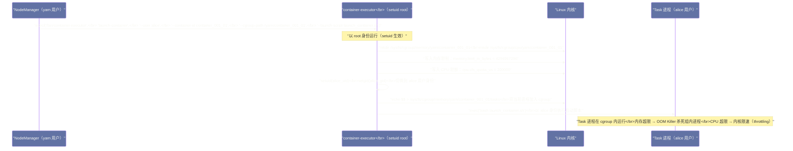

# YARN 资源隔离——CGroups 与 Linux Container Executor 的工程实现

## 摘要

本文深度解析 YARN 的资源隔离机制：为什么 YARN 的默认配置并不能真正隔离 Container 的资源、`LinuxContainerExecutor` 与 `DefaultContainerExecutor` 的本质区别在哪里、[[Linux CGroups]] 如何被 YARN 用于对 Container 进行硬性的 CPU 和内存限制、以及 YARN 的内存超限检测与 CGroups OOM Killer 两种内存限制机制的工作路径有何不同。文章还深入介绍了 YARN 对 Docker 容器的支持（`DockerContainerExecutor`），分析其带来的隔离增强和运维成本。理解 YARN 的资源隔离机制，是确保多租户集群稳定运行、防止"坏邻居"效应的工程基础。

---

## 第 1 章 资源隔离的必要性：多租户集群的"坏邻居"问题

### 1.1 没有隔离的集群会发生什么？

在一个多租户共享的 YARN 集群上，同一台物理机器可能同时运行来自不同用户、不同业务的 Container（Spark Executor、MapReduce Task 等）。如果没有有效的资源隔离机制，会发生什么？

**场景一：内存超限导致 OOM Killer 乱杀进程**

用户 Alice 的 Spark 作业申请了每个 Executor 4GB 内存，但实际运行中因为数据倾斜，某个 Task 处理的数据量远超预期，Executor 实际使用了 12GB 内存。在没有 CGroups 内存隔离的情况下，操作系统允许这个进程用掉 12GB，但当机器的总内存不够时，Linux 内核的 OOM Killer 会介入，**随机**选择一个内存使用量大的进程杀死——这个被杀死的进程很可能是用户 Bob 的某个正在正常工作的 Executor，而不是真正"越界"的 Alice 的 Executor。Bob 的作业因为 Executor 无故消失而失败，且很难定位原因（YARN 日志只显示"Container 被 NM 杀死"，不知道是被 OOM Killer 杀的）。

**场景二：CPU 密集型作业饿死其他作业**

用户 Charlie 提交了一个 CPU 密集型的机器学习训练作业，申请了 `{vcores: 2}`，但实际代码中启动了 8 个线程（例如使用了 OpenBLAS 的多线程矩阵运算）。在没有 CGroups CPU 限制的情况下，这个作业实际占用了 8 个物理 CPU 核，远超申请量，导致同一台机器上其他用户的 Container 几乎得不到 CPU 时间，作业运行极度缓慢，用户完全不知道原因。

**场景三：磁盘 I/O 竞争**

用户 Dave 的 Spark Shuffle 作业产生大量磁盘写入，占满了节点的磁盘 I/O 带宽，导致同一节点上其他 Container 的磁盘操作（如 HDFS DataNode 的写入）显著变慢，影响整个集群的读写性能。

这三个场景揭示了一个共同问题：**YARN 在调度层面按容量分配资源，但如果没有操作系统层面的强制执行，分配只是"纸面上的承诺"，无法阻止 Container 实际超用资源**。

### 1.2 资源隔离的两个层次

YARN 的资源隔离可以分为两个层次：

**软隔离（Soft Isolation）**：YARN 的 `ContainersMonitor` 通过轮询 `/proc/<pid>/status` 监控 Container 的内存使用，当超限时主动杀死 Container。这种方式有延迟（轮询间隔默认 3 秒），且依赖 YARN 用户态进程的检测，不是真正的操作系统强制执行。

**硬隔离（Hard Isolation）**：通过 Linux CGroups 在内核层面对 Container 进行资源限制。操作系统保证 Container 进程组无法超过 CGroups 配置的资源上限，超限时内核直接触发 OOM Killer（内存）或限速（CPU），不依赖用户态的检测。

只有实现硬隔离，才能真正解决多租户的"坏邻居"问题。

---

## 第 2 章 Linux CGroups 基础：YARN 隔离的内核基石

### 2.1 什么是 CGroups

**CGroups（Control Groups）** 是 Linux 内核提供的一种机制，用于将进程组织成层次化的组（Group），并对每个组施加资源使用限制、优先级控制和资源使用统计。

CGroups 的核心概念：
- **Subsystem（子系统/控制器）**：每种资源类型对应一个子系统，如 `memory`（内存控制）、`cpu`（CPU 份额）、`cpuacct`（CPU 使用统计）、`blkio`（块设备 I/O 控制）等
- **Hierarchy（层次结构）**：每个子系统组织成一棵树，父 cgroup 的限制覆盖子 cgroup
- **cgroup**：树中的一个节点，代表一组进程及其适用的资源限制
- **Task**：cgroup 中的一个进程（或线程）

YARN 主要使用以下两个 CGroups 子系统：
- **`memory` 子系统**：限制进程组的物理内存使用，超限时触发 OOM Killer 杀死组内进程
- **`cpu` 子系统**：通过 `cpu.shares`（相对权重）或 `cpu.cfs_period_us` + `cpu.cfs_quota_us`（绝对限额）控制 CPU 使用量

### 2.2 CGroups 的文件系统接口

CGroups 通过一个虚拟文件系统（`cgroupfs`）对外暴露接口。Linux 系统通常将 CGroups 挂载在 `/sys/fs/cgroup/` 下：

```bash
# 查看系统上的 CGroups 挂载情况
mount | grep cgroup
# cgroup on /sys/fs/cgroup/memory type cgroup (rw,memory)
# cgroup on /sys/fs/cgroup/cpu,cpuacct type cgroup (rw,cpu,cpuacct)

# 为 YARN Container 创建一个 cgroup（NM 的 container-executor 会执行类似操作）
mkdir /sys/fs/cgroup/memory/yarn/container_001_01_01_000001

# 设置内存限制（4GB）
echo 4294967296 > /sys/fs/cgroup/memory/yarn/container_001_01_01_000001/memory.limit_in_bytes

# 设置内存 + Swap 总量限制（禁止使用 Swap）
echo 4294967296 > /sys/fs/cgroup/memory/yarn/container_001_01_01_000001/memory.memsw.limit_in_bytes

# 将 Container 进程 PID 加入 cgroup
echo <container_pid> > /sys/fs/cgroup/memory/yarn/container_001_01_01_000001/tasks

# 设置 CPU 份额（相对权重，1024 为默认值，2048 表示是默认的 2 倍权重）
echo 2048 > /sys/fs/cgroup/cpu/yarn/container_001_01_01_000001/cpu.shares

# 设置 CPU 绝对限额（每 100ms 周期内最多使用 200ms CPU 时间，即 2 个 vCore）
echo 100000 > /sys/fs/cgroup/cpu/yarn/container_001_01_01_000001/cpu.cfs_period_us
echo 200000 > /sys/fs/cgroup/cpu/yarn/container_001_01_01_000001/cpu.cfs_quota_us
```

**通过文件系统接口操作 CGroups 的意义**：管理 CGroups 不需要特殊的系统调用，只需要对特定路径的文件进行读写（需要 root 权限或相应的目录权限）。这使得 YARN 的 `container-executor` 二进制程序可以用简单的文件操作来设置 Container 的资源限制，无需嵌入复杂的内核接口代码。

### 2.3 CGroups v1 vs. CGroups v2

CGroups 有两个版本：

**CGroups v1（旧版，大多数现有系统）**：每种资源类型（memory、cpu 等）有独立的层次结构，可以独立挂载。缺点是各子系统之间缺乏协调，配置复杂。

**CGroups v2（新版，Linux 4.5+）**：将所有子系统统一到一个层次结构，简化了配置，增加了更精细的资源控制能力（如 `memory.pressure` 的内存压力感知）。CentOS 8、Ubuntu 20.04+ 默认使用 CGroups v2。

YARN 3.3+ 开始支持 CGroups v2（通过 `yarn.nodemanager.linux-container-executor.cgroups.v2.enabled`），但生产环境中很多集群仍在使用 CGroups v1。本文主要以 CGroups v1 为例介绍 YARN 的隔离机制。

---

## 第 3 章 DefaultContainerExecutor vs. LinuxContainerExecutor

### 3.1 DefaultContainerExecutor：无真正隔离的默认模式

`DefaultContainerExecutor` 是 YARN 的默认 ContainerExecutor（`yarn.nodemanager.container-executor.class` 的默认值）。它的实现极为简单：

```java
// DefaultContainerExecutor 的核心启动逻辑（大幅简化）
public class DefaultContainerExecutor extends ContainerExecutor {

    @Override
    public int launchContainer(ContainerStartContext ctx) throws IOException {
        // 生成启动脚本 launch_container.sh
        writeLaunchEnv(ctx.getNmPrivateContainerScriptPath(), ...);

        // 直接以 NM 进程用户（yarn 用户）执行启动脚本
        // 注意：没有 CGroups 设置，没有用户切换！
        String[] command = {"bash", ctx.getContainerScriptPath().toString()};
        Process process = new ProcessBuilder(command)
            .redirectError(stderr)
            .redirectOutput(stdout)
            .start();

        return process.waitFor();
    }
}
```

`DefaultContainerExecutor` 的根本缺陷：
1. **以 yarn 用户身份运行所有 Container**：所有 Container 都以运行 NM 的用户（通常是 `yarn`）身份执行，没有用户级别的隔离——Alice 的 Task 可以读取 Bob 的文件（只要 `yarn` 用户有权限）
2. **没有 CGroups 限制**：子进程不被加入任何 CGroup，操作系统不会强制执行资源上限，Container 可以无限制地使用 CPU 和内存
3. **只有软内存检测**：依赖 `ContainersMonitor` 的轮询检测，有秒级延迟

### 3.2 LinuxContainerExecutor：生产环境的正确选择

`LinuxContainerExecutor`（LCE）通过 setuid 二进制程序 `container-executor` 实现了真正的用户隔离和 CGroups 硬隔离。

**配置方式**：

```xml
<!-- yarn-site.xml -->
<property>
  <name>yarn.nodemanager.container-executor.class</name>
  <value>org.apache.hadoop.yarn.server.nodemanager.LinuxContainerExecutor</value>
</property>
<property>
  <name>yarn.nodemanager.linux-container-executor.group</name>
  <value>hadoop</value>  <!-- NM 和 container-executor 共享的用户组 -->
</property>

<!-- 启用 CGroups 资源限制 -->
<property>
  <name>yarn.nodemanager.linux-container-executor.resources-handler.class</name>
  <value>org.apache.hadoop.yarn.server.nodemanager.util.CgroupsLCEResourcesHandler</value>
</property>
<property>
  <name>yarn.nodemanager.linux-container-executor.cgroups.hierarchy</name>
  <value>/yarn</value>  <!-- YARN Container 的 cgroup 根路径 -->
</property>
<property>
  <name>yarn.nodemanager.linux-container-executor.cgroups.mount</name>
  <value>true</value>   <!-- 允许 NM 自动挂载 cgroupfs -->
</property>
```

**`container-executor` 二进制程序的权限配置**：

```bash
# container-executor 必须以 root 为所有者，属于 hadoop 组，设置 setuid 位
chown root:hadoop /usr/lib/hadoop/bin/container-executor
chmod 6050 /usr/lib/hadoop/bin/container-executor
# 6050 = setuid(4000) + setgid(2000) + owner execute(0050)

# 验证权限
ls -la /usr/lib/hadoop/bin/container-executor
# -r-s--x--- 1 root hadoop 123456 Jan 1 00:00 container-executor
```

### 3.3 LCE 的执行流程：用户切换与 CGroups 设置的时序

当 NM 需要启动一个 Container 时，LCE 的完整执行时序如下：



**CGroups 设置在用户切换之前完成的关键性**：

注意时序图中，CGroups 的设置（写入限制参数）发生在 `setuid()` **之前**——此时 `container-executor` 还以 root 身份运行，有权限操作 `/sys/fs/cgroup/` 下的文件。`setuid()` 切换到 alice 用户后，alice 没有写入 cgroup 文件的权限，因此无法修改自己的资源限制（一个关键的安全保证：Container 内的用户代码不能绕过资源限制）。

然后，`container-executor` 将自身 PID 写入 `tasks` 文件（在切换到 alice 身份之后），再 `exec()` 执行启动脚本。由于 CGroups 是继承的（子进程自动加入父进程的 cgroup），后续 `exec()` 出来的 Task 进程及其所有子进程，都在这个 cgroup 的资源限制范围内。

---

## 第 4 章 内存隔离的两条路径

### 4.1 路径一：YARN 用户态检测（ContainersMonitor）

在没有启用 CGroups 的情况下（`DefaultContainerExecutor` 或 LCE 未配置 CGroups），YARN 通过 `ContainersMonitor` 的轮询检测来实现软内存隔离：

```
检测频率：每 3000ms（yarn.nodemanager.container-monitor.interval-ms）
检测方式：读取 /proc/<pid>/status 中的 VmRSS（物理内存）和 VmPeak
判断条件：VmRSS > Container 申请的内存量 × (1 + overhead_factor)
超限处理：NM 调用 kill -9 <pid> 杀死 Container 进程
```

**软检测的局限性**：
- **延迟**：轮询间隔 3 秒，Container 可能在被检测到超限之前，已经超用了数秒的内存，在内存紧张的机器上可能触发系统级 OOM Killer
- **准确性**：`/proc/<pid>/status` 只记录主进程的内存，如果 Container 通过子进程或 Native 内存分配了额外内存，可能漏检
- **可绕过性**：用户代码理论上可以通过 `fork()` 子进程来分散内存使用，绕过单进程的内存检测（虽然 YARN 会递归统计子进程，但实现较为复杂）

### 4.2 路径二：CGroups 内核硬限制

启用 CGroups 内存限制后，Container 进程的内存超限行为完全由 Linux 内核处理：

**内核的 OOM Killer 触发机制**：

```
Container 进程申请内存（malloc/mmap）
  → 内核检查 cgroup 当前使用量
  → 使用量 + 申请量 > memory.limit_in_bytes？
    → 是：触发 cgroup 级别的 OOM Killer
         → OOM Killer 选择 cgroup 内 oom_score 最高的进程杀死
         → 记录 OOM 事件到 /sys/fs/cgroup/memory/.../memory.oom_control
    → 否：分配内存，更新 usage_in_bytes
```

**CGroups 内存限制的两个关键参数**：

```bash
# 物理内存上限（硬限制）
memory.limit_in_bytes = Container 申请的内存量（MB）× 1024 × 1024

# 内存 + Swap 总量上限（防止 Container 通过 Swap 绕过内存限制）
memory.memsw.limit_in_bytes = 与 memory.limit_in_bytes 相同（禁用 Swap）
# 或者 = memory.limit_in_bytes × 2（允许有限使用 Swap）
```

**YARN 中的 CGroups 内存配置**：

```xml
<!-- yarn-site.xml：启用 CGroups 内存限制 -->
<property>
  <name>yarn.nodemanager.resource.memory.enabled</name>
  <value>true</value>
</property>
<!-- 设置 OOM 杀死策略：hard（内核直接杀死）或 soft（先尝试释放缓存再杀）-->
<property>
  <name>yarn.nodemanager.linux-container-executor.cgroups.memory-allocation-type</name>
  <value>hard</value>
</property>
```

### 4.3 两种内存限制方式的对比

| 维度 | YARN 软检测（ContainersMonitor）| CGroups 硬限制 |
|---|---|---|
| **检测层次** | 用户态（YARN NM 进程）| 内核态（Linux kernel）|
| **检测延迟** | 最大 3 秒（轮询间隔）| 即时（每次内存分配时检查）|
| **覆盖范围** | 主进程 + 子进程（递归）| 所有进程和线程（自动继承）|
| **超限处理** | NM 发送 SIGKILL | 内核 OOM Killer（可能杀死 cgroup 内任意进程）|
| **防止 Swap 绕过** | 否 | 是（通过 `memsw.limit_in_bytes`）|
| **配置复杂度** | 低（默认启用）| 较高（需要 LCE + CGroups 配置）|

> [!warning] 生产避坑：CGroups 内存限制导致 JVM Metaspace OOM
> CGroups 的内存限制是进程级别的全量内存（堆 + 非堆 + JVM 本身），而 Spark/YARN 配置的 `--executor-memory 4g` 只是 JVM 堆内存（`-Xmx`）。JVM 还会使用额外的 Metaspace、Code Cache、Direct Buffer 等非堆内存。
>
> 如果 CGroups 的 `memory.limit_in_bytes` 设置得与 Container 申请量完全相同（不加 overhead），JVM 非堆内存可能触发 CGroups OOM Killer，杀死 Executor 进程。YARN 的 `CgroupsLCEResourcesHandler` 会自动将 CGroups 限制设置为 Container 申请量 × `yarn.nodemanager.resource.memory.overhead`（默认 1.0，即与申请量相同），而容器真正可用的内存上限是申请量 + overhead。确保 `spark.yarn.executor.memoryOverhead` 配置足够大（建议至少 512MB，对于大 Executor 建议 executor-memory × 10%）。

---

## 第 5 章 CPU 隔离：份额限制与绝对限额的选择

### 5.1 两种 CPU 控制模式

YARN 支持两种 CGroups CPU 控制方式，对应 CGroups 的 `cpu.shares` 和 `cpu.cfs_quota_us`：

**模式一：cpu.shares（相对权重，弹性 CPU）**

`cpu.shares` 控制的是 CPU 时间的**相对分配权重**，不是绝对上限。当 CPU 空闲时，Container 可以使用超过其份额的 CPU；当 CPU 竞争时，内核按照各 cgroup 的 `shares` 比例分配 CPU 时间。

```bash
# Container 申请 2 vCores，NM 节点有 16 个物理核
# YARN 设置：cpu.shares = 2 × 1024 = 2048（每个 vCore 对应 1024 shares）
echo 2048 > /sys/fs/cgroup/cpu/yarn/container_001/cpu.shares
```

优点：CPU 使用弹性，Container 可以在机器空闲时"借用"更多 CPU，提高整体利用率。
缺点：无法严格限制 CPU 上限，CPU 密集型的 Container 在机器空闲时可以独占所有 CPU，影响其他 Container 的响应时间（即使后者有实时需求）。

**模式二：cpu.cfs_quota_us（CFS 绝对限额，硬 CPU）**

CFS（Completely Fair Scheduler）是 Linux 内核的默认 CPU 调度器。通过 `cfs_period_us`（调度周期）和 `cfs_quota_us`（每个周期内允许使用的 CPU 时间），可以精确控制 Container 的最大 CPU 使用量：

```bash
# Container 申请 2 vCores
# 设置：每 100ms 周期内最多使用 200ms CPU 时间（= 2 个 vCore）
echo 100000 > /sys/fs/cgroup/cpu/yarn/container_001/cpu.cfs_period_us
echo 200000 > /sys/fs/cgroup/cpu/yarn/container_001/cpu.cfs_quota_us
# 当 Container 在一个周期内用完 200ms 后，剩余时间被节流（throttled），不分配 CPU
```

优点：严格限制 CPU 上限，完全防止 CPU 超用。
缺点：即使机器 CPU 空闲，Container 也不能超过配额使用，可能导致 CPU 利用率低下（"CPU 节流"问题）。

**YARN 的默认选择**：

YARN 默认使用 `cpu.shares` 模式（弹性），通过 `yarn.nodemanager.linux-container-executor.cgroups.strict-resource-usage` 来切换到严格模式（`cpu.cfs_quota_us`）：

```xml
<property>
  <name>yarn.nodemanager.linux-container-executor.cgroups.strict-resource-usage</name>
  <value>false</value>  <!-- false = 弹性模式（cpu.shares），true = 严格模式（cfs_quota）-->
</property>
```

> [!note] 设计哲学：为什么 YARN 默认选择弹性 CPU 模式？
> 大数据批处理作业（MapReduce、Spark 批处理）的主要目标是最大化集群吞吐量，而不是保证每个 Container 的 CPU 响应时间。在批处理场景下，当某个 Container 的 Task 特别 CPU 密集（如排序、压缩），允许它"借用"闲置的 CPU 时间可以显著减少整体作业的完成时间。严格 CPU 限额在批处理场景下往往得不偿失。
>
> 但对于混合部署了在线服务和离线作业的集群，或者需要保证调度延迟的 Spark Streaming 作业，应该开启严格模式，确保高优先级的 Container 不被 CPU 密集型 Container 饿死。

### 5.2 CPU 节流问题排查

在严格 CPU 模式下，如果 Container 的 CPU 使用率高（如 100% vCore 使用），经常出现"CPU 节流"（CPU Throttling）——Container 在调度周期内用完配额后，剩余时间被强制等待，整体性能下降。

排查命令：

```bash
# 检查 Container 的 CPU 节流情况
cat /sys/fs/cgroup/cpu/yarn/container_001/cpu.stat
# nr_periods 100    # 检测周期总数
# nr_throttled 45   # 被节流的周期数
# throttled_time 2500000000  # 被节流的总时间（纳秒），即 2.5 秒

# 节流率 = nr_throttled / nr_periods = 45%（说明有严重节流）
```

如果节流率超过 20%，说明 Container 的 CPU 配额（`--executor-cores`）设置不足，Task 的实际 CPU 需求超过了 YARN 分配的 vCores 数量。解决方案：适当增加 `--executor-cores`，或降低每个 Executor 的并发 Task 数（`spark.executor.cores`）。

---

## 第 6 章 Docker ContainerExecutor：更彻底的隔离

### 6.1 为什么需要 Docker 容器隔离

CGroups + `LinuxContainerExecutor` 提供了资源量的隔离（CPU、内存），但没有提供**文件系统隔离**和**网络隔离**——不同用户的 Container 仍然共享同一个文件系统视图和网络命名空间，存在以下问题：

- **依赖冲突**：用户 Alice 的 Task 需要 Python 3.8 + TensorFlow 2.x，用户 Bob 的 Task 需要 Python 3.10 + PyTorch，两者的 Python 运行时互相冲突，无法在同一台机器上共存（除非用虚拟环境，但虚拟环境的管理对大量 NM 节点来说运维成本极高）
- **端口冲突**：多个 Container 可能尝试监听同一个端口（如 Spark Executor 的调试端口），导致冲突
- **安全边界模糊**：同一台机器上的 Container 可以互相看到对方的进程（通过 `ps` 命令），可能泄露应用信息

**Docker ContainerExecutor** 通过 Docker 容器（利用 Linux Namespace 实现文件系统、网络、进程的完整隔离）解决这些问题。

### 6.2 YARN Docker 容器执行的配置

```xml
<!-- yarn-site.xml：配置 Docker ContainerExecutor -->
<property>
  <name>yarn.nodemanager.container-executor.class</name>
  <value>org.apache.hadoop.yarn.server.nodemanager.LinuxContainerExecutor</value>
</property>
<!-- 允许使用 Docker 容器（LCE 支持 Docker 作为可选运行时）-->
<property>
  <name>yarn.nodemanager.linux-container-executor.docker-capabilities</name>
  <value>CHOWN,DAC_OVERRIDE,FSETID,FOWNER,MKNOD,NET_RAW,SETGID,SETUID,SETFCAP,SETPCAP,NET_BIND_SERVICE,SYS_CHROOT,KILL,AUDIT_WRITE</value>
</property>
<property>
  <name>yarn.nodemanager.linux-container-executor.docker.allowed-container-networks</name>
  <value>bridge,host,none</value>
</property>
```

AM 在 `ContainerLaunchContext` 中指定 Docker 镜像：

```xml
<!-- ContainerLaunchContext 的 environment 字段中 -->
YARN_CONTAINER_RUNTIME_TYPE=docker
YARN_CONTAINER_RUNTIME_DOCKER_IMAGE=tensorflow/tensorflow:2.10.0-gpu
YARN_CONTAINER_RUNTIME_DOCKER_MOUNTS=/etc/passwd:/etc/passwd:ro,/home:/home:rw
```

### 6.3 Docker 隔离的代价

Docker ContainerExecutor 带来了更强的隔离，但也引入了额外的复杂性：

| 维度 | LCE + CGroups | Docker ContainerExecutor |
|---|---|---|
| **文件系统隔离** | 否（共享 Host 文件系统）| 是（独立的容器文件系统）|
| **网络隔离** | 否（共享 Host 网络）| 可选（bridge/host/none）|
| **进程隔离** | 否（可见 Host 所有进程）| 是（独立 PID Namespace）|
| **依赖管理** | 需要在 Host 安装所有依赖 | 每个容器独立镜像，依赖隔离 |
| **启动延迟** | 低（无容器运行时开销）| 略高（镜像拉取 + 容器创建）|
| **镜像管理** | 不需要 | 需要镜像仓库 + 镜像分发 |
| **GPU 支持** | 通过 CGroups GPU 资源 | 通过 NVIDIA Container Toolkit |
| **运维复杂度** | 中 | 高 |

**Docker 镜像缓存的重要性**：

Docker 容器启动时，如果本地没有缓存镜像，需要从镜像仓库拉取（可能几百 MB 到几 GB）。在集群启动大量 Container 时，并发拉取镜像会对镜像仓库产生巨大压力，也会显著增加 Container 的启动延迟。

生产环境建议：
1. 在每个 NM 节点上预先拉取常用镜像（通过 `docker pull` 或 `containerd pull`）
2. 使用私有镜像仓库（如 Harbor），部署在集群内网，减少拉取延迟
3. 配置 `yarn.nodemanager.linux-container-executor.docker.image-pull-strategy` 为 `ifNotPresent`，避免每次都拉取最新镜像

---

## 第 7 章 小结：YARN 资源隔离的层次化防御体系

YARN 的资源隔离形成了一个层次化的防御体系：

**第一层（软隔离）**：`ContainersMonitor` 的轮询检测——低成本，默认启用，对大多数正常的 Container 超限场景有效，但有秒级延迟。

**第二层（硬隔离）**：`LinuxContainerExecutor` + CGroups——用户级隔离 + 内核级资源限制，是生产环境的标准配置，确保 Container 无法超用 CPU 和内存，且不同用户的文件系统权限严格隔离。

**第三层（容器隔离）**：`Docker ContainerExecutor`——文件系统、网络、进程的完整隔离，适合需要严格多租户安全边界或需要自定义运行时环境（AI/ML 依赖）的场景，代价是更高的运维复杂度。

**生产环境推荐配置**：至少启用 `LinuxContainerExecutor` + CGroups 内存硬限制。CPU 模式根据业务需求选择（批处理首选弹性模式，混合部署首选严格模式）。只有在明确需要依赖隔离或强多租户安全的场景下，才引入 Docker ContainerExecutor。

下一篇文章，我们深入 YARN 的高可用与故障恢复机制——ResourceManager HA 的 ZooKeeper 状态存储、Active/Standby 切换、以及 AM 重启后的 Container 恢复流程。

---

> [!note] 思考题
> 1. CGroups 的 CPU 隔离（`cpu.shares` 和 `cpu.cfs_quota_us`）有两种模式：软限制（shares，按比例分配，CPU 空闲时可超额使用）和硬限制（cfs_quota，严格限制最大 CPU 使用率）。YARN 的 `yarn.nodemanager.linux-container-executor.cgroups.strict-resource-usage` 参数控制使用哪种模式。在计算密集型作业（如 Spark）与 I/O 密集型作业（如 Hive Tez）混部时，软限制和硬限制各有什么优缺点？
> 2. Linux Container Executor（LCE）是 YARN 的安全容器执行器，要求以提交作业的用户身份运行 Container 进程，防止不同用户的 Container 互相影响。LCE 依赖一个 SetUID 的 `container-executor` 二进制文件来切换用户身份。如果攻击者通过提交恶意代码获得了 YARN Container 的执行权限，LCE 能够防止他们提权到 root 吗？还有哪些安全边界是 LCE 无法防护的？
> 3. YARN 的内存隔离依赖 CGroups 的 `memory.limit_in_bytes` 硬限制，超过限制的进程会被 OOM Killer 杀死。但 YARN Container 中运行的 JVM 进程（如 Spark Executor）使用了大量 JVM 堆外内存（Direct Memory、MemoryMapped Files），这些堆外内存也占用 OS 内存，但不受 JVM `-Xmx` 控制。如何在设置 CGroup 内存限制时为 JVM 堆外内存留出足够空间，避免 Container 因堆外内存导致的 OOM Kill？

## 参考资料

- Apache Hadoop 官方文档：[YARN CGroups](https://hadoop.apache.org/docs/current/hadoop-yarn/hadoop-yarn-site/NodeManagerCgroups.html)
- Apache Hadoop 官方文档：[Using YARN with Docker](https://hadoop.apache.org/docs/current/hadoop-yarn/hadoop-yarn-site/DockerContainers.html)
- Linux 内核文档：[Control Groups v1](https://www.kernel.org/doc/html/latest/admin-guide/cgroup-v1/cgroups.html)
- Linux 内核文档：[Memory Resource Controller](https://www.kernel.org/doc/html/latest/admin-guide/cgroup-v1/memory.html)
- Apache Hadoop 源码：`org.apache.hadoop.yarn.server.nodemanager.LinuxContainerExecutor`
- Apache Hadoop 源码：`org.apache.hadoop.yarn.server.nodemanager.util.CgroupsLCEResourcesHandler`
