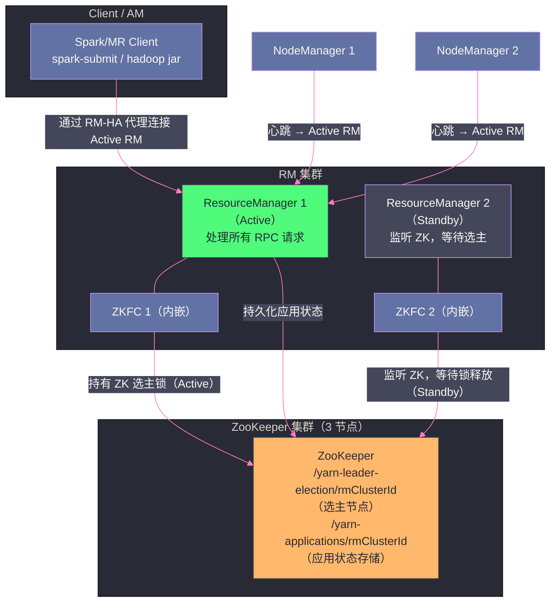
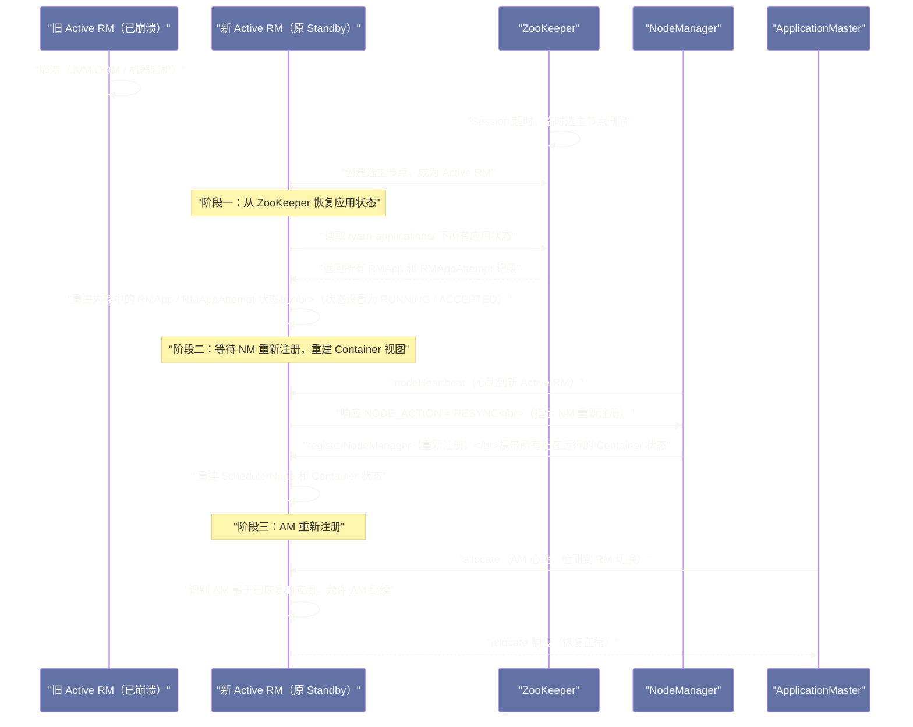

# YARN 高可用与故障恢复——ResourceManager HA 与 AM 重试机制

## 摘要

本文深度解析 YARN 的高可用架构。与 HDFS NameNode HA 相比，YARN RM HA 有其特殊性：RM 的状态比 NameNode 更"重"（不仅要恢复应用列表，还要恢复所有 Container 的状态），但又必须在 30 秒内完成主备切换，否则已提交的作业会大量超时失败。本文拆解三个核心机制：**RM Active/Standby 的 ZooKeeper 选主与状态持久化（RMStateStore）**、**RM 重启后如何通过 NM 的"RESYNC 心跳"重建 Container 视图**、以及 **AM 失败时 YARN 的重试策略与应用恢复机制**。理解这套故障恢复体系，是在生产环境中合理配置 HA 参数、快速定位 RM 切换导致的作业异常的基础。

---

## 第 1 章 为什么 YARN RM HA 比 HDFS NameNode HA 更复杂？

在第六篇 HDFS 系列文章中，我们详细分析了 NameNode HA：Active NN 和 Standby NN 通过共享的 JournalNode 集群同步 EditLog，Standby NN 持续回放 EditLog 保持与 Active NN 的元数据同步，使得主备切换时 Standby NN 能在秒级内接管服务。

YARN RM HA 面临类似的挑战——**单点 RM 故障不能导致已提交作业丢失**，但 RM 状态的恢复比 NameNode 更复杂，原因在于：

**NameNode 的状态是"静态的文件系统元数据"**：文件树、Block 映射、DataNode 注册信息——这些信息变化频率相对稳定，可以通过 EditLog 进行完整记录。

**RM 的状态是"动态的作业调度状态"**，包含：
- 正在运行的应用列表（`RMApp`）及其状态
- 每个应用的 AM 状态（在哪个节点、什么状态）
- 每个应用已分配的 Container 列表（在哪个节点、资源量、状态）
- 调度器的队列状态（各队列用了多少资源）
- 所有 NM 的注册信息和心跳状态

如果 RM 重启后要完全恢复所有这些状态，代价是巨大的——RM 需要读取 ZooKeeper 中的所有应用状态，重建调度器的数据结构，同时所有 NM 都在等待 RM 恢复并重新注册（期间无法启动新的 Container）。

YARN 的设计选择了一个务实的折中方案：**持久化关键状态（应用、AM），依赖 NM 心跳重建 Container 状态**。这使得 RM HA 的恢复时间控制在可接受范围内。

---

## 第 2 章 RM HA 架构：Active/Standby 与 ZooKeeper 选主

### 2.1 RM HA 的整体架构

YARN RM HA 采用与 HDFS NameNode HA 相同的 Active/Standby 双机架构，但没有使用 QJM（JournalNode）同步状态，而是直接使用 ZooKeeper 作为状态存储。



### 2.2 RM HA 的选主机制：内嵌 ZKFC

与 HDFS 使用独立的 `DFSZKFailoverController`（ZKFC）进程不同，YARN 的 ZKFC 内嵌在 RM 进程中，由 `ActiveStandbyElector`（Hadoop 内部库）实现 ZooKeeper 选主：

**选主流程**：

1. 两个 RM 启动时，都尝试在 ZooKeeper 上创建 `/{zk-root}/{cluster-id}/ActiveStandbyElector-lock` 临时节点（Ephemeral Node）
2. ZooKeeper 保证只有一个 RM 能创建成功（因为节点不能重复创建）
3. 创建成功的 RM 变为 Active，开始处理请求；另一个 RM 变为 Standby，监听该临时节点的删除事件
4. 当 Active RM 崩溃时，其 ZooKeeper Session 超时，临时节点自动删除
5. Standby RM 监听到节点删除，重新发起创建竞争，成为新的 Active RM

**配置方式**：

```xml
<!-- yarn-site.xml：RM HA 基础配置 -->
<property>
  <name>yarn.resourcemanager.ha.enabled</name>
  <value>true</value>
</property>
<property>
  <name>yarn.resourcemanager.cluster-id</name>
  <value>yarn-cluster-prod</value>
</property>
<!-- 声明 RM 列表 -->
<property>
  <name>yarn.resourcemanager.ha.rm-ids</name>
  <value>rm1,rm2</value>
</property>
<!-- rm1 的主机配置 -->
<property>
  <name>yarn.resourcemanager.hostname.rm1</name>
  <value>rm-host1.example.com</value>
</property>
<property>
  <name>yarn.resourcemanager.hostname.rm2</name>
  <value>rm-host2.example.com</value>
</property>
<!-- ZooKeeper 地址 -->
<property>
  <name>yarn.resourcemanager.zk-address</name>
  <value>zk1:2181,zk2:2181,zk3:2181</value>
</property>
```

### 2.3 Client 如何自动重连到新的 Active RM

当 Active RM 切换后，所有连接到旧 Active RM 的 Client、AM、NM 都会收到连接失败异常。YARN 通过 **RM HA 代理（`ConfiguredRMFailoverProxyProvider`）** 实现对 Client 透明的自动重连：

Client 配置了 RM HA 后，`ConfiguredRMFailoverProxyProvider` 会：
1. 维护所有 RM 地址的列表
2. 当某个 RM 的 RPC 请求失败时，自动切换到列表中的下一个 RM 地址重试
3. 对上层调用透明——Client 代码无需任何修改

同样，NM 和 AM 在检测到 RM RPC 失败后，也会自动重试连接另一个 RM：
- NM：通过 `ResourceTrackerService` 的重试机制，重新注册并发送心跳
- AM：通过 `ApplicationMasterProtocol` 的重试机制，重新注册并继续心跳

---

## 第 3 章 RMStateStore：RM 状态持久化的设计

### 3.1 RMStateStore 存储什么状态

RMStateStore 是 RM 状态持久化的核心组件，它负责将 RM 的关键状态写入持久化存储（ZooKeeper 或文件系统），确保 RM 重启后能恢复。

RMStateStore 持久化的内容：

**应用层面**：
- 每个已提交的应用的基本信息（`RMApp`）：ApplicationId、应用名称、用户、队列、提交时间
- 每个应用的 AM 尝试信息（`RMAppAttempt`）：AM 的 ContainerId、所在节点、AM 的 Tracking URL

**安全层面**：
- Application Token（AM 用于访问 RM 的凭证）
- Delegation Token（用户的 Kerberos 委托凭证）

RMStateStore **不持久化**的内容：
- 调度器的队列状态（重启后从配置文件重新加载）
- Container 的详细状态（重启后从 NM 心跳重建，见第 4 章）
- NM 的注册信息（重启后 NM 重新注册）

这个设计选择体现了一个重要权衡：**持久化越少，RM 重启越快；但持久化越少，重启后需要更多的"重建"过程**。YARN 的选择是：只持久化"用户可见"的关键信息（应用和 AM 状态），让"内部运行时状态"（Container 状态）通过心跳重建。

### 3.2 RMStateStore 的三种实现

YARN 提供了三种 `RMStateStore` 实现：

**`MemoryRMStateStore`（默认，不适合 HA）**：

状态仅存储在 RM 内存中，RM 重启后所有状态丢失。只适用于开发测试环境，生产环境禁用。

**`ZKRMStateStore`（推荐，与 RM HA 配套）**：

状态存储在 ZooKeeper 中。ZooKeeper 的 ZNode 结构如下：

```
/{zk-root}/{cluster-id}/
  RM_APP/
    application_1234567890_0001/    # 应用 1 的状态
      ATTEMPT/
        appattempt_1234567890_0001_000001/  # AM 第 1 次尝试
    application_1234567890_0002/    # 应用 2 的状态
      ATTEMPT/
        ...
  RM_DT_SECRET_MANAGER/            # Delegation Token 管理器状态
  RM_DELEGATION_TOKENS/            # 委托 Token
  ActiveStandbyElector-lock        # 选主锁（Active RM 持有）
```

ZooKeeper 同时承担了两个职责：选主（通过临时节点）和状态存储（通过持久节点）。这个设计的好处是减少了外部依赖（只需要一套 ZooKeeper）；缺点是 ZooKeeper 不适合存储大量数据（每个 ZNode 数据上限为 1MB），当集群有大量并发应用时，ZooKeeper 的负载会增加。

**`FileSystemRMStateStore`（HDFS 存储）**：

状态存储在 HDFS 上，适合有大量应用状态需要持久化的场景（HDFS 没有 ZooKeeper 的 ZNode 大小限制）。但需要 HDFS 和 ZooKeeper 同时可用，依赖更多。

```xml
<!-- yarn-site.xml：配置 ZKRMStateStore -->
<property>
  <name>yarn.resourcemanager.store.class</name>
  <value>org.apache.hadoop.yarn.server.resourcemanager.recovery.ZKRMStateStore</value>
</property>
<property>
  <name>yarn.resourcemanager.zk-state-store.address</name>
  <value>zk1:2181,zk2:2181,zk3:2181</value>
</property>
<property>
  <name>yarn.resourcemanager.zk-state-store.root-node.acl</name>
  <!-- 仅允许 yarn 用户读写 ZK 状态，增强安全性 -->
  <value>sasl:yarn:rwcda</value>
</property>
```

### 3.3 状态写入的时序：先写 Store，再执行操作

RM 在执行任何关键状态变更（应用提交、AM 启动、应用完成）时，必须先将新状态写入 `RMStateStore`，然后才在内存中更新状态、执行后续操作。这个"先写持久化存储"的设计保证了状态的一致性：

```
// 应用状态变更的事务性保证（伪代码）
void submitApplication(ApplicationSubmissionContext ctx) {
    // 1. 先写 ZooKeeper
    rmStateStore.storeApplicationState(appId, rmAppState);  // 同步写入，失败则抛异常

    // 2. ZooKeeper 写入成功后，才更新内存状态
    rmContext.getRMApps().put(appId, rmApp);
    rmApp.handle(new RMAppEvent(appId, RMAppEventType.START));
}
```

如果写入 ZooKeeper 失败（如 ZooKeeper 集群不可用），RM 会拒绝该操作并返回错误给 Client，而不会在内存中产生与 ZooKeeper 不一致的状态。

> [!warning] 生产避坑：ZooKeeper 延迟过高导致 RM 吞吐量下降
> 每次应用提交都需要同步写入 ZooKeeper，如果 ZooKeeper 的 fsync 延迟较高（通常 2~5ms），在高并发作业提交场景下（如早晚高峰提交大量 Spark 作业），RM 的应用提交吞吐量会受到 ZooKeeper 写入延迟的限制。
>
> **优化方向**：
> 1. 将 ZooKeeper 的事务日志（`dataLogDir`）挂载在 SSD 磁盘上，将 fsync 延迟从 5ms 降低到 0.5ms
> 2. 使用 `yarn.resourcemanager.zk-async-writes` 配置异步写入 ZooKeeper（牺牲一定的一致性保证，换取更高的写入吞吐量）

---

## 第 4 章 RM 重启恢复：从 ZK 读取状态 + NM RESYNC 重建

### 4.1 RM 重启恢复的完整流程

当 Active RM 崩溃后，新的 Active RM（原 Standby）启动恢复流程：



### 4.2 NM RESYNC：Container 状态的重建机制

RM 重启后最关键的恢复机制是 **NM RESYNC（重同步）**。RM 重启后不知道集群中哪些 Container 正在运行，它需要通过 NM 心跳来重建这个信息。

**RESYNC 的工作流程**：

1. NM 仍然在运行（RM 重启不影响 NM），NM 继续运行当前的 Container
2. NM 下一次心跳时，发现 RM 地址切换（或收到 RM 发来的 RESYNC 响应），知道 RM 刚刚重启
3. NM 发送 `registerNodeManager` 请求，在注册信息中携带**当前正在运行的所有 Container 的状态**
4. 新的 Active RM 收到 NM 的重新注册后，从注册信息中提取 Container 列表，将这些 Container 关联到已恢复的 `RMApp` 上，重建 `SchedulerNode.launchedContainers` 的状态

**RM 不知道该 Container 归属时的处理**：

NM 上报的 Container 中，可能有一些 RM 在 ZooKeeper 中没有对应的应用记录（例如，应用在 RM 崩溃前已经完成，但 NM 还没来得及清理）。对于这类"孤儿 Container"，RM 会在心跳响应中将其加入 `containersToCleanup` 列表，指示 NM 清理这些 Container。

### 4.3 RM 重启的影响窗口

RM 主备切换有一个"影响窗口"——从旧 Active RM 崩溃到新 Active RM 完全恢复并接受请求的时间段。在这个窗口内：

**正在运行的 Container**：不受影响（Container 由 NM 管理，RM 崩溃不会杀死 Container）

**正在等待 Container 分配的 AM**：AM 心跳会失败，AM 内部的重试机制会等待 RM 恢复。在 RM 恢复后，AM 重新注册并继续申请 Container。等待时间取决于 RM 恢复速度（通常 30~60 秒）。

**正在提交中的应用（Client 的 `submitApplication` 调用）**：如果 `submitApplication` 在 RM 崩溃时已经完成并写入了 ZooKeeper，RM 恢复后应用会正常继续。如果 `submitApplication` 在 RM 崩溃时还未完成（未写入 ZooKeeper），Client 会收到 RPC 异常，需要重新提交。

> [!info] 核心概念：`yarn.resourcemanager.recovery.enabled` 的作用
> RM HA 需要配合 `yarn.resourcemanager.recovery.enabled = true` 才能实现真正的状态恢复。如果只配置了 HA（Active/Standby 切换）但没有启用 `recovery`，RM 切换时所有正在运行的应用都会丢失，需要重新提交。这是一个常见的配置误区。

---

## 第 5 章 AM 的故障恢复：重试策略与应用重建

### 5.1 AM 失败的类型与 YARN 的处理策略

**AM Container 失败**（AM 所在的 Container 崩溃）：

当 AM Container 失败时（JVM OOM、节点宕机、Container 被杀），YARN RM 的 `ApplicationsManager` 会检测到 AM Container 的失败事件，并根据以下逻辑决定是否重试：

```
AM 重试次数 < yarn.resourcemanager.am.max-attempts（默认 2）？
  → 是：重新为该应用分配一个新的 AM Container，启动 AM
  → 否：将应用标记为 FAILED，不再重试
```

AM 重试时，会创建一个新的 `ApplicationAttempt`（AM 尝试），每个 `ApplicationAttempt` 有独立的 AttemptId（格式：`appattempt_<appId>_<attemptNumber>`）。

**AM 心跳超时**（AM 进程存活但心跳停止）：

AM 必须定期发送 `allocate` 心跳（默认每 1 秒）。如果 RM 在 `yarn.am.liveness-monitor.expiry-interval-ms`（默认 600 秒，即 10 分钟）内没有收到 AM 的心跳，RM 认为 AM 已失活，将 AM Container 强制杀死，触发 AM 重试。

### 5.2 AM 重启后的应用恢复

当 AM 因失败被重新启动时，新启动的 AM 需要重建应用的内部状态。这个重建过程的难度因计算框架而异：

**MapReduce AM 的重建（`MRAppMaster`）**：

MapReduce AM 在每次 Task 完成时，会将完成的 Task 信息写入 HDFS 的 Job History（通过 `JobHistoryEventHandler`）。新 AM 启动后，读取 Job History，确认哪些 Task 已经完成，只重新提交未完成的 Task。

但 MR AM 不保存 Reduce Task 的输入位置信息（即哪些 Map Task 的输出在哪里）。如果大量 Map Task 已完成但 Shuffle 数据没有被 Reduce Task 读取，AM 重启后可能需要重新运行部分 Map Task（如果原 Map Task 的输出所在节点已下线）。

**Spark AM 的重建**：

如前文所述，Spark AM 重启意味着 Driver 重启，整个 Spark 作业从头开始执行，没有断点续传。对于 Spark Streaming，通过 Checkpoint 机制可以恢复流处理进度。

**Flink AM 的重建**：

Flink 的 AM（JobManager）支持通过 Checkpoint 机制恢复状态——Flink 的每个 Task 定期将状态快照写入分布式存储（如 HDFS），AM 重启后从最近的 Checkpoint 恢复，不需要从头开始处理数据。这是 Flink 在 AM 容错上比 Spark 更完善的地方。

### 5.3 Container 的保留策略（Work-Preserving Restart）

YARN 提供了 **Work-Preserving AM Restart（保留工作的 AM 重启）** 机制（通过 `yarn.app.mapreduce.am.job.recovery.enable` 等应用特定配置控制），允许 AM 重启后**保留已分配的 Container**，而不是释放所有 Container 再重新申请。

**原理**：

RM 在恢复 AM 状态时（从 ZooKeeper 读取 `RMAppAttempt` 信息），同时也恢复了该 AM 持有的 Container 列表（通过 NM RESYNC 重建）。当新 AM 重新注册后，RM 将这些已分配的 Container"转移"给新的 AM（通过在新 AM 的第一个 `allocate` 响应中返回这些 Container）。

**效果**：

新 AM 不需要重新申请 Container，可以直接使用原来的 Container 继续工作。对于 MapReduce，这意味着已完成的 Map Task 的输出仍然在原 Reducer Container 所在节点上，不需要重跑 Map Task。

**限制**：

Work-Preserving Restart 要求新 AM 能够识别并接管已有的 Container。MapReduce 的 `MRAppMaster` 实现了这个逻辑，但 Spark 和 Flink 默认不支持这个机制（它们在 AM 重启时会重新申请所有 Executor，原有的 Executor Container 会被 RM 回收）。

---

## 第 6 章 NM 的故障处理：节点失效与 Container 迁移

### 6.1 RM 如何检测 NM 失效

RM 通过 NM 心跳超时来检测节点失效：

```
NM 心跳超时阈值：yarn.nm.liveness-monitor.expiry-interval-ms（默认 600000ms = 10 分钟）
```

如果 RM 在 10 分钟内没有收到某个 NM 的心跳，RM 将该 NM 标记为 `LOST`，并执行以下操作：
1. 将该 NM 上所有运行中的 Container 标记为 `COMPLETE(FAILED)`
2. 通过 `allocate` 响应通知所有受影响的 AM（Container 失败通知）
3. 从调度器的 `SchedulerNode` 列表中移除该节点，不再向其分配新的 Container

**为什么 NM 失效超时这么长（10 分钟）？**

在网络抖动（如机架级别的短暂网络故障）场景下，NM 可能暂时无法向 RM 发送心跳，但节点和其上运行的 Container 是正常的。如果超时太短，网络抖动就会触发大量 Container 失败，导致作业重试，造成不必要的资源浪费。10 分钟的超时是在"快速检测真实故障"和"容忍网络抖动"之间的权衡。

对于对故障检测时间敏感的场景（如实时流处理），可以适当缩短此超时（如 2~3 分钟）。

### 6.2 节点降级：Graceful Decommission

除了异常失效，生产集群中经常需要有计划地下线节点（如机器维护、硬件升级）。YARN 提供了 **Graceful Decommission（优雅下线）** 机制，允许在不强制杀死 Container 的情况下平滑下线节点：

```bash
# 将节点加入下线列表（通知 RM 该节点即将下线）
yarn rmadmin -decommissionNodes node1.example.com

# RM 收到下线请求后：
# 1. 不再向该节点分配新的 Container
# 2. 等待该节点上所有 Container 自然完成
# 3. 所有 Container 完成后，将节点状态置为 DECOMMISSIONED
# 4. 新的 AM 申请资源时不会看到这个节点

# 查看下线进度
yarn node -list -states DECOMMISSIONING
```

**超时强制下线**：如果 Graceful Decommission 等待时间超过配置的超时（`yarn.resourcemanager.decommissioning-nodes-watcher.wait-for-applications`），RM 会强制下线节点，终止其上所有 Container。

---

## 第 7 章 RM HA 与 HDFS NameNode HA 的关键差异对比

理解 YARN RM HA 与 HDFS NameNode HA 的异同，有助于在架构设计时做出正确决策：

| 维度 | HDFS NameNode HA | YARN ResourceManager HA |
|---|---|---|
| **选主机制** | ZKFC（独立进程）+ ZooKeeper | 内嵌 ActiveStandbyElector + ZooKeeper |
| **状态同步方式** | Active NN 写 EditLog 到 JournalNode，Standby NN 实时回放 | Active RM 写状态到 ZooKeeper，Standby RM 直接读取 |
| **切换时的状态一致性** | 近实时同步（JournalNode 方案下 Standby NN 几乎与 Active NN 同步）| 切换前写入 ZK 的状态一致，Container 状态需等待 NM 重新注册重建 |
| **切换时间** | 通常 30~60 秒 | 通常 30~90 秒（含等待 NM RESYNC）|
| **正在运行的 Task** | 不受 NN 切换影响（DataNode 继续工作）| 不受 RM 切换影响（Container 在 NM 上继续运行）|
| **正在进行的 RPC** | 失败，客户端需重试 | 失败，客户端/AM/NM 自动重试 |
| **脑裂防护** | Fencing（SSH 命令 / shell 脚本杀死旧 Active NN）| ZooKeeper 选主锁天然防脑裂（只有持锁者才是 Active）|
| **历史数据丢失风险** | 无（EditLog 持久化所有变更）| 极小（ZK 中的应用状态持久化，Container 状态通过心跳重建）|

> [!note] 设计哲学：为什么 YARN 不用 JournalNode？
> HDFS NameNode 使用 JournalNode 的原因是：NameNode 的状态变更非常频繁（每次文件创建/修改/删除都产生 EditLog），且状态量巨大（数亿个文件的元数据）。Standby NN 需要实时回放 EditLog 才能保持与 Active NN 的同步，在 Active NN 崩溃时几乎可以无缝接管。
>
> YARN RM 的状态变更频率相对较低（主要是应用提交和完成），且状态量更小（通常几千个应用，不是数亿个文件）。使用 ZooKeeper 直接存储状态（而不是 EditLog）更简单，且不需要额外部署 JournalNode 集群。代价是 RM 重启后需要通过 NM RESYNC 重建 Container 状态，有 30~90 秒的恢复延迟，但对于批处理作业调度场景，这个延迟是可以接受的。

---

## 第 8 章 小结：YARN HA 的工程哲学

YARN 的高可用架构体现了"**最小化持久化，最大化心跳重建**"的工程哲学：

- **持久化最关键的用户可见状态**（应用提交和 AM 信息），确保 RM 重启后用户的工作不丢失
- **依赖心跳重建运行时状态**（Container 状态通过 NM RESYNC 重建），避免持久化频繁变化的调度状态带来的高写入压力
- **利用 ZooKeeper 的分布式协调能力**同时解决选主和状态存储两个问题，简化架构

这个设计在正确性（作业不丢失）和效率（恢复速度）之间取得了合理的平衡。对于大多数批处理作业，30~90 秒的 RM 恢复窗口是完全可以接受的；对于流处理作业，需要结合计算框架本身的 Checkpoint 机制（如 Flink Checkpoint），确保流处理状态在 RM 切换时也不丢失。

下一篇文章，我们进入 YARN 专栏的最终章——性能调优与生产实践，包括队列容量规划、节点标签实战、延迟调度优化、以及 YARN 未来与 Kubernetes 的关系展望。

---

> [!note] 思考题
> 1. RM HA 的故障切换（Failover）需要新的 Active RM 恢复之前 Active RM 的全部状态（所有应用、Container、队列信息）。YARN 通过 RMStateStore（ZooKeeper 或 HDFS）来持久化这些状态。在拥有数千个并发应用的大型集群中，RMStateStore 中存储的状态数据有多大？Failover 过程中加载这些状态需要多长时间？在这段时间内，NM 和客户端的行为是什么？
> 2. RM Failover 后，旧 Active RM 上已经分配给 AM 的 Container 会怎样？新 Active RM 从 RMStateStore 恢复状态后，知道这些 Container 的分配信息，但它需要重新建立与 AM 和 NM 的连接。在重连之前，AM 的心跳请求会失败。AM 感知到 RM 切换后，会如何重新注册并同步当前 Container 状态？
> 3. AM 的最大重试次数（`yarn.resourcemanager.am.max-attempts`）默认为 2。在生产环境中，某些 AM（如长时间运行的 Flink 流处理作业的 AM）可能因为瞬时的 JVM GC 暂停导致 ZK 会话超时，进而被 RM 认为 AM 失败，触发 AM 重启。如果 AM 因为这种"虚假失败"反复重启，每次重启都会带来流处理作业的短暂中断。如何合理调整心跳超时和 AM 重试策略，既能快速响应真实的 AM 失败，又能容忍短暂的 GC 暂停？

## 参考资料

- Apache Hadoop 官方文档：[ResourceManager High Availability](https://hadoop.apache.org/docs/current/hadoop-yarn/hadoop-yarn-site/ResourceManagerHA.html)
- Apache Hadoop 官方文档：[YARN ResourceManager Restart](https://hadoop.apache.org/docs/current/hadoop-yarn/hadoop-yarn-site/ResourceManagerRestart.html)
- Apache Hadoop 源码：`org.apache.hadoop.yarn.server.resourcemanager.recovery.ZKRMStateStore`
- Apache Hadoop 源码：`org.apache.hadoop.ha.ActiveStandbyElector`
- Apache ZooKeeper 官方文档：[ZooKeeper Programmer's Guide](https://zookeeper.apache.org/doc/current/zookeeperProgrammers.html)
