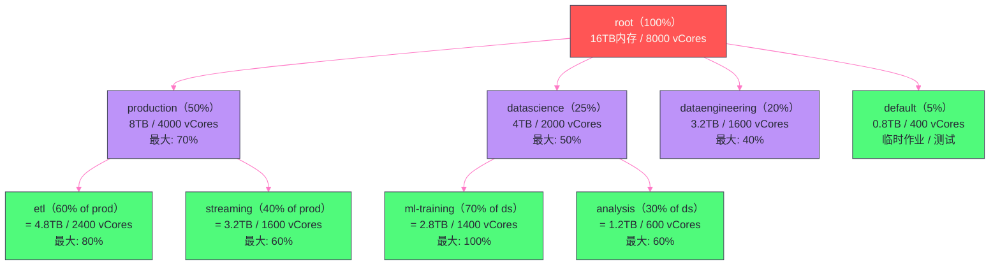
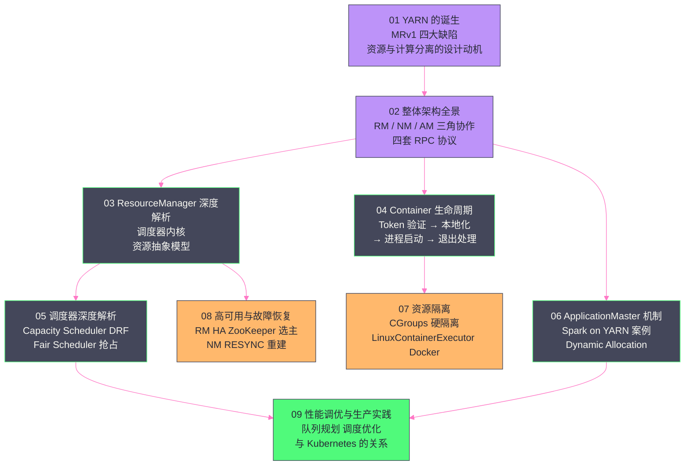

# YARN 性能调优与生产实践——队列规划、调度优化与 Kubernetes 展望

## 摘要

本文是 YARN 专栏的最终章，从工程师的实战视角系统梳理 YARN 生产集群的核心调优方向。文章分为四个部分：**集群资源规划**（NM 节点资源如何配置才能最大化利用率）、**队列容量规划**（如何设计一个既满足团队 SLA 又保证资源弹性的队列树）、**调度性能优化**（延迟调度、数据本地性、心跳调优等关键参数）、以及 **YARN 的未来与 Kubernetes 的关系**（YARN 在云原生时代的定位与演进方向）。这些内容来自大量生产集群的实际经验，是前八篇理论内容在工程实践中的落地指南。

---

## 第 1 章 集群资源规划：NM 节点配置的工程基线

### 1.1 NM 节点资源的三个关键配置

NodeManager 向 RM 上报的节点总资源量由以下三个配置决定：

```xml
<!-- yarn-site.xml：NM 节点资源配置 -->

<!-- 1. 内存：分配给 YARN Container 的总内存（MB）-->
<!-- 注意：这里不是机器的物理内存总量！需要预留操作系统、NM 进程、DataNode 进程的内存 -->
<property>
  <name>yarn.nodemanager.resource.memory-mb</name>
  <value>49152</value>  <!-- 48GB，假设机器物理内存 64GB -->
</property>

<!-- 2. CPU：分配给 YARN Container 的虚拟核数 -->
<!-- 通常设置为物理核数，对于超线程可以设置为物理核数 × 1.5 或 × 2 -->
<property>
  <name>yarn.nodemanager.resource.cpu-vcores</name>
  <value>16</value>  <!-- 假设机器有 16 个物理核（含超线程 = 32 逻辑核，但 YARN 通常不超配） -->
</property>

<!-- 3. 磁盘：YARN Container 本地化资源的存储目录（多块磁盘用逗号分隔）-->
<property>
  <name>yarn.nodemanager.local-dirs</name>
  <value>/data1/yarn/local,/data2/yarn/local,/data3/yarn/local</value>
</property>
<property>
  <name>yarn.nodemanager.log-dirs</name>
  <value>/data1/yarn/logs,/data2/yarn/logs</value>
</property>
```

**内存配置的扣除原则**：

在一台 64GB 物理内存的机器上，为 YARN 分配内存时，需要预留：
- 操作系统内核和系统进程：约 2~4GB
- NodeManager JVM 进程本身：约 1~2GB（`-Xmx2048m` 通常足够）
- DataNode 进程（如果是 HDFS 数据节点）：约 2~4GB（DataNode 大量使用 Page Cache，实际消耗取决于读写量）
- 其他系统级进程（monitoring agent、logging agent 等）：约 1~2GB

综合预留 8~10GB，剩余 54~56GB 分配给 YARN，取整为 `yarn.nodemanager.resource.memory-mb = 53248`（52GB）或 `49152`（48GB，更保守）。

**CPU 超配的注意事项**：

部分生产环境会对 CPU vCores 进行超配（如 32 个逻辑核但配置 `cpu-vcores = 48`），理由是批处理作业的 CPU 利用率通常不会同时达到 100%。超配可以提高集群的任务并发数。但过度超配（超过 2 倍）会在突发 CPU 密集场景（如全集群运行排序作业）下导致严重的 CPU 争用和作业延迟。**建议 CPU 超配比不超过 1.5 倍，且仅在纯批处理集群上使用**。

### 1.2 Container 资源配置的标准化

生产集群建议将 Container 的资源规格标准化为几种固定"T恤尺码"（T-shirt Sizes），而不是允许应用任意申请：

| 规格 | 内存 | vCores | 适用场景 |
|---|---|---|---|
| XS | 1 GB | 1 | Spark Driver（简单作业）、MR AM |
| S | 2 GB | 1 | MR Map Task、小数据量 Spark Executor |
| M | 4 GB | 2 | 标准 Spark Executor、MR Reduce Task |
| L | 8 GB | 4 | 内存密集型 Spark Executor（宽连接、大 Shuffle）|
| XL | 16 GB | 8 | 超大数据量单分区处理、ML 模型训练 Executor |
| XXL | 32 GB | 16 | 特殊场景（如 Hive 大查询单节点排序）|

标准化的好处：
1. **减少碎片**：固定规格与 NM 节点的资源量整除，不产生内存碎片
2. **降低配置门槛**：用户选规格而不是手动计算 `--executor-memory` 和 overhead
3. **便于容量规划**：知道每个规格占多少节点资源，可以精确计算队列容量能跑多少个并发作业

> [!warning] 生产避坑：最小分配单位配置不当导致的内存碎片
> 如果 `yarn.scheduler.minimum-allocation-mb = 1024`（1GB），而大多数作业使用 `--executor-memory 3g`，Container 实际申请 3GB + overhead ≈ 3.5GB，向上规整到 4GB（最小分配的整数倍）。这意味着每个 Executor 实际获得 4GB 而不是 3.5GB，资源浪费了 0.5GB/Executor。当集群有 1000 个并发 Executor 时，浪费了 500GB 内存。
>
> **解决方案**：将 `minimum-allocation-mb` 设为 512MB，同时要求作业申请量为 512MB 的整数倍（通过文档规范或脚本检查），消除碎片。

---

## 第 2 章 队列容量规划：从业务需求到配置参数

### 2.1 队列规划的三个原则

**原则一：按团队/业务线划分，不按作业类型划分**

队列是资源配额的边界，应该按照"谁需要保证多少资源"来划分，而不是按照"这个作业是 Spark 还是 MapReduce"来划分。原因：不同团队有独立的资源预算和 SLA 要求，同一团队的 Spark 作业和 MapReduce 作业共用同一个配额，内部调度由团队自主控制。

**原则二：叶队列数量不超过 20 个**

Capacity Scheduler 在每次 NM 心跳时遍历整个队列树来执行调度决策。队列数量越多，遍历耗时越长，RM 的调度吞吐量越低。在一个 1000 节点的集群上，RM 每秒处理约 1000 次 NM 心跳，每次心跳遍历 20 个叶队列的代价是可接受的；如果叶队列超过 50 个，调度延迟会明显增加。

**原则三：队列容量总和必须等于 100%，但可以用弹性空间**

同一父队列下所有子队列的 `capacity` 之和必须等于 100%。但 `maximum-capacity` 可以设置为高于 `capacity`，允许队列在其他队列空闲时借用更多资源。通常建议 `maximum-capacity` 设置为 `capacity` 的 1.5~2 倍。

### 2.2 一个完整的队列规划案例

**业务场景**：

某公司有三个大数据团队共享一个 YARN 集群（500 节点，共 16TB 内存，8000 vCores）：
- **生产团队（Production）**：运行关键的 ETL 和实时数据处理，SLA 要求高，需要保证资源
- **数据科学团队（DataScience）**：运行机器学习训练和探索性分析，峰谷差异大
- **数据工程团队（DataEngineering）**：运行数据仓库 Hive 查询和 Spark SQL，日间高峰，夜间低谷

**队列设计**：



**关键配置片段**：

```xml
<!-- capacity-scheduler.xml 核心配置 -->
<property>
  <name>yarn.scheduler.capacity.root.queues</name>
  <value>production,datascience,dataengineering,default</value>
</property>

<!-- Production 队列：50% 基础容量，最大可借用到 70% -->
<property>
  <name>yarn.scheduler.capacity.root.production.capacity</name>
  <value>50</value>
</property>
<property>
  <name>yarn.scheduler.capacity.root.production.maximum-capacity</name>
  <value>70</value>
</property>
<!-- 单个用户最多占 production 队列的 30%（防止单用户垄断） -->
<property>
  <name>yarn.scheduler.capacity.root.production.user-limit-factor</name>
  <value>0.3</value>
</property>

<!-- DataScience 队列：峰值可以借用到 50%（ML 训练有时需要大量资源）-->
<property>
  <name>yarn.scheduler.capacity.root.datascience.capacity</name>
  <value>25</value>
</property>
<property>
  <name>yarn.scheduler.capacity.root.datascience.maximum-capacity</name>
  <value>50</value>
</property>

<!-- ML Training 子队列：可以使用整个 datascience 队列（no cap within parent）-->
<property>
  <name>yarn.scheduler.capacity.root.datascience.ml-training.capacity</name>
  <value>70</value>
</property>
<property>
  <name>yarn.scheduler.capacity.root.datascience.ml-training.maximum-capacity</name>
  <value>100</value>
</property>
<!-- ML 训练 Container 不可被抢占（避免长时间训练中途被打断）-->
<property>
  <name>yarn.scheduler.capacity.root.datascience.ml-training.disable_preemption</name>
  <value>true</value>
</property>

<!-- 最大并发应用数限制（防止某个队列提交大量小作业撑爆 RM）-->
<property>
  <name>yarn.scheduler.capacity.root.production.maximum-applications</name>
  <value>500</value>
</property>
<property>
  <name>yarn.scheduler.capacity.root.datascience.maximum-applications</name>
  <value>100</value>
</property>
```

### 2.3 动态队列配置：无需重启 RM 更新配置

YARN Capacity Scheduler 支持热更新队列配置（Hadoop 3.x），不需要重启 RM：

```bash
# 修改 capacity-scheduler.xml 后，执行热刷新
yarn rmadmin -refreshQueues

# 验证配置是否生效
yarn queue -status root.datascience.ml-training

# 也可以通过 REST API 动态修改队列配置（Hadoop 3.1+）
curl -X PUT -H "Content-Type: application/json" \
  -d '{"sched-conf": {"update-queue": [{"queue-name": "root.datascience", "params": {"capacity": "30"}}]}}' \
  http://rm-host:8088/ws/v1/cluster/scheduler-conf
```

> [!warning] 生产避坑：热更新队列配置的风险
> 热更新队列配置是危险操作，直接影响所有正在运行的作业的资源分配。常见误操作：
> 1. 将某个队列的 `capacity` 从 30% 减少到 10%，导致该队列正在运行的作业立即触发抢占，大量 Container 被杀死
> 2. 添加新的叶队列忘记调整兄弟队列的 `capacity`，导致同级队列 `capacity` 之和超过 100%，RM 拒绝配置更新
>
> **建议**：在变更前先通过 `yarn queue -status <queueName>` 查看当前队列的实际使用情况，计算好变更后的影响，再在低峰期（夜间或周末）执行配置变更。

---

## 第 3 章 调度性能优化：关键参数与调优实践

### 3.1 延迟调度的参数调优

延迟调度（Delayed Scheduling）是 YARN 提升数据本地性的核心机制（详见第三篇）。两个关键参数：

```xml
<!-- 等待 NODE_LOCAL 分配的心跳次数，超过后降级到 RACK_LOCAL -->
<property>
  <name>yarn.scheduler.capacity.node-locality-delay</name>
  <value>40</value>  <!-- 默认 40，即等待 40 次 NM 心跳（约 40 秒）-->
</property>

<!-- 等待 RACK_LOCAL 分配的心跳次数，超过后降级到 ANY -->
<property>
  <name>yarn.scheduler.capacity.rack-locality-additional-delay</name>
  <value>-1</value>  <!-- -1 表示使用 node-locality-delay 的值作为 rack 等待时间 -->
</property>
```

**调优方向**：

| 场景 | 推荐设置 | 原因 |
|---|---|---|
| MapReduce 批处理（Task 时间 > 60s）| 默认（40）| 等待 40 秒换来的本地性收益超过延迟代价 |
| Spark 批处理（Task 时间 10~60s）| 10~20 | Task 较短，长时间等待本地性得不偿失 |
| Spark 流处理（Task 时间 < 10s）| 0~5 | 极短的 Task 对本地性要求低，优先快速启动 |
| 机器学习训练（不读 HDFS）| 0 | 没有 HDFS 数据，本地性无意义，立即分配 |

### 3.2 NM 心跳间隔调优

NM 的心跳间隔（`yarn.nodemanager.heartbeat.interval-ms`，默认 1000ms）是 YARN 调度延迟的基础下限：

```
Container 从申请到分配的最大延迟 = NM 心跳间隔 + AM 心跳间隔
（约 1 秒 + 1 秒 = 2 秒）
```

**降低心跳间隔的代价**：

RM 每秒处理的 NM 心跳数 = 节点数 / 心跳间隔（秒）。在 1000 节点集群、心跳间隔 1 秒的默认配置下，RM 每秒处理约 1000 次 NM 心跳。如果将心跳间隔降低到 500ms，RM 的心跳处理负载翻倍（2000 次/秒），RM 的 CPU 和 ZooKeeper 写入压力也随之增加。

**推荐策略**：

- 1000 节点以下集群：可以将心跳间隔降低到 500ms，减少调度延迟
- 1000~3000 节点集群：保持默认 1000ms，降低 RM 压力
- 3000 节点以上集群：考虑将心跳间隔增加到 2000ms，RM 负载是瓶颈

### 3.3 RM 的 RPC 线程数调优

RM 处理 NM 心跳的 RPC 服务（`ResourceTrackerService`）有独立的线程池，处理 AM 心跳的（`ApplicationMasterService`）也有独立线程池：

```xml
<!-- yarn-site.xml：RM RPC 线程调优 -->

<!-- ResourceTrackerService 线程数（处理 NM 心跳）-->
<property>
  <name>yarn.resourcemanager.resource-tracker.client.thread-count</name>
  <value>64</value>  <!-- 默认 50，大集群建议 64~128 -->
</property>

<!-- ApplicationMasterService 线程数（处理 AM 心跳）-->
<property>
  <name>yarn.resourcemanager.client.thread-count</name>
  <value>50</value>  <!-- 默认 50，高并发 AM 场景建议增加 -->
</property>

<!-- 调度器线程数（Capacity Scheduler 的 assignContainers 线程数）-->
<!-- Hadoop 3.x 支持多线程调度以提升吞吐量 -->
<property>
  <name>yarn.scheduler.capacity.schedule-asynchronously.enable</name>
  <value>true</value>
</property>
<property>
  <name>yarn.scheduler.capacity.schedule-asynchronously.scheduling-interval-ms</name>
  <value>10</value>  <!-- 异步调度线程的执行间隔（ms）-->
</property>
```

**异步调度（Async Scheduling）** 是 Hadoop 3.x Capacity Scheduler 的重要性能优化：将调度决策从 NM 心跳处理线程中分离出来，由专用的调度线程异步执行，使得调度和心跳处理可以并发进行，提升 RM 的整体吞吐量。

### 3.4 节点黑白名单管理

当某个节点出现频繁 Container 失败（如磁盘 I/O 错误、网络丢包）时，可以手动将其加入黑名单，让调度器避免向该节点分配新 Container：

```bash
# 临时黑名单（不重启 RM）
yarn rmadmin -addToClusterNodeBlacklist "node1.example.com"

# 从黑名单移除（节点修复后）
yarn rmadmin -removeFromClusterNodeBlacklist "node1.example.com"

# 查看当前黑名单
yarn rmadmin -printTopology | grep BLACKLISTED
```

YARN 也支持**应用级别的自动黑名单**：当某个 NM 节点上的 Container 失败率超过阈值（`yarn.resourcemanager.am.blacklisting.enabled = true`），YARN 会自动将该节点加入该应用的黑名单，避免重试的 Task 再次调度到问题节点上。

---

## 第 4 章 YARN 关键监控指标与告警配置

### 4.1 RM 层面的核心监控指标

通过 YARN RM 的 JMX 接口（`http://rm-host:8088/jmx`）或 REST API（`http://rm-host:8088/ws/v1/cluster/metrics`）可以获取关键指标：

**资源利用率指标**：
```
# 集群内存利用率
allocatedMB / totalMB × 100%
# 建议告警阈值：> 85% 时触发容量预警

# 集群 CPU 利用率
allocatedVirtualCores / totalVirtualCores × 100%

# 等待中的 Container 数（表示资源紧张程度）
pendingContainers > 0 持续 10 分钟 → 告警
```

**应用状态指标**：
```
# 正在运行的应用数（防止应用数激增导致 RM 过载）
appsRunning > 500 → 告警

# FAILED 应用数（反映集群稳定性）
appsFailed / (appsRunning + appsCompleted) 比率 > 5% → 告警

# PENDING（等待调度）应用数
appsPending > 50 持续 5 分钟 → 告警（队列容量不足）
```

**NM 健康状态指标**：
```
# 不健康的 NodeManager 数量
unhealthyNodes > 0 → 立即告警
# 不活跃（下线）的 NM 数量
lostNodes > 节点总数 × 5% → 告警（集群稳定性问题）
```

### 4.2 队列级别的监控

```bash
# REST API 获取队列详情（包含 usedCapacity, absoluteUsedCapacity, numApplications 等）
curl http://rm-host:8088/ws/v1/cluster/scheduler | python3 -m json.tool

# 关键告警：队列饱和率
# usedCapacity / maximumCapacity > 90% 且 pendingContainers > 0 → 队列资源不足

# 关键告警：AM 资源占比
# amUsedCapacity / capacity > 80% → AM 容器占用过多，Task Container 无法调度
# 解决：调低 yarn.scheduler.capacity.maximum-am-resource-percent
```

### 4.3 NM 层面的监控

```bash
# 通过 NM JMX 获取单节点指标
curl http://nm-host:8042/jmx

# 关键指标：
# ContainersRunning：当前运行的 Container 数
# AvailableGB：可用内存（MB/1024）
# ContainersFailed：Container 失败数（持续增长 → 节点问题）
# ContainersCompleted：Container 完成数
```

---

## 第 5 章 典型生产问题的排查手册

### 5.1 问题一：作业提交后长时间停在 ACCEPTED 状态

**现象**：`yarn application -status <appId>` 显示状态为 `ACCEPTED`，作业没有进展。

**排查路径**：

```bash
# Step 1：查看应用的诊断信息
yarn application -status application_xxx
# 重点查看 diagnostics 字段

# Step 2：检查队列容量
yarn queue -status root.production.etl
# 检查 numPendingApplications 和 usedCapacity

# Step 3：检查 RM 日志中的调度拒绝信息
grep "application_xxx" /var/log/hadoop-yarn/yarn-yarn-resourcemanager-*.log | grep -i "reject\|cannot"

# 常见原因及解决：
# 1. AM Container 资源超过队列或节点上限
#    → 减少 --driver-memory 或联系管理员调整队列 maximum-capacity
# 2. 所有 NM 都 UNHEALTHY
#    → yarn node -list -states UNHEALTHY 查看问题节点
# 3. 队列 maximum-applications 达到上限
#    → 等待其他作业完成，或请管理员增加 maximum-applications
```

### 5.2 问题二：Executor Container 频繁被 OOM 杀死

**现象**：Spark 作业中 Executor 频繁消失，日志显示 `Container killed by YARN for exceeding memory limits` 或 `Exit Code 137`（SIGKILL）。

**排查路径**：

```bash
# Step 1：查看 Container 的退出诊断
yarn logs -applicationId application_xxx | grep -A 5 "killed\|memory\|Exit code"

# Step 2：检查 NM 的内存监控日志
grep "container_xxx" /var/log/hadoop-yarn/yarn-yarn-nodemanager-*.log | grep "memory"

# 常见原因及解决：
# 1. Spark Executor 内存使用超过 YARN Container 分配量
#    → 增加 --executor-memory，同时增加 spark.yarn.executor.memoryOverhead
#    → 检查是否有数据倾斜导致单 Task 内存激增

# 2. Python 工作进程（pyspark）内存超限
#    → 增加 spark.python.worker.memory（默认 512m）
#    → 增加 spark.yarn.executor.memoryOverhead

# 3. CGroups 虚拟内存限制
#    → 关闭 vmem-check：yarn.nodemanager.vmem-check-enabled = false
```

### 5.3 问题三：YARN 队列资源明明有空闲但作业不被调度

**现象**：`yarn queue -status` 显示队列有大量空闲资源，但 `pendingContainers > 0`，作业等待在队列中。

**排查路径**：

```bash
# Step 1：检查是否受 AM 资源百分比限制
# yarn.scheduler.capacity.maximum-am-resource-percent 默认 0.1（10%）
# 如果 AM Container 已经占用了队列 10% 的资源，新 AM Container 无法调度
yarn queue -status root.xxx | grep amResourceUsed

# Step 2：检查是否受用户资源上限限制
# user-limit-factor 配置可能限制了单个用户的资源使用
yarn application -list -appStates RUNNING | grep <username> | wc -l

# Step 3：检查节点标签配置
# 如果作业指定了节点标签，但该标签的节点全部资源已耗尽
yarn node -list -states RUNNING | grep <node-label>

# Step 4：检查本地性等待是否阻塞了调度
# 如果所有 pending Task 都在等待特定节点的本地性，
# 而这些节点资源全满，作业会卡住等待延迟调度降级
# 解决：降低 node-locality-delay 或检查是否有节点宕机
```

### 5.4 问题四：RM 主备切换后大量作业失败

**现象**：RM 发生主备切换后，大量 Spark 作业抛出 `ApplicationAttemptNotFoundException` 或 `Connection refused` 异常。

**排查路径**：

```bash
# Step 1：确认切换是否正常完成
# 新 Active RM 应在切换后 60-90 秒内完全恢复
yarn rmadmin -getServiceState rm1
yarn rmadmin -getServiceState rm2

# Step 2：检查 ZooKeeper 状态存储是否完整
# 如果 ZK 中的状态不完整，部分应用可能无法恢复
zkCli.sh -server zk1:2181 ls /yarn-applications/<cluster-id>/RM_APP

# Step 3：确认 RM 恢复配置是否正确
# 必须同时配置：
# yarn.resourcemanager.recovery.enabled = true
# yarn.resourcemanager.store.class = ZKRMStateStore

# Step 4：检查 AM 重试配置
# 增加 AM 的 ZooKeeper 连接重试等待时间
# spark.yarn.am.waitTime（默认 100s）需要大于 RM 的恢复时间
```

---

## 第 6 章 YARN 的未来：与 Kubernetes 的关系与演进方向

### 6.1 Kubernetes 的崛起与 YARN 的挑战

YARN 是为"大数据批处理"时代设计的资源管理器，它的设计假设是：
- 集群节点是同构的物理机
- 工作负载主要是批处理（MapReduce、Spark 批作业）
- 框架多样但都基于 JVM

进入云原生时代，这些假设正在被打破：
- 容器化（Docker/OCI）成为应用交付的标准形式
- Kubernetes 成为容器编排的事实标准，已经能够调度 CPU、内存、GPU 等资源
- AI/ML 工作负载（TensorFlow、PyTorch）对调度的要求与批处理 MapReduce 有本质差异（需要 Gang Scheduling——一组 Worker 同时启动，而不是逐个启动）
- 弹性云（AWS EMR、GCP Dataproc、Azure HDInsight）提供了更灵活的资源模型

Kubernetes 在这个新时代天然地具备 YARN 的替代潜力：它的 Pod 调度机制比 YARN Container 更通用，生态更活跃，社区投入更大。

### 6.2 YARN 与 Kubernetes 的核心差异

| 维度 | YARN | Kubernetes |
|---|---|---|
| **设计时代** | 2012（Hadoop 2.0）| 2014（Google Borg 开源）|
| **调度单元** | Container（CPU + 内存的软隔离）| Pod（CPU + 内存 + 更多资源的硬隔离）|
| **隔离机制** | CGroups（内存/CPU），可选 Docker | Linux Namespace + CGroups（完整隔离）|
| **Gang Scheduling** | 不原生支持（Spark 靠 Dynamic Allocation 模拟）| 通过 Volcano/Scheduler Framework 插件支持 |
| **多租户隔离** | 队列 + 用户限制 | Namespace + ResourceQuota + LimitRange |
| **GPU 资源** | Hadoop 3.x 支持（配置复杂）| 原生支持（NVIDIA Device Plugin）|
| **弹性扩缩容** | Dynamic Allocation（应用层实现）| HPA/KEDA（平台层实现）|
| **生态** | Hadoop 生态（MR、Spark、Hive、Flink）| 云原生生态（Spark on K8s、Flink on K8s、Kubeflow）|
| **成熟度（大数据场景）**| 非常成熟（10+ 年生产验证）| 快速成熟（Spark 3.x K8s 模式日趋完善）|

### 6.3 Spark on Kubernetes vs. Spark on YARN

Spark 3.x 已经对 Kubernetes 提供了稳定的原生支持（`--master k8s://...`），但在生产大规模集群上，Spark on YARN 和 Spark on Kubernetes 各有优劣：

**Spark on YARN 的优势**：
- 成熟稳定，大量生产经验积累，问题排查工具和方法论完善
- 与 HDFS 的数据本地性集成更好（YARN 调度器理解 HDFS 拓扑）
- 队列管理和多租户资源隔离更成熟
- External Shuffle Service 生产经验成熟

**Spark on Kubernetes 的优势**：
- 不依赖 YARN/Hadoop 生态，可以在纯 Kubernetes 环境中运行
- 容器镜像提供了更好的环境隔离和依赖管理（不同作业可以使用不同版本的 Python/库）
- 与云平台（AWS EKS、GCP GKE、Azure AKS）集成更好，弹性伸缩能力更强
- 支持 GPU 资源调度更成熟（NVIDIA K8s Device Plugin）

**实际建议**：
- **已有大规模 Hadoop 集群的企业**：继续使用 YARN，不需要为了"云原生"而迁移，YARN 在批处理场景仍然是最成熟的选择
- **新建基础设施或上云的场景**：优先考虑 Kubernetes，特别是 AI/ML 工作负载占比高的场景
- **混合场景**：考虑"双栈"——HDFS + YARN 处理传统批处理，Kubernetes 处理 AI/ML 和新应用

### 6.4 YARN 社区的未来方向

尽管 Kubernetes 在云原生场景形成竞争，YARN 社区仍然在持续演进：

**Federation 2.0（YARN Federation）**：将 YARN 扩展到多集群联邦调度，允许单个作业跨多个 YARN 集群调度 Container，突破单集群节点数量的上限（目前单 YARN 集群支持约 10000 节点）。

**Placement Constraints**：Hadoop 3.x 引入了更丰富的调度约束（类似 Kubernetes 的 `nodeSelector` 和 `affinity`），允许应用指定 Container 的拓扑约束（如"至少 2 个 Container 在不同机架"、"Container 必须在有 SSD 的节点上"）。

**YARN + Submarine（AI/ML 支持）**：Apache Submarine 是 Hadoop 生态中的机器学习平台，提供了 Gang Scheduling（协同启动一组 Container）、GPU 资源管理、MLflow 集成等 AI/ML 需要的特性，使 YARN 在 AI 工作负载上的竞争力增强。

**与 Kubernetes 的互操作（YARN on K8s）**：Apache 社区在探索将 YARN RM 作为 Kubernetes 的一个调度器插件（Scheduler Framework），使 YARN 的调度逻辑（Capacity Scheduler、Fair Scheduler）能在 Kubernetes 上运行，融合两个生态的优点。

> [!note] 设计哲学：YARN 的历史地位不会消失
> YARN 在 Hadoop 生态中的地位就像 Linux 内核在操作系统领域的地位——它可能不是最新的，但它是最经过实战验证的，拥有最完善的生产经验积累和最成熟的运维工具链。
>
> 即使 Kubernetes 在新建项目中逐渐取代 YARN，全球仍有数以千计的大型企业数据中心在运行 YARN，处理 PB 级别的日常数据处理。YARN 的架构思想——资源管理与应用调度分离、多框架共享集群资源——已经深刻影响了 Kubernetes 的调度器设计。理解 YARN，就是理解分布式资源管理的工程精髓。

---

## 第 7 章 全专栏回顾：YARN 知识体系的完整地图

走完九篇文章，我们构建了一张完整的 YARN 知识地图：



每一篇文章都聚焦于 YARN 的一个具体技术节点，从"为什么需要这个机制"出发，到"它的工程实现细节"，再到"生产环境中如何用好它"，构成了一个完整的从入门到实战的知识体系。

**YARN 的核心设计哲学，可以用三句话总结**：

1. **关注点分离（Separation of Concerns）**：资源管理（RM）、节点管理（NM）、应用调度（AM）各司其职，职责边界清晰，共同构成一个可以处理超大规模、支持多计算框架的分布式资源管理系统
2. **心跳驱动的最终一致性**：NM 心跳触发调度、AM 心跳传递分配结果、RESYNC 心跳重建状态——YARN 用心跳这个简单机制驱动了整个系统的状态协调
3. **层次化的资源保障**：从队列的容量保障，到 CGroups 的硬件隔离，再到 RM HA 的高可用保障，YARN 构建了一个多层次的可靠性防御体系

---

> [!note] 思考题
> 1. YARN 队列规划需要在资源保障（每个队列有最低容量保证）和资源利用率（允许弹性共享）之间取得平衡。在实际的多团队共享集群中，队列容量的设置往往基于历史用量，但业务的资源需求会随时间变化（如季报期间 BI 团队需要更多资源，平时则很少使用）。如何设计一套动态调整队列容量的机制，在不重启 RM 的前提下响应业务需求变化？YARN 的在线配置刷新（`yarn rmadmin -refreshQueues`）能做到什么程度的动态调整？
> 2. 容量调度器的抢占（Preemption）机制在资源紧张时会强制终止低优先级队列中正在运行的 Container，将资源归还给高优先级队列。但强制终止 Container 会打断正在运行的 Task，导致 Task 需要重新执行（浪费了之前的计算）。对于运行了数小时的大型 MapReduce 或 Spark 作业，被抢占后需要重算的代价是巨大的。如何设计抢占策略，使得抢占产生的重算代价最小？
> 3. 随着 Kubernetes 成为容器编排的事实标准，大型互联网公司（如 Alibaba、LinkedIn）已经开始将 Spark、Flink 迁移到 K8s，逐渐淡出 YARN。但对于已经深度依赖 YARN 的传统大数据团队（有 Hadoop 生态的历史积累），从 YARN 迁移到 K8s 的主要技术挑战是什么？（如 Kerberos 认证集成、HDFS 数据本地性、监控体系迁移）在 K8s 完全替代 YARN 之前，两者共存的混合架构应该如何设计？

## 参考资料

- Apache Hadoop 官方文档：[YARN Architecture](https://hadoop.apache.org/docs/current/hadoop-yarn/hadoop-yarn-site/YARN.html)
- Apache Hadoop 官方文档：[Capacity Scheduler](https://hadoop.apache.org/docs/current/hadoop-yarn/hadoop-yarn-site/CapacityScheduler.html)
- Apache Spark 官方文档：[Running on Kubernetes](https://spark.apache.org/docs/latest/running-on-kubernetes.html)
- Apache Submarine 官方文档：[https://submarine.apache.org](https://submarine.apache.org)
- Vavilapalli et al. (2013). *Apache Hadoop YARN: Yet Another Resource Negotiator*. SOCC 2013.
- Burns, B. et al. (2016). *Borg, Omega, and Kubernetes*. ACM Queue, 14(1).
- 美团技术博客：[YARN 在美团的实践与优化](https://tech.meituan.com/2019/08/01/hadoop-yarn-application-practice.html)
