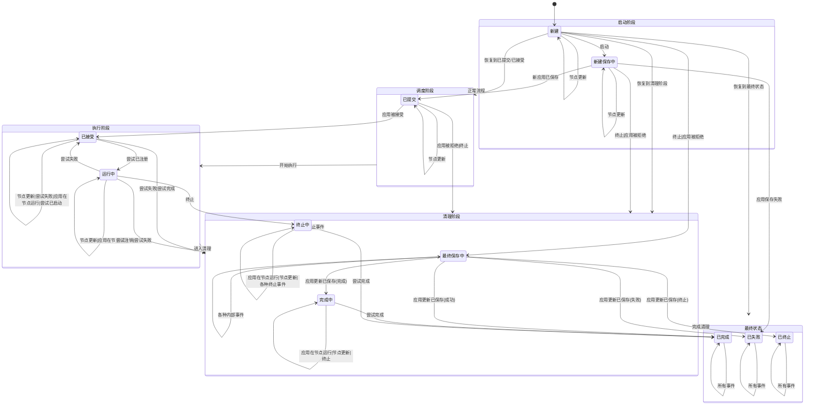

# YARN资源管理器应用事件分析表

## 客户端服务事件 (ClientRMService)

| 事件名称                 | 事件含义    | 事件来源                      | 引起的状态转换                      | 转换说明                                         |
| -------------------- | ------- | ------------------------- | ---------------------------- | -------------------------------------------- |
| START                | 启动应用    | ClientRMService           | 新建 → 新建保存中                   | 用户通过客户端提交应用时触发，开始应用的生命周期，需要先保存应用信息到状态存储      |
| RECOVER              | 恢复应用    | ClientRMService           | 新建 → 各种历史状态                  | RM重启后从状态存储中恢复应用，根据之前保存的状态信息直接跳转到对应状态         |
| KILL                 | 终止应用    | ClientRMService           | 多种状态 → 已终止/终止中/最终保存中         | 用户主动终止应用，根据当前状态决定是直接终止还是进入终止流程               |
| APP_REJECTED         | 应用被拒绝   | Scheduler/RMAppManager    | 新建/新建保存中/已提交 → 最终保存中         | 调度器拒绝应用请求，通常因为资源不足、队列限制或权限问题                 |
| APP_ACCEPTED         | 应用被接受   | Scheduler                 | 已提交 → 已接受                    | 调度器接受应用请求，为应用分配队列和初始资源，准备启动ApplicationMaster |
| ATTEMPT_REGISTERED   | 尝试注册成功  | RMAppAttempt              | 已接受 → 运行中                    | ApplicationMaster成功启动并向RM注册，开始正式运行应用         |
| ATTEMPT_UNREGISTERED | 尝试注销    | RMAppAttempt              | 运行中 → 最终保存中                  | ApplicationMaster主动注销或异常断开，准备结束应用            |
| ATTEMPT_FINISHED     | 尝试完成    | RMAppAttempt              | 已接受/终止中 → 最终保存中 完成中 → 已完成 | ApplicationMaster正常完成任务，应用成功结束               |
| ATTEMPT_FAILED       | 尝试失败    | RMAppAttempt              | 已接受/运行中 → 最终保存中 运行中 → 已接受 | ApplicationMaster失败，可能触发重试或直接失败              |
| ATTEMPT_KILLED       | 尝试被终止   | RMAppAttempt              | 终止中 → 最终保存中                  | ApplicationMaster被强制终止，通常响应KILL事件            |
| ATTEMPT_LAUNCHED     | 尝试已启动   | RMAppAttempt              | 已接受 → 已接受                    | ApplicationMaster容器已分配并启动，但尚未注册，保持在接受状态      |
| NODE_UPDATE          | 节点更新    | ResourceTracker           | 所有状态 → 保持当前状态                | 集群节点状态变化，触发资源重新计算，但不改变应用状态                   |
| APP_RUNNING_ON_NODE  | 应用在节点运行 | Container/ResourceTracker | 所有状态 → 保持当前状态                | 应用的容器在某个节点上运行，更新应用的资源使用信息                    |
| APP_NEW_SAVED        | 新应用已保存  | RMStateStore              | 新建保存中 → 已提交                  | 新应用信息成功保存到持久化存储，可以提交给调度器                     |
| APP_UPDATE_SAVED     | 应用更新已保存 | RMStateStore              | 最终保存中 → 已完成/已失败/已终止          | 应用最终状态成功保存到持久化存储，应用生命周期结束                    |
| APP_SAVE_FAILED      | 应用保存失败  | RMStateStore              | 新建保存中 → 已失败                  | 应用信息保存到持久化存储失败，应用启动失败                        |

| APP_REJECTED | 应用被拒绝 | Scheduler/RMAppManager | 新建/新建保存中/已提交 → 最终保存中 | 调度器拒绝应用请求，通常因为资源不足、队列限制或权限问题                 |
| ------------ | ----- | ---------------------- | -------------------- | -------------------------------------------- |
| APP_ACCEPTED | 应用被接受 | Scheduler              | 已提交 → 已接受            | 调度器接受应用请求，为应用分配队列和初始资源，准备启动ApplicationMaster |

## 应用尝试相关事件 (RMAppAttempt)

| 事件名称                 | 事件含义   | 事件来源         | 引起的状态转换                      | 转换说明                                    |
| -------------------- | ------ | ------------ | ---------------------------- | --------------------------------------- |
| ATTEMPT_REGISTERED   | 尝试注册成功 | RMAppAttempt | 已接受 → 运行中                    | ApplicationMaster成功启动并向RM注册，开始正式运行应用    |
| ATTEMPT_UNREGISTERED | 尝试注销   | RMAppAttempt | 运行中 → 最终保存中                  | ApplicationMaster主动注销或异常断开，准备结束应用       |
| ATTEMPT_FINISHED     | 尝试完成   | RMAppAttempt | 已接受/终止中 → 最终保存中 完成中 → 已完成 | ApplicationMaster正常完成任务，应用成功结束          |
| ATTEMPT_FAILED       | 尝试失败   | RMAppAttempt | 已接受/运行中 → 最终保存中 运行中 → 已接受 | ApplicationMaster失败，可能触发重试或直接失败         |
| ATTEMPT_KILLED       | 尝试被终止  | RMAppAttempt | 终止中 → 最终保存中                  | ApplicationMaster被强制终止，通常响应KILL事件       |
| ATTEMPT_LAUNCHED     | 尝试已启动  | RMAppAttempt | 已接受 → 已接受                    | ApplicationMaster容器已分配并启动，但尚未注册，保持在接受状态 |

## 资源和节点相关事件

| 事件名称                | 事件含义    | 事件来源                      | 引起的状态转换       | 转换说明                       |
| ------------------- | ------- | ------------------------- | ------------- | -------------------------- |
| NODE_UPDATE         | 节点更新    | ResourceTracker           | 所有状态 → 保持当前状态 | 集群节点状态变化，触发资源重新计算，但不改变应用状态 |
| APP_RUNNING_ON_NODE | 应用在节点运行 | Container/ResourceTracker | 所有状态 → 保持当前状态 | 应用的容器在某个节点上运行，更新应用的资源使用信息  |

## 状态存储相关事件 (RMStateStore)

| 事件名称             | 事件含义    | 事件来源         | 引起的状态转换             | 转换说明                      |
| ---------------- | ------- | ------------ | ------------------- | ------------------------- |
| APP_NEW_SAVED    | 新应用已保存  | RMStateStore | 新建保存中 → 已提交         | 新应用信息成功保存到持久化存储，可以提交给调度器  |
| APP_UPDATE_SAVED | 应用更新已保存 | RMStateStore | 最终保存中 → 已完成/已失败/已终止 | 应用最终状态成功保存到持久化存储，应用生命周期结束 |
| APP_SAVE_FAILED  | 应用保存失败  | RMStateStore | 新建保存中 → 已失败         | 应用信息保存到持久化存储失败，应用启动失败     |

## 事件驱动机制的核心原理

理解这些事件如何驱动状态转换，需要掌握几个关键概念：

**异步事件处理机制**：YARN使用异步事件驱动架构，每个事件都会被放入事件队列中按顺序处理。这确保了状态转换的原子性和一致性。

**状态存储的重要性**：注意到很多关键转换都与状态存储相关（APP_NEW_SAVED、APP_UPDATE_SAVED等）。这是因为YARN需要确保应用状态的持久性，以便在RM重启时能够恢复。

**失败恢复机制**：ATTEMPT_FAILED事件可能导致不同的转换结果，这取决于应用的重试策略。如果还有重试次数，会回到已接受状态重新启动AM；否则直接进入最终保存阶段。

**优雅关闭vs强制终止**：KILL事件的处理方式因当前状态而异。在早期状态（如新建、已提交）可以直接终止，但在运行状态需要先通知ApplicationMaster优雅关闭。

这种事件驱动的状态机设计使得YARN能够可靠地管理大量并发应用，同时处理各种异常情况和系统故障。每个事件都有明确的语义和预期的状态转换，这为系统的可靠性和可维护性奠定了坚实基础。