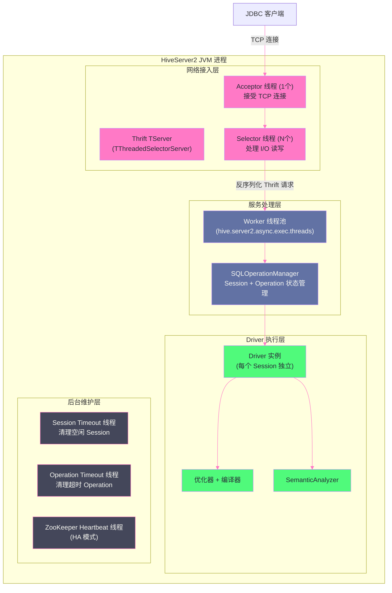
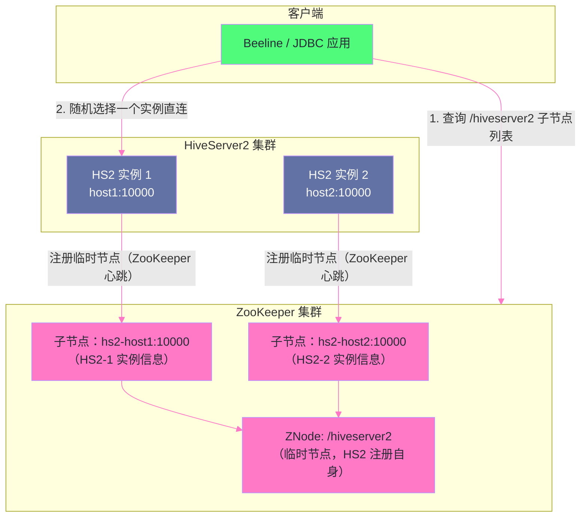

# 01 HiveServer2 架构深度解析：从 Thrift 到 Session 生命周期

## 摘要

HiveServer2（HS2）是 Hive 集群的入口门面——所有来自 Beeline、JDBC 应用、BI 工具的查询请求，都必须经过 HS2 这道关口。然而，大多数工程师对 HS2 的认知仅停留在"监听 10000 端口的 Hive 服务"，对其内部如何处理并发请求、Session 是如何被创建和销毁的、一条 SQL 从 JDBC 调用到 Driver 执行经历了怎样的状态流转——这些在生产排障中至关重要的知识，往往是空白的。当 HS2 进程 OOM、并发查询响应超时、某个 Session 长期占用连接不释放时，缺乏对内部架构的认知就只能"重启大法"，而无法真正定位根因。本文从 HS2 的进程模型出发，深入解析 Thrift 服务的 NIO 网络层架构、Session 和 Operation 的完整状态机、并发控制与队列管理机制，以及基于 ZooKeeper 的 HS2 高可用方案的内部实现细节。

---

## 第 1 章 HiveServer2 的历史背景与设计动机

### 1.1 HiveServer1 的致命缺陷

在 HS2 出现之前，Hive 提供的是 **HiveServer1（HS1）**——一个极其简单的 Thrift 服务。HS1 的致命问题在于它是**单线程服务**：在任意时刻只能处理一个客户端连接，新连接必须等待当前连接释放才能接入。

这在生产环境中意味着什么？假设 ETL 作业 A 提交了一个 2 小时的 `INSERT OVERWRITE` 任务，这 2 小时内，所有试图连接 HS1 的 Beeline 客户端、报表 BI 工具、数据质量检查脚本——全部被阻塞，无法建立连接。更糟糕的是，HS1 甚至不支持 Kerberos 认证，任何知道 Thrift 端口的客户端都可以以任意用户身份提交查询。

HS1 的核心缺陷清单：
- **单连接串行化**：无并发能力，一个长查询阻断所有后续请求
- **无认证机制**：不支持 Kerberos，安全性为零
- **无连接多路复用**：每个客户端连接对应一个独占的 Hive 实例
- **无会话概念**：无法维护跨请求的用户上下文（如临时表、SET 变量）

HS1 的这些缺陷在 Hive 0.11（2013 年）被 **HiveServer2** 彻底取代。HiveServer2 的设计目标很明确：**多用户并发、Kerberos 认证、会话隔离、JDBC/ODBC 标准兼容**。

### 1.2 HS2 在 Hive 架构中的位置

理解 HS2 的架构，首先要建立对 Hive 整体架构的清晰认知。Hive 的逻辑架构由三个独立的服务组成：

```
客户端层：Beeline / JDBC App / BI Tool / HCatalog Client
    ↓ JDBC/ODBC (Thrift Binary / HTTP)
HiveServer2（HS2）：SQL 解析、会话管理、Driver 执行
    ↓ Thrift（MetaStore API）
Hive Metastore（HMS）：元数据管理（表/分区/Schema）
    ↓ JDBC（MySQL Driver）
MySQL：元数据持久化
    ↓ HDFS Client
HDFS：数据文件存储
    ↓ YARN Client / Tez Client
YARN + Tez/MapReduce：实际计算执行
```

HS2 是整个链路的中枢：向上接收用户 SQL 请求，向左访问 HMS 获取元数据，向右提交计算任务到 YARN，向下（逻辑上）访问 HDFS 读写数据。**HS2 进程的稳定性直接决定了整个 Hive 集群的可用性**——HS2 挂掉，所有用户无法提交任何查询，即使 HMS、HDFS、YARN 都健康也无济于事。

---

## 第 2 章 HS2 的进程内部架构

### 2.1 HS2 的线程模型全景

HS2 进程内部的线程架构远比"一个服务进程"复杂得多。理解这个线程模型是理解 HS2 性能瓶颈和故障的基础。



HS2 进程内部有四个主要的线程组，它们各司其职：

**网络接入层（Thrift TServer）**：负责 TCP 连接的建立和 I/O 读写。HS2 默认使用 `TThreadedSelectorServer`，这是一个异步的 NIO 服务器（基于 Java NIO Selector），由 1 个 Acceptor 线程 + N 个 Selector 线程组成。Acceptor 线程接受新的 TCP 连接，然后轮询地将连接分发给某个 Selector 线程。Selector 线程负责监听已建立连接上的 I/O 事件（数据可读/可写），读取完整的 Thrift 请求帧后，将解码后的请求提交给 Worker 线程池。

**服务处理层（Worker 线程池）**：真正执行 Thrift API 调用的线程。线程数由 `hive.server2.async.exec.threads`（默认 100）控制。这层线程负责处理所有 Thrift 接口调用——`OpenSession`、`ExecuteStatement`、`FetchResults` 等。对于同步模式的查询，Worker 线程会阻塞直到查询完成；对于异步模式，Worker 线程快速返回后由 Driver 异步执行。

**Driver 执行层**：每个 HS2 Session 对应一个独立的 [[Hive Driver]] 实例，Driver 内部包含 Compiler（SQL 解析 + 优化）和 Executor（MR/Tez 任务提交）。Driver 是 HS2 中资源消耗最重的部分——编译一条复杂 SQL 需要大量 CPU 和内存（尤其是大型 JOIN 的优化），提交 MR/Tez 任务需要与 YARN ResourceManager 交互。

**后台维护层**：一组守护线程，负责清理过期的 Session 和 Operation，以及在 HA 模式下维护 ZooKeeper 心跳。这些线程不参与正常的请求处理，但对 HS2 的稳定运行至关重要——如果 Session 没有被正确清理，连接数会持续增长直到 JVM 内存耗尽。

### 2.2 Thrift 传输协议的选择

HS2 支持两种传输协议，对应不同的网络传输模式：

**Binary 模式（默认）**：直接使用 Thrift 二进制序列化，通过 TCP 直连 HS2。这是最低延迟、最高吞吐的模式，适合内网直连场景（ETL 作业、数据平台后端服务）。

```xml
<!-- hive-site.xml -->
<property>
  <name>hive.server2.transport.mode</name>
  <value>binary</value>  <!-- 默认值 -->
</property>
<property>
  <name>hive.server2.thrift.port</name>
  <value>10000</value>
</property>
```

**HTTP 模式**：将 Thrift 请求封装在 HTTP POST Body 中传输，HS2 作为一个 HTTP Server 暴露服务。HTTP 模式的优点是可以穿越防火墙和代理服务器（企业网络环境中 Thrift 二进制端口经常被防火墙阻断），支持负载均衡器（Nginx/F5）在 HS2 实例间做 L7 负载均衡。

```xml
<property>
  <name>hive.server2.transport.mode</name>
  <value>http</value>
</property>
<property>
  <name>hive.server2.thrift.http.port</name>
  <value>10001</value>
</property>
<property>
  <name>hive.server2.thrift.http.path</name>
  <value>cliservice</value>
</property>
```

> [!note] 设计哲学
> HTTP 模式的代价是每次 Thrift 请求都多了 HTTP 头的解析开销，以及 HTTP 协议本身的帧对齐处理。对于高频小查询（如 BI 工具每秒发送数十个查询），这个额外开销是可感知的（约 1-5ms/请求）。对于长查询（几分钟到几小时的 MR/Tez 任务），HTTP 模式的开销完全可以忽略——应该根据客户端网络环境和查询模式来选择。

### 2.3 TThreadedSelectorServer 的 NIO 模型

HS2 的网络层基于 Apache Thrift 的 `TThreadedSelectorServer`，其 NIO 模型值得深入理解，因为它直接影响 HS2 能够承受的并发连接数上限。

`TThreadedSelectorServer` 的工作流程：

```
Step 1：Acceptor 线程（1个）
  调用 ServerSocketChannel.accept()，接受新的 TCP 连接
  得到 SocketChannel（非阻塞模式）
  用轮询（Round-Robin）选择一个 Selector 线程
  将 SocketChannel 注册给该 Selector 线程（通过 SelectorThread.addAcceptedConnection()）

Step 2：Selector 线程（selectorThreads 个，默认 2）
  维护一个 NIO Selector，监听所有已分配连接的 OP_READ 事件
  当连接可读时，读取 Thrift 帧头（4字节，表示帧长度）
  读取完整的 Thrift 请求帧
  将完整帧包装为 FrameBuffer，提交给 Worker 线程池（executorService）

Step 3：Worker 线程池（executorService.threads 个）
  从 FrameBuffer 中反序列化 Thrift 请求
  调用对应的 Thrift 接口实现（IHiveServer2.Iface 的某个方法）
  序列化响应，写回 FrameBuffer
  通知 Selector 线程该连接有数据可写（OP_WRITE）
```

**关键参数**：

```xml
<!-- Selector 线程数：建议 CPU 核心数 / 4，通常 2-4 就足够 -->
<property>
  <name>hive.server2.thrift.selector.threads</name>
  <value>2</value>
</property>

<!-- Worker 线程池大小：决定 HS2 最大并发处理能力 -->
<property>
  <name>hive.server2.async.exec.threads</name>
  <value>100</value>
</property>

<!-- Worker 线程池的请求队列大小：超过队列大小时拒绝新请求 -->
<property>
  <name>hive.server2.async.exec.wait.queue.size</name>
  <value>100</value>
</property>
```

> [!warning] 生产避坑
> **Worker 线程数 ≠ 最大并发查询数**。`hive.server2.async.exec.threads=100` 意味着 HS2 最多同时处理 100 个 Thrift API 调用——这不等于 100 个并发查询。一条异步查询（`executeAsync`）的 Driver 编译和 MR/Tez 任务提交都在 Worker 线程中执行，一旦提交给 YARN，Worker 线程就释放了（等待 `FetchResults` 调用时再次占用 Worker 线程）。因此，实际能支撑的并发查询数取决于 SQL 编译时间和 YARN 提交延迟，通常比 Worker 线程数高 2-5 倍。但如果大量查询都在等待 YARN 资源（YARN 队列满），每个 Driver 持续占用 Worker 线程，就可能导致 Worker 线程耗尽。

---

## 第 3 章 Session：HS2 的会话抽象

### 3.1 Session 是什么，为什么需要它

**Session（会话）** 是 HS2 对"一个客户端连接的上下文"的抽象封装。Session 的存在解决了无状态 Thrift 服务无法维护用户上下文的问题。

没有 Session 的 Thrift 服务是纯无状态的：每次 API 调用都是独立的，服务端不记录任何客户端状态。这对于简单的 RPC 服务是合理的，但对于 SQL 执行引擎是不够的——用户期望能够：

- `SET hive.exec.parallel=true`（配置在后续查询中生效）
- `CREATE TEMPORARY TABLE tmp_data AS ...`（临时表在 Session 内可见，Session 结束后自动删除）
- `BEGIN TRANSACTION ... COMMIT`（事务跨越多条 SQL，需要维护事务状态）
- 身份上下文（以哪个用户身份运行后续查询）

Session 就是承载这些用户上下文的容器。

### 3.2 Session 的完整生命周期

```mermaid
%%{init: {"theme": "dracula", "themeVariables": {"primaryColor": "#6272a4", "primaryTextColor": "#f8f8f2", "lineColor": "#ff79c6"}}}%%
stateDiagram-v2
    [*] --> "OPEN" : "OpenSession 请求"
    "OPEN" --> "OPEN" : "ExecuteStatement / FetchResults"
    "OPEN" --> "CLOSED" : "CloseSession 请求"
    "OPEN" --> "CLOSED" : "Session 超时（idle timeout）"
    "OPEN" --> "CLOSED" : "客户端连接断开"
    "CLOSED" --> [*] : "资源释放（临时表删除 + Driver 清理）"
```

**Session 创建（OpenSession）**：

```
客户端调用 OpenSession(username, password, configuration)
  → HS2 验证身份（Kerberos / LDAP / Custom Auth）
  → 创建 HiveSession 对象（包含 SessionHandle UUID）
  → 初始化 Session 级别的配置（将客户端传入的 configuration map 作为初始 conf）
  → 创建对应的 Hive Driver 实例（每个 Session 一个独立的 Driver）
  → 在 SQLOperationManager 中注册（handleToSession Map）
  → 返回 SessionHandle（客户端后续所有请求携带此 Handle 标识 Session）
```

**Session 内的状态存储**：

`HiveSession` 对象内部维护以下关键状态：

```java
// HiveSession 内部的关键字段（简化）
class HiveSessionImpl {
    SessionHandle sessionHandle;           // Session 的唯一 UUID 标识
    String username;                       // 执行用户名
    HiveConf sessionConf;                  // Session 级别的配置（包含 SET 命令效果）
    Map<String, String> hiveVariables;     // HIVEVAR: 变量
    Map<String, String> confVariables;     // HIVECONF: 配置变量
    List<String> forwardedAddresses;       // 客户端 IP（用于审计日志）
    
    // Session 内运行的所有 Operation 的引用（用于超时清理）
    Map<OperationHandle, Operation> handleToOperation;
    
    // 临时资源（Session 关闭时自动清理）
    List<String> tempFiles;                // ADD FILE 添加的临时文件
    List<String> tempFunctions;            // 临时 UDF 函数注册
    
    // 统计信息（用于监控）
    long sessionCreatedTime;
    long lastAccessTime;                   // 最近一次活跃时间（用于 idle timeout 判断）
    AtomicLong operationCounter;           // 历史执行 Operation 总数
}
```

### 3.3 Session 隔离的实现机制

HS2 的 Session 隔离是**进程内隔离**，而不是进程级隔离。多个 Session 运行在同一个 JVM 进程中，通过 Java 对象隔离实现配置和变量的隔离：

**配置隔离**：每个 Session 持有一个 `HiveConf` 对象副本（从全局配置 deep copy），`SET` 命令只修改该 Session 的 `HiveConf` 副本，不影响其他 Session 和全局配置。

**临时表隔离**：临时表的元数据存储在 Session 自己的 `localMetaStoreClient`（一个私有的 `IMetaStoreClient` 实例）中，HMS 数据库中没有临时表的记录，Session 关闭时直接丢弃，无需从 HMS 删除。

**并发隔离的边界**：Session 的进程内隔离意味着它们**共享 JVM 堆内存**。如果 100 个并发 Session 各自执行一个内存密集型操作（如大型 JOIN 优化的内存临时数据结构），它们会竞争同一个 JVM 堆，可能导致相互影响（某个 Session 的内存分配触发全局 GC，影响所有 Session 的响应时间）。这是 HS2 进程内隔离相比进程级隔离（每个 Session 独立进程）的根本局限。

---

## 第 4 章 Operation：SQL 执行的原子单元

### 4.1 Operation 的设计思想

**Operation** 是 HS2 对"一次 SQL 执行请求"的抽象。为什么需要这一层抽象？

在 JDBC 规范中，`Statement.execute()` 是同步的——调用方在 execute() 返回之前一直阻塞等待。对于几毫秒的查询这没问题，但对于运行 2 小时的 Hive 查询，JDBC 连接不可能阻塞 2 小时（网络超时、连接池超时等都会中断）。

HS2 通过 Operation 抽象解决了这个问题：`ExecuteStatement` 创建一个 Operation 对象，**立即返回** `OperationHandle`（操作句柄），客户端用这个 Handle 来轮询查询状态（`GetOperationStatus`）和获取结果（`FetchResults`）。Operation 在后台线程中异步执行，不占用客户端连接。

这是一种典型的**异步命令模式**（Command Pattern）的应用。

### 4.2 Operation 状态机

```mermaid
%%{init: {"theme": "dracula", "themeVariables": {"primaryColor": "#6272a4", "primaryTextColor": "#f8f8f2", "lineColor": "#ff79c6"}}}%%
stateDiagram-v2
    [*] --> "INITIALIZED" : "ExecuteStatement 创建 Operation"
    "INITIALIZED" --> "PENDING" : "提交到异步执行队列"
    "PENDING" --> "RUNNING" : "Worker 线程开始编译执行"
    "RUNNING" --> "FINISHED" : "查询成功完成"
    "RUNNING" --> "ERROR" : "SQL 编译错误 / MR 任务失败"
    "RUNNING" --> "CANCELED" : "客户端调用 CancelOperation"
    "INITIALIZED" --> "CANCELED" : "客户端调用 CancelOperation（未开始）"
    "FINISHED" --> "CLOSED" : "CloseOperation / Session 关闭"
    "ERROR" --> "CLOSED" : "CloseOperation / Session 关闭"
    "CANCELED" --> "CLOSED" : "CloseOperation / Session 关闭"
    "CLOSED" --> [*] : "Operation 对象被 GC"
```

**各状态的含义**：

- **INITIALIZED**：Operation 对象已创建，尚未进入执行队列。这个状态极短暂，通常在毫秒内转换到 PENDING
- **PENDING**：Operation 已提交到执行队列，等待 Worker 线程处理。如果 Worker 线程全部忙碌，Operation 在 PENDING 状态排队（`hive.server2.async.exec.wait.queue.size` 限制队列长度）
- **RUNNING**：Worker 线程正在执行。这个状态包含 SQL 编译（可能几秒到几十秒）、MR/Tez 任务提交和监控（几分钟到几小时）
- **FINISHED**：查询成功完成，结果集已写入结果缓冲区，等待客户端 FetchResults
- **ERROR**：执行失败，错误信息保存在 Operation 对象中，客户端调用 GetOperationStatus 可以获取错误详情
- **CANCELED**：被客户端主动取消，已提交的 MR/Tez 任务会被 Kill
- **CLOSED**：Operation 资源已释放，对象等待 GC 回收

### 4.3 Operation 的结果集存储

Operation 完成后，结果集存储在哪里？HS2 提供了三种结果集存储后端：

**内存存储（默认，小结果集）**：

```xml
<property>
  <name>hive.server2.thrift.resultset.serialize.in.tasks</name>
  <value>false</value>  <!-- false = 存储在 HS2 内存中 -->
</property>
```

结果行存储在 `HiveQueryResultSet` 对象的内存中（`rowSet` 列表），客户端通过 `FetchResults` 分批获取（`fetchSize` 控制每批大小）。**风险**：大结果集（百万行以上）会在 HS2 JVM 堆中积累大量 Java 对象，直接导致 HS2 的 Full GC 乃至 OOM。

**HDFS 存储（大结果集）**：

```xml
<property>
  <name>hive.server2.thrift.resultset.serialize.in.tasks</name>
  <value>true</value>  <!-- true = 结果序列化写入 HDFS 临时目录 -->
</property>
```

结果以 Thrift 二进制格式写入 HDFS 临时文件，HS2 内存中只保存 HDFS 路径引用。客户端 FetchResults 时，HS2 从 HDFS 流式读取数据块返回给客户端。这彻底避免了大结果集的 HS2 OOM 风险，但增加了 HDFS I/O 开销。

**直接获取（fetchSize 分批内存存储）**：适合 `SELECT ... LIMIT N` 的有限结果集，结合合理的 fetchSize（建议 1000-5000 行/批）可以控制单次 FetchResults 的内存消耗。

---

## 第 5 章 并发控制与队列管理

### 5.1 HS2 的多级并发控制

HS2 内部有多个并发控制点，形成多级限速机制：

```
客户端 TCP 连接数 → hive.server2.thrift.max.connections（默认无限制）
    ↓
Thrift Worker 线程数 → hive.server2.async.exec.threads（默认 100）
    ↓
Worker 等待队列 → hive.server2.async.exec.wait.queue.size（默认 100）
    ↓
并发会话数 → hive.server2.sessions.max（如果设置）
    ↓
并发 Operation 数（每个 Session 同时运行的查询数）
    ↓
YARN 队列容量（实际计算资源的上限）
```

**最容易被忽视的瓶颈**：Worker 等待队列。当队列满时（100 个 Worker 忙 + 100 个请求在队列中等待），第 201 个 `ExecuteStatement` 请求会**立即失败**（抛出 `HiveSQLException: Cannot get a connection, pool error Timeout waiting for connection from pool`），而不是继续等待。这在 ETL 作业高峰期（如早上 9 点所有 Hive 作业同时启动）会导致大量作业失败。

### 5.2 Session 超时机制

HS2 内置了 Session 超时清理机制，由 `SessionTimeoutChecker` 后台线程定期检查：

```
配置项：
  hive.server2.session.check.interval = 3600000ms（默认1小时，检查周期）
  hive.server2.idle.session.timeout = 7200000ms（默认2小时，Session 最长空闲时间）

检查逻辑（简化）：
  遍历所有 OPEN 状态的 Session：
    如果 (currentTime - session.lastAccessTime) > idleSessionTimeout：
      如果 session 没有正在运行的 Operation：
        关闭 Session（释放资源：临时表、临时文件、Driver 实例）
      如果 session 有正在运行的 Operation：
        不关闭（运行中的查询不受 idle timeout 影响）
```

**生产中常见的问题**：BI 工具（如 Tableau、Superset）经常会建立 JDBC 连接池，连接池中的连接长期保持但不发送查询——这些连接对应的 Session 会被 idle timeout 关闭。BI 工具再次使用这个连接时，发现 Session 已失效，需要重连。表现为：BI 工具偶发性查询失败，重试后成功——这几乎总是 Session idle timeout 导致的，解决方案是缩短 BI 工具连接池的连接保活时间，使其小于 HS2 的 `idle.session.timeout`。

---

## 第 6 章 HiveServer2 高可用（HA）

### 6.1 HS2 单点的风险

单个 HS2 进程是整个 Hive 集群的单点：HS2 重启期间（哪怕只有 30 秒），所有 JDBC 客户端都无法建立新连接，正在执行的查询全部失败（连接断开）。对于高可用性要求的生产环境，必须部署 **HS2 HA（多实例高可用）**。

### 6.2 基于 ZooKeeper 的 HS2 HA 架构

HS2 HA 不是"主备切换"模式，而是**多活（Active-Active）** 模式——多个 HS2 实例同时接收请求，客户端通过 ZooKeeper 发现可用实例并负载均衡。



**HS2 注册到 ZooKeeper 的流程**：

```
HS2 启动时：
  1. 连接 ZooKeeper（hive.zookeeper.quorum 配置的地址）
  2. 在 /hiveserver2 路径下创建临时顺序节点（EPHEMERAL_SEQUENTIAL）
     节点内容：serverUri=host1:10000;version=3.1.3;sequence=0000000001
  3. 启动 ZooKeeper 会话心跳（sessionTimeout 内持续发送心跳保持节点存活）

HS2 下线时（优雅或崩溃）：
  优雅关闭：主动删除 ZooKeeper 节点 + 关闭所有 Session
  崩溃（进程 killed）：ZooKeeper 会话超时（sessionTimeout 后），临时节点自动删除
  → 客户端监听 /hiveserver2 的 Watcher 被触发，感知到节点删除
  → 客户端从剩余节点中选择新实例，重新建立 Session
```

**客户端 JDBC URL（HA 模式）**：

```
jdbc:hive2://zk1:2181,zk2:2181,zk3:2181/default;serviceDiscoveryMode=zooKeeper;zooKeeperNamespace=hiveserver2
```

> [!warning] 生产避坑
> **HS2 HA 不是会话迁移**：当 HS2-1 挂掉，连接到 HS2-1 上的客户端必须重建连接到其他 HS2 实例——HS2-1 上正在运行的查询**全部丢失**，对应的 MR/Tez 任务由于 Driver 消失而成为"孤儿任务"（仍在 YARN 上运行，消耗资源，但没有 Driver 管理，只能等待超时或手动 Kill）。HS2 HA 保证的是"新请求的可用性"，不保证"已建立 Session 的连续性"。

### 6.3 HS2 HA 的关键配置

```xml
<!-- 开启 ZooKeeper 服务发现 -->
<property>
  <name>hive.server2.support.dynamic.service.discovery</name>
  <value>true</value>
</property>
<property>
  <name>hive.zookeeper.quorum</name>
  <value>zk1:2181,zk2:2181,zk3:2181</value>
</property>
<property>
  <name>hive.server2.zookeeper.namespace</name>
  <value>hiveserver2</value>
</property>

<!-- ZooKeeper 会话超时（HS2 崩溃后多久从 ZK 消失，决定故障转移时间）-->
<property>
  <name>hive.zookeeper.session.timeout</name>
  <value>1200000</value>  <!-- 20分钟，建议适当缩短（如60秒）加快故障检测 -->
</property>
```

---

## 小结

HiveServer2 是 Hive 集群中最核心的服务组件，其内部架构的每一层都与生产稳定性密切相关：

- **Thrift NIO 层**（`TThreadedSelectorServer`）：1 个 Acceptor + N 个 Selector 线程处理网络 I/O；Worker 线程池（默认 100）是并发处理能力的上限；Worker 等待队列（默认 100）满后直接拒绝请求，高峰期必须关注这个瓶颈
- **Session 层**：每个 JDBC 连接对应一个 Session，Session 维护用户上下文（配置、临时表、变量）；进程内隔离意味着共享 JVM 堆，大量 Session 会相互竞争内存；idle timeout 清理长期空闲 Session 是防止连接泄漏的重要机制
- **Operation 层**：每条 SQL 对应一个 Operation，六个状态的转换反映了查询从提交到完成的完整生命周期；大结果集应使用 HDFS 存储模式避免 HS2 OOM
- **HA 层**：多活模式（非主备），基于 ZooKeeper 临时节点实现服务发现；HS2 故障转移保证新连接可用，但不保证已有 Session 的连续性

第 02 篇深入 Hive Metastore（HMS）——HS2 背后的元数据大脑，解析其元数据模型（Database/Table/Partition/StorageDescriptor 的 MySQL Schema 结构）、Thrift API 设计以及 HMS 高可用方案的内部实现。

---

> [!note] 思考题
> 1. HiveServer2 使用 Thrift 协议提供 SQL 服务，并通过 `hive.server2.thrift.min/max.worker.threads` 控制处理请求的线程数。如果客户端连接数超过最大线程数，新连接会被拒绝还是排队等待？在高并发的 BI 报表场景下（如数百个 Superset 并发查询），HS2 的线程模型如何应对？HiveServer2 的多实例部署（负载均衡）是标准解法，但多实例之间如何共享会话状态？
> 2. HS2 的每个 Session 对应一个用户连接，Session 在整个生命周期中维护着编译器状态（如临时表、配置覆盖）。在长连接场景下（如 JDBC 连接池复用同一个 Session），如果前一个查询修改了 Session 级别的配置（如 `set hive.exec.dynamic.partition=true`），这个配置会影响后续使用同一 Session 的查询吗？如何在连接池场景下保证 Session 配置的隔离性？
> 3. HS2 的 `hive.server2.async.exec.threads` 控制异步执行查询的线程数，查询被提交到这个线程池后立即返回，客户端通过轮询获取结果。如果一个查询执行时间很长（如数小时的 ETL 作业），JDBC 客户端需要长时间保持连接轮询。如果客户端因网络问题断开连接，服务端的查询会继续执行还是被取消？HS2 如何处理"孤儿查询"（客户端已断开但服务端仍在执行的查询）？

## 参考资料

- [HiveServer2 官方文档](https://cwiki.apache.org/confluence/display/Hive/HiveServer2+Overview)
- [Apache Thrift TThreadedSelectorServer 源码](https://github.com/apache/thrift/blob/master/lib/java/src/main/java/org/apache/thrift/server/TThreadedSelectorServer.java)
- [Hive HS2 Session 管理源码：HiveSessionManager.java](https://github.com/apache/hive/blob/master/service/src/java/org/apache/hive/service/cli/session/HiveSessionManager.java)
