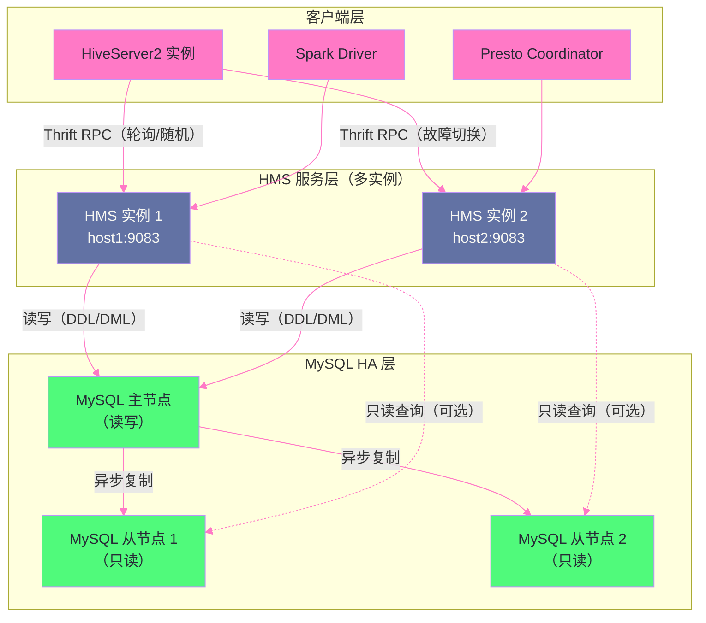

# 02 Hive Metastore 深度解析：元数据体系与 HMS 高可用

## 摘要

Hive Metastore（HMS）是整个 Hive 生态的"元数据大脑"——它不仅服务于 Hive 本身，还是 Spark SQL、Presto/Trino、Flink、Impala 等几乎所有大数据引擎共享元数据的核心服务。HMS 管理的元数据涵盖数据库、表、列、分区、存储格式、SerDe 配置、统计信息等所有描述"数据如何组织"的信息。当 HMS 出现故障，影响的不只是 Hive，而是整个数据平台上所有依赖元数据的查询。本文系统剖析 HMS 的四个核心维度：**HMS 的元数据模型**（MySQL 表结构的底层设计，理解为什么分区查询慢、为什么元数据操作成为瓶颈）、**HMS 的 Thrift API 设计**（HS2 和计算引擎如何与 HMS 交互，哪些 API 调用频繁且代价高）、**HMS 的三种部署模式**（Embedded/Local/Remote 的适用场景）、以及**HMS 高可用**（MySQL 主从 + HMS 多实例的生产 HA 方案）。

---

## 第 1 章 HMS 的定位与设计动机

### 1.1 为什么需要独立的元数据服务

在大数据处理的早期阶段，数据仅仅是 HDFS 上的文件——一个 `/user/data/2026/01/15/` 路径下存着若干 CSV 文件，没有 Schema，没有类型信息，没有分区定义。MapReduce 作业直接读文件、解析文本，一切元信息都硬编码在代码里。

这种方式在规模扩大后暴露了严重的问题：
- **重复劳动**：每个 MR 作业都要自己实现 Schema 解析逻辑，相同数据的 Schema 在十几个作业里各维护一份
- **一致性风险**：Schema 变更时，所有使用该数据的作业都要手动更新，极易遗漏
- **无法发现数据**：新加入的工程师不知道 HDFS 上有哪些数据集，有什么字段，数据在什么位置
- **引擎锁定**：数据格式和路径直接耦合在代码中，换个计算引擎就要重写所有数据读取逻辑

**HMS 解决的核心问题**：将"数据的描述信息（元数据）"与"数据本身（HDFS 文件）"解耦，集中存储在一个可查询、可共享的元数据仓库中。任何计算引擎只需查询 HMS 就能知道一张表的 Schema、数据位置、分区结构、存储格式——不再需要了解 HDFS 的物理文件布局。

> [!info] 核心概念
> HMS 的本质是一个**元数据目录（Metadata Catalog）**，其职责类似于关系型数据库的系统表（如 MySQL 的 `information_schema`），但是以独立服务的形式提供，支持多个异构计算引擎并发访问。这种设计思路后来被云厂商发扬光大：AWS Glue Catalog、Google Dataplex、Azure Purview 都是托管式元数据目录的商业实现。

### 1.2 HMS 的使用范围远超 Hive 本身

这一点很多工程师没有充分意识到：你的 Spark SQL 作业、Presto 查询、Flink Table API——它们都在悄悄访问 HMS。

```
引擎与 HMS 的交互关系：

Hive（HS2）   ──────────────────────────→ HMS
Spark SQL     → spark.sql.catalogImplementation=hive → HMS
Presto/Trino  → hive.metastore.uri 配置 → HMS
Flink Table   → HiveCatalog → HMS
Impala        → catalog-service（内部缓存 HMS 数据）→ HMS
```

一个典型的大数据平台，HMS 每天接收的 RPC 调用量可能达到**数百万次**：每次 Spark 作业读表前的 `getTable()` 调用，每次分区扫描前的 `getPartitions()` 调用，每次 INSERT OVERWRITE 后的 `addPartitions()` 调用……HMS 的性能和稳定性直接影响整个数据平台的吞吐。

---

## 第 2 章 HMS 元数据模型：MySQL 表结构深度解析

### 2.1 HMS 元数据的逻辑层次

HMS 管理的元数据在逻辑上形成如下层次结构：

```
Catalog（目录）
  └── Database（数据库）
        └── Table（表）
              ├── Column（列定义）
              ├── Partition（分区）
              │     └── PartitionKey（分区列）
              └── StorageDescriptor（存储描述符）
                    ├── SerDe（序列化/反序列化配置）
                    ├── InputFormat
                    └── OutputFormat
```

每一层都对应 MySQL 中的若干张表。理解 MySQL 表结构能帮助解释很多生产中的性能问题。

### 2.2 核心 MySQL 表结构解析

**DBS 表：数据库定义**

```sql
-- HMS MySQL 中的 DBS 表（简化）
CREATE TABLE DBS (
    DB_ID     BIGINT NOT NULL,      -- 数据库内部 ID（自增主键）
    DESC      VARCHAR(4000),        -- 数据库描述
    DB_LOCATION_URI VARCHAR(4000),  -- HDFS 路径（如 hdfs://ns/user/hive/warehouse/mydb.db）
    NAME      VARCHAR(128),         -- 数据库名（唯一）
    OWNER_NAME VARCHAR(128),        -- 所有者用户名
    OWNER_TYPE VARCHAR(10)          -- 所有者类型：USER / ROLE
);
```

**TBLS 表：表定义**

```sql
-- TBLS 表
CREATE TABLE TBLS (
    TBL_ID       BIGINT NOT NULL,    -- 表内部 ID
    CREATE_TIME  INT NOT NULL,       -- 创建时间戳
    DB_ID        BIGINT,             -- 外键 → DBS.DB_ID
    LAST_ACCESS_TIME INT,            -- 最后访问时间
    OWNER        VARCHAR(767),       -- 表所有者
    RETENTION    INT,                -- 保留策略（0=永久）
    SD_ID        BIGINT,             -- 外键 → SDS.SD_ID（存储描述符）
    TBL_NAME     VARCHAR(256),       -- 表名
    TBL_TYPE     VARCHAR(128),       -- MANAGED_TABLE / EXTERNAL_TABLE / VIRTUAL_VIEW
    VIEW_EXPANDED_TEXT MEDIUMTEXT,   -- VIEW 的展开 SQL
    VIEW_ORIGINAL_TEXT MEDIUMTEXT    -- VIEW 的原始 SQL
);
```

**SDS 表：存储描述符（StorageDescriptor）**

StorageDescriptor 是 HMS 元数据模型中最关键的概念之一，它描述了数据的物理存储属性：

```sql
-- SDS 表（Storage Descriptor）
CREATE TABLE SDS (
    SD_ID         BIGINT NOT NULL,    -- 存储描述符 ID
    CD_ID         BIGINT,             -- 外键 → CDS.CD_ID（列定义集合 ID）
    INPUT_FORMAT  VARCHAR(4000),      -- InputFormat 类名（如 OrcInputFormat）
    IS_COMPRESSED BIT,                -- 是否压缩
    IS_STOREDASSUBDIRECTORIES BIT,    -- 是否以子目录存储
    LOCATION      VARCHAR(4000),      -- HDFS 路径
    NUM_BUCKETS   INT,                -- 分桶数（-1 表示不分桶）
    OUTPUT_FORMAT VARCHAR(4000),      -- OutputFormat 类名
    SERDE_ID      BIGINT             -- 外键 → SERDES.SERDE_ID
);
```

> [!note] 设计哲学
> **为什么 StorageDescriptor 要独立为一张表，而不是直接合并到 TBLS 中？**
> 因为 StorageDescriptor 是可以被多个对象共享的：一张分区表的所有分区，如果存储格式相同，它们可以引用同一个 StorageDescriptor 记录（通过 `SD_ID` 外键）。这避免了对于有 10 万个分区的大表，存储 10 万条重复的 StorageDescriptor 记录。这是经典的数据库范式设计——共享不变的属性，只存储每个分区独特的属性（分区键值和 HDFS 路径）。

**PARTITIONS 表：分区记录**

```sql
-- PARTITIONS 表
CREATE TABLE PARTITIONS (
    PART_ID       BIGINT NOT NULL,  -- 分区内部 ID
    CREATE_TIME   INT NOT NULL,     -- 创建时间戳
    LAST_ACCESS_TIME INT,           -- 最后访问时间
    PART_NAME     VARCHAR(767),     -- 分区名（如 dt=2026-01-15/region=US）
    SD_ID         BIGINT,           -- 外键 → SDS.SD_ID（分区的存储描述符）
    TBL_ID        BIGINT           -- 外键 → TBLS.TBL_ID
);

-- PARTITION_KEY_VALS 表：分区键值（每个分区键一条记录）
CREATE TABLE PARTITION_KEY_VALS (
    PART_ID       BIGINT NOT NULL,  -- 外键 → PARTITIONS.PART_ID
    PART_KEY_VAL  VARCHAR(256),     -- 分区键的值（如 2026-01-15）
    INTEGER_IDX   INT NOT NULL      -- 分区键的顺序（0-based，多分区列时有意义）
);
```

### 2.3 分区数量为什么是 HMS 的性能瓶颈

现在可以从 MySQL 表结构的角度解释一个常见的生产问题：**为什么分区数量极多（>100 万）的表，Hive 查询会变得很慢，甚至导致 HMS OOM？**

一条涉及分区表的查询，Hive 在 SQL 编译阶段需要调用 HMS 的 `getPartitions()` 接口，获取所有匹配的分区列表（用于分区裁剪）。HMS 内部执行的 MySQL 查询类似：

```sql
-- HMS 获取分区列表的 MySQL 查询（简化）
SELECT p.PART_ID, p.PART_NAME, p.SD_ID, pkv.PART_KEY_VAL
FROM PARTITIONS p
JOIN PARTITION_KEY_VALS pkv ON p.PART_ID = pkv.PART_ID
WHERE p.TBL_ID = 12345
ORDER BY pkv.INTEGER_IDX;
```

对于有 **100 万个分区**的表，这个查询会返回 100 万条记录（甚至更多，因为多分区列时每个分区有多条 KEY_VALS 记录）。HMS 将这 100 万条 MySQL 记录反序列化为 Java 对象（`List<Partition>`），然后通过 Thrift 序列化传输给调用方（HS2 或 Spark Driver）。

这个过程的问题链：
1. MySQL 执行全表扫描 → **MySQL CPU 和 I/O 压力大**
2. HMS JVM 需要缓存 100 万个 `Partition` Java 对象 → **HMS JVM 堆内存压力，可能 OOM**
3. Thrift 序列化 100 万个分区 → **HMS CPU 压力大，网络传输量大**
4. 调用方（HS2/Spark Driver）反序列化 100 万个分区 → **调用方也 OOM**

这是为什么 HMS 元数据的分区数量有"软上限"（生产中建议单表分区数不超过 10 万）的根本原因——并不是 MySQL 存不下，而是**操作这些分区的 RPC 调用代价随分区数线性增长**。

### 2.4 列统计信息的存储结构

HMS 还存储了列级别的统计信息（由 `ANALYZE TABLE` 收集），供 Hive CBO（Cost-Based Optimizer）使用：

```sql
-- TAB_COL_STATS 表：表级别列统计
CREATE TABLE TAB_COL_STATS (
    CS_ID        BIGINT NOT NULL,
    DB_NAME      VARCHAR(128),
    TABLE_NAME   VARCHAR(256),
    COLUMN_NAME  VARCHAR(767),
    COLUMN_TYPE  VARCHAR(128),
    TBL_ID       BIGINT,
    LONG_LOW_VALUE BIGINT,    -- 数值型的 Min 值
    LONG_HIGH_VALUE BIGINT,   -- 数值型的 Max 值
    DOUBLE_LOW_VALUE DOUBLE,
    DOUBLE_HIGH_VALUE DOUBLE,
    BIG_DECIMAL_LOW_VALUE VARCHAR(4000),
    BIG_DECIMAL_HIGH_VALUE VARCHAR(4000),
    NUM_NULLS    BIGINT,      -- NULL 值数量
    NUM_DISTINCTS BIGINT,     -- 不重复值数量（基数）
    BIT_VECTOR   BLOB,        -- HyperLogLog 位向量（估算基数）
    AVG_COL_LEN  DOUBLE,      -- 平均列长度（字符串类型）
    MAX_COL_LEN  BIGINT,      -- 最大列长度
    NUM_TRUES    BIGINT,      -- 布尔类型的 True 值数量
    NUM_FALSES   BIGINT       -- 布尔类型的 False 值数量
);
```

这些统计信息直接影响 Hive CBO 的 Join 策略选择——`NUM_DISTINCTS`（基数）决定了哪张表是小表（适合 Map Join 广播），`NUM_NULLS` 影响 NULL 值的过滤代价估算。

---

## 第 3 章 HMS Thrift API：核心接口解析

### 3.1 HMS 的 Thrift 接口定义

HMS 的所有操作都通过 Thrift IDL（`hive_metastore.thrift`）定义的接口暴露。这是一个庞大的接口集合（Hive 3.x 有超过 150 个接口），理解常用接口及其代价是性能调优的基础。

**高频调用的核心接口**：

| 接口名 | 调用时机 | MySQL 操作 | 代价 |
|-------|---------|-----------|-----|
| `getDatabase(name)` | SQL 编译时（验证数据库存在）| SELECT DBS | 极低（PK查询）|
| `getTable(dbname, tblname)` | SQL 编译时（获取表 Schema）| SELECT TBLS JOIN SDS JOIN CDS | 低 |
| `getPartitions(tbl, expr, max)` | 分区裁剪时（获取匹配分区列表）| SELECT PARTITIONS JOIN PKV | **高**（随分区数线性增长）|
| `getPartitionsByNames(tbl, names)` | 指定分区名时 | SELECT PARTITIONS WHERE PART_NAME IN (...) | 中 |
| `addPartitions(partitions)` | INSERT OVERWRITE / LOAD DATA 后 | INSERT INTO PARTITIONS + PKV + SDS | 中（批量插入）|
| `dropPartition(tbl, vals)` | ALTER TABLE DROP PARTITION | DELETE FROM PARTITIONS | 低 |
| `updateTableColumnStatistics(stats)` | ANALYZE TABLE 后 | UPSERT TAB_COL_STATS | 中 |
| `getPartitionColumnStatistics(...)` | CBO 需要列统计时 | SELECT PART_COL_STATS | 中 |
| `listPartitionNames(tbl, max)` | 获取所有分区名列表 | SELECT PART_NAME FROM PARTITIONS | **高** |

### 3.2 HMS 客户端的连接管理

HS2 和 Spark Driver 通过 `HiveMetaStoreClient` 与 HMS 通信。这个客户端背后是一个 Thrift Socket 连接：

```
HiveMetaStoreClient
  → RetryingMetaStoreClient（自动重试包装层）
    → HiveMetaStoreClient（实际 Thrift 客户端）
      → TSocket（TCP 连接到 HMS 的 thrift.port=9083）
        → HMS 服务端（HiveMetaStore.Server）
          → ObjectStore（Hibernate/DataNucleus ORM 层）
            → MySQL
```

**HMS 连接池的陷阱**：HS2 默认为每个 Session 维护一个独立的 `HiveMetaStoreClient` 实例（即一个 TCP 连接到 HMS）。当 HS2 有 200 个并发 Session 时，HMS 承受来自 HS2 的 200 个并发连接——再加上所有并发 Spark Driver 各自的连接，HMS 的并发连接数可能达到 500-1000+。

HMS 服务端的线程模型是 **TThreadPoolServer**（同步阻塞模型，每个连接占用一个线程）。500 个并发连接 = HMS 内部 500 个线程，每个线程持有一个 MySQL 连接（DataNucleus 连接池中的连接）。MySQL 的最大连接数（`max_connections`）成为瓶颈。

```xml
<!-- HMS 的 DataNucleus 连接池配置（hive-site.xml）-->
<property>
  <name>datanucleus.connectionPool.maxPoolSize</name>
  <value>10</value>  <!-- 默认值极小！生产中需要根据 HMS 并发量调整 -->
</property>
<property>
  <name>datanucleus.connectionPool.minPoolSize</name>
  <value>1</value>
</property>
```

> [!warning] 生产避坑
> **DataNucleus 连接池默认 maxPoolSize=10 是一个历史遗留的坑**。当 HMS 并发处理多个 `getPartitions` 请求时（每个都需要 MySQL 连接执行 SELECT），如果所有 10 个 MySQL 连接都被占用，后续请求会在 DataNucleus 连接池中排队等待，表现为 HMS RPC 调用突然变慢（从几毫秒变成几百毫秒）。生产环境应根据 HMS 的 `hive.metastore.server.min.threads`（默认 200）设置，将 `maxPoolSize` 调整到 `50-100`。同时 MySQL 的 `max_connections` 也要对应调整，并确保 MySQL 服务器内存能支撑这些连接。

---

## 第 4 章 HMS 的三种部署模式

### 4.1 Embedded 模式（内嵌模式）

```
Hive CLI / HS2 进程
  └── 内嵌 HiveMetaStore（同一 JVM）
        └── 内嵌 Derby 数据库（磁盘文件）
```

在 Embedded 模式下，HMS 运行在与 Hive CLI 或 HS2 相同的 JVM 进程中，使用 Apache Derby（一个纯 Java 的嵌入式数据库）作为元数据存储。

**适用场景**：单人开发测试、快速验证 Hive 功能。完全不适合生产，原因是：
- Derby 的文件锁机制只允许单个 JVM 同时访问，多个 Hive 进程无法并发访问同一个元数据库
- Derby 没有网络服务，无法被远程客户端访问
- Derby 的性能远不如 MySQL，即使在单用户场景下也存在明显的性能差距

### 4.2 Local 模式

```
Hive CLI 进程
  └── 内嵌 HiveMetaStore（同一 JVM，但使用外部 MySQL）
        └── MySQL（远程）
```

Local 模式将 Derby 替换为 MySQL，HMS 仍然运行在 Hive CLI 进程内，但元数据持久化到外部 MySQL。多个 Hive CLI 实例可以并发访问同一个 MySQL，实现了基本的多用户场景。

**局限性**：每个 Hive CLI 进程都内嵌一个 HMS 实例，每个 HMS 都与 MySQL 建立连接。N 个 Hive CLI 进程 = N 个 MySQL 连接集合。当并发用户数增多时，MySQL 的连接数压力快速增长。

### 4.3 Remote 模式（生产标准）

```
Hive CLI / HS2 / Spark Driver / Presto Worker
  → HMS Thrift RPC（TCP 9083）
    → HiveMetaStore 独立服务进程（1个或多个）
          → MySQL（主从复制）
```

Remote 模式是生产环境的标准部署方式：HMS 作为一个独立的长期运行服务，所有计算引擎通过 Thrift RPC 访问 HMS，MySQL 连接由 HMS 进程统一管理（DataNucleus 连接池）。

**核心优势**：
- **连接集中管理**：无论有多少 HS2 实例、多少 Spark Driver，它们都通过少数几个 HMS 实例访问 MySQL，MySQL 的连接数受 HMS 实例数量控制
- **缓存效果**：HMS 内部有 Schema 对象缓存（`ObjectStore` 层的 DataNucleus 对象缓存），频繁访问的表 Schema 不需要每次都查 MySQL
- **独立扩展**：HMS 可以独立于计算引擎进行扩容（增加 HMS 实例数）

---

## 第 5 章 HMS 高可用方案

### 5.1 HMS 单点的故障影响

HMS 是比 HS2 更基础的服务——HS2 在 HMS 不可用时无法编译任何 SQL（无法获取表 Schema），Spark 作业启动时无法读取表定义，Tez 查询的分区裁剪无法进行……HMS 宕机 = 整个数据平台的批处理能力瘫痪。

HMS 高可用的挑战比 HS2 更大，因为 HMS 是**有状态服务**（依赖 MySQL 持久化状态）：

- HS2 的状态（Session、Operation）丢失后客户端只需重连重提交查询
- HMS 的状态（表 Schema、分区记录）丢失后数据永久不可访问（虽然 HDFS 上的数据文件还在，但没有 Schema 就无法解析）

### 5.2 HMS HA 的完整方案

HMS 的生产 HA 方案由三个层次组成：



**层次一：MySQL HA（元数据持久化层的高可用）**

MySQL 使用主从复制（Master-Slave Replication）或 MySQL InnoDB Cluster（Group Replication）。HMS 的所有写操作（DDL：建表、增加分区；DML：更新统计信息）指向 MySQL 主节点。MySQL 从节点接收主节点的 binlog 异步同步。

当主节点故障时，通过 MHA（MySQL High Availability）、ProxySQL、或 MySQL Router 自动切换到从节点（提升为新主），HMS 无需感知底层 MySQL 故障转移（连接串通过 VIP 或代理访问 MySQL）。

```xml
<!-- HMS 的 MySQL 连接配置（通过 VIP 或代理，不直连 MySQL 主节点）-->
<property>
  <name>javax.jdo.option.ConnectionURL</name>
  <value>jdbc:mysql://mysql-vip:3306/hive_metastore?useSSL=false&amp;serverTimezone=UTC</value>
</property>
```

**层次二：HMS 多实例（服务层的高可用）**

部署 2-3 个 HMS 实例，所有实例连接同一个 MySQL（主节点）。HMS 实例之间是**对等的（Peer）**——没有主从之分，都可以处理读写请求。

HMS 的多实例并发安全性由 MySQL 的事务机制保证：两个 HMS 实例并发执行 `addPartition` 时，MySQL 的行级锁防止数据竞争。HMS 本身是无状态的（除了内存缓存），不需要实例间的状态同步协议。

**层次三：客户端的故障转移**

客户端（HS2 等）通过 ZooKeeper 发现 HMS 实例（类似 HS2 HA 的服务发现机制），或者通过静态配置多个 HMS 地址（逗号分隔），HMS 客户端内置的 `RetryingMetaStoreClient` 在连接失败时自动重试下一个地址：

```xml
<!-- 多 HMS 实例配置（客户端侧）-->
<property>
  <name>hive.metastore.uris</name>
  <value>thrift://hms-host1:9083,thrift://hms-host2:9083</value>
</property>
<!-- RetryingMetaStoreClient 的重试配置 -->
<property>
  <name>hive.metastore.failure.retries</name>
  <value>3</value>
</property>
<property>
  <name>hive.metastore.connect.retries</name>
  <value>5</value>
</property>
```

### 5.3 HMS 缓存：降低 MySQL 压力的关键

Hive 3.x 引入了 **HMS 端的分区缓存**（`hive.metastore.rawstore.impl=org.apache.hadoop.hive.metastore.cache.CachedStore`）：HMS 在内存中维护常用表的 Schema 和分区信息缓存，频繁访问的表不需要每次都查 MySQL。

```xml
<!-- 启用 HMS CachedStore -->
<property>
  <name>hive.metastore.rawstore.impl</name>
  <value>org.apache.hadoop.hive.metastore.cache.CachedStore</value>
</property>
<!-- 预热：HMS 启动时将哪些数据库的元数据加载到缓存 -->
<property>
  <name>hive.metastore.cached.rawstore.cached.object.whitelist</name>
  <value>.*</value>  <!-- 缓存所有数据库（生产中建议只缓存关键数据库）-->
</property>
<!-- 缓存失效时间：多久从 MySQL 刷新一次缓存（毫秒）-->
<property>
  <name>hive.metastore.cached.rawstore.cache.update.frequency</name>
  <value>60000</value>  <!-- 60秒刷新一次 -->
</property>
```

**CachedStore 的权衡**：缓存命中时 HMS 响应时间从几十毫秒降到 1 毫秒以内，极大减轻 MySQL 压力。代价是缓存一致性窗口（最多 60 秒的缓存延迟）——如果一个 Hive 作业刚创建了新分区，另一个作业在 60 秒内可能看不到这个分区（缓存未刷新）。对于大多数批处理 T+1 场景，60 秒的缓存延迟完全可以接受。对于实时 ETL 场景（秒级分区），应缩短刷新频率或直接禁用缓存。

---

## 第 6 章 HMS 性能调优与生产规范

### 6.1 分区管理的生产规范

基于对 HMS MySQL 表结构的理解，分区管理有以下生产规范：

**规范一：单表分区数不超过 10 万**

每个分区在 `PARTITIONS` 表中占一行，在 `PARTITION_KEY_VALS` 中占若干行，在 `SDS` 中占一行。10 万个分区 = 30 万+ MySQL 记录。`getPartitions()` 全量获取时 MySQL 和 HMS 都会有明显压力。

**规范二：分区粒度设计要平衡**

按小时分区（`dt=2026-01-15/hour=12`）在高频写入场景下，3 年积累 `365 × 24 × 3 = 26280` 个分区，尚可接受。但按分钟分区（`dt=2026-01-15/hour=12/minute=30`）3 年将有超过 150 万个分区，HMS 将无法正常工作。

**规范三：定期清理历史分区**

定期通过 `ALTER TABLE DROP PARTITION` 清理超过保留期的历史分区，不仅释放 HDFS 存储，还能减少 HMS MySQL 的数据量，提升 `getPartitions` 的查询效率。

### 6.2 HMS 监控指标

```
关键监控指标：
  HMS JVM 堆内存使用率（老年代 > 80% 时告警）
  HMS 的 Thrift RPC 平均响应时间（> 100ms 时告警）
  MySQL 连接数（DataNucleus 连接池使用率 > 80% 时告警）
  MySQL 慢查询数量（slow_query_log，threshold=1s）
  HMS 的 getPartitions 调用次数和平均耗时（最关键的 API）
```

---

## 小结

Hive Metastore 是整个 Hive 生态乃至整个大数据平台的元数据基础设施：

- **元数据模型**：MySQL 中的 DBS/TBLS/SDS/PARTITIONS/PARTITION_KEY_VALS 等表构成了层次化的元数据模型；StorageDescriptor 共享设计避免了分区数据的冗余存储；分区数量是 HMS 性能的核心约束，建议单表不超过 10 万分区
- **Thrift API**：`getPartitions()` 是代价最高的接口，其性能随分区数线性下降；DataNucleus 连接池的 `maxPoolSize` 默认值（10）在生产中严重不足，需要调整到 50-100
- **部署模式**：生产必须使用 Remote 模式（HMS 独立进程），集中管理 MySQL 连接，支持多计算引擎共享
- **HA 方案**：MySQL HA（主从 + VIP）+ HMS 多实例（对等无主）+ 客户端 `RetryingMetaStoreClient` 三层构成完整的 HA 体系；CachedStore 可将常用表的元数据查询从几十毫秒压降到 1 毫秒以内

第 03 篇深入 Hive SQL 的编译全链路：从 HQL 字符串经过 ANTLR 词法/语法解析生成 AST，再经过 SemanticAnalyzer 语义绑定生成 QueryBlock，最终转换为 Operator Tree 的完整过程，以及 Hive 逻辑优化器的核心规则集。

---

> [!note] 思考题
> 1. Hive Metastore 将表的元数据（Schema、分区信息、统计信息）存储在关系型数据库（通常是 MySQL）中。在大型数仓中，HMS 的 MySQL 中可能存储数百万张表的元数据，`PARTITIONS` 表中的记录数可能达到数亿级别（如每天新增分区的表 × 数年历史）。这种规模下，`SHOW PARTITIONS` 或分区过滤查询的性能如何？有哪些 MySQL 索引和 Hive 配置可以优化元数据查询性能？
> 2. HMS 的高可用通过多实例部署实现，多个 HMS 进程共享同一个 MySQL 后端。但多个 HMS 实例同时修改同一张表的元数据（如并发的 `ALTER TABLE ADD PARTITION`）会引发并发冲突。HMS 依赖数据库锁来保证元数据一致性。在高并发分区操作场景下（如数百个 Spark 作业同时动态分区写入），MySQL 锁竞争会成为性能瓶颈吗？如何通过 HMS 配置或架构手段减轻这个竞争？
> 3. HMS 不仅被 Hive 使用，还被 Spark（SparkSQL 通过 HMS 读取表 Schema）、Presto/Trino、Impala 等多个计算引擎共享。这种"统一元数据服务"的设计带来了互操作性，但也带来了风险——如果 Spark 在写入数据后更新分区元数据失败（如 HMS 宕机），其他引擎可能看不到最新分区。在这种"数据已写入，元数据未更新"的不一致状态下，如何通过 `MSCK REPAIR TABLE` 或其他机制来修复元数据？

## 参考资料

- [Hive Metastore Administration 官方文档](https://cwiki.apache.org/confluence/display/Hive/AdminManual+Metastore+3.0+Administration)
- [HMS MySQL Schema 完整定义（Hive 源码）](https://github.com/apache/hive/blob/master/standalone-metastore/metastore-server/src/main/sql/mysql/hive-schema-3.1.0.mysql.sql)
- [Hive CachedStore 设计文档](https://cwiki.apache.org/confluence/display/Hive/CachedStore)
